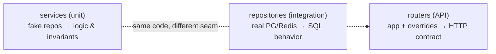

# Strategy & the Test Pyramid

**Owner:** Engineering (QA) · **Last reviewed:** 2026-07-06
**Realizes:** NFR-MAINT-02, Volume 10 §06 (seams)

What to test at each level, with what tools, and the conventions that keep the suite fast and
trustworthy. The seams come from the DI design (Volume 10 §02): services take injected dependencies,
so each layer is testable in isolation.

---

## Levels: what goes where

### Unit (many, fast, no I/O)

- **What:** services and pure logic — the FSM transition rules, fare calculation, ledger split,
  eligibility predicate, matching ranking, cancellation-fee logic.
- **How:** construct the service with **fake repositories / UoW** (Volume 10 §02). No DB, no Redis, no
  HTTP. Milliseconds each.
- **Why here:** business rules and invariants are logic — they belong where logic is tested fastest.

```python
# backend unit test — a business invariant, no I/O
async def test_wrong_pickup_otp_keeps_trip_arrived():          # T-TRIP-02, R-TRIP-2
    trip = make_trip(state="arrived", pickup_otp="4417")
    svc = TripService(FakeUoW(), FakeTripRepo(trip), FakeOutbox())
    with pytest.raises(InvalidPickupOtpError):
        await svc.transition(trip.id, TripEvent.start(otp="0000"), ctx)
    assert (await FakeTripRepo(trip).get(trip.id)).state == "arrived"   # unchanged
```

### Integration (some, real infra)

- **What:** repositories (real SQL, `FOR UPDATE`, partial-unique, PostGIS), event consumers, the
  outbox relay, and **migrations**.
- **How:** spin **real Postgres+PostGIS and Redis** (testcontainers / CI services, Volume 11). Assert
  the actual database behavior — the things a fake can't fake.
- **Why here:** the double-accept lock, the `uq_ledger_txn_idem` constraint, and `ST_Contains` only
  really exist in a real database.

```python
# integration test — the DB actually enforces the invariant
async def test_double_accept_only_one_wins(db):                # T-TRIP-01 / T-MATCH-*
    trip = await seed_searching_trip(db)
    r1, r2 = await asyncio.gather(
        accept(db, trip.id, driver=A), accept(db, trip.id, driver=B),
        return_exceptions=True)
    assert sum(1 for r in (r1, r2) if isinstance(r, RideAlreadyTakenError)) == 1  # exactly one 409
```

### API / contract (some, HTTP-level)

- **What:** full request→response for key endpoints — auth, error envelope, idempotency, pagination,
  RBAC.
- **How:** build the app via `create_app()` with `dependency_overrides` and a real test DB (Volume 10
  §02). Hit endpoints with a client; assert status codes, the [error envelope](../07_API/04_errors-pagination-idempotency.md),
  and headers.
- **Also:** the **contract test** — the generated OpenAPI is diffed for breaking changes (Volume 11
  §02); generated clients must compile.

### E2E / full-flow (few, slowest)

- **What:** the core journeys end-to-end — book→match→trip→settle, driver onboarding→online→trip.
  Includes the **connectivity-drop** journeys ([05](05_resilience-and-e2e.md)).
- **How:** real stack in a test environment; mobile flows via Expo/RN E2E tooling; admin flows via
  browser automation.
- **Why few:** slow and broad; reserved for "does the whole thing actually work together".

---

## Tooling

| Layer        | Backend                                                        | Mobile                   | Admin          |
| ------------ | -------------------------------------------------------------- | ------------------------ | -------------- |
| Unit         | **pytest** + pytest-asyncio                                    | Jest + RTL               | Vitest + RTL   |
| Integration  | pytest + **testcontainers** (PG/Redis)                         | —                        | —              |
| API/contract | httpx + app, OpenAPI diff                                      | generated-client compile | —              |
| E2E          | pytest + real env                                              | **Maestro/Detox** (Expo) | **Playwright** |
| Load/stress  | **k6 / Locust** ([03](03_load-and-stress.md))                  | —                        | —              |
| Security     | ZAP, Trivy, Bandit, secret scan ([04](04_security-testing.md)) | —                        | —              |

All of it runs in the [CI pipeline (Volume 11)](../11_Infrastructure/02_ci-cd.md), path-scoped so a
mobile change doesn't run backend integration tests.

---

## Test conventions

- **Test IDs:** correctness tests for a rule/invariant carry the `T-###` id from the
  [catalog](02_test-catalog.md) in the test name or a marker, so a test traces back to its rule.
- **Arrange-Act-Assert**, one behavior per test, descriptive names (`test_<behavior>_<condition>`).
- **Deterministic:** no real clock/network/randomness — inject them. Flaky tests are bugs and are
  fixed or quarantined immediately (a flaky suite erodes trust in green).
- **Factories over fixtures-of-fixtures:** `make_trip(...)`, `seed_driver(...)` builders keep setup
  readable.
- **No test depends on another test's state.** Each is isolated (fresh DB txn rolled back, or
  truncation between integration tests).
- **Fast by default:** the unit suite runs in seconds locally; developers run it constantly.

---

## The three-tier seam (why it's cheap to test well)



Because layering is enforced by DI (Volume 10 §02/§06), each layer has exactly the dependencies it
needs and nothing more — so each is tested at the cheapest level that can catch its failures. This is
the practical payoff of the whole modular-monolith design.
