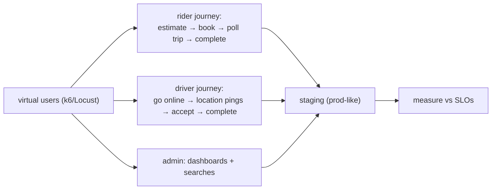

# Load, Stress & Performance Testing

**Owner:** Engineering (SRE + QA) · **Last reviewed:** 2026-07-06
**Realizes:** NFR-PERF-_, NFR-SCALE-_, A6.3 (seasonal peaks)

Functional tests prove _correct_; these prove _fast enough and won't fall over_. The NFR targets
(Volume 3) are the acceptance bar — a target without a test is an opinion (Volume 3 principle), so
here's how each is validated.

---

## Types of performance testing

| Type            | Question                                                   | When                         |
| --------------- | ---------------------------------------------------------- | ---------------------------- |
| **Load**        | Does it meet latency/throughput SLOs at expected traffic?  | pre-release, ongoing         |
| **Stress**      | Where does it break, and how?                              | capacity planning            |
| **Soak**        | Does it degrade over hours (leaks, connection exhaustion)? | pre-major-release            |
| **Spike**       | Can it absorb a sudden surge?                              | before seasonal peaks (A6.3) |
| **Scalability** | Does adding pods add capacity ~linearly?                   | validating autoscaling       |

---

## Scenarios that model the real marketplace

We don't hammer one endpoint; we model **realistic mixes** of the actual flows (Volume 4/5):

| Scenario               | Models                                | Key metric (target)                                       |
| ---------------------- | ------------------------------------- | --------------------------------------------------------- |
| **Estimate storm**     | riders pricing trips                  | estimate P95 ≤ 800 ms (NFR-PERF-03)                       |
| **Booking + matching** | request→match under supply            | assignment P95 ≤ 3 s (NFR-PERF-04)                        |
| **Location firehose**  | thousands of driver pings/sec         | Redis GEO write path; nearby query ≤ 100 ms (NFR-PERF-07) |
| **Live tracking**      | many concurrent WS trip subscriptions | location propagation ≤ 2 s (NFR-PERF-05)                  |
| **Settlement burst**   | many trips completing at once         | no settlement backlog; ledger stays consistent            |
| **Read-heavy admin**   | ops dashboards + reports              | served from replicas, no primary impact (Volume 6 §05)    |

The **location firehose** and **WebSocket fan-out** are the distinctive load profiles of a
ride-hailing system — they validate the ADR-0003 Redis-vs-Postgres split and the realtime gateway
scaling (Volume 4). A design that's correct but melts under location writes isn't done.

---

## Seasonal peak / spike testing (A6.3)

Kashmir demand is **spiky and seasonal** (tourist peaks at Gulmarg/Pahalgam/Sonmarg). We explicitly
spike-test to the **10× headroom** claim (NFR-SCALE-03):

- Ramp traffic sharply (not gradually) to simulate a tourist-season surge or event.
- Assert **autoscaling reacts in time** (HPA on CPU/queue/connections, Volume 11 §03) and SLOs hold
  through the ramp, not just at steady state.
- Confirm the **stateless tiers scale out** and the **data tier** (managed, replicas) absorbs the
  read/write shape — the whole point of the Volume 4 architecture.

If a spike test needs a _redesign_ to pass, that's a finding for architecture; if it needs a _number
tuned_ (max replicas, connection pool), that's expected (NFR-SCALE-03).

---

## Where and how

- **Run against staging** (prod-like, same image — Volume 11), never production, with
  representative seed data volumes (Volume 6 partitioning matters at scale).
- **Tools:** k6 or Locust for HTTP + a WS load harness for realtime; results tracked over time to
  catch regressions.
- **Profile the bottleneck:** when a target misses, use traces (Volume 11 §05) + slow-query logs
  (Volume 6 §05) to find _where_ — DB, Redis, a lock, or a pool — before optimizing. No blind tuning.

---

## Performance regression guard

- Key scenarios run on a schedule (and before major releases), comparing against baselines. A
  significant regression is treated like a failing test.
- **N+1 queries** and unindexed hot queries are caught in review + `EXPLAIN` (Volume 6 §05) before
  they reach a load test — cheaper to catch early.

---

## Acceptance: NFR → test mapping

| NFR                                   | Validated by                         |
| ------------------------------------- | ------------------------------------ |
| NFR-PERF-01/02 (API P95)              | load scenarios, per-endpoint latency |
| NFR-PERF-03 (estimate)                | estimate storm                       |
| NFR-PERF-04 (match)                   | booking+matching scenario            |
| NFR-PERF-05 (location propagation)    | live-tracking WS load                |
| NFR-PERF-07 (geo query)               | location firehose                    |
| NFR-SCALE-01/03 (scale out, 10× peak) | scalability + spike tests            |
| NFR-AVAIL (no degradation on deploy)  | load during a rolling deploy         |

An NFR is "met" only with **evidence from one of these** (Volume 3 acceptance rule) — not a claim.
