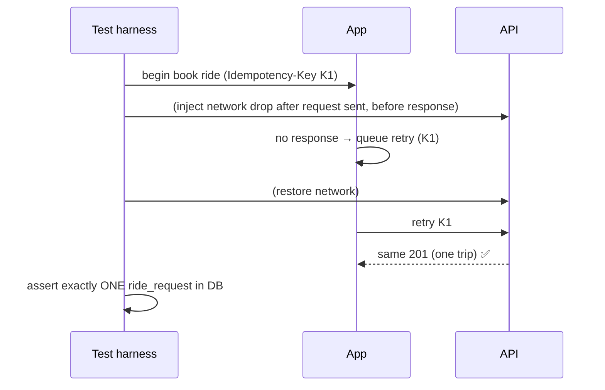
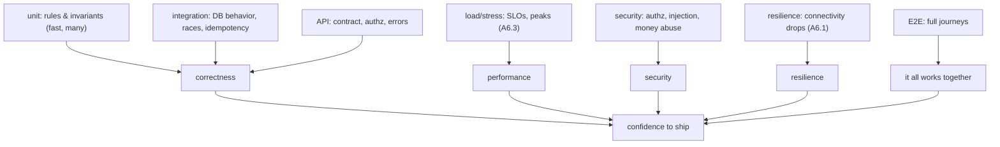

# Resilience & End-to-End Testing

**Owner:** Engineering (QA + SRE) · **Last reviewed:** 2026-07-06
**Realizes:** A6.1, NFR-RESIL-*, FR-TRIP-07, Volume 4/8 resilience design

The whole handbook makes a bet that the system stays correct on Kashmir's unreliable network (A6.1).
This document is where that bet is **verified** — the connectivity-drop journeys, chaos tests, and
the full-flow E2E scenarios that exercise the real stack the way a real user (on a real spotty
network) would.

---

## Resilience testing (the A6.1 proof)

The resilience design spans server (Volumes 5–7) and client (Volume 8). Neither half is trusted until
tested _together_, dropping the network at the worst moments.

### The connectivity-drop matrix

We drop the connection at **each stage** of the core loop and assert **no duplication, no loss, and
recovery to server truth**:

| Drop point                         | Expected behavior                                                   | Test                       |
| ---------------------------------- | ------------------------------------------------------------------- | -------------------------- |
| During **booking** (`POST /rides`) | retry with same idempotency key → **one** trip, not two             | `T-RESIL-02`               |
| During **accept**                  | retry → driver assigned once; late/dup accept → 409                 | `T-RESIL-02`, `T-MATCH-05` |
| During **trip start** (OTP)        | retry safe; wrong OTP still blocked                                 | `T-TRIP-02`                |
| During **completion**              | retry → **one** settlement (idempotent)                             | `T-TRIP-04`, `T-PAY-07`    |
| **Mid-trip** (WS + REST both drop) | reconnect → `GET /trips/active` reconciles; no stuck/duplicate trip | `T-RESIL-01`               |
| **App killed & restarted** offline | queued intents persist (MMKV) and replay on reconnect               | `T-RESIL-01`               |
| **Push undeliverable**             | critical event arrives via SMS fallback                             | `T-RESIL-03`               |

These tests are **first-class**, run in CI's E2E stage (Volume 11) — because in this market, the
connectivity-drop path _is_ a common path, not an edge case (A6.1).

### Idempotency as an assertion

For **every** mutating endpoint, a resilience test replays the same idempotency key and asserts a
**single** side-effect (`T-RESIL-02`). Backed by the two-tier guarantee (Redis + DB unique
constraints, Volume 6/7), this is what makes "the unreliable network can't cause a money/state bug"
a _tested fact_, not a design hope.

---

## Chaos testing (fault injection)

Beyond the network, we inject infrastructure faults in staging and assert graceful behavior:

| Fault                      | Expected                                                                                               |
| -------------------------- | ------------------------------------------------------------------------------------------------------ |
| Kill an API/WS/worker pod  | requests reroute (stateless); in-flight trips survive (state in Postgres); no lost settlement (outbox) |
| Flush Redis                | locations/idempotency repopulate; DB constraints prevent dupes; no corruption (Volume 6 §04)           |
| Add DB latency             | timeouts handled, no cascading failure; latency SLOs degrade gracefully                                |
| Promote replica (failover) | app reconnects; RTO/RPO targets met (Volume 11 §06)                                                    |
| Rolling deploy under load  | zero dropped requests; migrations backward-compatible (Volume 6/11)                                    |

Chaos findings feed the runbooks (Volume 13). **Game days** rehearse these with the on-call team so
the response is practiced, not improvised.

---

## End-to-End full-flow tests

The few, high-value journeys that prove the whole system works together — real stack, real
DB/Redis, mobile + admin.

### Core journeys

| Journey                        | Steps                                                                         | Verifies                                     |
| ------------------------------ | ----------------------------------------------------------------------------- | -------------------------------------------- |
| **Rider happy path**           | signup→OTP→estimate→book→match→track→pickup OTP→complete→pay→rate             | the entire core loop (Volume 3 MVP)          |
| **Driver lifecycle**           | apply→KYC→approve (admin)→online→receive offer→accept→drive→complete→earnings | onboarding + earning (Volume 5/9)            |
| **Cash vs wallet settlement**  | complete a cash trip and a wallet trip                                        | ledger correctness both paths (Volume 5 §05) |
| **Dispute + refund**           | complete trip→rider disputes→admin reviews evidence→refund→rider notified     | ops workflow + reversing refund (Volume 9)   |
| **Connectivity-survived trip** | run the rider happy path with injected drops                                  | resilience end-to-end (A6.1)                 |

### How E2E is kept sane

- **Few and focused** — E2E is slow; we cover _journeys_, not every permutation (those are unit/API).
- **Stable selectors & data builders** — deterministic seed data, no reliance on incidental state.
- **Runs pre-release** in a prod-like environment (Volume 11), plus a smaller smoke subset on every
  staging deploy.
- **Mobile via Maestro/Detox, admin via Playwright** (Volume 12 §01 tooling).

---

## The complete picture

Every arm traces to requirements (Volume 3) and invariants (Volumes 5–6). Together they're why a
small team can ship changes to a money-handling, safety-critical marketplace on an unreliable network
**and know it still works** — which was the entire promise of this handbook.
