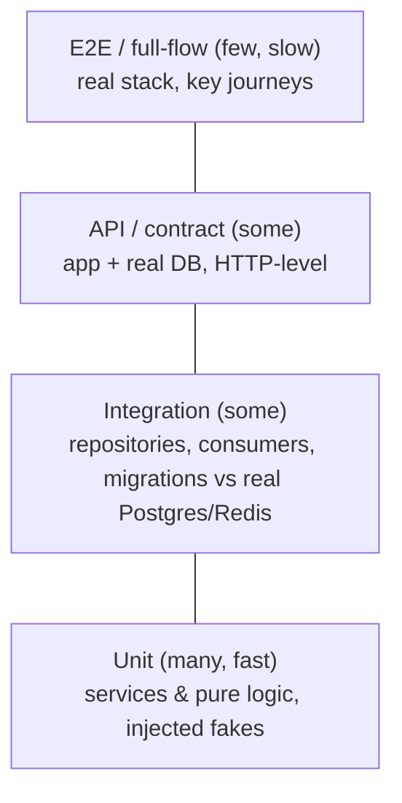

# Volume 12 — Testing Strategy

> How we prove the system works — and keep proving it. Testing isn't a phase; it's the mechanism that
> lets a small team change a money-handling marketplace with confidence. Every **MUST** requirement
> and every **invariant** from the design volumes has a test that names it, closing the chain
> **rule (V2) → FR (V3) → story (V3) → test (this volume)**.

**Owner:** Engineering (QA + all) · **Last reviewed:** 2026-07-06

---

## Contents

| Doc                                                      | Topic                                                  |
| -------------------------------------------------------- | ------------------------------------------------------ |
| [01_strategy-and-pyramid.md](01_strategy-and-pyramid.md) | Philosophy, the pyramid, what to test where, tooling   |
| [02_test-catalog.md](02_test-catalog.md)                 | The `T-###` catalog — every test mapped to its rule/FR |
| [03_load-and-stress.md](03_load-and-stress.md)           | Performance, load, stress, soak, seasonal-peak testing |
| [04_security-testing.md](04_security-testing.md)         | AuthZ, OWASP, fuzzing, dependency & secret scanning    |
| [05_resilience-and-e2e.md](05_resilience-and-e2e.md)     | Connectivity-drop (A6.1), chaos, full-flow E2E         |

> Related: the [DI test seams (V10 §06)](../10_Backend/06_conventions-and-testing.md) and the
> [traceability matrix (V3)](../03_Requirements/03_traceability-matrix.md) that this volume completes.

---

## Testing philosophy

1. **Tests assert behavior, not implementation.** A test pins _what the system does_ (a wrong OTP
   can't start a trip), so refactors don't break tests, bugs do.
2. **Every MUST requirement and invariant has a test.** The invariants in Volumes 5–6 (I-/M-/P-/W-/
   A-/D-/N-) were written _to be tested_; this volume is where they're asserted.
3. **The riskiest code gets the most tests.** Money, the trip FSM, matching races, and idempotency
   get disproportionate, adversarial testing — that's where a bug is catastrophic.
4. **Fast feedback dominates.** Most tests are fast unit tests (no I/O); slower integration/E2E are
   fewer and reserved for what only they can catch.
5. **Green CI = shippable.** The pipeline (Volume 11) runs the suite on every PR; green means the
   asserted behavior holds.
6. **A bug fixed gets a test.** Every fixed defect ships with a regression test so it can't return.

---

## The pyramid (and why this shape)

Most confidence per second comes from **many fast unit tests** at the bottom; each higher layer is
fewer, slower, and reserved for what the layer below can't verify. The DI design (Volume 10 §02)
gives clean seams at each level, so this shape is natural, not forced.

## Coverage philosophy

We measure coverage but **don't worship a percentage**. The bar is: _every MUST FR and every stated
invariant is asserted_, and the risky paths (money, FSM, races, idempotency) are covered
adversarially. A 100%-covered codebase that never tests the double-accept race is worse-tested than
an 80%-covered one that does. Coverage is a _floor and a smell detector_, not the goal.
