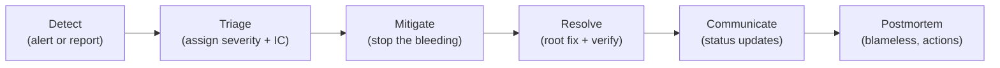

# Incident Response

**Owner:** Engineering (SRE) · **Last reviewed:** 2026-07-06
**Realizes:** NFR-AVAIL, NFR-OBS-03, Volume 2 (safety SLA)

An incident is any unplanned degradation of service. This page defines how we classify, respond to,
communicate about, and learn from them — so response is a **practiced procedure**, not improvisation.

---

## Severity levels

| Sev      | Definition                                                | Examples                                                                                     | Response                              |
| -------- | --------------------------------------------------------- | -------------------------------------------------------------------------------------------- | ------------------------------------- |
| **SEV1** | Critical: platform down or money/safety integrity at risk | API down, settlements failing, ledger not reconciling, safety/SOS pipeline broken, data loss | page immediately, all-hands, war room |
| **SEV2** | Major: significant degradation, core loop impaired        | matching failing in a city, OTP/SMS down (no logins), high error rate, DB failover           | page on-call, escalate fast           |
| **SEV3** | Minor: partial/limited impact, workaround exists          | one non-critical endpoint slow, elevated cancels, dashboard lag                              | on-call handles, business hours OK    |
| **SEV4** | Low: cosmetic / no user impact                            | minor UI bug, noisy non-critical alert                                                       | ticket, normal backlog                |

**Money and safety escalate severity.** A settlement/reconciliation error or a broken SOS path is
**SEV1 even if few users are affected** — correctness and safety aren't graded on volume (Volume 13
philosophy, BR-9).

---

## On-call

- A **primary on-call** carries the pager for system alerts; a **secondary** backs up and is the
  escalation. Rotation is humane (sustainable shifts, handoff notes).
- On-call has the **access and authority** to mitigate: roll back, scale, failover, toggle feature
  flags. They don't need to ask permission to stop the bleeding.
- **Every page-level alert links to a runbook** ([02](02_runbooks.md)). If an alert has no runbook,
  writing one is a follow-up action — an alert you can't act on is noise.

---

## Incident lifecycle



1. **Detect** — an alert fires (preferred) or a report arrives. Ack the page.
2. **Triage** — assign a **severity** and an **Incident Commander (IC)** (for SEV1/2 the IC
   coordinates; responders execute). Open an incident channel + timeline.
3. **Mitigate first, diagnose second.** Stop user pain now — **roll back** the recent deploy,
   **scale** the starved tier, **failover** the DB, **flip a feature flag**. Root-causing can wait
   until users are safe. (Most incidents correlate with a recent change — check deploys first.)
4. **Resolve** — apply the real fix, **verify** via the dashboards/metrics that the symptom is gone
   and stays gone.
5. **Communicate** — keep stakeholders (and, for user-facing outages, users) updated on a cadence.
   Silence during an outage erodes trust more than the outage.
6. **Postmortem** — blameless writeup within a few days.

### Mitigation-first toolbox (the reflexes)

| Symptom                                    | First reflex                                            |
| ------------------------------------------ | ------------------------------------------------------- |
| Errors/latency spiked right after a deploy | **roll back** to previous digest (Volume 11 §03)        |
| A tier is saturated                        | **scale** it (bump HPA max / replicas)                  |
| Primary DB unhealthy                       | **failover** to replica (runbook 02)                    |
| A specific feature is misbehaving          | **disable its feature flag** (Volume 10 §03)            |
| A bad actor / traffic flood                | tighten **rate limits** / block at edge (Volume 11 §04) |

---

## Communication

- **Internal:** a single incident channel + a running **timeline** (what we saw, did, when) — the
  timeline is the raw material for the postmortem.
- **External:** for user-facing SEV1/2, a status update through the appropriate channel, honest and
  regular. For **safety** incidents, follow the safety-response policy (Volume 14) — the affected
  user is contacted per policy, not left in the dark.
- **Roles:** IC coordinates; a comms lead handles external updates on larger incidents so responders
  stay heads-down.

---

## Blameless postmortems

Every SEV1/SEV2 gets a written postmortem, focused on **the system**, not the person:

```
- Summary & impact (who/what/how long, users affected)
- Timeline (detection → mitigation → resolution)
- Root cause (technical + contributing process factors — the "5 whys")
- What went well / what didn't
- Action items (owned, dated, tracked to done)
```

Rules:

- **Blameless language.** "The deploy lacked a migration guard," not "X forgot." People act
  reasonably given the info they had; if the system let a mistake cause an outage, fix the system.
- **Actions get done.** A postmortem whose action items rot is theater. They're tracked like any
  work and reviewed.
- **Feed the loop.** Actions commonly produce: a new/updated **runbook**, a new **alert** (we were
  paged late), a new **test** (Volume 12 regression), or a **guardrail** (make the mistake
  impossible). This is how the system gets more reliable over time.

---

## Practice: game days

We rehearse (Volume 12 chaos §05): inject a failure in staging, run the incident process end-to-end,
and confirm the runbooks and the team work. A runbook that's never been executed is a draft; a
game-day makes it real, and times our RTO (Volume 11 §06).
