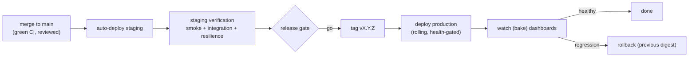

# Release Process

**Owner:** Engineering (SRE + all) · **Last reviewed:** 2026-07-06
**Realizes:** ADR-0002 (trunk-based), Volume 11 CI/CD, Volume 6 migrations

How a change goes from merged to serving users, **safely and reversibly**. The mechanism is Volume 11
(CI/CD, k8s); this page is the _process and the gates_ — the human decisions around the automation.

---

## Cadence & flow

Trunk-based (ADR-0002): `main` is always releasable. We **release frequently in small increments** —
small releases are low-risk releases (easy to verify, easy to roll back).

---

## The release gate (go/no-go)

Before promoting a release to production, the gate checks:

- [ ] **CI fully green** (lint, types, boundaries, tests, contract, image scan — Volume 11 §02).
- [ ] **Staging verified** — smoke + key integration + **resilience (connectivity-drop) tests** pass
      on staging (Volume 12 §05).
- [ ] **Migrations reviewed** — additive/expand phase only; reversible; no destructive change in the
      same release that stops using the data (expand→contract, Volume 6 §06).
- [ ] **Error budget** has room — if the availability SLO is already burning (Volume 11 §05), we
      **slow down** risky releases (that's what error budgets are _for_).
- [ ] **Rollback plan** clear — previous digest known; feature flag for anything incomplete.
- [ ] **Timing** — default to off-peak; avoid deploying into a known demand spike (A6.3) unless it's
      the fix.

A "no" on any gate isn't a failure — it's the process working.

---

## Deploying safely

- **Rolling, health-gated** (Volume 11 §03): new pods take traffic only after `/readyz` passes;
  `maxUnavailable: 0` keeps capacity. Zero-downtime by construction (NFR-AVAIL-03).
- **Migrations run as a pre-deploy Job** (expand phase) so the schema is ready before new code
  (Volume 6/11).
- **Bake time:** after prod deploy, **watch the dashboards** (error rate, latency, match rate,
  settlement success) for a defined window before calling it done. Most regressions show fast.

---

## Feature flags (decoupling deploy from release)

- **Deploy ≠ release.** Incomplete or risky features merge behind a **feature flag** (dynamic config,
  Volume 10 §03) so trunk stays shippable (ADR-0002) and we control _when_ users see a feature.
- **Progressive rollout:** enable a feature for a small cohort/city first, watch metrics + guardrails
  (Volume 2), then widen. A flag flip is instant and needs no deploy — and is the fastest "rollback"
  for a feature-level problem.
- Flags default **off/safe** and are cleaned up once a feature is fully shipped (stale flags are
  debt).

---

## Rollback

- **App rollback** = redeploy the **previous digest** (`rollout undo`, Volume 11 §03) — fast,
  known-good. Safe because pods are stateless and schema is backward-compatible (expand→contract).
- **Feature rollback** = flip the flag off — instant.
- **Migration rollback** = the `downgrade()` exists (Volume 6), but the _destructive_ (contract)
  step is always a _separate later release_, so the common rollback never has to reverse a
  destructive change. This is the whole reason for expand→contract.
- **Data rollback** = PITR (Volume 11 §06) — heavy, IC-led, last resort (RB-05).

> **Golden rule:** the deploy that _removes_ usage of old data and the migration that _deletes_ it
> are never the same release. That invariant is what makes rollback boring.

---

## Change management & communication

- **Every release is traceable:** the tag maps to a git range and a changelog (Conventional Commits,
  Volume 1), so "what shipped?" is always answerable — critical during an incident (check recent
  deploys first, RB-04).
- **Higher-risk changes** (migrations, auth, payments, infra) require a second reviewer (Volume 1) and
  extra scrutiny at the gate.
- **Announce** notable releases to the team; for user-affecting changes, coordinate with ops/support
  so they're not surprised.

---

## Mobile releases (different constraints)

- **OTA** (Volume 8) for JS-only fixes → fast, no store review; staged per channel, rollback by
  repointing the channel.
- **Store builds** for native changes → slower; must remain **API-version-compatible** (Volume 7) so
  older installed apps keep working (we never break a shipped client — additive API changes only,
  Volume 7 versioning).
- Because users update infrequently, the backend supports **multiple app versions concurrently** —
  another reason API changes are additive by default.

---

## Why this makes us fast, not slow

Every safeguard here — gates, flags, rolling deploys, expand→contract, fast rollback — exists so the
team can **ship often without fear**. Safety and speed aren't opposites; the reversibility _is_ what
lets us move quickly on trunk-based development (ADR-0002). A release you can undo in one command is
a release you can make confidently.
