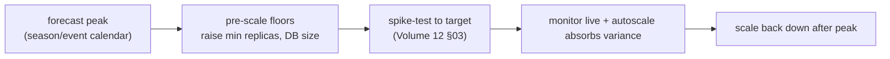

# Scaling & Capacity Planning

**Owner:** Engineering (SRE) · **Last reviewed:** 2026-07-06
**Realizes:** NFR-SCALE-*, A6.3 (seasonal peaks), Volume 4/11

How we ensure there's enough capacity for demand — routinely, and for Kashmir's **spiky, seasonal**
patterns (A6.3). The architecture (stateless tiers, managed data, autoscaling — Volume 4/11) makes
scaling mostly a matter of _numbers to tune_, not redesign. This page is how we tune them.

---

## What scales how

| Tier       | Scaling                      | Signal                        | Notes                                          |
| ---------- | ---------------------------- | ----------------------------- | ---------------------------------------------- |
| API        | horizontal (HPA)             | CPU / req rate                | stateless — add pods freely                    |
| WS gateway | horizontal (HPA)             | active connections            | near-stateless; connections rebalance          |
| Workers    | horizontal (HPA)             | **queue depth**               | scale to drain settlement/notif/match backlog  |
| Postgres   | vertical + **read replicas** | CPU, connections, replica lag | writes → primary; reads → replicas; deliberate |
| Redis      | managed HA / memory          | throughput, memory            | TTLs bound growth (Volume 6 §04)               |

The **stateless tiers scale out automatically**; the **stateful tier scales deliberately** (capacity
planning, not reflex). That asymmetry is the core of the strategy (NFR-SCALE).

---

## Routine capacity planning

- **Headroom target:** run tiers with enough baseline headroom that a normal daily peak never
  saturates before autoscaling reacts. Autoscaling handles _variation_; capacity planning sets the
  _floor and ceiling_ (`minReplicas`/`maxReplicas`, Volume 11 §03).
- **Trend on the metrics** (Volume 11 §05): request rate, active drivers/riders, DB CPU/connections,
  Redis memory. Growth is visible weeks ahead — provision before it's urgent.
- **The data tier is the usual limiter.** Stateless pods are cheap to add; the primary DB is not.
  Watch **connections** (pooler sizing) and **write throughput** first — that's where scale bites
  (Volume 6 §05).

---

## Seasonal & event peaks (A6.3) — the Kashmir specifics

Tourist season (Gulmarg/Pahalgam/Sonmarg) and events drive **sharp, predictable** surges; winter and
off-season bring troughs. We plan for both:

- **Forecast, then pre-scale.** For a known peak, raise `minReplicas` and (if needed) the DB tier
  **ahead of time** — don't rely solely on reactive autoscaling for a sharp ramp.
- **Validate with a spike test** (Volume 12 §03) to the expected multiple **before** the season, so
  the 10× headroom claim (NFR-SCALE-03) is proven, not assumed.
- **Supply side matters too:** a demand peak needs **driver supply** — coordinate with ops on
  incentives (Volume 2), because more pods don't help if there are no drivers (that's RB-02, a
  business lever, not an eng one).
- **Scale back down** after the peak to control cost — troughs are real here.

---

## Cost vs. performance

- Autoscaling ceilings and DB sizing are a **cost/latency trade-off** — we tune to meet SLOs
  (Volume 11 §05) with sensible headroom, not to gold-plate. Off-season, floors come down.
- **Small images + fast startup** (Volume 11 §01) mean autoscaling reacts quickly and cheaply — a pod
  that starts fast defends an SLO during a ramp.

---

## When to scale vs. when to fix

Not every capacity problem is solved by more resources:

| Symptom                             | Scale?            | Or fix?                                 |
| ----------------------------------- | ----------------- | --------------------------------------- |
| Even load, all tiers busy at peak   | ✅ scale out / up | —                                       |
| One slow endpoint dominating DB     | ❌                | fix the query / index (Volume 6 §05)    |
| Worker backlog from a slow consumer | maybe             | also profile the consumer               |
| Connection exhaustion               | tune pooler       | and find the query storm                |
| Redis memory climbing unbounded     | ❌                | find the missing-TTL key (Volume 6 §04) |

Throwing capacity at an **efficiency bug** just raises the bill and delays the real fix. Diagnose with
traces + slow-query logs (Volume 11 §05) first — the same discipline as load testing (Volume 12 §03).

---

## When scaling out isn't enough (the horizon)

The modular monolith scales as one unit until a module's load justifies **extraction** into its own
service (ADR-0004). Per-module metrics (Volume 11 §05) tell us _when_: if matching or the realtime
gateway becomes the persistent bottleneck, its enforced boundary (Volume 10 §06) makes extraction a
localized change. We extract on **evidence**, not speculation — and the door is already open by design.
