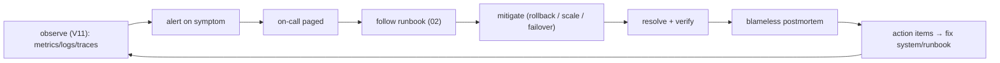

# Volume 13 — Production Operations

> How we run Zaroorat Ride in production — the day-to-day and the 3am. Volume 11 built the
> observability and DR _capability_; this volume is the _human procedure_: how we respond to
> incidents, ship releases safely, scale for demand, and keep the database healthy. Every
> page-level alert from Volume 11 links to a runbook here.

**Owner:** Engineering (SRE / On-call) · **Last reviewed:** 2026-07-06

---

## Contents

| Doc                                                      | Topic                                                            |
| -------------------------------------------------------- | ---------------------------------------------------------------- |
| [01_incident-response.md](01_incident-response.md)       | Severities, on-call, escalation, incident lifecycle, postmortems |
| [02_runbooks.md](02_runbooks.md)                         | Step-by-step runbooks for the critical alerts                    |
| [03_release-process.md](03_release-process.md)           | Cadence, rollout gates, feature flags, rollback, change mgmt     |
| [04_scaling-and-capacity.md](04_scaling-and-capacity.md) | Scaling playbooks, capacity planning, seasonal peaks             |
| [05_database-maintenance.md](05_database-maintenance.md) | Partitions, vacuum, reconciliation, backup verification          |

> Related: [Observability & alerts (V11 §05)](../11_Infrastructure/05_observability.md) ·
> [Backups/DR (V11 §06)](../11_Infrastructure/06_backups-and-dr.md) ·
> [Kubernetes (V11 §03)](../11_Infrastructure/03_kubernetes.md).

---

## Operations philosophy

1. **Blameless.** Incidents are system failures, not people failures. We fix the system and the
   process, never punish the person who was holding the pager.
2. **Runbooks over heroics.** The answer to "what do I do?" is a written, tested runbook — not a
   scramble or one person's memory. Every page has one ([02](02_runbooks.md)).
3. **Detect before users report.** Alerts fire on symptoms _before_ riders and drivers feel them
   (Volume 11 §05). A customer telling us first is a monitoring gap.
4. **Safe by default.** Releases are gradual and reversible; rollback is fast (a digest, Volume 11).
   The safe path is the easy path.
5. **Money & safety are special.** A settlement error or a safety incident is a top-severity event
   regardless of how few users it touches.
6. **Learn every time.** Every significant incident gets a blameless postmortem with actions that get
   done — the loop closes.

## The operational loop

## What "healthy" means (the at-a-glance)

| Signal                  | Healthy                          | Source                  |
| ----------------------- | -------------------------------- | ----------------------- |
| API availability        | ≥ 99.5% SLO, budget not burning  | V11 §05                 |
| Match rate / pickup ETA | ≥ 85% / ≤ 5 min                  | V2 / ops dashboard (V9) |
| Settlement success      | ~100%, ledger reconciles to zero | V5 §05                  |
| OTP/SMS delivery        | succeeding (logins work)         | V11 alert               |
| Workers                 | queue drained, no DLQ growth     | V10 §05 / V11           |

Any of these red is a defined response below.
