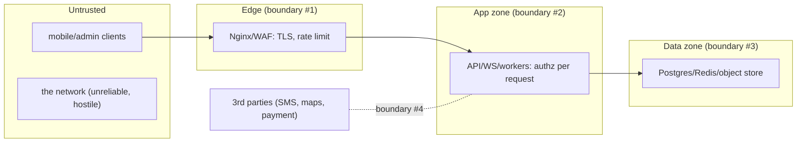

# Threat Model

**Owner:** Engineering (Security) · **Last reviewed:** 2026-07-06

A threat model answers: _what are we protecting, from whom, and how could they get in?_ We use it to
prioritize controls where the risk is real, not to spread effort evenly. We frame threats with
**STRIDE** and anchor them to the **trust boundaries** from Volume 4.

---

## Assets (what we protect, ranked)

| Asset                                    | Sensitivity | Why                                              |
| ---------------------------------------- | ----------- | ------------------------------------------------ |
| **The money ledger & wallets**           | Critical    | direct financial loss; fraud target              |
| **Rider/driver live location**           | Critical    | physical safety                                  |
| **PII: phone, Aadhaar/PAN, licence, RC** | Critical    | identity theft, legal (DPDP)                     |
| **Auth credentials / tokens**            | Critical    | account takeover → everything else               |
| **Admin/ops accounts**                   | Critical    | privileged access to money + data                |
| **Trip & pricing data**                  | High        | business + dispute integrity                     |
| **Availability of the platform**         | High        | riders/drivers depend on it for income/transport |

---

## Adversaries

| Actor                      | Motivation                     | Example                                 |
| -------------------------- | ------------------------------ | --------------------------------------- |
| **Fraudulent rider**       | free/cheap rides, wallet abuse | promo abuse, chargebacks, fake disputes |
| **Fraudulent driver**      | inflate earnings               | fake/GPS-spoofed trips, collusion       |
| **Account thief**          | takeover                       | OTP interception, credential stuffing   |
| **External attacker**      | data theft, ransom, disruption | API abuse, injection, DDoS              |
| **Malicious insider**      | fraud, data theft              | ops abusing refunds / viewing PII       |
| **Opportunist**            | curiosity/harm                 | IDOR to view others' trips/location     |
| **Physical-safety threat** | stalking/harm                  | abusing location/contact features       |

The **insider** and **physical-safety** actors are easy to under-weight and are taken seriously here
— hence RBAC + separation of duties (Volume 9) and the safety controls (R-SAFE-*).

---

## Attack surface & trust boundaries (Volume 4)

- **#1 Edge:** the only public entry; TLS, WAF, rate limits (Volume 11 §04).
- **#2 App:** default-deny authz on every request — the real gate (Volume 7/10).
- **#3 Data:** reachable only from the app zone; never public (Volume 4/11).
- **#4 Third parties:** SMS/maps/payment are external trust boundaries — validated inputs, verified
  webhooks, scoped keys.

Each boundary is a place an attacker must defeat; **defense in depth** means beating one isn't enough.

---

## STRIDE analysis (threat → control)

| STRIDE                     | Threat                                         | Control (where)                                                                                 |
| -------------------------- | ---------------------------------------------- | ----------------------------------------------------------------------------------------------- |
| **S**poofing               | fake identity, OTP interception, token forgery | OTP + rate limits (V5); signed JWT, refresh rotation (V5/10); TLS (V11)                         |
| **T**ampering              | alter fares, trips, ledger, requests in flight | server-authoritative FSM/pricing (V5); **immutable ledger** (V6); TLS; input validation (V7)    |
| **R**epudiation            | "I didn't do that" (a refund, a trip)          | **audit log** actor+before/after (V6); trip_events; append-only (V6)                            |
| **I**nformation disclosure | read others' trips/PII/location (IDOR), leaks  | **default-deny + ownership checks** (V7); error hygiene no leaks (V7); encryption at rest (V14) |
| **D**enial of service      | flood API, OTP-bomb, exhaust DB                | edge + app rate limits (V11/7); autoscaling (V11); WAF                                          |
| **E**levation of privilege | rider→driver→admin, scope bypass               | RBAC scopes server-enforced (V9); least privilege; non-root containers (V11)                    |

Every row maps to a control **already specified** in a prior volume — the threat model isn't asking
for new machinery, it's confirming coverage. Gaps (if found) become action items.

---

## Highest-priority risks (where we invest most)

1. **Account takeover via OTP** — the front door. Rate limits, lockout, and (for admins) MFA
   (Volume 14 §02). In a market where SMS is the channel, OTP hygiene is paramount.
2. **Money fraud** — fake trips, GPS spoofing, promo/wallet abuse, insider refunds. Layered:
   idempotency + DB constraints (V6/7), anomaly detection, RBAC + separation of duties (V9/14 §04).
3. **IDOR / broken access control** — the most common web vuln. Uniform default-deny authz + ownership
   checks, tested adversarially (V12 §04).
4. **PII exposure (Aadhaar/PAN/location)** — encryption, access control + audit on sensitive reads,
   minimization, DPDP compliance (V14 §03).
5. **Physical-safety abuse** — location/contact misuse. Reduced share payloads, masked contact, SOS,
   retention for investigation (R-SAFE-*).

---

## Kashmir/India-specific considerations

- **Connectivity disruptions** (A6.1) mean **SMS is a critical channel** — its security (OTP
  interception, SIM-swap risk) matters more; and availability under degraded networks is itself a
  security property (a stranded rider is a safety issue).
- **Aadhaar/PAN handling** carries specific legal sensitivity under Indian law (V14 §03) — these are
  among our most protected data.
- **Regulatory** context (MoRTH aggregator, DPDP) shapes data handling and breach obligations
  (V14 §03/§05).

This model is reviewed as the system and threat landscape evolve — a threat model is a living
document, not a one-time exercise.
