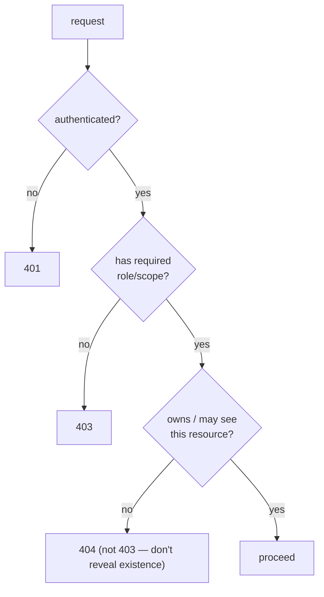

# Authentication & Authorization

**Owner:** Engineering (Security) · **Last reviewed:** 2026-07-06
**Realizes:** NFR-SEC-02/04, R-ACCOUNT-*, Volume 5/7/9/10

Access control is the single most important security domain — most breaches are broken authn or
authz. This consolidates the controls specified across the handbook into one governing view.
Implementation lives in [auth LLD (V5)](../05_Design/01_auth.md), [API (V7)](../07_API/05_openapi-and-clients.md),
[RBAC (V9)](../09_Admin/02_rbac-permissions.md), and [request lifecycle (V10)](../10_Backend/04_request-lifecycle.md).

---

## Authentication (proving who you are)

### Phone + OTP (riders & drivers)

- **OTP** stored **hashed, TTL'd, Redis-only** (never plaintext, never Postgres). Attempts counter +
  lockout; per-phone and per-device rate limits (Volume 5 §01).
- **Delivery risk:** SMS is the channel; we mitigate OTP-bombing (rate limits) and support resend +
  voice fallback (A6.1). SIM-swap/interception risk is why high-value actions add friction (below).
- **No passwords** for end users → no password database to breach, no reuse risk.

### Tokens (sessions)

- **Access JWT:** short-lived (~30 min), signed, validated **statelessly** (Volume 5/10). Carries
  `sub`, roles, scopes — no secrets/PII.
- **Refresh token:** longer-lived, **server-tracked, rotated on each use**; reuse of a rotated token
  signals theft → **revoke the whole chain** (Volume 5, A-3).
- **Revocation:** logout and suspension revoke refresh tokens; short access TTL bounds the exposure
  window (R-ACCOUNT-4).
- **Storage on device:** tokens in the **keychain/keystore** (SecureStore), never plain storage
  (Volume 8).

### Admin authentication (stronger)

- Ops/admin accounts are higher-value → **shorter sessions** and **MFA recommended/required** for
  high-privilege scopes (`refund:issue`, `pricing:write`, `rbac:manage`) (Volume 9).
- Admin account lifecycle (joiner/mover/leaver) is an **audited** process; departing staff are
  de-provisioned immediately.

---

## Authorization (proving what you may do)

### The layered model

Three independent checks, all **server-side, default-deny** (NFR-SEC-04):

1. **Authentication** — valid token, or 401 (Volume 10 §04).
2. **Role/scope** — endpoint declares what it needs (`require_rider`, `require_scope("refund:issue")`);
   missing → 403 (Volume 9/10).
3. **Ownership** — the caller may act on _this specific_ resource. A rider reading another rider's
   trip gets **404, not 403** — we don't confirm the resource exists (Volume 7 §05). This defeats
   **IDOR**, the most common access-control bug.

### The golden rule (restated because it matters most)

> **The client hides; the server enforces.** UI gating is UX. The API independently checks authz on
> every request. A hidden button is not a permission (Volume 9). Tested adversarially in Volume 12
> §04 (`T-SEC-AUTHZ-*`).

### RBAC & separation of duties (admin)

- Roles → **scopes**; least privilege (Volume 9). Not every agent can refund or change pricing.
- **Separation of duties:** e.g. approving drivers and issuing payouts/refunds are different roles, so
  no single insider both onboards and pays out unchecked — an anti-fraud control (Volume 9, threat:
  malicious insider).
- **Sensitive reads** (KYC/PII) require scope **and are audited** (NFR-SEC-03) — we log who _viewed_,
  not just who changed.

---

## Step-up for high-value actions

Some actions warrant more than a valid session:

| Action                            | Extra control                 |
| --------------------------------- | ----------------------------- |
| Large refund / pricing change     | scope + MFA (admin) + audit   |
| Change payout bank details        | re-verify (OTP) + notify user |
| Suspicious login (new device/geo) | additional verification       |

Step-up mitigates a stolen-session / SIM-swap scenario for the actions where it matters most, without
adding friction to routine use.

---

## Enforcement is uniform (why it holds)

Authorization is a **single dependency** applied consistently (Volume 10 §04), not scattered
per-handler checks. That uniformity is what makes it:

- **testable** as one mechanism (Volume 12 §04),
- **auditable** (every denial/allow is consistent),
- **hard to bypass** (there's no forgotten handler doing its own thing).

Most access-control breaches come from _inconsistency_ — one endpoint that forgot to check. Our
architecture removes that failure mode by construction.

---

## Traceability

| Control                                    | Realizes                         |
| ------------------------------------------ | -------------------------------- |
| OTP hygiene + rate limits                  | R-ACCOUNT-1, NFR-SEC, A-1        |
| JWT + refresh rotation/revocation          | FR-AUTH-04/07, A-3, NFR-SEC-02   |
| Default-deny + role/scope                  | NFR-SEC-04, FR-ADMIN-03          |
| Ownership → 404 (anti-IDOR)                | Volume 7 §05, T-SEC-AUTHZ-02     |
| Separation of duties, sensitive-read audit | Volume 9, NFR-SEC-03, R-DATA-2   |
| Admin MFA / step-up                        | insider + takeover threats (§01) |
