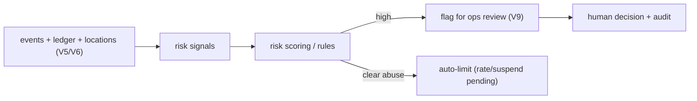

# Fraud & Abuse Prevention

**Owner:** Engineering (Security + Risk) · **Last reviewed:** 2026-07-06
**Realizes:** Volume 2 risks, R-PAY-*, NFR-SEC-06, Volume 5/6/9

A two-sided marketplace moving money is a fraud magnet. This page catalogs the abuse vectors and the
layered defenses. The philosophy: **make fraud structurally hard (design), detect what gets through
(signals), and resolve with a human + audit (ops).** No single magic filter — layers.

---

## Abuse vectors & defenses

| Vector                        | What it looks like                                              | Primary defenses                                                                                        |
| ----------------------------- | --------------------------------------------------------------- | ------------------------------------------------------------------------------------------------------- |
| **Fake / GPS-spoofed trips**  | driver "completes" trips that didn't happen to inflate earnings | pickup **OTP** (rider must be present, R-TRIP-2); route/location plausibility checks; anomaly detection |
| **Wallet / promo abuse**      | multi-account promo farming, refund abuse                       | KYC (R-KYC), device/identity signals, idempotency (no replay, W-4), refund RBAC+audit                   |
| **Payment fraud (phase 2)**   | stolen instruments, chargebacks                                 | gateway fraud tools, verification, ledger reconciliation                                                |
| **Collusion**                 | rider+driver stage trips for incentives                         | pattern detection across pairs, incentive-abuse monitoring                                              |
| **Account takeover**          | steal account → drain wallet                                    | OTP hygiene, refresh rotation, step-up (Volume 14 §02)                                                  |
| **OTP-bombing / enumeration** | flood OTPs, probe accounts                                      | per-phone/device rate limits, lockout (Volume 5/7)                                                      |
| **Cancellation abuse**        | serial cancels to game fees/matching                            | cancellation-rate monitoring + penalties (R-CANCEL-5)                                                   |
| **Insider fraud**             | ops issuing bogus refunds / self-dealing                        | RBAC + **separation of duties** + audit (Volume 9)                                                      |
| **Scraping / API abuse**      | harvest driver/pricing data                                     | auth required, rate limits, ownership checks                                                            |

---

## Layer 1 — structural prevention (design makes it hard)

The best fraud control is a design where the fraud _can't work_:

- **Pickup OTP** (R-TRIP-2) — a driver can't complete a trip without the rider present to give the
  OTP. This structurally blocks the simplest fake-trip fraud.
- **Idempotency + DB unique constraints** (Volume 6/7) — replaying a settlement or booking can't
  double-credit (W-4). Retry-based abuse is dead on arrival.
- **Immutable double-entry ledger** (Volume 5/6) — money can't be created; every rupee is traceable
  and the books must balance (W-1/W-5). Silent tampering is impossible.
- **KYC** (R-KYC) — real identity behind drivers raises the cost of multi-account abuse.
- **RBAC + separation of duties** (Volume 9) — no single insider can both authorize and pay out.

These are already specified in prior volumes — fraud prevention is largely a _consequence_ of the
correctness design, not a separate system.

---

## Layer 2 — detection (catch what gets through)

Signals feed anomaly detection and ops review (not auto-punishment):

Example signals:

- Improbable trips (impossible speed, route mismatch, pickup/GPS inconsistency).
- Earnings/cancellation outliers per driver; repeated rider–driver pairings (collusion).
- Velocity: many accounts per device, rapid wallet cycling, refund frequency.
- Reconciliation drift (Volume 5 §05) — a bug or fraud both surface here.

- **Daily reconciliation** (Volume 5/13) is a backstop detector: if money doesn't balance, _something_
  is wrong — bug or fraud — and it pages (RB-01).

---

## Layer 3 — response (human + audit)

- **Decision support, not auto-punishment:** signals surface in the **ops dispute/evidence view**
  (Volume 9 §04); a human decides with the evidence. Auto-actions are limited to clear-cut cases
  (rate-limit, suspend-pending-review) to avoid false-positive harm to legitimate users/drivers.
- **Every action is audited** (Volume 6, R-DATA-2) — including anti-fraud suspensions and refunds —
  so the response itself is accountable and reviewable.
- **Appeals:** a suspended user/driver can be reviewed; false positives are corrected. Livelihoods
  depend on driver accounts (Imran persona) — we don't wrongly cut off income without recourse.

---

## Rate limiting (abuse throttle) — NFR-SEC-06

Layered, from edge to identity:

| Layer                    | Limits                                                     |
| ------------------------ | ---------------------------------------------------------- |
| **Edge (Nginx)**         | per-IP request rate (coarse DoS protection, Volume 11 §04) |
| **App (Redis counters)** | per-user, per-endpoint, per-phone OTP (Volume 6/7)         |
| **Business rules**       | cancellation-rate, refund-rate thresholds trigger review   |

The edge doesn't know identity, so per-user limits live in the app — the two layers cover different
attacks (flood vs. targeted abuse).

---

## The balance: fraud control vs. user trust

Anti-fraud that's too aggressive harms legitimate riders and drivers — a wrongly-suspended driver
loses income, a wrongly-declined rider loses trust (Volume 2 guardrails). So we bias toward
**structural prevention** (invisible, no false positives) and **human-reviewed detection** over
blunt automated blocking. Protecting the marketplace includes protecting its honest participants.

---

## Traceability

| Control                           | Realizes                    |
| --------------------------------- | --------------------------- |
| Pickup OTP blocks fake trips      | R-TRIP-2                    |
| Idempotency + DB constraints      | W-4, Volume 6/7             |
| Immutable ledger + reconciliation | W-1/W-5, Volume 5 §05, BR-5 |
| RBAC + separation of duties       | Volume 9, insider threat    |
| Rate limiting (edge + app)        | NFR-SEC-06                  |
| Human-in-the-loop + audit         | Volume 9, R-DATA-2          |
