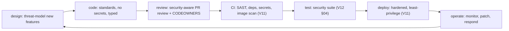

# Security Operations

**Owner:** Engineering (Security) · **Last reviewed:** 2026-07-06
**Realizes:** Volume 11 (scanning/CI), Volume 12 §04, Volume 13 (incident), NFR-COMPLY

Security isn't done at design time — it's operated continuously. This page covers the secure
development lifecycle, vulnerability management, security incident response, and compliance — the
ongoing practice that keeps the controls in this volume effective as the system and threats evolve.

---

## Secure development lifecycle (SDLC)

Security is built into how we ship, not inspected at the end:

| Stage       | Security practice                                                                                           |
| ----------- | ----------------------------------------------------------------------------------------------------------- |
| **Design**  | threat-model significant features (§01); privacy-by-design (§03)                                            |
| **Code**    | Volume 1 standards; no secrets; parameterized queries; input validation (Pydantic)                          |
| **Review**  | reviewers check authz, boundaries, data handling; 2 reviewers for auth/payments/infra (Volume 1)            |
| **CI**      | SAST (Bandit/ESLint-security), dependency scan, **secret scan (hard-fail)**, image CVE scan (Volume 11 §02) |
| **Test**    | the security test suite `T-SEC-*` (Volume 12 §04)                                                           |
| **Deploy**  | non-root, read-only FS, network policies, least-privilege creds (Volume 11)                                 |
| **Operate** | monitoring, patching, incident response (below)                                                             |

---

## Vulnerability management

| Activity                                | Cadence                              | Action                             |
| --------------------------------------- | ------------------------------------ | ---------------------------------- |
| **Dependency updates**                  | continuous (Dependabot-style)        | patch; security fixes prioritized  |
| **CVE scanning** (deps + images)        | every build (Volume 11)              | fixable HIGH/CRITICAL **fails CI** |
| **Base image refresh**                  | on cadence + advisories              | pinned ≠ never-updated             |
| **Penetration testing**                 | before major launches + periodically | findings tracked to closure        |
| **Bug bounty / responsible disclosure** | ongoing (as we mature)               | intake channel, triage, reward     |

- **Severity → SLA:** critical vulns are patched on an urgent timeline (out-of-band release if
  needed, Volume 13 §03); lower severity on the normal cadence.
- **Patch, don't accumulate:** dependency debt is security debt. We stay current deliberately.

---

## Security monitoring & detection

Security-relevant signals feed the same observability pipeline (Volume 11 §05) with security-specific
alerts:

| Signal                                                               | Alert                |
| -------------------------------------------------------------------- | -------------------- |
| Auth anomalies (spikes in 401/403, credential stuffing, OTP-bombing) | possible attack      |
| Privilege-check failures (repeated 403 on admin endpoints)           | probing / insider    |
| Unusual sensitive-data access (bulk KYC/PII reads)                   | insider / breach     |
| Reconciliation drift, settlement anomalies                           | fraud / bug (RB-01)  |
| WAF blocks / injection attempts                                      | external attacker    |
| New/unexpected egress or config changes                              | compromise indicator |

The **audit log** (Volume 6) is the forensic backbone — because sensitive actions and accesses are
recorded (append-only), a security investigation has ground truth to work from.

---

## Security incident response

Security incidents follow the general incident process (Volume 13 §01) with security-specific
additions:

1. **Detect** — security alert or report.
2. **Contain** — stop the bleeding: revoke tokens/keys, block an actor, isolate a component, disable
   a feature flag (Volume 10). **Preserve evidence** (don't destroy logs).
3. **Eradicate** — remove the vulnerability/access; **rotate any exposed secrets** (Volume 14 §03).
4. **Recover** — restore service; verify integrity (reconciliation for money, Volume 5).
5. **Notify** — **breach notification** per DPDP and contractual/regulatory obligations, on the
   required timeline, to authorities and affected individuals as applicable (§03).
6. **Postmortem** — blameless; fix the class of issue; add detection + tests (Volume 12) so it can't
   recur silently.

**Data breach** and **physical-safety** incidents have the highest priority and specific escalation
(legal, regulatory, and — for safety — the affected user and authorities per policy, R-SAFE-3).

---

## Compliance

| Obligation                           | How we meet it                                                 |
| ------------------------------------ | -------------------------------------------------------------- |
| **DPDP Act (data protection)**       | §03: minimization, consent, retention, rights, breach notice   |
| **GST / financial records**          | immutable ledger with tax component (Volume 5/6); reconcilable |
| **MoRTH aggregator + J&K transport** | KYC, driver verification, config-driven onboarding (Volume 5)  |
| **Auditability**                     | append-only audit log + financial/safety records (Volume 6)    |

Compliance is **evidenced by the system's design** (audit logs, immutable records, access controls),
not by a separate binder — which is what makes it credible under scrutiny. Specifics are confirmed
with legal/compliance counsel as the business formalizes.

---

## Security ownership & culture

- **Security is everyone's job**, with a clear owner for coordination. Reviewers are expected to
  think like an attacker; the threat model (§01) is shared context.
- **Blameless** (Volume 13): people report mistakes and near-misses without fear, so we learn.
- **Continuous:** the threat model, controls, and this volume are **living** — reviewed as the
  system, the market, the regulations, and the threats change. A security posture is a practice, not
  a milestone.

---

## Closing the loop

Everything in this volume is **verified** (Volume 12 §04 security tests), **operated** (Volume 13
runbooks + this page), and **evidenced** (Volume 6 audit). Security here isn't a document that sits
apart — it's the governance layer over controls that live in every other volume. That integration is
what makes it real.
