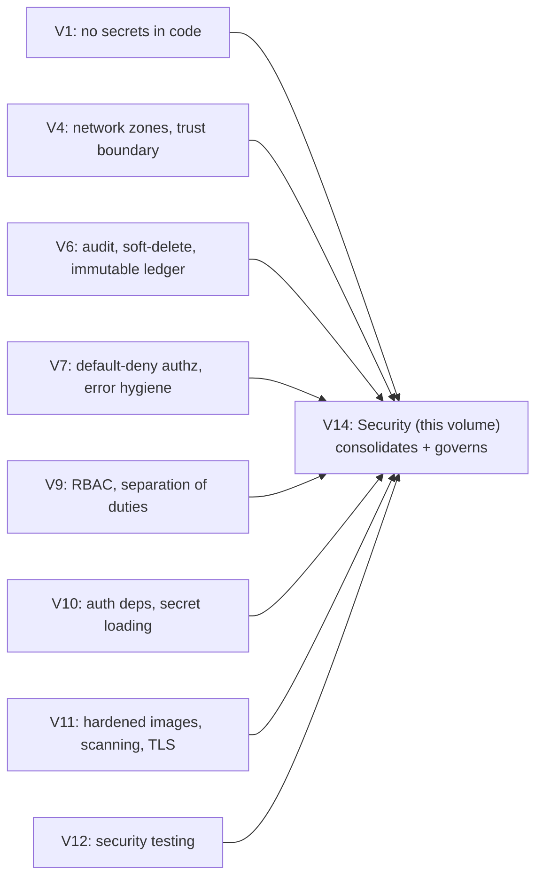

# Volume 14 — Security

> How we keep Zaroorat Ride safe — for the money it moves, the personal data it holds, and the
> physical safety of the people who use it. Security isn't a feature bolted on here; it's a property
> woven through every prior volume. This volume is the **consolidated security view**: the threat
> model, the controls, and how we operate them.

**Owner:** Engineering (Security) · **Last reviewed:** 2026-07-06

---

## Contents

| Doc                                                                    | Topic                                                          |
| ---------------------------------------------------------------------- | -------------------------------------------------------------- |
| [01_threat-model.md](01_threat-model.md)                               | Assets, adversaries, attack surface, trust boundaries (STRIDE) |
| [02_authn-authz.md](02_authn-authz.md)                                 | Authentication & authorization — the primary controls          |
| [03_secrets-and-data-protection.md](03_secrets-and-data-protection.md) | Secrets, encryption, privacy (India DPDP), retention           |
| [04_fraud-and-abuse.md](04_fraud-and-abuse.md)                         | Fraud detection, abuse prevention, rate limiting               |
| [05_security-operations.md](05_security-operations.md)                 | Secure SDLC, vuln mgmt, security incidents, compliance         |

> Security is **tested** in [Volume 12 §04](../13_Testing/04_security-testing.md) and **operated**
> via [Volume 13](../14_Operations/README.md). This volume is the policy those verify and execute.

---

## Why security is existential for this product

Zaroorat Ride sits at the intersection of the three things attackers most want and users most need
protected:

| At stake            | If compromised                                                                   |
| ------------------- | -------------------------------------------------------------------------------- |
| **Money**           | wallet balances, settlements, payouts, commission — direct financial loss/fraud  |
| **PII**             | phone, Aadhaar/PAN, licences, location history — identity theft, legal liability |
| **Physical safety** | live location, rider–driver contact — real-world harm                            |

A security failure here isn't an inconvenience; it's financial, legal, and human harm. That's why
security appears in _every_ volume, not just this one.

---

## Security principles (the ones the whole handbook obeys)

1. **Defense in depth.** No single control is trusted. Edge + network zones + per-request authz + DB
   constraints + audit — an attacker must beat all of them (Volume 4/6/7/11).
2. **Default deny.** Access is denied unless explicitly granted; every endpoint declares its
   requirement (NFR-SEC-04, Volume 7/9/10).
3. **Least privilege.** Users, services, and staff get the minimum access they need (RBAC scopes,
   scoped CI creds, non-root containers).
4. **Secrets never in code.** Ever. Config from the environment; secrets from a manager (Volume
   1/10/11).
5. **Assume breach; make it auditable & recoverable.** Everything sensitive is logged (Volume 6
   audit) and recoverable (Volume 11 DR); append-only records can't be quietly tampered.
6. **Privacy by design.** Collect what we need, protect it, retain it only as long as justified
   (Volume 6 §06, India DPDP).
7. **Safety is security.** Protecting a rider's live location and identity is a security control with
   physical consequences (R-SAFE-*).

## The security thread through the handbook

Security here is the _harvest and governance_ of decisions made throughout — which is exactly why it
holds together instead of being a checklist stapled on at the end.
