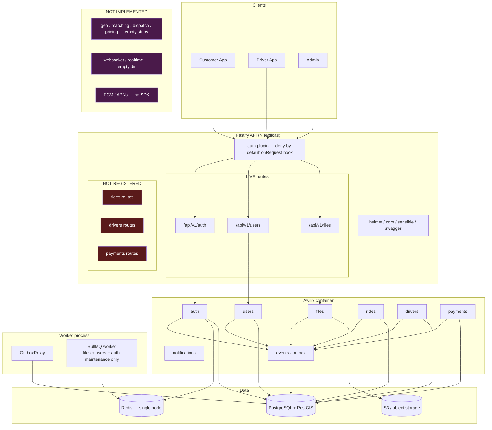
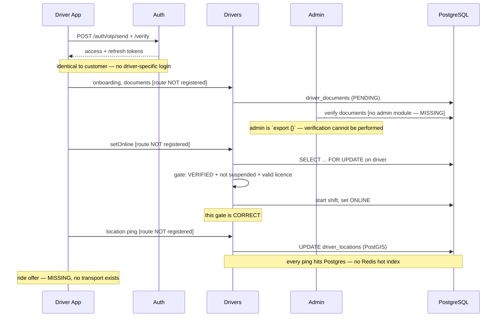
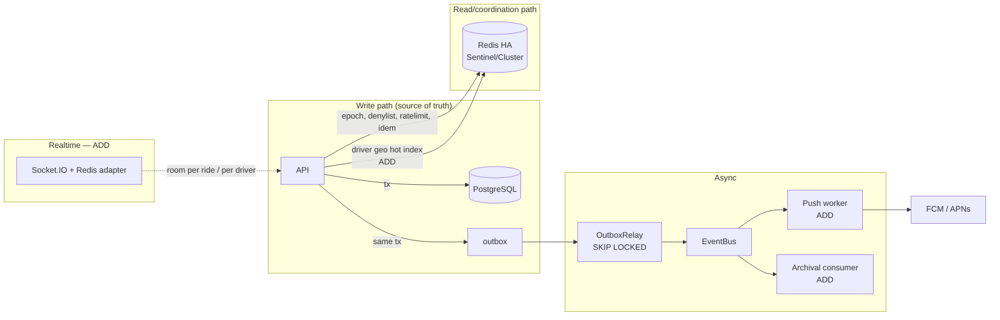

# Production Readiness Audit — Zaroorat Ride-Hailing Backend

**Date**: 2026-08-10
**Branch audited**: `feature/auth` (working tree, staged + unstaged)
**Method**: direct inspection of source, Prisma schema, migrations, Helm charts, CI, tests. No claim below is inferred from documentation alone; every finding cites a file.

---

## 1. Executive Summary

This backend contains **two codebases at very different maturity levels**, and the headline risk is that they are easy to mistake for one.

**Tier 1 — genuinely production-grade.** `auth`, `users`, `files`, and the `core/events` outbox are careful, well-reasoned work. Deny-by-default authentication, fail-closed revocation, HMAC-peppered OTP secrets kept out of Postgres, refresh-token rotation with reuse detection, and a transactional outbox that uses `FOR UPDATE SKIP LOCKED` so every replica can run a relay safely. The comments explain _why_, not _what_. These modules would survive a real security review.

**Tier 2 — prototype quality, and not reachable.** `rides`, `drivers`, and `payments` are written to a visibly lower standard: read-then-write races with no locking, hardcoded pricing, a committed fallback webhook secret, and idempotency keys that are auto-generated per request (which defeats idempotency entirely). These modules are wired into the DI container but **their HTTP routes are never registered**, so none of this is currently exposed.

**Tier 3 — does not exist.** Of the 23 directories under `src/modules/`, **16 are one-line `export {}` stubs**, including `geo`, `matching`, `dispatch`, and `pricing`. There is no real-time layer at all — `src/core/websocket/` is an empty directory and neither `socket.io` nor any push-notification SDK is in `package.json`.

The brief for this audit stated that Auth, Users, Files, Payments, Drivers, Rides, and Geo/Location "have already been implemented." That is accurate for Auth, Users, and Files. It is **partially correct** for Payments, Drivers, and Rides (code exists, is unreachable, and is not production quality). It is **incorrect** for Geo/Location, which is an empty file.

### Verdict

```
NOT PRODUCTION READY
```

This is not a close call, but the reason is narrower than it first appears. The _live_ surface (auth + users + files) is close to shippable and has a small, concrete P0 list. The _ride-hailing product_ — the thing that makes this a ride-hailing platform — is not implemented end to end: there is no dispatch, no geo matching, no pricing engine, and no way for a driver to be told about a ride.

**A customer cannot currently take a ride on this system.** No amount of hardening changes that; it is a build-out gap, not a quality gap.

---

## 2. Current Architecture

Runtime: Node.js + Fastify 5, Awilix DI (CLASSIC injection), Prisma 7 on PostgreSQL + PostGIS, ioredis, BullMQ, Pino.



### Module inventory (measured, not assumed)

| Module                                                                                                                                                                         |  Files |  Lines | Routes registered?    | Status                    |
| ------------------------------------------------------------------------------------------------------------------------------------------------------------------------------ | -----: | -----: | --------------------- | ------------------------- |
| `auth`                                                                                                                                                                         |     50 |   3457 | Yes — `/api/v1/auth`  | **CORRECT**               |
| `users`                                                                                                                                                                        |     52 |   2984 | Yes — `/api/v1/users` | **CORRECT**               |
| `files`                                                                                                                                                                        |     32 |   2971 | Yes — `/api/v1/files` | **CORRECT**               |
| `payments`                                                                                                                                                                     |     65 |   2737 | **No**                | **PARTIALLY CORRECT**     |
| `rides`                                                                                                                                                                        |     55 |   1991 | **No**                | **PARTIALLY CORRECT**     |
| `drivers`                                                                                                                                                                      |     50 |   1581 | **No**                | **PARTIALLY CORRECT**     |
| `notifications`                                                                                                                                                                |      6 |    205 | n/a (service)         | SMS only                  |
| `geo`, `matching`, `dispatch`, `pricing`, `vehicles`, `riders`, `admin`, `analytics`, `chat`, `documents`, `onboarding`, `promotions`, `reviews`, `settings`, `sos`, `support` | 1 each | 1 each | No                    | **MISSING** — `export {}` |

Route registration is [routes/register.ts](src/routes/register.ts) — it registers health, ready, auth, users, files, and nothing else. DI registration in [core/di.ts](src/core/di.ts:33-35) _does_ construct rides, drivers, and payments, which is why they compile and their tests pass while being unreachable over HTTP.

---

## 3. Module Ownership

| Responsibility                        | Owner in code                                             | Verdict                                                                   |
| ------------------------------------- | --------------------------------------------------------- | ------------------------------------------------------------------------- |
| Authentication (OTP, session, token)  | `auth`                                                    | **CORRECT**                                                               |
| Session epoch / fast revocation       | `auth` + Redis `EpochStore`                               | **CORRECT**                                                               |
| User identity & profile               | `auth` creates `User`; `users` owns `UserProfile`         | **CORRECT** — one writer each                                             |
| Account lifecycle (deactivate/delete) | `users` calls into `auth` via `deactivateInTransaction`   | **CORRECT**                                                               |
| Driver identity & verification        | `drivers`                                                 | **CORRECT** (design)                                                      |
| Driver operability gate               | `auth/repositories/driver-access.repository.ts`           | **CORRECT** — auth reads, drivers owns                                    |
| Driver location                       | `drivers` → Postgres/PostGIS                              | **PARTIALLY CORRECT** — no hot index, see §10                             |
| H3 / geospatial indexing              | _nobody_                                                  | **MISSING**                                                               |
| Ride lifecycle                        | `rides`                                                   | **PARTIALLY CORRECT**                                                     |
| Dispatch / matching                   | `rides/services/dispatch` (53 lines, offer-creation only) | **MISSING** — no candidate search, no ranking                             |
| Pricing                               | `rides/services/fare` — hardcoded constants               | **MISSING** — `pricing` module empty, `pricing.prisma` (267 lines) unused |
| Payment processing                    | `payments`                                                | **PARTIALLY CORRECT**                                                     |
| Financial ledger                      | `payments/repositories/ledger.repository.ts`              | **CORRECT** — real double-entry                                           |
| File storage                          | `files`                                                   | **CORRECT**                                                               |
| Notifications                         | `notifications` — SMS (MSG91/mock) only                   | **PARTIALLY CORRECT** — no push                                           |
| Events / outbox                       | `core/events`                                             | **CORRECT**                                                               |

### Duplications found

**DUPLICATION — two OTP implementations with different security postures.**
`auth` uses `createHmac('sha256', pepper)` with a secret pepper, stores only in Redis ([otp.hasher.ts](src/modules/auth/services/otp/otp.hasher.ts)). `rides` uses bare `createHash('sha256')` with **no salt and no pepper** on a **4-digit** code ([rides/utils/otp.util.ts](src/modules/rides/utils/otp.util.ts:15-17)), stored in Postgres. 9,000 possible values against an unsalted hash is a lookup table, not a hash. Anyone with read access to `ride_otps` recovers every ride start code.

**DUPLICATION — two state-machine implementations.** `ALLOWED_TRANSITIONS` is declared independently in [lifecycle.service.ts](src/modules/rides/services/lifecycle/lifecycle.service.ts:16) and [intent.service.ts](src/modules/payments/services/intent/intent.service.ts:12), each with its own `validateTransition`. Same pattern, same bug class (validation outside the transaction), two copies.

**Not duplicated (checked and clean):** Redis client (single `RedisProvider`), transaction manager (single `TransactionManager`), outbox publisher (single `EventPublisher`), JWT verification (single `JwtService`).

---

## 4. Customer End-to-End Workflow

Traced against actual code. Steps marked **MISSING** have no implementation.

```
Registration / Login  ──────────────────────────────── IMPLEMENTED
  POST /api/v1/auth/otp/send      auth.routes.ts → AuthController.sendOtp → OtpService.send
  POST /api/v1/auth/otp/verify    → AuthService.runVerifyOtp → tokens
Profile / saved places / avatar ───────────────────── IMPLEMENTED (users, files)
Home screen                     ───────────────────── MISSING
Location / nearby drivers       ───────────────────── MISSING (geo is `export {}`)
Fare quote                      ───────────────────── PARTIAL (hardcoded constants, unreachable)
Ride request                    ───────────────────── PARTIAL (unreachable)
Dispatch → driver offer         ───────────────────── MISSING (no candidate search/ranking/transport)
Driver assignment               ───────────────────── PARTIAL, races (§15)
Driver arrives → OTP → start    ───────────────────── PARTIAL, weak OTP
Ride completes → final fare     ───────────────────── BROKEN (§11)
Payment → receipt               ───────────────────── PARTIAL (unreachable)
Ride history                    ───────────────────── MISSING (no routes)
```

The implemented portion, in detail:

| Step               | API                                 | Service                      | Table                                                                       | Redis                                                              | Tx               | Event                                                               |
| ------------------ | ----------------------------------- | ---------------------------- | --------------------------------------------------------------------------- | ------------------------------------------------------------------ | ---------------- | ------------------------------------------------------------------- |
| Send OTP           | `POST /auth/otp/send` (public)      | `OtpService.send`            | `otp_verifications` (audit trail only)                                      | `otp:{purpose}:{phone}` hash, `otp:challenge:*`, 3 rate-limit axes | No               | `auth.otp.requested`, `auth.otp.sent`                               |
| Verify OTP         | `POST /auth/otp/verify` (public)    | `AuthService.runVerifyOtp`   | `users`, `user_profiles`, `user_devices`, `user_sessions`, `refresh_tokens` | OTP consume (Lua CAS), idempotency                                 | **Yes** — one tx | `auth.otp.verified`, `auth.login.succeeded`, `auth.session.created` |
| Refresh            | `POST /auth/token/refresh` (public) | `RefreshTokenService.rotate` | `refresh_tokens`                                                            | idempotency                                                        | **Yes**          | `auth.token.refreshed`                                              |
| Authenticated call | any                                 | `auth.plugin` onRequest      | `user_sessions` (last-seen)                                                 | epoch + sid denylist                                               | No               | —                                                                   |

---

## 5. Driver End-to-End Workflow



**Authentication and operability are correctly separated.** `POST /auth/otp/verify` issues tokens to any ACTIVE user; going ONLINE is gated separately by [StatusService.setOnline](src/modules/drivers/services/status/status.service.ts:33), which takes a row lock and checks verification status, suspension, _and_ a verified driving licence inside one transaction. A driver **cannot** bypass verification to go online. This is the best-written code in the drivers module. **CORRECT.**

The gate is also enforced at the HTTP layer via `authorize({ requireOperableDriver: true })` → [DriverAccessRepository.isOperableDriver](src/modules/auth/repositories/driver-access.repository.ts), which fails closed on error. **CORRECT.**

**MISSING**: there is no admin module, so nothing can move a document from `PENDING` to `VERIFIED`. The onboarding flow has no terminal state in practice.

---

## 6. Authentication Flow

### Access token — [jwt.service.ts](src/modules/auth/services/token/jwt.service.ts)

Hand-rolled HS256. Normally I would flag rolling your own JWT, but this implementation is careful:

- `alg` is pinned to `HS256` and compared before use — **alg-confusion and `alg:none` are blocked**. **CORRECT**
- `kid` header selects from a fixed secrets map; unknown `kid` → reject. Rotation supported via `JWT_ACCESS_SECRETS_JSON` / `JWT_OLD_ACCESS_SECRET`, so old tokens verify while new ones are signed with the primary key — **rotation does not force logout**. **CORRECT**
- Signature compared with `timingSafeEqual` over SHA-256 digests of both sides (equal-length, so no length leak). **CORRECT**
- Claims: `sub`, `sid`, `roles`, `epoch`, `jti`, `iat`, `exp`, `iss`. Issuer verified.
- **MISSING**: no `aud` claim. Low severity for a single-audience monolith; add before a second consumer exists.
- TTL 900s default.

### Refresh token — [refresh-token.service.ts](src/modules/auth/services/token/refresh-token.service.ts)

- 32 random bytes, stored as `HMAC-SHA256(token, refreshSecret)`. Raw token never touches Postgres. **CORRECT**
- Rotation is a conditional claim (`claimForRotation`) inside a transaction — two concurrent refreshes cannot both win. **CORRECT**
- Replay of a consumed token → `handleReuse` revokes the whole session family and bumps the epoch. **CORRECT**
- `TokenService.rotate` re-resolves roles through `resolveActiveRoles`, which calls `assertAuthenticatable` — a suspended or deactivated user **cannot** refresh. **CORRECT**
- Expired-token hashes are retained 30 days past expiry so a late replay is still detectable. Thoughtful. **CORRECT**

**Gap**: `handleReuse` revokes refresh tokens and bumps epoch but does **not** revoke the `UserSession` row or add the `sid` to the denylist. The epoch bump does invalidate live access tokens, so exposure is bounded — but the session remains `ACTIVE` in Postgres and in `GET /me/sessions`. **PARTIALLY CORRECT.**

### The revocation stack

Three independent mechanisms, all checked in [auth.plugin.ts](src/modules/auth/plugins/auth.plugin.ts:56-73):

1. **Epoch** (Redis `auth:epoch:{userId}`) — O(1) invalidation of every access token for a user.
2. **sid denylist** (Redis) — revokes one session.
3. **Session/refresh rows** (Postgres) — durable truth for refresh.

Both Redis checks are wrapped in try/catch that returns **503, not 200** — `'[auth] revocation store unavailable — failing closed'`. This is the correct choice and it is rare to see it made deliberately. **CORRECT.**

---

## 7. Authorization Model

**Deny-by-default is real.** The `onRequest` hook in [auth.plugin.ts](src/modules/auth/plugins/auth.plugin.ts:126-133) authenticates every route unless it declares `config: { public: true }`. Exactly three routes are public: `otp/send`, `otp/verify`, `token/refresh`. Verified by grep across all route files. **CORRECT.**

**No BOLA on live endpoints.** Every controller in `users` derives the subject from `request.auth.userId` — there is no `:userId` path parameter anywhere in the live surface. Resource IDs that _are_ accepted (`emergency-contact/:id`, `saved-place/:id`) are passed to services alongside `auth.userId` for scoping. **CORRECT.**

**File reads are policy-gated.** [read-policy.ts](src/modules/files/policies/read-policy.ts) grants access to the owner, or to a caller holding a purpose-specific ops scope (`drivers:verify` for driver documents, `support:read` for disputes). Driver A cannot read Driver B's document. **CORRECT.**

**NOT VERIFIED**: `rides`, `drivers`, and `payments` controllers cannot be assessed for BOLA in practice because no routes are mounted. Reading the controllers, several take IDs from the request body/params (e.g. `driverId`, `rideId`) — **these must be ownership-checked before those routes are registered.** Treat this as a mandatory pre-registration review, not a clean bill of health.

---

## 8. Device Security

`DeviceContext` accepts `deviceId`, `platform`, `fingerprint`, `isRooted`, `isJailbroken` from the client ([auth.service.ts](src/modules/auth/services/auth.service.ts:25-34)).

`authorize({ requireUntamperedDevice: true })` refuses the request when `device.isRooted || device.isJailbroken`. That value is **client-supplied**: an attacker simply sends `false`.

Classification:

| Signal                      | Source | Is it a boundary?                                                                                                                                        |
| --------------------------- | ------ | -------------------------------------------------------------------------------------------------------------------------------------------------------- |
| `deviceId`                  | client | **Signal.** Fine for session listing / UX.                                                                                                               |
| `isRooted` / `isJailbroken` | client | **Signal only** — currently used as a boundary.                                                                                                          |
| `fingerprint`               | client | Signal.                                                                                                                                                  |
| `isMockLocation` (drivers)  | client | **Signal only** — currently the sole anti-GPS-spoofing control ([location.service.ts](src/modules/drivers/services/location/location.service.ts:20-23)). |

This is not a vulnerability in the cryptographic sense — it is a control that will not survive contact with a motivated attacker, and the code presents it as if it will. For a ride-hailing platform, fake GPS is a direct fraud vector (phantom rides, inflated distance).

**Recommendation** (do not implement now): keep these as risk signals feeding a scoring layer; add Play Integrity / App Attest attestation before treating any of them as a boundary. Server-side plausibility checks on location (speed between consecutive pings, jump distance) are cheap and would catch naive spoofing today.

---

## 9. Ride Dispatch Flow

**This flow does not exist end to end.** Concretely, of the steps in a normal dispatch pipeline:

| Step                      | Implementation                                                                                                                           |
| ------------------------- | ---------------------------------------------------------------------------------------------------------------------------------------- |
| Ride becomes SEARCHING    | `RideRequestService` — exists                                                                                                            |
| Geo finds nearby drivers  | **MISSING** — `geo` is `export {}`; no PostGIS proximity query anywhere                                                                  |
| Candidate filtering       | **MISSING**                                                                                                                              |
| Driver ranking            | **MISSING**                                                                                                                              |
| Offer created             | [DispatchService.offerToDriver](src/modules/rides/services/dispatch/dispatch.service.ts) — writes a `RideDispatch` row with a 30s expiry |
| Offer delivered to driver | **MISSING** — no WebSocket, no push, no polling endpoint                                                                                 |
| Driver accepts            | `LifecycleService.acceptRideRequest` — exists, **racy** (§15)                                                                            |
| Atomic assignment         | **MISSING** — see below                                                                                                                  |
| Timeout / next round      | `dispatch-timeout.job.ts` exists but is **not in `JOB_NAMES`**, so it is never scheduled                                                 |

`DispatchService` is 53 lines and does one thing: insert an offer row. There is no dispatcher loop, no driver selection, and — critically — **no way for the driver's phone to learn an offer exists**. `src/core/websocket/` is an empty directory; `package.json` contains no `socket.io`, no `firebase-admin`, no APNs client.

**MISSING.** This is the single largest gap between the codebase and the stated product.

---

## 10. Geo / Location Architecture

`src/modules/geo/index.ts` is `export {}`. Location handling lives entirely in `drivers`.

Current path: driver ping → `LocationService.updateLocation` → reject if `isMockLocation` → `findById` → `locationRepo.updateLocation` (PostGIS `geography(Point,4326)`) → `statusRepo.updateHeartbeat`.

| Question                         | Answer                                                     |
| -------------------------------- | ---------------------------------------------------------- |
| Where is latest location stored? | PostgreSQL `driver_locations`                              |
| Where is it indexed?             | PostGIS GiST (schema-level)                                |
| Where is it cached?              | **Nowhere** — no Redis GEO, no H3                          |
| Retention                        | **Unbounded** — no purge job                               |
| Stale detection                  | `heartbeat-timeout.job.ts` exists but is **not scheduled** |
| Behaviour if Redis down          | Unaffected — Redis is not on this path                     |

**This is the component that breaks first under load.** Two Postgres writes per ping, per driver, with no batching and no write-behind. See §29.

---

## 11. Payment Flow

The ledger is the strong part. [LedgerRepository.postGroup](src/modules/payments/repositories/ledger.repository.ts:26-45) computes debit and credit sums and throws `LedgerImbalanceError` unless they are exactly equal, using `Decimal` throughout — no floats in money paths. Immutable append-only entries grouped by `entryGroup`. **CORRECT.**

Wallet operations use `SELECT ... FOR UPDATE` inside interactive transactions ([wallet.service.ts](src/modules/payments/services/wallet/wallet.service.ts:37-40)). **CORRECT.**

Everything around the ledger has serious problems.

### SECURITY ISSUE — committed fallback webhook secret

```ts
// src/config/payment/payment.config.ts:19
webhookSecret: process.env.PAYMENT_WEBHOOK_SECRET ?? 'whsec_test_secret',
```

`.env.example` ships `PAYMENT_WEBHOOK_SECRET=` **empty**. If the variable is unset or blank in production, every webhook is verified against a secret that is published in this repository. An attacker forges `payment.succeeded` for any intent and gets a free ride, or drains a wallet via forged top-ups. Boot does not fail; nothing warns.

### CONCURRENCY ISSUE / SECURITY ISSUE — idempotency is defeated by its own default

```ts
// src/modules/payments/controllers/intent.controller.ts:12
const idempotencyKey = (req.headers['idempotency-key'] as string) ?? `auto_key_${Date.now()}`;
```

Identical patterns in `refund.controller.ts:11` and `payout.controller.ts:11`. A client that omits the header — or retries after a timeout without reusing its key — gets a **fresh key every time**, so every retry executes as a new operation. This is worse than having no idempotency: the API advertises the guarantee and does not provide it. On refunds and payouts this is duplicated money out the door.

Additionally, `DuplicateIdempotencyKeyError` exists in [payment.errors.ts](src/modules/payments/errors/payment.errors.ts:28) but is never thrown — **same key + different payload is not rejected**, it silently replays the first result.

### Webhook handling — [webhook.service.ts](src/modules/payments/services/webhook/webhook.service.ts)

- Signature verification is timing-safe (`verifyWebhookSignature` uses `timingSafeEqual`). **CORRECT**
- **MISSING**: no timestamp/replay-window check. A captured valid webhook replays forever — the only defence is the `gatewayEventId` dedupe, which fails when:
- **Fallback event ID**: `payload?.id ?? payload?.event_id ?? \`evt_${Date.now()}\`` — a payload without an ID gets a synthetic unique one, so dedupe never fires and the event is processed repeatedly.
- **Swallowed errors**: `confirmIntent` is wrapped in `try { ... } catch { /* Best-effort */ }`, then `markProcessed` runs regardless. A failed confirmation is recorded as successfully processed and never retried. Money is lost silently.
- **Broken atomicity**: `confirmIntent(intentId)` is called **without** the transaction client `tx`, so it runs on its own connection. If the enclosing webhook transaction rolls back, the intent stays confirmed.

### BROKEN — final fare is computed from placeholder inputs

```ts
// src/modules/rides/services/lifecycle/lifecycle.service.ts:181-185
const itemizedFare = await this.fareService.calculateFareQuote({
  pickupLat: 0,
  pickupLng: 0,
  vehicleTypeId: ride.vehicleTypeId,
});
```

`completeRide` receives `actualDistanceKm` and `actualDurationMin` and **passes neither to the fare calculation**. With no drop coordinates, [FareService](src/modules/rides/services/fare/fare.service.ts:36) falls back to `distanceKm = 5.0`.

**Every completed ride is billed as an identical 5 km trip.** A 2 km ride and a 40 km ride produce the same invoice. Separately, `vehicleTypeId` is accepted and never read, so all vehicle classes cost the same; and base fare (50), rate/km (12), rate/min (2), GST (5%), platform fee (15), and commission (20%) are **hardcoded literals**, while `pricing.prisma` (267 lines of pricing tables) is unused.

`completeRide` also sets `paymentStatus: 'PAID'` unconditionally, before any payment is attempted.

---

## 12. Redis Architecture

```
Redis (single instance)
├── auth:epoch:{userId}          — fast revocation authority
├── auth:sid:{sid}               — session denylist
├── otp:{purpose}:{phone}        — OTP hash (Lua CAS consume)
├── otp:challenge:{purpose}:{phone}
├── otp:attempts:{phone} / otp:lock:{phone}
├── ratelimit:{scope}:{id}       — OTP send axes only
├── idem:{key}                   — stored-response idempotency
├── lock:{name}                  — last-seen throttle
└── bull:*                       — BullMQ (separate connection)
```

| Usage               | Location            | Required? | TTL                  | Durable? | Failure behaviour                             |
| ------------------- | ------------------- | --------- | -------------------- | -------- | --------------------------------------------- |
| Session epoch       | `EpochStore`        | Yes       | none                 | **No**   | **503 fail-closed** (correct)                 |
| sid denylist        | `SidBlacklistStore` | Yes       | `denylistTtlSeconds` | No       | **503 fail-closed** (correct)                 |
| OTP secret          | `OtpStore`          | Yes       | 300s                 | No       | Exception → 500 (should be 503)               |
| OTP attempts / lock | `OtpStore`          | Yes       | 900s                 | No       | Exception → 500                               |
| Rate limit          | `RateLimitStore`    | Yes       | window               | No       | Exception → 500 (**fail-closed by accident**) |
| Idempotency         | `IdempotencyStore`  | Yes       | 86400s               | No       | Exception → 500                               |
| Last-seen throttle  | `LockStore`         | No        | window               | No       | **Caught and logged** — degrades correctly    |
| BullMQ              | separate connection | Yes       | n/a                  | AOF      | Jobs stall                                    |

**Redis vs PostgreSQL — the split is correct.** No permanent business truth lives only in Redis. Sessions, refresh tokens, users, rides, and ledger entries are all in Postgres; Redis holds only acceleration and coordination state. The OTP secret is the one item that is Redis-only, and that is a deliberate, documented choice (a lost OTP just means the user requests another).

**Two real gaps:**

1. **The denylist is not reconstructible.** After a Redis flush or a failover to an empty replica, `sidBlacklist.isRevoked` returns `false` for genuinely revoked sessions. Postgres has `user_sessions.revoked_at`, but the hot path never reads it. Exposure is bounded by the 15-minute access-token TTL, and refresh is still blocked (refresh tokens are revoked in Postgres) — so this is **degradation, not a breach**. Still worth a fallback read.

2. **Fail-open on epoch after flush.** A user whose epoch was never bumped has epoch 0; after a flush, everyone reads 0. Tokens minted with a bumped epoch correctly fail closed. Tokens minted at epoch 0 continue to work — which is correct, since they were never revoked. Net: **acceptable**, and the `EpochStore` docstring describes this accurately.

**SINGLE POINT OF FAILURE**: `docker-compose.yml` runs one `redis:8-trixie` container. `infrastructure/helm/values-production.yaml` contains **no Redis configuration at all** — no Sentinel, no Cluster, no ElastiCache reference. Redis going down takes **100% of authenticated traffic** to 503 (by design). There is no HA story in this repository.

---

## 13. PostgreSQL Architecture

3,418 lines of Prisma schema across 15 module files, 11 migrations. Quality is high:

- UUIDv7 primary keys throughout (`@default(uuid(7))`) — time-sortable, good index locality. **CORRECT**
- Partial unique indexes where Prisma cannot express them, shipped as raw SQL: `uq_users_phone_active ON users(phone_number) WHERE deleted_at IS NULL` matches `findActiveByPhone`'s `deletedAt: null` filter exactly. **CORRECT**
- `Decimal` for all money. **CORRECT**
- PostGIS `geography(Point,4326)` for locations. **CORRECT**
- Indexes added for the specific queries that need them, with comments naming the query (e.g. `otp_verifications(expires_at)` for the nightly purge, `ix_deletion_requests_due` for the erasure job). Not blind indexing. **CORRECT**
- Soft delete (`deletedAt`) plus a real anonymisation path (`UserRepository.anonymize` rewrites `phone_number` to `erased:{id}`). **CORRECT**

**Findings:**

- **MISSING — no unique constraint on `rides.request_id`.** Line 64 of `ride.prisma` declares `requestId String @map("request_id")` with no `@unique`. The `@@unique([requestId, driverId])` at line 55 is on `RideDispatch`, a different model. This is what makes the double-accept race in §15 produce two real rides rather than a constraint violation.
- **PARTIALLY CORRECT — `UserStatus` has no `DELETED`/`ANONYMIZED` member.** Deletion is modelled by `deletedAt` + `AccountDeletionRequest`, which is defensible, but the audit brief asked about those states explicitly: they are represented by a nullable timestamp and a separate ledger table, not by the enum.
- **MISSING — no retention/partitioning for `driver_locations`.** Unbounded growth at the highest write rate in the system.

---

## 14. Transaction Architecture

`TransactionManager.execute` wraps `prisma.$transaction` and — importantly — **re-throws domain errors unmapped**, only translating genuine Prisma driver errors ([TransactionManager.ts](src/core/database/TransactionManager.ts:52-56)). A deliberate `AccountSuspendedError` thrown to roll back stays a 403 instead of becoming a 500. Well-reasoned. **CORRECT.**

The transactional outbox is correct: `EventPublisher.publish(envelope, tx)` writes the outbox row on the caller's transaction client, so state change and event commit atomically. Passing `tx` to an observability event **throws**, which prevents the "announce a change that then rolls back" bug by construction. **CORRECT.**

**Auth's login transaction is exemplary** — user resolve, profile ensure, device register, session create, token issue, and three outbox events all in one transaction ([auth.service.ts](src/modules/auth/services/auth.service.ts:98-180)).

**Two ordering gaps in auth** (both minor, both real):

- `enforceCap` runs **after** the login transaction commits. Concurrent logins can briefly exceed the session cap.
- `epochService.bump(userId)` runs **after** the role grant/revoke transaction commits ([auth.service.ts](src/modules/auth/services/auth.service.ts:264)). A crash in that window leaves a revoked role live in outstanding access tokens for up to 15 minutes. Redis cannot join a Postgres transaction, so this is inherent — but it should be an outbox-driven bump, not a fire-and-forget call.

---

## 15. Concurrency Analysis

| Race                                    | Protection                                              | Verdict                                                                                                           |
| --------------------------------------- | ------------------------------------------------------- | ----------------------------------------------------------------------------------------------------------------- |
| Concurrent registration, same phone     | `uq_users_phone_active` partial unique index            | **CORRECT** — one wins. The loser surfaces a mapped Prisma error rather than a clean 409; worth a targeted catch. |
| Concurrent OTP verify                   | Lua CAS `GET == ARGV[1] then DEL` in `OtpStore.consume` | **CORRECT** — single-use guaranteed                                                                               |
| Concurrent refresh (token race)         | `claimForRotation` conditional update in tx             | **CORRECT**                                                                                                       |
| Refresh token replay                    | reuse → family revoke + epoch bump                      | **CORRECT**                                                                                                       |
| Session cap                             | `userRepository.lockForUpdate` in `enforceCap`          | **PARTIALLY CORRECT** — post-commit, brief overshoot                                                              |
| Driver goes ONLINE twice                | `driverRepo.lockForUpdate` + shift lock in one tx       | **CORRECT**                                                                                                       |
| Wallet debit/credit                     | `SELECT ... FOR UPDATE`                                 | **CORRECT**                                                                                                       |
| Ledger imbalance                        | sum check before insert                                 | **CORRECT**                                                                                                       |
| **Two drivers accept the same request** | **none**                                                | **CONCURRENCY ISSUE — CRITICAL**                                                                                  |
| **Concurrent `completeRide`**           | **none**                                                | **CONCURRENCY ISSUE — CRITICAL**                                                                                  |
| **Concurrent ride cancel vs complete**  | **none**                                                | **CONCURRENCY ISSUE**                                                                                             |
| Ride OTP attempt counter                | read → check → increment, non-atomic, outside tx        | **CONCURRENCY ISSUE** — attempt limit bypassable by parallel guesses                                              |
| Concurrent `createIntent`, same key     | `findByIdempotencyKey` then create, no lock             | **CONCURRENCY ISSUE** — two gateway intents                                                                       |

### The core ride race, precisely

Every method in [LifecycleService](src/modules/rides/services/lifecycle/lifecycle.service.ts) follows this shape:

```ts
const ride = await this.rideRepo.findById(rideId);   // ← read, NO lock, OUTSIDE tx
this.validateTransition(ride.status, 'COMPLETED');   // ← validate stale data
return this.txManager.execute(async (tx) => {
  await this.rideRepo.updateStatus(rideId, 'COMPLETED', {...}, tx);  // ← unconditional write
});
```

Textbook TOCTOU. `RideRepository.lockForUpdate` **exists** ([ride.repository.ts](src/modules/rides/repositories/ride.repository.ts:28)) and is **never called by the lifecycle service**.

Consequences:

- `acceptRideRequest`: two drivers accept concurrently → both pass, both `INSERT` into `rides` for the same `request_id`. With no unique constraint (§13), **two rides exist for one request, each with a different driver**. Two drivers dispatched, two fares, two ledger postings.
- `completeRide`: two concurrent calls → two `ride_fares` rows and two `recordTripPayment` ledger groups. **The customer is billed twice and the driver paid twice**, with a balanced ledger that hides it.

The fix is small and local: take `lockForUpdate` inside the transaction, re-read status, validate, then write — and make status writes conditional (`WHERE status = :expected`).

---

## 16. Idempotency Analysis

| Endpoint                   | Required | Implemented                                                                        |
| -------------------------- | -------- | ---------------------------------------------------------------------------------- |
| `POST /auth/otp/verify`    | Yes      | **CORRECT** — `Idempotency-Key` header → `redisService.idempotency.runOnce`        |
| `POST /auth/token/refresh` | Yes      | **CORRECT** — same, plus rotation is atomic regardless                             |
| Ride creation              | Yes      | **NOT VERIFIED** — unreachable                                                     |
| Ride cancellation          | Yes      | **MISSING**                                                                        |
| Driver acceptance          | Yes      | **MISSING**                                                                        |
| Payment intent / confirm   | Yes      | **BROKEN** — auto-generated key (§11)                                              |
| Refund                     | Yes      | **BROKEN** — auto-generated key                                                    |
| Payout                     | Yes      | **BROKEN** — auto-generated key                                                    |
| Wallet ops                 | Yes      | **PARTIALLY CORRECT** — header optional, no auto-key, but no payload binding       |
| Webhooks                   | Yes      | **PARTIALLY CORRECT** — `gatewayEventId` dedupe, defeated by synthetic-ID fallback |

`IdempotencyStore` itself is well built — `putIfAbsent` uses `SET NX EX` for an atomic claim, and `forget` releases the claim on failure so one transient error does not lock a key for 24 hours. The infrastructure is right; the payments controllers misuse it.

**Nowhere** does the system compare the request payload against the stored one for a repeated key. `same key + different request → reject` is **MISSING** across the board.

---

## 17. Webhook Security

| Control                   | Status                                                                                                                                                         |
| ------------------------- | -------------------------------------------------------------------------------------------------------------------------------------------------------------- |
| Signature verification    | **CORRECT** — HMAC-SHA256, `timingSafeEqual`                                                                                                                   |
| Secret management         | **SECURITY ISSUE** — committed fallback `'whsec_test_secret'`                                                                                                  |
| Timestamp / replay window | **MISSING**                                                                                                                                                    |
| Gateway event ID dedupe   | **PARTIALLY CORRECT** — synthetic fallback ID defeats it                                                                                                       |
| Transaction boundaries    | **PARTIALLY CORRECT** — `confirmIntent` runs outside `tx`                                                                                                      |
| Error handling            | **SECURITY ISSUE** — bare `catch {}` then `markProcessed`                                                                                                      |
| Out-of-order events       | **MISSING** — no sequence/version guard                                                                                                                        |
| Raw-body preservation     | **NOT VERIFIED** — no route registered; if Fastify's JSON parser runs first, the HMAC will be computed over a re-serialised body and every signature will fail |

That last point matters when these routes are eventually mounted: signature verification over `rawBody` requires a `preParsing`/`addContentTypeParser` hook that captures the untouched buffer. None exists yet.

---

## 18. Outbox / Event Architecture

**This is the best-engineered component in the repository.** [OutboxRelay](src/core/events/OutboxRelay.ts):

- Claims via `UPDATE ... FOR UPDATE SKIP LOCKED`, so every replica runs a relay and they partition the backlog instead of duplicating it. Explicitly documented as correcting an earlier single-instance assumption. **CORRECT**
- Exponential backoff with full jitter, ceiling 30s, 8 attempts (~91s worst case) → dead-letter. **CORRECT**
- `PROCESSING` claims reaped after 5 minutes for crash recovery, with the reasoning that reclaiming a _live_ claim is what creates duplicates. **CORRECT**
- Marks published only after every subscriber settles successfully; at-least-once delivery with a DB-enforced unique `eventId` for consumer dedupe. **CORRECT**
- **Honestly documents that it offers no ordering guarantee**, and explains both mechanisms that break order. Most systems claim ordering they do not have; this one does the opposite.
- Pruning defaults to disabled with a stated reason (nothing consumes the bus yet, so deleting would destroy the audit trail rather than trim a buffer). **CORRECT**
- Graceful stop with a 15s budget sized against the Kubernetes termination grace period.

**The one gap**: nothing subscribes. `EventBus` has no registered consumers, so events accumulate as an audit log. That is a reasonable intermediate state — but it means every "and then a notification is sent" step in the product is currently a no-op.

---

## 19. Queue / Worker Architecture

BullMQ on a dedicated ioredis connection (`maxRetriesPerRequest: null`, correctly separated from the app client so a cache read fails fast instead of hanging behind a blocking primitive — the reasoning is documented and right). **CORRECT.**

Registered queues and jobs ([jobs/queues/index.ts](src/jobs/queues/index.ts:15-34)):

```
files-maintenance : file-sweep, file-retention
users-maintenance : account-erasure
auth-maintenance  : auth-retention
```

A unit test asserts the handler map and the schedule table agree — good guard against a job that runs with no handler.

**MISSING**: no ride, dispatch, driver, or payment queues. Three job classes exist and are never scheduled:

- `rides/jobs/dispatch-timeout.job.ts` — offers would never expire
- `drivers/jobs/heartbeat-timeout.job.ts` — offline drivers stay ONLINE forever
- `drivers/jobs/doc-expiration.job.ts` — expired licences never revoke operability
- `payments/jobs/reconciliation.job.ts` — no gateway reconciliation

---

## 20. Notification Architecture

`notifications` is 205 lines: an `SmsProvider` interface with `MockProvider` and `Msg91Provider`, selected by environment (`mock` in dev/test, `msg91` in staging/production, failing at boot if `MSG91_AUTH_KEY` is absent — **CORRECT**).

- SMS: implemented, used for OTP delivery and lockout notices.
- **Push (FCM/APNs): MISSING.** No SDK in `package.json`; `.env.example` has `FCM_PROJECT_ID=` and nothing reads it.
- **In-app / WebSocket: MISSING.**

Critical business state does not depend on notification delivery — OTP send records a failure reason and continues, and the lockout SMS is wrapped in try/catch. **CORRECT** on that principle.

But the ride product cannot work without push: `notification.schema.prisma` (158 lines) models channels, priorities, and preferences that no code writes to.

---

## 21. File / Storage Security

Consistently strong. [file.policy.ts](src/modules/files/policies/file.policy.ts) and [read-policy.ts](src/modules/files/policies/read-policy.ts):

- Per-purpose policy: size caps, MIME allow-list, extension derived **from the validated content type** rather than trusted from the client. **CORRECT**
- Magic-byte content inspection (`content-inspector.ts`) — declared MIME is not trusted. **CORRECT**
- EXIF location stripping is enforced (there is a dedicated integration test, `file-exif.test.ts`, and a commit for it). **CORRECT**
- Filename sanitisation strips control chars, **Unicode bidi overrides (U+202A–U+202E, U+2066–U+2069)**, path separators, leading dots, and Windows reserved names, then truncates on byte length. This is more thorough than most production code. **CORRECT**
- Reads are owner-or-scope gated; ops access requires a purpose-specific scope. **CORRECT**
- S3 with SSE required (`STORAGE_SSE=AES256`, "Never unencrypted"), presigned URLs minted per read with expiry, and `s3` selected without a bucket **fails at boot rather than silently falling back to the in-memory mock**. **CORRECT**
- `UserProfile.profileImageFileId` is `@unique` — at most one live domain row may reference a file. **CORRECT**

**No local-disk storage in any production path.** The mock provider is in-process and documented as dev/test only.

---

## 22. Multi-Instance Architecture

| Concern                       | Status                                                                                                                                                                                         |
| ----------------------------- | ---------------------------------------------------------------------------------------------------------------------------------------------------------------------------------------------- |
| In-memory sessions            | None — sessions in Postgres + Redis. **CORRECT**                                                                                                                                               |
| In-memory locks               | None — `LockStore` is Redis-backed. **CORRECT**                                                                                                                                                |
| Local filesystem state        | None in production paths. **CORRECT**                                                                                                                                                          |
| Outbox relay on every replica | Safe by `SKIP LOCKED`. **CORRECT**                                                                                                                                                             |
| BullMQ scheduler              | **NOT VERIFIED** — needs confirmation that repeatable jobs are not double-registered across worker replicas                                                                                    |
| Sticky sessions required?     | No. **CORRECT**                                                                                                                                                                                |
| `trustProxy: true`            | Set in `app.ts`. Correct behind a load balancer — but means `request.ip` is attacker-controlled unless the LB strips `X-Forwarded-For`. Relevant because the per-IP OTP rate limit keys on it. |

Helm ships Deployment, HPA (CPU + memory), PDB, Service, Ingress, ServiceAccount, ConfigMap. The application is genuinely stateless. **CORRECT.**

---

## 23. Failure Scenarios

| Failure                               | Actual behaviour                                                                                                                                                               |
| ------------------------------------- | ------------------------------------------------------------------------------------------------------------------------------------------------------------------------------ |
| **PostgreSQL down**                   | All writes fail. `/ready` returns 503. Auth fails. Correct.                                                                                                                    |
| **Redis down**                        | **All authenticated traffic → 503** by deliberate fail-closed design. OTP send/verify → 500 (uncaught exception; should be 503). Last-seen degrades gracefully. BullMQ stalls. |
| **Redis flushed**                     | Revoked sessions become accepted until access tokens expire (≤15 min); refresh still blocked by Postgres. Bounded degradation.                                                 |
| **Queue down**                        | Maintenance jobs stall. No customer impact — nothing on the request path uses BullMQ. **CORRECT**                                                                              |
| **SMS provider down**                 | OTP send returns success with `failureReason` recorded; user never receives a code. **PARTIALLY CORRECT** — no fallback provider, no circuit breaker.                          |
| **Payment gateway down**              | `createIntent` throws before the transaction opens, so no orphan row. **CORRECT**                                                                                              |
| **Network timeout, server completed** | Auth: `Idempotency-Key` replays the stored response. **CORRECT**. Payments: auto-generated key re-executes. **BROKEN**                                                         |
| **Same request retried 5×**           | Auth: one effect. Payments: five effects.                                                                                                                                      |
| **Two servers process the same job**  | Outbox: `SKIP LOCKED` prevents it. BullMQ: standard locking. **CORRECT**                                                                                                       |
| **Mobile app crashes mid-ride**       | Ride stays in its current state forever — no timeout job scheduled. **MISSING**                                                                                                |

---

## 24. Security Threat Model

| Threat                                     | Current protection                                                                               | Remaining risk                                                 | Severity                   |
| ------------------------------------------ | ------------------------------------------------------------------------------------------------ | -------------------------------------------------------------- | -------------------------- |
| OTP brute force                            | 6-digit code, 5 attempts, 15-min lockout, 3 send/hour/phone                                      | Lockout state is Redis-only; a flush resets counters           | **LOW**                    |
| User enumeration                           | Identical response whether or not the account exists (dedicated test `auth-enumeration.test.ts`) | None                                                           | **INFO**                   |
| Stolen access token                        | 15-min TTL, epoch + sid denylist, fail-closed                                                    | Denylist lost on Redis flush (≤15 min window)                  | **LOW**                    |
| Stolen refresh token                       | Rotation + reuse detection → family revoke + epoch bump                                          | Session row not revoked on reuse                               | **LOW**                    |
| JWT forgery                                | HS256 with `alg` pinned, `kid` allow-list, timing-safe compare                                   | None found                                                     | **INFO**                   |
| BOLA on live endpoints                     | All IDs from `request.auth`                                                                      | None on live surface; **unreviewed** on rides/drivers/payments | **MEDIUM** (latent)        |
| Cross-tenant file read                     | Owner + purpose-scoped ops policy                                                                | None                                                           | **INFO**                   |
| Rooted / jailbroken device                 | Client-supplied boolean                                                                          | Trivially spoofed; used as a boundary                          | **MEDIUM**                 |
| Fake GPS (malicious driver)                | Client-supplied `isMockLocation`                                                                 | Trivially spoofed; no plausibility checks                      | **HIGH** (when rides ship) |
| **Forged payment webhook**                 | HMAC — **against a committed fallback secret if env unset**                                      | Free rides, forged wallet credits                              | **CRITICAL**               |
| **Duplicate refund / payout**              | Auto-generated idempotency key per request                                                       | Direct financial loss on retry                                 | **CRITICAL**               |
| **Ride OTP recovery from DB**              | Unsalted SHA-256 of a 4-digit code                                                               | 9,000-entry rainbow table; start any ride                      | **HIGH**                   |
| **Double billing via concurrent complete** | None                                                                                             | Customer charged twice, driver paid twice                      | **CRITICAL**               |
| Compromised Redis                          | Attacker can forge epoch/denylist state                                                          | Full session-revocation bypass; no auth at rest                | **HIGH**                   |
| Brute force on login/refresh               | **No rate limiting** on any endpoint except OTP send                                             | Unbounded credential-stuffing surface                          | **HIGH**                   |
| SQL injection                              | Prisma parameterised; raw SQL uses tagged templates with `${}::uuid` bindings                    | None found                                                     | **INFO**                   |
| Path traversal (uploads)                   | Thorough sanitisation                                                                            | None found                                                     | **INFO**                   |
| SSRF                                       | No user-controlled outbound URLs found                                                           | —                                                              | **INFO**                   |
| Secrets in logs                            | Pino; OTP codes never logged; tokens never logged                                                | Not exhaustively verified                                      | **LOW**                    |

---

## 25. Duplication Audit

| Area                | Finding                                                                                                    |
| ------------------- | ---------------------------------------------------------------------------------------------------------- |
| OTP hashing         | **DUPLICATION** — `auth` HMAC+pepper vs `rides` bare SHA-256 (§3)                                          |
| State machines      | **DUPLICATION** — `ALLOWED_TRANSITIONS` + `validateTransition` in rides and payments                       |
| Redis client        | Single `RedisProvider`, plus one deliberate BullMQ connection with documented reasoning. **CORRECT**       |
| Transaction manager | Single `TransactionManager`. **CORRECT**                                                                   |
| Outbox publisher    | Single `EventPublisher`. **CORRECT**                                                                       |
| JWT verification    | Single `JwtService`. **CORRECT**                                                                           |
| Wallet              | `CustomerWallet` (payments) and `DriverWallet` (drivers) are distinct domains, not duplicates. **CORRECT** |
| Error handling      | Per-module error classes over a shared base. **CORRECT**                                                   |
| Location            | Single owner (`drivers`); `geo` is empty. No duplication (no alternative implementation exists)            |

---

## 26. Database Audit

Covered in §13. Additional index observations, checked against actual query shapes:

- `otp_verifications(expires_at)` — added specifically for the retention purge's `expires_at < cutoff ORDER BY expires_at LIMIT n`. Correct and justified.
- `ix_deletion_requests_due` on `(status, scheduled_for)` — matches the erasure job's only query. Correct.
- `user_sessions(user_id)`, `(expires_at)`; `refresh_tokens(session_id)`, `(expires_at)` — match the access patterns in `SessionRepository`/`RefreshTokenRepository`. Correct.
- Partial unique index for the concurrent-session cap is documented in the schema comment and shipped as raw SQL.

**No missing indexes identified on live query paths.** The unindexed risk sits in `driver_locations`, which has no retention strategy rather than no index.

---

## 27. Observability

| Capability               | Status                                                                                                                        |
| ------------------------ | ----------------------------------------------------------------------------------------------------------------------------- |
| Structured logging       | Pino with `requestIdLogLabel: 'requestId'`, `x-request-id` honoured. **CORRECT**                                              |
| Correlation ID           | `requestId` propagated into event envelopes (`correlation.requestId`). **CORRECT**                                            |
| Metrics                  | Per-module metric classes (`OtpMetrics`, `SessionMetrics`, `OutboxMetrics`, `RideMetrics`, `DriverMetrics`, `PaymentMetrics`) |
| **Metrics export**       | **MISSING** — no `/metrics` endpoint, no `prom-client` dependency. Metrics are recorded and never leave the process.          |
| Health / readiness       | `/health`, `/ready` with per-dependency results, correct 503. **CORRECT**                                                     |
| Tracing                  | **MISSING** — no OpenTelemetry                                                                                                |
| Alerts                   | **MISSING** — `observability/alerts/` is an **empty directory**                                                               |
| Dashboards               | **MISSING** — `observability/grafana/dashboards/` **empty**                                                                   |
| Prometheus / Loki config | **MISSING** — both directories **empty**                                                                                      |

The `observability/` tree is scaffolding with no content. Every metric class in the codebase is currently a write-only sink.

---

## 28. Backup / Recovery

**Application responsibility** (in repo):

- Migrations are forward-only SQL under `prisma/migrations/`. No down-migrations. **PARTIALLY CORRECT** — acceptable with expand/contract discipline, but no rollback runbook exists.
- Outbox pruning disabled by default, preserving the audit trail. **CORRECT**
- Retention jobs for OTP trail (30d) and refresh-token hashes (expiry + 30d). **CORRECT**

**DevOps responsibility** (not in repo — **NOT VERIFIED**):

- PostgreSQL backups / PITR — nothing in `infrastructure/`
- Redis persistence in production — `docker-compose` sets `--appendonly yes`; Helm says nothing
- Object storage versioning — not configured in repo
- Disaster recovery plan — absent
- `infrastructure/terraform/` is an **empty directory**

---

## 29. Production Readiness Score

Scored on what is in the repository, not on intent.

| Category          |    Score | Rationale                                                                                                                                |
| ----------------- | -------: | ---------------------------------------------------------------------------------------------------------------------------------------- |
| Authentication    | **9/10** | Excellent. Loses a point for the missing `aud` claim and post-commit epoch bump.                                                         |
| Authorization     | **8/10** | Deny-by-default, no BOLA on live routes. Unreviewed controllers pending.                                                                 |
| Account lifecycle | **8/10** | Correct status gating, real anonymisation, deletion ledger. No silent reactivation.                                                      |
| Device security   | **3/10** | Client-supplied booleans used as boundaries.                                                                                             |
| Ride lifecycle    | **2/10** | TOCTOU on every transition; unreachable.                                                                                                 |
| Dispatch          | **1/10** | Offer-row insert only. No matching, no ranking, no transport.                                                                            |
| Driver lifecycle  | **6/10** | Online gate is genuinely good; no admin to verify documents; jobs unscheduled.                                                           |
| Geo / Location    | **2/10** | Empty module; Postgres-per-ping; no hot index; no retention.                                                                             |
| Payments          | **3/10** | Ledger is strong; webhook secret, idempotency, and error swallowing are not.                                                             |
| Ledger            | **8/10** | Real double-entry with balance enforcement and `Decimal`.                                                                                |
| Redis             | **6/10** | Correct usage split and fail-closed auth. No HA anywhere.                                                                                |
| PostgreSQL        | **8/10** | Well-designed schema, justified indexes, partial uniques. Missing `rides.request_id` unique.                                             |
| Concurrency       | **4/10** | Auth/wallet/driver-status correct; rides completely unprotected.                                                                         |
| Idempotency       | **4/10** | Infrastructure correct; payments defeat it; no payload binding.                                                                          |
| Webhooks          | **2/10** | Fallback secret, no replay window, swallowed errors, broken atomicity.                                                                   |
| Outbox            | **9/10** | Best component in the repo. Loses a point only because nothing consumes it.                                                              |
| Queues            | **6/10** | Solid for what is wired; four job classes never scheduled.                                                                               |
| Notifications     | **3/10** | SMS works. No push — which the ride product requires.                                                                                    |
| File storage      | **9/10** | Thorough validation, EXIF stripping, scoped reads, encrypted S3.                                                                         |
| Observability     | **3/10** | Good logging and health checks; metrics never exported; empty alert/dashboard dirs.                                                      |
| Scalability       | **5/10** | Stateless API and safe multi-replica relay; location write path will not scale.                                                          |
| Disaster recovery | **2/10** | Nothing in repo. Empty terraform dir.                                                                                                    |
| Security          | **4/10** | Auth/files excellent; payments and rides drag it down hard.                                                                              |
| Testing           | **6/10** | 85 test files, real integration tests for auth/users/files/outbox. Thin for rides/payments/drivers, and unable to test unmounted routes. |

**Weighted overall: 5.0 / 10** — bimodal, not uniformly mediocre. Auth/users/files/outbox average ~8.5; rides/dispatch/payments/geo average ~2.5.

---

## 30. Findings by Priority

### P0 — MUST FIX BEFORE PRODUCTION

**P0-1 — Committed fallback webhook secret**
_Location_: [payment.config.ts:19](src/config/payment/payment.config.ts)
_Problem_: `process.env.PAYMENT_WEBHOOK_SECRET ?? 'whsec_test_secret'`; `.env.example` ships the variable empty.
_Attack_: Attacker reads the literal from this repo, forges `payment.succeeded`, obtains free rides and forged wallet credits.
_Fix_: Delete the fallback. Fail at boot when the gateway is not `mock`. Add `PAYMENT_WEBHOOK_SECRET` to the env validator alongside the JWT secrets.

**P0-2 — Idempotency defeated by auto-generated keys**
_Location_: `payments/controllers/{intent,refund,payout}.controller.ts:11-12`
_Problem_: `?? \`auto_key_${Date.now()}\``mints a unique key per request.
*Attack/failure*: Client retries a timed-out refund → second refund executes. Direct financial loss.
*Fix*: Reject with 400 when`Idempotency-Key`is absent on these endpoints. Store a payload hash with the key and throw the already-defined`DuplicateIdempotencyKeyError` on mismatch.

**P0-3 — TOCTOU on every ride state transition**
_Location_: [lifecycle.service.ts](src/modules/rides/services/lifecycle/lifecycle.service.ts) — all five methods
_Problem_: read → validate → write, with the read outside the transaction and no lock. `lockForUpdate` exists and is unused.
_Attack/failure_: Concurrent `completeRide` → duplicate `ride_fares` and duplicate ledger postings: customer billed twice, driver paid twice. Concurrent `acceptRideRequest` → two rides for one request, two drivers dispatched.
_Fix_: Move the read inside the transaction, use `rideRepo.lockForUpdate(rideId, tx)`, re-validate against the locked row, and make status writes conditional on the expected prior status.

**P0-4 — No unique constraint on `rides.request_id`**
_Location_: `prisma/schema/modules/ride/ride.prisma:64`
_Problem_: nothing prevents two rides for one request.
_Fix_: `@@unique([requestId])` plus a migration. This is the database-level backstop for P0-3.

**P0-5 — Final fare computed from placeholder inputs**
_Location_: [lifecycle.service.ts:181-185](src/modules/rides/services/lifecycle/lifecycle.service.ts)
_Problem_: `pickupLat: 0, pickupLng: 0`, no drop coords, `actualDistanceKm`/`actualDurationMin` discarded → every ride billed as 5 km.
_Fix_: Pass actual distance and duration. Add a test asserting a 2 km and a 40 km ride produce different totals.

**P0-6 — Webhook errors swallowed and marked processed**
_Location_: [webhook.service.ts:60-66](src/modules/payments/services/webhook/webhook.service.ts)
_Problem_: bare `catch {}` around `confirmIntent`, then `markProcessed` unconditionally; `confirmIntent` also runs outside `tx`.
_Fix_: Pass `tx`. Let failures roll back so the gateway retries. Never mark processed on a failed effect.

**P0-7 — No rate limiting outside OTP send**
_Location_: [plugins/register.ts](src/plugins/register.ts) — no rate-limit plugin registered
_Problem_: `otp/verify`, `token/refresh`, file upload, and every authenticated endpoint are unthrottled.
_Fix_: Register `@fastify/rate-limit` with the existing Redis store, per-route limits. `RateLimitStore` already implements the primitive correctly.

### P1 — SHOULD FIX BEFORE PRODUCTION

**P1-1 — Ride OTP is unsalted SHA-256 of a 4-digit code** ([rides/utils/otp.util.ts](src/modules/rides/utils/otp.util.ts)). Reuse the auth `OtpHasher` (HMAC + pepper), go to 6 digits, shorten the 1-hour expiry, and use a timing-safe compare. Also `randomInt(1000, 9999)` never returns 9999 (exclusive bound).

**P1-2 — Ride OTP attempt limit is bypassable** — read/check/increment is non-atomic and outside a transaction. Use a conditional update or the Redis counter.

**P1-3 — Client-supplied `isRooted`/`isJailbroken`/`isMockLocation` used as boundaries**. Reclassify as signals; add server-side location plausibility checks (speed/jump between pings) as the interim control.

**P1-4 — No webhook replay window** — reject events with a timestamp older than ~5 minutes; fix the synthetic `evt_${Date.now()}` fallback by rejecting payloads with no gateway event ID.

**P1-5 — Redis is a single point of failure with no HA definition.** By design, Redis loss = 100% 503 on authenticated traffic. Add Sentinel/Cluster/ElastiCache and declare it in `values-production.yaml`.

**P1-6 — Metrics are never exported.** Add `prom-client` and a `/metrics` endpoint; the metric classes already exist.

**P1-7 — Unscheduled jobs**: `dispatch-timeout`, `heartbeat-timeout`, `doc-expiration`, `reconciliation`. Without them offers never expire, drivers never go stale-offline, expired licences never revoke operability, and payments are never reconciled.

**P1-8 — Concurrent registration surfaces a mapped Prisma error, not a clean 409.** Catch `P2002` on `uq_users_phone_active` in `resolveAccount` and retry the lookup.

**P1-9 — Epoch bump is post-commit and fire-and-forget** ([auth.service.ts:264](src/modules/auth/services/auth.service.ts)). A crash leaves a revoked role live for up to 15 minutes. Drive it from the outbox.

### P2 — IMPORTANT IMPROVEMENT

- **P2-1** — Session denylist has no Postgres fallback; add a `user_sessions.revoked_at` read when Redis reports "not revoked" on a cache miss.
- **P2-2** — Refresh reuse detection does not revoke the `UserSession` row or denylist the `sid`.
- **P2-3** — `driver_locations` has no retention or partitioning; unbounded growth on the highest-write table.
- **P2-4** — `enforceCap` runs post-commit; brief session-cap overshoot under concurrent login.
- **P2-5** — No `aud` claim on access tokens.
- **P2-6** — OTP/rate-limit/idempotency Redis failures surface as 500; should be 503 like the auth gate.
- **P2-7** — `docker-compose.yml`: `POSTGRES_DB: zaroorat` but `DATABASE_URL` targets `zaroorat_dev` and the healthcheck probes `-d zaroorat_dev`. Local stack targets a database that is never created.
- **P2-8** — Duplicated `validateTransition`/`ALLOWED_TRANSITIONS` in rides and payments.
- **P2-9** — `trustProxy: true` with per-IP OTP limits: confirm the load balancer strips inbound `X-Forwarded-For`.
- **P2-10** — Repo hygiene: `routecheck.tmp.ts` and the `scratch/` directory are staged; `EVENT_INFRASTRUCTURE.md` (36 KB) sits at repo root.
- **P2-11** — Raw-body capture for webhook HMAC does not exist; signature verification will fail on every request once routes are mounted.

### P3 — FUTURE IMPROVEMENT

- OpenTelemetry tracing; populate the empty `observability/` tree.
- Pricing engine reading `pricing.prisma` instead of hardcoded constants; per-vehicle-type rates.
- Redis GEO or H3 hot index for driver location.
- Archival consumer for the outbox, then enable pruning.
- Down-migration / rollback runbook.
- Populate `infrastructure/terraform/`.
- Fallback SMS provider with a circuit breaker.

---

## 31. Recommended Architecture

The existing patterns are right — extend them rather than redesign.



Three additions, in order:

1. **Dispatch pipeline**: Redis GEO index for driver presence, PostGIS as durable truth, a dispatcher worker that queries candidates → ranks → creates offers → delivers via WebSocket/push → expires via a scheduled job.
2. **Realtime layer**: Socket.IO with the Redis adapter for multi-instance fan-out. Authenticate the handshake with the existing `JwtService`; authorise room joins against ride/driver ownership — a customer must never join another ride's room.
3. **Fix the ride/payment write paths** to the standard already set by `auth` and `wallet`: lock inside the transaction, validate the locked row, write conditionally, publish to the outbox in the same transaction.

---

## 32. Final Production Checklist

```
Authentication
[x] OTP secure (HMAC+pepper, Redis-only, crypto RNG, lockout)
[x] Refresh rotation with reuse detection
[x] Token revocation (epoch + sid denylist, fail-closed)
[x] Key rotation (kid, multi-secret verify, no forced logout)
[x] Session security (cap, device binding, revocation)
[ ] aud claim                                          P2-5
[ ] Rate limiting beyond OTP send                      P0-7

Authorization
[x] Deny-by-default gate
[x] BOLA protection on live endpoints
[x] Role checks
[ ] Ownership review of rides/drivers/payments routes   before mounting

Customer
[x] Registration (race-safe via partial unique index)
[x] Login with correct status gating
[x] Account lifecycle (deactivate, delete ledger, anonymise)

Driver
[x] Online gate (locked, verified, licence-checked)
[ ] Registration reachable                              routes unmounted
[ ] Document verification                               no admin module
[ ] Heartbeat timeout                                   job unscheduled
[ ] Location at scale                                   Postgres-per-ping
[x] Shift (exactly-one via tx lock)

Ride
[ ] Quote                                               hardcoded pricing
[ ] Request                                             unmounted
[ ] Dispatch                                            not implemented
[ ] Assignment                                          racy, P0-3/P0-4
[ ] OTP                                                 unsalted, P1-1
[ ] Completion                                          wrong fare, P0-5
[ ] Cancellation                                        racy

Payments
[ ] Idempotency                                         P0-2
[ ] Webhooks                                            P0-1, P0-6, P1-4
[x] Ledger (double-entry, balance-enforced, Decimal)
[ ] Refund                                              idempotency broken
[ ] Settlement                                          unmounted
[ ] Payout                                              idempotency broken

Infrastructure
[ ] PostgreSQL HA / backups                             not in repo
[ ] Redis HA                                            P1-5
[x] Queue (BullMQ, dedicated connection)
[x] Object storage (S3, SSE, presigned, boot-validated)
[x] Load balancing (stateless, HPA, PDB)

Security
[ ] Rate limiting                                       P0-7
[ ] Device security                                     P1-3
[x] File security
[ ] Secrets                                             P0-1
[x] Audit logs (outbox, immutable)

Reliability
[x] Transactions (domain errors preserved)
[~] Locks (correct in auth/wallet/driver; absent in rides)
[x] Retries (outbox backoff + dead-letter)
[~] Idempotency (auth correct, payments broken)
[x] Outbox
[ ] Reconciliation                                      job unscheduled

Observability
[x] Logs (structured, correlated)
[ ] Metrics exported                                    P1-6
[ ] Tracing                                             P3
[ ] Alerts                                              empty directory
[x] Health checks
```

---

## 33. Final Verdict

```
NOT PRODUCTION READY
```

**For the live surface (auth + users + files)**, the assessment is much more favourable: this is well-engineered software with a short, concrete P0 list (rate limiting, plus the P1/P2 hardening above). If the product being launched were "an authenticated user account system with document upload," it would be close to ready.

**For the ride-hailing platform**, the system is not ready and cannot be made ready by fixing defects. Dispatch, geo matching, pricing, real-time transport, and push notifications are not implemented. Three of the seven modules described as complete are unreachable, and one (`geo`) is an empty file.

TypeScript compiling and tests passing were explicitly called out in the brief as insufficient evidence, and this audit confirms why: the tests that pass cover the modules that are good, and the modules that are weak are untestable end to end because no routes are mounted.

---

### "If 100,000 customers and 20,000 drivers use this simultaneously across multiple API instances, what breaks first?"

**Nothing breaks, because no ride can be requested.** The ride, driver, and payment routes are not registered — customers and drivers can authenticate, edit profiles, and upload files, and that is the entire reachable surface.

Answering the question as intended — assuming the routes were mounted today, without other changes — the failure order is:

**1. Driver location ingestion melts PostgreSQL (first, within minutes).**
20,000 drivers pinging every 4 seconds = **5,000 writes/sec**, and each ping performs _three_ round trips: `findById`, `updateLocation` (a PostGIS geography write), and `updateHeartbeat`. That is ~15,000 statements/sec of pure overhead on the primary, competing with every ride and payment transaction for connections. There is no Redis hot index, no batching, no write-behind. Connection pools exhaust, `p99` latency climbs across every endpoint, and the API browns out globally — not just for location.

**2. Financial corruption begins immediately and silently (concurrent with #1).**
At that concurrency, the ride TOCTOU races (P0-3) fire constantly. Duplicate `completeRide` calls create duplicate fares and duplicate ledger groups. The ledger stays _internally balanced_ — debits equal credits in each group — so no invariant trips and no alert fires. The damage is discovered later in reconciliation, except the reconciliation job is never scheduled. Simultaneously, retried payouts and refunds re-execute because each retry mints a new idempotency key.

**3. Redis becomes a total outage (the moment it hiccups).**
Every authenticated request performs two Redis round trips (epoch + denylist) and fails closed to 503. With one non-replicated Redis instance and no Sentinel, a single failover, OOM, or `BGSAVE` pause takes **100% of authenticated traffic offline**. The fail-closed choice is correct for security; without HA it converts any Redis blip into a full outage.

**4. The outbox keeps up — and is the only thing that does.**
`SKIP LOCKED` claiming across replicas is genuinely sound at this scale. It will not be the bottleneck.

**Must fix before that load is survivable**: a Redis GEO hot index with write-behind persistence for location; row locks and conditional writes on all ride transitions plus the `rides.request_id` unique constraint; mandatory idempotency keys on all money endpoints; Redis HA; rate limiting; metrics export so any of the above is visible while it happens.

---

### "What is the single source of truth for every critical piece of data, and where is Redis only an acceleration layer?"

| Data                       | Source of truth                             | Redis role                                                | If Redis is lost                                         |
| -------------------------- | ------------------------------------------- | --------------------------------------------------------- | -------------------------------------------------------- |
| User identity, status      | **PostgreSQL** `users`                      | none                                                      | no impact                                                |
| Session existence & expiry | **PostgreSQL** `user_sessions`              | `sid` denylist = fast revocation cache                    | revoked sessions accepted ≤15 min; refresh still blocked |
| Session epoch              | **Redis** (`auth:epoch:*`)                  | _is_ the authority                                        | resets to 0; bumped-epoch tokens fail closed             |
| Refresh tokens             | **PostgreSQL** `refresh_tokens` (hash only) | none                                                      | no impact                                                |
| OTP secret                 | **Redis** only, by design                   | _is_ the store                                            | user requests a new code                                 |
| OTP audit trail            | **PostgreSQL** `otp_verifications`          | none                                                      | no impact                                                |
| Rate-limit counters        | **Redis**                                   | _is_ the store                                            | limits reset — acceptable, ephemeral                     |
| Idempotency responses      | **Redis**                                   | acceleration; DB unique constraints are the real backstop | duplicate execution risk                                 |
| Roles & permissions        | **PostgreSQL**                              | none (epoch invalidates cached claims)                    | no impact                                                |
| Driver verification status | **PostgreSQL** `drivers`                    | none                                                      | no impact                                                |
| Driver online status       | **PostgreSQL** `driver_online_status`       | none today (**should be** Redis-accelerated)              | no impact                                                |
| Driver location            | **PostgreSQL** `driver_locations` (PostGIS) | none today (**should be** Redis GEO)                      | no impact                                                |
| Ride & ride status         | **PostgreSQL** `rides`                      | none                                                      | no impact                                                |
| Fares, ledger, wallet      | **PostgreSQL**                              | none                                                      | no impact                                                |
| File metadata / objects    | **PostgreSQL** + **S3**                     | none                                                      | no impact                                                |
| Outbox events              | **PostgreSQL**                              | none                                                      | no impact                                                |
| Job queue                  | **Redis** (BullMQ, AOF)                     | _is_ the store                                            | scheduled maintenance jobs lost                          |

**The discipline here is genuinely good and worth stating plainly: no permanent business truth lives only in Redis.** The two Redis-authoritative items — session epoch and OTP secret — are both deliberate, both documented in the code, and both degrade safely (epoch fails closed for anything that was revoked; a lost OTP simply means requesting another).

The gap is the inverse: **Redis is not used where it should be.** Driver presence and location belong in a Redis hot index with Postgres as durable truth. Today they go straight to Postgres on every ping, which is precisely the design that fails first under the load in the previous question.
