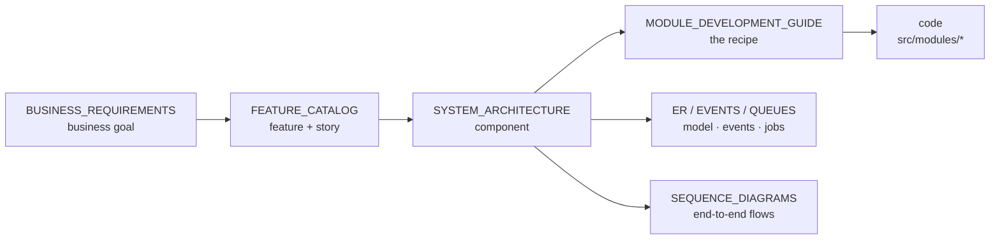

# Zaroorat — Engineering Documentation

Documentation home for the **Zaroorat** ride-hailing platform backend. It exists so any engineer, PM, ops person — or AI coding agent — can understand *what* we build, *why*, and *how*, and then produce code that matches the project instead of inventing its own patterns.

Docs flow **project → architecture (contracts) → engineering (rules) → operations**. The architecture-level contracts come *before* the engineering rules on purpose: an agent should read the system shape, the module recipe, and the data/API/security contracts before writing a line.

```
docs/
├── phase-0-project-planning.md   ← start here: the foundation
├── 00_PROJECT/                   ← why & what
├── 01_ARCHITECTURE/              ← how the system works + the contracts to build against
├── 02_ENGINEERING/               ← how we write code
├── 03_OPERATIONS/                ← how we run it
└── handbook/                     ← Engineering Handbook (VOLUME_*, in progress) — see below
```

> **Two doc sets, one source of truth.** The numbered guides above (`00_PROJECT` … `03_OPERATIONS`) are the **canonical, build-against contracts**. The `VOLUME_*` [Engineering Handbook](#engineering-handbook-volume_-in-progress) is a separate, in-progress long-form deliverable that expands on the same decisions. Where the two disagree, the numbered guides win until a volume is marked stable.

---

## 00_PROJECT — why & what
| Doc | Answers |
|---|---|
| [PROJECT_VISION](./00_PROJECT/PROJECT_VISION.md) | Mission, north-star, principles, non-goals |
| [BUSINESS_REQUIREMENTS](./00_PROJECT/BUSINESS_REQUIREMENTS.md) | Objectives, business reqs, stakeholders, KPIs, risks |
| [FEATURE_CATALOG](./00_PROJECT/FEATURE_CATALOG.md) | Features per module, user stories, acceptance criteria, NFRs |

## 01_ARCHITECTURE — how it works + build-against contracts
| Doc | Answers |
|---|---|
| [SYSTEM_ARCHITECTURE](./01_ARCHITECTURE/SYSTEM_ARCHITECTURE.md) | Components, data flow, deployment, algorithms, traceability |
| ⭐ [MODULE_DEVELOPMENT_GUIDE](./01_ARCHITECTURE/MODULE_DEVELOPMENT_GUIDE.md) | **The 12-step recipe every module follows** |
| [DATABASE_GUIDE](./01_ARCHITECTURE/DATABASE_GUIDE.md) | UUID, soft-delete, timestamps, migrations, repository pattern |
| [API_STANDARDS](./01_ARCHITECTURE/API_STANDARDS.md) | Response envelope, status codes, idempotency |
| [SECURITY_GUIDE](./01_ARCHITECTURE/SECURITY_GUIDE.md) | Auth, RBAC, secrets, PII, per-endpoint checklist |
| [EVENT_CATALOG](./01_ARCHITECTURE/EVENT_CATALOG.md) | Domain events + realtime socket events |
| [QUEUE_GUIDE](./01_ARCHITECTURE/QUEUE_GUIDE.md) | Workers, jobs, reliability contract |
| [SOCKET_GUIDE](./01_ARCHITECTURE/SOCKET_GUIDE.md) | Realtime rooms, events, server-authoritative rules |
| [ER_DIAGRAM](./01_ARCHITECTURE/ER_DIAGRAM.md) | Entities, relationships, trip state machine |
| [SEQUENCE_DIAGRAMS](./01_ARCHITECTURE/SEQUENCE_DIAGRAMS.md) | End-to-end runtime flows |
| [ADR/](./01_ARCHITECTURE/ADR/) | Architecture Decision Records |

## 02_ENGINEERING — how we write code
| Doc | Answers |
|---|---|
| [CODING_STANDARDS](./02_ENGINEERING/CODING_STANDARDS.md) | Language, module layering, boundaries, naming |
| [ERROR_HANDLING](./02_ENGINEERING/ERROR_HANDLING.md) | Typed errors → one central mapper → the envelope |
| [TESTING_GUIDE](./02_ENGINEERING/TESTING_GUIDE.md) | The pyramid, must-test cases, conventions |
| [GIT_WORKFLOW](./02_ENGINEERING/GIT_WORKFLOW.md) | Branching, commits, PRs, merging |
| [LOGGING_GUIDE](./02_ENGINEERING/LOGGING_GUIDE.md) | Structured logs, levels, correlation, redaction |
| [PERFORMANCE_GUIDE](./02_ENGINEERING/PERFORMANCE_GUIDE.md) | Targets, principles, scaling, measuring |
| [ENVIRONMENT_GUIDE](./02_ENGINEERING/ENVIRONMENT_GUIDE.md) | Config validation, variables, per-env |
| [CODE_REVIEW](./02_ENGINEERING/CODE_REVIEW.md) | What reviewers check, severity language |
| [DEVELOPER_ONBOARDING](./02_ENGINEERING/DEVELOPER_ONBOARDING.md) | Zero → first merged PR |

## 03_OPERATIONS — how we run it
| Doc | Answers |
|---|---|
| [DEPLOYMENT](./03_OPERATIONS/DEPLOYMENT.md) | Images, pipeline, zero-downtime migrations, rollback |
| [MONITORING](./03_OPERATIONS/MONITORING.md) | KPIs, RED/USE, queues, alerting |
| [RUNBOOK](./03_OPERATIONS/RUNBOOK.md) | Symptom → checks → actions |
| [INCIDENT_RESPONSE](./03_OPERATIONS/INCIDENT_RESPONSE.md) | Severity, roles, lifecycle, postmortems |
| [RELEASE_CHECKLIST](./03_OPERATIONS/RELEASE_CHECKLIST.md) | Pre-release → deploy → verify → rollback |

## Engineering Handbook (VOLUME_*, in progress)

A parallel, long-form **Zaroorat Engineering Handbook**, grouped under [`handbook/`](./handbook/) and planned as 20 volumes (00–19). It restates and deepens the decisions in the numbered guides above; it does **not** replace them yet. It lives in its own folder so its volume numbering doesn't collide with the canonical guides. Volumes 00–07 are written (04, 06, and 07 are in progress, delivered in parts; 05 is complete); 08–19 are reserved scaffolds (`.gitkeep` placeholders) to be filled in later.

| Volume | Doc | Covers |
|---|---|---|
| 00 | [Project Foundation](./handbook/00_PROJECT_FOUNDATION/VOLUME_00_PROJECT_FOUNDATION.md) | Vision, requirements, business rules, tech selection, roadmap |
| 01 | [Engineering Standards](./handbook/01_ENGINEERING_STANDARDS/VOLUME_01_ENGINEERING_STANDARDS.md) | Layering, boundaries, naming, errors, DTOs, response envelope |
| 02 | [Backend Architecture](./handbook/02_ARCHITECTURE/VOLUME_02_BACKEND_ARCHITECTURE.md) | Functional/non-functional architecture, module design, controllers |
| 03 | [Database Engineering](./handbook/03_DATABASE/VOLUME_03_DATABASE_ENGINEERING.md) | Prisma, schema conventions, constraints, soft-delete, migrations |
| 04 | [API Engineering](./handbook/04_API/VOLUME_04_API_ENGINEERING.md) *(in progress)* | API contract design: shape, naming, versioning, request/response standards |
| 05 | [Authentication & Security](./handbook/05_AUTH_SECURITY/VOLUME_05_AUTH_SECURITY_ENGINEERING.md) | Security philosophy, identity, authentication, authorization, API/infra security, data protection, fraud, compliance, monitoring, production readiness |
| 06 | [Modules Engineering](./handbook/06_MODULES/VOLUME_06_MODULES_ENGINEERING.md) *(in progress)* | Module philosophy, structure, layer responsibilities, communication, CRUD, docs, events/queues/sockets, testing, lifecycle, review, per-module guides, AI rules |
| 07 | [Real-Time Engineering](./handbook/07_REALTIME/VOLUME_07_REALTIME_ENGINEERING.md) *(in progress)* | WebSocket/Socket.IO, gateway, connection lifecycle, auth, driver/passenger tracking, ride sync, rooms, presence, Redis scaling, reliability, monitoring |
| 08–19 | *reserved* | `08_BACKGROUND_JOBS`, `09_TESTING`, `10_DEVOPS`, `11_MONITORING`, `12_PRODUCTION`, `13_AI`, `14_PROMPTS`, `15_TEMPLATES`, `16_ADR`, `17_PLAYBOOKS`, `18_CHECKLISTS`, `19_REFERENCE` |

> The handbook uses aspirational filenames in its cross-references (`CODING_STANDARDS.md`, `DATABASE_CONVENTIONS.md`, module `SPEC.md`) that map to the numbered guides here. Until the volumes are marked 🟢 stable, treat the numbered guides as authoritative.

---

## The AI-assisted engineering playbook

If Claude (or any agent) reads these first, it generates consistent, project-matching code. Priority order:

1. ⭐ [MODULE_DEVELOPMENT_GUIDE](./01_ARCHITECTURE/MODULE_DEVELOPMENT_GUIDE.md) — the recipe every feature follows
2. [CODING_STANDARDS](./02_ENGINEERING/CODING_STANDARDS.md) — the layering & boundary rules
3. [DATABASE_GUIDE](./01_ARCHITECTURE/DATABASE_GUIDE.md) — UUID, soft-delete, repository pattern
4. [API_STANDARDS](./01_ARCHITECTURE/API_STANDARDS.md) — one response envelope
5. [SECURITY_GUIDE](./01_ARCHITECTURE/SECURITY_GUIDE.md) — auth, RBAC, validation
6. [ERROR_HANDLING](./02_ENGINEERING/ERROR_HANDLING.md) — typed errors, one shape
7. [TESTING_GUIDE](./02_ENGINEERING/TESTING_GUIDE.md) — what tests to generate
8. [EVENT_CATALOG](./01_ARCHITECTURE/EVENT_CATALOG.md) — event names & flows
9. [QUEUE_GUIDE](./01_ARCHITECTURE/QUEUE_GUIDE.md) — where background jobs go
10. [SYSTEM_ARCHITECTURE](./01_ARCHITECTURE/SYSTEM_ARCHITECTURE.md) — the whole-system model

## How the layers connect (traceability)



Stable IDs cross-reference across docs: `BO-` (objective), `BR-` (business req), `FR-` (feature), `NFR-` (non-functional), `US-` (user story), `ADR-` (decision).

## Reading paths
- **AI agent / new engineer building a feature:** MODULE_DEVELOPMENT_GUIDE → CODING_STANDARDS → DATABASE_GUIDE → API_STANDARDS → ERROR_HANDLING → TESTING_GUIDE.
- **PM / stakeholder:** PROJECT_VISION → BUSINESS_REQUIREMENTS → FEATURE_CATALOG.
- **On-call:** MONITORING → RUNBOOK → INCIDENT_RESPONSE.
- **Reviewer:** CODING_STANDARDS → API_STANDARDS → DATABASE_GUIDE → CODE_REVIEW.

## Document lifecycle rules
1. **Docs live with the code** — versioned here, reviewed in the same PRs.
2. **A behavior change updates its doc in the same PR** — never "later."
3. **Architectural decisions get an [ADR](./01_ARCHITECTURE/ADR/)** (context → decision → consequences).
4. **Every doc has an owner and a last-updated date** in its header.
5. If a doc and the code disagree, that's a **bug** — raise it.

## Status legend
🟢 Stable · 🟡 Draft (under review) · 🔴 Open question (decide before building the module).

Most docs are 🟡 Draft pending an engineering + product review; [Phase 0 Planning](./phase-0-project-planning.md) is 🟢. Open decisions are tracked in [FEATURE_CATALOG §5](./00_PROJECT/FEATURE_CATALOG.md) and the [ADR index](./01_ARCHITECTURE/ADR/).
