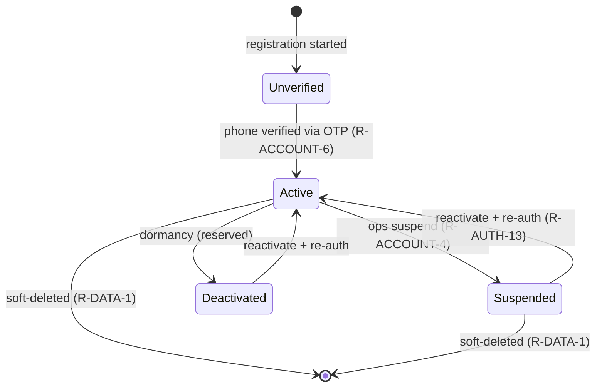
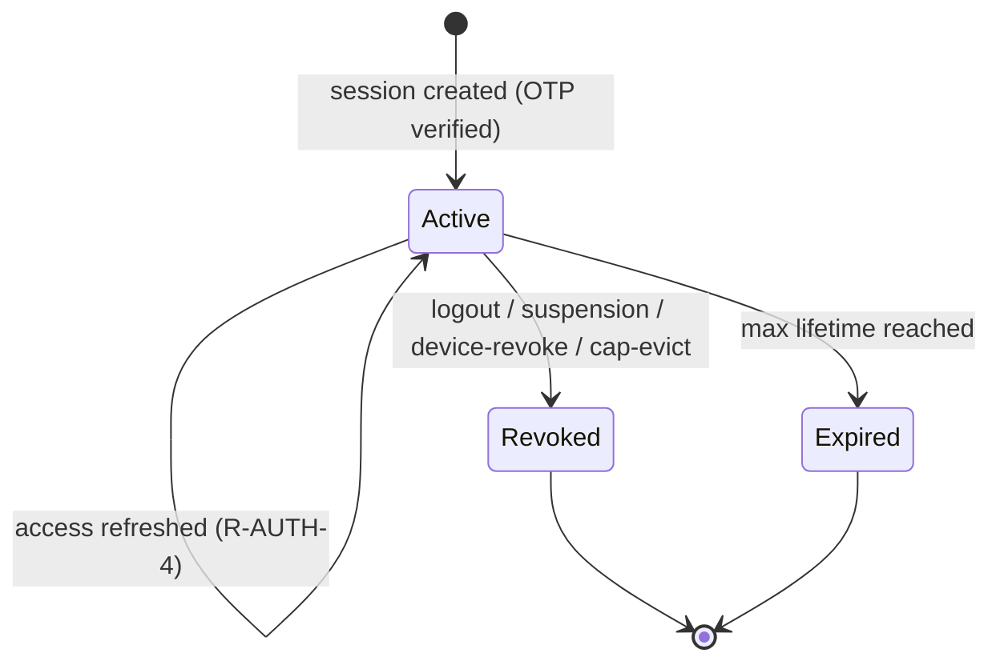
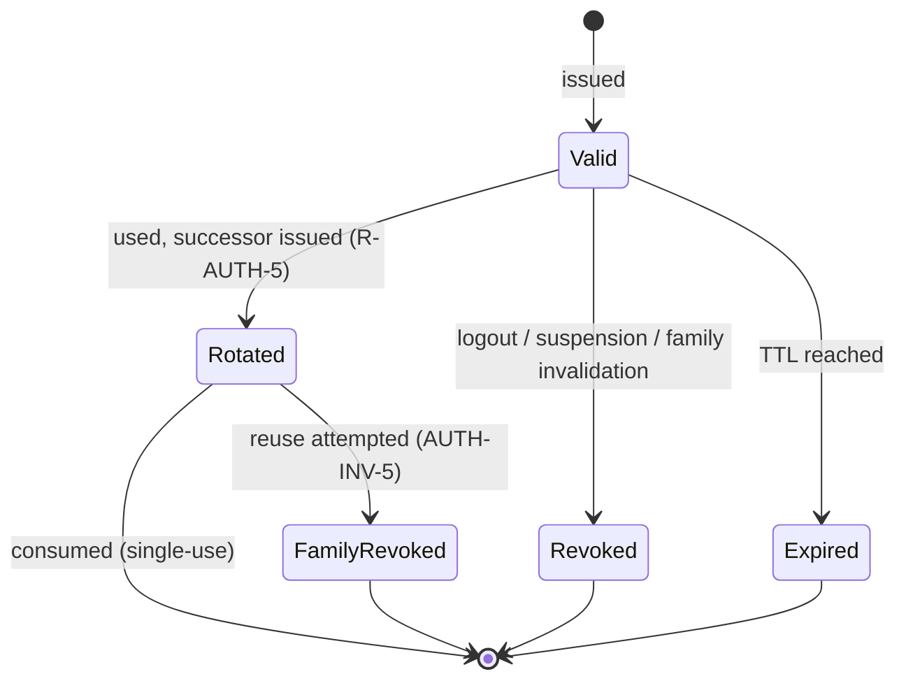
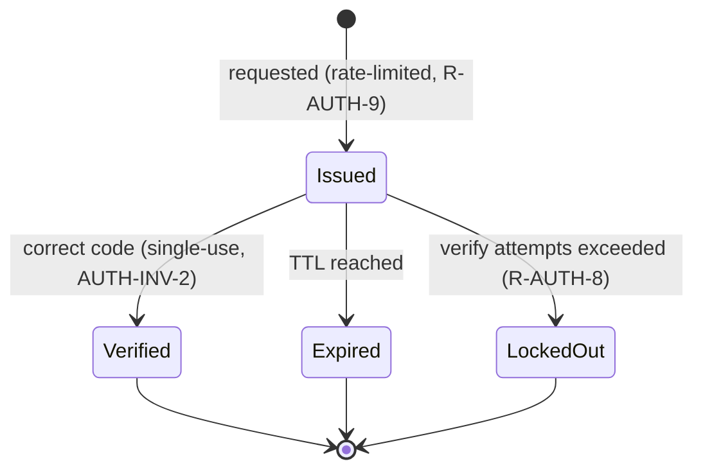
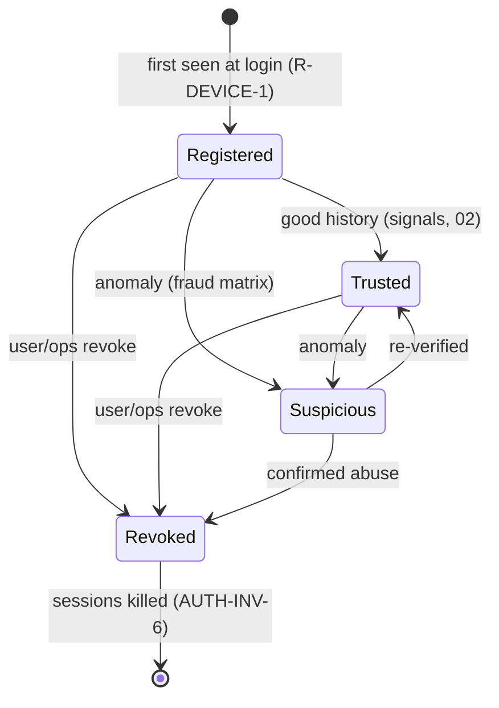

# AUTH — Business Requirements

> **Project:** Zaroorat — Ride-Hailing Platform
> **Module:** `auth` (+ `users`) · **Doc:** 01 of the AUTH chain
> **Status:** 🟢 Final (v1) · **Revision:** v1.0 · **Owner:** Product / Engineering (Auth) · **Last updated:** 2026-07-27
> **Answers:** _What must authentication and account access do, and why — independent of how it's built?_
> **Traces from:** [BRD BR-7](../BUSINESS_REQUIREMENTS.md) · [PRD FR-AUTH](../FEATURE_CATALOG.md)
> **Traces to:** 02_AUTH_SECURITY_SPEC → 03_AUTH_DATABASE_SPEC → 04_AUTH_API_SPEC → 05_AUTH_ERROR_CATALOG → 06_AUTH_EVENT_CATALOG → 07_AUTH_TEST_PLAN

---

## 1. Purpose

This document defines **what the AUTH module must do** — the identity model, the ways a person proves
who they are, how sessions and devices live and die, and how access is gated. It is the source of
truth the rest of the AUTH chain traces back to.

It is deliberately **model-agnostic**: no tables, columns, token formats, TTL values, or detection
thresholds are fixed here. Those are decisions for the Security Spec (02) and Database Spec (03).
Where the existing data models disagree (e.g. the Volume 6 DDL vs `schema.prisma`), this doc resolves
the disagreements that are genuinely _business_ decisions and records the rest as **Open decisions**
(§14) to be closed downstream.

> **Boundary discipline (kept throughout):** this doc states **policy and the distinctions that must
> exist**. It defers **mechanisms** (how a device becomes "suspicious", how an OTP is hashed, exact
> retention windows) to 02/03 and the retention policy (Volume 14). Every deferral is marked.

---

## 2. Scope

### 2.1 In scope

- **Registration & login** for riders and drivers via **phone number + OTP** (US-A1).
- **Identity & account model**: one identity per person, multi-role, account lifecycle states.
- **Account recovery policy** (lost SIM, number change, can't-receive-OTP) — the **business rules**;
  the flows themselves are deferred (§2.3, §4.2).
- **Session management**: issuing, refreshing, rotating, revoking, and **capping** sessions (US-A2).
- **Device identity & trust states** — the business semantics that gate step-up and revocation (§6).
- **Authorization primitives**: role assignment and deny-by-default enforcement every other module
  consumes, including the **role-vs-operational-status** composition for drivers (US-A3, NFR-7).
- **Account state transitions that gate access**: suspension → loss of access; reactivation.
- **Abuse resistance for the auth surface**: OTP rate limiting, attempt lockout, enumeration
  resistance, refresh-reuse detection, and the **fraud response policy** (§8.1).

### 2.2 Out of scope (owned elsewhere)

- **Driver KYC / document verification and the driver approval FSM** — owned by `onboarding`
  / `documents` / `vehicles` (PRD FR-ONBOARD). AUTH grants the `driver` **role**; it does **not**
  decide whether a driver is _operable_ (§3.2, R-AUTH-23).
- **User profile data** (name, saved places, emergency contacts) — owned by `users`.
- **Admin/support console policies beyond role checks** — owned by `admin` (PRD FR-ADMIN).
- **Notification delivery** (OTP SMS, security alerts) — AUTH _requests_ a send; delivery is owned by
  `notifications` (PRD FR-NOTIFY).
- **Fraud/risk detection signals & scoring** (fingerprint scoring, impossible-travel computation) —
  AUTH defines the **response policy** (§8.1); the **detection** is owned by 02 / risk (OD-8).

### 2.3 Deferred (not v1)

- Email + password credentials, social login (Google/Apple), biometric unlock.
- Additional second factors beyond phone-OTP (authenticator app, hardware key, step-up MFA).
- **Self-service account recovery, phone-number change, and account deletion _flows_** — the
  **policy** for these exists now (§4.2); the implemented flows are P1+.

> Deferred, not rejected. `schema.prisma` already carries `email`, `password_hash`, and
> `RESET_PASSWORD` / `CHANGE_PHONE` OTP purposes; the PRD commits only to phone+OTP for v1 (US-A1).
> The v1 requirement is phone+OTP; the extra factors and flows are tracked in §14 so the schema and
> security model can leave room for them without shipping them.

---

## 3. Actors & roles

| Actor       | Description                                                        | How AUTH treats it                                                                                  |
| ----------- | ------------------------------------------------------------------ | --------------------------------------------------------------------------------------------------- |
| **Rider**   | A person requesting rides.                                         | Default role on first registration.                                                                 |
| **Driver**  | A person providing rides (a rider who also onboarded as a driver). | Additional role, granted when driver onboarding **begins**; being a driver ≠ being operable (§3.2). |
| **Admin**   | Operations staff (verify, price, resolve).                         | Privileged role, provisioned out-of-band (not self-service).                                        |
| **Support** | Support staff (tickets, incidents).                                | Privileged role, provisioned out-of-band.                                                           |
| **System**  | Platform services acting without a human.                          | Service identity; not a user account.                                                               |

### 3.1 Role model (business decision — resolves the fork)

An identity may hold **more than one role at once** (a customer who is also a driver is **one account**
with `{customer, driver}`), per **R-ACCOUNT-3**. The single-role enum in `schema.prisma` (`role
UserRole`) **cannot represent this** and is inconsistent with the requirement; 03 must model roles as
a **set**, not a scalar (§14, OD-2).

### 3.2 Role ≠ operational eligibility (resolves your review item 5)

Holding the **`driver` role** means only that the identity **participates in the driver domain**. It
does **not** by itself authorize accepting rides. Rather than invent a parallel "Driver Status"
enum, we bind to the **canonical driver verification state already in the schema** — the `drivers`
table's `verification_status` (`DriverVerificationStatus`:
`PENDING → DOCUMENT_REVIEW → VERIFIED / REJECTED / SUSPENDED`) together with the `is_suspended` flag.
**`VERIFIED` (and not suspended) is the operable state.**

Authorization for **driver-privileged ride operations** is therefore a **conjunction**:

```
authorize(ride.accept) := has_role(driver)
                          AND drivers.verification_status = 'VERIFIED'   -- operable (owned by onboarding)
                          AND drivers.is_suspended = false
                          AND account.status = 'active'
```

- **`has_role(driver)`** — owned by AUTH.
- **operable status** (`verification_status = VERIFIED` ∧ ¬`is_suspended`) — owned by `onboarding` /
  `drivers`; AUTH consumes it, never sets it.
- A newly-onboarding driver has the role but is **not operable**; ride-accept must be denied until
  `VERIFIED`. This is **R-AUTH-23**, and it is the single most important cross-module authorization
  contract in this doc.

> **Why this framing beats a new status enum:** a second Pending/Verified/Rejected/Suspended enum
> living in AUTH would duplicate — and inevitably drift from — the `drivers.verification_status`
> machine that already gates operability. One source of truth, consumed by the authz check, cannot
> drift.
>
> **Schema note (driver chain):** `drivers` previously carried **both** `verification_status` and an
> identical `onboarding_status` (same enum values). That redundancy has been collapsed — AUTH binds to
> the single `verification_status` gate (indexed, code-consumed), backed by `DriverVerificationStatus`.

---

## 4. Identity & account requirements

`R-ACCOUNT-*` is shared with Volume 5/6; **2–4 already exist** and are restated for traceability;
**5+ are introduced by this doc**.

| ID               | Requirement                                                                                                                                                                                           | Traces            |
| ---------------- | ----------------------------------------------------------------------------------------------------------------------------------------------------------------------------------------------------- | ----------------- |
| **R-ACCOUNT-2**  | An account is uniquely identified by its **phone number**; at most one active account per phone.                                                                                                      | BO-3, BR-7        |
| **R-ACCOUNT-3**  | One identity **may hold multiple roles** (rider and driver on the same account).                                                                                                                      | BR-7              |
| **R-ACCOUNT-4**  | An account can be **suspended**; a suspended account cannot obtain or use access.                                                                                                                     | BO-3, BR-9        |
| **R-ACCOUNT-5**  | Account lifecycle is an explicit set of **business states** with defined transitions (§4.1).                                                                                                          | BO-3              |
| **R-ACCOUNT-6**  | An account's **phone number is verified** (via OTP) before the account is usable.                                                                                                                     | BO-3              |
| **R-ACCOUNT-7**  | Roles are **granted/revoked** through defined events (registration grants `customer`; starting driver onboarding grants `driver`); revocation is possible and audited.                                | BR-9              |
| **R-ACCOUNT-8**  | An account is **bound to its verified phone**; losing access to that number requires **identity re-verification** through a defined recovery path — no reset bypasses verification.                   | BO-3, NFR-7       |
| **R-ACCOUNT-9**  | A **phone-number change** is an authenticated, re-verified, audited operation that **preserves the identity and all its history** (roles, ledger, trips, ratings). Flow deferred; policy binding now. | BO-2, BO-3        |
| **R-ACCOUNT-10** | **Support-assisted recovery** requires audited identity verification, is rate-limited, and **never discloses credentials or OTPs** to staff.                                                          | NFR-SEC-03, NFR-7 |

### 4.1 Account lifecycle (business states)

- **Unverified** — registration started, phone not yet verified. Cannot use the platform.
- **Active** — normal; may authenticate and use the platform.
- **Suspended** — access blocked by ops (policy, safety, fraud). Reversible. All sessions end
  (AUTH-INV-4).
- **Deactivated** — self- or system-initiated dormancy (reserved; not v1 self-service). No access
  until reactivated + re-auth.

> The exact stored enum (`{active, suspended}` in the Vol 6 DDL vs `{active, inactive, blocked,
suspended}` in Prisma) is an **implementation decision for 03** (§14, OD-4). At the business level,
> the four states above are the required distinctions; an ops label like "blocked" maps onto
> **Suspended**. Records are **soft-deleted, never physically removed** (R-DATA-1).

### 4.2 Account recovery & phone-number change (resolves your review item 2)

Business policy that must hold even though the **flows are deferred** (§2.3):

- **Lost SIM / same number retained** — the user re-verifies via OTP to the same number; nothing
  special is required because identity is bound to the number, not the SIM.
- **Number no longer reachable (lost/ported/changed)** — the account is **not silently abandoned**.
  Recovery requires **stronger identity proof** than a single OTP (the exact proof — e.g. a second
  factor, KYC match for drivers, or audited support verification — is an **02 decision**, OD-9). A
  successful recovery **re-binds** the identity to the new number under R-ACCOUNT-9 and preserves all
  history.
- **Cannot receive OTP (delivery failure)** — the user is offered channel fallback (SMS → voice, per
  `notifications`) and clear retry/rate-limit messaging; this is a **delivery** concern, not an
  identity change.
- **No path may bypass verification** (R-ACCOUNT-8) and every recovery action is **audited**
  (R-ACCOUNT-10, R-AUTH-21).

---

## 5. Authentication & session requirements

| ID            | Requirement                                                                                                                                                                                                       | Traces                    |
| ------------- | ----------------------------------------------------------------------------------------------------------------------------------------------------------------------------------------------------------------- | ------------------------- |
| **R-AUTH-1**  | A user registers **and** logs in with **phone + OTP**; first successful verification creates the account.                                                                                                         | US-A1, R-ACCOUNT-6        |
| **R-AUTH-2**  | An OTP is **time-limited, single-use, and rate-limited** per phone and per device.                                                                                                                                | US-A1                     |
| **R-AUTH-3**  | On successful OTP, the system issues a **short-lived access credential** plus a **longer-lived refresh credential**.                                                                                              | US-A2                     |
| **R-AUTH-4**  | Access refreshes **transparently** via the refresh credential until the session expires or is revoked — no re-login.                                                                                              | US-A2                     |
| **R-AUTH-5**  | Refresh credentials **rotate on use**; reuse of a rotated credential is treated as theft and **invalidates the session family**.                                                                                  | US-A2, NFR-7              |
| **R-AUTH-6**  | A user can **log out**, revoking the current session immediately.                                                                                                                                                 | US-A2                     |
| **R-AUTH-7**  | **Revoked, expired, or blacklisted** credentials are rejected on every request.                                                                                                                                   | US-A2, NFR-7              |
| **R-AUTH-8**  | **Failed OTP attempts are throttled and logged**; exceeding the limit **locks** further attempts for a cooldown.                                                                                                  | US-A1                     |
| **R-AUTH-9**  | Repeated **OTP requests** for the same phone/device are rate-limited independently of verify attempts.                                                                                                            | US-A1                     |
| **R-AUTH-10** | Auth flows are **idempotent under retry** (a dropped-then-retried verify/refresh does not double-issue or corrupt state).                                                                                         | NFR-6, NFR-RESIL-02, A6.1 |
| **R-AUTH-11** | A user may be signed in on **multiple devices**; sessions are independent and individually revocable.                                                                                                             | US-A2                     |
| **R-AUTH-23** | **Driver-privileged ride operations require BOTH the `driver` role AND an operable driver status** (`drivers.verification_status = VERIFIED`) AND an active account. Role alone never authorizes ride acceptance. | US-A3, FR-ONBOARD, NFR-7  |
| **R-AUTH-24** | Concurrent active sessions per account are **capped**; on exceeding the cap the **oldest session is revoked** by default (§5.2).                                                                                  | US-A2, NFR-7              |
| **R-AUTH-25** | Defined abuse signals map to defined **business responses** per the fraud matrix (§8.1).                                                                                                                          | NFR-7, BRD-Risk-Fraud     |

### 5.1 Suspension ⇒ access removal

| ID            | Requirement                                                                                                  | Traces     |
| ------------- | ------------------------------------------------------------------------------------------------------------ | ---------- |
| **R-AUTH-12** | When an account is **suspended** (R-ACCOUNT-4), **all active sessions are revoked** and new auth is refused. | BO-3, BR-9 |
| **R-AUTH-13** | **Reactivation** restores the ability to authenticate; it does **not** silently restore old sessions.        | BO-3       |

### 5.2 Session limit policy (resolves your review item 6)

- Each account has a **maximum number of concurrent active sessions** (a **configurable cap**;
  the numeric value is config, not fixed here — OD-5).
- **Default behavior on exceeding the cap: revoke the oldest session** and admit the new one. This is
  chosen over _deny-login_ (user-hostile — a person with an old phone stuck in a drawer can't sign in
  on their new one) and over _interactive "pick a device to remove"_ (a **P1 UX**, OD-5).
- The revoked session is ended per AUTH-INV-4 and emits `auth.session.revoked` (Appendix C) so the
  affected device learns it was signed out.
- SOS and safety flows are **never** blocked by this cap (consistency with PRD FR-SOS).

---

## 6. Device trust model (resolves your review item 1)

Sessions are bound to **devices**, and a device carries a **trust state**. AUTH defines the **states
and what they gate**; the **signals** that move a device between states are owned by 02 / risk
(OD-8). `schema.prisma` already supports this (`user_devices` with `device_fingerprint`, `is_rooted`,
`is_jailbroken`, `platform`).

| ID             | Requirement                                                                                                                                        | Traces       |
| -------------- | -------------------------------------------------------------------------------------------------------------------------------------------------- | ------------ |
| **R-DEVICE-1** | Every session is **bound to a device identity** captured at login.                                                                                 | US-A2, NFR-8 |
| **R-DEVICE-2** | A device carries a **trust state** (`registered → trusted → suspicious → revoked`) that can gate step-up verification and revocation.              | NFR-7        |
| **R-DEVICE-3** | A **revoked** device's sessions are revoked and it must **re-register + re-verify** (AUTH-INV-6).                                                  | NFR-7        |
| **R-DEVICE-4** | A transition to **suspicious** triggers the business response in the fraud matrix (§8.1); the **detecting signal** is owned by 02.                 | NFR-7        |
| **R-DEVICE-5** | Device risk signals (fingerprint, root/jailbreak, platform) are captured for assessment and handled as **PII/security data** under privacy policy. | NFR-10       |

**Trust-state meaning (business):**

- **Registered** — first seen; normal auth applies; no reduced friction.
- **Trusted** — good history; **eligible** for reduced friction later (e.g. MFA step-down) — the
  _reward_ is deferred, but the state must exist now so history accrues.
- **Suspicious** — an anomaly was observed (impossible travel, fingerprint mismatch, rooted device on
  a sensitive action); the platform may **require re-verification / step-up**.
- **Revoked** — barred; sessions killed; re-registration required.

---

## 7. Authorization requirements

| ID            | Requirement                                                                                                                                                                      | Traces            |
| ------------- | -------------------------------------------------------------------------------------------------------------------------------------------------------------------------------- | ----------------- |
| **R-AUTH-14** | Every protected endpoint requires a valid session — **deny by default**; no unauthenticated data access.                                                                         | NFR-7             |
| **R-AUTH-15** | Endpoints declare the **role(s)** they require; access is granted only if the identity holds a required role.                                                                    | US-A3, NFR-7      |
| **R-AUTH-16** | Role checks use the identity's **current** roles and account state at request time (a just-suspended user is denied even with a not-yet-expired access credential — AUTH-INV-3). | NFR-7             |
| **R-AUTH-17** | Privileged roles (**admin, support**) are **provisioned out-of-band**, never self-granted via the public flow.                                                                   | BR-9, NFR-7       |
| **R-AUTH-23** | (Restated from §5) Driver ride operations require **role `driver` AND operable status AND active account** — the conjunction in §3.2.                                            | FR-ONBOARD, NFR-7 |

> Authorization is a **composition of three facts** — _roles_ (AUTH), _account state_ (AUTH), and
> _domain operability_ (e.g. `drivers.verification_status`, owned elsewhere). AUTH provides the primitives and the
> composition contract; it does not own every input.

---

## 8. Security & abuse-resistance requirements (business level)

Mechanisms (hashing, token type, exact limits, storage tier, detection) live in **02**. At the
business level:

| ID            | Requirement                                                                                                                                                                | Traces                 |
| ------------- | -------------------------------------------------------------------------------------------------------------------------------------------------------------------------- | ---------------------- |
| **R-AUTH-18** | Secrets (OTP, refresh credentials) are **never stored/returned in plaintext** and never logged.                                                                            | NFR-7, NFR-10          |
| **R-AUTH-19** | Auth responses are **enumeration-resistant**: an attacker cannot distinguish "registered" from "not" via the response.                                                     | NFR-7                  |
| **R-AUTH-20** | **OTP delivery volume and verify attempts are rate-limited** to bound SMS cost and brute-force risk.                                                                       | NFR-7, BO-5            |
| **R-AUTH-21** | **Sensitive auth actions** (suspension, role change, forced logout, admin session revocation, recovery) are **audited** with actor, action, and before/after.              | NFR-SEC-03, R-DATA-2   |
| **R-AUTH-22** | An **abuse/attempt trail** sufficient for fraud investigation is retained (failed OTPs, lockouts, refresh reuse, device flags). Storage tier decided in 02/03 (§14, OD-3). | BRD-Risk-Fraud, NFR-10 |

### 8.1 Fraud response policy matrix (resolves your review item 4)

The **business response** to each abuse signal. **Detection** (thresholds, scoring, what counts as
"impossible travel") is owned by 02 / risk (OD-8); this table fixes **what we do when it fires**.

| Abuse signal                          | Business response                                                                 | Requirement / invariant |
| ------------------------------------- | --------------------------------------------------------------------------------- | ----------------------- |
| OTP brute force (verify attempts)     | **Lock out** the phone/device for a cooldown; log.                                | R-AUTH-8                |
| OTP request flooding                  | **Rate-limit** further sends; back off.                                           | R-AUTH-9, R-AUTH-20     |
| Refresh-token reuse (rotated token)   | **Revoke the entire session family**; force re-auth.                              | R-AUTH-5, AUTH-INV-5    |
| Impossible travel / geo-velocity      | Mark device **suspicious**; **require re-verification** (step-up).                | R-DEVICE-4              |
| Too many active devices (over cap)    | **Revoke the oldest session** (default); admit the new.                           | R-AUTH-24               |
| Suspicious / mismatched fingerprint   | Mark device **suspicious**; **require re-verification** for sensitive actions.    | R-DEVICE-2, R-DEVICE-4  |
| Rooted/jailbroken on sensitive action | Elevated risk → **step-up** or **deny** the sensitive action (policy per action). | R-DEVICE-5              |
| Confirmed account compromise (ops)    | **Suspend** account → all sessions revoked; audited recovery required.            | R-AUTH-12, R-ACCOUNT-10 |

> These responses must **degrade safely**: if the risk service is unavailable, the platform falls
> back to the deterministic controls (rate limits, rotation, lockout) — it never fails **open**.

---

## 9. Non-functional requirements that bind AUTH

| Platform NFR            | What it means for AUTH                                                                                                                                         |
| ----------------------- | -------------------------------------------------------------------------------------------------------------------------------------------------------------- |
| **NFR-1 Performance**   | Login/refresh/authz sit on every request's hot path — the per-request authz check must be sub-millisecond and not hit a slow store (p95 < 300 ms server-side). |
| **NFR-3 Availability**  | Auth is a hard dependency of the whole platform; an auth outage is a total outage. ≥ 99.9%.                                                                    |
| **NFR-5 Consistency**   | Account state and revocation are **DB-authoritative**; a revoked session must not be honored because a cache lagged.                                           |
| **NFR-6 Idempotency**   | Verify/refresh/logout are safe to retry (R-AUTH-10).                                                                                                           |
| **NFR-7 Security**      | Auth **is** the enforcement point for deny-by-default and PII protection.                                                                                      |
| **NFR-8 Observability** | Every auth decision and lifecycle event (Appendix C) is traceable without logging secrets.                                                                     |
| **NFR-10 Privacy**      | Phone numbers, credentials, and device signals are PII; handled and retained per policy.                                                                       |
| **NFR-11 Localization** | OTP and auth messages are localizable (user `locale`, A6.4).                                                                                                   |

---

## 10. Invariants (must hold at the enforcement/data layer)

Non-negotiables 03/04 must make **structurally impossible** to violate (Vol 6 principle #5).

| ID             | Invariant                                                                                                                                           | Backed by (target doc)            |
| -------------- | --------------------------------------------------------------------------------------------------------------------------------------------------- | --------------------------------- |
| **AUTH-INV-1** | **At most one active account per phone number.**                                                                                                    | Unique constraint (03)            |
| **AUTH-INV-2** | **An OTP can be consumed at most once**, even under concurrent verify attempts.                                                                     | Atomic consume (02/03)            |
| **AUTH-INV-3** | A request from a **suspended** account is **denied**, regardless of an otherwise-valid credential.                                                  | State check on hot path (02/04)   |
| **AUTH-INV-4** | On suspension or logout, **the affected sessions cannot be used again** (revocation is effective).                                                  | Revocation store (02/03)          |
| **AUTH-INV-5** | A **rotated/consumed refresh credential cannot be reused**; reuse invalidates the session family.                                                   | Rotation chain (03)               |
| **AUTH-INV-6** | A **revoked device's** sessions cannot be used; it must re-register/re-verify.                                                                      | Device state + revocation (02/03) |
| **AUTH-INV-7** | A driver-privileged ride operation is **impossible** unless `role=driver` AND `drivers.verification_status=VERIFIED` AND `account=active` all hold. | Composed authz guard (04)         |

---

## 11. Retention & operational data policy (resolves your review item 7)

Auth-specific retention. Exact windows are **policy-driven** (Volume 14) and enforced by scheduled
jobs; the storage tier for some rows depends on OD-3.

| ID            | Data                                                          | Policy (business intent)                                                                                                                          | Ties to                 |
| ------------- | ------------------------------------------------------------- | ------------------------------------------------------------------------------------------------------------------------------------------------- | ----------------------- |
| **R-AUTH-26** | **OTPs**                                                      | Ephemeral; **auto-expire** at TTL. If also persisted (OD-3), a **purge job** removes verified/expired rows on a short cycle. Never retained long. | R-DATA-3, OD-3          |
| **R-AUTH-27** | **Refresh tokens (revoked/rotated)**                          | Retained (hashed) for a **bounded theft-detection window**, then purged. Not kept indefinitely.                                                   | R-AUTH-5, R-DATA-3      |
| **R-AUTH-28** | **Auth audit trail** (suspensions, role/recovery actions)     | **Long retention** (compliance); append-only, archived to cold storage — never shredded while a dispute/compliance need may exist.                | R-DATA-2, NFR-COMPLY-02 |
| **R-AUTH-29** | **Session/device history**                                    | **Moderate retention** for security review, then archived/pruned; active revocation state is authoritative and kept while relevant.               | R-DATA-3, NFR-10        |
| **R-AUTH-30** | **Abuse/attempt trail** (failed OTPs, lockouts, device flags) | Retained long enough for fraud investigation (§8.1), then pruned per policy.                                                                      | R-AUTH-22, R-DATA-3     |

> **Retention never overrides immutability** for audit records (R-AUTH-28) — we _archive_, we don't
> delete what compliance may need.

---

## 12. Assumptions & dependencies

- An **SMS/OTP provider** is available in-market (BRD §4.3); OTP delivery depends on `notifications`,
  with **voice fallback** for delivery failures (§4.2).
- Clients are smartphones on **variable connectivity** — retries/reconnects are normal, which is why
  idempotency (R-AUTH-10) is first-class.
- Phone numbers are **E.164** (`+91…`), consistent with `users.phone`.
- A **risk/fraud service** exists (or a stub) to emit the signals in §8.1; if unavailable, controls
  **fail closed** to deterministic limits (§8.1 note).
- The **ephemeral tier (Redis)** exists for hot auth state, with **Postgres as system of record**
  (ADR-0003). Which auth artifacts live where is OD-3.

---

## 13. Acceptance criteria (module "done" for v1)

AUTH v1 is complete when:

1. A new user can **register/log in with phone + OTP**; a returning user logs in the same way
   (R-AUTH-1).
2. OTP is **time-limited, single-use, rate-limited**, and **failed attempts lock out** after threshold
   (R-AUTH-2/8, AUTH-INV-2).
3. A session **refreshes transparently** and **rotates**; a **replayed** refresh credential is
   rejected and kills the family (R-AUTH-4/5, AUTH-INV-5).
4. **Logout** and **suspension** immediately and irreversibly end the affected sessions (R-AUTH-6/12,
   AUTH-INV-3/4).
5. Every protected endpoint is **deny-by-default** and enforces required roles; a **multi-role** user
   (rider + driver) is authorized correctly for both (R-AUTH-14/15, R-ACCOUNT-3).
6. A user holding the **`driver` role but not yet `VERIFIED`** is **denied ride-accept**, and becomes
   authorized only once operable (R-AUTH-23, AUTH-INV-7). _(Key regression guard.)_
7. The **concurrent-session cap** is enforced — a login past the cap **revokes the oldest session**
   and that device is signed out (R-AUTH-24).
8. A **revoked device** cannot use its sessions (R-DEVICE-3, AUTH-INV-6).
9. Verify/refresh/logout are **idempotent under retry** (R-AUTH-10).
10. Sensitive auth actions are **audited**; **no secret is ever logged/returned** (R-AUTH-18/21).
11. Enumeration of registered phones via auth responses is **not possible** (R-AUTH-19).
12. The **fraud response matrix** (§8.1) and **recovery policy** (§4.2) are documented and their
    deterministic responses (lockout, family-revoke, session-cap) are enforced. _(Detection signals
    may arrive later; the responses ship in v1.)_

---

## 14. Open decisions — ✅ all closed

**Status: every OD below is resolved.** OD-3/5/6/8/9 closed in **doc 02** (§11); OD-1/2/4/7 closed in
**doc 03** (§2). The table records the original fork; the "Notes" column points at the resolution.

| ID       | Decision                                                                                                                                         | Owner doc | Notes / lean                                                            |
| -------- | ------------------------------------------------------------------------------------------------------------------------------------------------ | --------- | ----------------------------------------------------------------------- |
| **OD-1** | **Identity ID type**: `BIGINT` vs `UUID` vs ULID.                                                                                                | 03        | Pick one **system-wide**.                                               |
| **OD-2** | **Role storage**: role **set** (per R-ACCOUNT-3) vs single enum.                                                                                 | 03        | Business decided — **must be a set** (§3.1); OD is only _how_ to store. |
| **OD-3** | **OTP & attempt-trail storage tier**: Redis-only vs durable `otp_verifications` vs Redis-hot + Postgres-audit split.                             | 02, 03    | Reconcile R-AUTH-22/26 (fraud trail, retention).                        |
| **OD-4** | **Stored account-state enum** wording.                                                                                                           | 03        | Must express the four §4.1 states.                                      |
| **OD-5** | **Session cap value** and whether the **interactive "remove a device"** variant ships (vs oldest-revoke default).                                | 02, 03    | Default policy set (§5.2); value = config; interactive = **P1**.        |
| **OD-6** | **Token format**: opaque vs JWT (access) + opaque rotating refresh.                                                                              | 02, 04    | NFR-1 (fast authz) vs NFR-5 (instant revocation) trade-off.             |
| **OD-7** | **Deferred factors**: reserve `email` / `password_hash` / extra OTP purposes in the model now or later?                                          | 02, 03    | Deferred per §2.3.                                                      |
| **OD-8** | **Risk/fraud detection**: the **signals, thresholds, and scoring** behind §8.1 (impossible travel, fingerprint match, device trust transitions). | 02        | Responses fixed here; **detection** deferred.                           |
| **OD-9** | **Recovery proof**: what identity proof is required to recover an unreachable number / assist via support.                                       | 02        | Policy fixed (§4.2); the **proof mechanism** deferred.                  |

> Each OD closed before its owning doc reached Final — satisfied: docs 02 and 03 are Final (v1).

---

## 15. Traceability

| AUTH requirement                       | Up-traces to                                       |
| -------------------------------------- | -------------------------------------------------- |
| R-ACCOUNT-2…10 (identity, recovery)    | BR-7, BO-2, BO-3, BR-9, NFR-SEC-03                 |
| R-AUTH-1…11 (auth & session)           | FR-AUTH (US-A1, US-A2), BR-7                       |
| R-AUTH-12/13 (suspension/reactivation) | BO-3, BR-9                                         |
| R-AUTH-14…17, 23 (authorization)       | FR-AUTH (US-A3), FR-ONBOARD, NFR-7                 |
| R-AUTH-18…22, 25 (security/abuse)      | NFR-7, NFR-10, NFR-SEC-03, BRD Risk (Fraud)        |
| R-AUTH-24 (session cap)                | US-A2, NFR-7                                       |
| R-DEVICE-1…5 (device trust)            | US-A2, NFR-7, NFR-10                               |
| R-AUTH-26…30 (retention)               | R-DATA-2/3, NFR-COMPLY-02, NFR-10                  |
| AUTH-INV-1…7                           | R-ACCOUNT-2, R-AUTH-2/5/12/23, R-DEVICE-3, NFR-5/7 |
| NFR bindings (§9)                      | PRD §3 NFR-1/3/5/6/7/8/10/11                       |

**Down-traces:** every ID above is a citable anchor for 02–07. **Next: 02_AUTH_SECURITY_SPEC** takes
R-AUTH-2/5/8/18/19/20, R-DEVICE-2/4, AUTH-INV-2/5, and the §8.1 matrix and turns them into
mechanisms (hashing, token type, limits, storage tier, detection) — closing OD-3, OD-6, OD-8, OD-9.

---

## Appendix A — State machines

### A.1 Account lifecycle



### A.2 Session lifecycle



### A.3 Refresh-token lifecycle



### A.4 OTP lifecycle



### A.5 Device trust lifecycle



---

## Appendix B — Glossary

| Term                   | Definition                                                                                                                                                                 |
| ---------------------- | -------------------------------------------------------------------------------------------------------------------------------------------------------------------------- |
| **Identity**           | The single durable record of a person, keyed by verified phone number. Holds roles, state, and history. One person → one identity (R-ACCOUNT-2).                           |
| **Account**            | The identity plus its lifecycle state (Unverified / Active / Suspended / Deactivated). Used interchangeably with Identity in this doc.                                     |
| **Role**               | A capability class the identity holds (`customer`, `driver`, `admin`, `support`). An identity may hold **several** (R-ACCOUNT-3).                                          |
| **Permission**         | The right to perform a specific action, derived from **role + account state + domain operability** (§3.2). Not stored directly; computed by the authz check.               |
| **Operable driver**    | A `driver`-role identity whose `drivers.verification_status = VERIFIED` (and not suspended) — the only state permitted to accept rides (R-AUTH-23). Owned by `onboarding`. |
| **Session**            | An authenticated context on one device, alive from login until logout/expiry/revocation. Individually revocable (R-AUTH-11).                                               |
| **Session family**     | The chain of sessions/refresh tokens descending from one login through rotations. Reuse of a rotated token revokes the **whole family** (AUTH-INV-5).                      |
| **Device**             | A physical client (phone) identified at login, carrying a **trust state** and risk signals (§6).                                                                           |
| **Credential**         | Any secret proving identity/authority (OTP, access credential, refresh credential). Never stored/returned in plaintext (R-AUTH-18).                                        |
| **Access credential**  | Short-lived proof attached to each request; refreshed transparently (R-AUTH-3/4). Format (JWT vs opaque) is OD-6.                                                          |
| **Refresh credential** | Longer-lived, **single-use, rotating** secret used to mint new access credentials (R-AUTH-5).                                                                              |
| **OTP**                | One-time passcode sent to the phone; time-limited, single-use, rate-limited (R-AUTH-2). Stored only hashed.                                                                |
| **Step-up**            | Requiring additional verification for a sensitive action when device trust is degraded (§6, §8.1).                                                                         |

---

## Appendix C — Auth business event lifecycle (seed for 06)

The **business-significant** auth events, to be formalized (envelopes, schemas, delivery) in
**06_AUTH_EVENT_CATALOG**. Listed here so audit (R-AUTH-21) and observability (NFR-8) requirements
have a concrete surface. Names follow the repo's **dotted lowercase** domain-event convention
(`ride.requested`, `user.suspend`), **not** SCREAMING_SNAKE — kept consistent with Volume 5 §08.

| Business event                       | Emitted when                                      | Primary use            |
| ------------------------------------ | ------------------------------------------------- | ---------------------- |
| `auth.otp.requested`                 | An OTP send is requested (pre-delivery).          | Rate-limit, abuse      |
| `auth.otp.sent`                      | Delivery accepted by the provider.                | Observability, cost    |
| `auth.otp.verified`                  | Correct OTP consumed.                             | Audit, funnel          |
| `auth.login.succeeded`               | Session issued after verification.                | Audit, security        |
| `auth.login.failed`                  | Verification failed (wrong/expired/locked).       | Abuse detection        |
| `auth.session.created`               | A new session/device binding is established.      | Device trust, audit    |
| `auth.token.refreshed`               | Access credential refreshed via rotation.         | Observability          |
| `auth.refresh.reuse_detected`        | A rotated refresh credential was replayed.        | Fraud (family revoke)  |
| `auth.session.revoked`               | Session ended (logout, cap-evict, admin, device). | Security, UX signal    |
| `auth.device.flagged`                | Device moved to `suspicious`.                     | Fraud, step-up         |
| `auth.device.revoked`                | Device moved to `revoked`.                        | Security               |
| `account.role.granted` / `.revoked`  | A role is added/removed.                          | Audit                  |
| `account.suspended` / `.reactivated` | Account state changed by ops.                     | Audit, session purge   |
| `account.recovery.completed`         | An audited recovery / number-change succeeded.    | Audit (R-ACCOUNT-9/10) |

> **Authority note:** this appendix is a **seed**, not the contract. 06 owns the canonical event
> envelope, payload schema, ordering, and delivery guarantees; if this list and 06 diverge, **06
> wins** and this appendix is updated to match.
