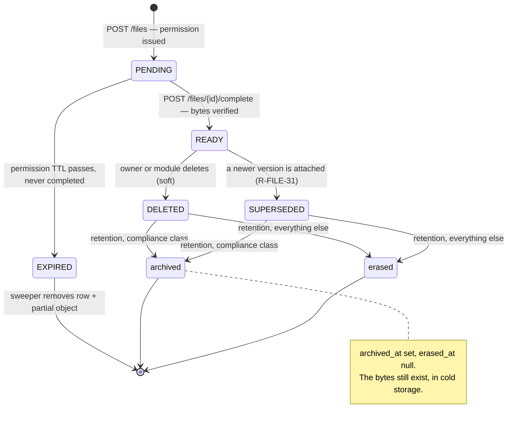

# FILES — Business Requirements

> **Project:** Zaroorat — Ride-Hailing Platform
> **Module:** `files` · **Doc:** 01 of the FILES chain · **Stack:** Fastify / TypeScript (ADR-0006)
> **Status:** 🟡 Specified (v1) · **Owner:** Engineering (Platform) · **Last updated:** 2026-08-02
> **Answers:** _What must the file module do, and why — independent of any storage vendor?_
> **Traces from:** [FEATURE_CATALOG](../00_PROJECT/FEATURE_CATALOG.md) FR-FILES · [SRS](../03_Requirements/01_srs-functional.md) FR-KYC-01/06, FR-DATA-01 · [Security 03](../15_Security/03_secrets-and-data-protection.md) · [Database 06](../06_Database/06_audit-softdelete-migrations.md)
> **Traces to:** 02_API · 03_DB · 04_ERRORS · 05_EVENTS · 06_TEST_PLAN

---

## 1. Purpose

Every other module needs to attach a **binary** to a row: a driver's licence, a vehicle's RC, a
profile photo, later an SOS clip or a dispute screenshot. None of them should learn how object
storage works, and none of them should be able to hand a user a URL that outlives the user's right
to see it.

`files` is the single custodian of that problem. It owns the bytes' whole life: the permission to
upload, the validation of what actually arrived, the reference the domain row stores, the short-lived
URL a reader gets, and the erasure the retention policy eventually demands.

**The one sentence:** _a domain row never holds a URL, only a file id; a URL is minted per read, for
one reader, and expires._

---

## 2. Scope

### 2.1 In scope

| Capability                                                                             | Realizes            |
| -------------------------------------------------------------------------------------- | ------------------- |
| Issue a scoped, time-limited **permission to upload** one object                       | FR-FILES, US-F1     |
| Validate declared type and size **before** granting it, and actual bytes **after**     | FR-FILES ac-3       |
| Store a durable **reference** (`storage_key`) — never the blob, never a public URL     | FR-FILES ac-1       |
| Mint **short-lived signed read URLs**, per reader, per request                         | FR-FILES ac-2       |
| Enforce **who may read** a file, by purpose and by relationship, not by URL possession | NFR-SEC, R-DATA-2   |
| **Audit every privileged read** of a sensitive file                                    | NFR-SEC-03          |
| Soft-delete, and **erase objects on the retention schedule**                           | FR-DATA-01, R-KYC-5 |
| Reclaim **orphans** — permissions granted but never completed                          | operational         |
| A **provider abstraction** so the vendor is a config choice                            | FR-FILES ac-1       |

### 2.2 Out of scope (owned elsewhere)

| Not owned                                               | Owner                     |
| ------------------------------------------------------- | ------------------------- |
| What a document _means_, its expiry, its approval state | `documents` / `drivers`   |
| The ops review queue and approve/reject workflow        | `admin`                   |
| Whether a driver is operable                            | `drivers` (AUTH gates it) |
| OCR, liveness, face match                               | deferred — FILES-OD-4     |
| Virus scanning as a blocking gate                       | deferred — FILES-OD-3     |
| Image resizing, thumbnails, transcoding                 | deferred — FILES-OD-5     |
| CDN distribution of public assets                       | not a v1 need             |

`files` never reads a `driver_documents` row and never learns what a licence is. It knows only:
_this file has purpose `DRIVER_DOCUMENT`, belongs to user X, and is `READY`._

### 2.3 Deferred (not v1)

- **Malware scanning** — the acceptance criterion "malicious uploads are rejected" is met in v1 by
  type/size/magic-byte enforcement, not by a scanner. See §11 **FILES-OD-3** for why, and for the
  seam that makes adding one a config change rather than a redesign.
- **Multipart / resumable upload** — required above ~100 MB. v1 caps every purpose well below that.
- **Client-side encryption** — server-side encryption at rest is the v1 posture (Security 03 §42).

### 2.4 Deferred to a future ADR

Real problems with no v1 trigger. Recorded so the day one arrives, nobody starts from a blank page —
and so that "not specified" is visibly a decision rather than an oversight.

| Topic                        | Why it waits                                                                                                                                                                                                                   |
| ---------------------------- | ------------------------------------------------------------------------------------------------------------------------------------------------------------------------------------------------------------------------------ |
| **Cross-provider migration** | `files.storage_provider` already exists to make it possible (03 §3.1). The procedure — dual-read, copy, verify checksum, flip, delete — is only worth writing against a real second provider and a real object count.          |
| **KMS key rotation**         | With `SSE-S3` (the default) rotation is the provider's and invisible. With `SSE-KMS` and a stable key id, AWS rotates key material transparently. Only a _key replacement_ needs a procedure, and nothing today uses KMS.      |
| **Ownership transfer**       | The motivating case is a vehicle changing hands, and `vehicles` does not exist. Transfer also raises a question this module cannot answer alone: does the previous owner lose access to evidence of their own past compliance? |
| **Storage cost attribution** | `file.storage.bytes_total{purpose}` (09 §2.4) is the input; turning bytes into currency is a dashboard formula and a finance decision, not backend code.                                                                       |

Each becomes an ADR under `docs/00_PROJECT/adr/` when it acquires a trigger, following ADR-0003's
shape.

---

## 3. Actors

| Actor              | Does                                                     |
| ------------------ | -------------------------------------------------------- |
| **Account owner**  | Uploads their own photo/documents; reads their own files |
| **Ops reviewer**   | Reads another user's KYC document — always audited       |
| **Another module** | Requests a read URL on a caller's behalf, in-process     |
| **Retention job**  | Erases objects whose policy window has closed            |
| **Sweeper job**    | Deletes storage permissions that were never completed    |

---

## 4. Upload requirements

| ID            | Requirement                                                                                                                                                                                                                |
| ------------- | -------------------------------------------------------------------------------------------------------------------------------------------------------------------------------------------------------------------------- |
| **R-FILE-1**  | Bytes **SHALL NOT** transit the API process. The client uploads directly to object storage using a pre-signed permission.                                                                                                  |
| **R-FILE-2**  | A permission **SHALL** be scoped to exactly one object key, one method, one content-type, one maximum size, and a short expiry.                                                                                            |
| **R-FILE-3**  | The `purpose` **SHALL** determine the permitted MIME types, the size ceiling, the retention class, and the read policy. There is no "general" purpose.                                                                     |
| **R-FILE-4**  | The declared content-type and size **SHALL** be validated before a permission is issued (cheap rejection).                                                                                                                 |
| **R-FILE-5**  | The **actual** stored object **SHALL** be validated on completion — real size, real content-type, and **magic bytes** matching the declared type.                                                                          |
| **R-FILE-6**  | A file **SHALL NOT** be referenceable by any domain row until it is `READY`. A `PENDING` file id is not a valid reference.                                                                                                 |
| **R-FILE-7**  | The storage key **SHALL** be server-generated and unguessable. A client never chooses, sees, or influences it.                                                                                                             |
| **R-FILE-8**  | Upload creation **SHALL** be idempotent under `Idempotency-Key`, so a retried request does not orphan an object.                                                                                                           |
| **R-FILE-9**  | Per-user upload volume **SHALL** be rate-limited per purpose and per window.                                                                                                                                               |
| **R-FILE-10** | A checksum of the stored object **SHALL** be recorded, so tampering and duplicate uploads are both detectable.                                                                                                             |
| **R-FILE-28** | The client-supplied `fileName` **SHALL** be sanitized and length-capped before storage, and **SHALL NOT** influence the storage key ([02 §5.1](02_FILES_API_SPEC.md#51-filename-policy-r-file-28)).                        |
| **R-FILE-29** | Location metadata (EXIF GPS) **SHALL NOT** become readable, for every purpose except those where provenance is evidence (FILES-OD-10). An image carrying it is **refused at completion**, not rewritten — see FILES-OD-16. |
| **R-FILE-30** | Cumulative stored bytes **SHALL** be capped per user and per purpose, independently of the request-rate limits (FILES-OD-11).                                                                                              |

---

## 5. Read requirements

| ID            | Requirement                                                                                                                                                 |
| ------------- | ----------------------------------------------------------------------------------------------------------------------------------------------------------- |
| **R-FILE-11** | The bucket **SHALL** be private. No object is readable without a signed URL. There is no public path.                                                       |
| **R-FILE-12** | A read URL **SHALL** be minted per request, with a short TTL (minutes), and **SHALL NOT** be stored in any row, event payload, log line, or cache.          |
| **R-FILE-13** | Authorization **SHALL** be decided before minting, from the file's `purpose` and the caller's relationship to it — never from possession of an id or a URL. |
| **R-FILE-14** | A caller who may not read a file **SHALL** receive the response an unknown id produces. Existence is not disclosed (the USER-INV-2 rule, applied to files). |
| **R-FILE-15** | A privileged read — anyone reading a file they do not own — **SHALL** write an audit record naming actor, file, purpose, and reason (NFR-SEC-03).           |
| **R-FILE-16** | A signed URL's TTL **SHALL** be shorter than the access token that authorized it, so a revoked session cannot outlive its last minted URL by long.          |

---

## 6. Lifecycle requirements

| ID            | Requirement                                                                                                                                                                                                                               |
| ------------- | ----------------------------------------------------------------------------------------------------------------------------------------------------------------------------------------------------------------------------------------- |
| **R-FILE-17** | A file **SHALL** move only through the defined states (§7). Every other transition is refused.                                                                                                                                            |
| **R-FILE-18** | Deletion **SHALL** be soft at the row level. The object is erased later, by the retention job, never inline (FR-DATA-01).                                                                                                                 |
| **R-FILE-19** | A file **referenced by a live domain row SHALL NOT** be erasable. Retention asks the owning module before erasing.                                                                                                                        |
| **R-FILE-20** | Retention windows **SHALL** be per-purpose configuration, not code (R-DATA-3, NFR-COMPLY-02).                                                                                                                                             |
| **R-FILE-21** | Compliance-relevant files (KYC) **SHALL** be archived rather than shredded where policy requires it — retention never overrides immutability (Database 06 §60).                                                                           |
| **R-FILE-22** | An upload permission that is never completed **SHALL** be swept: the row expires and any partial object is deleted.                                                                                                                       |
| **R-FILE-23** | Erasure **SHALL** be idempotent and **SHALL** survive a missing object — an already-gone object is a success, not an error.                                                                                                               |
| **R-FILE-31** | Replacing a file **SHALL** mark the previous version `SUPERSEDED` and link it to its replacement, in the attaching module's transaction. Replacement is **never** a deletion (03 §4A).                                                    |
| **R-FILE-32** | A superseded file **SHALL** be retained for its purpose's full window, measured from supersession — it was valid evidence for the period it was current.                                                                                  |
| **R-FILE-33** | A file **SHALL** be referenceable by **at most one** live domain row at a time (FILES-OD-13).                                                                                                                                             |
| **R-FILE-34** | A signed read URL, once minted, **SHALL** remain valid until its TTL regardless of later account state. The TTL — not revocation — is the bound (FILES-OD-14).                                                                            |
| **R-FILE-35** | Image **pixel dimensions SHALL** be bounded per purpose and read from the header **before any decode**. A byte ceiling does not bound decoded size ([02 §5.2](02_FILES_API_SPEC.md#52-pixel-ceilings-exist-because-we-decode-r-file-35)). |
| **R-FILE-36** | Every signed read TTL **SHALL** be strictly shorter than `jwtConfig.accessTtlSeconds`, asserted at startup rather than maintained by hand (R-FILE-16).                                                                                    |

---

## 7. The file state machine

Every transition, including the retention outcomes.

| State        | Object exists?      | Referenceable? | Readable? | Retention clock starts |
| ------------ | ------------------- | -------------- | --------- | ---------------------- |
| `PENDING`    | not yet, or partial | ❌ (R-FILE-6)  | ❌        | —                      |
| `READY`      | yes, verified       | ✅             | ✅        | —                      |
| `EXPIRED`    | partial or none     | ❌             | ❌        | swept, not retained    |
| `DELETED`    | yes, until erased   | ❌             | ❌        | at `deleted_at`        |
| `SUPERSEDED` | yes, until erased   | ❌             | ❌        | at supersession        |

`archived` and `erased` are not statuses — they are the two terminal outcomes, recorded as
`archived_at` / `erased_at` and made mutually exclusive by a `CHECK` (03 §4.3). Splitting them
matters: **"deleted, awaiting retention" and "deleted, archived to cold storage" are different
answers to a compliance question**, and a single `erased_at` column could not tell them apart.

**Only `PENDING → READY` is client-driven.** Every other transition is the system's.

---

## 8. Transactional requirements

| ID            | Requirement                                                                                                                                                                   |
| ------------- | ----------------------------------------------------------------------------------------------------------------------------------------------------------------------------- |
| **R-FILE-24** | The `files` row and its event **SHALL** commit in one transaction (the platform outbox rule).                                                                                 |
| **R-FILE-25** | Storage calls **SHALL NOT** happen inside a database transaction. A remote call inside a transaction holds a connection across the network's worst case.                      |
| **R-FILE-26** | Ordering **SHALL** be: validate → write `PENDING` → sign. If signing fails the row is swept; if the row fails nothing was signed. **Never sign first.**                       |
| **R-FILE-27** | A module attaching a file **SHALL** be able to do so in **its own** transaction, given a `READY` file id — `files` exposes a `tx`-accepting reference check for exactly this. |

---

## 9. Non-functional requirements that bind FILES

| NFR                | Binding on this module                                                                |
| ------------------ | ------------------------------------------------------------------------------------- |
| **NFR-1** perf     | p95 < 300 ms. Achieved by never touching bytes — the API signs, the client transfers. |
| **NFR-6** idem     | Upload creation and completion are both safe to retry (R-FILE-8).                     |
| **NFR-7** security | Deny-by-default; private bucket; existence not disclosed (R-FILE-14).                 |
| **NFR-8** obs      | Every upload/read/erase carries the request id; provider latency is a metric.         |
| **NFR-10** privacy | Per-purpose retention, encrypted at rest, privileged reads audited.                   |
| **NFR-11** l10n    | Every error carries a `messageKey`; no prose is hard-coded for a client.              |

---

## 10. Invariants (must hold at the enforcement/data layer)

| ID             | Invariant                                                                                                                        |
| -------------- | -------------------------------------------------------------------------------------------------------------------------------- |
| **FILE-INV-1** | A `storage_key` is unique across all files, forever, including after deletion. Keys are never reused.                            |
| **FILE-INV-2** | No response, event payload, or log line ever contains a signed URL or a raw storage key.                                         |
| **FILE-INV-3** | A file in any state but `READY` can never be attached to a domain row.                                                           |
| **FILE-INV-4** | A caller can never obtain a read URL for a file the read policy denies — and cannot distinguish that denial from a missing file. |
| **FILE-INV-5** | An object is never erased while a live domain row references its file.                                                           |
| **FILE-INV-6** | Two concurrent completions of the same file produce exactly one `READY` transition and exactly one event.                        |
| **FILE-INV-7** | A file's `purpose` is immutable. Changing it would move the file between read policies and retention classes.                    |
| **FILE-INV-8** | A version chain is a **line, not a tree**: no two files name the same successor, and a `SUPERSEDED` file always names one.       |
| **FILE-INV-9** | A file is never both archived and erased — the two terminal outcomes are mutually exclusive.                                     |

Proven — not asserted — by [06_FILES_TEST_PLAN](06_FILES_TEST_PLAN.md) §4.

---

## 11. Open decisions

| ID              | Decision                                                        | Status                                                                                                                                                                                                                                                                                                                                                                                                                                                                                                                                                                                                                                                                                                                                                                                                                                                   |
| --------------- | --------------------------------------------------------------- | -------------------------------------------------------------------------------------------------------------------------------------------------------------------------------------------------------------------------------------------------------------------------------------------------------------------------------------------------------------------------------------------------------------------------------------------------------------------------------------------------------------------------------------------------------------------------------------------------------------------------------------------------------------------------------------------------------------------------------------------------------------------------------------------------------------------------------------------------------- |
| **FILES-OD-1**  | Presigned direct upload, or proxy bytes through the API?        | ✅ **Presigned.** NFR-1's 300 ms budget cannot absorb a multi-MB body, and proxying puts an unbounded buffer in the request path. The cost is the two-step protocol in §7, which is why completion validation (R-FILE-5) is mandatory rather than optional.                                                                                                                                                                                                                                                                                                                                                                                                                                                                                                                                                                                              |
| **FILES-OD-2**  | Does a domain row store a URL or a file id?                     | ✅ **A file id.** A stored URL is either public (violates R-FILE-11) or expired (useless). **This contradicts the shipped schema** — see §13.                                                                                                                                                                                                                                                                                                                                                                                                                                                                                                                                                                                                                                                                                                            |
| **FILES-OD-3**  | Malware scanning in v1?                                         | ❌ **No.** A scanner is an async pipeline and a per-object cost, for a v1 whose uploads are ops-reviewed by a human before they matter. Mitigated by magic-byte enforcement and a private bucket. The `READY` transition is the seam a scanner hooks later.                                                                                                                                                                                                                                                                                                                                                                                                                                                                                                                                                                                              |
| **FILES-OD-4**  | OCR / auto-extraction of document fields?                       | ❌ **No.** `driver_documents.ocr_data` exists in the schema and stays null in v1. It belongs to `documents`, not here.                                                                                                                                                                                                                                                                                                                                                                                                                                                                                                                                                                                                                                                                                                                                   |
| **FILES-OD-5**  | Server-side image resizing / thumbnails?                        | ❌ **No.** Clients downscale before upload; the size ceiling enforces it. Revisit if ops complain about review-queue load times.                                                                                                                                                                                                                                                                                                                                                                                                                                                                                                                                                                                                                                                                                                                         |
| **FILES-OD-6**  | One `files` table, or one per purpose?                          | ✅ **One table.** The lifecycle, the validation, and the signing are identical; only policy differs, and policy is config (R-FILE-3).                                                                                                                                                                                                                                                                                                                                                                                                                                                                                                                                                                                                                                                                                                                    |
| **FILES-OD-7**  | Which provider ships first?                                     | ✅ **S3-compatible**, behind `StorageProvider`. `src/integrations/aws-s3/` is the empty directory reserved for it. A `mock` provider ships alongside, mirroring `notifications`' `mock`/`msg91` split, so tests and local dev never need a bucket.                                                                                                                                                                                                                                                                                                                                                                                                                                                                                                                                                                                                       |
| **FILES-OD-8**  | Are profile images public?                                      | ✅ **No.** Same private bucket, same signed reads. A rider's face is not a public asset. This closes the `userConfig.profileImageHosts` fail-closed hole (USER §8.5) by removing the need for an allow-list at all.                                                                                                                                                                                                                                                                                                                                                                                                                                                                                                                                                                                                                                      |
| **FILES-OD-9**  | What happens when the same checksum is uploaded twice?          | ✅ **Store again; never deduplicate across owners.** A shared object means one owner's deletion or retention erasure destroys another's file, and a cross-owner checksum match is itself a disclosure (A can prove B holds a given document). Deduplication **within** one owner and purpose is permitted later as an optimization; cross-owner is permanently forbidden.                                                                                                                                                                                                                                                                                                                                                                                                                                                                                |
| **FILES-OD-10** | Is EXIF location data allowed?                                  | ✅ **No — every purpose except `SOS_EVIDENCE` and `DISPUTE_EVIDENCE`.** A phone JPEG carries GPS coordinates; an avatar that discloses the rider's home address is a privacy failure no access control catches. For the two evidence purposes the metadata **is** the evidence, so it is preserved — and those are already the most tightly read-scoped purposes. _How_ it is kept out is FILES-OD-16.                                                                                                                                                                                                                                                                                                                                                                                                                                                   |
| **FILES-OD-16** | Strip the metadata server-side, or refuse the image?            | ✅ **Refuse.** Stripping means downloading the object, rewriting it, and putting it back — bytes through the API process, which R-FILE-1 forbids outright, which needs the `get`/`put` pair [07 §2.2](07_FILES_STORAGE_PROVIDER.md#22-what-is-not-on-the-interface-and-why) rejects by name, and which NFR-1's 300 ms completion budget cannot absorb for a 10 MB photograph. The client re-encodes instead — which an app that already downscales before upload (FILES-OD-5) does for free, because a re-encode drops EXIF unless it is deliberately copied. This is the same division of labour FILES-OD-5 already set: the client prepares the image, the server enforces with a refusal. The cost is that a client which does neither is refused where it would once have been silently corrected, which is why the error is specific and retryable. |
| **FILES-OD-11** | Rate limits, or storage quotas, or both?                        | ✅ **Both.** A rate limit bounds requests per hour; it does not bound bytes. Thirty 50 MB `SOS_EVIDENCE` clips an hour is inside the rate limit and is 1.5 GB. See [08 §5](08_FILES_CONFIGURATION.md#5-quotas--r-file-30).                                                                                                                                                                                                                                                                                                                                                                                                                                                                                                                                                                                                                               |
| **FILES-OD-12** | Which providers ship beyond `mock` and `s3`?                    | ✅ **None as separate implementations.** MinIO, Cloudflare R2, DigitalOcean Spaces, and Ceph all speak the S3 API — they are `s3` with a different `endpoint`, which is why the interface is defined against S3 semantics and not against AWS. GCS and Azure Blob are genuinely different protocols and are **not** v1 targets; [07 §6](07_FILES_STORAGE_PROVIDER.md#6-what-the-interface-deliberately-does-not-abstract) records what would have to change.                                                                                                                                                                                                                                                                                                                                                                                             |
| **FILES-OD-13** | May two domain rows reference one file?                         | ❌ **No — at most one live reference (R-FILE-33).** Multiple references make both the retention guard and `FILE_IN_USE` ambiguous: "is anyone still using this?" stops having a yes/no answer, and one module's release could erase bytes another still needs. If two records need the same document, it is uploaded twice — the same reasoning that forbids cross-owner deduplication in FILES-OD-9. A reference **count** would be the alternative, and it is a distributed-consistency problem this module has no reason to take on.                                                                                                                                                                                                                                                                                                                  |
| **FILES-OD-14** | Does suspending an account invalidate already-minted read URLs? | ✅ **No, and that is why the TTL is minutes.** A signed URL is a bearer credential held by the client; the only ways to revoke one are rotating the signing key (which invalidates _everyone's_) or proxying every read through the API (which reintroduces the bytes-through-the-API cost R-FILE-1 exists to avoid). The exposure is bounded by the TTL, which R-FILE-16 already requires to be shorter than the access token. Stated explicitly because "we forgot" and "we decided" look identical in a spec that stays silent.                                                                                                                                                                                                                                                                                                                       |
| **FILES-OD-15** | Per-operation retry policy?                                     | ✅ **Uniform, and safe because of what the interface excludes.** Every method in 07 §2 is idempotent — `head`, `delete`, `archive`, and the two signers have no side effect worth not repeating. There is no `put`, so the one operation that would need a zero-retry rule does not exist (07 §2.2). A per-operation table would encode a distinction the interface has already designed away.                                                                                                                                                                                                                                                                                                                                                                                                                                                           |

---

## 12. Delivery phases

Ordered so each phase is shippable and the next builds on it.

| Phase | Delivers                                                                           | Depends on           |
| ----- | ---------------------------------------------------------------------------------- | -------------------- |
| **1** | `files` table + migration; `StorageProvider` interface; `mock` provider            | nothing              |
| **2** | `POST /files` + `POST /files/{id}/complete` — the upload pair, validated           | 1                    |
| **3** | `GET /files/{id}/url` — signed reads, ownership policy, audited privileged reads   | 2                    |
| **4** | `DELETE /files/{id}` — soft delete, `assertReferenceable`, `supersede` (R-FILE-31) | 3                    |
| **5** | S3 provider behind the same interface; config switch                               | 1                    |
| **6** | Sweeper (orphans) + retention job                                                  | 4, **a job runtime** |
| **7** | Profile-image cutover: `user_profiles.profile_image` → file id                     | 3, 5                 |

**Phase 6's dependency is now met.** The job runtime shipped separately (handbook volume 08):
`files-maintenance` is a BullMQ queue, `src/jobs/scheduler` upserts both cron schedules, and
`src/worker.ts` is the process that runs them. Both jobs are still plain services invoked by a thin
processor, so they remain testable by direct call. See §13.4.

**Every phase ships its own tests and its own events.** Neither is a later phase. This is the
standing rule the AUTH and USER milestones were built under — implement, unit-test, integration-test,
verify against the docs, _then_ move on — and it is why those two modules have 364 tests instead of a
test-writing phase that never arrived. A phase plan that ends in "Phase 7: Tests" plans for test debt;
`file.uploaded` cannot be a phase after `POST /complete` either, because it is emitted **in the same
transaction** as the `READY` transition (R-FILE-24) and there is no intermediate state where the
write ships without it.

---

## 13. Documentation inconsistencies found

Reported rather than guessed, per the module-authoring rule.

### 13.1 The schema stores URLs where this module requires references 🔴

`driver_documents.file_url`, `vehicle_documents.file_url`, `vehicle_images.image_url`, and
`user_profiles.profile_image` are all `String` URLs. FR-FILES ac-2 requires access via short-lived
signed URLs — which a stored URL cannot be, because it is either permanent (and therefore public) or
expired (and therefore useless).

**Resolution (FILES-OD-2):** those columns become file-id references. Because `driver_documents` and
`vehicle_documents` are not yet written by any code, they can be changed outright. `profile_image`
**is** live, so it takes the expand→contract path in [03 §7](03_FILES_DATABASE_SPEC.md#7-migration-plan).
No column is renamed under running code.

### 13.2 Volume 6's SQL sketch diverges from the shipped schema 🟡

[`06_Database/02_schema-postgres.md`](../06_Database/02_schema-postgres.md) designs a `kyc_documents`
table with `object_key TEXT` and `BIGINT GENERATED ALWAYS AS IDENTITY` keys. The shipped Prisma
schema has `driver_documents` with `file_url` and `uuid(7)` keys, and no `kyc_documents` at all.

**Treated as:** Volume 6 is an earlier design sketch; `prisma/schema/` is authoritative. Volume 6's
`object_key` instinct was right and is what this module implements — under a different table name.

### 13.3 Two error-code conventions exist 🟡

[`07_API/04`](../07_API/04_errors-pagination-idempotency.md) uses `snake_case` codes
(`validation_error`); the implemented AUTH and USER catalogs use `SCREAMING_SNAKE` (`VALIDATION`).

**Treated as:** FILES follows AUTH/USER, because that is the one in running code and one error
handler serves all modules. Volume 7 is stale.

### 13.4 FR-FILES is P0 but depends on a runtime that does not exist 🟡

The retention job (R-FILE-20) and the orphan sweeper (R-FILE-22) both need a scheduler. There was
none, so phase 6 was specified and deliberately unscheduled, and §12 sequenced it last so nothing
else waited on it.

**Resolution — the job runtime shipped.** `src/jobs/` is now a BullMQ queue (`files-maintenance`), a
schedule table, and a worker; `src/worker.ts` is its entry point and `npm run worker` starts it. The
two jobs did not change — the runtime resolves them from the same container the API uses and calls
the same `run(now)` the tests already called.

**One ambiguity surfaced while wiring it.** 09 §4.2 says retention runs "daily 03:00" and never
names a timezone. Left to the host, that is 03:00 UTC on a cluster node and 03:00 IST on a laptop.
The scheduler pins `Etc/UTC` per volume 08 §27 and records the choice in
`SCHEDULE_TIMEZONE` — note that 03:00 UTC is 08:30 IST, inside the Indian morning peak rather than
the quiet window "03:00" implies. If the intent was the quiet window, `FILE_RETENTION_CRON` should
be `30 21 * * *`. Flagged rather than guessed.

### 13.5 `src/core/storage/` and `src/integrations/aws-s3/` are empty 🟢

Expected, not a contradiction — noted so the reader knows phase 1 starts from nothing, and that
`bootstrapStorage()`'s `// Placeholder for Milestone 2` body is the hook phase 5 fills.

---

## 14. Acceptance criteria (module "done" for v1)

FILES v1 ships when all of these are demonstrable:

1. A client can upload a file without a single byte passing through the API process.
2. An upload whose real bytes disagree with its declared type — including a renamed executable — is refused at completion, and the object is removed.
3. No response, event, or log line anywhere contains a signed URL or a storage key.
4. A file id belonging to another user is indistinguishable from one that never existed.
5. An ops read of a KYC document writes an audit record naming actor, file, and reason.
6. A signed read URL stops working after its TTL. (It is a **bearer** credential and does not bind to a session — see FILES-OD-14; the TTL is the whole bound.)
7. A domain row can never reference a file that is not `READY`.
8. Two concurrent completions of the same upload yield one `READY` and one event.
9. Deleting a file removes it from every read path immediately and erases the object only on the retention schedule.
10. Switching provider from `mock` to `s3` is a config change with no code change and no test change.
11. `prisma validate`, typecheck, lint (`--max-warnings=0`), and the full test suite pass.

---

## 15. Traceability

| Requirement group | Realizes                            | Proven by (06) |
| ----------------- | ----------------------------------- | -------------- |
| §4 upload         | FR-FILES ac-1/ac-3, R-FILE-1..10    | §3 #1/#2, §4   |
| §5 read           | FR-FILES ac-2, NFR-SEC-03, R-DATA-2 | §3 #3..#6, §5  |
| §6 lifecycle      | FR-DATA-01, R-KYC-5, R-DATA-3       | §3 #9, §6      |
| §8 transactional  | NFR-5, NFR-6, the outbox rule       | §4 FILE-INV-6  |
| §10 invariants    | all of the above, structurally      | §4             |
