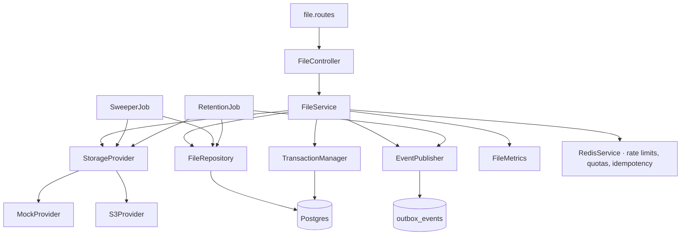

# FILES — Storage Provider Contract

> **Project:** Zaroorat — Ride-Hailing Platform
> **Module:** `files` · **Doc:** 07 of the FILES chain · **Stack:** TypeScript, DI (Awilix, CLASSIC mode)
> **Status:** 🟡 Specified (v1) · **Owner:** Engineering (Platform) · **Last updated:** 2026-08-02
> **Answers:** _What exactly must a storage backend implement, and what may it assume?_
> **Traces from:** [01_BUSINESS](01_FILES_BUSINESS_REQUIREMENTS.md) FILES-OD-7/12 · [02_API](02_FILES_API_SPEC.md) · [06_TEST_PLAN](06_FILES_TEST_PLAN.md) §2
> **Traces to:** 08_CONFIGURATION · 09_OPERATIONS

---

## 1. Why this document exists

01 §12 phase 1 delivers "the `StorageProvider` interface" and 06 §2 lists what the mock must support,
but the **signature** was left to the implementer. Two people would write two different interfaces,
and the second provider would reshape the first — which is exactly the coupling the abstraction was
meant to prevent.

This document fixes the contract. It is the only place a method signature for storage appears.

---

## 2. The interface

```ts
/**
 * A storage backend. Implementations are stateless, injected by name
 * (`storageProvider`), and selected by configuration — never by a caller.
 *
 * Every method is total: it either fulfils its contract or throws a
 * {@link StorageError}. No method returns a partial success, and none returns
 * a provider-native error object — the module above must never branch on a
 * vendor's error shape.
 */
export interface StorageProvider {
  /** Stable identifier written to `files.storage_provider` (e.g. `"s3"`, `"mock"`). */
  readonly name: string;

  /**
   * Mint a write permission for exactly one key.
   *
   * The returned URL MUST be constrained to the given method, key, content-type,
   * and size ceiling. A permission that can write a second key, or a different
   * content-type, violates R-FILE-2 regardless of what the caller does with it.
   */
  signUpload(input: SignUploadInput): Promise<SignedUpload>;

  /**
   * Mint a read permission for exactly one key, expiring in `ttlSeconds`.
   * Never cached, never persisted, one per request (R-FILE-12).
   */
  signDownload(input: SignDownloadInput): Promise<SignedDownload>;

  /**
   * Object metadata plus the first `peekBytes` of content — the single call
   * that backs completion validation (R-FILE-5).
   *
   * Returns `null` when the object does not exist. Combining "does it exist"
   * with "what is it" is deliberate: two round trips to answer one question is
   * the difference between a fast completion and a slow one.
   */
  head(key: string, peekBytes: number): Promise<ObjectHead | null>;

  /**
   * Remove the current version of an object. On a versioned bucket this writes
   * a delete marker and earlier versions survive — which is correct here,
   * because the only caller is the sweeper reclaiming an orphan whose bytes
   * were never verified and never referenced.
   *
   * **Idempotent** — an already-absent object is a success, not an error.
   */
  delete(key: string): Promise<void>;

  /**
   * Destroy an object **and every version of it**, permanently.
   *
   * This is the one operation that must survive bucket versioning. A plain
   * delete on a versioned bucket leaves the bytes recoverable indefinitely, so
   * using it for retention would mean a user's erasure request was never
   * honoured while the audit trail claimed it was (R-FILE-23, 01 §14 #9).
   *
   * Implementations MUST enumerate version ids for the key and remove all of
   * them, including any delete markers. **Idempotent**, like `delete`.
   */
  erase(key: string): Promise<void>;

  /**
   * Move an object to a colder storage class, preserving the bytes.
   * This is the `ARCHIVED` half of retention (R-FILE-21) — never a delete.
   */
  archive(key: string): Promise<void>;

  /** Liveness + credential + bucket reachability, for the readiness probe (09 §3). */
  health(): Promise<StorageHealth>;
}
```

### 2.1 Types

```ts
export interface SignUploadInput {
  key: string;
  contentType: string;
  /** Hard ceiling the provider MUST bind into the signature, not merely check. */
  maxBytes: number;
  ttlSeconds: number;
  /** Enforced by the provider when supported; re-verified at completion regardless. */
  checksumSha256?: string;
}

export interface SignedUpload {
  method: 'PUT';
  url: string;
  /** Headers the client MUST send verbatim; part of the signature. */
  headers: Record<string, string>;
  expiresAt: Date;
}

export interface SignDownloadInput {
  key: string;
  ttlSeconds: number;
  contentType: string;
  disposition: 'inline' | 'attachment';
  /** Rendered into Content-Disposition; already sanitized per 02 §5.1. */
  fileName: string;
}

export interface SignedDownload {
  url: string;
  expiresAt: Date;
}

export interface ObjectHead {
  sizeBytes: number;
  /** The provider's stored content-type — a claim, like the client's. */
  contentType: string | null;
  /** Provider-computed digest when available; null forces local computation. */
  checksumSha256: string | null;
  /** First N bytes, for magic-number validation (02 §5). */
  peek: Buffer;
}

export interface StorageHealth {
  reachable: boolean;
  bucketExists: boolean;
  credentialsValid: boolean;
  latencyMs: number;
}
```

### 2.2 What is not on the interface, and why

| Rejected method     | Why it is absent                                                                                                                                                               |
| ------------------- | ------------------------------------------------------------------------------------------------------------------------------------------------------------------------------ |
| `generateKey()`     | Key construction is a **policy** decision owned by the module (03 §5). If each provider generated keys, the grammar — and its unguessability guarantee — would vary by vendor. |
| `exists()`          | `head()` already answers it, and a separate method invites the TOCTOU pattern `if (exists) then head`.                                                                         |
| `copy()` / `move()` | No caller. Nothing in 01–06 relocates an object; `archive()` covers the one lifecycle transition that exists. YAGNI.                                                           |
| `list()`            | Nothing enumerates the bucket. Exposing listing would also weaken 03 §5's "enumeration should be impossible" property.                                                         |
| `put()` / `get()`   | Bytes never transit the API (R-FILE-1). A provider that can `put` invites a caller that does.                                                                                  |

`copy`, `move`, and `list` are the three most likely additions if a future feature needs them — none
does today, and each would need its own requirement first.

---

## 3. Contract rules every implementation must honour

| #   | Rule                                                                                                                                                                                   |
| --- | -------------------------------------------------------------------------------------------------------------------------------------------------------------------------------------- |
| 1   | **Never throw a vendor error.** Wrap everything in `StorageError` with a `retryable` flag. 04 §6's fail-closed mapping depends on it.                                                  |
| 2   | **`delete()` and `erase()` are idempotent.** Absent object → resolve, not reject.                                                                                                      |
| 2a  | **`erase()` removes every version**, `delete()` only the current one. On an unversioned bucket they coincide; on a versioned one — which is platform policy — they must not (08 §2.2). |
| 3   | **Signatures are bounded.** `maxBytes` is bound into the signature, not validated after the fact.                                                                                      |
| 4   | **No method logs a URL or a key.** FILE-INV-2 applies inside the provider too.                                                                                                         |
| 5   | **Clock is injected**, never `Date.now()` directly — 06 §8 tests TTL expiry through it.                                                                                                |
| 6   | **Stateless.** No caching of signatures, no memoized credentials with unbounded lifetime.                                                                                              |
| 7   | **`name` is stable forever.** It is persisted in `files.storage_provider`; renaming it orphans history (03 §3.1).                                                                      |

---

## 4. Error mapping

```ts
export class StorageError extends Error {
  constructor(
    readonly operation: 'signUpload' | 'signDownload' | 'head' | 'delete' | 'erase' | 'archive' | 'health',
    readonly retryable: boolean,
    readonly cause?: unknown,
  ) { … }
}
```

| Provider condition               | `retryable` | Surfaces as (04)                 |
| -------------------------------- | ----------- | -------------------------------- |
| Timeout, connection refused, 5xx | `true`      | `503 SERVICE_UNAVAILABLE`        |
| Throttled (`SlowDown`, 429)      | `true`      | `503` with `Retry-After`         |
| Bad credentials, bucket missing  | `false`     | `503`, logged at `error` + alert |
| Object not found on `head()`     | —           | `null`, → `409 UPLOAD_NOT_FOUND` |

`cause` is retained for logs and **never** serialized into a response (04 §5).

---

## 5. Provider matrix (FILES-OD-12)

| Provider                   | Protocol   | v1?  | Notes                                                         |
| -------------------------- | ---------- | ---- | ------------------------------------------------------------- |
| `mock`                     | in-process | ✅   | `Map`-backed, injectable clock and failures. Dev + all tests. |
| `s3`                       | S3 API     | ✅   | The production implementation.                                |
| MinIO                      | S3 API     | ✅ ¹ | `s3` with `endpoint` + `forcePathStyle`. **Not** a new class. |
| Cloudflare R2              | S3 API     | ✅ ¹ | `s3` with an R2 endpoint.                                     |
| DigitalOcean Spaces / Ceph | S3 API     | ✅ ¹ | Same.                                                         |
| Google Cloud Storage       | GCS API    | ❌   | Different signing scheme — see §6.                            |
| Azure Blob                 | Azure API  | ❌   | SAS tokens, different container model — see §6.               |

¹ **Configuration, not code.** This is the payoff for defining the interface against _S3 semantics_
rather than against _AWS_: four vendors ship as an endpoint string. Writing four provider classes
would be four times the surface for zero behavioural difference.

---

## 6. What the interface deliberately does not abstract

The contract assumes: **opaque string keys, presigned URLs with a TTL, and a `HEAD` that returns
size plus a byte range.** Every S3-compatible service provides these.

GCS and Azure Blob both provide equivalents (V4 signed URLs; SAS tokens) but differ in signing
inputs, header binding, and — for Azure — the container/blob split. Supporting either means:

1. A second `SignedUpload.headers` contract, because the header set is not the same.
2. A different `maxBytes` binding mechanism (Azure binds fewer constraints into a SAS).
3. Re-testing the whole 06 §5 security suite against the new signature semantics.

None of that is hard; it is simply unjustified before a second cloud is a real requirement. Recording
it here means the day it becomes one, nobody re-derives the analysis.

---

## 7. The mock provider is a first-class deliverable

Not a test fixture — it is what makes 01 §14 criterion 10 ("provider swap is config-only")
demonstrable, and what lets the whole suite run with no bucket and no network.

| Capability                                     | Why the suite needs it                                                                |
| ---------------------------------------------- | ------------------------------------------------------------------------------------- |
| `Map`-backed object store, with a version list | `head`, `delete`, `erase`, `archive` without I/O; proving `erase` clears all versions |
| Verifiable signatures                          | So an expired or wrong-key URL genuinely fails                                        |
| Injectable clock                               | TTL expiry without `setTimeout` (06 §8)                                               |
| Injectable failures, per method                | Fail-closed tests (06 §5)                                                             |
| Call recording                                 | Asserting the API wrote zero bytes (06 §3 #1)                                         |

It follows the precedent already in the repo: `notifications` ships `mock.provider.ts` alongside
`msg91.provider.ts`, chosen by `notificationConfig`. FILES copies that shape exactly.

---

## 8. Module layout and wiring

### 8.1 The folder structure — as the codebase actually does it

The repo ships a scaffold in every module (`controllers/ dto/ routes/ schemas/ services/ sockets/
queues/ tests/ types/`), and in both implemented modules **those directories are empty**. `users` and
`auth` between them contain zero files in `controllers/`, `routes/`, `schemas/`, `services/`, `dto/`,
`sockets/`, `queues/`, `tests/`, and `types/`.

What they actually use:

```
src/modules/files/
  index.ts                  # the module's DI registration + public exports
  file.service.ts           # the flat service, like account.service.ts / phone-change.service.ts
  file.policy.ts            # per-purpose validation: MIME, size, pixels, TTL (02 §5)
  file.metrics.ts           # mirrors user.metrics.ts / OtpMetrics
  errors.ts                 # FileError subclasses (04 §2.2)
  types.ts
  storage.config.ts         # 08 §1 — infrastructure half
  http/                     # controller + routes + zod schemas + error-response, together
    file.controller.ts
    file.routes.ts
    file.schemas.ts
    index.ts
  repositories/
    file.repository.ts
    index.ts
  events/
    catalog.ts              # FILE_EVENT_CATALOG + fileEvent(), per USER_EVENT_CATALOG
    index.ts
  providers/                # this module's one genuinely new subfolder
    storage.provider.ts     # the §2 interface
    mock.provider.ts
    s3.provider.ts
  jobs/                     # sweeper + retention, plain services (09 §4)
```

Tests live in `tests/unit/files/` and `tests/integration/`, **not** inside the module — the
repo-wide convention, and where the 43 existing test files already are.

`providers/` follows the precedent `notifications/providers/` set (`mock.provider.ts`,
`msg91.provider.ts`, `sms.provider.ts`). Nothing else here is new.

> **Do not create the empty scaffold directories.** They are vestigial in the two modules that
> shipped, and reproducing them adds nine misleading paths a reader has to open before learning they
> are empty. If the scaffold is ever meant to be authoritative, that is a repo-wide decision, not one
> this module makes by copying it.

### 8.2 Dependency graph



Two constraints the graph encodes:

- **`StorageProvider` is reached only from `FileService` and the two jobs.** No controller and no
  repository touches storage. A controller that could sign a URL would bypass the read policy.
- **`FileRepository` never calls the provider, and the provider never calls the repository.** They
  are the two halves R-FILE-25 keeps apart — a remote call inside a database transaction holds a
  connection across the network's worst case.

### 8.3 DI registration

Awilix in **CLASSIC mode**: constructor parameter names are resolved by name, so they are
load-bearing and must match the registration keys exactly.

| Key                                   | Lifetime  | Notes                                                                                                        |
| ------------------------------------- | --------- | ------------------------------------------------------------------------------------------------------------ |
| `storageProvider`                     | singleton | `asFunction` — picks mock vs s3 from `storageConfig`, exactly as `notificationConfig` picks its SMS provider |
| `fileRepository`                      | singleton | `asClass`                                                                                                    |
| `fileService`                         | singleton | `asClass`                                                                                                    |
| `fileMetrics`                         | singleton | `asClass`                                                                                                    |
| `fileController`                      | singleton | `asClass`                                                                                                    |
| `fileSweeperJob` / `fileRetentionJob` | singleton | Resolved by name from the `files-maintenance` worker (01 §13.4)                                              |

---

## 9. Traceability

| Section | Realizes                        | Proven by (06)        |
| ------- | ------------------------------- | --------------------- |
| §2      | 01 §12 phase 1, FILES-OD-7      | §2, §3 #10            |
| §2.2    | R-FILE-1, R-FILE-7              | §5 key unguessability |
| §3      | R-FILE-2, R-FILE-23, FILE-INV-2 | §5                    |
| §4      | 04 §6 fail-closed               | §5 fail-closed        |
| §5      | FILES-OD-12                     | §3 #10                |
| §7      | 01 §14 criterion 10             | §2, §10               |
