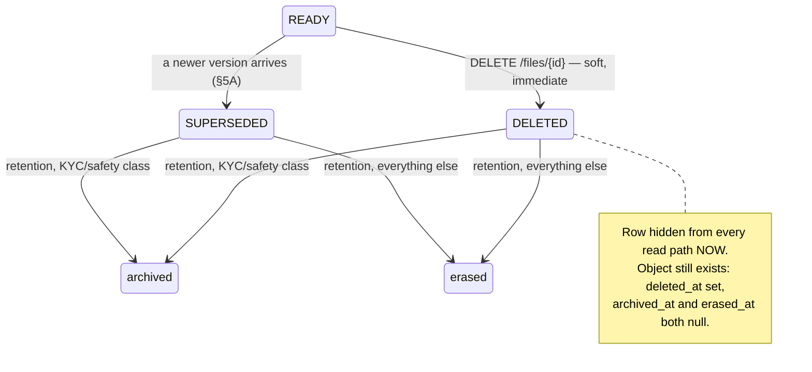
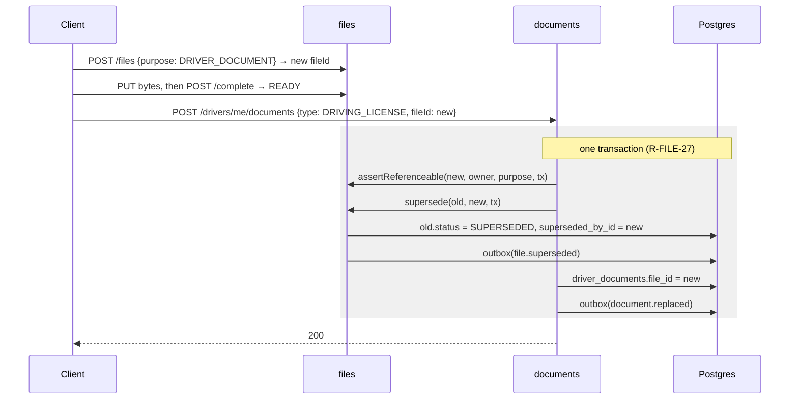

# FILES — Flows

> **Project:** Zaroorat — Ride-Hailing Platform
> **Module:** `files` · **Status:** 🟡 Specified (v1) · **Last updated:** 2026-08-02
> **Answers:** _What actually happens, step by step, in each file flow?_
> **Read before** 01–06 — this is the narrative the specs formalize.

---

## 1. Upload — the two-step protocol

The shape everything else in the module follows from. Read this once and the rest of the chain
explains itself.

```mermaid
sequenceDiagram
    participant C as Client
    participant A as API (files)
    participant D as Postgres
    participant S as Object storage

    C->>A: POST /files {purpose, contentType, sizeBytes}
    Note over A: validate against per-purpose policy (02 §5)
    A->>D: INSERT files (PENDING, storage_key, upload_expires_at)
    A->>S: sign a PUT for exactly that key
    A-->>C: 201 {fileId, upload.url, expiresAt}

    C->>S: PUT bytes (direct — never through the API)
    S-->>C: 200

    C->>A: POST /files/{id}/complete
    A->>S: HEAD key → real size, leading bytes
    Note over A: size ≤ ceiling? magic bytes match declared type? checksum?
    alt bytes disagree
        A->>S: DELETE key
        A->>D: status = EXPIRED
        A-->>C: 422 CONTENT_MISMATCH
    else verified
        A->>D: BEGIN; PENDING→READY; INSERT outbox(file.uploaded); COMMIT
        A-->>C: 200 {status: READY}
    end
```

**Why two steps.** One step would mean the bytes travel through the API — an unbounded buffer in the
request path and a p95 nobody can hold to 300 ms (NFR-1). The cost is that a file exists in a state
where storage and database disagree, which is exactly what the completion step exists to reconcile,
and what the sweeper cleans up when a client never returns.

**Why validation happens twice.** At step 1 the client's claims are all we have, and rejecting a
20 MB PDF before signing is free. At step 3 we have the bytes, and _only then_ can we know whether
the thing calling itself a JPEG is one. The first check is courtesy; the second is the security
control.

**Why the row is written before the URL is signed** (R-FILE-26): if signing fails after the row
exists, the sweeper reclaims a `PENDING` row that never received bytes — harmless. If the row failed
after signing, a client would hold a valid write permission for a key the system has no record of —
an object nobody can find, delete, or bill for. Order matters; this order is the recoverable one.

---

## 2. Read — a URL per reader, per request

```mermaid
sequenceDiagram
    participant C as Client
    participant A as API (files)
    participant D as Postgres
    participant S as Object storage

    C->>A: GET /files/{id}/url
    A->>D: load file, owner-scoped
    alt not found, or policy denies
        A-->>C: 404 NOT_FOUND (identical either way)
    else caller is the owner
        A->>S: sign GET, TTL from purpose config
        A-->>C: 200 {url, expiresAt}
    else caller is ops with the right scope
        A->>D: BEGIN; INSERT outbox(file.read); COMMIT
        Note over A: audit first — an unauditable privileged read must not happen
        A->>S: sign GET
        A-->>C: 200 {url, expiresAt}
    end
```

There is **no cache and no stable URL**. Every call signs a new one. That sounds wasteful until you
ask the alternative's question: if a URL were cached, whose expiry would it carry, and what would
revoke it when the reader's session ended?

The `404`-for-denial branch is the same rule USER applies to saved places. A `403` would confirm the
file exists — and given a file id, confirming that a document exists for a specific driver is the
whole of what an attacker wanted.

---

## 3. Delete and erase — two different events, deliberately



A user deleting their avatar expects it gone **now** — and it is, from every read path, in the same
request. What they do not need to know is that the bytes survive until the retention job runs,
because FR-DATA-01 says financial and safety records are never hard-deleted, and because an erase
inline would be a remote call inside a request that has nothing to gain from waiting for it.

For KYC and SOS files the job **archives** rather than erases (R-FILE-21). Database 06 §60 is
explicit: _"we archive, we don't shred what compliance or a dispute may need."_ `file.erased` carries
which of the two happened, and the row records it in **separate columns** — `archived_at` and
`erased_at`, made mutually exclusive by a `CHECK` (03 §4.3). One nullable column could not
distinguish "deleted, awaiting the job" from "deleted, archived to cold storage", and for a
compliance report those are opposite answers.

**Before erasing anything**, the job asks the owning module whether a live row still references the
file (R-FILE-19). `files` cannot know this itself — it holds no foreign key into any domain table,
by design — so the guard is an interface each consumer implements.

---

## 4. Orphans — what the sweeper is for

Every `POST /files` that is never completed leaves a `PENDING` row and, sometimes, a partial object.
Causes: the app was killed mid-upload, the network died, the user changed their mind.

```
PENDING, upload_expires_at < now()
   → DELETE the object if present (idempotent — already gone is success)
   → DELETE the row
```

Orphans are **harmless while they accumulate** — a `PENDING` row cannot be read, cannot be attached
(R-FILE-6), and costs a row. That property is what let this ship before a scheduler existed, and it
is still what makes a stopped worker a slow problem rather than an outage. The sweeper now runs
every 15 minutes on the `files-maintenance` queue
([01 §13.4](01_FILES_BUSINESS_REQUIREMENTS.md#134-fr-files-is-p0-but-depends-on-a-runtime-that-does-not-exist-)).

---

## 5. How another module attaches a file

The flow that justifies the whole module. A driver uploads a licence:

1. Client: `POST /files {purpose: DRIVER_DOCUMENT}` → `fileId`, upload URL.
2. Client PUTs the bytes, then `POST /files/{id}/complete` → `READY`.
3. Client: `POST /drivers/me/documents {documentType: DRIVING_LICENSE, fileId}`.
4. `documents` calls `files.assertReferenceable(fileId, ownerId, purpose, tx)` — **inside its own
   transaction** (R-FILE-27) — which refuses anything not `READY`, not owned by that user, or of the
   wrong purpose.
5. `documents` writes `driver_documents.file_id` and its own event, in that same transaction.

`files` never learns what a driving licence is. `documents` never learns what a bucket is. The only
thing crossing the boundary is a uuid and a yes/no.

**Step 4 is why FILE-INV-3 exists.** Without a referenceable check, a client could attach a `PENDING`
id and produce a KYC record pointing at bytes that were never verified — or never arrived.

---

## 5A. Replacement — a driver renews a licence

There is **no replace endpoint**. Replacement is upload + attach + supersede, and the middle step is
the owning module's, which is why adding an endpoint here would put the swap in the wrong module.



**Why the old file is `SUPERSEDED` and not `DELETED`.** It is the licence the driver was operating
under for every trip before the renewal. A regulator asking "what was on file in March?" needs an
answer, and a row indistinguishable from a user-initiated deletion cannot give one. The retention
clock starts here, but the window is the purpose's full window (R-FILE-32) — the document is kept
because it _was_ valid, not discarded because it no longer is.

**Why the whole thing is one transaction.** If the swap committed and the supersession did not, two
versions would be `READY` and "which licence is current?" would have two answers. `files_superseded_by_id_key`
(03 §4.5) is the backstop when the application forgets.

**The race it closes:** an admin who opened a review before the renewal now approves a `SUPERSEDED`
file id, and `assertReferenceable` refuses anything not `READY`. The approval fails loudly instead of
landing on a version nobody is presenting.

---

## 6. The profile-image cutover

USER shipped `user_profiles.profile_image` as a URL string, validated against
`userConfig.profileImageHosts` — which **defaulted to empty and therefore rejected every URL**. That
fail-closed default was correct: with no `files` module, there was no host the platform could vouch
for.

This module removed the need for the allow-list entirely (cutover complete; the column, the config
key, and `UNTRUSTED_HOST` are all deleted):

```
before:  profile_image = "https://some-host/…"   → rejected, because no host is trusted
after:   profile_image_file_id = <uuid>          → resolved to a signed URL, per read
```

The migration is expand→migrate→contract across three deploys
([03 §7.2](03_FILES_DATABASE_SPEC.md#72-phase-7--the-profile-image-cutover-expand--migrate--contract)),
with no backfill — the old column is empty in practice, because everything it could have held was
refused at write time.

---

## 7. Where to go next

| You want                            | Read                                             |
| ----------------------------------- | ------------------------------------------------ |
| The rules and the reasoning         | [01_BUSINESS](01_FILES_BUSINESS_REQUIREMENTS.md) |
| Exact shapes and guards             | [02_API](02_FILES_API_SPEC.md)                   |
| Tables, constraints, migrations     | [03_DB](03_FILES_DATABASE_SPEC.md)               |
| Every failure and the client's move | [04_ERRORS](04_FILES_ERROR_CATALOG.md)           |
| What is announced, and to whom      | [05_EVENTS](05_FILES_EVENT_CATALOG.md)           |
| How any of it is proven             | [06_TEST_PLAN](06_FILES_TEST_PLAN.md)            |
