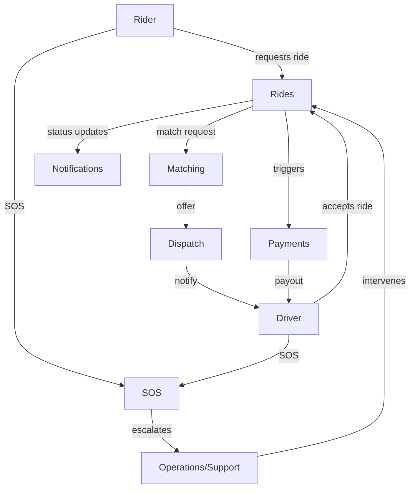
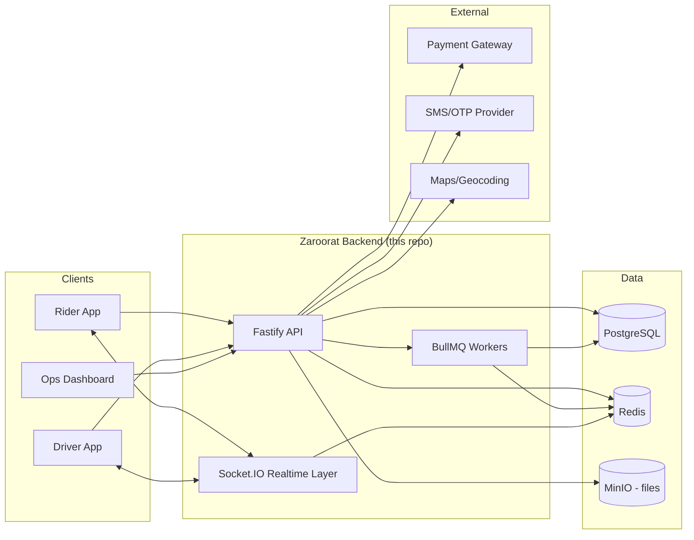

# Zaroorat Engineering Handbook
## Volume 00 — Project Foundation

| | |
|---|---|
| **Status** | Draft — pending founder review |
| **Audience** | Senior engineers, junior engineers, AI coding agents (Claude Code), future team members |
| **Precedes** | `CLAUDE.md`, `ARCHITECTURE.md`, `CODING_STANDARDS.md`, `DATABASE_CONVENTIONS.md`, all module `SPEC.md` files |
| **Key assumption (confirm or correct)** | India-market launch, single metro city first, INR pricing, Android + iOS rider/driver apps consuming this backend. Everything in this volume that depends on that assumption is marked. |

**How to use this volume:** this is the *why* that everything else in the handbook builds on. If a technical decision in a later volume seems arbitrary, the reason should trace back to a requirement, rule, or goal stated here. If it doesn't, that's a gap — flag it rather than inventing a justification after the fact.

---

## Table of Contents

1. Product Vision
2. Product Goals
3. Business Requirements
4. Business Rules
5. Functional Requirements
6. Non-Functional Requirements
7. Feature Catalog
8. Actors
9. User Stories
10. Project Scope
11. Out of Scope
12. Success Metrics
13. High-Level Architecture Overview
14. Technology Selection
15. Development Philosophy
16. Engineering Principles
17. Coding Philosophy
18. Scalability Goals
19. Security Goals
20. Project Roadmap
21. Risks
22. Assumptions
23. Constraints
24. Terminology / Glossary

---

## 1. Product Vision

Zaroorat exists to make getting a ride as dependable as a utility — you open the app, you get a car (or auto/bike, per market), and the price and arrival time are trustworthy enough that you stop thinking about the alternative of driving yourself. The name itself — "necessity" — is the positioning: not a lifestyle app, a dependable one.

The vision is deliberately narrow at launch: **prove that one city can be served reliably** before any conversation about scale, new verticals, or new markets. A ride-hailing platform's hardest problem isn't features — it's the two-sided marketplace liquidity problem (enough drivers, enough riders, in the same place, at the same time). Everything in this document is written with that constraint in mind.

#### Best Practices
- Treat the vision statement as a filter for scope creep — if a proposed feature doesn't serve "reliable rides in one city first," it goes in the roadmap, not v1.
- Revisit this chapter when the roadmap phase changes, not on a fixed schedule.

#### Common Mistakes
- Chasing feature parity with Uber/Ola globally instead of reliability in one city.
- Treating the vision statement as marketing copy rather than a scope-decision tool.

#### Production Checklist
- [ ] Vision statement reviewed and confirmed by founder before Phase 1 begins
- [ ] Every major feature decision in later volumes can be traced back to this vision

---

## 2. Product Goals

| Horizon | Goal | Notes |
|---|---|---|
| Launch (Phase 1) | Reliable ride completion in one city | Target completion rate and city TBD by founder |
| 3–6 months post-launch | Sustainable driver supply in launch city | Driver retention > rider growth initially — supply-constrained marketplaces fail faster than demand-constrained ones |
| 6–12 months | Second city or vertical (auto/bike) evaluation | Gate this on Phase 1 metrics, not calendar time |
| Long-term | Multi-city, multi-vertical mobility platform | Out of scope for backend design decisions today — see §11 |

#### Best Practices
- Sequence goals so supply-side (driver) health is proven before demand-side growth is pushed.
- Keep goals falsifiable — each should have a metric attached (see §12), not just a direction.

#### Common Mistakes
- Setting demand-growth goals before the driver-supply goal is met, causing match-time collapse.
- Conflating "goals" with "features" — a goal is an outcome, not a checklist item.

#### Production Checklist
- [ ] Each goal has at least one linked metric in §12
- [ ] Goals are reviewed at each roadmap phase gate (§20), not just at kickoff

---

## 3. Business Requirements

| Stakeholder | Requirement |
|---|---|
| Riders | Request a ride and get a reliable ETA and price before confirming |
| Riders | Track the assigned driver in real time until pickup |
| Riders | Pay via cash and at least one digital method at launch |
| Drivers | See ride requests with enough info to accept/reject quickly |
| Drivers | Reliable, predictable payout on a fixed cadence |
| Drivers | A clear, appealable process when penalized (rating, suspension) |
| Operations | Visibility into live rides, driver supply, and incidents in real time |
| Operations | Ability to manually intervene in a ride (reassign, cancel, refund) |
| Finance | Auditable trail from every ride to every payment and payout |
| Compliance | Driver KYC and vehicle document verification before a driver can go online |
| Compliance | Data retention and deletion aligned to applicable regional law (India: DPDP Act — confirm exact obligations with counsel; this handbook does not constitute legal advice) |

#### Best Practices
- Every requirement here should map to at least one module's `SPEC.md` business rules — if it doesn't yet, that module isn't specced deeply enough.
- Treat "Finance" and "Compliance" requirements as equally load-bearing as rider-facing ones — they're usually where real production incidents happen.

#### Common Mistakes
- Under-specifying the finance/audit trail early, then retrofitting it after the first payout dispute.
- Treating KYC/compliance as a "later" feature — regulators and payment partners often require it before you can legally operate at all.

#### Production Checklist
- [ ] Every stakeholder requirement above is traceable to a module SPEC
- [ ] Legal/compliance requirements confirmed with an actual advisor, not assumed from this document

---

## 4. Business Rules

These are the rules Claude (and any engineer) must treat as constraints, not suggestions, when building any module. Rules affecting money or safety are marked **[HARD]** — violating them is a production incident, not a bug.

1. **[HARD]** A ride cannot be marked `completed` without a corresponding payment record (cash acknowledgment or captured digital payment).
2. **[HARD]** A driver cannot go online (accept rides) unless KYC status is `verified` and vehicle documents are `valid` (not expired).
3. A rider can cancel free of charge within a configurable grace window (e.g. 2 minutes) after a driver is matched; after that, a cancellation fee rule applies — exact window/fee: **TBD, needs product decision**.
4. **[HARD]** Driver payouts are calculated from completed rides only; a ride in any cancelled or disputed state is excluded until resolved.
5. Surge/dynamic pricing, if enabled, must never be applied retroactively to a ride already confirmed at a quoted price.
6. **[HARD]** An SOS trigger from either rider or driver takes priority over all other queued operations for that ride and immediately notifies operations — no rule in any other module may delay or suppress this.
7. A driver's rating is computed from a rolling window of recent rides (e.g. last 100 or last 90 days — **TBD**), not lifetime average, so a driver can recover from a bad week.
8. Refunds require an operations-role approval above a configurable amount threshold — **TBD, needs finance decision**.
9. A rider's or driver's account can be suspended by operations, but the reason and timestamp must always be recorded — no silent suspensions.

#### Best Practices
- Every `[HARD]` rule here should appear as an explicit test case in the relevant module's `SPEC.md §18 Test Cases`.
- When a `TBD` rule is resolved, update it here first, then propagate to the module spec — this file is the source of truth for business rules, module specs inherit from it.

#### Common Mistakes
- Encoding a business rule only in one module's code with no reference here — it becomes invisible to whoever builds an adjacent module later.
- Leaving `TBD` rules unresolved until they're discovered the hard way in production (e.g. a cancellation fee dispute).

#### Production Checklist
- [ ] All `TBD` items in this chapter resolved before the relevant module moves to `Building` status
- [ ] All `[HARD]` rules have at least one automated test in the codebase

---

## 5. Functional Requirements

Grouped by domain area. Priority uses MoSCoW (Must / Should / Could / Won't — for v1).

| ID | Domain | Requirement | Priority |
|---|---|---|---|
| FR-01 | Auth | Rider/driver signup and login via phone number + OTP | Must |
| FR-02 | Auth | JWT access token + refresh token rotation | Must |
| FR-03 | Users | Profile management (name, photo, saved addresses) | Must |
| FR-04 | Drivers | Document upload and KYC verification workflow | Must |
| FR-05 | Vehicles | Vehicle registration linked to a verified driver | Must |
| FR-06 | Rides | Ride request with pickup/dropoff and fare estimate | Must |
| FR-07 | Matching | Nearest-available-driver matching within a radius | Must |
| FR-08 | Dispatch | Driver notification and accept/reject with timeout | Must |
| FR-09 | Rides | Real-time ride status tracking (matched → in-progress → completed) | Must |
| FR-10 | Realtime | Live driver location updates to rider during active ride | Must |
| FR-11 | Pricing | Base fare + distance/time calculation | Must |
| FR-12 | Pricing | Surge/dynamic pricing | Should |
| FR-13 | Payments | Cash payment acknowledgment flow | Must |
| FR-14 | Payments | Digital payment capture via gateway | Must |
| FR-15 | Payments | Driver payout batching and ledger | Must |
| FR-16 | Notifications | Push/SMS notifications for ride lifecycle events | Must |
| FR-17 | Chat | In-ride rider–driver text chat | Should |
| FR-18 | SOS | Emergency trigger with immediate ops escalation | Must |
| FR-19 | Support | Rider/driver support ticket creation and tracking | Should |
| FR-20 | Promotions | Promo code application to fare | Could |
| FR-21 | Analytics | Operational dashboards (live rides, supply, incidents) | Should |
| FR-22 | Admin | Manual ride intervention (reassign/cancel/refund) by ops | Must |
| FR-23 | Files | Document/image storage (KYC docs, profile photos) via MinIO | Must |

#### Best Practices
- Keep this table as the master requirement list; each row's detail lives in that domain's module `SPEC.md`.
- Re-run MoSCoW prioritization at each roadmap phase gate — "Should" for launch may become "Must" for phase 2.

#### Common Mistakes
- Building "Could" items before "Must" items are production-solid, because they're more interesting to build.
- Losing traceability between this table and module specs as both evolve independently.

#### Production Checklist
- [ ] Every "Must" requirement has a corresponding module SPEC section
- [ ] Priority column revisited at each roadmap gate

---

## 6. Non-Functional Requirements

| Category | Requirement | Target (confirm/adjust) |
|---|---|---|
| Availability | Core ride-request path uptime | 99.9% (≈ 43 min downtime/month) |
| Latency | API p95 response time (non-matching endpoints) | < 200ms |
| Latency | Driver-matching decision time | < 5s from request to first offer |
| Realtime | Location update propagation (driver → rider) | < 2s end-to-end |
| Scalability | Concurrent active rides (launch city) | TBD — depends on city size; design for 10x launch estimate |
| Scalability | Concurrent Socket.IO connections | Design for horizontal scaling via Redis adapter from day one |
| Security | All traffic encrypted in transit | TLS 1.2+ everywhere, no exceptions |
| Security | PII encrypted at rest | Database-level or application-level encryption for KYC data |
| Observability | Every request traceable end-to-end | Correlation/request ID on every log line (see `CODING_STANDARDS.md`) |
| Compliance | Data retention aligned to regional law | Confirm with legal counsel; do not assume |
| Durability | No data loss on payment-related writes | Every payment mutation inside a transaction, written to durable storage before ack |
| Recoverability | Backup and restore | Automated PostgreSQL backups, tested restore procedure before launch |

#### Best Practices
- Treat NFRs as testable — each should be verifiable with a load test, chaos test, or monitoring alert, not just a stated intention.
- Design for horizontal scaling of stateless services (Fastify pods) from day one; it's far cheaper than retrofitting.

#### Common Mistakes
- Optimizing for a scale (multi-city, millions of rides) far beyond what launch actually needs, at the cost of shipping speed.
- Treating "we'll add monitoring later" as acceptable — observability gaps are invisible until the incident that needed them.

#### Production Checklist
- [ ] Load test performed against realistic launch-city traffic estimate before go-live
- [ ] Backup/restore tested at least once before go-live
- [ ] Alerting configured for each availability/latency target above

---

## 7. Feature Catalog

Organized by module (matches `src/modules/` layout). "Phase" references §20.

| Module | Core Features | Phase |
|---|---|---|
| `auth` | OTP login, JWT issuance, refresh rotation, logout/session revoke | 1 |
| `users` | Profile CRUD, saved addresses, preferences | 1 |
| `riders` | Rider-specific state (ride history, saved payment methods) | 1 |
| `drivers` | Driver profile, online/offline status, earnings summary | 1 |
| `rides` | Ride lifecycle: request → match → in-progress → complete/cancel | 1 |
| `payments` | Cash ack, digital capture, refunds, ledger | 1–2 |
| `pricing` | Fare calculation, surge rules | 1–2 |
| `matching` | Nearest-driver search, offer sequencing | 1 |
| `dispatch` | Driver notification, accept/reject/timeout handling | 1 |
| `vehicles` | Vehicle registration, document linkage | 1 |
| `documents` | KYC document upload, verification status | 1 |
| `onboarding` | Driver signup-to-verified-active flow | 1 |
| `notifications` | Push/SMS dispatch for lifecycle events | 1–2 |
| `chat` | In-ride text chat | 2 |
| `promotions` | Promo code creation and redemption | 3 |
| `support` | Ticketing for riders/drivers | 2 |
| `sos` | Emergency trigger and escalation | 1 |
| `analytics` | Operational dashboards | 2–3 |
| `settings` | System/config values (fare constants, radii, etc.) | 1 |
| `files` | MinIO-backed upload/retrieval | 1 |

#### Best Practices
- Keep this catalog as the index; full detail lives in each module's `SPEC.md`.
- A feature shouldn't appear here until its module has at least a draft `SPEC.md` — this prevents the catalog from listing aspirational, unspecified work.

#### Common Mistakes
- Adding a row here without a corresponding SPEC, which becomes a phantom feature nobody actually designed.
- Marking too many modules "Phase 1" — Phase 1 should be the smallest set that produces one working end-to-end ride.

#### Production Checklist
- [ ] Every Phase 1 module has a `SPEC.md` at `Building` status or further before its features are marked done here

---

## 8. Actors

| Actor | Description | Key Permissions |
|---|---|---|
| Rider | End user requesting rides | Create/cancel own rides, view own history, trigger SOS |
| Driver | End user fulfilling rides | Accept/reject offers, update own status, trigger SOS |
| Operations/Support | Internal staff | View/intervene on any ride, view driver/rider records, issue refunds (within threshold) |
| Finance/Payout system | Automated + internal staff | Read-only ride/payment data, initiate payout batches |
| System/Automated jobs | BullMQ workers, schedulers | Enqueue/process background work (notifications, payouts, expiry checks) |
| Payment gateway (external) | Third-party | Receives payment capture requests, sends webhooks back |
| SMS/OTP provider (external) | Third-party | Sends OTPs, delivery receipts |
| Maps/geocoding provider (external) | Third-party | Distance/ETA calculation, reverse geocoding |

#### Best Practices
- Model each actor's permission set explicitly in the `auth`/RBAC design — don't let "operations can do anything" become an unaudited superuser bypass.
- Treat external actors (payment gateway, SMS provider) as untrusted inputs at the API boundary — validate webhook signatures, don't assume payload integrity.

#### Common Mistakes
- Conflating "Operations" and "Admin" as the same role when they may need different permission scopes (support ticket handling vs. financial refund approval).
- Trusting third-party webhook payloads without signature verification.

#### Production Checklist
- [ ] RBAC permission matrix for each actor exists before `auth` module leaves `Building` status
- [ ] Webhook signature verification implemented for every external integration

---

## 9. User Stories

Representative stories only — the exhaustive, testable set lives in each module's `SPEC.md`.

**Rider**
- As a rider, I want to see an upfront fare estimate before confirming, so I can decide if the price is acceptable.
- As a rider, I want to track my driver's live location, so I know when they'll arrive.
- As a rider, I want to trigger SOS during a ride, so help is alerted immediately without needing to navigate a menu.

**Driver**
- As a driver, I want to see pickup distance before accepting a ride, so I can make an informed accept/reject decision.
- As a driver, I want a predictable payout schedule, so I can plan my finances.
- As a driver, I want to appeal a rating or suspension, so an unfair penalty can be corrected.

**Operations**
- As an operations agent, I want to see all active rides on a live dashboard, so I can spot and respond to incidents quickly.
- As an operations agent, I want to manually reassign a ride, so a rider isn't stranded if a driver fails to arrive.

**System**
- As the payout system, I want to exclude disputed rides from a payout batch automatically, so drivers aren't paid for unresolved transactions.

#### Best Practices
- Every "Must" functional requirement in §5 should have at least one user story backing it.
- Write stories from the actor's actual motivation ("so that...") — it's the part that prevents literal-but-wrong implementations.

#### Common Mistakes
- Writing stories as disguised technical tasks ("As a developer, I want a Redis cache...") — that's not a user story, it's an implementation detail.
- Letting the full story set live only here instead of in module specs, where they need to become concrete test cases.

#### Production Checklist
- [ ] Each module's SPEC §18 test cases traces back to at least one user story

---

## 10. Project Scope (v1 / Launch)

- Single city launch (city TBD)
- Rider and driver mobile apps consume this backend (apps themselves are out of this repo's scope)
- Core ride lifecycle: request → match → dispatch → track → complete
- Cash and one digital payment method
- Basic fare calculation (distance + time), surge optional/deferrable
- Driver KYC and vehicle document verification
- SOS with operations escalation
- Basic push/SMS notifications
- Operations dashboard for live ride visibility and manual intervention

#### Best Practices
- Keep the v1 scope small enough that Phase 1 in §20 is achievable by a solo developer in a bounded timeframe.
- Any feature request during Phase 1 build gets checked against this list before being added — if it's not here, it goes to the roadmap, not the sprint.

#### Common Mistakes
- Scope creep disguised as "quick additions" (loyalty points, referral programs) during core-flow development.
- Treating "in scope" as "must be perfect" — v1 scope should be complete but not gold-plated.

#### Production Checklist
- [ ] Scope list reviewed and frozen before Phase 1 coding begins
- [ ] Any addition to this list requires an explicit roadmap/priority conversation, not silent inclusion

---

## 11. Out of Scope (v1)

| Item | Reason Deferred |
|---|---|
| Multi-city operation | Prove one city works before adding operational complexity |
| Bike/auto verticals | Different matching/pricing rules; add after core car flow is stable |
| Corporate/business accounts | B2B billing adds complexity not needed to validate core marketplace |
| Loyalty/subscription programs | Retention feature, premature before retention is even measurable |
| Driver leasing/financing | Adjacent business, not a backend feature |
| In-house insurance marketplace | Regulatory complexity, likely a partnership not a build |
| Full multi-language support | Start with 1–2 languages; internationalize once product-market fit is shown |
| Advanced ML-based dynamic pricing | Rule-based surge is sufficient to validate the marketplace first |

#### Best Practices
- Revisit this list at each roadmap gate — "out of scope" is a phase decision, not a permanent one.
- State the reason for deferral, not just the exclusion — it prevents the same debate from happening again in three months.

#### Common Mistakes
- Treating out-of-scope items as never-to-be-built, causing them to be silently smuggled back in without re-evaluation.

#### Production Checklist
- [ ] This list reviewed at every roadmap phase gate (§20)

---

## 12. Success Metrics

**North Star Metric:** Completed rides per day in the launch city.

| Metric | Why it matters |
|---|---|
| Ride completion rate (completed / requested) | Core reliability signal |
| Average match time (request → driver assigned) | Marketplace liquidity health |
| Driver utilization (active time / online time) | Driver-side economics, retention driver |
| Cancellation rate (rider-initiated, driver-initiated) | Early warning for matching or pricing problems |
| Driver payout accuracy/disputes | Trust signal, direct churn driver if wrong |
| SOS response time (trigger → ops acknowledgment) | Safety-critical, non-negotiable target |
| API uptime / p95 latency | Technical health underlying all of the above |
| Rider NPS / driver NPS | Longer-cycle satisfaction signal |

#### Best Practices
- Every metric should have an owner and a dashboard — a metric nobody looks at isn't a metric, it's decoration.
- Prioritize supply-side (driver) metrics as highly as demand-side (rider) ones — supply collapse kills a marketplace faster than slow demand growth.

#### Common Mistakes
- Only tracking rider-facing vanity metrics (app downloads, signups) while ignoring completion/match-time health.
- Defining a metric without a target or threshold, so it's impossible to say whether it's "good."

#### Production Checklist
- [ ] Each metric has a dashboard and an owner before launch
- [ ] SOS response time has an active alert, not just a dashboard

---

## 13. High-Level Architecture Overview

This is expanded, layer by layer, in `ARCHITECTURE.md`. The key structural decisions this overview implies:
- Fastify handles request/response; Socket.IO handles push/realtime — they're separate concerns sharing Redis as a coordination layer.
- BullMQ workers are separate processes from the API — a slow or failing background job never blocks a request.
- All third-party integrations are called from the API/worker layer, never directly from clients — clients never see gateway/SMS/maps credentials.

#### Best Practices
- Keep stateless layers (API, workers) horizontally scalable from day one — it's the cheapest scaling lever available.
- Route all external API calls through a single integration layer per provider, so retry/timeout/circuit-breaker logic lives in one place.

#### Common Mistakes
- Letting clients call third-party services directly "to save a hop," which leaks credentials and bypasses business rules.
- Coupling Socket.IO logic directly into service classes instead of having it subscribe to domain events (see `ARCHITECTURE.md §4`).

#### Production Checklist
- [ ] No third-party API key ever ships in a mobile client
- [ ] Socket.IO horizontal scaling verified with the Redis adapter under load

---

## 14. Technology Selection

| Technology | Why Chosen | Alternatives Considered | Why Not |
|---|---|---|---|
| Node.js 22 LTS + TypeScript | Async I/O fits a request-heavy, realtime-heavy workload; TS gives type safety at scale | Go, Java/Kotlin | Slower iteration speed for a solo/small team; Node's ecosystem fits realtime + queue tooling well |
| Fastify | Lower overhead than Express, first-class schema validation, strong plugin ecosystem | Express, NestJS | Express lacks built-in schema validation; NestJS's abstraction overhead isn't needed at this team size |
| Prisma | Type-safe queries, good migration tooling, fast to iterate | TypeORM, Drizzle | TypeORM's active-record patterns encourage anti-patterns at scale; Drizzle is promising but less mature tooling around migrations at time of writing |
| PostgreSQL | Strong relational guarantees for financial data, mature geospatial extensions available | MongoDB | Ride/payment data is inherently relational (rides, payments, users, drivers) — a document model fights this |
| Redis | Sub-millisecond cache, pub/sub for Socket.IO scaling, BullMQ backing store | Memcached | No pub/sub, no native queue support |
| BullMQ | Reliable job queue with retry/backoff/DLQ, Redis-backed (no new infra) | AWS SQS, RabbitMQ | Avoids adding a second infra dependency this early; revisit if queue volume outgrows Redis |
| Socket.IO | Mature realtime library, built-in reconnection handling, Redis adapter for scaling | Raw WebSockets, Pusher/Ably (managed) | Raw WS means reimplementing reconnection/room logic; managed services add cost and vendor dependency before it's justified |
| Docker + Kubernetes + Helm | Standard, portable deployment; Helm templates reduce config duplication across environments | Docker Compose only, bare VMs | Compose doesn't scale to multi-environment/multi-replica production needs |
| GitHub Actions | CI/CD co-located with source, good ecosystem of actions | Jenkins, CircleCI | Avoids maintaining separate CI infra for a small team |
| MinIO | S3-compatible, self-hostable object storage for KYC docs/photos | Direct AWS S3 | Keeps storage infra-portable (can move to any S3-compatible provider without code changes) |
| JWT + refresh rotation | Stateless auth scales horizontally without a session store lookup on every request | Server-side sessions | Sessions require sticky routing or a shared session store — added complexity not needed yet |
| Zod | Runtime validation + inferred static types from one schema definition | Joi, class-validator | Joi has no first-class TS inference; class-validator's decorator pattern is heavier for a Fastify-first stack |
| Pino | Fastify's native logger, very low overhead, structured JSON out of the box | Winston | Winston is more configurable but heavier; not needed here |

#### Best Practices
- Record *why* a technology was rejected, not just what was chosen — future you (or future Claude) needs the rejected-alternative reasoning to avoid re-litigating it without new information.
- Revisit a choice only when a real constraint (measured, not hypothetical) is hit — e.g. move off BullMQ/Redis only when actual queue volume demands it.

#### Common Mistakes
- Choosing infrastructure for a hypothetical future scale instead of actual near-term needs.
- Re-debating settled technology choices repeatedly without new evidence.

#### Production Checklist
- [ ] Every technology in this table has a corresponding setup/ops doc in Volume 10 (DevOps) before Phase 1 deployment

---

## 15. Development Philosophy

- **Spec before code.** Every module gets a `SPEC.md` before implementation, per `CLAUDE.md §5`.
- **Build one module deep before building many shallow.** `auth` gets built completely — tested, reviewed, working — before starting a second module. This validates the whole template (spec → schema → repository → service → controller) against reality once, cheaply, instead of 23 times, expensively.
- **Documentation is living, not a one-time artifact.** A spec that no longer matches the code is actively harmful — it's corrected the moment the mismatch is found, not "later."
- **AI-assisted development follows the same rules as human-written code.** Claude (or any AI agent) reads the relevant docs before generating code, and flags gaps rather than inventing behavior — see `CLAUDE.md §6`.

#### Best Practices
- Treat the first module built as a template validation exercise, not just "module #1" — expect to revise `MODULE_SPEC_TEMPLATE.md`, `CODING_STANDARDS.md`, etc. based on what it teaches you.
- Keep PRs small enough that a solo developer (or a reviewer) can hold the whole change in their head.

#### Common Mistakes
- Writing all 23 module specs before building anything, so early specs are never corrected by real implementation feedback (see the conversation that preceded this document).
- Letting documentation drift from code "temporarily," which becomes permanently.

#### Production Checklist
- [ ] `auth` module fully built and specs corrected against reality before starting module 2
- [ ] A recurring habit (even solo) of updating a module's SPEC.md in the same PR that changes its behavior

---

## 16. Engineering Principles

1. **Explicit over implicit.** A reader (human or AI) shouldn't have to infer behavior — state it.
2. **Boring technology, interesting problems.** The hard problems here are marketplace liquidity, matching, and reliability — not framework novelty.
3. **Fail loudly, not silently.** An error swallowed silently becomes a support ticket three weeks later with no trail.
4. **Idempotency by default** for any operation with real-world side effects (payments, ride creation, notification sends).
5. **Least privilege everywhere** — a service, a role, or a token gets exactly the access it needs, no more.
6. **Single responsibility per module** — see `ARCHITECTURE.md §2` module boundary rules.
7. **No premature optimization** — build correct and clear first; optimize against a measured bottleneck, not a guessed one.

#### Best Practices
- Use this list as a code review checklist prompt — "does this violate any of the 7 principles?" is a fast gut check.

#### Common Mistakes
- Optimizing a query or a service before there's a measurement showing it's actually a bottleneck.
- Adding a broad permission "to make things easier later" instead of the specific permission actually needed now.

#### Production Checklist
- [ ] These principles are referenced explicitly in PR review culture, not just written here once

---

## 17. Coding Philosophy

- Readability beats cleverness — the next reader (including future you, including Claude in a future session) should not need to reverse-engineer intent.
- Small, focused PRs over large ones — easier to review, easier to revert.
- Typed boundaries everywhere data crosses a layer (see `CODING_STANDARDS.md §3` DTOs/Zod).
- Errors are typed values (`AppError` subclasses), not ad hoc thrown strings or raw exceptions leaking implementation detail to clients.
- Composition over inheritance for services — prefer small, injectable dependencies over deep class hierarchies.

#### Best Practices
- Treat `CODING_STANDARDS.md` as the enforceable version of this philosophy — this chapter is the "why," that document is the "how."

#### Common Mistakes
- Optimizing code for elegance that only the original author understands.
- Large PRs that bundle unrelated changes, making review and rollback both harder.

#### Production Checklist
- [ ] Linting/formatting enforced in CI so style debates don't consume review time

---

## 18. Scalability Goals

| Phase | Target |
|---|---|
| Launch (single city) | Design for 10x the realistic launch-day concurrent ride estimate — cheap insurance, not premature scale-chasing |
| Post-launch | Horizontal scaling of Fastify API pods and BullMQ workers via Kubernetes HPA |
| Realtime | Socket.IO horizontal scaling via Redis adapter from day one — retrofitting this later is painful |
| Database | Read replicas once read load (dashboards, analytics) meaningfully competes with write load (ride/payment transactions) |
| Multi-city (future, out of scope now) | Would likely require a `regionId` partitioning strategy — flagged in `DATABASE_CONVENTIONS.md §8` as a decision to make before building `pricing`/`matching`/`dispatch` if multi-city is imminent |

#### Best Practices
- Build statelessness into the API/worker layer from the start — it's nearly free early, expensive to retrofit.
- Load-test against realistic numbers, not aspirational ones, before each phase gate.

#### Common Mistakes
- Designing for a multi-city, millions-of-rides future before single-city product-market fit is proven.
- Ignoring realtime (Socket.IO) scaling until it's already a bottleneck in production.

#### Production Checklist
- [ ] Redis adapter for Socket.IO configured and tested with >1 API/WS pod before launch
- [ ] HPA (Horizontal Pod Autoscaler) configured for API and worker deployments

---

## 19. Security Goals

- **AuthN/AuthZ:** JWT access + refresh rotation, RBAC per actor (§8), least-privilege service accounts for internal-to-internal calls.
- **Data protection:** TLS everywhere in transit; encryption at rest for KYC documents and any stored payment-adjacent data; PII access logged.
- **OWASP coverage:** injection (parameterized queries via Prisma by default — never raw string-interpolated SQL), broken auth, sensitive data exposure, broken access control, security misconfiguration — treat the OWASP Top 10 as a pre-launch checklist, not a one-time read.
- **Rate limiting:** on auth endpoints (OTP request/verify) and any endpoint susceptible to abuse (promo code redemption, SOS trigger spam).
- **Secrets management:** Kubernetes Secrets (or a vault solution) — never in source control, never in plain environment files committed to the repo.
- **Audit logging:** every operations-role action (refund, manual reassignment, account suspension) is logged with actor, timestamp, and reason.
- **Dependency hygiene:** automated dependency vulnerability scanning in CI.

#### Best Practices
- Rate-limit OTP request endpoints specifically — SMS costs money per send, and this is a classic abuse vector.
- Verify all third-party webhook signatures (payment gateway especially) — never trust an unauthenticated payload claiming "payment succeeded."

#### Common Mistakes
- Storing secrets in `.env` files committed to version control, even "temporarily."
- Treating OWASP review as a one-time pre-launch task instead of a recurring part of the security goals in this chapter.

#### Production Checklist
- [ ] Secrets management solution in place before any real credential is used
- [ ] OWASP Top 10 review performed before launch and after any major auth/payment change
- [ ] Rate limiting active on OTP and payment-adjacent endpoints before launch

---

## 20. Project Roadmap

| Phase | Focus | Gate to next phase |
|---|---|---|
| Phase 0 — Foundation | This handbook, core conventions (`CLAUDE.md`, `ARCHITECTURE.md`, etc.) | Founder review complete, `auth` spec drafted |
| Phase 1 — Core Ride Flow | `auth`, `users`, `drivers`, `riders`, `vehicles`, `documents`, `onboarding`, `rides`, `matching`, `dispatch`, `settings`, `files`, basic `sos` | One rider can request, get matched, complete a ride end-to-end in a single test city |
| Phase 2 — Money & Trust | `payments`, `pricing` (incl. surge), `notifications`, `support`, mature `sos` | Payments reconcile correctly; a real payout batch runs without manual correction |
| Phase 3 — Realtime Polish & Growth Tools | `chat`, `promotions`, `analytics` dashboards | Operations can run the city day-to-day from the dashboard without engineering intervention |
| Phase 4 — Scale Hardening | Read replicas, HPA tuning, chaos/load testing, second-city readiness evaluation | Metrics from §12 support a second-city or vertical decision |

Exact timelines are intentionally not filled in here — a solo developer's velocity is better discovered empirically after Phase 1 than guessed in advance.

#### Best Practices
- Gate phases on *outcomes* (a working end-to-end flow, reconciled payments) not calendar dates.
- Re-evaluate §10/§11 scope at every phase gate — "out of scope" items may earn their way in once the gate is met.

#### Common Mistakes
- Committing to hard calendar deadlines before Phase 1 velocity is known.
- Starting Phase 2 work (payments) before Phase 1's core ride flow is actually reliable — money flows should sit on top of a trustworthy ride lifecycle, not run in parallel with an unstable one.

#### Production Checklist
- [ ] Phase 1 gate criteria met and demonstrated (not just "code complete") before Phase 2 begins

---

## 21. Risks

| Risk | Likelihood | Impact | Mitigation |
|---|---|---|---|
| Solo-developer bus factor | High (structurally, by definition) | High | This handbook itself is the mitigation — anyone (including a future hire or AI agent) can pick up context from documented rules rather than tribal knowledge |
| Driver supply cold-start (no riders without drivers, no drivers without riders) | High | High | Consider manual/incentivized driver onboarding before public rider launch in the test city |
| Payment gateway integration delays/quirks | Medium | Medium | Integrate and test payment gateway early in Phase 2, not last |
| Location spoofing / fraud (fake GPS, fraudulent ride completion) | Medium | Medium-High | Flag for `rides`/`matching` module spec — needs explicit anti-fraud rules before Phase 1 completes |
| Regulatory requirements for ride-hailing operators (varies by Indian state) | Medium | High | Confirm licensing/compliance requirements with legal counsel before public launch, not after |
| Underestimating KYC/onboarding friction slowing driver supply | Medium | Medium | Track onboarding funnel drop-off as an early metric |

#### Best Practices
- Revisit this table at each roadmap gate — new risks emerge as scope grows (e.g. multi-city introduces new regulatory risk).
- Assign a mitigation owner to each high-impact risk, even if that owner is "founder, personally."

#### Common Mistakes
- Treating regulatory/legal risk as a backend engineering afterthought — it can block launch entirely if discovered late.
- Ignoring the cold-start problem until rider growth stalls due to insufficient drivers.

#### Production Checklist
- [ ] Regulatory requirements for the launch city/state confirmed with legal counsel before public launch
- [ ] Anti-fraud rules for ride completion drafted in `rides`/`matching` SPEC before Phase 1 gate

---

## 22. Assumptions

State explicitly here; correct any that are wrong before they propagate into module specs.

- Market: India, single metro city at launch, INR currency.
- Payment methods at launch: cash + one digital gateway (specific gateway: **TBD**).
- Rider/driver mobile apps are built separately and consume this backend via the documented API — out of this repo's scope.
- Vehicle type at launch: cars only (auto/bike deferred, §11).
- Language support at launch: TBD, likely English + one regional language.
- Team: solo developer through at least Phase 1.
- Infrastructure: self-managed Kubernetes cluster (cloud provider **TBD**), not a fully managed PaaS.

#### Best Practices
- Any assumption here that's wrong should be corrected immediately — later chapters and module specs inherit these assumptions silently.
- Treat unresolved `TBD` assumptions as blockers for the module specs that depend on them (e.g. payment gateway choice blocks `payments` module spec completion).

#### Common Mistakes
- Letting an incorrect assumption ride uncorrected into a module spec, where it becomes much more expensive to unwind.

#### Production Checklist
- [ ] All assumptions in this chapter explicitly confirmed or corrected before Phase 1 module specs are finalized

---

## 23. Constraints

- **Team size:** solo developer (at time of writing) — architecture and process must not assume a team's worth of parallel capacity.
- **Timeline:** not fixed; roadmap phases are gated by outcomes, not dates (§20).
- **Budget/infrastructure:** assume modest initial infrastructure footprint; design should scale up via Kubernetes HPA rather than requiring large fixed spend from day one.
- **Build approach:** incremental, one module built and validated before the next is specced in depth (§15).

#### Best Practices
- Design decisions should be sanity-checked against "can one person actually build and operate this" — not "what would a 50-person platform team build."

#### Common Mistakes
- Adopting enterprise-scale operational tooling (e.g. a full service mesh, multiple specialized databases) before team size or scale justifies the operational overhead.

#### Production Checklist
- [ ] Infrastructure choices reviewed against actual (not aspirational) team size and budget before Phase 1 deployment

---

## 24. Terminology / Glossary

| Term | Meaning |
|---|---|
| Ride | A single trip from request to completion or cancellation |
| Match | The assignment of a specific driver to a specific ride request |
| Dispatch | The process of notifying a matched driver and handling their accept/reject response |
| Surge | Temporary fare multiplier applied during high demand relative to supply |
| ETA | Estimated time of arrival (driver to pickup, or to destination) |
| Idempotency key | A client-supplied unique value ensuring a repeated request doesn't duplicate a side effect (e.g. double-charging) |
| SOS | Emergency trigger by rider or driver during an active ride |
| KYC | Know Your Customer — identity/document verification, here applied to drivers |
| Payout | Transfer of earned fare amount to a driver on a fixed cadence |
| Settlement | The reconciliation of a payment from capture to final ledger state |
| Webhook | An inbound HTTP callback from a third party (e.g. payment gateway confirming a charge) |
| Soft delete | Marking a record as deleted (`deletedAt`) without physically removing it from the database |
| DLQ | Dead Letter Queue — where a job that failed all its retries is parked for investigation |
| RBAC | Role-Based Access Control |
| NFR | Non-Functional Requirement |
| MoSCoW | Prioritization method: Must / Should / Could / Won't (this release) |

#### Best Practices
- Add a term here the first time it's used ambiguously anywhere else in the handbook — don't let a module spec introduce jargon this glossary doesn't cover.

#### Common Mistakes
- Letting the glossary go stale as new terms (module-specific state names, event names) get introduced without being added here.

#### Production Checklist
- [ ] Glossary reviewed for completeness at each roadmap phase gate

---

## Change Log

| Date | Change |
|---|---|
| (start) | Initial Volume 00 draft — TBD items pending founder decisions, all assumptions pending confirmation |
