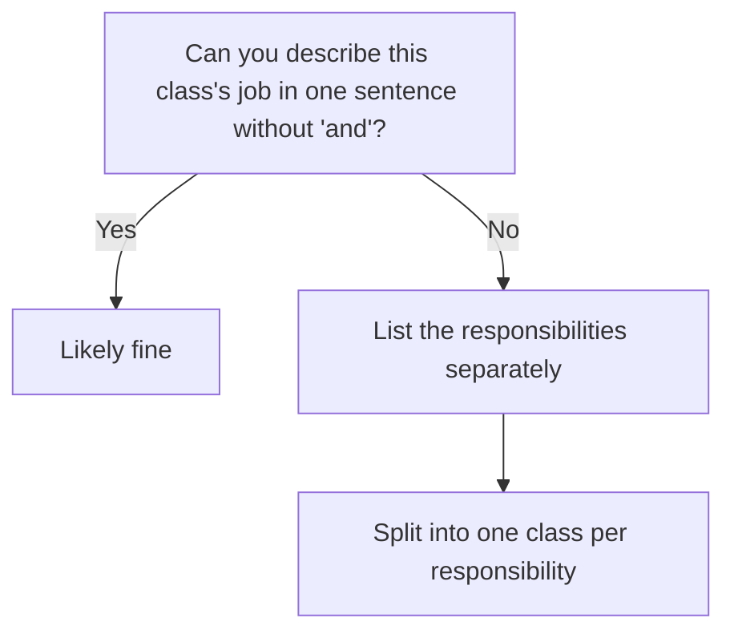
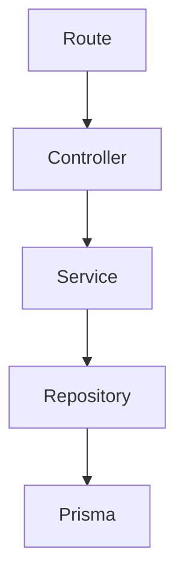
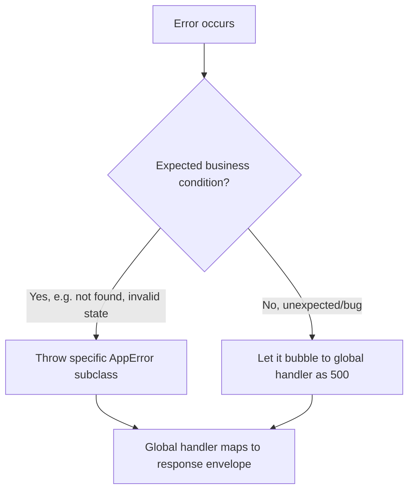
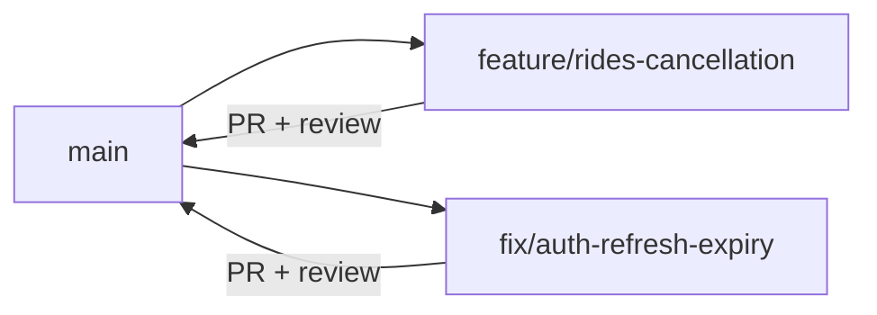
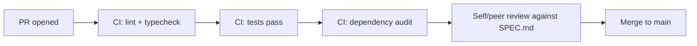

# Zaroorat Engineering Handbook
## Volume 01 — Engineering Standards

| | |
|---|---|
| **Status** | Draft — pending tech lead review |
| **Audience** | Senior/junior engineers, tech leads, architects, DevOps, QA, AI coding agents (Claude Code) |
| **Relationship to Volume 00** | Volume 00 defines *what* Zaroorat is and *why* it exists. This volume defines *how* it is engineered. |
| **Relationship to `CLAUDE.md` / `ARCHITECTURE.md` / `CODING_STANDARDS.md` / `DATABASE_CONVENTIONS.md`** | Those four files are the short, enforceable quick-reference. This volume is the deeper explanation behind them — the reasoning, trade-offs, and edge cases. If this volume and those files ever disagree, that's a bug: fix the mismatch, don't maintain two truths. |

---

## Table of Contents

1. Engineering Philosophy
2. Software Design Principles
3. SOLID Principles
4. KISS Principle
5. DRY Principle
6. YAGNI Principle
7. Clean Code Guidelines
8. Clean Architecture Rules
9. Modular Development Rules
10. Layer Responsibilities
11. Dependency Rules
12. Folder Structure Standards
13. File Naming Conventions
14. Variable Naming Conventions
15. Function Naming Standards
16. Class Naming Standards
17. Interface Naming Standards
18. Enum Naming Standards
19. Type Naming Standards
20. Constants Organization
21. Configuration Standards
22. Error Handling Standards
23. Logging Standards
24. Validation Standards
25. Repository Pattern Guidelines
26. Service Layer Guidelines
27. Controller Guidelines
28. Route Guidelines
29. DTO Standards
30. API Response Standards
31. Code Documentation Standards
32. Git Workflow Standards
33. Branch Naming Standards
34. Commit Message Standards
35. Pull Request Standards
36. Code Review Standards
37. Refactoring Guidelines
38. Performance Standards
39. Security Standards
40. Dependency Management
41. Package Installation Policy
42. Deprecation Policy
43. Versioning Policy
44. Technical Debt Management
45. Engineering Decision Process
46. Quality Gates Before Merge
47. Definition of Done
48. Engineering Checklists
49. Frequently Asked Questions
50. Engineering Glossary

---

## 1. Engineering Philosophy

Zaroorat's backend handles real money and real safety-critical events (SOS, driver dispatch). Engineering here optimizes for **predictability over cleverness**. A tired engineer at 2am debugging a payment discrepancy, or an AI agent generating a new module six months from now, should be able to read the code and the docs and know exactly what will happen — no surprises, no "it depends on who wrote this file."

Three things this philosophy prioritizes, in order: **correctness, clarity, then speed.** A fast feature that's wrong or unreadable costs more time later than it saves now.

#### Summary
Engineering decisions are evaluated against correctness and clarity first; velocity matters, but never at the cost of the other two.

#### Best Practices
- When in doubt between "clever" and "obvious," choose obvious.
- Treat every financial or safety-path change as higher-scrutiny by default.

#### Common Mistakes
- Justifying a risky shortcut with "we'll clean it up later" without a tracked ticket (see §44).
- Optimizing for developer velocity on the payment/safety path specifically — that's the one place velocity should not win.

#### Engineering Checklist
- [ ] Any PR touching `payments`, `rides` state transitions, or `sos` gets at least one additional reviewer pass, even solo (self-review after a break)

---

## 2. Software Design Principles

The umbrella principles below (SOLID, KISS, DRY, YAGNI) aren't independent rules — they're facets of one idea: **software should be easy to change safely.** A ride-hailing backend's requirements *will* change (new payment method, new vehicle type, new region) — the design principles exist to make those changes additive, not invasive.

#### Summary
Every principle chapter that follows exists to serve one goal: safe, cheap change over time.

#### Best Practices
- When two principles conflict (e.g. DRY vs. simplicity), prefer the one that makes the *next* change cheaper, not the one that looks cleaner today.

#### Common Mistakes
- Applying a principle dogmatically without checking whether it serves the underlying goal in this specific case.

#### Engineering Checklist
- [ ] Design principle violations flagged in review reference *which* principle and *why*, not just "this feels wrong"

---

## 3. SOLID Principles

| Principle | Meaning here | Zaroorat example |
|---|---|---|
| **S** — Single Responsibility | A class/module has one reason to change | `RideService` handles ride lifecycle logic only — pricing logic lives in `PricingService`, not inline |
| **O** — Open/Closed | Extend behavior without modifying existing, tested code | Adding a new payment method extends a `PaymentProvider` interface rather than adding `if (method === 'new-method')` branches inside existing capture logic |
| **L** — Liskov Substitution | A subtype must be usable anywhere its base type is expected | Any class implementing `PaymentProvider` (cash, gateway A, gateway B) must honor the same contract — same success/failure semantics |
| **I** — Interface Segregation | Don't force a class to depend on methods it doesn't use | `NotificationSender` for SMS shouldn't be forced to implement push-specific methods it can't fulfill |
| **D** — Dependency Inversion | Depend on abstractions, not concrete implementations | `RideService` depends on a `PaymentProvider` interface, not directly on a specific gateway SDK |

**Decision tree — "Am I violating Single Responsibility?"**



#### Summary
SOLID isn't academic here — each letter maps to a concrete Zaroorat scenario (adding a payment method, a notification channel, a vehicle type) that will actually happen.

#### Best Practices
- Use the Dependency Inversion pattern specifically for anything with more than one real or likely implementation (payment providers, notification channels, maps providers).
- Re-check Single Responsibility whenever a service class exceeds ~5-6 public methods — often a sign it's doing two jobs.

#### Common Mistakes
- Over-applying Dependency Inversion to things that will only ever have one implementation (needless abstraction).
- A "God service" (e.g. `RideService` importing pricing, payment, and notification logic directly) that violates SRP and becomes a merge-conflict magnet.

#### Engineering Checklist
- [ ] Any integration with more than one real/likely implementation goes behind an interface (`PaymentProvider`, `NotificationSender`, `MapsProvider`)
- [ ] No service class directly imports another module's repository (violates Dependency Inversion at the module level — see `ARCHITECTURE.md §2`)

---

## 4. KISS Principle (Keep It Simple)

The simplest design that correctly satisfies the module's `SPEC.md` wins — not the most flexible, not the most "future-proof."

#### Summary
Simplicity is a design goal in its own right, not a fallback when you run out of time.

#### Best Practices
- Prefer a straightforward `if/else` or lookup table over a generic rule-engine abstraction until real complexity justifies it (e.g. build pricing as a clear function first — don't build a configurable pricing DSL for v1).

#### Common Mistakes
- Building a generic, configurable framework for a problem that currently has one concrete case (surge pricing today, but architected as a full plugin system nobody asked for).

#### Engineering Checklist
- [ ] Reviewer asks "what's the simplest version of this that satisfies the spec?" before approving a more complex design

---

## 5. DRY Principle (Don't Repeat Yourself)

DRY applies to **knowledge**, not to superficially similar code. Two functions that happen to look alike today but represent different business rules should stay separate — they'll diverge, and a shared abstraction just makes that divergence harder to express later.

#### Summary
Deduplicate business rules and logic that must always change together; don't deduplicate code that's only coincidentally similar.

#### Best Practices
- Before extracting a shared helper, ask: "if the business rule changes for one caller, should it change for the other too?" If no, don't share it.

#### Common Mistakes
- A shared `calculateAmount()` util used by both `pricing` (fare) and `payments` (payout) that later needs different rounding rules for each, forcing an awkward parameter to fork behavior inside "shared" code.

#### Engineering Checklist
- [ ] Any shared utility used by 2+ modules has a documented reason the logic is genuinely one rule, not two coincidentally similar ones

---

## 6. YAGNI Principle (You Aren't Gonna Need It)

Don't build for the multi-city, multi-vertical future described as out-of-scope in `VOLUME_00 §11` until a roadmap gate actually requires it.

#### Summary
Build for the requirement in front of you, backed by the current module spec — not the requirement you imagine six phases from now.

#### Best Practices
- If a design decision is justified with "we'll need this eventually," check whether "eventually" is in the current roadmap phase (`VOLUME_00 §20`). If not, simplify.

#### Common Mistakes
- Adding a `regionId` column and multi-region query logic everywhere "just in case," before Volume 00's multi-city decision gate is even reached.

#### Engineering Checklist
- [ ] Any speculative "future-proofing" in a PR is justified by a specific, near-term roadmap phase — otherwise it's cut

---

## 7. Clean Code Guidelines

- Functions do one thing, named so the name is the documentation (`calculateSurgeMultiplier`, not `calc2`).
- No magic numbers — named constants (`MAX_MATCH_RADIUS_KM`, not a bare `5` in matching logic).
- Guard clauses over deep nesting — return early on invalid input rather than wrapping the "happy path" in nested `if`s.
- A function's parameter list is a warning sign past 3-4 positional params — use an options object with a named type.

```ts
// Avoid
function createRide(a: string, b: number, c: number, d: number, e: number, f: string) { ... }

// Prefer
function createRide(input: CreateRideInput) { ... }
```

#### Summary
Clean code here means "a stranger can read this function top to bottom and understand it without jumping through five files."

#### Best Practices
- Keep functions short enough to fit on one screen; if it doesn't, it's probably doing more than one thing.

#### Common Mistakes
- Deeply nested conditionals for ride status checks instead of guard clauses or a state machine lookup (see `ARCHITECTURE.md §6`).

#### Engineering Checklist
- [ ] No function accepts more than 3 positional parameters without switching to an input object

---

## 8. Clean Architecture Rules

This restates `ARCHITECTURE.md §1` with the reasoning behind it: dependencies point inward, toward business logic, never outward toward frameworks or infrastructure.



**Why this direction and not, say, letting a controller call Prisma directly to "save a layer":** because the moment you skip a layer once, you've made it acceptable to skip it again, and six months in there's no single place left where business rules are guaranteed to be enforced. The layers aren't ceremony — they're where validation, transactions, and business rules are guaranteed to run.

#### Summary
The layered dependency direction in `ARCHITECTURE.md` exists specifically to guarantee business rules can't be bypassed, not as an abstract "best practice."

#### Best Practices
- Treat any layer-skip ("just this once, for speed") as a design smell to flag in review, not a convenience to allow.

#### Common Mistakes
- A controller calling `prisma.ride.update()` directly "temporarily" during a rushed fix — this is exactly how business rules get silently bypassed in production.

#### Engineering Checklist
- [ ] Static check or lint rule (if feasible) flags direct Prisma imports outside the repository layer

---

## 9. Modular Development Rules

Each module (`auth`, `rides`, `payments`, etc.) is built and reviewed as a unit with a clear public interface (its service's exported methods). Restates and extends `ARCHITECTURE.md §2`.

#### Summary
A module is a contract (its service interface) plus a private implementation (repository, internal logic) that other modules never touch directly.

#### Best Practices
- When starting a new module, write its service's public method signatures before the implementation — this is the contract other modules will build against.

#### Common Mistakes
- Another module importing a type or helper meant to be internal to a module's repository layer.

#### Engineering Checklist
- [ ] Each module's `SPEC.md §11 Service Methods` is written and reviewed before dependent modules start integrating against it

---

## 10. Layer Responsibilities

| Layer | Responsible for | Not responsible for |
|---|---|---|
| Route | URL, method, schema binding | Any logic |
| Controller | Request/response shaping, calling one service method | Business rules, direct DB access |
| Service | Business rules, orchestration, transactions | HTTP concerns, direct framework knowledge |
| Repository | Data access queries | Business rules, validation beyond query shape |
| Prisma/DB | Persistence, constraints | Application logic |

#### Summary
Each layer has exactly one job; if you're unsure where code belongs, this table is the tiebreaker.

#### Best Practices
- When writing code, name the layer it belongs to before writing it — if you can't decide, the logic is probably in the wrong place already.

#### Common Mistakes
- Validation logic duplicated in both controller and service — pick one (service, since it's reusable by other internal callers too).

#### Engineering Checklist
- [ ] Every PR's changed files map cleanly to one layer each — mixed-layer files are a review flag

---

## 11. Dependency Rules

Restates `ARCHITECTURE.md §1-2`: a layer only calls the layer directly below it; a module only calls another module through its service. No exceptions, including "just for this one admin script" — admin scripts call services too.

#### Summary
Dependency direction is enforced uniformly, including for internal tooling and scripts, not just production request paths.

#### Best Practices
- Write one-off scripts (data backfills, admin tools) as callers of service methods, never as direct Prisma scripts that bypass business rules.

#### Common Mistakes
- A "quick migration script" that writes directly to the database, skipping validation and leaving data in a state the application layer never expects.

#### Engineering Checklist
- [ ] All scripts/tools that mutate data go through the service layer, or are explicitly reviewed as an exception with a documented reason

---

## 12. Folder Structure Standards

Restates `CLAUDE.md §7`, with rationale: modules are grouped by business domain, not by technical type (no `controllers/`, `services/` top-level folders) — this keeps everything about `rides` in one place, so both a human and an AI agent can find all of it without cross-referencing five folders.

```
src/
  modules/
    <module-name>/
      controller.ts
      service.ts
      repository.ts
      routes.ts
      schema.ts
      dto.ts
      SPEC.md
      __tests__/
  shared/
  config/
```

#### Summary
Domain-first folder structure over technical-layer-first — it's optimized for "understand one feature," not "browse all controllers."

#### Best Practices
- Anything used by 2+ modules goes in `shared/`, with a clear one-purpose file (e.g. `shared/errors/app-error.ts`), not a catch-all `utils.ts`.

#### Common Mistakes
- A growing, unstructured `shared/utils.ts` that becomes a dumping ground with no clear ownership.

#### Engineering Checklist
- [ ] No new top-level technical-type folder (`controllers/`, `services/`) is introduced outside a module

---

## 13. File Naming Conventions

| File type | Pattern | Example |
|---|---|---|
| Controller | `<module>.controller.ts` | `ride.controller.ts` |
| Service | `<module>.service.ts` | `ride.service.ts` |
| Repository | `<module>.repository.ts` | `ride.repository.ts` |
| Routes | `<module>.routes.ts` | `ride.routes.ts` |
| Schema (Zod) | `<module>.schema.ts` | `ride.schema.ts` |
| DTO | `<module>.dto.ts` | `ride.dto.ts` |
| Test | `<module>.<layer>.test.ts` | `ride.service.test.ts` |

#### Summary
File names are predictable enough that you can guess a file's path from its module and layer alone.

#### Best Practices
- Keep singular module names in file paths (`ride.service.ts`, not `rides.service.ts`) even though the module folder and table name are plural — this is a deliberate, documented exception; consistency within the exception matters more than eliminating it.

#### Common Mistakes
- Inconsistent pluralization between folder, file, and class names, making search harder.

#### Engineering Checklist
- [ ] New files match the pattern table above before merge

---

## 14. Variable Naming Conventions

- `camelCase`, descriptive over abbreviated: `driverLocation`, not `drvLoc`.
- Booleans read as a question: `isOnline`, `hasValidDocuments`, `canAcceptRides`.
- Avoid single-letter variables outside tight loop/index scope.
- Domain terms match the glossary (`VOLUME_00 §24`) exactly — don't invent a synonym for an already-defined term (e.g. always `payout`, never `disbursement` interchangeably).

#### Summary
Variable names should make the glossary redundant to consult for anyone reading the code.

#### Best Practices
- When a variable represents a domain concept, name it exactly as the glossary does.

#### Common Mistakes
- Using `status` generically across multiple entities (ride status vs. driver status vs. payment status) without a qualifying prefix, causing ambiguity in shared contexts like logs.

#### Engineering Checklist
- [ ] Boolean variables read naturally as yes/no questions
- [ ] Domain terms match `VOLUME_00 §24` glossary

---

## 15. Function Naming Standards

| Prefix/Pattern | Meaning |
|---|---|
| `get...` | Returns data, no side effects |
| `create...` | Creates a new entity |
| `update...` | Mutates an existing entity |
| `delete...` / `remove...` | Soft-deletes (per `DATABASE_CONVENTIONS.md §4`) |
| `is...` / `has...` / `can...` | Returns boolean |
| `calculate...` | Pure computation, no side effects |
| `handle...` | Event/webhook handler entry point |

#### Summary
A function's name alone should tell you whether it has side effects — critical for a codebase with money and state transitions.

#### Best Practices
- Never name a function `get...` if it has a side effect (e.g. `getOrCreateProfile` is honest; `getProfile` that silently creates one is not).

#### Common Mistakes
- A `getActiveRide()` that also updates a `lastCheckedAt` timestamp as a side effect — the name lies about what it does.

#### Engineering Checklist
- [ ] Function names accurately reflect side effects (or lack thereof)

---

## 16. Class Naming Standards

`PascalCase`, suffixed by role: `RideService`, `RideRepository`, `RideController`. Avoid generic names like `Manager`, `Helper`, `Processor` without a qualifying domain term (`RideDispatchProcessor`, not `Processor`).

#### Summary
A class name should tell you its layer and its domain at a glance.

#### Best Practices
- If you can't name a class without a vague suffix like "Manager," it's likely doing too much — revisit SRP (§3).

#### Common Mistakes
- A catch-all `UtilsManager` class that accumulates unrelated static methods over time.

#### Engineering Checklist
- [ ] No class name uses a vague suffix (`Manager`, `Handler`, `Helper`) without a specific domain qualifier

---

## 17. Interface Naming Standards

No `I` prefix (TypeScript convention differs from C#/Java) — name the interface for what it represents: `PaymentProvider`, not `IPaymentProvider`. Reserve the word "Interface" itself for cases where a concrete class of the same conceptual name also exists and disambiguation is needed.

#### Summary
Interfaces are named for their role, not flagged with a type-system prefix.

#### Best Practices
- Prefer `PaymentProvider` (interface) + `RazorpayPaymentProvider` (implementation) over `IPaymentProvider` + `PaymentProvider`.

#### Common Mistakes
- Mixing `I`-prefixed and non-prefixed interfaces across the codebase inconsistently.

#### Engineering Checklist
- [ ] No `I`-prefixed interface names introduced

---

## 18. Enum Naming Standards

`PascalCase` enum name, `PascalCase` members: `RideStatus.PendingMatch`, not `RIDE_STATUS.PENDING_MATCH`. Restates `CODING_STANDARDS.md §2`.

#### Summary
Enums follow class-like casing for both the type and its members, consistently.

#### Best Practices
- Prefer string enums (`enum RideStatus { PendingMatch = 'pending_match' }`) over numeric enums — readable in logs and database dumps.

#### Common Mistakes
- Numeric enums whose meaning is opaque when read directly from a database row or a log line.

#### Engineering Checklist
- [ ] All new enums are string-valued, not numeric

---

## 19. Type Naming Standards

`PascalCase`. DTOs suffixed `Dto` (`CreateRideDto`); domain types unsuffixed (`Ride`, `Driver`); API-shape types suffixed by direction where ambiguity exists (`RideResponse` vs. `Ride` the Prisma-adjacent domain model).

#### Summary
Type suffixes communicate where in the request/response lifecycle a shape belongs.

#### Best Practices
- Never reuse a Prisma-generated type directly as an API response type — map explicitly, even if the shape is currently identical, so they can diverge safely later.

#### Common Mistakes
- Returning a raw Prisma model (including internal-only fields) directly as an API response, leaking fields never meant to be public.

#### Engineering Checklist
- [ ] No Prisma-generated type is returned directly from a controller without explicit mapping to a response DTO

---

## 20. Constants Organization

Domain constants live in `shared/constants/<domain>.ts` (e.g. `shared/constants/rides.ts` → `MAX_MATCH_RADIUS_KM`). `SCREAMING_SNAKE_CASE`. No constant is duplicated across modules — it's imported from its owning domain's constants file.

#### Summary
One authoritative location per constant, grouped by the domain it governs.

#### Best Practices
- If a constant is genuinely configurable per environment (not just a fixed business rule), it belongs in configuration (§21), not a hardcoded constant.

#### Common Mistakes
- The same numeric threshold (e.g. match radius) hardcoded independently in both `matching` and a test file, drifting apart over time.

#### Engineering Checklist
- [ ] No magic number appears more than once across the codebase without being a named, imported constant

---

## 21. Configuration Standards

Environment-specific values (database URL, Redis URL, JWT secret, gateway keys) are read once at startup via a validated config module — never `process.env.X` scattered inline through business logic.

```ts
// shared/config/env.ts
const envSchema = z.object({
  DATABASE_URL: z.string().url(),
  JWT_SECRET: z.string().min(32),
  REDIS_URL: z.string().url(),
});
export const env = envSchema.parse(process.env);
```

#### Summary
Configuration is validated once, at startup, with a schema — a missing/malformed env var fails fast at boot, not mid-request in production.

#### Best Practices
- Fail loudly at startup if required config is missing — never fall back to a silent default for security-relevant config (JWT secret, DB credentials).

#### Common Mistakes
- Scattered `process.env.X` calls with no validation, causing a missing variable to surface as a confusing runtime error deep in a request.

#### Engineering Checklist
- [ ] All environment variables are declared and validated in one schema at startup

---

## 22. Error Handling Standards

Extends `CODING_STANDARDS.md §4`. Every error is a typed `AppError` subclass carrying an HTTP status and machine-readable code. A single global Fastify error handler is the only place that formats the response envelope for errors.

**Decision tree — what kind of error is this?**



#### Summary
Errors are typed, categorized, and handled in exactly one place — never caught-and-swallowed silently, never leaked as raw stack traces to a client.

#### Best Practices
- Log the full error (with stack trace) server-side even when the client only sees a generic message.
- Every module's `SPEC.md §17 Error Catalog` is the source of truth for that module's error codes.

#### Common Mistakes
- A `try/catch` that logs nothing and returns `null`, silently hiding a failure from both the caller and any observability tooling.
- Leaking a raw Prisma or database error message (which can include schema details) directly to an API client.

#### Engineering Checklist
- [ ] No empty `catch` blocks anywhere in the codebase
- [ ] No raw internal error message reaches an API response

---

## 23. Logging Standards

Extends `CODING_STANDARDS.md §6`. Structured JSON logs via `pino`, always including `requestId`. Never log secrets, tokens, OTPs, full card numbers, or unredacted KYC document contents.

| Level | Use for |
|---|---|
| `error` | Unexpected failures, caught exceptions worth investigating |
| `warn` | Recoverable but noteworthy (retrying a failed webhook call) |
| `info` | Significant business events (ride created, payment captured) |
| `debug` | Detailed internal state, disabled in production by default |

#### Summary
Logs are structured, correlated by request, and safe to read without accidentally exposing sensitive data.

#### Best Practices
- Log the domain event name explicitly (`'ride.matched'`) alongside structured fields — makes log search by event trivial.

#### Common Mistakes
- Logging an entire request body indiscriminately, which can capture PII or secrets without anyone intending to.

#### Engineering Checklist
- [ ] A log-scrubbing check (manual or automated) confirms no secret/PII field is logged in plaintext before each release

---

## 24. Validation Standards

Extends `CODING_STANDARDS.md §3`. All external input (HTTP body/query/params, webhook payloads, queue job payloads) is validated with Zod at the boundary before any business logic runs. Types are inferred from the schema, never hand-duplicated.

#### Summary
Nothing unvalidated reaches a service method — validation is a gate, not a suggestion.

#### Best Practices
- Validate webhook payloads (payment gateway callbacks) with the same rigor as client requests — they're still external input.

#### Common Mistakes
- Trusting a queue job's payload shape without validation because "we control what enqueues it" — schemas drift, and a bad job payload should fail loudly, not crash a worker mysteriously.

#### Engineering Checklist
- [ ] Every route, webhook handler, and queue job processor validates its input against a Zod schema before use

---

## 25. Repository Pattern Guidelines

A repository exposes intention-revealing query methods (`findActiveByDriverId`, not a generic `find(criteria)` that leaks Prisma's query shape to callers). Repositories accept an optional transaction client to participate in a caller-managed transaction (`DATABASE_CONVENTIONS.md §6`).

```ts
class RideRepository {
  async findActiveByDriverId(driverId: string, tx: Prisma.TransactionClient = prisma) {
    return tx.ride.findFirst({
      where: { driverId, status: { in: ['matched', 'in_progress'] }, deletedAt: null },
    });
  }
}
```

#### Summary
Repositories are a thin, named-intent layer over Prisma — not a place for business rules, not a leaky passthrough of raw query builders.

#### Best Practices
- Name repository methods for what the caller wants to know, not how the query is built.

#### Common Mistakes
- A repository method that accepts an arbitrary `where` clause object from the service layer, defeating the purpose of encapsulating queries.

#### Engineering Checklist
- [ ] No repository method accepts a raw Prisma `where`/`include` object from its caller

---

## 26. Service Layer Guidelines

Services own business rules, transaction boundaries, and event emission. A service method should read like the business rule it implements, with repository calls and validation as supporting details.

#### Summary
If you want to know a business rule, the service layer is where you look — never the controller, never the repository.

#### Best Practices
- Keep one service method mapped to one clear business operation (`cancelRide`, not a multi-purpose `updateRide(action: string)`).

#### Common Mistakes
- A single overloaded `updateRide()` service method with an internal `switch` on an `action` string, hiding what operations are actually possible from anyone reading the public interface.

#### Engineering Checklist
- [ ] Service public methods are named for specific business operations, not generic CRUD-plus-flags

---

## 27. Controller Guidelines

A controller parses the request (already validated by route schema), calls exactly one service method, and shapes the response envelope. No business logic, no direct repository/Prisma access, no more than a few lines per handler.

#### Summary
Controllers are thin translators between HTTP and the service layer — if a controller method is more than ~10 lines, logic has probably leaked in that belongs in the service.

#### Best Practices
- If you find yourself writing an `if` statement in a controller that isn't about HTTP status mapping, move it to the service.

#### Common Mistakes
- Business validation (e.g. checking a ride's current state before allowing cancellation) implemented in the controller instead of the service, meaning any other caller of the service bypasses that check.

#### Engineering Checklist
- [ ] No controller method exceeds ~10-15 lines or contains a business-rule conditional

---

## 28. Route Guidelines

Routes register path, method, Zod schema, and the controller handler — nothing else. Route files are a manifest, not a place for logic.

```ts
fastify.post('/rides', {
  schema: { body: createRideSchema },
  preHandler: [authenticate],
}, rideController.create);
```

#### Summary
A route file should be readable as a table of contents for the module's API surface.

#### Best Practices
- Group related routes together and order them predictably (create, read, update, delete/cancel) so the file itself documents the API shape.

#### Common Mistakes
- Inline handler functions written directly in the route file instead of delegating to the controller, making the route file balloon and lose its "manifest" clarity.

#### Engineering Checklist
- [ ] Every route delegates to a named controller method — no inline handler logic

---

## 29. DTO Standards

Extends `CODING_STANDARDS.md §3`. Input DTOs are inferred from Zod schemas. Output DTOs are explicit mapping functions from domain/Prisma models — never a direct passthrough.

```ts
function toRideResponse(ride: Ride): RideResponseDto {
  return {
    id: ride.id,
    status: ride.status,
    // internal fields like `internalNotes` deliberately omitted
  };
}
```

#### Summary
DTOs are the explicit, intentional boundary between internal data shape and what a client ever sees.

#### Best Practices
- Write the output-mapping function even when the shape looks identical to the internal model today — it's what lets internal and external shapes diverge safely later.

#### Common Mistakes
- Adding an internal-only field (e.g. an admin note, an internal risk score) to a Prisma model, then returning that model directly, accidentally exposing it to clients.

#### Engineering Checklist
- [ ] Every API response is built through an explicit output-mapping function, never a raw Prisma object

---

## 30. API Response Standards

Restates `CODING_STANDARDS.md §5` envelope format exactly — success/error shape, pagination meta, `requestId`. This is enforced identically across every module; no module gets a bespoke response shape.

#### Summary
One envelope shape, no exceptions, across all 23 modules.

#### Best Practices
- If a new use case seems to need a different envelope shape, it almost always fits within `meta` instead — extend, don't fork.

#### Common Mistakes
- A module returning a bare array for a list endpoint instead of the paginated envelope, breaking client-side consistency.

#### Engineering Checklist
- [ ] Every new endpoint's response is verified against the standard envelope in code review

---

## 31. Code Documentation Standards

Code comments explain **why**, not **what** (the code already says what). A comment justifying a non-obvious business rule or a workaround is required; a comment restating the next line of code is noise and should be removed.

```ts
// Bad
// increment count by 1
count += 1;

// Good
// Grace period is measured from match time, not request time —
// see VOLUME_00 §4 business rule 3 for rationale
const graceDeadline = addMinutes(matchedAt, GRACE_PERIOD_MINUTES);
```

#### Summary
Comments carry business rationale and links back to the spec/business-rule that justifies non-obvious code — not narration of the code itself.

#### Best Practices
- Link a comment to the specific business rule number in `VOLUME_00 §4` or the module's `SPEC.md` when the code encodes a non-obvious rule.

#### Common Mistakes
- Comments that go stale because they restate implementation detail that changes independently of the comment.

#### Engineering Checklist
- [ ] Comments in a PR explain rationale, not restate code, or are removed in review

---

## 32. Git Workflow Standards

Trunk-based-ish for a small team: short-lived feature branches off `main`, PR required even solo, no direct commits to `main`.



#### Summary
Every change enters `main` through a reviewed PR, keeping `main` always deployable.

#### Best Practices
- Rebase feature branches on `main` before opening a PR to keep history linear and reviewable.

#### Common Mistakes
- Long-lived feature branches that drift far from `main`, producing painful merge conflicts.

#### Engineering Checklist
- [ ] No branch lives more than a few days without merging or being explicitly flagged as blocked

---

## 33. Branch Naming Standards

| Type | Pattern | Example |
|---|---|---|
| Feature | `feature/<module>-<short-desc>` | `feature/rides-cancellation` |
| Fix | `fix/<module>-<short-desc>` | `fix/auth-refresh-expiry` |
| Chore | `chore/<short-desc>` | `chore/upgrade-prisma` |
| Docs | `docs/<short-desc>` | `docs/volume-01-standards` |

#### Summary
Branch names are searchable and self-describing — you can tell what a branch does without opening it.

#### Best Practices
- Include the module name in feature/fix branches so `git branch` output doubles as a change log by domain.

#### Common Mistakes
- Vague branch names (`fix-bug`, `updates`) that give no signal in a branch list or PR history.

#### Engineering Checklist
- [ ] Branch names follow the pattern table before a PR is opened

---

## 34. Commit Message Standards

Conventional Commits: `<type>(<scope>): <description>`.

| Type | Use for |
|---|---|
| `feat` | New feature |
| `fix` | Bug fix |
| `docs` | Documentation only |
| `refactor` | Code change with no behavior change |
| `test` | Adding/fixing tests |
| `chore` | Tooling, dependencies, config |

Example: `feat(rides): add cancellation grace period logic`

#### Summary
Commit history is a readable, filterable log of what changed and why, by type and module.

#### Best Practices
- Keep the description in imperative mood ("add", not "added" or "adds") — matches how Git itself describes commits.

#### Common Mistakes
- Vague commit messages (`fix stuff`, `wip`) that make `git log` useless for tracing when a specific behavior was introduced.

#### Engineering Checklist
- [ ] Every commit message matches the Conventional Commits pattern

---

## 35. Pull Request Standards

Every PR description states: what changed, why, which module(s), and how it was tested. Links the relevant module `SPEC.md` section if it implements/changes a business rule.

#### Summary
A PR should be reviewable without needing a live conversation to understand its intent.

#### Best Practices
- Keep PRs scoped to one module or one clear cross-cutting change — easier to review, easier to revert independently.

#### Common Mistakes
- A PR that bundles an unrelated dependency upgrade with a feature change, making both harder to review and riskier to revert.

#### Engineering Checklist
- [ ] PR description links the relevant `SPEC.md` section for any business-rule-affecting change

---

## 36. Code Review Standards

Even solo, self-review after a break is mandatory for anything touching `payments`, `rides` state transitions, or `sos` (§1). Review checks: does it match the module's `SPEC.md`, does it follow `CODING_STANDARDS.md`, are there tests for each business rule touched.

#### Summary
Review exists to catch mismatches between intended spec and actual implementation — not just style nits.

#### Best Practices
- Review against the module's `SPEC.md` open in a second window, not from memory of what the spec says.

#### Common Mistakes
- Reviewing only for style/formatting while missing a business-rule mismatch against the spec.

#### Engineering Checklist
- [ ] Reviewer confirms each changed business rule has a corresponding test (§18 of the module SPEC)

---

## 37. Refactoring Guidelines

Refactors are separated from behavior changes in distinct PRs/commits wherever feasible — a reviewer should never have to untangle "did this change behavior or just structure?"

#### Summary
Structural change and behavioral change are never silently bundled.

#### Best Practices
- Run the full test suite before and after a pure refactor to prove behavior is unchanged, and say so explicitly in the PR description.

#### Common Mistakes
- A "refactor" PR that quietly changes a business rule along the way, discovered only when something breaks in production.

#### Engineering Checklist
- [ ] Refactor-only PRs explicitly state "no behavior change" and are backed by passing pre-existing tests

---

## 38. Performance Standards

Performance work is driven by the NFR targets in `VOLUME_00 §6`, not intuition. Profile before optimizing; optimize the measured bottleneck, not a guessed one (Engineering Principle #7, §16 below).

#### Summary
No optimization work happens without a measurement showing it's needed.

#### Best Practices
- Add a database index or a cache only after a slow query is confirmed via logs/profiling, not preemptively.

#### Common Mistakes
- Premature caching of data that changes frequently (e.g. driver location), introducing staleness bugs for a performance problem that didn't exist yet.

#### Engineering Checklist
- [ ] Any performance-motivated change cites a specific measurement (slow query log, latency metric) that justified it

---

## 39. Security Standards

Extends `VOLUME_00 §19`. Every module's `SPEC.md §16 Permissions` is enforced at the service layer, not just hidden by not exposing a route in the client app. Rate limiting on OTP, auth, and abuse-prone endpoints (promo redemption, SOS trigger). Webhook signatures always verified.

#### Summary
Security is enforced server-side, at the layer that can't be bypassed by a modified client request.

#### Best Practices
- Assume every request could come from a modified or malicious client, not just the official app — enforce permission checks in the service layer regardless of what the "normal" client would send.

#### Common Mistakes
- Relying on the mobile app to "just not show" an unauthorized action instead of enforcing it server-side, which is trivially bypassed with a direct API call.

#### Engineering Checklist
- [ ] Every service method that mutates state checks the caller's permission explicitly, not just relying on route-level auth middleware presence

---

## 40. Dependency Management

Dependencies are reviewed before adding — check maintenance activity, license, and whether the problem justifies a new dependency at all (YAGNI, §6). Lockfiles (`package-lock.json`) always committed.

#### Summary
Every third-party dependency is a maintenance and security liability accepted deliberately, not by default.

#### Best Practices
- Prefer a small amount of hand-written code over a dependency for trivial logic (e.g. a one-line date calculation doesn't need a full date library if `date-fns`'s specific function isn't already a dependency elsewhere).

#### Common Mistakes
- Adding a large dependency for a single utility function it provides, bloating the install and attack surface.

#### Engineering Checklist
- [ ] New dependency additions are justified in the PR description (why needed, why this one)

---

## 41. Package Installation Policy

Run `npm audit` (or equivalent) as part of CI. No dependency is added without checking its weekly download count, last publish date, and open security advisories.

#### Summary
Every new package passes a basic health check before it enters the dependency tree.

#### Best Practices
- Pin exact versions for anything security-sensitive (auth, crypto libraries) rather than accepting a caret range automatically.

#### Common Mistakes
- Installing a package with no recent updates and no alternative evaluated, discovered as a security liability only after an audit flags it months later.

#### Engineering Checklist
- [ ] CI fails the build on a high/critical severity vulnerability in dependencies

---

## 42. Deprecation Policy

When a module's API changes in a breaking way (e.g. an endpoint's response shape changes), the old shape is supported for a defined window (mobile app release cycles are typically slower than backend deploys) and marked deprecated in that endpoint's `SPEC.md`, not removed abruptly.

#### Summary
Breaking changes have a communicated, time-boxed migration window — never an instant cutover that breaks a client app already in users' hands.

#### Best Practices
- Version breaking API changes explicitly (`/v2/rides`) rather than silently changing `/v1/rides`' behavior.

#### Common Mistakes
- Changing a response shape in place without versioning, breaking an already-released mobile app version with no way to roll back server-side.

#### Engineering Checklist
- [ ] Any breaking API change is versioned and the deprecated version's sunset date is documented

---

## 43. Versioning Policy

The API is versioned at the route prefix level (`/v1/...`). Internal packages (if extracted later) follow semantic versioning. A breaking business-rule change to an existing, released module still requires a versioning conversation even if the URL doesn't change — restates §42.

#### Summary
Versioning protects already-shipped mobile clients from being broken by backend changes they didn't ask for.

#### Best Practices
- Default new modules to `/v1` from the start, even though there's only one version today — retrofitting versioning later is more disruptive than starting with it.

#### Common Mistakes
- Launching without any version prefix, then needing a painful migration once a v2 is actually needed.

#### Engineering Checklist
- [ ] Every route is registered under a version prefix from day one

---

## 44. Technical Debt Management

Debt is tracked explicitly (a ticket, a `TODO` linked to a ticket number, never a bare unlinked `TODO`) with the specific tradeoff stated: what was skipped, and why, and what the cost of not fixing it is.

```ts
// TODO(ZAR-142): Naive O(n) nearest-driver search; replace with geospatial index
// once matching module SPEC's PostGIS decision (DATABASE_CONVENTIONS.md §5) is implemented.
```

#### Summary
Debt is a visible, tracked decision, not an invisible shortcut discovered by accident later.

#### Best Practices
- Every debt-incurring shortcut gets a ticket at the time it's taken, not "whenever we remember."

#### Common Mistakes
- A bare `// TODO: fix this` with no ticket, no context, and no owner — effectively invisible technical debt.

#### Engineering Checklist
- [ ] No `TODO` comment merges without a linked ticket reference

---

## 45. Engineering Decision Process

For decisions with lasting architectural impact (e.g. choosing a geospatial indexing approach, choosing a payment gateway), write a short Architecture Decision Record (ADR): context, options considered, decision, consequences. Store under `docs/ADR/`.

```
ADR-003: Nearest-driver search strategy
Context: Naive lat/lng filtering doesn't scale past a small radius/driver count.
Options: PostGIS extension, geohash-based bucketing, external geospatial service.
Decision: PostGIS extension on existing PostgreSQL instance.
Consequences: No new infra dependency; requires PostGIS-aware query knowledge in `matching` repository.
```

#### Summary
Significant decisions are recorded with their reasoning, so they're not silently re-litigated or reversed without new information.

#### Best Practices
- Write the ADR before implementing, not after — it should genuinely inform the decision, not just document a foregone conclusion.

#### Common Mistakes
- Making an architecturally significant choice in a PR description that gets buried and forgotten, instead of a discoverable ADR.

#### Engineering Checklist
- [ ] Any decision affecting more than one module's design going forward gets an ADR before implementation

---

## 46. Quality Gates Before Merge



No PR merges unless all four gates pass — this is non-negotiable even for a solo developer, because CI doesn't get tired at 2am the way a human reviewer does.

#### Summary
Automated gates catch what review might miss, especially working solo.

#### Best Practices
- Keep CI fast enough (a few minutes) that it doesn't create pressure to skip it "just this once."

#### Common Mistakes
- Merging with a known-failing test "to fix later," which is how known-failing tests become permanently ignored.

#### Engineering Checklist
- [ ] CI is required (not optional/advisory) on the `main` branch protection rule

---

## 47. Definition of Done

A module (or feature within one) is "done" only when:
- [ ] Matches its `SPEC.md`, and the spec has been corrected for any deviation discovered during build
- [ ] All business rules (`SPEC.md §3` / `VOLUME_00 §4`) have a passing test
- [ ] Error catalog (`SPEC.md §17`) is implemented and tested
- [ ] Logging present for key business events
- [ ] Reviewed against `CODING_STANDARDS.md` and this volume
- [ ] Documented in the module's `README.md`/`SPEC.md` for future readers

#### Summary
"Done" means spec-matching, tested, and documented — not just "the happy path works on my machine."

#### Best Practices
- Use this list literally as a PR merge checklist, not just an abstract ideal.

#### Common Mistakes
- Calling a feature "done" after only the happy path is verified, with error cases untested.

#### Engineering Checklist
- [ ] This Definition of Done list is copy-pasted into the PR description and checked off, not just implied

---

## 48. Engineering Checklists

A consolidated index — the per-chapter checklists throughout this volume, plus:

**Before starting a new module:**
- [ ] `SPEC.md` drafted from `MODULE_SPEC_TEMPLATE.md` and reviewed
- [ ] Dependencies on other modules' service interfaces identified

**Before merging any PR:**
- [ ] Quality gates (§46) pass
- [ ] Definition of Done (§47) satisfied for the scope of the PR

**Before a roadmap phase gate:**
- [ ] `VOLUME_00 §20` phase gate criteria demonstrated, not just "code complete"

#### Summary
This chapter exists as the fast-reference index; the reasoning behind each item lives in its originating chapter.

#### Best Practices
- Keep this consolidated list physically pinned somewhere visible (PR template, README) — it's meant to be used constantly, not read once.

#### Common Mistakes
- Treating this list as documentation to read once rather than a working checklist used on every PR.

#### Engineering Checklist
- [ ] This chapter's lists are embedded in the actual PR template, not just left in this document

---

## 49. Frequently Asked Questions

**Q: Why not use NestJS instead of raw Fastify?**
A: See `VOLUME_00 §14` — NestJS's abstraction overhead isn't justified at this team size; Fastify plus this handbook's conventions gives comparable structure with less ceremony.

**Q: Why cuid2 instead of UUID or auto-increment IDs?**
A: See `DATABASE_CONVENTIONS.md §2` — collision-resistant, URL-safe, no auto-increment volume leakage.

**Q: Can I skip writing a `SPEC.md` for a tiny module?**
A: No module is too small to spec — a thin spec (a few sections filled, rest marked N/A with reasoning) is still faster to write than the ambiguity it prevents.

**Q: What if a rule in this volume conflicts with a deadline?**
A: The rules that are marked `[HARD]` in `VOLUME_00 §4` (money, safety) don't flex for deadlines. Everything else is a conscious tradeoff — document it as technical debt (§44), don't silently skip it.

#### Summary
This chapter exists to answer the "why" questions a new contributor (or Claude) will actually ask, once, in one place.

#### Best Practices
- Add a new Q&A here whenever the same question gets asked twice in review or chat.

#### Common Mistakes
- Answering the same recurring question ad hoc in every PR review instead of codifying it here once.

#### Engineering Checklist
- [ ] This FAQ is updated whenever a repeated question surfaces in review

---

## 50. Engineering Glossary

Extends `VOLUME_00 §24` with engineering-specific (not business-domain) terms:

| Term | Meaning |
|---|---|
| DTO | Data Transfer Object — the explicit shape crossing a layer boundary |
| ADR | Architecture Decision Record (§45) |
| SRP | Single Responsibility Principle |
| DI | Dependency Inversion (not to be confused with Dependency Injection, though related) |
| CI | Continuous Integration — automated build/test/lint pipeline |
| HPA | Horizontal Pod Autoscaler (Kubernetes) |
| DLQ | Dead Letter Queue |
| Envelope | The standard `{ success, data/error, meta }` API response shape (`CODING_STANDARDS.md §5`) |
| Guard clause | An early `return`/`throw` that handles an invalid case before the main logic body |

#### Summary
Engineering-specific terminology, kept separate from the business-domain glossary in Volume 00, so each stays focused and both stay maintainable.

#### Best Practices
- Cross-check new terminology against `VOLUME_00 §24` before adding here — business terms belong there, not here.

#### Common Mistakes
- Business and engineering glossaries drifting into duplicate or conflicting definitions of the same term.

#### Engineering Checklist
- [ ] No term is defined in both this glossary and `VOLUME_00 §24` with different meanings

---

## Change Log

| Date | Change |
|---|---|
| (start) | Initial Volume 01 draft — cross-references to `CLAUDE.md`/`ARCHITECTURE.md`/`CODING_STANDARDS.md`/`DATABASE_CONVENTIONS.md` pending a pass to confirm no drift |
