# Zaroorat Engineering Handbook
## Volume 02 — Backend Architecture

| | |
|---|---|
| **Status** | In progress — delivered in parts to keep depth consistent (per Volume 01 §35 PR scoping philosophy) |
| **Delivered so far** | Part 1 — Architecture Fundamentals (Ch. 1–9), Part 2 — Clean Architecture (Ch. 10–19), Part 3 — Request Lifecycle (Ch. 20–32) |
| **Pending** | Parts 4–15 (Ch. 33–126) — delivered in follow-up turns |
| **Relationship to other documents** | This volume is the deep architectural reasoning. `ARCHITECTURE.md` remains the short, enforceable quick-reference Claude Code reads first. If they ever disagree, `ARCHITECTURE.md` is corrected to match whichever is right — not the other way around. |

---

# Part 1 — Architecture Fundamentals

## 1. System Vision

Architecturally, Zaroorat is a **modular monolith serving a two-sided real-time marketplace** — riders and drivers, matched and coordinated through a system that must be correct about money and location, and honest about its own limits at the current scale (Volume 00 §1: one city, proving reliability before growth).

The architecture exists to serve three things simultaneously: a synchronous request path (rider requests, driver accepts), an asynchronous background path (payouts, notifications), and a realtime push path (location, ride status). Every chapter in this volume is about how those three paths coexist without corrupting each other.

#### Summary
The system's architecture is shaped by three coexisting concerns — synchronous requests, async background work, and realtime push — not by a single "typical CRUD API" shape.

#### Best Practices
- When designing a new module, identify which of the three paths it primarily belongs to before choosing its implementation pattern.

#### Common Mistakes
- Treating a realtime concern (driver location) as if it were a simple request/response CRUD resource, leading to polling-based hacks instead of proper push architecture.

#### Production Checklist
- [ ] Every new module's `SPEC.md` identifies which of the three paths (sync/async/realtime) it uses

---

## 2. Architectural Goals

| Goal | Architectural implication |
|---|---|
| Correctness on money and safety paths | Transactions, idempotency, explicit state machines (no implicit state) |
| Horizontal scalability from day one | Stateless API/worker processes, Redis-coordinated realtime |
| Change safety | Clean layering, module boundaries, typed contracts at every boundary |
| Operability by a small team | Boring, well-understood technology (Volume 00 §14) over novel architecture |
| AI-agent legibility | Explicit rules over convention-by-osmosis — this document exists because of this goal specifically |

#### Summary
Every architectural goal here traces back to a Volume 00 goal or constraint — this volume doesn't invent new ambitions independent of the product's actual needs.

#### Best Practices
- When evaluating a proposed architecture change, check which goal in this table it serves. If none, question why it's being proposed.

#### Common Mistakes
- Optimizing architecture for a goal not on this list (e.g. "maximum theoretical throughput") at the cost of one that is (operability by a small team).

#### Production Checklist
- [ ] Architecture decisions in ADRs (Volume 01 §45) cite which goal from this table they serve

---

## 3. Quality Attributes

| Attribute | Target | Primary architectural mechanism |
|---|---|---|
| Availability | 99.9% (Volume 00 §6) | Stateless horizontal scaling, health checks (Part 12) |
| Performance | p95 < 200ms (non-matching) | Indexed queries, Redis caching where justified, connection pooling |
| Scalability | 10x launch estimate headroom | Kubernetes HPA, Redis-backed realtime and queues |
| Security | Defense in depth | Layered validation, RBAC, encryption at rest/in transit (Part 10) |
| Maintainability | Change safety at solo-dev pace | Clean Architecture layering (Part 2), module boundaries (Part 4) |
| Observability | End-to-end traceability | Correlation IDs, structured logging (Part 13) |
| Reliability | Graceful degradation, not cascading failure | Circuit breakers, timeouts, retries (Part 12) |

#### Summary
Quality attributes are made concrete and measurable here, not left as abstract "-ilities" — each has a stated target and a named mechanism.

#### Best Practices
- Treat this table as the test plan outline for architecture-level (not just feature-level) verification — e.g. an actual load test validating the performance row.

#### Common Mistakes
- Listing a quality attribute ("scalable," "secure") without a target or mechanism, making it unfalsifiable and therefore useless in review.

#### Production Checklist
- [ ] Each quality attribute has at least one automated check or test validating it before major releases

---

## 4. Functional vs Non-Functional Architecture

Functional architecture answers "what components exist to satisfy features" (modules, their services, their APIs — Volume 00 §7 Feature Catalog). Non-functional architecture answers "what makes those components trustworthy at scale" (the quality attributes in §3). Both are designed together — a module's functional design that ignores its non-functional needs (e.g. a matching algorithm design that ignores its own latency budget) isn't actually complete.

#### Summary
A module isn't architecturally "designed" until both its functional shape and its non-functional budget (latency, availability expectations) are specified.

#### Best Practices
- Include a non-functional expectation (expected latency, expected call volume) alongside every new module's functional spec.

#### Common Mistakes
- Designing a module's happy-path functionality thoroughly while leaving its performance/failure behavior as an afterthought, discovered only under load.

#### Production Checklist
- [ ] Every module `SPEC.md` states an expected latency/volume budget, not just its functional behavior

---

## 5. Architecture Principles

1. **Statelessness by default** — any component that can be stateless, is; state lives in PostgreSQL, Redis, or the client, never in process memory that survives across requests.
2. **Idempotency at every boundary with side effects** — restates Volume 01 §3 SOLID/DI thinking applied specifically to money/state-changing operations.
3. **Explicit over implicit, especially across a module boundary** — a module's contract is its service interface, documented, not inferred from reading its internals.
4. **Fail fast, fail loud** — invalid state or config is rejected immediately (Volume 01 §21), not tolerated and papered over.
5. **Evolutionary, not predictive, architecture** — build for the current roadmap phase (Volume 00 §20) with clean seams for change, not speculative flexibility for an unconfirmed future (direct tie to YAGNI, Volume 01 §6).

#### Summary
These five principles are the lens every subsequent chapter in this volume is filtered through.

#### Best Practices
- Cite the specific principle number when justifying an architectural choice in review or an ADR.

#### Common Mistakes
- In-memory state (e.g. a local cache map) in an API process that breaks the moment there's more than one replica — violates principle 1 and is one of the most common accidental-non-statelessness bugs.

#### Production Checklist
- [ ] No API or worker process holds business-relevant state in local memory across requests/jobs

---

## 6. High-Level System Overview

Expands Volume 00 §13's diagram with component-level detail:

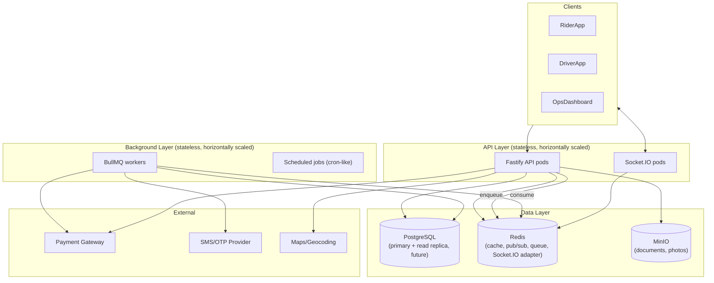

Every box in the API and Background layers is horizontally replicable — none holds unique local state. That single property is what makes Part 11 (Scalability) possible without a later rewrite.

#### Summary
The system overview's key structural property is that every compute component is stateless and horizontally replicable by design, not by later retrofit.

#### Best Practices
- Any new component added to this diagram should be evaluated against "can this run as 2+ replicas with no coordination problem?" before it's approved.

#### Common Mistakes
- Introducing a new component that assumes single-instance behavior (e.g. an in-memory rate limiter that only works correctly with exactly one API pod).

#### Production Checklist
- [ ] Every compute component in this diagram is verified to run correctly with 2+ replicas before launch

---

## 7. Monolith vs Modular Monolith vs Microservices

| | Monolith (unstructured) | Modular Monolith | Microservices |
|---|---|---|---|
| **What** | One codebase, one process, no enforced internal boundaries | One codebase, one (or few) deployable process(es), strict internal module boundaries | Many independently deployable services, each owning its own data |
| **Why consider** | Fastest to start | Discipline of microservices without operational overhead | Independent scaling/deployment per team/domain |
| **Benefits** | Simple to start | Single deploy, single transaction scope across modules, much lower ops burden, still enforces the module discipline microservices are praised for | Independent scaling, independent deploys, fault isolation between services |
| **Trade-offs** | Boundaries erode over time without discipline; becomes unmaintainable | Requires genuine engineering discipline (this handbook) to keep boundaries real | Massive operational overhead: service discovery, distributed transactions, network reliability, distributed tracing, multiple deploy pipelines |
| **Alternatives considered** | — | — | Full microservices from day one |
| **When to use** | Prototypes, throwaway scripts | A production system built by a small team that needs real structure without premature ops complexity — **this is Zaroorat today** | A large multi-team organization where independent deploy cadence outweighs the operational cost |
| **When not to use** | Any production system expected to last | N/A (this is the current choice) | A solo/small team without the platform engineering capacity to run it reliably |

**Decision matrix:**

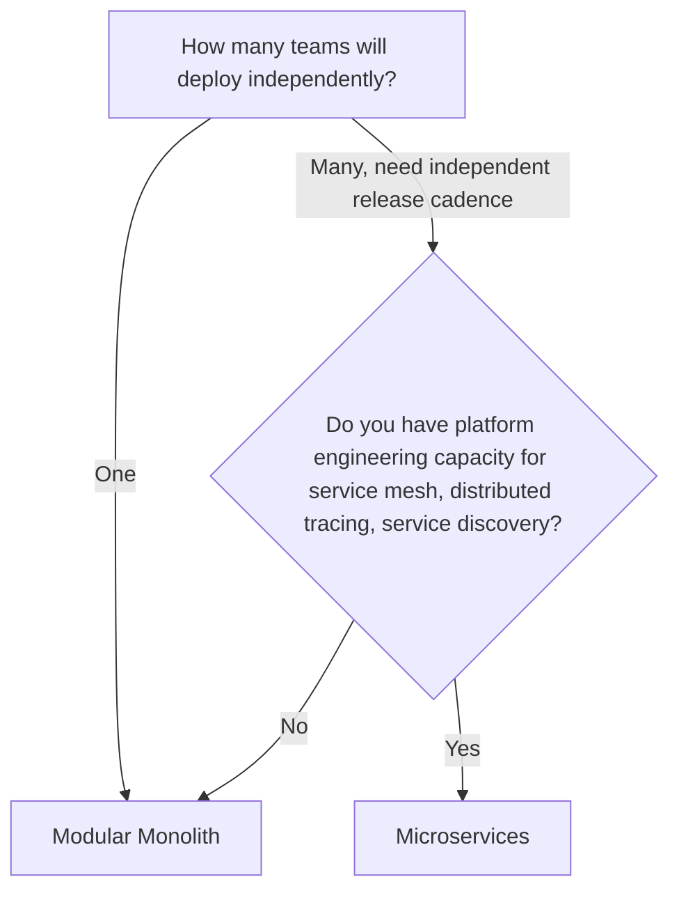

#### Summary
Zaroorat is a modular monolith because it gets the structural discipline microservices are praised for, without operational overhead a solo developer cannot sustain — this is a load-bearing decision for the whole handbook, not a placeholder.

#### Best Practices
- Enforce module boundaries (Part 4) with the same seriousness a microservices team would enforce network boundaries — that discipline is what keeps a future extraction to microservices possible at all.

#### Common Mistakes
- Choosing microservices prematurely "to do it right," then spending solo-developer time on service mesh and distributed tracing instead of shipping the core ride flow.
- Choosing a monolith and then *not* enforcing module boundaries, making a future extraction (if ever needed) far harder than either alternative.

#### Production Checklist
- [ ] No cross-module database access bypassing a service interface (verified against Volume 01 §9-11)

---

## 8. Why Modular Monolith First

Beyond the general case in §7, three Zaroorat-specific reasons:

1. **Transactional integrity across domains is common here** — a ride's creation, its initial pricing snapshot, and its status history often need to commit together. A modular monolith allows a real database transaction across these; microservices would require a distributed saga pattern for the same guarantee, which is strictly harder to get right and unnecessary at this scale.
2. **Team size is one.** Microservices' main benefit — independent deployment by independent teams — has no team to independently deploy for.
3. **The module boundaries this handbook enforces (Volume 01 §9-11) are extractable later.** If, at a future roadmap phase, `matching`/`dispatch` genuinely need independent scaling the rest of the system doesn't, that module's already-clean service interface makes an eventual extraction a bounded, well-defined project — not an archaeology exercise.

#### Summary
The modular monolith isn't a compromise — for Zaroorat's actual team size and transactional needs, it's the more correct choice, with a real path to change later if warranted.

#### Best Practices
- Treat every module's clean service interface as insurance on a future extraction option, whether or not that option is ever exercised.

#### Common Mistakes
- Assuming "modular monolith" means "microservices later, definitely" — it means "microservices remain possible later, if and when justified," which is a different, more honest claim.

#### Production Checklist
- [ ] Each module's public service interface (Volume 01 §11) is the only path other modules use to reach it — the precondition for §9's extraction option to remain real

---

## 9. Future Migration Strategy to Microservices

Kept intentionally brief — see the flag at the top of this document regarding Part 15's fuller "Future Evolution" discussion, and Volume 01 §6 (YAGNI).

**If** a specific module (most likely `matching`/`dispatch`, given their distinct latency/scaling profile from the rest of the system) genuinely needs independent scaling at a future roadmap phase, the extraction path is:
1. Confirm the module's service interface has no leaked internals (Volume 01 §9).
2. Stand up the module as a separate deployable, backed by its own database schema (or same DB, separate connection pool, as an interim step).
3. Replace in-process service calls with an HTTP/gRPC client implementing the same interface — callers don't change, only the implementation behind the interface.
4. Introduce distributed transaction handling (saga/outbox pattern) only for the specific cross-module transactional needs this extraction breaks.

This is a future option, not a current task. No infrastructure for it (service mesh, service discovery) is built today.

#### Summary
A concrete, bounded extraction path exists on paper, but nothing is built for it now — exactly the evolutionary-not-predictive principle from §5.

#### Best Practices
- Re-evaluate this chapter only when a real, measured scaling mismatch between modules is observed — not preemptively.

#### Common Mistakes
- Building placeholder infrastructure (a service mesh, a message bus) for this migration before any module has demonstrated the need.

#### Production Checklist
- [ ] No microservices-migration infrastructure exists in the codebase until a specific module's scaling mismatch is measured and documented

---

# Part 2 — Clean Architecture

## 10. Clean Architecture Overview

Clean Architecture's central idea: **business logic should not depend on frameworks, databases, or delivery mechanisms** — those are details, swappable in principle, while the business rules are the reason the system exists at all. Zaroorat adapts this into four conceptual layers mapped onto the concrete five-file-per-module structure from Volume 01 §12.

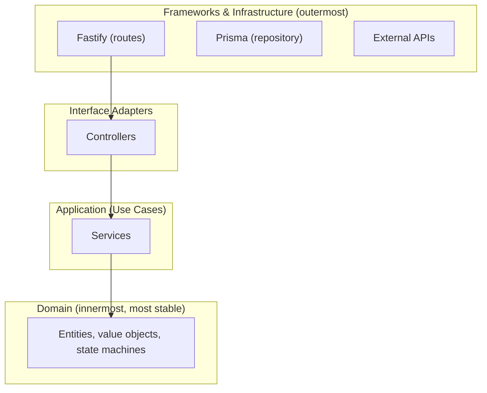

Dependencies point inward, toward Domain. Domain knows nothing about Fastify, Prisma, or HTTP.

#### Summary
Clean Architecture is one specific expression of Volume 01 §8's dependency rule — inward-pointing dependency, business logic isolated from delivery/infrastructure detail.

#### Best Practices
- Ask, for any new class: "if I deleted Fastify and Prisma entirely, would this class's code need to change?" If yes for a Domain-layer concept, something's leaked.

#### Common Mistakes
- Importing a Prisma type directly into a Domain-layer concept (e.g. a state machine function taking a raw Prisma `Ride` type instead of a plain domain type).

#### Production Checklist
- [ ] Domain-layer code (state machines, business rule functions) has zero imports from Prisma, Fastify, or Socket.IO

---

## 11. Layered Architecture

Mapping Clean Architecture's four conceptual layers onto Zaroorat's concrete files:

| Clean Architecture layer | Zaroorat file(s) | Contains |
|---|---|---|
| Domain | Plain TS types/functions within `service.ts` or a `domain/` subfolder for complex modules | Entities, value objects (e.g. `Money`, `Coordinates`), state machine logic |
| Application (Use Cases) | `service.ts` | Business operations, orchestration, transaction boundaries |
| Interface Adapters | `controller.ts`, `dto.ts` | Translating between HTTP shape and application-layer calls |
| Frameworks & Infrastructure | `routes.ts`, `repository.ts`, `schema.ts` | Fastify wiring, Prisma queries, Zod validation |

This is the same five-file structure from Volume 01 §12-13 — Clean Architecture here isn't a separate folder structure, it's the *reasoning* for why that structure looks the way it does.

#### Summary
Zaroorat's simple five-file module structure already implements Clean Architecture's layering — this chapter names the correspondence explicitly.

#### Best Practices
- For modules with genuinely complex domain logic (e.g. `pricing`'s surge calculation, `rides`' state machine), consider a dedicated `domain.ts` file to keep Domain-layer logic visibly separate from Application-layer orchestration in `service.ts`.

#### Common Mistakes
- Assuming Clean Architecture requires a much heavier folder structure than Zaroorat uses — it doesn't; the layering is conceptual, and five files can absolutely honor it.

#### Production Checklist
- [ ] Complex modules (`pricing`, `rides`, `matching`) have their domain logic identifiable as distinct from orchestration, even if not in a separate file

---

## 12. Domain Layer

Contains: entities (conceptual, not necessarily separate classes — e.g. what makes a `Ride` a `Ride`), value objects (`Money` — never a bare `number` for currency; `Coordinates` — never bare `lat`/`lng` floats passed around independently), and state machine transition logic (Volume 01 §22's decision tree applies architecturally here too — is this a business rule or infrastructure concern?).

```ts
// domain value object example — prevents currency bugs like adding paisa to rupees
class Money {
  private constructor(private readonly paisa: number) {}
  static fromRupees(amount: number) { return new Money(Math.round(amount * 100)); }
  add(other: Money) { return new Money(this.paisa + other.paisa); }
  toRupees() { return this.paisa / 100; }
}
```

#### Summary
The Domain layer is where business meaning lives in types, not just in comments or convention — a `Money` type prevents a whole class of currency bugs that a bare `number` cannot.

#### Best Practices
- Introduce a value object (`Money`, `Coordinates`, `PhoneNumber`) whenever a primitive type is used with domain-specific rules attached (currency precision, coordinate bounds, phone format).

#### Common Mistakes
- Passing raw floats for currency (fare amounts) through the system, leading to floating-point rounding bugs in payment calculations — a `Money` value object working in integer paisa avoids this entirely.

#### Production Checklist
- [ ] All currency values use a `Money`-style integer-backed value object, never a raw float, anywhere near `pricing` or `payments`

---

## 13. Application Layer

The Application layer is `service.ts` — it orchestrates Domain-layer rules and Infrastructure-layer calls (repository, external providers) to fulfill one specific use case per public method (Volume 01 §26). This is where transactions are opened, where domain events are emitted, where a use case like "cancel a ride" is expressed end-to-end.

#### Summary
The Application layer is the orchestrator — it doesn't contain business rules itself so much as it sequences Domain rules and Infrastructure calls to fulfill one use case.

#### Best Practices
- Name each public service method after a use case a real actor (§8, Volume 00) actually performs — `cancelRide`, not `updateRideStatus`.

#### Common Mistakes
- Business rule logic (e.g. "is this cancellation within the grace period?") implemented inline in the service method rather than delegated to a named Domain-layer function, making the rule harder to find and test independently.

#### Production Checklist
- [ ] Each service's public methods map 1:1 to the use cases listed in that module's `SPEC.md §11`

---

## 14. Infrastructure Layer

`repository.ts` (Prisma access), external provider clients (payment gateway, SMS, maps), Redis/BullMQ clients. This layer implements interfaces the Application layer depends on (Dependency Inversion, Volume 01 §3) — the Application layer never imports a concrete Prisma type or a specific gateway SDK directly into its own contract.

#### Summary
Infrastructure is the replaceable, detail-heavy outer layer — swappable in principle (a different payment gateway, a different ORM) without the Application layer's use-case logic changing.

#### Best Practices
- Keep all Prisma-specific error handling (unique constraint violations, connection errors) inside the repository, translated into domain-meaningful outcomes before reaching the service.

#### Common Mistakes
- A service method catching a raw `PrismaClientKnownRequestError` directly — this couples Application-layer logic to a specific ORM's error types.

#### Production Checklist
- [ ] No `Prisma.*` error type is caught or referenced outside `repository.ts` files

---

## 15. Presentation Layer

`routes.ts` and `controller.ts` — the outermost layer facing HTTP. Responsible for request/response shape only (Volume 01 §27-28), delegating everything else inward.

#### Summary
Presentation is a thin translation layer between the HTTP world and the Application layer's use cases — restates Volume 01 §27-28 in Clean Architecture terms.

#### Best Practices
- If the same use case needs to be triggered by both HTTP and, say, a scheduled job, the Application-layer service method should be identical either way — only the Presentation-layer caller differs.

#### Common Mistakes
- Duplicating business logic between an HTTP controller path and a queue job processor path that both need to "cancel a ride," instead of both calling the same service method.

#### Production Checklist
- [ ] Any use case triggered from more than one entry point (HTTP, queue job, scheduled task) calls the same underlying service method

---

## 16. Dependency Rule

Restates and grounds Volume 01 §11: **source code dependencies only point inward.** Domain knows nothing of Application; Application knows nothing of Infrastructure or Presentation; Infrastructure and Presentation depend on Application (and, transitively, Domain) — never the reverse.

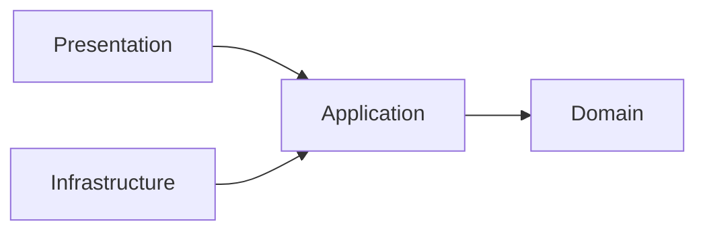

Note both Presentation and Infrastructure point inward toward Application — they don't depend on each other directly.

#### Summary
This is the one rule from which most of this volume's other rules (module boundaries, no direct Prisma-in-controller, etc.) are specific instances.

#### Best Practices
- When unsure whether a proposed import is legal, draw this diagram and check the arrow direction.

#### Common Mistakes
- `routes.ts` importing `repository.ts` directly "to save a controller call" — this both skips a layer (Volume 01 §11) and violates the dependency rule (Presentation should not depend on Infrastructure directly).

#### Production Checklist
- [ ] No import in the codebase points from Application/Domain toward Infrastructure/Presentation

---

## 17. Separation of Concerns

Each layer, each module, each function has one job — this is Volume 01 §3 (SRP) and §10 (Layer Responsibilities) applied at the architectural scale rather than the class scale. Concretely: parsing HTTP is not business logic; querying a database is not business logic; sending a notification is not the same concern as deciding a ride is complete.

#### Summary
Separation of Concerns is SRP scaled up from classes to layers and modules — the same underlying discipline at every zoom level.

#### Best Practices
- When a bug fix touches more than one layer's file for what should be a single-layer concern, treat that as a signal the concern wasn't separated correctly in the first place.

#### Common Mistakes
- A validation rule duplicated in both Zod schema (Presentation-adjacent) and service logic (Application) because it wasn't clear which layer owns it — usually a sign the rule needed to be a named Domain-layer function referenced from both.

#### Production Checklist
- [ ] Business validation rules exist in exactly one place (Domain/Application), referenced rather than duplicated at the Presentation boundary

---

## 18. Dependency Injection

Zaroorat uses **manual constructor injection** — no DI container/framework (e.g. InversifyJS, tsyringe).

| | Manual constructor injection | DI container framework |
|---|---|---|
| **What** | Pass dependencies explicitly as constructor arguments | A framework resolves and injects dependencies via decorators/reflection |
| **Why consider** | Simplicity, explicitness, no magic | Convenience at very large dependency graphs |
| **Benefits** | Zero framework dependency, dependencies are visible in the constructor signature, easy for both humans and Claude to trace | Less boilerplate wiring at massive scale |
| **Trade-offs** | More manual wiring code as the graph grows | Hides the dependency graph behind decorators/reflection, harder to trace statically |
| **Alternatives considered** | tsyringe, InversifyJS | — |
| **When to use** | Team size and module count where the dependency graph stays traceable by hand (Zaroorat, today) | A very large codebase where manual wiring has become its own maintenance burden |
| **When not to use** | N/A currently | A small-to-medium modular monolith where explicitness is more valuable than saved boilerplate |

```ts
// modules/rides/service.ts
export class RideService {
  constructor(
    private readonly rideRepository: RideRepository,
    private readonly pricingService: PricingService,
    private readonly eventEmitter: DomainEventEmitter,
  ) {}
}

// composition root — where everything is wired together, e.g. app.ts
const rideRepository = new RideRepository();
const pricingService = new PricingService(/* ... */);
const rideService = new RideService(rideRepository, pricingService, domainEventEmitter);
```

#### Summary
Dependencies are passed explicitly through constructors, wired once at a single composition root — no framework magic, maximally traceable for both humans and AI agents.

#### Best Practices
- Keep one clear "composition root" file/module where all wiring happens, so the full dependency graph is discoverable in one place.

#### Common Mistakes
- A service reaching for a singleton/global instance of another service instead of receiving it via constructor — this reintroduces hidden coupling DI is meant to prevent.

#### Production Checklist
- [ ] No module imports a singleton instance of another module's service directly — all cross-module service dependencies are constructor-injected from the composition root

---

## 19. Inversion of Control

IoC is the principle; DI (§18) is Zaroorat's specific mechanism for it. The Application layer defines the interfaces it needs (`PaymentProvider`, `NotificationSender` — Volume 01 §3); Infrastructure-layer classes implement them; control over *which* implementation is used is inverted to the composition root, not hardcoded inside the Application layer.

#### Summary
The Application layer says "I need something that can send a notification" (an interface); it never says "I need Twilio specifically" — that decision is made once, externally, at the composition root.

#### Best Practices
- Define the interface from the Application layer's point of view (what it needs), not from the Infrastructure implementation's point of view (what a specific SDK happens to offer).

#### Common Mistakes
- An interface that's really just a copy of a specific SDK's method signatures, which leaks that SDK's design decisions into the Application layer anyway, defeating the purpose of IoC.

#### Production Checklist
- [ ] Provider interfaces (`PaymentProvider`, `NotificationSender`, `MapsProvider`) are designed around Zaroorat's use cases, not around a specific vendor SDK's shape

---

# Part 3 — Request Lifecycle

## 20. Complete HTTP Request Flow

The canonical sequence every synchronous request follows — this diagram is the reference point for chapters 21–32, each of which zooms into one segment of it.

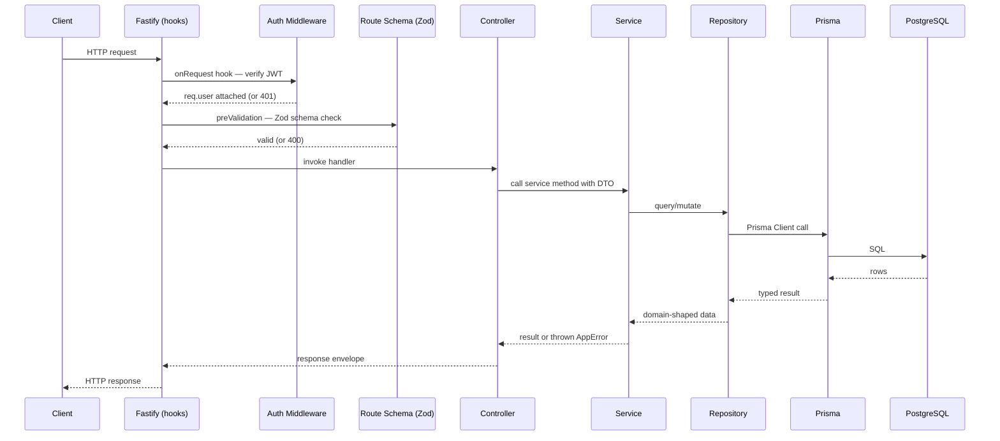

#### Summary
This single sequence diagram is the backbone reference for the entire Request Lifecycle part — every later chapter is a zoomed-in view of one arrow in this diagram.

#### Best Practices
- When debugging a request-path bug, locate which arrow in this diagram it corresponds to before diving into code — it usually narrows the search immediately.

#### Common Mistakes
- Skipping a step in this diagram in actual code (e.g. calling Prisma directly from a controller) — every skip is a specific rule violation named in Volume 01.

#### Production Checklist
- [ ] A new engineer (or AI agent) can trace any bug report to a specific step in this diagram within a minute of reading it

---

## 21. Fastify Lifecycle

Fastify's actual hook order, and what Zaroorat uses each for:

| Hook | Zaroorat usage |
|---|---|
| `onRequest` | Attach request ID, start request timer |
| `preParsing` | (rarely used) raw body handling for webhook signature verification |
| `preValidation` | Authentication (JWT verify) — must happen before schema validation touches `req.user`-dependent logic |
| `preValidation` (schema) | Zod schema validation of body/query/params |
| `preHandler` | Authorization (RBAC permission check), rate limiting |
| `handler` | Controller method |
| `preSerialization` | (rarely used) response shape adjustments |
| `onSend` | Structured response logging |
| `onResponse` | Metrics (latency, status code) recording |

#### Summary
Zaroorat's use of Fastify's hooks is deliberate and minimal — each hook has exactly one assigned responsibility, matching Volume 01 §10's "one job per layer" philosophy applied to framework mechanics.

#### Best Practices
- Keep hook usage centralized in `shared/middleware/` — don't scatter ad hoc hook registration per-route unless the concern is genuinely route-specific.

#### Common Mistakes
- Business logic accidentally implemented inside a Fastify hook (e.g. a `preHandler` that does more than authorize — it starts modifying request data), blurring the Presentation/Application boundary from §15-16.

#### Production Checklist
- [ ] No Fastify hook contains business logic beyond auth, validation, rate limiting, or observability concerns

---

## 22. Middleware Flow


Order matters: authentication before authorization (you can't check permissions for an unidentified caller), validation before authorization for most routes (malformed input should 400 before an authorization check even runs) — though for highly sensitive routes, consider authorizing before validating to avoid leaking information about valid input shapes to unauthorized callers.

#### Summary
Middleware order is a deliberate sequence, not an arbitrary registration order — each step depends on guarantees the previous step establishes.

#### Best Practices
- Document any deviation from this default order (e.g. authorize-before-validate for a specific sensitive route) explicitly in that route's code comment and the module's `SPEC.md`.

#### Common Mistakes
- Registering rate limiting after expensive work has already happened (e.g. after a database query), defeating its purpose of protecting the system from abuse.

#### Production Checklist
- [ ] Rate limiting middleware runs before any database or external API call in the request path

---

## 23. Authentication Flow

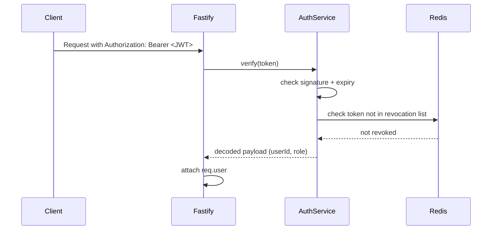

Refresh token rotation (detail in Part 10) means a compromised access token has a short blast radius (short expiry), while the refresh token itself is single-use and rotated on every use, detectable if replayed.

#### Summary
Authentication verifies identity via a short-lived JWT, checked against a lightweight Redis revocation list for immediate invalidation capability (logout, suspension) despite JWTs being technically stateless.

#### Best Practices
- Keep access token expiry short (minutes, not hours) precisely because JWTs can't be un-issued — the revocation list is a safety net, not the primary defense.

#### Common Mistakes
- Skipping the revocation check "since JWTs are stateless anyway," which means a suspended user's still-valid token keeps working until natural expiry.

#### Production Checklist
- [ ] Suspending a user account immediately adds their active tokens to the Redis revocation list, not just prevents future logins

---

## 24. Authorization Flow

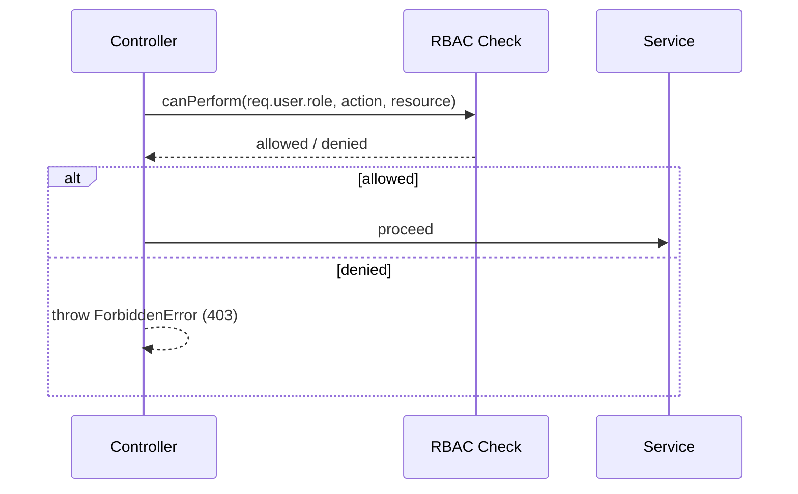

Restates Volume 01 §39: authorization is enforced at the service layer for state-mutating operations (not just at the route/controller level), since a service method might be called from more than one entry point (§15).

#### Summary
Authorization checks who can do what, layered both at the route (coarse: "is this role allowed to hit this endpoint at all") and the service (fine: "can this specific user cancel this specific ride").

#### Best Practices
- Implement resource-level authorization checks (e.g. "is this rider the owner of this specific ride?") in the service layer, not just role-level checks at the route.

#### Common Mistakes
- Checking only that a caller has the `rider` role, without checking that they're *the specific rider* who owns the ride they're trying to cancel — a classic broken-object-level-authorization (BOLA) vulnerability.

#### Production Checklist
- [ ] Every resource-scoped mutation checks ownership/permission at the resource level, not just the role level

---

## 25. Validation Flow

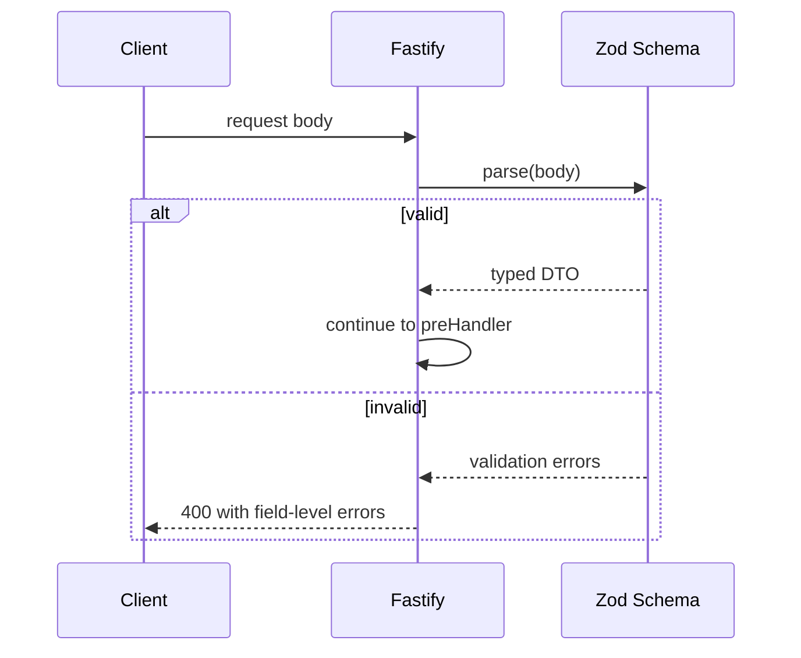

Restates Volume 01 §24. Validation happens once, at the boundary, and produces a typed DTO that the rest of the request lifecycle trusts completely — no re-validation of the same data deeper in the call stack.

#### Summary
Validation is a single gate at the Presentation boundary; everything past it operates on already-trusted, already-typed data.

#### Best Practices
- Return field-level validation errors (not just a generic "invalid request") so client apps can highlight the specific problem field.

#### Common Mistakes
- Re-validating the same input deeper in the service layer "just in case," which usually signals the boundary validation isn't trusted or isn't actually comprehensive.

#### Production Checklist
- [ ] Every route's Zod schema is comprehensive enough that no duplicate re-validation exists in the service layer for the same fields

---

## 26. Controller Flow

Restates Volume 01 §27 architecturally: the controller is the Interface Adapter (§10) converting an already-validated, already-authenticated HTTP request into exactly one Application-layer (service) call, then converting the result back into the response envelope (Volume 01 §30).

#### Summary
The controller's entire job, architecturally, is translation at the Presentation/Application boundary — nothing more.

#### Best Practices
- If a controller needs to call more than one service method to fulfill a single request, consider whether that's actually one use case that belongs as a single service method instead.

#### Common Mistakes
- A controller orchestrating calls to two different services and combining results itself — this orchestration is Application-layer work that's leaked into Presentation.

#### Production Checklist
- [ ] No controller method calls more than one service method, unless that composition is itself trivial response-shaping rather than business orchestration

---

## 27. Service Flow

Restates Volume 01 §26 architecturally: the Application layer executes one use case — validating business rules (calling into Domain-layer logic, §12), coordinating one or more repository calls (often within a transaction), emitting domain events, and returning a result or throwing a typed `AppError`.

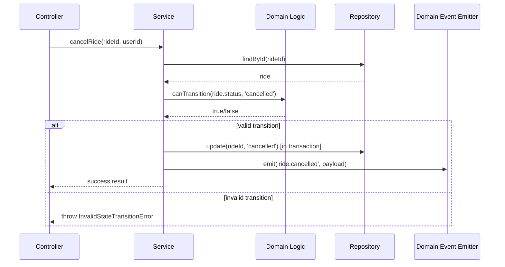

#### Summary
The service method is the single place a full use case is expressed end-to-end — rule check, persistence, event emission, all visible in one method.

#### Best Practices
- Keep domain rule checks (like a state transition check) as separately named, testable functions rather than inlined conditionals inside the service method.

#### Common Mistakes
- Emitting a domain event before the transaction that produced it has committed — a subscriber could act on a change that then fails to persist.

#### Production Checklist
- [ ] Domain events are emitted only after their triggering transaction has successfully committed

---

## 28. Repository Flow

Restates Volume 01 §25 architecturally: the repository is the Infrastructure-layer implementation of a data-access contract the Application layer depends on. It translates between Prisma's shape and the Domain/Application layer's expected shape, and it's the only place Prisma-specific error handling occurs (§14).

#### Summary
The repository exists specifically so that the Application layer never has to know Prisma exists.

#### Best Practices
- Return plain domain-shaped objects from repository methods, not Prisma's generated types directly, even when they look identical today (protects against future divergence, per Volume 01 §19).

#### Common Mistakes
- A service method that imports a Prisma-generated type to type its own variables — a subtle Infrastructure-layer leak into the Application layer.

#### Production Checklist
- [ ] No `import { ... } from '@prisma/client'` appears outside `repository.ts` files (except for the transaction client type, which is an accepted, narrow exception for transaction-passing per Volume 01 §25)

---

## 29. Prisma Flow

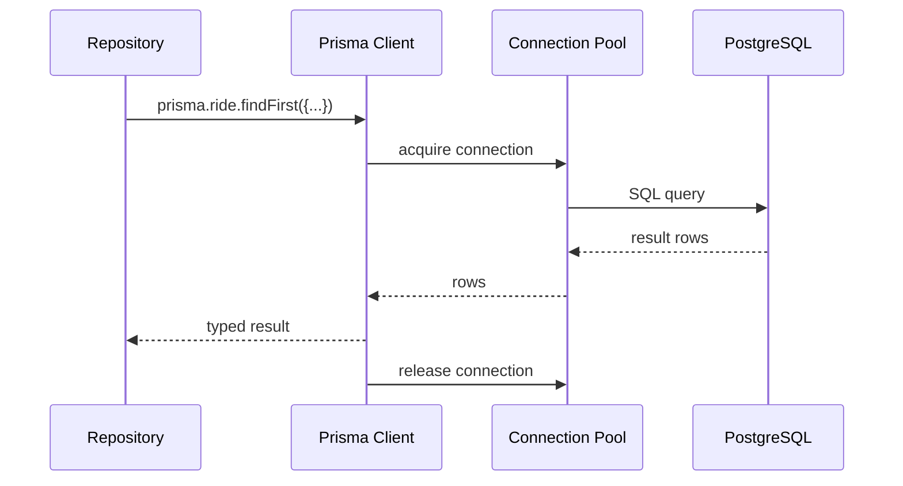

Prisma Client is a singleton per process (instantiated once, reused across requests) — never instantiated per-request, which would exhaust the connection pool under load.

#### Summary
Prisma Client sits between the repository and the actual database connection pool — understanding this flow explains why Prisma Client lifecycle (singleton) matters for connection pool health.

#### Best Practices
- Instantiate exactly one `PrismaClient` per process, exported from a shared module, imported everywhere it's needed.

#### Common Mistakes
- Creating a `new PrismaClient()` inside a function or per-request, which creates a new connection pool each time and will exhaust database connections under any real load.

#### Production Checklist
- [ ] Exactly one `PrismaClient` instance exists per process (verified via a shared singleton module)

---

## 30. Database Flow

Covers connection pooling and transaction scope architecturally (deep-dive in Part 9). Key architectural point: connection pool size must be considered relative to the number of API/worker pod replicas — `pool_size × replica_count` must stay under PostgreSQL's `max_connections`, or a scaling event (adding pods under load) can itself cause a database outage.

#### Summary
Connection pooling is a scaling-sensitive parameter, not a fixed default — it must be recalculated whenever replica count changes.

#### Best Practices
- Use a connection pooler (e.g. PgBouncer) between the application and PostgreSQL once replica count grows, to decouple application-level pool size from PostgreSQL's actual connection limit.

#### Common Mistakes
- Scaling API pods horizontally under load without checking that the aggregate connection pool demand still fits under PostgreSQL's `max_connections` — the "fix" for one bottleneck causes a new outage.

#### Production Checklist
- [ ] Documented formula/check: (pool size per pod) × (max replica count) < PostgreSQL `max_connections`, with headroom

---

## 31. Response Flow

The controller builds the standard envelope (Volume 01 §30) from the service's result; the global error handler builds it from any thrown `AppError` (§32). This is the only place response JSON shape is constructed — no module improvises its own shape.

#### Summary
Response construction is centralized enough that the envelope shape (Volume 01 §5 in `CODING_STANDARDS.md`) is structurally guaranteed, not just conventionally followed.

#### Best Practices
- Consider a small shared `buildSuccessResponse(data, meta)` / `buildErrorResponse(error)` helper used by every controller and the global error handler, so the envelope shape is enforced by code, not just convention.

#### Common Mistakes
- Each controller hand-constructing the envelope object literal independently, which drifts in small ways (missing `meta.requestId`, inconsistent field ordering/casing) across modules over time.

#### Production Checklist
- [ ] A shared response-building helper exists and is used by all controllers, rather than ad hoc object literals per route

---

## 32. Error Flow

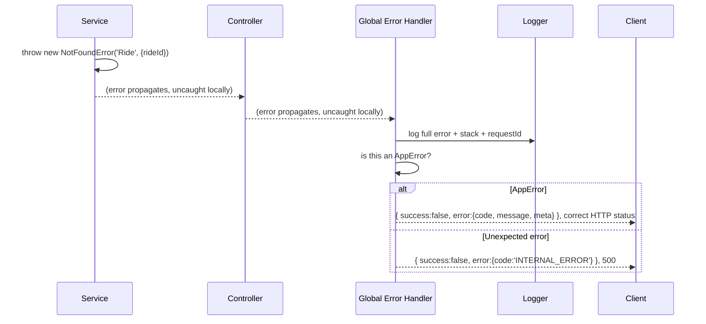

Restates Volume 01 §22 with the full path visualized: errors are *allowed* to propagate uncaught through controller and service — that's correct, not a bug — because exactly one place (the global handler) is responsible for turning any error into a client-safe response.

#### Summary
Letting errors propagate uncaught until the single global handler is the intended design, not an oversight — it guarantees one consistent place decides what a client ever sees.

#### Best Practices
- Resist the urge to add local `try/catch` blocks "just to be safe" in controllers or services unless there's a specific recovery action to take at that point (e.g. a retry) — otherwise, let it propagate.

#### Common Mistakes
- A local `try/catch` in a controller that catches everything and returns a generic 500 itself, bypassing the global handler's structured `AppError`-to-status-code mapping and losing the specific error code/status a `NotFoundError` should produce.

#### Production Checklist
- [ ] No controller or service has a blanket `catch` that suppresses the global error handler's mapping behavior

---

## Change Log

| Date | Change |
|---|---|
| (start) | Parts 1–3 (Ch. 1–32) delivered. Parts 4–15 (Ch. 33–126) pending. |
