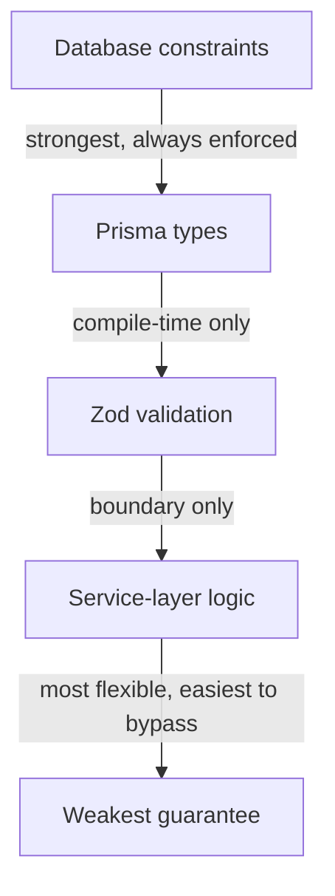
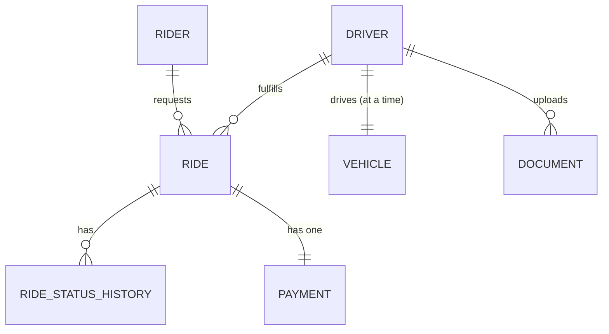

# Zaroorat Engineering Handbook

## Volume 03 — Database Engineering Handbook

|                                     |                                                                                                                                                                                                                                                                            |
| ----------------------------------- | -------------------------------------------------------------------------------------------------------------------------------------------------------------------------------------------------------------------------------------------------------------------------- |
| **Status**                          | In progress — delivered in parts                                                                                                                                                                                                                                           |
| **Delivered so far**                | Part 1 — Database Philosophy (Ch. 1–10), Part 2 — Data Modeling (Ch. 11–22), Part 3 — Schema Standards (Ch. 23–36)                                                                                                                                                         |
| **Pending**                         | Parts 4–12 + Appendix (Ch. 37–115) — delivered in follow-up turns                                                                                                                                                                                                          |
| **Relationship to other documents** | `DATABASE_CONVENTIONS.md` is the short, enforceable quick-reference Claude Code reads first. This volume is the deep reasoning behind it. Volume 02 Part 9 (Database Architecture, not yet built) will cross-reference this volume rather than re-explain the same ground. |

---

# Part 1 — Database Philosophy

## 1. Database Design Philosophy

The database is the part of Zaroorat hardest to change after the fact — a bad API design can be versioned around (Volume 01 §43), but a bad schema decision (wrong data type for money, missing a constraint that should have prevented bad data) can mean live production data that's already wrong, which is far more expensive to fix than code. Database design here is therefore deliberately **conservative**: prefer the boring, well-understood pattern; make illegal states unrepresentable at the schema level (constraints, not just application checks); change schema in small, reversible steps (Part 5).

#### Summary

Database changes are treated as higher-stakes than most code changes, because bad data outlives bad code.

#### Best Practices

- Push correctness into the schema (constraints, foreign keys, `NOT NULL`) wherever possible, rather than relying solely on application-layer validation that a future code path might forget to run.

#### Common Mistakes

- Treating a missing database constraint as acceptable because "the application already validates it" — application code changes and has bugs; a database constraint is a second, independent guarantee.

#### Production Checklist

- [ ] Every business rule from `VOLUME_00 §4` that can be expressed as a database constraint, is

---

## 2. Relational Database Principles

Zaroorat's domain — riders, drivers, rides, payments — is inherently relational: entities with clear identity, related to each other in well-defined ways, requiring transactional consistency across those relationships (a ride and its payment must agree). A relational database enforces these relationships and consistency guarantees natively; a document/NoSQL model would require reimplementing them in application code.

#### Summary

The relational model isn't a legacy default here — it's the correct fit for data whose relationships and consistency guarantees are as important as the data itself.

#### Best Practices

- Model relationships explicitly with foreign keys, not just by convention (e.g. a `driverId` string field with no actual foreign key constraint).

#### Common Mistakes

- Storing a relationship as a loosely-typed reference (e.g. a JSON blob containing "related IDs") instead of a proper foreign key, losing referential integrity guarantees.

#### Production Checklist

- [ ] Every relationship between entities has a real foreign key constraint, not just an implied one

---

## 3. PostgreSQL Overview

Key properties relevant to Zaroorat's use of it: full ACID compliance (Part 8), MVCC (readers don't block writers), rich constraint support (`CHECK`, unique, foreign key), native JSON/JSONB for the rare cases semi-structured data is genuinely appropriate (§36), and mature extensions (PostGIS for the geospatial matching problem flagged in `DATABASE_CONVENTIONS.md §5`).

#### Summary

PostgreSQL's feature set directly covers Zaroorat's actual needs — strong consistency, rich constraints, and a credible geospatial extension path — without needing a second specialized database.

#### Best Practices

- Reach for a PostgreSQL extension (PostGIS, `pg_trgm` for fuzzy search) before reaching for an entirely separate specialized database, given the operational cost of running more than one data store (Volume 00 §23 solo-developer constraint).

#### Common Mistakes

- Assuming PostgreSQL "can't do" geospatial or full-text search well and reaching for a separate service prematurely, before checking what PostGIS/`pg_trgm`/native full-text search actually offer.

#### Production Checklist

- [ ] Any proposed additional data store is justified against what a PostgreSQL extension could already provide

---

## 4. Why PostgreSQL

|                             | PostgreSQL                                                                     | MongoDB                                                                             | MySQL                                                                               |
| --------------------------- | ------------------------------------------------------------------------------ | ----------------------------------------------------------------------------------- | ----------------------------------------------------------------------------------- |
| **What**                    | Relational, ACID-compliant, extensible                                         | Document-oriented, flexible schema                                                  | Relational, ACID-compliant                                                          |
| **Why consider**            | Strong consistency for financial/relational data                               | Schema flexibility for rapidly-changing shapes                                      | Widely used, simpler feature set                                                    |
| **Benefits**                | Rich constraints, mature extensions (PostGIS), strong transactional guarantees | Fast iteration when shape is genuinely unknown/varying                              | Familiar, broad hosting support                                                     |
| **Trade-offs**              | Requires upfront schema thought                                                | Weaker consistency guarantees by default; relationships modeled in application code | Historically weaker JSON/geospatial support than Postgres                           |
| **Alternatives considered** | MongoDB, MySQL                                                                 | PostgreSQL, MySQL                                                                   | PostgreSQL, MongoDB                                                                 |
| **When to use**             | Relational, consistency-critical domains — **Zaroorat's actual shape**         | Content with genuinely variable, document-shaped data (not the case here)           | A team with deep existing MySQL operational expertise and no Postgres-specific need |
| **When not to use**         | N/A — this is the choice                                                       | Financial/relational data requiring strong consistency and joins                    | When PostGIS-quality geospatial or advanced JSON support is needed                  |

#### Summary

Ride-hailing data — rides, payments, drivers, relationships between them — is exactly the shape relational databases with strong consistency guarantees are built for; document databases would require re-implementing joins and consistency in the application layer.

#### Best Practices

- Revisit this decision only if a specific, measured need (not a hypothetical one) for MongoDB-style flexibility emerges for a narrow use case — and even then, consider a JSONB column (§36) before a second database.

#### Common Mistakes

- Choosing a document database early because "it's more flexible," then rebuilding referential integrity and transactional guarantees manually in application code — strictly more work than PostgreSQL provides for free.

#### Production Checklist

- [ ] This decision is not revisited without a specific, documented, measured need

---

## 5. Why Prisma

|                             | Prisma                                                                                                         | TypeORM                                                                                                         | Drizzle                                                                                       | Raw SQL / Knex                                                                                                                                |
| --------------------------- | -------------------------------------------------------------------------------------------------------------- | --------------------------------------------------------------------------------------------------------------- | --------------------------------------------------------------------------------------------- | --------------------------------------------------------------------------------------------------------------------------------------------- |
| **What**                    | Type-safe query builder + migration tool with generated client                                                 | Decorator-based ORM, active-record and data-mapper patterns                                                     | Lightweight, SQL-like type-safe query builder                                                 | Direct SQL or a thin query builder                                                                                                            |
| **Benefits**                | Excellent TypeScript inference, mature migration tooling, large community                                      | Familiar to Java/C#-background engineers, flexible patterns                                                     | Very close to SQL, minimal abstraction overhead, fast                                         | Full control, no abstraction overhead                                                                                                         |
| **Trade-offs**              | Some abstraction over raw SQL; less control over exact generated queries in edge cases                         | Active-record pattern encourages business logic creeping into entities (violates Volume 02 §12-14 layering)     | Less mature migration tooling at time of writing                                              | No type safety without extra tooling; more boilerplate; easier to make SQL injection mistakes without discipline                              |
| **Alternatives considered** | TypeORM, Drizzle, Knex                                                                                         | Prisma, Drizzle                                                                                                 | Prisma, TypeORM                                                                               | Prisma, TypeORM                                                                                                                               |
| **When to use**             | Team wants strong type inference and mature migration tooling without hand-writing SQL — **Zaroorat's choice** | Team already has deep Angular/NestJS-style decorator familiarity                                                | Team wants closer-to-SQL control with type safety and is comfortable with a younger ecosystem | Extremely performance-critical queries where even Prisma's generated SQL isn't acceptable (rare; use `$queryRaw` within Prisma instead first) |
| **When not to use**         | N/A — this is the choice                                                                                       | When active-record's business-logic-in-entity pattern would violate this handbook's layering (Volume 02 §12-17) | When migration tooling maturity matters more than SQL-closeness                               | When type safety matters and hand-rolled SQL risk (injection, drift from types) isn't worth the control                                       |

#### Summary

Prisma's migration tooling and type inference reduce a whole category of runtime bugs (mismatched types between schema and code) at a cost most projects at Zaroorat's stage are happy to pay.

#### Best Practices

- Use Prisma's `$queryRaw`/`$executeRaw` (parameterized, never string-concatenated) for the rare query Prisma's query builder can't express well — don't abandon Prisma wholesale for one hard query.

#### Common Mistakes

- Dropping to raw SQL via string concatenation instead of Prisma's parameterized raw query methods, reintroducing SQL injection risk that Prisma otherwise prevents by default.

#### Production Checklist

- [ ] Any use of `$queryRaw`/`$executeRaw` uses parameterized template literals, never string concatenation

---

## 6. Database Goals

Restates `VOLUME_00 §6` and `VOLUME_02 §2-3` from the database's specific angle: correctness (money/state never silently wrong), availability (99.9%, Volume 00 §6), and change-safety (schema evolves without downtime, Part 5).

#### Summary

The database's goals are inherited directly from the product's non-functional requirements, not set independently.

#### Best Practices

- When a database design choice is proposed, trace it back to one of these three goals explicitly.

#### Common Mistakes

- Optimizing schema design for a goal not in this list (e.g. theoretical maximum write throughput) at the expense of correctness or change-safety.

#### Production Checklist

- [ ] Schema design decisions are traceable to correctness, availability, or change-safety

---

## 7. Scalability Goals

Restates `VOLUME_02 §89-96` (Scalability, once built) from the database angle: read replicas once read load (dashboards, analytics) meaningfully competes with write load; connection pooling sized relative to replica count (`VOLUME_02 §30`); partitioning (Part 7) considered only once a specific table's size/query pattern demonstrably needs it.

#### Summary

Database scalability is planned for headroom (Volume 02 §6 — 10x launch estimate) without building infrastructure (partitioning, read replicas) before it's needed.

#### Best Practices

- Track table growth rate for `rides` and `payments` specifically (the highest-write-volume tables) as an early warning signal for when Part 7's partitioning chapter becomes relevant.

#### Common Mistakes

- Partitioning a table preemptively before it has enough rows for partitioning to matter, adding query complexity for no current benefit (YAGNI, Volume 01 §6).

#### Production Checklist

- [ ] Table growth rate for `rides` and `payments` is monitored from launch, even before any scaling action is needed

---

## 8. Reliability Goals

Data, once committed, must not be silently lost or corrupted. Mechanisms: PostgreSQL's WAL (write-ahead log) for crash recovery, transactions for atomicity (Part 8), automated backups with tested restores (Part 10).

#### Summary

Reliability here means "a committed transaction's data survives a crash" — a baseline PostgreSQL provides, that must be operationally verified (backup/restore testing), not just assumed.

#### Best Practices

- Test a real restore from backup at least once before launch — an untested backup is a hope, not a guarantee (Part 10).

#### Common Mistakes

- Assuming automated backups are working because a cron job "runs successfully" without ever performing a test restore to confirm the backup is actually usable.

#### Production Checklist

- [ ] At least one full restore-from-backup has been performed and verified before go-live

---

## 9. Availability Goals

99.9% target (Volume 00 §6) applies to the database as the most likely single point of failure in the current architecture (Volume 02 §6 — one PostgreSQL instance at launch). Mitigations: automated failover consideration for post-launch (managed PostgreSQL offerings typically provide this), health checks (Volume 02 Part 12, once built) informing Kubernetes readiness probes.

#### Summary

At launch, the database is a single point of failure by design (Volume 00 §23 constraint) — this is an accepted, documented trade-off, not an oversight.

#### Best Practices

- Choose a managed PostgreSQL offering with automated failover/backup if the operational burden of self-managing HA PostgreSQL isn't justified yet by team size (Volume 00 §23).

#### Common Mistakes

- Self-managing a multi-node PostgreSQL HA setup before the team has the operational capacity to run it reliably — a misconfigured HA setup can be less reliable than a well-managed single instance.

#### Production Checklist

- [ ] Database hosting decision (self-managed vs. managed) explicitly weighed against team's operational capacity, not defaulted to either extreme

---

## 10. Data Integrity Principles

Four layers of integrity enforcement, from strongest to weakest guarantee: (1) database constraints (`NOT NULL`, `CHECK`, foreign key, unique) — cannot be bypassed by any code path, including a future bug; (2) Prisma schema types — caught at compile time, but only within Prisma-mediated code paths; (3) Zod validation — catches bad external input, but only at the boundary; (4) service-layer business logic — the most flexible, but also the easiest to accidentally bypass (a new code path that forgets to call it).



#### Summary

Push integrity guarantees as far left (toward the database) as they can reasonably go — the further right, the easier it is for a future code change to accidentally bypass the check.

#### Best Practices

- For any rule that's genuinely a hard invariant (a rating between 1-5, a foreign key that must exist), enforce it at the database level even if it's also checked in Zod/service code — belt and suspenders, cheaply.

#### Common Mistakes

- Relying solely on service-layer validation for a rule that could be a database constraint, only to have a future direct-database script or a forgotten code path violate it.

#### Production Checklist

- [ ] Every `[HARD]` business rule (`VOLUME_00 §4`) has at least an attempt at database-level enforcement, not just application-level

---

# Part 2 — Data Modeling

## 11. Entity Design

An entity has identity that persists across changes to its attributes — a `Ride` is the same ride even after its status changes. Contrast with a value object (§18), which has no identity — two `Money` instances of ₹100 are interchangeable. Every table in `schema.prisma` should be clearly one or the other in the engineer's mental model, even though Prisma represents both as "models."

#### Summary

Identity is the deciding question for entity design: does this thing's "sameness" persist through change, or is it fully defined by its current values?

#### Best Practices

- When designing a new table, explicitly ask "what's the identity here?" before deciding on columns — it clarifies what a primary key even means for this concept.

#### Common Mistakes

- Modeling something that's really a value (e.g. an address used only as a snapshot on a ride) as a full entity with its own lifecycle and foreign keys, adding unnecessary complexity.

#### Production Checklist

- [ ] Each new table's `SPEC.md` entry states whether it's an entity or effectively a value object stored relationally

---

## 12. Relationships



Relationships are always expressed as real foreign keys (§28), never as loosely-typed reference fields.

#### Summary

This ER diagram is the master reference for how Zaroorat's core entities relate — expanded per-module in each module's `SPEC.md §4-5`.

#### Best Practices

- Keep this diagram updated as new modules are specced — it should always reflect the actual current schema, not an aspirational one.

#### Common Mistakes

- Letting this diagram drift from the real `schema.prisma` as modules evolve independently.

#### Production Checklist

- [ ] This diagram is reviewed and updated whenever a new core relationship is added to `schema.prisma`

---

## 13. One-to-One

Example: `Driver` ↔ `DriverBankDetails`. Modeled as a foreign key on the "dependent" side with a unique constraint, not a merged table — keeps `DriverBankDetails` (sensitive, less frequently accessed) separable for access-control and encryption purposes (Part 9) from `Driver`'s general profile data.

```prisma
model DriverBankDetails {
  id       String @id @default(cuid())
  driverId String @unique @map("driver_id")
  driver   Driver @relation(fields: [driverId], references: [id])
}
```

#### Summary

One-to-one relationships are kept as separate tables (not merged) when the two halves have different access patterns or sensitivity levels.

#### Best Practices

- Use a one-to-one split specifically to isolate sensitive data (bank details, KYC documents) that needs stricter access control than the parent entity's general fields.

#### Common Mistakes

- Merging a one-to-one relationship into a single wide table purely "for simplicity," losing the ability to apply different access rules to the sensitive half.

#### Production Checklist

- [ ] Any one-to-one relationship involving sensitive data (bank details, government ID numbers) is a separate table with its own access control

---

## 14. One-to-Many

Example: `Rider` → `Ride` (a rider has many rides). Modeled as a foreign key on the "many" side (`Ride.riderId`). This is the most common relationship shape in Zaroorat's schema.

#### Summary

The standard, most common relationship — a foreign key on the child table pointing to the parent.

#### Best Practices

- Index the foreign key column on the "many" side by default (`DATABASE_CONVENTIONS.md §5`) — it's almost always queried ("all rides for this rider").

#### Common Mistakes

- Forgetting the index on a one-to-many foreign key, causing a full table scan once the "many" side grows large.

#### Production Checklist

- [ ] Every one-to-many foreign key column has an index

---

## 15. Many-to-Many

Example: `Promotion` ↔ `Rider` (a rider can redeem many promotions; a promotion can be redeemed by many riders). Modeled with an explicit join table (`PromotionRedemption`), never Prisma's implicit many-to-many (which hides the relationship's own attributes, like redemption timestamp, and doesn't fit Zaroorat's soft-delete/audit conventions).

```prisma
model PromotionRedemption {
  id          String   @id @default(cuid())
  promotionId String   @map("promotion_id")
  riderId     String   @map("rider_id")
  redeemedAt  DateTime @default(now()) @map("redeemed_at")

  promotion Promotion @relation(fields: [promotionId], references: [id])
  rider     Rider     @relation(fields: [riderId], references: [id])

  @@unique([promotionId, riderId])
  @@map("promotion_redemptions")
}
```

#### Summary

Many-to-many relationships are always explicit join tables — this is a deliberate, standing exception to using Prisma's implicit many-to-many convenience feature.

#### Best Practices

- Add a unique constraint on the join table's foreign key pair when the relationship should be at-most-once (e.g. a rider redeeming the same promo code twice).

#### Common Mistakes

- Using Prisma's implicit many-to-many for a relationship that later needs its own attributes (a redemption timestamp, a redemption amount), forcing a painful migration to an explicit join table.

#### Production Checklist

- [ ] No implicit Prisma many-to-many relationships exist in `schema.prisma` — all are explicit join tables

---

## 16. Weak Entities

An entity that cannot exist without its parent — `RideStatusHistory` has no meaning without a `Ride`. Modeled with a mandatory (non-nullable) foreign key and, typically, cascading behavior considered carefully (§34 — cascading deletes are generally avoided in favor of soft delete propagation).

#### Summary

A weak entity's existence is entirely dependent on its parent — this dependency should be enforced with a non-nullable foreign key, never an optional one.

#### Best Practices

- Model the weak entity's foreign key as required (`String`, not `String?`), since a null parent reference would be a data integrity bug for these cases.

#### Common Mistakes

- Making a weak entity's parent foreign key nullable "just in case," which allows orphaned rows that shouldn't be possible to exist.

#### Production Checklist

- [ ] Weak entity foreign keys (e.g. `RideStatusHistory.rideId`) are non-nullable

---

## 17. Aggregate Roots

Borrowed from Domain-Driven Design: an aggregate root (`Ride`) is the only entry point for modifying its dependent weak entities (`RideStatusHistory`). No other module writes `RideStatusHistory` directly — only `RideService`, through methods that also update `Ride` itself, keeping them consistent.

#### Summary

The aggregate root pattern is how Zaroorat prevents a dependent table's data from drifting out of sync with its parent — all writes go through one owning service.

#### Best Practices

- Identify the aggregate root explicitly in a module's `SPEC.md` when it owns weak entities, and restrict write access to that root's service only (Volume 01 §9-11 module boundary rules apply at the sub-module level here too).

#### Common Mistakes

- Another module writing directly to a weak entity table (e.g. `analytics` inserting into `RideStatusHistory` for convenience) instead of going through `RideService`, risking the two tables drifting inconsistent.

#### Production Checklist

- [ ] Only the aggregate root's own service writes to its weak entity tables

---

## 18. Value Objects

Restates `VOLUME_02 §12` from the database's storage angle: `Money` is stored as an integer (paisa), never a float; `Coordinates` is stored as two float columns (or a PostGIS `POINT` once that extension is adopted, per `DATABASE_CONVENTIONS.md §5`) — never as a bare, unstructured string.

#### Summary

Value objects at the application layer correspond to specific, deliberate column type choices at the database layer — not left to whatever type felt convenient.

#### Best Practices

- Store currency as an integer subunit (paisa) column, always, with the application layer's `Money` value object doing the conversion at the boundary.

#### Common Mistakes

- Storing a fare amount as a PostgreSQL `float`/`double precision` column, introducing the exact rounding bugs `Money` (Volume 02 §12) exists to prevent — the database-layer type choice can undo an application-layer safeguard.

#### Production Checklist

- [ ] No currency column anywhere in `schema.prisma` uses a floating-point type

---

## 19. Domain Modeling

The process: start from the module's `SPEC.md §3 Business Rules`, identify the entities and relationships those rules imply, then design tables — never the reverse (designing tables first and retrofitting business rules to fit).

#### Summary

Schema design is downstream of business rules, not the other way around — restates the "spec before code" philosophy (Volume 00 §15) specifically for the database layer.

#### Best Practices

- Draft the module's business rules (Volume 00 §4 pattern) and state machine (if any) before drawing the ER diagram for that module.

#### Common Mistakes

- Designing a "reasonable-looking" generic schema early, then discovering it can't cleanly express an actual business rule discovered later, requiring a painful migration.

#### Production Checklist

- [ ] Every module's schema design in `SPEC.md §4-5` is demonstrably derived from its `§3 Business Rules`, not designed independently

---

## 20. Normalization

Default to at least 3NF (third normal form): every non-key column depends on the key, the whole key, and nothing but the key. Example: `Ride` doesn't store `riderPhoneNumber` directly — it stores `riderId` and looks up the phone number via `Rider`, avoiding update anomalies (a rider changing their phone number would otherwise require updating every historical ride row).

#### Summary

Normalization prevents update anomalies — the same fact stored in two places that can drift inconsistent when one is updated and the other is forgotten.

#### Best Practices

- Default every new table to 3NF; only denormalize (§21) with an explicit, documented reason.

#### Common Mistakes

- Storing a frequently-changing attribute (like a driver's current rating) redundantly on every historical ride row "for query convenience," creating exactly the update-anomaly problem normalization prevents.

#### Production Checklist

- [ ] New tables are reviewed for 3NF compliance before migration; deviations require the explicit denormalization justification from §21

---

## 21. Denormalization

Justified when: (a) the duplicated data represents a historical fact that should NOT change even if the source does (e.g. `Ride.fareAtBooking` should stay frozen even if `pricing` rules change later), or (b) a measured, specific query performance problem exists that normalized joins can't solve at acceptable latency (Part 7 gate).

#### Summary

Denormalization is an intentional, documented exception — snapshotting historical facts is the most common legitimate reason in Zaroorat's domain, not performance (which should be handled via indexing/caching first, Part 7).

#### Best Practices

- When denormalizing for a historical snapshot (fare at booking time, driver name at ride time), name the column to make the snapshot nature explicit (`fareAtBooking`, not just `fare`).

#### Common Mistakes

- Denormalizing "for performance" before confirming via `EXPLAIN` (§73) that a normalized query is actually the bottleneck — premature denormalization (violates Volume 01 §38 performance standards).

#### Production Checklist

- [ ] Every denormalized column has a code comment or `SPEC.md` note explaining which of the two justified reasons applies

---

## 22. Data Ownership

Restates `VOLUME_01 §9` at the schema level: each table conceptually belongs to one module's service, even though all tables live in one shared `schema.prisma` file for a modular monolith. Cross-module reads happen through the owning module's service (Volume 02 §7), never a direct Prisma query into another module's table.

#### Summary

"One shared `schema.prisma` file" is a deployment/tooling convenience, not permission for any module to query any table directly — ownership boundaries still apply.

#### Best Practices

- Prefix or group Prisma models by module in `schema.prisma` (even just with comment section headers) so ownership is visible even in a single shared file.

#### Common Mistakes

- The `analytics` module querying `rides`, `payments`, and `drivers` tables directly via Prisma instead of through each module's service — the single-file schema makes this tempting and easy to do by accident.

#### Production Checklist

- [ ] `schema.prisma` is organized/commented by owning module, and cross-module repository imports are flagged in review

---

# Part 3 — Schema Standards

## 23. Table Naming

Restates `DATABASE_CONVENTIONS.md §1`: `snake_case`, plural, explicit `@@map`. Rationale beyond the quick-reference: plural table names read naturally in raw SQL (`SELECT * FROM rides WHERE ...` reads like English), while singular Prisma model names read naturally in code (`prisma.ride.findFirst`) — this is a deliberate, documented split, not an inconsistency.

#### Summary

The Prisma-model-singular vs. database-table-plural split is intentional, optimizing each surface (code vs. raw SQL) for its own readability.

#### Best Practices

- Always use `@@map` explicitly rather than relying on Prisma's default pluralization behavior, to keep the mapping visible and intentional in the schema file itself.

#### Common Mistakes

- Inconsistent pluralization for a subset of tables because `@@map` was forgotten, breaking the pattern silently.

#### Production Checklist

- [ ] Every Prisma model has an explicit `@@map` to its plural, snake_case table name

---

## 24. Column Naming

Restates `DATABASE_CONVENTIONS.md §1`: `snake_case` in the database, `camelCase` in Prisma, mapped via `@map`. Boolean columns prefixed `is_`/`has_`/`can_` (`is_online`, `has_valid_documents`) to match Volume 01 §14's variable naming convention all the way down to the schema.

#### Summary

Naming consistency extends from the database column, through the Prisma field, to the TypeScript variable — the same concept has the same-shaped name at every layer.

#### Best Practices

- Keep boolean column names as yes/no questions even in the database, not just in application code — makes raw SQL queries against production data self-documenting too.

#### Common Mistakes

- A boolean column named ambiguously (`status` as a boolean, or `active` without an `is_` prefix), causing confusion when read directly in a database client during an incident.

#### Production Checklist

- [ ] All boolean columns follow the `is_`/`has_`/`can_` naming pattern

---

## 25. Enum Naming

Restates `VOLUME_01 §18` and `DATABASE_CONVENTIONS.md`: Prisma enums are `PascalCase` with `PascalCase` members, stored as PostgreSQL native enums (not plain strings with an application-level check only) — gets database-level validation of allowed values as a bonus integrity layer (§10).

```prisma
enum RideStatus {
  PendingMatch
  Matched
  InProgress
  Completed
  Cancelled
}
```

#### Summary

Using PostgreSQL's native enum type (via Prisma) adds a database-level integrity check for free — an invalid status value is rejected at the database, not just caught by application code.

#### Best Practices

- Prefer Prisma/PostgreSQL native enums over a plain `String` column with only application-level validation of allowed values, specifically for the integrity guarantee.

#### Common Mistakes

- Using a plain `String` column for a status field "for flexibility," losing the database-level guarantee that only valid values can ever be stored — a bug or a direct data fix could otherwise insert an invalid status.

#### Production Checklist

- [ ] Every finite-set status/type field uses a native Prisma enum, not a plain string

---

## 26. Primary Keys

Restates `DATABASE_CONVENTIONS.md §2`: `cuid2` on every table. Rationale beyond the quick reference is expanded in §27.

#### Summary

Every table's primary key follows one consistent strategy — no per-table exceptions without a specific, documented reason.

#### Best Practices

- Treat any request to use a different ID strategy for a specific table (e.g. "let's use auto-increment for this one, it's simpler") as a decision requiring an ADR (Volume 01 §45), not a casual per-table choice.

#### Common Mistakes

- Mixing ID strategies across tables (some cuid2, some auto-increment) without a documented reason, making the codebase inconsistent and confusing for future contributors (including Claude).

#### Production Checklist

- [ ] Every table's primary key uses `cuid2` unless an ADR documents a specific exception

---

## 27. UUID Strategy

|                             | cuid2                                                                | UUID v4                                                                     | UUID v7                                                                                    | Auto-increment integer                                                                                 |
| --------------------------- | -------------------------------------------------------------------- | --------------------------------------------------------------------------- | ------------------------------------------------------------------------------------------ | ------------------------------------------------------------------------------------------------------ |
| **What**                    | Collision-resistant, URL-safe, sortable-ish ID                       | Fully random 128-bit ID                                                     | Time-ordered 128-bit ID                                                                    | Sequential integer, database-assigned                                                                  |
| **Benefits**                | No coordination needed, reasonably index-friendly, shorter than UUID | Widely standard, library support everywhere                                 | Time-ordered (better index locality than v4), still standard UUID format                   | Simplest, best index locality, smallest storage                                                        |
| **Trade-offs**              | Slightly less universally "standard" than UUID                       | Random ordering hurts B-tree index locality at high insert volume           | Slightly newer/less universally supported than v4                                          | Leaks row count/volume/growth rate; requires DB round-trip to know ID before insert in some flows      |
| **Alternatives considered** | UUID v4, UUID v7, auto-increment                                     | cuid2, UUID v7                                                              | cuid2, UUID v4                                                                             | cuid2 (rejected, see `DATABASE_CONVENTIONS.md §2`)                                                     |
| **When to use**             | Default choice for Zaroorat — good balance of safety and simplicity  | A system with strict UUID-format interop requirements                       | A future high-insert-volume table where v4's random-order index cost is measured to matter | Internal-only tables never exposed via API, where leaking sequential volume is genuinely not a concern |
| **When not to use**         | N/A — default                                                        | When even slightly better index locality is worth losing cuid2's simplicity | When the extra complexity of adopting a newer UUID variant isn't yet justified             | Any table whose ID might ever be exposed via a public API                                              |

#### Summary

cuid2 remains the default; UUID v7 is the specific alternative worth revisiting if a high-write-volume table's index locality is ever measured to be a real bottleneck (Part 7 gate — measure before switching).

#### Best Practices

- Revisit ID strategy per-table only with a measured index-locality problem in hand, never speculatively.

#### Common Mistakes

- Switching to UUID v7 preemptively for "better performance" without ever measuring whether cuid2's index locality was actually a problem for that specific table.

#### Production Checklist

- [ ] No ID strategy change happens without a measured `EXPLAIN`-backed justification (§73)

---

## 28. Foreign Keys

Every relationship (§12-17) is a real foreign key constraint — restates §2, §22. `onDelete` behavior defaults to `Restrict` (prevent deleting a parent with existing children) rather than `Cascade`, because Zaroorat's default is soft delete (§34) — a "delete" is almost always a status flag change, not a real row removal, so cascading real deletes is rarely the correct semantic.

#### Summary

Foreign keys are always real database constraints, with `Restrict` as the default `onDelete` behavior to match the soft-delete-first philosophy.

#### Best Practices

- Use `Cascade` only for genuinely dependent weak entities (§16) where the parent's soft-delete should be mirrored in an application-level cascade (usually handled in the service layer, not a real hard-delete cascade).

#### Common Mistakes

- Defaulting to `Cascade` without thinking it through, then having a driver's soft-delete unexpectedly hard-delete their entire ride history via a database-level cascade.

#### Production Checklist

- [ ] Every foreign key's `onDelete` behavior is explicitly chosen, not left to Prisma's default, and reasoned about against soft-delete semantics

---

## 29. Composite Keys

Used for join tables (§15) where the natural uniqueness is the _combination_ of two foreign keys (`@@unique([promotionId, riderId])`), rather than as the primary key itself — Zaroorat still gives join tables their own `cuid2` primary key (§26 consistency) with the composite as a separate unique constraint, so the "every table has a cuid2 primary key" rule (§26) has no exceptions.

#### Summary

Composite uniqueness is expressed as a unique constraint alongside a standard cuid2 primary key, not as a replacement for one — keeps the primary key rule exception-free.

#### Best Practices

- Add the composite unique constraint specifically to enforce a business rule (e.g. "at most one redemption per rider per promotion"), not just as a modeling nicety.

#### Common Mistakes

- Using a composite primary key instead of a standalone cuid2 + separate unique constraint, breaking the "every table has one consistent PK strategy" rule (§26) for no real benefit.

#### Production Checklist

- [ ] Join tables have both a standalone `cuid2` primary key and a composite unique constraint expressing the actual business uniqueness rule

---

## 30. Unique Constraints

Applied wherever a business rule requires "at most one" (a rider's phone number, a driver's vehicle registration number, a promotion code). Restates §10's push-integrity-left principle — a unique constraint is the strongest possible guarantee against duplicate data, stronger than an application-level "check first, then insert" pattern (which has a race condition window).

#### Summary

Unique constraints close a race-condition gap that application-level "check then insert" logic cannot close by itself.

#### Best Practices

- Prefer a database unique constraint plus a caught "already exists" error over an application-level existence check followed by an insert — the check-then-insert pattern has a race window under concurrent requests.

#### Common Mistakes

- Relying solely on a service-layer check ("does this phone number already exist? if not, create") without a backing unique constraint, allowing two concurrent signups with the same phone number to both succeed.

#### Production Checklist

- [ ] Every "must be unique" business rule has a database unique constraint, not just an application-level check

---

## 31. Check Constraints

PostgreSQL `CHECK` constraints enforce value-range rules directly in the database — e.g. a rating column constrained to `1 <= rating <= 5`, or a fare amount constrained to `>= 0`. Prisma doesn't have first-class `CHECK` constraint syntax as of writing; these are added via a manual migration SQL addition (Part 5) after Prisma generates the base migration.

#### Summary

Check constraints are the database-level enforcement of numeric/value-range business rules — worth the extra manual migration step for any `[HARD]` rule (Volume 00 §4) involving a bounded value.

#### Best Practices

- Add a `CHECK` constraint for any column with a hard business-rule bound (ratings, non-negative amounts, valid percentage ranges) even though it requires editing the generated migration SQL manually.

#### Common Mistakes

- Relying only on Zod validation for a value-range rule, leaving the database itself willing to accept an out-of-range value from any code path that skips Zod (a script, a bug, a future forgotten validation).

#### Production Checklist

- [ ] Every bounded numeric column tied to a `[HARD]` business rule has a `CHECK` constraint added via manual migration edit

---

## 32. Default Values

Set at the database level for values that have a genuine, unconditional default (`createdAt @default(now())`, `deletedAt` defaulting to null, a `status` enum defaulting to its initial state). Avoid defaults for values that represent a business decision rather than a technical default (e.g. don't default a fare amount to `0` — it should be required and explicitly computed).

#### Summary

Database defaults are for technical/structural values, not a substitute for requiring a business-meaningful value to be explicitly provided.

#### Best Practices

- Use `@default(now())` for timestamp columns and enum defaults for genuine "initial state" columns; require (no default) anything that represents a computed business value.

#### Common Mistakes

- Defaulting a `status` or amount column to a "safe-looking" value that actually masks a bug where the real value should have been provided and wasn't.

#### Production Checklist

- [ ] No default value exists for a column that should represent an explicitly computed business value

---

## 33. Nullable Rules

A column is nullable only when "unknown/not applicable" is a genuinely valid state — not as a default laziness ("make it nullable so I don't have to think about it now"). Every nullable column's `SPEC.md` entry (Module Spec Template §4) states _why_ null is valid.

#### Summary

Nullability is a deliberate modeling decision with a stated reason, not a default escape hatch.

#### Best Practices

- When a column feels like it "might" need to be nullable, ask whether it's actually two different states of two different entities that should be modeled separately (e.g. a `cancelledAt` column being null just means "not cancelled" — that's a legitimate, well-reasoned nullable).

#### Common Mistakes

- Making every column nullable by default "to be safe," which pushes null-checking burden throughout the entire application and hides genuine data integrity bugs.

#### Production Checklist

- [ ] Every nullable column has a stated reason in the module's `SPEC.md §4`

---

## 34. Soft Delete Rules

Restates and expands `DATABASE_CONVENTIONS.md §4`: `deletedAt` nullable timestamp on every business-entity table, all repository queries filter it by default. Additional rule here: soft-deleting a parent does not automatically soft-delete its weak entities (§16) at the database level (no `Cascade`, per §28) — it's an explicit service-layer decision per module whether/how to propagate, documented in that module's `SPEC.md`.

#### Summary

Soft delete is the default deletion semantic; its propagation to dependent rows is a deliberate, per-module service-layer decision, never an automatic database cascade.

#### Best Practices

- Document explicitly, per module, whether soft-deleting the aggregate root should also mark dependents as soft-deleted, or whether they simply become unreachable through the (now-deleted) parent.

#### Common Mistakes

- Assuming a parent's soft-delete "obviously" propagates to children without ever deciding and documenting the actual intended behavior, leading to inconsistent behavior across modules.

#### Production Checklist

- [ ] Every module with weak entities documents its soft-delete propagation behavior explicitly in `SPEC.md`

---

## 35. Audit Columns

Restates `DATABASE_CONVENTIONS.md §3`: `createdAt`, `updatedAt`, `createdBy`, `updatedBy` on every table. Expansion: for tables involved in financial or safety-critical flows (`payments`, `sos`, account suspensions), consider a full audit _log_ table (§95, Part 9) in addition to these columns — audit columns tell you the _last_ change; an audit log tells you _every_ change, which matters for dispute resolution (Volume 00 §3 Finance requirement).

#### Summary

Audit columns capture last-change metadata cheaply on every table; a small set of high-stakes tables additionally need a full historical audit log, covered in Part 9.

#### Best Practices

- Reserve full audit-log tables for genuinely dispute-prone or compliance-relevant data (payments, refunds, account status changes) rather than every table, to avoid unnecessary write overhead everywhere.

#### Common Mistakes

- Relying on `updatedAt`/`updatedBy` alone for a payment dispute investigation, only to discover the _previous_ value (before the last update) was never recorded anywhere.

#### Production Checklist

- [ ] `payments`, `sos`, and account-suspension-related tables have a full audit log table, not just audit columns

---

## 36. Metadata Columns

A `JSONB` column is acceptable for genuinely variable, non-relational metadata that doesn't need to be queried/filtered on at the database level (e.g. a `notificationPayload` snapshot, third-party webhook raw payload storage for debugging). It is **not** acceptable as a substitute for proper columns/relations for anything the application needs to query, filter, sort, or enforce constraints on — that data belongs in real typed columns (§20 normalization still applies).

#### Summary

`JSONB` is a narrow, deliberate escape hatch for truly unstructured data — not a way to avoid schema design for structured data.

#### Best Practices

- Use `JSONB` for storing raw external payloads (webhook bodies) for audit/debugging purposes, where the shape is externally controlled and not something Zaroorat's own business logic queries directly.

#### Common Mistakes

- Storing a ride's core attributes in a `JSONB` "details" blob instead of proper columns, losing the ability to index, constrain, or efficiently query them — a common way normalization (§20) gets silently abandoned.

#### Production Checklist

- [ ] Every `JSONB` column's purpose is documented in the table's `SPEC.md` entry, and none is used for data the application needs to query/filter/constrain

---

## Change Log

| Date    | Change                                                                      |
| ------- | --------------------------------------------------------------------------- |
| (start) | Parts 1–3 (Ch. 1–36) delivered. Parts 4–12 + Appendix (Ch. 37–115) pending. |
