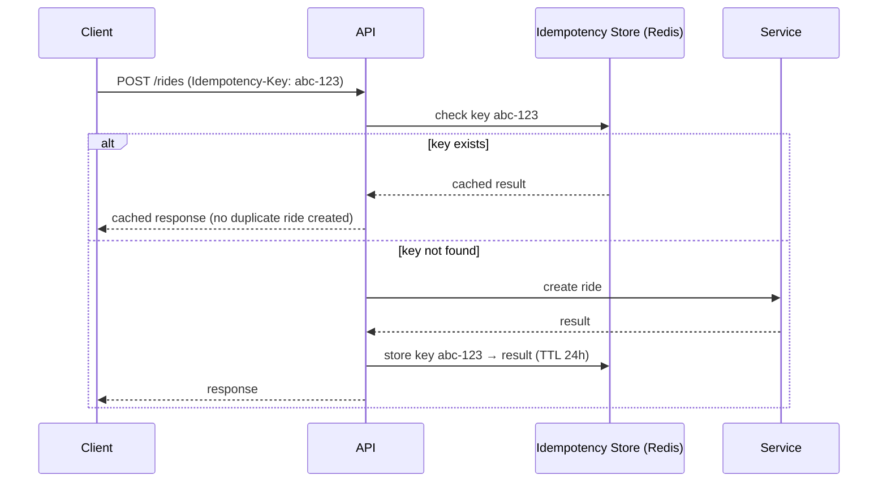
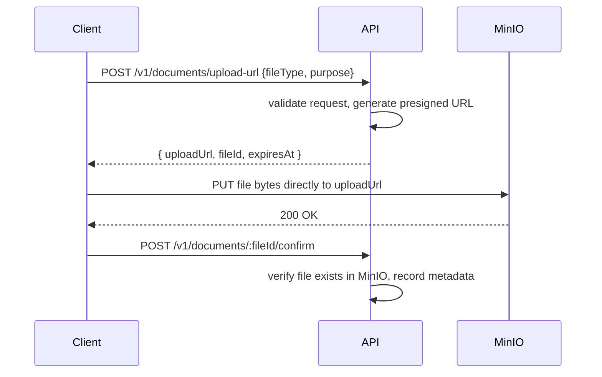

# Zaroorat Engineering Handbook

## Volume 04 — API Engineering Handbook

|                                     |                                                                                                                                                                                                                                                                                                                                                        |
| ----------------------------------- | ------------------------------------------------------------------------------------------------------------------------------------------------------------------------------------------------------------------------------------------------------------------------------------------------------------------------------------------------------ |
| **Status**                          | In progress — delivered in parts                                                                                                                                                                                                                                                                                                                       |
| **Delivered so far**                | Part 1 — API Philosophy (Ch. 1–8), Part 2 — Endpoint Design (Ch. 9–17), Part 3 — Request Standards (Ch. 18–27), Part 4 — Response Standards (Ch. 28–36)                                                                                                                                                                                                |
| **Pending**                         | Parts 5–13 + Appendix (Ch. 37–~114)                                                                                                                                                                                                                                                                                                                    |
| **Relationship to other documents** | `CODING_STANDARDS.md §5-6` is the enforceable envelope/DTO quick-reference. `VOLUME_02 Part 3` (Ch. 20–32, Request Lifecycle) already covers auth/validation/error _flow_ — this volume covers API _contract design_ specifically: shape, naming, versioning, documentation. Where they overlap, this volume cross-references rather than re-deriving. |

---

# Part 1 — API Philosophy

## 1. API Design Philosophy

The API is Zaroorat's actual product boundary — the rider app, driver app, ops dashboard, and any future partner integration all experience "the backend" only through this contract. Design philosophy: **predictable over clever, versioned over silently changing, secure by default over secure by afterthought.** A consumer (human developer or AI agent building a client) should be able to correctly guess the shape of an endpoint they haven't seen yet, from the shape of the ones they have.

#### Summary

The API's job is to be boringly predictable — every new endpoint should feel like it was designed by the same person who designed the last one, even across 23 modules.

#### Best Practices

- Before designing a new endpoint, look at three existing ones in different modules and match their shape exactly unless there's a specific reason not to.

#### Common Mistakes

- Each module inventing its own response quirks because "this resource is a bit different," breaking the predictability that makes the whole API easy to consume.

#### Production Checklist

- [ ] New endpoint shapes are diffed against existing ones in review, not designed in isolation

---

## 2. REST Principles

| Principle                | Zaroorat application                                                                                |
| ------------------------ | --------------------------------------------------------------------------------------------------- |
| Resources as nouns       | `/rides`, `/drivers`, not `/getRides`                                                               |
| Statelessness            | No server-side session state; JWT carries identity per request (Volume 02 §5)                       |
| Uniform interface        | Same HTTP verbs mean the same thing everywhere (§11)                                                |
| Representations          | JSON is the only representation Zaroorat serves; no content negotiation to XML/other formats needed |
| Client-server separation | Backend has zero knowledge of rider/driver app UI state                                             |

Zaroorat is **pragmatic REST**, not strict Richardson Maturity Model Level 3 (HATEOAS, §35) — the benefits of hypermedia don't justify its complexity for a backend serving known, versioned mobile clients rather than generic API browsers.

#### Summary

REST principles are followed where they add real value (resource orientation, statelessness, uniform verbs) and deliberately not followed where the cost doesn't pay for itself (HATEOAS).

#### Best Practices

- When someone proposes an RPC-style endpoint (`/doRideCancel`), redirect to the resource+action pattern (§15) instead — it's rarely a real exception.

#### Common Mistakes

- Building "RPC over HTTP" (verb-named endpoints for everything) instead of resource-oriented design, losing the predictability REST provides for free.

#### Production Checklist

- [ ] No new endpoint uses a verb in its path except the deliberate action-endpoint pattern (§15)

---

## 3. Resource-Oriented Design

Every endpoint is designed around a noun-resource (`ride`, `driver`, `payment`) and standard operations on it (list, get, create, update, an explicit action). This maps directly to a module's service methods (Volume 01 §11) — if a service method doesn't map cleanly to a resource operation, that's often a sign the resource model needs rethinking, not that the API should abandon resource orientation.


#### Summary

Resources in the API are a direct, disciplined reflection of modules' service methods — not a separately-invented API model layered awkwardly on top.

#### Best Practices

- Design the resource model and the service's public methods (Volume 01 §11) together, not the API after the service is already built with a mismatched shape.

#### Common Mistakes

- A service method that does five different things depending on a parameter, forcing an awkward, non-resource-shaped API on top of it (ties back to Volume 01 §26's service design guidance).

#### Production Checklist

- [ ] Every endpoint maps to exactly one service method (Volume 02 §26)

---

## 4. API Consistency Rules

Restates `CODING_STANDARDS.md §5`: one envelope shape, one pagination shape (§31), one error shape (§29), across all 23 modules, with zero per-module exceptions. Consistency is enforced by using shared response-building helpers (Volume 02 §31), not by convention alone.

#### Summary

Consistency across modules is a structural guarantee (shared helper code), not a matter of every engineer remembering the convention.

#### Best Practices

- Any proposed "special case" response shape is treated as a design smell — solve it within the existing envelope's `meta` field instead (Volume 01 §30).

#### Common Mistakes

- A module (e.g. `analytics`) returning a raw array or a bespoke shape "because dashboards are different," breaking client-side consistency assumptions.

#### Production Checklist

- [ ] A shared response-building helper is used by every controller — verified in code review, not just assumed

---

## 5. Consumer-First Design

Design each endpoint from the actual screen/flow in the rider or driver app that will consume it — not from what's convenient to query from the database. A ride-tracking screen needs driver location, ETA, and ride status together; that might justify a slightly denormalized response shape (a "ride tracking" view endpoint) rather than forcing the client to make three separate calls and assemble it themselves.

#### Summary

The API shape should minimize round-trips and client-side assembly work for real screens, even if it means a small amount of backend-side composition.

#### Best Practices

- Sketch the actual mobile screen (or its wireframe) before finalizing an endpoint's response shape, when the endpoint exists specifically to power that screen.

#### Common Mistakes

- Forcing a mobile client to make 3-4 sequential API calls to assemble one screen's data, when a single purpose-built endpoint would serve it better and reduce mobile data/battery cost.

#### Production Checklist

- [ ] Screen-specific endpoints (e.g. ride tracking) are validated against the actual client screen they serve before finalizing

---

## 6. Backward Compatibility

Restates `VOLUME_01 §42-43` at the API-contract level: additive changes (new optional field, new endpoint) are always safe; anything that changes an existing field's meaning, removes a field, or changes a status code is breaking and requires versioning (§16) or a deprecation window (§17).

#### Summary

"Is this breaking?" has one test: would an existing, already-shipped mobile app version handle this response incorrectly if it received it right now? If yes, it's breaking.

#### Best Practices

- Add new fields as optional/nullable by default so older clients that don't expect them simply ignore them (standard JSON parser behavior).

#### Common Mistakes

- Renaming a field ("driverName" → "driverFullName") in place instead of adding the new field and deprecating the old one — an already-shipped app crashes or silently loses data reading the old field.

#### Production Checklist

- [ ] Every response-shape change is tested against "would a client on the previous shape break?" before merging

---

## 7. API Lifecycle


Maps to a module's `SPEC.md` status (Module Spec Template §0): a module in `Building` status has Draft endpoints (may still change without a deprecation cycle); once a module reaches `Complete` and has shipped to production clients, its endpoints are Stable and any further change follows Deprecation Strategy (§17).

#### Summary

An endpoint's obligations (whether it can change freely or needs a deprecation cycle) are tied directly to whether real, released clients depend on it yet.

#### Best Practices

- Mark clearly, in each endpoint's `SPEC.md` entry (Module Spec Template §7), whether it's still Draft (pre-release, free to change) or Stable (requires versioning discipline).

#### Common Mistakes

- Treating a Draft endpoint with the same change-caution as a Stable one, slowing down legitimate early iteration before any real client depends on the exact shape.

#### Production Checklist

- [ ] Each endpoint's lifecycle stage is stated in its module `SPEC.md` entry

---

## 8. API Governance

For a solo developer, governance is self-review against this handbook's checklists (Volume 01 §46-48) rather than a formal approval board. As the team grows, this chapter is where a real review-and-approval process (a designated API reviewer, a required sign-off for any breaking change) gets documented — a placeholder for that future state is intentionally left here rather than over-engineering process for a team of one.

#### Summary

Governance today is "the checklist is the approver"; this chapter is reserved to formalize an actual review process once there's more than one person to review.

#### Best Practices

- Run every new endpoint through Volume 01 §48's consolidated checklist before considering it done, even solo.

#### Common Mistakes

- Skipping self-review checklist discipline specifically because "it's just me," which is exactly when it's most needed (no second pair of eyes at all otherwise).

#### Production Checklist

- [ ] Volume 01 §48 checklist applied to every new endpoint before merge, solo or not

---

# Part 2 — Endpoint Design

## 9. Resource Naming

Plural nouns, `kebab-case` for multi-word resources: `/rides`, `/drivers`, `/driver-documents`. Never verbs in the resource path itself (verbs belong only in the action-endpoint pattern, §15).

| Good                | Bad               | Why                                                |
| ------------------- | ----------------- | -------------------------------------------------- |
| `/rides`            | `/getRides`       | Resource, not RPC verb                             |
| `/driver-documents` | `/driverDocs`     | kebab-case, not camelCase, in URLs                 |
| `/rides/:id/cancel` | `/cancelRide/:id` | Action nested under resource, not a top-level verb |

#### Summary

Resource names are plural, kebab-case nouns — no exceptions, no per-module creativity.

#### Best Practices

- When a resource name feels awkward as a plural noun, that's often a sign it should be modeled as an action (§15) instead of a resource.

#### Common Mistakes

- Mixing `camelCase` and `kebab-case` across different modules' URL paths.

#### Production Checklist

- [ ] All resource paths are plural, kebab-case nouns

---

## 10. URI Standards

Pattern: `/v{version}/{resource}/{id}/{sub-resource}/{sub-id}`. Example: `/v1/rides/rid_abc123/status-history`. IDs in paths are always the resource's real `cuid2` primary key (Volume 03 §26) — never an internal sequential number, never a different identifier than what's stored.

#### Summary

URI structure is fixed and predictable: version, resource, ID, optional nested resource — the same shape for every endpoint in the system.

#### Best Practices

- Keep nesting to one level in the URL (`/rides/:id/status-history`) even if the data model nests deeper — deeper URL nesting becomes unwieldy and is rarely necessary (§12).

#### Common Mistakes

- Exposing an internal, sequential, or otherwise non-primary-key identifier in a URL, which can leak volume information or not match what the database actually uses.

#### Production Checklist

- [ ] Every path parameter is the resource's actual `cuid2` primary key

---

## 11. HTTP Methods

| Method   | Use                                                                             | Idempotent?                           | Body? |
| -------- | ------------------------------------------------------------------------------- | ------------------------------------- | ----- |
| `GET`    | Read a resource or collection                                                   | Yes                                   | No    |
| `POST`   | Create a resource, or trigger an action (§15)                                   | No (unless Idempotency-Key used, §21) | Yes   |
| `PATCH`  | Partial update of a resource                                                    | Yes (same input → same result)        | Yes   |
| `PUT`    | Full replace of a resource (rarely used in Zaroorat — most updates are partial) | Yes                                   | Yes   |
| `DELETE` | Soft-delete a resource (Volume 03 §34)                                          | Yes                                   | No    |

#### Summary

HTTP methods carry fixed, uniform meaning across every resource — a `PATCH` always means partial update, everywhere, with no module-specific reinterpretation.

#### Best Practices

- Prefer `PATCH` over `PUT` for nearly all updates, since most Zaroorat update operations are partial (e.g. updating just a driver's online status).

#### Common Mistakes

- Using `POST` for what's actually an idempotent update (should be `PATCH`), or using `GET` with a request body (against HTTP semantics and many client/proxy expectations).

#### Production Checklist

- [ ] Every endpoint's HTTP method matches the semantics in this table

---

## 12. Nested Resources

Nesting is used only for genuine parent-dependent (weak entity, Volume 03 §16) relationships, one level deep: `/rides/:id/status-history`, `/drivers/:id/documents`. A resource that can exist independently of its "parent" in the URL is NOT nested — e.g. `/payments` is top-level (queryable by `rideId` as a filter, §33) rather than forced under `/rides/:id/payments`, since a payment has its own independent lifecycle and query patterns (refund lookups by payment ID, not always via a ride).

#### Summary

Nesting reflects genuine weak-entity ownership (Volume 03 §16), not just "this happens to relate to that."

#### Best Practices

- Ask: "does this resource have any meaningful identity or query pattern independent of its supposed parent?" If yes, keep it top-level with a filter parameter instead of nesting.

#### Common Mistakes

- Deeply nested URLs (`/riders/:id/rides/:id/payments/:id/refunds`) that become unwieldy and don't reflect how the resource is actually queried in practice.

#### Production Checklist

- [ ] No URL nests more than one level deep

---

## 13. Bulk Endpoints

Used sparingly, mainly for operations-facing tooling (e.g. ops bulk-cancelling rides during an incident, or bulk notification dispatch) — never as a default pattern for rider/driver-facing APIs, where per-resource endpoints are simpler and sufficiently performant at expected scale. A bulk endpoint accepts an array of IDs/payloads and returns a per-item result array so partial failures are visible.

```json
// POST /v1/rides/bulk-cancel
{ "rideIds": ["rid_1", "rid_2"] }

// Response
{
  "success": true,
  "data": {
    "results": [
      { "rideId": "rid_1", "success": true },
      { "rideId": "rid_2", "success": false, "error": { "code": "RIDE_ALREADY_COMPLETED" } }
    ]
  }
}
```

#### Summary

Bulk endpoints exist for operational tooling, not as a general-purpose pattern, and always report per-item results rather than an all-or-nothing outcome.

#### Best Practices

- Cap bulk endpoint batch size explicitly (e.g. max 100 items per call) to bound worst-case processing time and payload size.

#### Common Mistakes

- An all-or-nothing bulk endpoint that fails the entire batch because one item had a problem, hiding which specific items actually succeeded.

#### Production Checklist

- [ ] Every bulk endpoint has an explicit max batch size and per-item result reporting

---

## 14. Search Endpoints

For simple filtering (status, date range), use query parameters on the collection `GET` endpoint (§33) — not a separate search endpoint. A dedicated `/search` endpoint (e.g. `POST /v1/rides/search` with a richer query body) is reserved for genuinely complex search (multiple combined criteria, full-text, Part 6 Ch. 64 once written) where query-string encoding becomes unwieldy or a request body is needed for the query shape itself.

#### Summary

Simple filters live on the collection endpoint via query params; a dedicated search endpoint is reserved for complex query shapes that outgrow query-string encoding.

#### Best Practices

- Default to query-parameter filtering (§33) and only introduce a dedicated search endpoint when a specific, real query need can't be expressed cleanly that way.

#### Common Mistakes

- Building a `/search` endpoint prematurely for what's really just `?status=completed&driverId=xyz`, adding unneeded API surface.

#### Production Checklist

- [ ] A dedicated search endpoint isn't introduced until query-parameter filtering has been shown insufficient for a real, specific need

---

## 15. Action Endpoints

For state transitions that aren't a generic field update — `POST /rides/:id/cancel`, `POST /rides/:id/accept` — modeled as a sub-resource action rather than `PATCH /rides/:id { status: 'cancelled' }`.

|                             | Action endpoint (`POST /rides/:id/cancel`)                                                                                                                                                        | Generic status PATCH (`PATCH /rides/:id { status: 'cancelled' }`)                                                                             |
| --------------------------- | ------------------------------------------------------------------------------------------------------------------------------------------------------------------------------------------------- | --------------------------------------------------------------------------------------------------------------------------------------------- |
| **What**                    | A dedicated endpoint per meaningful transition                                                                                                                                                    | One endpoint accepting any status value                                                                                                       |
| **Benefits**                | Each transition can have its own validation, permission rules, and side effects (Volume 02 §27 state transition example) without an internal branch on status value; self-documenting API surface | Fewer endpoints to define                                                                                                                     |
| **Trade-offs**              | More endpoints per resource                                                                                                                                                                       | Hides the actual set of valid transitions behind a generic field, and easily allows an invalid direct status write bypassing transition rules |
| **Alternatives considered** | Generic status PATCH                                                                                                                                                                              | Action endpoints                                                                                                                              |
| **When to use**             | Any transition with its own validation/permission/side-effect rules — **the default for ride/driver state transitions in Zaroorat**                                                               | A field that's genuinely just descriptive data with no transition rules attached (e.g. updating a profile photo URL)                          |
| **When not to use**         | Simple descriptive field updates with no business rule attached                                                                                                                                   | Any state machine transition (Volume 02 §6 state machine chapter)                                                                             |

#### Summary

State machine transitions get their own action endpoints so each transition's specific rules are enforced by routing, not by an internal conditional on an arbitrary status value a client could otherwise set directly.

#### Best Practices

- Name action endpoints after the business action (`/accept`, `/cancel`, `/complete`), matching the state machine's named transitions (Volume 02 §6, Module Spec Template §6).

#### Common Mistakes

- A generic `PATCH /rides/:id` that accepts a `status` field directly settable to any enum value, bypassing the state machine's transition validation (Volume 01 §22's decision tree exists specifically to catch this).

#### Production Checklist

- [ ] No endpoint allows a state-machine-governed field to be set directly to an arbitrary value — every transition goes through its named action endpoint

---

## 16. API Versioning

Restates `VOLUME_01 §43`: every route is registered under `/v1` from day one. A breaking change to a Stable (§7) endpoint requires either introducing `/v2` for that resource specifically (not a whole-API version bump) or extending within the existing shape non-breakingly (§6).

#### Summary

Versioning is per-resource where practical (not necessarily a whole-API v2 for one resource's breaking change), keeping the blast radius of any version bump small.

#### Best Practices

- Prefer extending a resource non-breakingly over bumping its version, and reserve a version bump for genuine, unavoidable breaking changes.

#### Common Mistakes

- Bumping the entire API to `/v2` for a change that only affects one resource, forcing every client to migrate every endpoint at once instead of just the one that changed.

#### Production Checklist

- [ ] Version bumps are scoped to the specific resource(s) with the breaking change, not applied API-wide by default

---

## 17. Deprecation Strategy

Restates and extends `VOLUME_01 §42`: a deprecated endpoint/field returns a `Deprecation` header (per the IETF draft standard) and a `Sunset` header with the removal date. The old shape continues to function throughout the deprecation window (length determined by expected mobile app release/update cadence — typically several weeks to months, not days).

```
Deprecation: true
Sunset: Sat, 01 Nov 2026 00:00:00 GMT
Link: <https://docs.zaroorat.internal/migration/rides-v2>; rel="deprecation"
```

#### Summary

Deprecation is communicated in-band (response headers) so clients (and monitoring) can detect and react to it automatically, not just via a changelog someone might not read (§90, once written).

#### Best Practices

- Log server-side whenever a deprecated endpoint is actually called, so you can track real migration progress before the sunset date arrives.

#### Common Mistakes

- Sunsetting an endpoint on schedule without checking whether traffic to it has actually dropped to zero first, breaking a client that hadn't migrated yet.

#### Production Checklist

- [ ] Deprecated endpoint call volume is monitored and confirmed near-zero before actual removal, regardless of the originally planned sunset date

---

# Part 3 — Request Standards

## 18. Headers

| Header            | Purpose                                                        | Required?                                                                                  |
| ----------------- | -------------------------------------------------------------- | ------------------------------------------------------------------------------------------ |
| `Authorization`   | `Bearer <JWT>` (§19)                                           | Yes, except public endpoints (login, OTP request)                                          |
| `Content-Type`    | `application/json` (or `multipart/form-data` for uploads, §26) | Yes, on requests with a body                                                               |
| `X-Request-Id`    | Client-supplied or server-generated correlation ID (§20)       | Recommended from clients, always present in responses                                      |
| `Idempotency-Key` | Client-supplied dedupe key (§21)                               | Required on state-mutating, side-effect-bearing endpoints (ride creation, payment capture) |
| `Accept-Language` | Locale for error messages/notifications                        | Optional, defaults to a configured default locale                                          |

#### Summary

A small, fixed set of headers carries every cross-cutting concern (auth, correlation, idempotency, locale) — no endpoint invents its own bespoke header.

#### Best Practices

- Document required headers per endpoint explicitly in its OpenAPI spec (Part 10, once written), not just in this general table.

#### Common Mistakes

- A module inventing its own custom header for a concern already covered by one in this table (e.g. a module-specific correlation header instead of using `X-Request-Id`).

#### Production Checklist

- [ ] No new custom header is introduced without checking this table for an existing equivalent first

---

## 19. Authentication Headers

`Authorization: Bearer <access-token>`. Restates Volume 02 §23. No custom auth header scheme — standard Bearer token, universally understood by HTTP tooling, API gateways, and monitoring.

#### Summary

Standard Bearer-token auth, nothing custom — maximizes compatibility with tooling and reduces onboarding friction for any new client integration.

#### Best Practices

- Reject (401) any request with a malformed or missing `Authorization` header before it reaches any other middleware (Volume 02 §22 ordering).

#### Common Mistakes

- Accepting a token via a query parameter as a fallback "for convenience" (e.g. for easy testing in a browser) — query parameters get logged in server/proxy access logs, leaking tokens.

#### Production Checklist

- [ ] No endpoint accepts an auth token via query parameter, only the `Authorization` header

---

## 20. Correlation ID

Restates `CODING_STANDARDS.md §6`: every request gets an `X-Request-Id`, either passed by the client or generated by Fastify's `onRequest` hook (Volume 02 §21) if absent. It's included in every log line for that request and echoed back in the response's `meta.requestId` and as a response header, so a client-reported issue can be traced server-side by that single ID.

#### Summary

The correlation ID is the single thread connecting a client's bug report to the exact server-side logs for that request — essential for debugging without needing to reproduce the issue live.

#### Best Practices

- Ask a reporting user/QA tester for the `requestId` from an error response as the first debugging step — it should resolve "which logs do I look at" instantly.

#### Common Mistakes

- Generating a new request ID somewhere mid-request-handling instead of propagating the one from `onRequest`, breaking the single-ID-per-request guarantee.

#### Production Checklist

- [ ] `requestId` is generated exactly once per request, at the earliest hook, and threaded through every log line and the response

---

## 21. Idempotency Key

For any endpoint with real-world side effects that must not be duplicated on retry (ride creation, payment capture, OTP send) — restates `VOLUME_00 §4` business rule 1's implication and `CODING_STANDARDS.md`'s idempotency principle. Client supplies `Idempotency-Key` (a UUID it generates once per logical action); server stores the key with the operation's result for a defined window (e.g. 24 hours) and returns the cached result for a repeated key instead of re-executing the side effect.



#### Summary

Idempotency keys close the "client retried a request due to a network timeout, but the first one actually succeeded server-side" gap that causes duplicate rides, duplicate charges, or duplicate OTPs.

#### Best Practices

- Require `Idempotency-Key` (400 if missing) on every endpoint identified as side-effect-bearing in a module's `SPEC.md §7`, rather than making it optional.

#### Common Mistakes

- Making idempotency keys optional on payment-capture endpoints "to keep it simple," leaving the exact double-charge scenario idempotency exists to prevent.

#### Production Checklist

- [ ] Every module's `SPEC.md §7` explicitly marks which endpoints require `Idempotency-Key`, and those endpoints reject requests missing it

---

## 22. Content Types

`application/json` for all standard requests/responses; `multipart/form-data` only for file upload endpoints (§26-27). No XML, no other content negotiation — a fixed, simple content-type contract reduces both server complexity and client confusion.

#### Summary

One content type for data, one for file uploads — no content negotiation machinery needed.

#### Best Practices

- Explicitly reject (415 Unsupported Media Type) any request with an unexpected `Content-Type` rather than attempting to guess/parse it leniently.

#### Common Mistakes

- Silently accepting and attempting to parse multiple content types "to be flexible," which increases attack surface and error-handling complexity for no real client benefit.

#### Production Checklist

- [ ] Non-JSON, non-multipart content types are explicitly rejected with 415

---

## 23. Query Parameters

`camelCase`, matching the JSON body convention (Volume 01 §14) for consistency across the whole API surface — e.g. `?driverId=xyz&pageSize=20`, not `?driver_id=xyz`. Array-valued parameters use repeated keys (`?status=completed&status=cancelled`) rather than comma-joined strings, since repeated-key is natively supported by both Fastify's query parser and standard HTTP client libraries without custom parsing.

#### Summary

Query parameters use the same `camelCase` convention as JSON bodies — one casing convention across the entire request surface, not two.

#### Best Practices

- Validate query parameters with the same Zod-schema rigor as request bodies (Volume 01 §24) — they're still external input.

#### Common Mistakes

- Mixing `snake_case` query parameters with `camelCase` JSON bodies across different endpoints, breaking the one-convention-everywhere rule.

#### Production Checklist

- [ ] All query parameters are `camelCase` and validated via Zod

---

## 24. Path Parameters

Always the resource's real `cuid2` ID (§10, Volume 03 §26) — restated here because it's worth being explicit: a path parameter is never a slug, a sequential number, or a composite value, keeping URL structure and parsing uniformly simple.

#### Summary

Path parameters are exactly one thing, everywhere: the resource's actual primary key.

#### Best Practices

- Validate path parameter format (matches expected `cuid2` shape) at the route schema level, returning 400 for a malformed ID before even attempting a database lookup (which would otherwise correctly, but less efficiently, return 404).

#### Common Mistakes

- Not validating ID format before querying, causing a malformed ID to reach the database layer and potentially throw an unexpected type-mismatch error instead of a clean 400.

#### Production Checklist

- [ ] Path parameter ID format is validated by Zod schema before any repository call

---

## 25. Request Body

JSON object matching the endpoint's Zod-validated DTO (Volume 01 §3, §29) exactly — no unexpected extra top-level wrapping (`{ "data": { ... } }` on the request side is unnecessary; that pattern is reserved for responses, §28). Request bodies are the DTO shape directly.

#### Summary

Request bodies are the DTO's shape directly, unwrapped — the response envelope pattern (§28) is a response-side concept only, not mirrored on requests.

#### Best Practices

- Keep request DTOs flat where possible; nested objects only where they represent a genuine nested concept (e.g. `pickup: { lat, lng }`).

#### Common Mistakes

- Wrapping request bodies in an envelope-like `{ "data": {...} }` structure "for consistency" with responses — unnecessary and inconsistent with how Zod schemas and most client libraries expect request shapes.

#### Production Checklist

- [ ] No request body is wrapped in an unnecessary top-level envelope object

---

## 26. File Upload

For KYC documents and profile photos (Volume 00 FR-23), Zaroorat uses the **presigned URL pattern**, not direct multipart upload through the Fastify API.

|                             | Direct multipart upload through API                                                                         | Presigned URL (client uploads directly to MinIO)                                                                                    |
| --------------------------- | ----------------------------------------------------------------------------------------------------------- | ----------------------------------------------------------------------------------------------------------------------------------- |
| **What**                    | Client sends file bytes to the API, API forwards to MinIO                                                   | API issues a short-lived signed URL; client uploads directly to MinIO using it                                                      |
| **Benefits**                | Simpler client implementation                                                                               | API pods never handle large file bytes (memory/bandwidth), scales independently of API layer, faster for the client (no double-hop) |
| **Trade-offs**              | API pod memory/bandwidth consumed by every upload, doesn't scale well, couples API scaling to upload volume | Slightly more complex client-side flow (two requests: get URL, then upload)                                                         |
| **Alternatives considered** | Presigned URL                                                                                               | Direct multipart                                                                                                                    |
| **When to use**             | Small, infrequent uploads where simplicity outweighs scale concerns                                         | Any KYC document, profile photo, or other file upload at Zaroorat's expected scale — **the chosen pattern**                         |
| **When not to use**         | KYC documents, profile photos (chosen pattern's use case)                                                   | Trivially small one-off admin tooling uploads, if ever needed                                                                       |



#### Summary

File bytes never pass through a Fastify API pod — the API only issues and confirms presigned URLs, keeping upload volume from ever becoming an API-layer scaling concern.

#### Best Practices

- Set a short expiry on presigned URLs (minutes, not hours) to limit the window a leaked URL could be misused.

#### Common Mistakes

- Building direct multipart upload through the API "because it's simpler," then discovering large KYC document/photo uploads under real driver-onboarding volume degrade API pod performance for unrelated requests.

#### Production Checklist

- [ ] No endpoint accepts raw file bytes directly; all uploads go through the presigned URL + confirm pattern

---

## 27. Multipart Requests

Given §26's presigned URL decision, `multipart/form-data` is **not** used for file uploads in Zaroorat's API. It's noted here only for completeness and explicitly ruled out, so a future contributor (or Claude) doesn't reach for Fastify's multipart plugin by default without checking this decision first.

#### Summary

Multipart form handling is a deliberately unused pattern in this API — file uploads exclusively use the presigned URL flow from §26.

#### Best Practices

- If a genuinely compelling reason for multipart ever arises, document it as an ADR (Volume 01 §45) explaining why the presigned URL pattern doesn't fit that specific case.

#### Common Mistakes

- Adding Fastify's multipart plugin and building a direct-upload endpoint out of habit/familiarity, duplicating what the presigned URL flow already solves better.

#### Production Checklist

- [ ] No `multipart/form-data` endpoint exists without an ADR justifying the deviation from §26

---

# Part 4 — Response Standards

## 28. Success Response

Restates `CODING_STANDARDS.md §5` exactly: `{ success: true, data: {...}, meta: {...} }`. This chapter exists to state the _why_ fully: the `success` boolean lets clients branch on outcome without relying on HTTP status code parsing alone (some client HTTP libraries make status-code branching more awkward than a body field check), while still using correct HTTP status codes as the primary signal for tooling/monitoring/caching layers that only see the status code.

#### Summary

The envelope's `success` field and the HTTP status code both signal outcome, deliberately redundantly — one for client code convenience, one for infrastructure/tooling correctness.

#### Best Practices

- Never let `success: true` appear with a non-2xx status code, or vice versa — the two signals must always agree.

#### Common Mistakes

- A response with `success: true` but a `404` status code (or similar mismatch), confusing any tooling that relies on the status code while a client library reads the body field.

#### Production Checklist

- [ ] Automated test asserts `success` field and HTTP status code never disagree, across the whole API surface

---

## 29. Error Response

Restates `CODING_STANDARDS.md §5`: `{ success: false, error: { code, message, meta }, meta: { requestId } }`. The `error.code` is the machine-readable contract clients should branch on (e.g. show a specific UI message for `RIDE_ALREADY_CANCELLED`); `error.message` is a human-readable fallback, not guaranteed stable across versions (clients should not string-match on it).

#### Summary

`error.code` is the stable contract; `error.message` is a convenience string that can be reworded without being a breaking change.

#### Best Practices

- Document explicitly, in the API documentation (Part 10, once written), that `error.message` text may change without notice, while `error.code` values follow the same backward-compatibility rules as any other API contract (§6).

#### Common Mistakes

- A mobile client string-matching on `error.message` to decide UI behavior instead of `error.code`, breaking silently the next time the message wording is improved.

#### Production Checklist

- [ ] Every documented error case includes its stable `error.code`, explicitly distinguished from the non-contractual `error.message`

---

## 30. Metadata

The `meta` object carries `requestId` (always), and contextually `pagination` (§31, list endpoints) or other response-shape-appropriate context (e.g. `meta.deprecation` info, §17). `meta` is the designated extension point for anything that doesn't belong in `data` — restates Volume 01 §30's guidance to extend via `meta` rather than forking the envelope shape.

#### Summary

`meta` is intentionally the flexible part of an otherwise rigid envelope — new cross-cutting response information goes here, not as a new top-level envelope field.

#### Best Practices

- Before adding a new top-level field to the envelope, check whether it actually belongs inside `meta` instead.

#### Common Mistakes

- Adding ad hoc new top-level response fields per-endpoint instead of nesting them under `meta`, causing envelope shape drift across the API.

#### Production Checklist

- [ ] No endpoint response has top-level fields beyond `success`, `data`/`error`, and `meta`

---

## 31. Pagination

Every list endpoint's response includes `meta.pagination`. Deep-dive on cursor vs. offset strategy lives in Part 8 (Ch. 63-65, pending) — the summary decision, stated here for the response-shape chapter: **cursor-based pagination for high-growth, feed-like collections (ride history), offset-based acceptable for small, bounded, admin-facing lists.**

```json
"meta": {
  "pagination": {
    "nextCursor": "eyJpZCI6InJpZF8xMjMifQ==",
    "hasMore": true,
    "pageSize": 20
  }
}
```

#### Summary

Pagination metadata always lives in the same `meta.pagination` location, whatever the underlying strategy (cursor or offset) — clients parse pagination the same way regardless of endpoint.

#### Best Practices

- Even for offset pagination, keep the `meta.pagination` field names consistent conceptually with the cursor style where possible, minimizing client-side special-casing.

#### Common Mistakes

- Some endpoints returning pagination info as top-level response fields instead of nested under `meta.pagination`, breaking envelope consistency (§4).

#### Production Checklist

- [ ] Every list endpoint's pagination info lives under `meta.pagination`, regardless of strategy used

---

## 32. Sorting

Query parameter: `?sort=fieldName:asc` or `?sort=fieldName:desc`, single-field sort by default (multi-field sort only added to a specific endpoint if a real, demonstrated need arises — YAGNI, Volume 01 §6). The sortable fields for each endpoint are an explicit allowlist (Zod enum), never an arbitrary client-supplied column name — passing an arbitrary field to an `ORDER BY` clause is both a potential injection surface and an easy way to accidentally expose an unindexed sort causing a slow query (Volume 03 §69, pending).

#### Summary

Sorting is deliberately constrained to an explicit, validated allowlist of fields per endpoint — never an open-ended client-controlled column name.

#### Best Practices

- Ensure every allowlisted sortable field has a supporting database index (Volume 03 §69) before adding it to an endpoint's allowlist.

#### Common Mistakes

- Allowing `?sort=` to accept any arbitrary field name, which both risks a slow, unindexed sort and (if naively implemented via string interpolation into a query) a SQL injection surface.

#### Production Checklist

- [ ] Every endpoint's sortable fields are an explicit Zod-validated allowlist, each backed by a database index

---

## 33. Filtering

Query parameters map directly to filterable fields: `?status=completed&driverId=xyz`. Like sorting, the filterable fields and their allowed value types are explicit per endpoint (Zod schema), not an arbitrary key-value pass-through to the database query.

#### Summary

Filtering follows the same allowlist discipline as sorting — explicit, validated, never a raw pass-through.

#### Best Practices

- Combine multiple filters with implicit AND semantics (never OR) unless an endpoint explicitly documents otherwise — keeps filter behavior predictable.

#### Common Mistakes

- Accepting an arbitrary filter object structure from the client and passing it near-directly into a Prisma `where` clause, which both bypasses validation and violates the repository encapsulation rule (Volume 01 §25).

#### Production Checklist

- [ ] Every filterable field and its value type is explicitly Zod-validated per endpoint

---

## 34. Field Selection

Sparse fieldsets (`?fields=id,status,createdAt`) are **not implemented for v1** — a deliberate scope decision (Volume 00 §11-style deferral): the added client/server complexity isn't justified until a specific, measured payload-size problem exists for a specific endpoint. If ever needed, it would be scoped to that one endpoint rather than a general-purpose mechanism.

#### Summary

Field selection is explicitly out of scope until a real, measured need exists — avoiding speculative API surface (YAGNI, Volume 01 §6) for a problem that hasn't materialized.

#### Best Practices

- If a specific endpoint's response payload is measured as a real problem (mobile data usage, latency), consider a purpose-built lighter response variant for that one endpoint rather than a general field-selection mechanism.

#### Common Mistakes

- Building a generic, general-purpose field-selection mechanism across the whole API speculatively, adding validation and caching complexity everywhere for a problem that may never actually occur.

#### Production Checklist

- [ ] Field selection is not implemented unless a specific endpoint has a documented, measured payload-size problem

---

## 35. HATEOAS (when applicable)

**Not implemented in Zaroorat's API.** Full decision reasoning:

|                             | HATEOAS (hypermedia links in responses)                                                                      | No HATEOAS (current choice)                                                                                                                       |
| --------------------------- | ------------------------------------------------------------------------------------------------------------ | ------------------------------------------------------------------------------------------------------------------------------------------------- |
| **What**                    | Responses include links to related/next actions (`_links: { cancel: '/rides/:id/cancel' }`)                  | Client apps hardcode known endpoint paths                                                                                                         |
| **Benefits**                | Clients can discover available actions dynamically, in principle decoupling client from server URL structure | Much simpler client and server implementation; no hypermedia parsing logic needed in mobile apps                                                  |
| **Trade-offs**              | Significant added complexity for both server (link generation) and client (hypermedia parsing)               | Mobile client and API version must be coordinated for endpoint changes (mitigated by versioning, §16, and deprecation discipline, §17)            |
| **Alternatives considered** | No HATEOAS                                                                                                   | Full HATEOAS                                                                                                                                      |
| **When to use**             | A generic API consumed by unknown third-party clients that benefit from runtime discoverability              | A backend serving known, versioned first-party mobile apps that are updated in lockstep with API changes anyway — **Zaroorat's actual situation** |
| **When not to use**         | Known, versioned first-party clients (Zaroorat)                                                              | A public developer-platform API where third-party discoverability is a real, valued feature                                                       |

#### Summary

HATEOAS solves a discoverability problem Zaroorat doesn't have — first-party mobile apps are released alongside API changes and don't need to discover endpoints dynamically at runtime.

#### Best Practices

- Revisit this decision only if Zaroorat opens a genuine third-party developer platform (currently out of scope, Volume 00 §11) where dynamic discoverability becomes a real value proposition.

#### Common Mistakes

- Implementing partial HATEOAS "for best practice" without a real consumer that benefits from it, adding response payload size and server complexity for no realized value.

#### Production Checklist

- [ ] No response includes hypermedia `_links` unless a future ADR justifies reintroducing HATEOAS for a specific, real third-party consumer need

---

## 36. Response Compression

Fastify's compression plugin (gzip/brotli) is enabled globally for responses above a minimum size threshold (e.g. 1KB) — below that threshold, compression overhead isn't worth it. Applies automatically based on the client's `Accept-Encoding` header; no per-endpoint configuration needed.

#### Summary

Compression is a global, automatic concern configured once at the framework level — not something individual endpoints need to think about.

#### Best Practices

- Verify compression is actually negotiating correctly (check response `Content-Encoding` header) as part of initial API setup, since a misconfigured reverse proxy/load balancer can sometimes strip or duplicate compression.

#### Common Mistakes

- Enabling compression at both the application layer and an in-front reverse proxy/load balancer without checking for double-compression or conflicting behavior.

#### Production Checklist

- [ ] Response compression is verified working end-to-end (through any load balancer/proxy) before launch, not just at the application layer in isolation

---

## Change Log

| Date    | Change                                                                       |
| ------- | ---------------------------------------------------------------------------- |
| (start) | Parts 1–4 (Ch. 1–36) delivered. Parts 5–13 + Appendix (Ch. 37–~114) pending. |
