# Zaroorat Engineering Handbook

## Volume 05 — Authentication & Security Engineering Handbook

|                                     |                                                                                                                                                                                                                                                                                                                                                                                                                                                                                                                                                                                                    |
| ----------------------------------- | -------------------------------------------------------------------------------------------------------------------------------------------------------------------------------------------------------------------------------------------------------------------------------------------------------------------------------------------------------------------------------------------------------------------------------------------------------------------------------------------------------------------------------------------------------------------------------------------------- |
| **Status**                          | Complete — v1 (all 14 parts + Appendix delivered, Ch. 1–148) · pending founder/security review                                                                                                                                                                                                                                                                                                                                                                                                                                                                                                     |
| **Contents**                        | Part 1 — Security Philosophy (Ch. 1–10), Part 2 — Identity Management (Ch. 11–20), Part 3 — Authentication (Ch. 21–39), Part 4 — Password Security (Ch. 40–48), Part 5 — OTP System (Ch. 49–58), Part 6 — Authorization (Ch. 59–70), Part 7 — API Security (Ch. 71–85), Part 8 — Infrastructure Security (Ch. 86–97), Part 9 — Data Protection (Ch. 98–107), Part 10 — Device Security (Ch. 108–115), Part 11 — Fraud Prevention (Ch. 116–123), Part 12 — Compliance (Ch. 124–131), Part 13 — Monitoring & Incident Response (Ch. 132–140), Part 14 — Production Readiness (Ch. 141–148), Appendix |
| **Audience**                        | Security architects, backend engineers, DevOps/platform engineers, QA, compliance, AI coding agents (Claude Code)                                                                                                                                                                                                                                                                                                                                                                                                                                                                                  |
| **Relationship to other documents** | This volume is the deep, long-form reference. The enforceable quick-reference is [`SECURITY_GUIDE.md`](../../01_ARCHITECTURE/SECURITY_GUIDE.md) — where the two overlap, `SECURITY_GUIDE.md` is the operative checklist and this volume explains the _why_ behind it. Identity/auth flows also touch `VOLUME_04 §Auth`, [`API_STANDARDS.md`](../../01_ARCHITECTURE/API_STANDARDS.md), and [`ER_DIAGRAM.md`](../../01_ARCHITECTURE/ER_DIAGRAM.md) (the `OtpChallenge` entity). This volume never contradicts a decision already recorded there; it extends it.                                      |

**How to use this volume:** security is not a module — it is a property of every request, every table, and every deploy. Read Part 1 before touching auth code so the _why_ behind each rule is clear; then treat each chapter's **Security Checklist** and **Production Checklist** as the gate for shipping the corresponding feature.

---

## Table of Contents

**Part 1 — Security Philosophy**

1. Security Philosophy · 2. Security Principles · 3. Zero Trust Architecture · 4. Defense in Depth · 5. Least Privilege · 6. Secure by Default · 7. Security Architecture Overview · 8. Threat Modeling · 9. Security Design Process · 10. Security Governance

**Part 2 — Identity Management** 11. Identity Overview · 12. User Identity Lifecycle · 13. Driver Identity Lifecycle · 14. Admin Identity Lifecycle · 15. Identity Verification · 16. Email Verification · 17. Phone Verification · 18. KYC Readiness · 19. Device Identity · 20. Trusted Devices

**Part 3 — Authentication** 21. Authentication Architecture · 22. Login Flow · 23. Registration Flow · 24. Passwordless Authentication · 25. JWT Architecture · 26. Access Tokens · 27. Refresh Tokens · 28. Token Rotation · 29. Token Revocation · 30. Session Management · 31. Device Sessions · 32. Logout Strategy · 33. Multi-Device Login · 34. Remember Me · 35. Session Expiration · 36. Concurrent Sessions · 37. Secure Cookie Strategy · 38. Stateless Authentication · 39. Authentication Sequence Diagrams

**Part 4 — Password Security** 40. Password Policy · 41. Password Hashing · 42. Argon2 vs bcrypt · 43. Password Reset Flow · 44. Password History · 45. Password Expiration · 46. Password Strength · 47. Credential Stuffing Protection · 48. Brute Force Protection

**Part 5 — OTP System** 49. OTP Architecture · 50. SMS OTP · 51. Email OTP · 52. TOTP · 53. OTP Expiration · 54. Retry Limits · 55. Resend Rules · 56. Rate Limiting · 57. OTP Replay Protection · 58. Fraud Detection

**Part 6 — Authorization** 59. Authorization Overview · 60. RBAC Architecture · 61. Roles · 62. Permissions · 63. Permission Matrix · 64. Resource Ownership · 65. Policy-Based Authorization · 66. Attribute-Based Access Control (ABAC) · 67. Route Protection · 68. Module Permissions · 69. Permission Caching · 70. Admin Authorization

**Part 7 — API Security** 71. API Authentication · 72. Authorization Middleware · 73. Rate Limiting · 74. API Keys · 75. Request Signing · 76. CORS · 77. CSRF Protection · 78. XSS Prevention · 79. SQL Injection Prevention · 80. NoSQL Injection Prevention · 81. SSRF Prevention · 82. Security Headers (Helmet) · 83. Request Validation · 84. Response Security · 85. Secure Error Messages

**Part 8 — Infrastructure Security** 86. Environment Variables · 87. Secret Management · 88. Docker Security · 89. Kubernetes Security · 90. Helm Security · 91. Network Security · 92. TLS Configuration · 93. HTTPS Enforcement · 94. Reverse Proxy Security · 95. File Storage Security · 96. Redis Security · 97. PostgreSQL Security

**Part 9 — Data Protection** 98. Encryption at Rest · 99. Encryption in Transit · 100. Key Management · 101. PII Protection · 102. Sensitive Data Classification · 103. Data Masking · 104. Audit Logging · 105. GDPR Readiness · 106. Data Retention · 107. Data Deletion

**Part 10 — Device Security** 108. Device Registration · 109. Device Fingerprinting · 110. Trusted Devices · 111. Device Revocation · 112. Jailbroken Device Strategy · 113. Rooted Device Strategy · 114. Emulator Detection · 115. Device Risk Assessment

**Part 11 — Fraud Prevention** 116. Fake Account Detection · 117. Suspicious Login Detection · 118. Impossible Travel Detection · 119. Bot Detection · 120. Abuse Prevention · 121. Ride Fraud Prevention · 122. Payment Fraud Readiness · 123. Risk Scoring

**Part 12 — Compliance** 124. OWASP Top 10 · 125. OWASP API Top 10 · 126. Secure Coding Standards · 127. Security Reviews · 128. Penetration Testing · 129. Vulnerability Management · 130. Security Audits · 131. Compliance Checklist

**Part 13 — Monitoring & Incident Response** 132. Security Logging · 133. Audit Logs · 134. Security Monitoring · 135. Alerting · 136. Intrusion Detection · 137. Incident Response · 138. Forensics Readiness · 139. Disaster Recovery · 140. Security Metrics

**Part 14 — Production Readiness** 141. Authentication Checklist · 142. Authorization Checklist · 143. API Security Checklist · 144. Infrastructure Checklist · 145. Deployment Security Checklist · 146. Common Security Mistakes · 147. Security Review Guide · 148. Future Security Roadmap

**Appendix**
A. JWT Cheat Sheet · B. OAuth 2.1 Overview · C. OpenID Connect Readiness · D. OWASP Checklist · E. Security Headers Reference · F. Encryption Guide · G. Authentication Decision Matrix · H. Permission Matrix Examples · I. Incident Response Runbook · J. Security Glossary

---

# Part 1 — Security Philosophy

## 1. Security Philosophy

Zaroorat moves people and money in the physical world. A security failure here is not a defaced page — it is a stranger tracking a rider's live location, a driver's payout stolen, or an account takeover that puts someone in a car with the wrong person. Security is therefore treated as a **safety property**, not a compliance chore.

The governing philosophy is one sentence: **the server never trusts the client, never trusts the network, and never trusts its own past assumptions.** Every request re-proves who it is and what it may do; every trust boundary is explicit; every sensitive action is auditable after the fact.

| Belief                                           | Practical consequence                                                              |
| ------------------------------------------------ | ---------------------------------------------------------------------------------- |
| Trust is earned per-request, not per-session     | JWT verified on every call; roles re-checked at every endpoint (SECURITY_GUIDE §1) |
| The client is hostile until proven otherwise     | Validate at the boundary; the app is the enforcement point, never the mobile app   |
| Money and safety data get the strongest controls | Idempotency + audit ledger (ADR-0008); location is privacy-gated                   |
| A control you can't see failing doesn't exist    | Security events are logged with `requestId` and alertable (Part 13)                |

#### Summary

Security at Zaroorat is a safety property enforced server-side on every request, because failures translate directly into physical-world and financial harm.

#### Best Practices

- Frame every security decision as "what harm does this prevent to a real rider or driver?" — it clarifies priority faster than an abstract CVE list.

#### Common Mistakes

- Treating security as a pre-launch checklist item instead of a per-request, per-endpoint property owned by whoever writes the endpoint.

#### Security Checklist

- [ ] The feature's threat scenarios are written down before the endpoint is designed (§8).

#### Production Checklist

- [ ] No endpoint ships without an explicit auth + role decision (deny by default).

---

## 2. Security Principles

Six principles govern every chapter that follows. They are ordered — when two conflict, the earlier one wins.

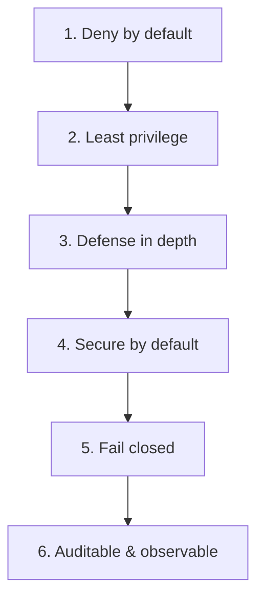

| #   | Principle              | One-line rule                                                                                           |
| --- | ---------------------- | ------------------------------------------------------------------------------------------------------- |
| 1   | Deny by default        | No explicit allow = no access. A missing role declaration is a locked door, not an open one.            |
| 2   | Least privilege        | Every actor, token, service, and DB role gets the minimum it needs and nothing more.                    |
| 3   | Defense in depth       | No single control is load-bearing; assume each layer will one day fail (§4).                            |
| 4   | Secure by default      | The safe configuration is the default; being insecure requires a deliberate, reviewed opt-out (§6).     |
| 5   | Fail closed            | On error, ambiguity, or timeout in a security decision, deny — never "allow because the check errored." |
| 6   | Auditable & observable | Every security-relevant decision is logged and can be reconstructed after the fact (§10, Part 13).      |

#### Summary

Six ordered principles — deny by default, least privilege, defense in depth, secure by default, fail closed, auditable — resolve most security design questions without further debate.

#### Best Practices

- When a design decision is unclear, apply the principles in order; the first one that gives an answer is the answer.

#### Common Mistakes

- "Fail open" convenience — e.g. letting a request through because the auth service timed out — which silently converts an outage into a breach.

#### Security Checklist

- [ ] Every new security control has a defined behavior on error, and that behavior is _deny_.

#### Production Checklist

- [ ] A load-balancer/gateway misconfig cannot bypass app-layer auth (auth is enforced in the app, not only at the edge).

---

## 3. Zero Trust Architecture

**What.** Zero Trust means there is no trusted internal network. A request from inside the Kubernetes cluster is treated with the same suspicion as one from the public internet. Identity — not network location — is the unit of trust.

**Why.** Zaroorat runs a modular monolith plus workers (ADR-0001) inside a cluster with Postgres, Redis, and MinIO. A flat "everything inside is trusted" model means one compromised pod owns everything. Zero Trust contains blast radius.

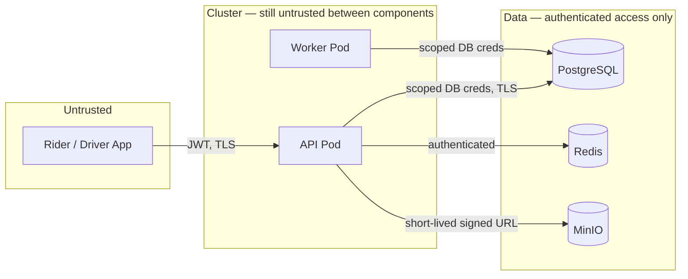

| Trust question                     | Zero Trust answer at Zaroorat                                          |
| ---------------------------------- | ---------------------------------------------------------------------- |
| Is this request from a trusted IP? | Irrelevant — verify the JWT (§25).                                     |
| Can the worker read the DB freely? | Only via its own scoped credential (Part 8), never a shared superuser. |
| Is Redis "internal, so open"?      | No — Redis requires auth and is network-policy-restricted (Part 8).    |
| Does service-to-service = trusted? | No — every hop authenticates; secrets are per-workload.                |

#### Summary

No network location confers trust; identity does. Every component-to-component hop authenticates, so one compromised pod cannot pivot freely.

#### Best Practices

- Give each workload (API, each worker type) its own credentials and network policy, so a compromise is scoped to that workload's rights.

#### Common Mistakes

- Leaving Redis, Postgres, or MinIO unauthenticated "because they're inside the cluster" — the classic flat-network breach.

#### Security Checklist

- [ ] No datastore accepts unauthenticated connections, even from inside the cluster.
- [ ] Kubernetes NetworkPolicies restrict pod-to-datastore traffic to only what's needed.

#### Production Checklist

- [ ] Each workload has distinct, least-privilege credentials (no shared "app" superuser).

---

## 4. Defense in Depth

**What.** Multiple independent controls guard the same asset, so no single failure is fatal. If validation is bypassed, the ORM's parameterization still blocks injection; if a token leaks, short lifetimes + revocation limit the window.

**Why.** Every control eventually fails — a regex is wrong, a dependency has a CVE, an engineer forgets a check. Layering means the attacker must defeat _all_ layers, not one.

The Zaroorat request pipeline is itself a defense-in-depth stack (SECURITY_GUIDE §1):

```
rate-limit → helmet/cors → auth (JWT verify) → role (authorize) → idempotency → validation → service → repository (parameterized)
```

| Asset               | Layer 1         | Layer 2                     | Layer 3                     |
| ------------------- | --------------- | --------------------------- | --------------------------- |
| A rider's trip data | JWT auth        | role check                  | ownership check in service  |
| Money mutation      | Idempotency-Key | DB unique constraint        | append-only ledger + audit  |
| SQL injection       | Zod validation  | Prisma parameterization     | least-privilege DB role     |
| Stolen access token | short TTL       | refresh rotation/revocation | anomaly detection (Part 11) |

#### Summary

Independent, layered controls guard each asset so that defeating one control is not enough to compromise it.

#### Best Practices

- For each sensitive asset, be able to name at least two independent controls; if you can only name one, add a layer.

#### Common Mistakes

- Relying on client-side validation or a single "the middleware handles it" control as the only guard for a sensitive action.

#### Security Checklist

- [ ] Ownership is checked in the service even though a role check already passed (the two are independent layers).

#### Production Checklist

- [ ] Removing any single middleware in the pipeline does not silently expose data (tested).

---

## 5. Least Privilege Principle

**What.** Every principal — a JWT, a DB connection, a worker, a MinIO client, a CI token — holds the narrowest set of permissions that lets it do its job, for the shortest time.

| Principal       | Over-privileged (wrong)       | Least privilege (right)                        |
| --------------- | ----------------------------- | ---------------------------------------------- |
| Access token    | Long-lived, all-scopes        | Short TTL, carries only `sub` + `roles` (§26)  |
| DB role for API | Postgres superuser            | CRUD on app tables only; no DDL, no `DROP`     |
| Worker          | Same creds as API             | Only the tables its jobs touch                 |
| MinIO access    | Public bucket / permanent URL | Short-lived signed URL, single object (Part 9) |
| CI/CD token     | Org admin                     | Deploy to one namespace                        |
| Ops/admin user  | Blanket data access           | Role-gated, audited, time-boxed (§14)          |

**Why.** Least privilege turns a total compromise into a partial one. A leaked worker credential that can only touch `notifications` tables cannot drain the ledger.

#### Summary

Each principal gets the minimum rights for the minimum time, so any single compromise is contained rather than catastrophic.

#### Best Practices

- Start every new credential at _zero_ permissions and add only what a failing test demands.

#### Common Mistakes

- Reusing one "application" database superuser for the API and all workers because it's convenient.

#### Security Checklist

- [ ] The API's DB role cannot run DDL or access tables outside its scope.

#### Production Checklist

- [ ] No human or workload holds standing production data access it doesn't routinely use.

---

## 6. Secure by Default

**What.** The default state of anything — a new endpoint, a new config value, a new DB column, a new dependency — is the secure state. Insecurity requires an explicit, reviewed decision.

| Surface              | Insecure-by-default (rejected) | Secure-by-default (Zaroorat)                                                                  |
| -------------------- | ------------------------------ | --------------------------------------------------------------------------------------------- |
| New route            | Public unless secured          | Requires auth + role declaration or an explicit, reviewed `public` marker (SECURITY_GUIDE §3) |
| CORS                 | `*`                            | Allow-list of known app origins                                                               |
| Cookies (where used) | Default flags                  | `HttpOnly; Secure; SameSite` (§37)                                                            |
| Errors               | Full stack trace               | Typed, sanitized envelope (ERROR_HANDLING)                                                    |
| Config               | Optional/defaulted secrets     | Fail-fast validation at boot (`config/env.schema.ts`)                                         |
| Logging              | Log everything                 | Redact PII/secrets by default (LOGGING_GUIDE)                                                 |

**Why.** Humans forget. If the safe path requires _doing_ something, it will be skipped under deadline. If the safe path is the _default_, forgetting is safe.

#### Summary

The secure configuration is the default everywhere; being insecure is possible only through a deliberate, reviewed opt-out.

#### Best Practices

- Design new primitives so the lazy path is the safe path — e.g. a route helper that demands a role argument.

#### Common Mistakes

- A route registration that defaults to public, so a forgotten annotation silently exposes an endpoint.

#### Security Checklist

- [ ] A brand-new endpoint with no security annotations is rejected (or denied), not served publicly.

#### Production Checklist

- [ ] The app refuses to boot on missing/invalid security-relevant config.

---

## 7. Security Architecture Overview

The security architecture spans four planes. Each later part of this volume drills into one.

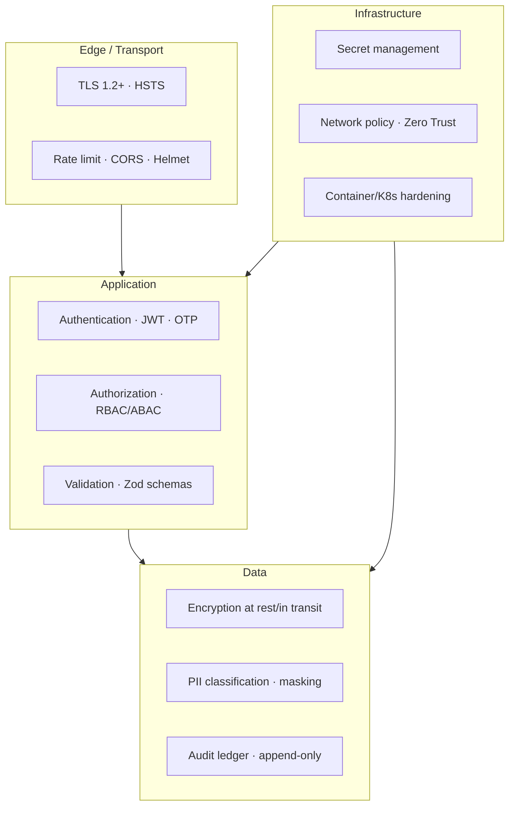

| Plane          | Owns                                       | Covered in     |
| -------------- | ------------------------------------------ | -------------- |
| Edge/Transport | TLS, rate limiting, CORS, security headers | Part 7, Part 8 |
| Application    | AuthN, AuthZ, validation, session          | Parts 3–7      |
| Data           | Encryption, PII, audit, retention          | Part 9         |
| Infrastructure | Secrets, network, container hardening      | Part 8         |

#### Summary

Security is organized into four planes — edge, application, data, infrastructure — each with clear ownership and a dedicated part of this handbook.

#### Best Practices

- When reviewing a feature, walk it through all four planes; gaps usually hide at plane boundaries (e.g. app validates but data layer over-exposes).

#### Common Mistakes

- Securing the application plane thoroughly while leaving the data or infrastructure plane (Redis, MinIO, secrets) wide open.

#### Security Checklist

- [ ] Each new feature is reviewed against all four planes, not just app-layer auth.

#### Production Checklist

- [ ] Ownership for each plane is assigned (no orphaned infrastructure security).

---

## 8. Threat Modeling

**What.** A lightweight, repeatable process to enumerate what can go wrong _before_ writing code. Zaroorat uses **STRIDE** as the checklist and keeps the output short and living.

| STRIDE category            | Question                                    | Example Zaroorat threat                     | Primary control                                 |
| -------------------------- | ------------------------------------------- | ------------------------------------------- | ----------------------------------------------- |
| **S**poofing               | Can someone pretend to be another identity? | Attacker logs in as a driver via stolen OTP | OTP rate-limit + device binding (Part 5)        |
| **T**ampering              | Can data be modified in transit/at rest?    | Modifying fare in a request                 | Server-authoritative pricing; validation        |
| **R**epudiation            | Can an action be denied later?              | Driver denies a completed trip              | Append-only `TripEvent`/ledger audit            |
| **I**nformation disclosure | Can data leak?                              | Rider location exposed to third party       | Privacy-gated location (SECURITY_GUIDE §7)      |
| **D**enial of service      | Can the system be exhausted?                | OTP/login flooding                          | Rate limiting; SOS exempt but bounded           |
| **E**levation of privilege | Can a low role gain a high one?             | Rider forges `admin` role in JWT            | Signed tokens; server-side role source of truth |

**Process.** For each new feature: (1) draw the data flow, (2) mark trust boundaries, (3) run STRIDE at each boundary, (4) record threats + chosen mitigations in the module's design note, (5) revisit when the flow changes.

#### Summary

Every feature gets a short STRIDE pass at each trust boundary, with threats and mitigations recorded before implementation.

#### Best Practices

- Keep threat models one page and living; a 40-page document written once and never reopened protects nothing.

#### Common Mistakes

- Threat-modeling only the "auth feature" and skipping money, location, and admin flows where the real harm lives.

#### Security Checklist

- [ ] A STRIDE pass exists for every feature that touches money, location, identity, or admin.

#### Production Checklist

- [ ] Threat model updated in the same PR when a data flow or trust boundary changes.

---

## 9. Security Design Process

Security is designed in, at four gates, mirroring the SDLC.

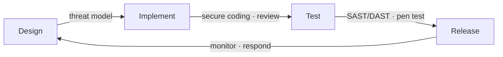

| Gate      | Security activity                                  | Artifact                              |
| --------- | -------------------------------------------------- | ------------------------------------- |
| Design    | Threat model (§8), auth/authz decision             | 1-page threat note                    |
| Implement | Secure coding standards (Part 12), deny-by-default | Code + tests                          |
| Review    | Security review checklist per PR                   | SECURITY_GUIDE per-endpoint checklist |
| Release   | Dependency scan, secret scan, config validation    | CI gate (Part 12)                     |
| Operate   | Monitoring, alerting, incident response            | Part 13                               |

#### Summary

Security is enforced at five SDLC gates — design, implement, review, release, operate — each with a concrete required artifact.

#### Best Practices

- Make the security gate a CI check, not a hope; a required status check is harder to skip than a reviewer's memory.

#### Common Mistakes

- Bolting on a security review only at release, when redesigning is expensive and deadlines make "ship it" the default.

#### Security Checklist

- [ ] Each gate's artifact exists before the feature advances to the next gate.

#### Production Checklist

- [ ] CI blocks merge on failing dependency/secret scans.

---

## 10. Security Governance

**What.** The rules for who decides, who reviews, and how security exceptions are handled — so security scales past one careful engineer.

| Governance element | Zaroorat rule                                                                                       |
| ------------------ | --------------------------------------------------------------------------------------------------- |
| Ownership          | Engineering owns security; every endpoint has an author accountable for its security decision       |
| Exceptions         | An insecure choice requires a written, time-boxed exception with an owner and expiry — never silent |
| Decision records   | Architecturally significant security decisions get an ADR (e.g. ADR-0008 idempotency)               |
| Access reviews     | Standing production/admin access is reviewed periodically and revoked when unused (§5)              |
| Secret rotation    | Credentials rotate on schedule and immediately on suspected exposure (SECURITY_GUIDE §5)            |
| Vulnerability SLAs | Severity-based fix windows (Part 12)                                                                |

#### Summary

Governance makes security repeatable and accountable: clear ownership, written time-boxed exceptions, ADRs for big decisions, and periodic access reviews.

#### Best Practices

- Require every security exception to carry an expiry date; "temporary" without a date becomes permanent.

#### Common Mistakes

- Security living entirely in one engineer's head, so standards erode the moment they're on vacation.

#### Security Checklist

- [ ] Every active security exception has an owner and an expiry.

#### Production Checklist

- [ ] Admin/production access list reviewed on schedule; stale grants revoked.

---

# Part 2 — Identity Management

## 11. Identity Overview

**What.** Identity is the durable answer to "who is this actor?", separate from authentication ("prove it now") and authorization ("what may they do?"). At Zaroorat the canonical identity record is the `users` account (phase-0); `riders` and `drivers` are role-specific profiles attached to it.

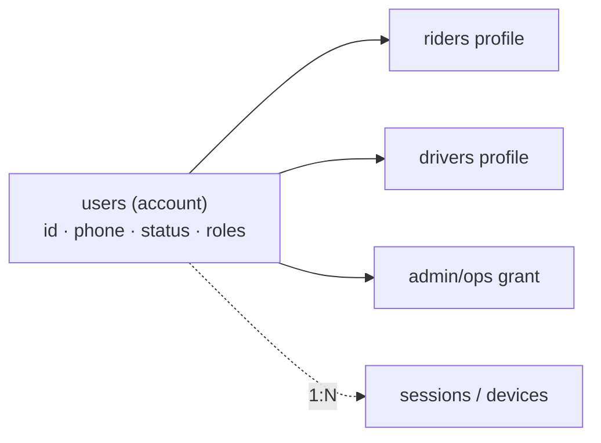

| Concept          | Owner module         | Notes                                                     |
| ---------------- | -------------------- | --------------------------------------------------------- |
| Account identity | `users`              | One record per human; phone is the primary identifier     |
| Rider identity   | `riders`             | Profile, saved places, preferences                        |
| Driver identity  | `drivers`            | Profile, compliance, availability                         |
| Admin identity   | `admin` / role grant | Elevated, audited (§14)                                   |
| Credentials      | `auth`               | OTP challenges, tokens, sessions — never PII in the token |

#### Summary

Identity (the durable account in `users`) is distinct from authentication and authorization; rider/driver/admin are roles and profiles attached to one account.

#### Best Practices

- Model one human as one `users` account with multiple role profiles, not separate accounts per role.

#### Common Mistakes

- Conflating identity with authentication — e.g. treating "has a valid token" as "is a known, verified identity."

#### Security Checklist

- [ ] A single human cannot silently hold two unrelated accounts to bypass limits (phone uniqueness enforced).

#### Production Checklist

- [ ] `users.phone` (or equivalent identifier) has a DB uniqueness constraint.

---

## 12. User Identity Lifecycle

The rider/user account moves through explicit states; transitions are server-controlled and audited.

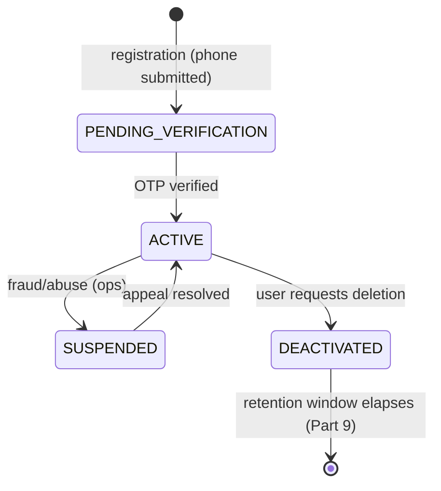

| State                | Can authenticate? | Can request rides? | Notes                                  |
| -------------------- | ----------------- | ------------------ | -------------------------------------- |
| PENDING_VERIFICATION | no                | no                 | Awaiting OTP                           |
| ACTIVE               | yes               | yes                | Normal                                 |
| SUSPENDED            | no                | no                 | Ops action, audited, reversible        |
| DEACTIVATED          | no                | no                 | Soft-deleted; PII purged per retention |

#### Summary

User accounts follow an explicit, audited state machine from pending verification through active, suspended, and deactivation.

#### Best Practices

- Drive every state change through the `users` service so the transition is validated and logged in one place.

#### Common Mistakes

- Deleting a user row on account deletion, orphaning trips and ledger entries; use soft-delete + retention instead (DATABASE_GUIDE).

#### Security Checklist

- [ ] A SUSPENDED account cannot obtain new tokens or refresh existing ones.

#### Production Checklist

- [ ] Account state transitions are audited with actor + `requestId`.

---

## 13. Driver Identity Lifecycle

A driver identity carries a compliance dimension a rider does not: a driver may authenticate yet still be barred from going online.

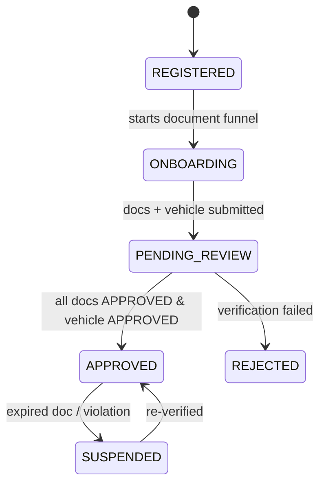

Two orthogonal axes must both be satisfied to be **operable** (FEATURE_CATALOG): authenticated identity **and** compliance (all required docs `APPROVED` & non-expired, ≥1 vehicle `APPROVED`). Authentication alone never grants operability.

| Gate          | Source of truth                 | Enforced where                     |
| ------------- | ------------------------------- | ---------------------------------- |
| Authenticated | `auth` (valid token)            | `middleware/auth.ts`               |
| Operable      | `documents` + `vehicles` status | `drivers` service / dispatch guard |

#### Summary

A driver's identity has a compliance axis: being authenticated is necessary but not sufficient to go online — operability requires approved, non-expired documents and an approved vehicle.

#### Best Practices

- Keep authentication and operability as separate checks; never infer "can drive" from "is logged in."

#### Common Mistakes

- Letting a driver with an expired license go online because the token was still valid.

#### Security Checklist

- [ ] Operability is re-evaluated server-side at go-online and at dispatch, not cached indefinitely.

#### Production Checklist

- [ ] Document expiry flips a driver non-operable via a worker sweep (EVENT_CATALOG `document.expiring`).

---

## 14. Admin Identity Lifecycle

Admin/ops identities are the highest-value target: they can read other users' private data and act across domains. They are held to a stricter standard than rider/driver identities.

| Control        | Rider/Driver    | Admin/Ops                                               |
| -------------- | --------------- | ------------------------------------------------------- |
| Authentication | OTP             | OTP **+ mandatory second factor** (TOTP, Part 5)        |
| Privilege      | Own data        | Cross-user, role-gated                                  |
| Session length | Standard        | Shorter; re-auth for sensitive actions                  |
| Audit          | Security events | **Every** data access & action logged (who/what/when)   |
| Provisioning   | Self-service    | Granted by an existing admin; time-boxed where possible |
| Deprovisioning | User-initiated  | Immediate on role removal; tokens revoked               |

**Why.** Admin access is where "insider threat" and "compromised employee laptop" become breaches of _many_ users at once. Least privilege (§5) and auditing (§10) are non-negotiable here.

#### Summary

Admin identities get stricter controls than users: mandatory second factor, shorter sessions, full audit of every access, and admin-granted, revocable provisioning.

#### Best Practices

- Log admin _reads_ of user data, not just writes — unauthorized surveillance is a read-only attack.

#### Common Mistakes

- Giving ops a shared admin login, destroying attribution and making revocation impossible.

#### Security Checklist

- [ ] Admin accounts require a second factor and cannot be shared.
- [ ] Every admin access to another user's private data is audited.

#### Production Checklist

- [ ] Removing an admin role immediately revokes active tokens/sessions.

---

## 15. Identity Verification

Verification binds a claimed identity to something the actor controls. Zaroorat verifies progressively — more assurance is required as the stakes rise.

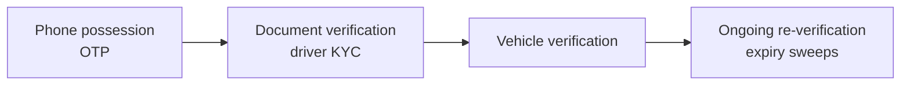

| Level            | What it proves                  | Required for                  |
| ---------------- | ------------------------------- | ----------------------------- |
| Phone possession | Controls the phone number       | Any account (§17)             |
| Email (optional) | Controls an email               | Notifications, recovery (§16) |
| Document (KYC)   | Real-world identity/eligibility | Driver operability (§18)      |
| Vehicle          | Vehicle is registered/approved  | Driver operability            |

#### Summary

Identity is verified progressively — phone, then documents/vehicle for drivers — with assurance scaled to the stakes of the action.

#### Best Practices

- Require only the assurance a given action needs; forcing full KYC on a rider to book a ride adds friction without proportional risk reduction.

#### Common Mistakes

- Treating one verification (phone) as proof of a stronger claim (real-world identity) it doesn't support.

#### Security Checklist

- [ ] Each privileged action states the verification level it requires.

#### Production Checklist

- [ ] Verification status is stored server-side and re-checked, never trusted from the client.

---

## 16. Email Verification

**What.** Optional at Zaroorat (phone is primary), email is a secondary channel for receipts, notifications, and account-recovery signals. When present it must be verified before it's trusted.

**Flow.** Issue a single-use, time-limited, cryptographically random token (not a guessable sequence); deliver via email; verify server-side; mark `emailVerifiedAt`. Never treat an unverified email as a recovery or identity factor.

| Risk                                  | Prevention                                                      |
| ------------------------------------- | --------------------------------------------------------------- |
| Token guessing                        | ≥128-bit random token, single-use, short TTL                    |
| Token in logs/referrer                | Don't log full token; use POST confirmation, not just GET links |
| Account takeover via unverified email | Never allow recovery/notifications to an unverified address     |
| Email enumeration                     | Generic response whether or not the address exists              |

#### Summary

Email is a secondary, optional channel; it is trusted only after a single-use, time-limited, random-token verification, and never used for recovery until verified.

#### Best Practices

- Store `emailVerifiedAt` and gate every email-dependent feature on it.

#### Common Mistakes

- Sending sensitive links or enabling recovery to an email that was never verified.

#### Security Checklist

- [ ] Verification tokens are single-use, random, short-lived, and not logged.

#### Production Checklist

- [ ] Unverified emails cannot be used as an authentication or recovery factor.

---

## 17. Phone Verification

Phone is the **primary** identifier and the anchor of the OTP login flow (Part 5). Verifying possession of the phone is the baseline identity proof.

```mermaid
sequenceDiagram
    participant App
    participant API
    participant Redis
    participant SMS as SMS Provider
    App->>API: POST /auth/otp/request { phone }
    API->>API: validate + rate-limit (per phone/device/IP)
    API->>Redis: store OtpChallenge (codeHash, expiresAt, attempts=0)
    API->>SMS: send code (provider behind interface, ADR-0007)
    API-->>App: 202 Accepted (generic)
    App->>API: POST /auth/otp/verify { phone, code }
    API->>Redis: load challenge; check attempts, expiry
    API->>API: constant-time compare hash; mark consumed
    API-->>App: tokens (access + refresh) or generic failure
```

Key rules: store only a **hash** of the code (`OtpChallenge.codeHash`), enforce `attempts` and `expiresAt`, mark `consumedAt` on success, and keep responses generic to avoid enumeration. Full OTP fraud/rate-limit detail is Part 5.

#### Summary

Phone possession is the baseline identity proof via a hashed, expiring, attempt-limited, single-use OTP challenge stored server-side.

#### Best Practices

- Store `codeHash`, never the plaintext OTP; compare in constant time.

#### Common Mistakes

- Returning different responses for "unknown phone" vs "wrong code," enabling account enumeration.

#### Security Checklist

- [ ] OTP is single-use, hashed at rest, attempt-limited, and time-limited.

#### Production Checklist

- [ ] OTP request and verify are independently rate-limited (Part 5).

---

## 18. KYC Readiness

**What.** Know-Your-Customer / driver eligibility verification. Zaroorat's `documents` and `onboarding` modules already model document types, statuses, expiry, and review — this section defines the security posture around that data, and readiness for a formal KYC provider later.

| Concern       | Readiness rule                                                                                                                   |
| ------------- | -------------------------------------------------------------------------------------------------------------------------------- |
| Storage       | KYC documents live in object storage (MinIO) behind short-lived signed URLs, never public, never as DB blobs (SECURITY_GUIDE §7) |
| Access        | Document review is an audited, role-gated ops action (§14)                                                                       |
| Retention     | Documents follow the per-market retention policy (🔴 open decision — FEATURE_CATALOG §5)                                         |
| Provider swap | KYC/identity provider sits behind an interface (ADR-0007) so it's swappable                                                      |
| Minimization  | Store only what eligibility requires; classify as sensitive PII (Part 9)                                                         |

#### Summary

KYC data is high-sensitivity PII stored in signed-URL object storage, accessed only through audited ops actions, and retained per the market policy — with provider abstraction for future formal KYC.

#### Best Practices

- Treat every KYC document as sensitive PII from day one, even before a formal KYC vendor is integrated.

#### Common Mistakes

- Storing document images in a public bucket or embedding them in the database.

#### Security Checklist

- [ ] KYC documents are never publicly reachable and every access is audited.

#### Production Checklist

- [ ] Retention/deletion of KYC data is implemented per the finalized market policy.

---

## 19. Device Identity

**What.** A stable, privacy-respecting identifier for the client device, used to bind sessions, detect anomalies, and power trusted-device flows (§20) and fraud signals (Part 11).

| Property   | Rule                                                                                                    |
| ---------- | ------------------------------------------------------------------------------------------------------- |
| Derivation | Device id is server-registered per login context, associated with a session, not a raw hardware serial  |
| Privacy    | Don't collect immutable hardware identifiers where avoidable; prefer app-generated, resettable IDs      |
| Binding    | A refresh token/session is bound to its device id; using it from a wildly different context is a signal |
| Storage    | Device metadata (model, OS, first/last seen) stored server-side for risk scoring                        |

**Why.** Device identity lets Zaroorat notice "this refresh token is suddenly used from a new device in another country" (§29, Part 11) without relying on the client to be honest.

#### Summary

Device identity is a server-tracked, privacy-conscious identifier bound to sessions, enabling trusted-device and anomaly-detection features without harvesting immutable hardware IDs.

#### Best Practices

- Bind refresh tokens to a device id so a stolen token used elsewhere becomes detectable.

#### Common Mistakes

- Trusting a client-supplied device id as authoritative, or harvesting privacy-invasive hardware identifiers.

#### Security Checklist

- [ ] Refresh tokens are associated with a device/session context.

#### Production Checklist

- [ ] Device metadata is available to the risk-scoring pipeline (Part 11).

---

## 20. Trusted Devices

**What.** A device the user has explicitly confirmed, on which step-up friction (e.g. repeated second factors) can be safely reduced — without lowering the security floor.

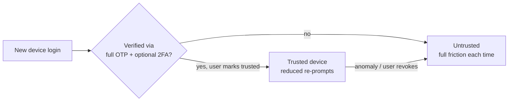

| Rule                           | Rationale                                                         |
| ------------------------------ | ----------------------------------------------------------------- |
| Trust is opt-in and revocable  | User controls it; revocation is immediate                         |
| Trust has an expiry            | Bounded so a lost-but-trusted device doesn't stay trusted forever |
| Trust never bypasses core auth | It reduces re-prompts, never skips token verification             |
| Anomaly revokes trust          | Impossible travel / new-network signals drop trust (Part 11)      |

#### Summary

Trusted devices reduce repeat friction on user-confirmed, revocable, expiring devices — but never lower the baseline of per-request token verification.

#### Best Practices

- Let trust reduce _re-prompts_, never replace the underlying authentication check.

#### Common Mistakes

- Making a "trusted device" a permanent bypass that survives credential theft or device loss.

#### Security Checklist

- [ ] Trusted-device status is revocable by the user and expires automatically.

#### Production Checklist

- [ ] A revoked or anomalous trusted device reverts to full authentication friction immediately.

---

# Part 3 — Authentication

## 21. Authentication Architecture

**What.** Authentication proves the actor's identity for a given request. Zaroorat is **passwordless** (phone + OTP) for riders/drivers, issuing short-lived JWT access tokens plus rotating refresh tokens, verified statelessly on every request (SECURITY_GUIDE §2).

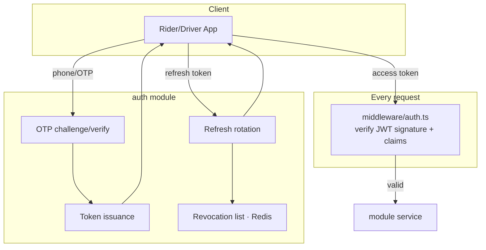

| Property       | Choice                                 | Rationale                                                  |
| -------------- | -------------------------------------- | ---------------------------------------------------------- |
| Primary factor | Phone + OTP                            | No passwords to leak/reuse; fits mobile market (VOLUME_00) |
| Token type     | JWT (access) + opaque/rotating refresh | Stateless verification + revocable long-lived credential   |
| Verification   | Per request, server-side               | Zero Trust (§3)                                            |
| Second factor  | TOTP for admin (Part 5)                | Elevated protection for high-value identities              |

#### Summary

Zaroorat authenticates passwordlessly with phone+OTP, issuing short-lived JWT access tokens and rotating refresh tokens verified statelessly on every request.

#### Best Practices

- Keep authentication logic entirely in the `auth` module; other modules consume identity via middleware, never re-implement it.

#### Common Mistakes

- Scattering token parsing/verification across modules instead of one middleware, causing inconsistent enforcement.

#### Security Checklist

- [ ] Every non-public route passes through `middleware/auth.ts`.

#### Production Checklist

- [ ] Token signing keys are managed as secrets and rotatable (Part 8).

---

## 22. Login Flow

Login = prove phone possession via OTP, then receive tokens.

```mermaid
sequenceDiagram
    participant App
    participant API
    participant Auth as auth service
    participant Redis
    App->>API: POST /auth/otp/request { phone }
    API->>Auth: rate-limit check (phone/device/IP)
    Auth->>Redis: create OtpChallenge (hash, ttl)
    API-->>App: 202 (generic)
    App->>API: POST /auth/otp/verify { phone, code, deviceId }
    API->>Auth: verify (attempts, expiry, constant-time)
    Auth->>Redis: mark consumed; create session
    Auth-->>App: { accessToken, refreshToken }
    Note over App,API: subsequent calls send accessToken; auth middleware verifies
```

Login responses are **generic on failure** (no "phone not found" vs "wrong code") and both request and verify are rate-limited (Part 5).

#### Summary

Login is a two-step OTP exchange (request → verify) that returns an access + refresh token pair and creates a device-bound session, with generic failure responses.

#### Best Practices

- Bind the created session to the submitted `deviceId` for later anomaly detection (§19).

#### Common Mistakes

- Leaking account existence through distinct error messages or timing on the verify step.

#### Security Checklist

- [ ] Failed login/verify is throttled and logged (SECURITY_GUIDE §2).

#### Production Checklist

- [ ] Successful login records a session with device + timestamp.

---

## 23. Registration Flow

Registration and login converge on the same OTP mechanism: a first-time phone creates a `PENDING_VERIFICATION` account that becomes `ACTIVE` on first successful OTP.

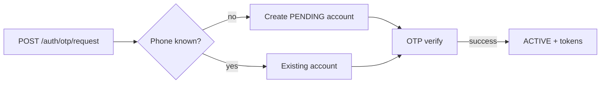

Because request/response are identical whether or not the phone is new, registration **cannot be used to enumerate** existing accounts. Role assignment (rider vs driver) happens through the appropriate profile flow, not by client claim.

#### Summary

Registration reuses the OTP flow — a new phone yields a pending account that activates on first OTP — and is designed to be indistinguishable from login to prevent enumeration.

#### Best Practices

- Assign roles server-side through profile creation, never from a client-supplied role field.

#### Common Mistakes

- Accepting a `role` field from the registration request, letting a client self-assign `admin` or `driver`.

#### Security Checklist

- [ ] Roles are never set from client input at registration.

#### Production Checklist

- [ ] New accounts start in `PENDING_VERIFICATION` and require OTP to activate.

---

## 24. Passwordless Authentication

**What & Why.** Zaroorat deliberately has **no passwords** for riders/drivers. Passwords are the single largest source of credential breaches (reuse, phishing, weak choices, database leaks). Removing them removes an entire category of attack.

| Benefit                             | Trade-off / mitigation                                                         |
| ----------------------------------- | ------------------------------------------------------------------------------ |
| No password database to breach      | SMS/OTP delivery dependency → provider abstraction + email/TOTP fallback path  |
| No reuse/phishing of static secrets | OTP interception risk (SIM swap) → device binding, anomaly detection (Part 11) |
| Lower user friction                 | SMS cost/latency → rate-limit + resend backoff (Part 5)                        |
| Nothing to "reset"                  | Account recovery = re-prove phone possession                                   |

**Alternatives considered:** password+OTP (rejected: reintroduces password risk for marginal gain), magic links (rejected: email isn't the primary channel), WebAuthn/passkeys (a strong future option, tracked for roadmap).

#### Summary

Passwordless phone+OTP eliminates the largest class of credential breaches; the residual risks (SMS delivery, SIM swap) are mitigated by provider abstraction, device binding, and anomaly detection.

#### Best Practices

- Keep a fallback authentication channel (email OTP/TOTP) designed in, so SMS outages don't lock everyone out.

#### Common Mistakes

- Re-introducing an optional password "for convenience," recreating the exact risk passwordless removed.

#### Security Checklist

- [ ] No password field exists for rider/driver accounts.

#### Production Checklist

- [ ] A documented recovery path exists that doesn't depend on a single SMS provider.

---

## 25. JWT Architecture

**What.** A JSON Web Token is a signed, self-describing credential. Zaroorat access tokens are JWTs carrying minimal claims, signed so any API instance can verify them without a database lookup (stateless — §38).

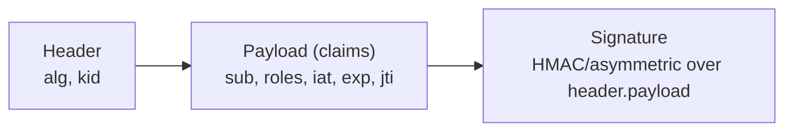

| Claim         | Purpose             | Rule                                           |
| ------------- | ------------------- | ---------------------------------------------- |
| `sub`         | user id             | Required; the identity                         |
| `roles`       | authorization roles | Minimal; server is source of truth (§60)       |
| `iat` / `exp` | issued/expiry       | Short TTL for access (§26)                     |
| `jti`         | token id            | Enables targeted revocation (§29)              |
| ~~PII~~       | —                   | **Never** — no phone, email, name in the token |

**Algorithm.** Use a strong, explicitly pinned algorithm; **reject `alg: none`** and never let the token header dictate the verification algorithm (classic JWT bypass). Prefer asymmetric signing (private key signs, public key verifies) so verification doesn't require distributing the signing secret.

#### Summary

Access tokens are minimally-claimed, short-lived, signed JWTs with a pinned algorithm and a `jti` for revocation — carrying identity and roles but never PII.

#### Best Practices

- Pin the accepted algorithm server-side and ignore the token's own `alg` header when choosing how to verify.

#### Common Mistakes

- Accepting `alg: none` or letting the header choose the algorithm, enabling signature-bypass forgery.

#### Security Checklist

- [ ] Tokens carry no PII; `alg: none` and header-chosen algorithms are rejected.

#### Production Checklist

- [ ] Signing keys support rotation via `kid` without invalidating all tokens at once.

---

## 26. Access Tokens

**What.** The short-lived credential presented on every API/socket request. Compromise window is bounded by its short TTL.

| Property         | Value/rule                                                                               |
| ---------------- | ---------------------------------------------------------------------------------------- |
| Lifetime         | Short (minutes–low tens of minutes); exact value in `JWT_ACCESS_TTL` (ENVIRONMENT_GUIDE) |
| Storage (mobile) | Secure device storage (Keychain/Keystore), never plaintext                               |
| Transport        | `Authorization: Bearer <token>` over TLS only                                            |
| Revocation       | Primarily via short TTL; `jti` blocklist for emergencies (§29)                           |
| Contents         | `sub`, `roles`, `iat`, `exp`, `jti` — no PII                                             |

**Why short.** A leaked access token is only useful until it expires; short TTL turns "permanent compromise" into "a few minutes," with the refresh token (revocable) handling continuity.

#### Summary

Access tokens are short-lived, minimally-scoped bearer credentials stored in secure device storage and sent only over TLS, bounding the damage of any leak.

#### Best Practices

- Keep access TTL short and lean on refresh rotation for continuity, rather than long-lived access tokens.

#### Common Mistakes

- Long-lived access tokens "to reduce refresh calls," turning any leak into lasting account access.

#### Security Checklist

- [ ] Access token TTL is short and configured, not hardcoded to hours/days.

#### Production Checklist

- [ ] Clients store access tokens in platform secure storage, never in plaintext/local storage.

---

## 27. Refresh Tokens

**What.** A longer-lived, **revocable** credential used only to obtain new access tokens — never to call business endpoints.

| Property   | Rule                                                                |
| ---------- | ------------------------------------------------------------------- |
| Scope      | Only the `/auth/refresh` endpoint; useless elsewhere                |
| Lifetime   | Longer than access, still bounded (`JWT_REFRESH_TTL`)               |
| Storage    | Secure storage; if cookie-based, `HttpOnly; Secure; SameSite` (§37) |
| Binding    | Bound to a device/session (§19, §31)                                |
| Rotation   | Rotates on every use (§28)                                          |
| Revocation | Server-tracked so it can be invalidated (§29)                       |

**Why revocable.** Because it lives longer, the refresh token is the higher-value target; making it server-tracked and rotating is what lets Zaroorat actually kill a session on logout, theft, or suspension.

#### Summary

Refresh tokens are longer-lived, device-bound, rotating, server-tracked credentials usable only to mint access tokens — the revocable anchor of a session.

#### Best Practices

- Reject a refresh token presented to any endpoint other than the refresh endpoint.

#### Common Mistakes

- Treating the refresh token like an access token (accepting it on business endpoints), widening its attack surface.

#### Security Checklist

- [ ] Refresh tokens are server-tracked and revocable, not stateless-only.

#### Production Checklist

- [ ] A refresh token only works at the refresh endpoint.

---

## 28. Token Rotation

**What.** Every time a refresh token is used, it is invalidated and a new one issued (refresh-token rotation). Reuse of an already-rotated token signals theft.

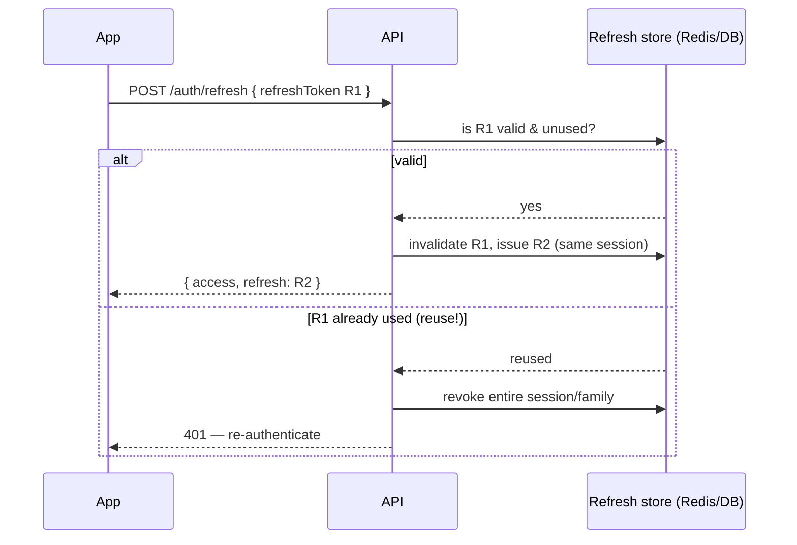

**Reuse detection.** If a rotated token is presented again, the whole token family/session is revoked — because either an attacker or the legitimate user is replaying a stolen token, and revoking is the safe response.

#### Summary

Refresh tokens rotate on every use; presenting an already-used token is treated as theft and revokes the entire session family.

#### Best Practices

- Track a session/family id so reuse detection can revoke all descendants, not just one token.

#### Common Mistakes

- Rotating tokens but not revoking on reuse, discarding the main security benefit of rotation.

#### Security Checklist

- [ ] Reuse of a rotated refresh token revokes the whole session family and forces re-auth.

#### Production Checklist

- [ ] Rotation and reuse-detection are covered by automated tests.

---

## 29. Token Revocation

**What.** The ability to invalidate credentials before expiry — essential for logout, suspension, theft, and admin deprovisioning.

| Credential    | Revocation mechanism                                              |
| ------------- | ----------------------------------------------------------------- |
| Refresh token | Server-tracked; deleted/blacklisted on logout/theft/suspension    |
| Access token  | Short TTL is primary; `jti` blocklist in Redis for emergency kill |
| Session       | Session record invalidated → its tokens stop working              |
| All-of-user   | "Log out everywhere" revokes all sessions for a `sub`             |

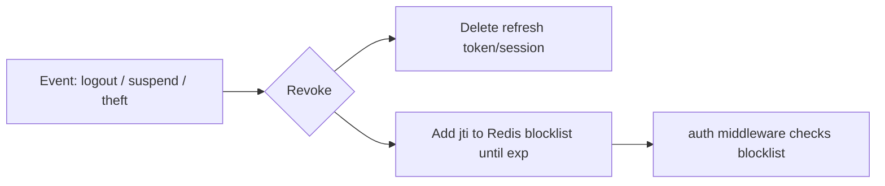

**Trade-off.** Pure stateless JWTs can't be revoked; a small Redis-backed blocklist (only until `exp`) restores revocability at minimal cost — a deliberate, bounded exception to statelessness.

#### Summary

Revocation combines short access-token TTLs, a bounded Redis `jti` blocklist for emergencies, and server-tracked refresh tokens/sessions, enabling logout, suspension, and "log out everywhere."

#### Best Practices

- Keep the access-token blocklist small by relying on short TTLs; only emergency-revoked `jti`s live there, and only until they'd expire anyway.

#### Common Mistakes

- Claiming "stateless JWTs, so we can't revoke" and therefore being unable to kill a compromised or suspended session.

#### Security Checklist

- [ ] Suspending an account and logging out both immediately stop token use.

#### Production Checklist

- [ ] "Log out everywhere" revokes all of a user's sessions.

---

## 30. Session Management

**What.** A session is the server-side record tying an authenticated identity to a device, its refresh-token family, and metadata (created, last-seen, IP/device). Tokens are the credentials; the session is the revocable anchor.

| Session attribute          | Use                               |
| -------------------------- | --------------------------------- |
| `sessionId`                | Anchor for rotation/revocation    |
| `userId` (`sub`)           | Owner                             |
| `deviceId`                 | Binding + anomaly detection (§19) |
| `createdAt` / `lastSeenAt` | Expiry + risk signals             |
| `status`                   | active / revoked                  |

Sessions make the abstract "logged in" concrete and manageable: listable ("your active sessions"), revocable individually or en masse, and observable for anomaly detection.

#### Summary

A session is the server-side, revocable record binding identity, device, and refresh-token family — the manageable unit behind "being logged in."

#### Best Practices

- Let users view and revoke their own active sessions ("active devices" screen).

#### Common Mistakes

- Having only tokens and no session concept, so there's nothing to list, bound, or revoke coherently.

#### Security Checklist

- [ ] Every session is individually revocable and tied to a device.

#### Production Checklist

- [ ] Users can see and revoke their active sessions.

---

## 31. Device Sessions

Each device gets its own session and refresh-token family, so actions on one device don't disturb another and revocation is surgical.

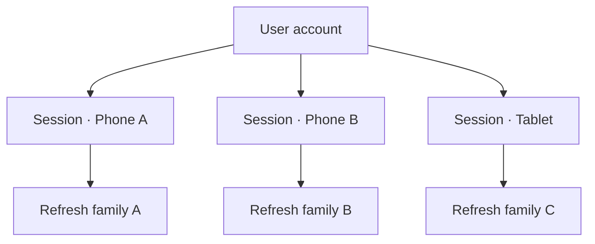

| Rule                        | Benefit                                        |
| --------------------------- | ---------------------------------------------- |
| One session per device      | Revoke a lost phone without logging out others |
| Family per session          | Rotation reuse-detection scoped per device     |
| Device metadata per session | Per-device risk scoring (Part 11)              |

#### Summary

Authentication is tracked per device as independent sessions and token families, enabling surgical revocation and per-device risk signals.

#### Best Practices

- Scope refresh rotation/reuse-detection to the device session so one device's replay doesn't nuke every device unnecessarily — unless the account itself is compromised.

#### Common Mistakes

- One global session per user, so logging out or losing one device forces re-login everywhere or leaves a lost device active.

#### Security Checklist

- [ ] Revoking one device's session leaves other devices' sessions intact.

#### Production Checklist

- [ ] Device sessions carry metadata for the risk pipeline.

---

## 32. Logout Strategy

**What.** Logout must actually end the credential's usefulness, not just discard it client-side.

| Logout type            | Server action                                                                    |
| ---------------------- | -------------------------------------------------------------------------------- |
| This device            | Revoke this session + refresh family; blocklist current access `jti` until `exp` |
| All devices            | Revoke all sessions for the user                                                 |
| Forced (suspend/theft) | Same as all-devices, initiated by ops/system                                     |

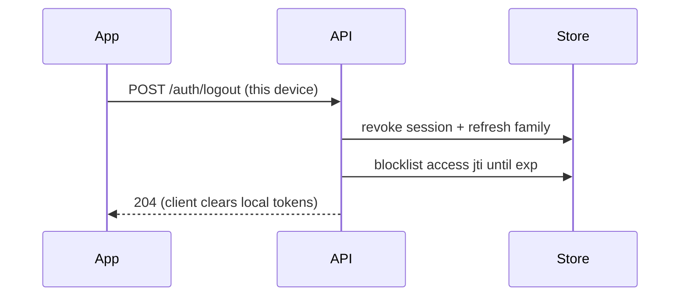

**Why server-side.** Client-only logout (just deleting the token) leaves a still-valid credential that a thief who already copied it can keep using.

#### Summary

Logout revokes the server-side session and refresh family (and blocklists the live access token), so a copied credential stops working — client-side token deletion alone is insufficient.

#### Best Practices

- Offer both "log out this device" and "log out everywhere," backed by real server-side revocation.

#### Common Mistakes

- Implementing logout as client-side token deletion only, leaving stolen copies valid.

#### Security Checklist

- [ ] Logout revokes server-side session state, not just the client copy.

#### Production Checklist

- [ ] Post-logout, the old refresh token and (blocklisted) access token are rejected.

---

## 33. Multi-Device Login

Users legitimately run Zaroorat on several devices. This is supported (§31) while staying observable.

| Rule                                 | Rationale                                         |
| ------------------------------------ | ------------------------------------------------- |
| Multiple concurrent sessions allowed | Real users have phone + tablet, or upgrade phones |
| Each is independent                  | Surgical revocation (§31)                         |
| New-device login is a signal         | Notify user; feed risk scoring (Part 11)          |
| Optional cap                         | Configurable max concurrent sessions (§36)        |

#### Summary

Multiple devices are supported as independent sessions, with new-device logins treated as a notify-and-score security signal.

#### Best Practices

- Notify the user on a login from a new device, giving them a chance to catch account takeover early.

#### Common Mistakes

- Silently allowing unlimited new-device logins with no signal, so takeovers go unnoticed.

#### Security Checklist

- [ ] New-device logins generate a user-visible notification and a risk signal.

#### Production Checklist

- [ ] Multi-device sessions are independently revocable.

---

## 34. Remember Me

**What.** "Remember me" extends convenience by keeping the refresh token available across app restarts — it does **not** extend the access token's short life or weaken verification.

| Aspect             | Rule                                                            |
| ------------------ | --------------------------------------------------------------- |
| What it extends    | Refresh-token persistence in secure storage, longer refresh TTL |
| What it never does | Lengthen access-token TTL; skip per-request verification        |
| Security floor     | Still device-bound, revocable, rotation-protected               |
| Sensitive actions  | May still require step-up re-auth regardless of "remember me"   |

#### Summary

"Remember me" persists the revocable refresh token for convenience without lengthening access-token life or bypassing per-request verification.

#### Best Practices

- Keep sensitive actions (payout changes, admin ops) behind step-up auth even on a "remembered" session.

#### Common Mistakes

- Implementing "remember me" as a very long-lived access token, removing the short-TTL safety net.

#### Security Checklist

- [ ] "Remember me" never extends access-token TTL or disables verification.

#### Production Checklist

- [ ] Remembered sessions remain fully revocable.

---

## 35. Session Expiration

Sessions expire on multiple independent triggers, whichever comes first.

| Trigger            | Behavior                                                    |
| ------------------ | ----------------------------------------------------------- |
| Access-token `exp` | Client silently refreshes (§27)                             |
| Refresh-token TTL  | Session ends; full re-auth required                         |
| Idle timeout       | No activity for a threshold → session expires               |
| Absolute lifetime  | Hard cap regardless of activity                             |
| Security event     | Suspend/theft/password-equivalent change → immediate expiry |

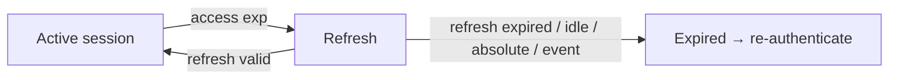

#### Summary

Sessions end on the earliest of access/refresh expiry, idle timeout, absolute lifetime, or a security event — bounding how long any credential stays live.

#### Best Practices

- Enforce both an idle timeout and an absolute maximum lifetime; each catches a different risk.

#### Common Mistakes

- Only expiring on token TTL, so a continuously-refreshed session lives forever.

#### Security Checklist

- [ ] Sessions have an absolute maximum lifetime independent of refresh activity.

#### Production Checklist

- [ ] Idle and absolute timeouts are configured and enforced server-side.

---

## 36. Concurrent Sessions

**What.** Policy for how many sessions a user may hold at once and what happens at the limit.

| Policy    | Description                             | Use                          |
| --------- | --------------------------------------- | ---------------------------- |
| Unlimited | No cap; rely on visibility + revocation | Default riders               |
| Capped    | Max N; oldest revoked on N+1            | Optional / higher-risk roles |
| Single    | One session; new login ends old         | Admin-optional / step-up     |

Admins (§14) trend toward tighter concurrency limits and shorter sessions; riders/drivers favor convenience with strong observability.

#### Summary

Concurrent-session policy is configurable per role — from unlimited-with-visibility for riders to capped/single-session for admins.

#### Best Practices

- Tighten concurrency for high-privilege roles where the convenience cost is low and the risk is high.

#### Common Mistakes

- A single global concurrency policy that's either too loose for admins or too strict for multi-device riders.

#### Security Checklist

- [ ] High-privilege roles have tighter concurrency limits than end users.

#### Production Checklist

- [ ] Concurrency policy is enforced server-side, not just in the UI.

---

## 37. Secure Cookie Strategy

Zaroorat's primary clients are native apps using `Authorization: Bearer` headers, so cookies are secondary. **When** cookies are used (e.g. a web ops console, refresh-token storage), they follow strict flags.

| Flag            | Value           | Why                                           |
| --------------- | --------------- | --------------------------------------------- |
| `HttpOnly`      | on              | JS cannot read it → XSS can't steal the token |
| `Secure`        | on              | Sent only over HTTPS                          |
| `SameSite`      | `Strict`/`Lax`  | Mitigates CSRF (§77)                          |
| `Domain`/`Path` | scoped narrowly | Least privilege for the cookie                |
| Expiry          | bounded         | No permanent cookies                          |

**Trade-off.** Cookies auto-send (CSRF risk, mitigated by `SameSite` + CSRF tokens) but resist XSS token theft via `HttpOnly`; bearer headers resist CSRF but require careful client storage. Zaroorat uses bearer for apps, secure cookies for browser contexts.

#### Summary

Native apps use bearer tokens; where cookies are used they are always `HttpOnly; Secure; SameSite`, narrowly scoped, and bounded.

#### Best Practices

- Match the mechanism to the client: bearer for native apps, hardened cookies for browsers — and apply CSRF defenses wherever cookies auto-send.

#### Common Mistakes

- A cookie holding a token without `HttpOnly`/`Secure`, making it trivially stealable via XSS or over HTTP.

#### Security Checklist

- [ ] Every auth-bearing cookie sets `HttpOnly`, `Secure`, and `SameSite`.

#### Production Checklist

- [ ] Cookie-based contexts also carry CSRF protection (§77).

---

## 38. Stateless Authentication

**What & why.** Access-token verification is **stateless**: any API instance validates the signature and claims without a shared session lookup, which is what lets the API scale horizontally (VOLUME_00, ADR-0006 realtime scaling).

| Aspect       | Stateless (access token)                        | Stateful (session/refresh)    |
| ------------ | ----------------------------------------------- | ----------------------------- |
| Verification | Signature + claims, no DB hit                   | Server lookup                 |
| Scaling      | Excellent                                       | Needs shared store (Redis)    |
| Revocation   | Hard (mitigated by short TTL + `jti` blocklist) | Easy                          |
| Zaroorat use | Per-request access verification                 | Refresh, revocation, sessions |

The deliberate hybrid: **stateless where speed/scale matter (per-request access), stateful where control matters (refresh, revocation, sessions)** — capturing both benefits.

#### Summary

Per-request access verification is stateless for scale, while refresh, sessions, and revocation are stateful for control — a deliberate hybrid.

#### Best Practices

- Keep the hot path (access verification) stateless and confine the stateful store to refresh/revocation/session operations.

#### Common Mistakes

- Doing a database/session lookup on every single request, throwing away the scalability benefit of stateless JWTs.

#### Security Checklist

- [ ] Access verification requires no per-request datastore call except the small revocation blocklist check.

#### Production Checklist

- [ ] Any API instance can verify a token with no sticky-session requirement.

---

## 39. Authentication Sequence Diagrams

Consolidated end-to-end reference for the core auth flows.

**Login (OTP) + first authenticated call:**

```mermaid
sequenceDiagram
    participant App
    participant API
    participant Auth
    participant Redis
    App->>API: POST /auth/otp/request { phone }
    API->>Auth: rate-limit + create OtpChallenge
    Auth->>Redis: store hash, ttl
    API-->>App: 202
    App->>API: POST /auth/otp/verify { phone, code, deviceId }
    API->>Auth: verify (attempts/expiry/constant-time)
    Auth->>Redis: consume; create session
    Auth-->>App: access + refresh
    App->>API: GET /rides (Bearer access)
    API->>API: middleware/auth verify → middleware/role
    API-->>App: data (own only)
```

**Refresh with rotation + reuse detection:**

```mermaid
sequenceDiagram
    participant App
    participant API
    participant Store
    App->>API: POST /auth/refresh { R1 }
    API->>Store: validate R1
    alt valid & unused
        API->>Store: rotate → R2
        API-->>App: access + R2
    else reused/invalid
        API->>Store: revoke session family
        API-->>App: 401 re-auth
    end
```

**Forced revocation (suspend/theft):**

```mermaid
sequenceDiagram
    participant Ops
    participant API
    participant Store
    Ops->>API: suspend user / revoke sessions
    API->>Store: revoke all sessions + refresh families
    API->>Store: blocklist active jtis until exp
    Note over API,Store: subsequent requests fail auth
```

#### Summary

The login, refresh-with-rotation, and forced-revocation sequences together define the complete authentication lifecycle in one reference.

#### Best Practices

- Keep these diagrams the canonical picture; when auth behavior changes, update them in the same PR.

#### Common Mistakes

- Letting diagrams drift from the implemented flow, so they mislead the next engineer or agent.

#### Security Checklist

- [ ] Implemented auth flows match these diagrams (verified in review).

#### Production Checklist

- [ ] Diagram updates ship in the same PR as any auth-flow change.

---

# Part 4 — Password Security

> **Scope note.** Rider and driver authentication at Zaroorat is **passwordless** (phone + OTP — §24). Passwords therefore exist only on a limited surface: **admin/ops accounts** where a password is one factor alongside a mandatory second factor (§14), any internal tooling that can't use OTP, and future integrations. This part defines the rules **wherever a password exists at all**. The default remains: prefer passwordless; introduce a password only with a written, reviewed reason (§10). Every password account also carries a second factor — a password is never the sole credential.

## 40. Password Policy

**What.** The single, centrally-enforced set of rules governing any password Zaroorat accepts. Policy is enforced server-side in the `auth` module — never only in the client, which can be bypassed.

| Rule               | Zaroorat setting                        | Rationale                                                                  |
| ------------------ | --------------------------------------- | -------------------------------------------------------------------------- |
| Minimum length     | ≥ 12 characters                         | Length beats complexity for entropy (NIST 800-63B)                         |
| Maximum length     | ≥ 64 accepted                           | Don't truncate; support passphrases/managers                               |
| Composition rules  | **None mandated**                       | Forced symbol/case rules push users to predictable patterns (`Password1!`) |
| Breach check       | Reject known-breached passwords (§47)   | Blocks the actual attack (credential reuse)                                |
| Allowed characters | All Unicode, incl. spaces               | No arbitrary restrictions                                                  |
| Second factor      | **Required** for every password account | Password is never sole credential (§14)                                    |

**Why NIST-aligned.** Modern guidance (NIST 800-63B) drops forced composition and periodic rotation (§45) in favor of length + breach screening, because the old rules measurably _reduced_ security by encouraging predictable passwords and reuse.

#### Summary

A password policy centered on length (≥12) and breach-screening — not forced composition or expiry — enforced server-side, with a mandatory second factor on every password account.

#### Best Practices

- Screen new passwords against a breached-password corpus at set time; that single control stops the dominant attack.

#### Common Mistakes

- Mandating symbol/case/number rules that push users to `Summer2026!` and offer little real entropy.

#### Security Checklist

- [ ] Minimum length ≥ 12 enforced server-side; passwords screened against known breaches.
- [ ] Every password account also has a required second factor.

#### Production Checklist

- [ ] Policy is enforced in the `auth` service, not only in client-side form validation.

---

## 41. Password Hashing

**What.** Passwords are **never** stored or logged in plaintext, and never reversibly encrypted — they are stored as the output of a slow, salted, one-way password-hashing function.

```mermaid
flowchart LR
    P[Plaintext password] --> KDF["Password hash (Argon2id)\nunique salt · tuned cost"]
    KDF --> H["Stored: algo · params · salt · hash"]
    L[Login attempt] --> V["Recompute with stored params\nconstant-time compare"]
    V -->|match| OK[Authenticated]
    V -->|no match| NO[Reject · generic error]
```

| Requirement       | Rule                                                                              |
| ----------------- | --------------------------------------------------------------------------------- |
| Algorithm         | Argon2id (preferred) or bcrypt (§42) — a _password_ hash, never SHA-256/MD5       |
| Salt              | Unique, random, per-password (handled by the KDF)                                 |
| Cost params       | Tuned so a single hash takes a deliberate fraction of a second on prod hardware   |
| Storage           | Encode algorithm + parameters + salt with the hash, so cost can be upgraded later |
| Comparison        | Constant-time (the library's verify), never `==` on strings                       |
| Pepper (optional) | A secret app-side key added to inputs, stored separately from the DB (Part 8)     |

**Why not a fast hash.** SHA-256/MD5 are designed to be _fast_ — exactly wrong for passwords, because fast means billions of guesses per second on a leaked table. Password KDFs are deliberately slow and memory-hard.

#### Summary

Passwords are stored only as salted, tuned, one-way Argon2id/bcrypt hashes with parameters encoded alongside; fast hashes and reversible encryption are prohibited.

#### Best Practices

- Store the algorithm and cost parameters with each hash so you can raise cost and rehash on next login without a migration.

#### Common Mistakes

- Hashing passwords with SHA-256/MD5 (or worse, storing them encrypted/plaintext), making a DB leak an instant credential dump.

#### Security Checklist

- [ ] No plaintext or reversibly-encrypted passwords exist anywhere, including logs and backups.
- [ ] Verification uses the library's constant-time compare.

#### Production Checklist

- [ ] Hash cost parameters are tuned for prod hardware and upgradeable.

---

## 42. Argon2 vs bcrypt

**What.** The two acceptable password-hashing algorithms, and how to choose. Default: **Argon2id**.

| Dimension           | Argon2id (default)                             | bcrypt (acceptable)                                                |
| ------------------- | ---------------------------------------------- | ------------------------------------------------------------------ |
| Type                | Memory-hard KDF (2015 PHC winner)              | Adaptive hash (1999)                                               |
| GPU/ASIC resistance | Strong (memory cost defeats parallel cracking) | Weaker (low memory footprint)                                      |
| Tunable params      | memory, iterations, parallelism                | cost factor only                                                   |
| Input length caveat | None significant                               | **Truncates at 72 bytes** — pre-hash long inputs                   |
| Node ecosystem      | Well-supported native bindings                 | Very mature, ubiquitous                                            |
| When to use         | New code — the default                         | Existing bcrypt hashes; environments without Argon2 native support |

```mermaid
flowchart TD
    A{New password surface?} -->|yes| B[Use Argon2id]
    A -->|inheriting bcrypt hashes| C[Keep bcrypt; rehash to Argon2id on next successful login]
    B --> D[Tune memory/iterations for ~250ms/hash]
    C --> D
```

**Recommendation.** Use Argon2id for anything new. If bcrypt hashes already exist, verify against bcrypt and transparently upgrade to Argon2id on the next successful login (you have the plaintext at that instant). Never pick a fast general-purpose hash as a "compromise."

#### Summary

Argon2id is the default (memory-hard, GPU-resistant); bcrypt is acceptable for legacy hashes with an upgrade-on-login path, and its 72-byte truncation must be handled.

#### Best Practices

- Migrate bcrypt→Argon2id opportunistically at login time, when the plaintext is briefly available, avoiding a forced reset.

#### Common Mistakes

- Feeding long inputs to bcrypt without pre-hashing, silently truncating at 72 bytes and weakening the hash.

#### Security Checklist

- [ ] New password code uses Argon2id with tuned parameters.

#### Production Checklist

- [ ] Any bcrypt usage handles the 72-byte limit and has an Argon2id upgrade path.

---

## 43. Password Reset Flow

**What.** A secure way to regain access without leaking whether an account exists and without becoming an account-takeover vector. Reset re-proves control of a verified channel (phone/email), then sets a new password.

```mermaid
sequenceDiagram
    participant User
    participant API
    participant Store
    participant Channel as Verified channel (SMS/Email)
    User->>API: POST /auth/password/reset-request { identifier }
    API->>API: rate-limit; ALWAYS respond generically
    alt account exists
        API->>Store: create single-use, short-TTL reset token (hashed)
        API->>Channel: send reset link/code
    end
    API-->>User: 202 "if an account exists, we sent instructions"
    User->>API: POST /auth/password/reset { token, newPassword }
    API->>Store: validate token (unused, unexpired, constant-time)
    API->>API: enforce policy (§40); hash (§41)
    API->>Store: set hash; invalidate token; REVOKE all sessions (§29)
    API-->>User: 204 (require fresh login + 2FA)
```

| Risk                       | Prevention                                                       |
| -------------------------- | ---------------------------------------------------------------- |
| Account enumeration        | Identical generic response whether or not the account exists     |
| Token guessing/replay      | Single-use, short-TTL, hashed-at-rest, random reset token        |
| Reset as takeover          | Revoke all existing sessions on success; re-require 2FA          |
| Host-header/link poisoning | Build reset links from server config, never from request headers |
| Leaked token in logs       | Never log the token; prefer POST confirmation                    |

#### Summary

Password reset re-proves channel control via a single-use, short-lived, hashed token; responds generically to prevent enumeration; and revokes all sessions on success.

#### Best Practices

- On successful reset, revoke every existing session so a resetting attacker doesn't coexist with the victim.

#### Common Mistakes

- Different responses/timing for known vs unknown identifiers, turning reset into an account-enumeration oracle.

#### Security Checklist

- [ ] Reset tokens are single-use, short-lived, hashed at rest, and never logged.
- [ ] Successful reset revokes all sessions and re-requires the second factor.

#### Production Checklist

- [ ] Reset links/codes are generated from server config, not request-controlled headers.

---

## 44. Password History

**What.** Preventing immediate reuse of a recently-used password on reset/change, so a "change" isn't a no-op back to a compromised value.

| Rule                          | Setting                                                         |
| ----------------------------- | --------------------------------------------------------------- |
| History depth                 | Remember last N password **hashes** (e.g. 3–5)                  |
| Comparison                    | New password checked against stored history hashes (§41 verify) |
| Storage                       | Only hashes retained; never plaintext history                   |
| Interaction with breach check | History complements, doesn't replace, breach screening (§47)    |

**Trade-off.** History adds friction and a small amount of retained data; it's most valuable for privileged (admin) accounts where forced changes happen. For breach-driven security, the breached-password check (§47) matters more than deep history.

#### Summary

Password history blocks reuse of the last few passwords (by hash) on change/reset, complementing breach screening — most valuable for privileged accounts.

#### Best Practices

- Keep history shallow (3–5) and store only hashes; rely on breach screening for the bigger win.

#### Common Mistakes

- Storing old passwords in any recoverable form to implement history — retain only hashes.

#### Security Checklist

- [ ] Password history stores hashes only and blocks reuse of the last N.

#### Production Checklist

- [ ] History depth is configured and enforced on change/reset.

---

## 45. Password Expiration

**What & stance.** Zaroorat does **not** force periodic password expiration for its own sake, following NIST 800-63B. Forced rotation causes weaker, incrementally-changed passwords (`Zaroorat1` → `Zaroorat2`) and more resets, without reducing breach risk.

| Situation                       | Action                                                                             |
| ------------------------------- | ---------------------------------------------------------------------------------- |
| Routine time-based expiry       | **Not used** — no "change every 90 days"                                           |
| Evidence of compromise          | **Immediate** forced change + session revocation                                   |
| Breach corpus match found later | Force change on next login                                                         |
| Admin policy/compliance mandate | Apply only if a specific compliance regime requires it (documented exception, §10) |

**Why.** Rotation is a control that trades measurable user-behavior harm for negligible security benefit. Event-driven change (on actual compromise signals) is strictly better.

#### Summary

No routine time-based password expiry; passwords change on evidence of compromise or breach-corpus matches, not on a fixed clock.

#### Best Practices

- Replace calendar rotation with event-driven forced changes tied to real compromise signals.

#### Common Mistakes

- Mandating 30/60/90-day rotation, driving predictable increment patterns and reset fatigue.

#### Security Checklist

- [ ] Forced password change fires on compromise signals, not on a routine timer.

#### Production Checklist

- [ ] Any compliance-driven rotation exception is documented with an owner and expiry (§10).

---

## 46. Password Strength

**What.** Real-time feedback and server-side estimation of password resistance to guessing — using entropy/dictionary analysis, not brittle composition rules.

| Mechanism                              | Role                                                                 |
| -------------------------------------- | -------------------------------------------------------------------- |
| Strength estimator (e.g. zxcvbn-style) | Score against dictionaries, patterns, keyboard walks; guide the user |
| Breach check (§47)                     | Hard reject known-compromised passwords                              |
| Length floor (§40)                     | Baseline entropy                                                     |
| Blocklist                              | Reject app-specific obvious values (`zaroorat`, `driver123`)         |

**Client vs server.** The estimator can run client-side for UX, but the **authoritative** strength/breach/length checks run server-side — a client can lie or be bypassed.

#### Summary

Password strength is judged by entropy/dictionary estimation plus a hard breach check and length floor — enforced authoritatively server-side, with client-side hints for UX only.

#### Best Practices

- Give live strength feedback client-side, but make the server the final authority on acceptance.

#### Common Mistakes

- Trusting a client-side strength meter as the enforcement point, which an API caller simply skips.

#### Security Checklist

- [ ] Strength, breach, and length checks are all enforced server-side.

#### Production Checklist

- [ ] An app-specific weak-password blocklist is applied.

---

## 47. Credential Stuffing Protection

**What.** Credential stuffing = attackers replaying username/password pairs leaked from _other_ breached sites, betting on reuse. It's automated, distributed, and low-and-slow.

```mermaid
flowchart TB
    A[Leaked creds from other sites] --> B[Botnet replays pairs]
    B --> C{Zaroorat defenses}
    C --> D[Breached-password screening]
    C --> E[Rate limiting + IP/device reputation]
    C --> F[Anomaly/impossible-travel detection]
    C --> G[Mandatory 2nd factor blocks success]
    C --> H[Bot detection / CAPTCHA on risk]
```

| Defense                                  | Effect                                                    |
| ---------------------------------------- | --------------------------------------------------------- |
| Breached-password screening (§40)        | Reject reused-leaked passwords before they can be stuffed |
| Mandatory second factor (§14)            | Even a correct stolen password doesn't grant access       |
| Rate limiting (§56, Part 7)              | Slows/blocks high-volume replay                           |
| Device/IP reputation + anomaly (Part 11) | Flags distributed, impossible-travel attempts             |
| Bot detection                            | Challenges non-human traffic                              |
| **Passwordless where possible (§24)**    | Removes the target entirely for rider/driver              |

**The Zaroorat advantage.** Because riders/drivers are passwordless, the largest attack surface for stuffing simply doesn't exist; the residual surface (admin) is protected by mandatory 2FA.

#### Summary

Credential stuffing is countered by breach screening, mandatory 2FA, rate limiting, anomaly/bot detection — and structurally minimized by passwordless rider/driver auth.

#### Best Practices

- Lean on the passwordless design plus mandatory 2FA; they defeat stuffing even when a password is correct.

#### Common Mistakes

- Relying on password strength alone against stuffing — the password is already valid; only a second factor or reuse-screening stops it.

#### Security Checklist

- [ ] Breach screening + mandatory 2FA protect every password account against stuffing.

#### Production Checklist

- [ ] Login has rate limiting and anomaly detection wired to the risk pipeline (Part 11).

---

## 48. Brute Force Protection

**What.** Defense against exhaustive guessing of a single account's password or OTP. Distinct from stuffing (§47): brute force is high-volume against _one_ target.

| Control                        | Rule                                                                      |
| ------------------------------ | ------------------------------------------------------------------------- |
| Per-account throttling         | Exponential backoff / temporary lock after N failures                     |
| Per-IP / per-device throttling | Caps distributed guessing (SECURITY_GUIDE §2)                             |
| Global anomaly                 | Spike in failures across accounts alerts (Part 13)                        |
| Generic responses              | No hint whether identifier or credential was wrong                        |
| Lockout design                 | **Time-based auto-unlock**, not permanent lock (avoid self-inflicted DoS) |
| Slow hashing                   | Argon2id (§41) makes offline brute force expensive too                    |

**Trade-off — lockout vs DoS.** Aggressive permanent lockout lets an attacker lock out legitimate users by guessing wrong on purpose. Zaroorat uses **progressive delays + temporary, self-expiring locks + 2FA**, not permanent locks.

#### Summary

Brute force is stopped by per-account and per-IP throttling with exponential backoff and temporary, self-expiring locks — never permanent locks, to avoid a lockout-based DoS.

#### Best Practices

- Prefer progressive delays and short auto-expiring locks over permanent lockout, which becomes a denial-of-service tool.

#### Common Mistakes

- Permanent account lockout on failed attempts, enabling attackers to lock out victims at will.

#### Security Checklist

- [ ] Failed-attempt throttling exists per-account and per-IP with backoff.
- [ ] Locks auto-expire; failures are logged and alertable.

#### Production Checklist

- [ ] Slow password hashing (Argon2id) is in place so offline guessing is also costly.

---

# Part 5 — OTP System

## 49. OTP Architecture

**What.** The One-Time Password system is Zaroorat's **primary** authentication mechanism (phone possession — §17, §24). An OTP is a short, single-use, time-boxed code delivered out-of-band (SMS/email) or generated by an authenticator (TOTP), verified server-side against a hashed, attempt-limited challenge.

```mermaid
flowchart TB
    subgraph Request
      A[POST /auth/otp/request] --> RL[rate-limit: phone · device · IP]
      RL --> GEN[generate random code]
      GEN --> HASH[store OtpChallenge: codeHash, expiresAt, attempts=0]
      HASH --> SEND[deliver via provider interface ADR-0007]
    end
    subgraph Verify
      B[POST /auth/otp/verify] --> LOAD[load challenge]
      LOAD --> CHK{attempts left & not expired?}
      CHK -->|no| FAIL[reject · generic]
      CHK -->|yes| CMP[constant-time hash compare]
      CMP -->|match| CONSUME[mark consumedAt · issue tokens]
      CMP -->|no match| INC[attempts++ · generic error]
    end
```

The persistent shape is the existing **`OtpChallenge`** entity (ER_DIAGRAM): `phone, codeHash, expiresAt, attempts, consumedAt`. Hot challenge/rate-limit state lives in Redis; the provider (SMS/email) is behind an interface so it's swappable (ADR-0007).

| Property   | Rule                                                              |
| ---------- | ----------------------------------------------------------------- |
| Code space | Sufficient digits (e.g. 6) balanced against SMS UX + rate limits  |
| Storage    | `codeHash` only — never the plaintext code (SECURITY_GUIDE §2)    |
| Single use | `consumedAt` set on success; a consumed code never verifies again |
| Generation | Cryptographically secure RNG, never `Math.random`                 |

#### Summary

OTP is the primary auth mechanism: a random, single-use, hashed, time-boxed, attempt-limited challenge (`OtpChallenge`) delivered via a swappable provider and verified server-side in constant time.

#### Best Practices

- Generate codes with a cryptographically secure RNG and store only their hash.

#### Common Mistakes

- Storing the plaintext OTP or generating it with a non-cryptographic RNG, making codes predictable or leakable.

#### Security Checklist

- [ ] OTP codes are CSPRNG-generated, hashed at rest, single-use, and time-boxed.

#### Production Checklist

- [ ] Challenge and rate-limit state have TTLs; the provider is behind an interface.

---

## 50. SMS OTP

**What.** The default delivery channel: a numeric code sent to the user's phone. Convenient and universal, but the weakest OTP channel because SMS is interceptable.

| Threat                                 | Note / mitigation                                                                                       |
| -------------------------------------- | ------------------------------------------------------------------------------------------------------- |
| SIM swap                               | Attacker ports the number → device binding + anomaly detection (Part 11); step-up for sensitive actions |
| SMS interception (SS7)                 | Nation-state/telco-level; mitigate by not using SMS OTP as the _sole_ factor for high-value ops         |
| Delivery failure/latency               | Provider abstraction + fallback channel (email/TOTP); resend backoff (§55)                              |
| Cost / toll fraud (pumping)            | Rate limits (§56) + fraud detection (§58) — attackers trigger paid SMS in a loop                        |
| Phishing (user reads code to attacker) | Message text warns "never share"; bind code to context                                                  |

**Recommendation.** SMS OTP is fine as the primary rider/driver factor, but **admin and high-value actions require a stronger factor (TOTP, §52)** rather than SMS alone.

#### Summary

SMS OTP is the convenient default but the weakest channel (SIM swap, interception, toll fraud); it's acceptable for rider/driver login, not as the sole factor for admin or high-value actions.

#### Best Practices

- Keep a non-SMS fallback (TOTP/email) and require a stronger factor than SMS for privileged actions.

#### Common Mistakes

- Treating SMS OTP as strong enough to protect payouts or admin access on its own.

#### Security Checklist

- [ ] High-value/admin flows do not rely on SMS OTP as the only factor.

#### Production Checklist

- [ ] SMS rate limits and toll-fraud (pumping) detection are enabled (§56, §58).

---

## 51. Email OTP

**What.** A code delivered to a verified email — a fallback/secondary channel (email is secondary at Zaroorat — §16), useful when SMS is unavailable or for accounts where email is the verified anchor.

| Consideration             | Rule                                                                                            |
| ------------------------- | ----------------------------------------------------------------------------------------------- |
| Only to verified emails   | Never send an auth code to an unverified address (§16)                                          |
| Same challenge rules      | Hashed, single-use, expiring, attempt-limited (§49)                                             |
| Deliverability            | Slower/spam-prone; not ideal as sole primary factor                                             |
| Account-takeover coupling | If email itself is compromised, email OTP is too — don't use it to protect email-recovery flows |

#### Summary

Email OTP is a secondary/fallback channel sent only to verified addresses, following the same hashed, single-use, expiring, attempt-limited rules as SMS OTP.

#### Best Practices

- Use email OTP as a fallback when SMS fails, not as the primary factor, and only to verified addresses.

#### Common Mistakes

- Sending email OTPs to unverified addresses or using email OTP to protect the very email-recovery flow it depends on.

#### Security Checklist

- [ ] Email OTP is sent only to verified addresses and follows the standard challenge rules.

#### Production Checklist

- [ ] Email OTP is wired as a fallback path when SMS delivery fails.

---

## 52. TOTP

**What.** Time-based One-Time Password (RFC 6238) — an authenticator app generates a rotating code from a shared secret, with **no delivery channel to intercept**. The strongest of the three OTP options; **required for admin/ops** (§14).

```mermaid
sequenceDiagram
    participant User
    participant App as Authenticator App
    participant API
    Note over User,API: Enrollment
    API->>User: TOTP secret (QR) — shown once, stored encrypted server-side
    User->>App: scan QR
    User->>API: confirm with a generated code
    API->>API: verify + mark TOTP enabled; issue recovery codes
    Note over User,API: Login (step-up)
    User->>App: read current code
    User->>API: submit code
    API->>API: verify against secret (±1 time-step window)
```

| Property       | Rule                                                                                 |
| -------------- | ------------------------------------------------------------------------------------ |
| Secret storage | Encrypted at rest (Part 9); shown to user only once at enrollment                    |
| Clock skew     | Accept a small window (e.g. ±1 step); reject reuse within the window (§57)           |
| Recovery codes | Issue single-use backup codes at enrollment (stored hashed) for lost-device recovery |
| Required for   | Admin/ops; optional step-up for high-value user actions                              |

#### Summary

TOTP is a channel-less, authenticator-generated code — the strongest OTP option, mandatory for admin, with encrypted secrets, a small skew window, and hashed recovery codes.

#### Best Practices

- Issue hashed single-use recovery codes at enrollment so a lost authenticator doesn't mean permanent lockout.

#### Common Mistakes

- Storing the TOTP shared secret in plaintext, or accepting the same code twice within its time window (§57).

#### Security Checklist

- [ ] TOTP secrets are encrypted at rest; admin accounts require TOTP.
- [ ] Recovery codes are single-use and stored hashed.

#### Production Checklist

- [ ] Clock-skew window is bounded and in-window reuse is rejected.

---

## 53. OTP Expiration

**What.** Every OTP is valid only briefly; `expiresAt` bounds the window in which a leaked/observed code is useful.

| Parameter          | Guidance                                                                            |
| ------------------ | ----------------------------------------------------------------------------------- |
| SMS/email code TTL | Short (e.g. a few minutes) — long enough to receive, short enough to limit exposure |
| TOTP step          | Standard 30s with a ±1-step tolerance (§52)                                         |
| On expiry          | Challenge is invalid; user must request a new code (§55)                            |
| Cleanup            | Expired `OtpChallenge` rows swept by `cleanup.worker` / Redis TTL (DATABASE_GUIDE)  |

**Trade-off.** Too short frustrates users on slow SMS; too long widens the interception window. Tune per channel, and pair short TTLs with resend backoff (§55) rather than long TTLs.

#### Summary

OTPs expire quickly via `expiresAt` (or the TOTP step), bounding the exposure window; expired challenges are swept automatically and require a fresh request.

#### Best Practices

- Keep TTLs short and solve slow-delivery UX with resend, not with a long validity window.

#### Common Mistakes

- Long OTP validity windows "to be user-friendly," giving interceptors a large window to use the code.

#### Security Checklist

- [ ] Every OTP has a short, enforced expiry; expired codes never verify.

#### Production Checklist

- [ ] Expired challenges are reliably cleaned up (TTL/worker).

---

## 54. Retry Limits

**What.** A cap on how many verify attempts a single challenge tolerates before it's burned — the `OtpChallenge.attempts` counter. Stops online guessing of a live code.

```mermaid
flowchart LR
    A[verify attempt] --> B{attempts < max?}
    B -->|no| C[burn challenge · require new request]
    B -->|yes| D{code matches?}
    D -->|yes| E[consume · issue tokens]
    D -->|no| F[attempts++ · generic error]
    F --> B
```

| Rule                       | Setting                                                                         |
| -------------------------- | ------------------------------------------------------------------------------- |
| Max attempts per challenge | Small (e.g. 3–5)                                                                |
| On exceed                  | Invalidate the challenge; force a fresh request (subject to §56 request limits) |
| Counter location           | Server-side (`attempts`), never client-tracked                                  |
| Response                   | Generic on every failure (no "attempts remaining" leak beyond a soft hint)      |

**Why.** With a 6-digit code and unlimited attempts, an attacker eventually guesses it. Capping attempts makes online guessing statistically hopeless within the code's short life.

#### Summary

Each challenge tolerates only a few server-tracked verify attempts before being burned, making online guessing of a live code infeasible.

#### Best Practices

- Track attempts server-side on the challenge and burn it on exceed, forcing a new (rate-limited) request.

#### Common Mistakes

- Unlimited verify attempts, letting an attacker brute-force a short numeric code before it expires.

#### Security Checklist

- [ ] `attempts` is enforced server-side and the challenge burns on exceed.

#### Production Checklist

- [ ] Exceeding retry limits requires a fresh request subject to request rate limits (§56).

---

## 55. Resend Rules

**What.** Controls on how often a new code can be requested for the same target, preventing SMS flooding (of the user and of Zaroorat's SMS bill) while allowing legitimate re-requests.

| Rule             | Setting                                                                       |
| ---------------- | ----------------------------------------------------------------------------- |
| Cooldown         | Enforced delay before a resend is allowed (e.g. progressive: 30s, 60s, 120s…) |
| Per-window cap   | Max resends per phone per time window (§56)                                   |
| Invalidate prior | A new code invalidates the previous challenge (one live code at a time)       |
| Backoff          | Exponential backoff on repeated resends                                       |
| Abuse signal     | Excessive resends feed fraud detection (§58)                                  |

#### Summary

Resends are gated by progressive cooldowns and per-window caps, with each new code invalidating the last, balancing legitimate re-requests against flooding and toll fraud.

#### Best Practices

- Use progressive/exponential resend backoff and keep only one live code per target.

#### Common Mistakes

- Allowing instant, unlimited resends, enabling SMS bombing of a user and toll-fraud pumping of your provider.

#### Security Checklist

- [ ] Resend cooldowns and per-window caps are enforced; a new code invalidates the previous one.

#### Production Checklist

- [ ] Resend abuse is surfaced to fraud detection/alerting.

---

## 56. Rate Limiting

**What.** The multi-dimensional throttle protecting the whole OTP system — distinct limits on **request** and **verify**, keyed by **phone, device, and IP** (SECURITY_GUIDE §8, §10). Redis holds the counters (ADR-0004).

```mermaid
flowchart TB
    R[OTP request/verify] --> K1[key: phone]
    R --> K2[key: device]
    R --> K3[key: IP / subnet]
    K1 & K2 & K3 --> D{any limit exceeded?}
    D -->|yes| BLOCK[reject · 429 · backoff]
    D -->|no| PASS[proceed]
```

| Dimension      | Stops                                           |
| -------------- | ----------------------------------------------- |
| Per phone      | Targeting/flooding one victim number            |
| Per device     | One device farming many numbers                 |
| Per IP/subnet  | Distributed abuse from one source               |
| Global/anomaly | System-wide floods, toll-fraud spikes (Part 13) |

**Note.** Rate limiting is a **defense-in-depth partner** to retry limits (§54) and resend rules (§55): retry caps guessing a _known_ challenge; rate limits cap the _volume_ of challenges and attempts overall.

#### Summary

OTP rate limiting throttles both request and verify across phone, device, and IP dimensions using Redis counters, complementing per-challenge retry and resend controls.

#### Best Practices

- Rate-limit on multiple keys (phone + device + IP) so evading one dimension doesn't bypass the limit.

#### Common Mistakes

- Rate-limiting only by IP, which SIM-swap/botnet attackers trivially rotate around.

#### Security Checklist

- [ ] Request and verify are independently rate-limited across phone, device, and IP.

#### Production Checklist

- [ ] Rate-limit counters live in Redis with TTLs and feed anomaly alerting.

---

## 57. OTP Replay Protection

**What.** Guarantees a code works **exactly once**. Even if an attacker observes a valid code (shoulder-surf, interception, phishing), it cannot be reused after the legitimate use — or reused within a TOTP window.

| Mechanism                   | Applies to                                                                  |
| --------------------------- | --------------------------------------------------------------------------- |
| `consumedAt` set on success | SMS/email challenge — a consumed code never verifies again                  |
| Single live challenge       | New code invalidates the old (§55)                                          |
| In-window reuse rejection   | TOTP — track last-used step per user; reject repeat within the window (§52) |
| Atomic consume              | Verify-and-consume is atomic (no race between two parallel verifies)        |

**Why atomic.** Without an atomic check-and-consume, two concurrent verifies of the same code could both succeed. The consume must be a single atomic operation (DB conditional update / Redis atomic op).

#### Summary

OTP replay is prevented by atomic single-use consumption (`consumedAt`), one-live-code-at-a-time, and per-user TOTP in-window reuse rejection.

#### Best Practices

- Make verify-and-consume a single atomic operation so concurrent verifies can't both win.

#### Common Mistakes

- A check-then-consume gap that lets the same code be redeemed twice under a race.

#### Security Checklist

- [ ] A used SMS/email code and an in-window TOTP code both fail on a second use.
- [ ] Consumption is atomic against concurrent verifies.

#### Production Checklist

- [ ] Replay protection is covered by a concurrency test.

---

## 58. Fraud Detection

**What.** Behavioral and statistical detection of OTP abuse layered on top of the hard limits (§54–57): SMS toll fraud (pumping), account-takeover attempts, and enumeration.

| Pattern                  | Signal                                                                          | Response                                                       |
| ------------------------ | ------------------------------------------------------------------------------- | -------------------------------------------------------------- |
| SMS pumping / toll fraud | Bursts of requests to unusual number ranges/prefixes; high request:verify ratio | Block ranges; tighten limits; alert (Part 13)                  |
| Account takeover         | Verify failures across many accounts; new-device + impossible travel (Part 11)  | Step-up, notify user, risk-score                               |
| Enumeration              | Probing many phones for existence                                               | Generic responses + rate limits already blunt; alert on volume |
| Bot-driven abuse         | Non-human request cadence                                                       | Bot detection / challenge                                      |

```mermaid
flowchart LR
    L[OTP events: request/verify/resend] --> A[analytics / risk pipeline]
    A --> S{anomaly?}
    S -->|yes| ACT[tighten limits · block · alert · step-up]
    S -->|no| OK[allow]
```

OTP events feed the same risk-scoring pipeline as the rest of Part 11; fraud detection is the _adaptive_ layer above the _static_ limits.

#### Summary

OTP fraud detection adds an adaptive behavioral layer — spotting toll-fraud pumping, takeover, and enumeration patterns — feeding the risk pipeline and tightening controls dynamically.

#### Best Practices

- Watch the request-to-verify ratio and destination-number distribution; sudden shifts are the clearest toll-fraud and abuse signals.

#### Common Mistakes

- Relying only on static limits and never analyzing patterns, so slow, distributed abuse and toll fraud go unnoticed.

#### Security Checklist

- [ ] OTP events are fed to a fraud/risk pipeline with alerting on anomalies.

#### Production Checklist

- [ ] Toll-fraud (SMS pumping) detection and unusual-destination blocking are active.

---

# Part 6 — Authorization

## 59. Authorization Overview

**What.** Authorization answers "may this authenticated identity perform this action on this resource?" It runs **after** authentication (§21) and is enforced server-side on every request. Zaroorat's model is **RBAC as the coarse gate, ownership + policy as the fine gate** — role decides _which endpoints_, ownership/attributes decide _which rows_.

```mermaid
flowchart LR
    A[Authenticated request\nsub + roles] --> B[Role check\nmiddleware/role.ts]
    B -->|role permitted| C[Ownership check\nin service]
    C -->|owns / permitted| D[Policy/ABAC\ncontextual rules]
    D -->|allow| E[Action executes]
    B -->|no| X1[403]
    C -->|no| X2[403]
    D -->|no| X3[403]
```

| Layer       | Question                               | Enforced where                  |
| ----------- | -------------------------------------- | ------------------------------- |
| Role (RBAC) | Is this role allowed on this endpoint? | `middleware/role.ts` (§67)      |
| Ownership   | Is this the caller's own resource?     | Service layer (§64)             |
| Policy/ABAC | Do contextual attributes permit it?    | Service/policy layer (§65, §66) |

**Deny by default** governs all three (SECURITY_GUIDE §3): no explicit allow = 403.

#### Summary

Authorization is a layered, server-side, deny-by-default decision: RBAC gates endpoints, ownership gates rows, and policy/ABAC applies contextual rules.

#### Best Practices

- Treat role as necessary-but-not-sufficient; always pair it with an ownership or policy check for row-level access.

#### Common Mistakes

- Stopping at the role check and returning any row of a type the role can access, leaking other users' data.

#### Security Checklist

- [ ] Every data-returning endpoint enforces both role and ownership/policy.

#### Production Checklist

- [ ] Deny-by-default is the framework default; a missing authorization decision blocks access.

---

## 60. RBAC Architecture

**What.** Role-Based Access Control: permissions attach to **roles**, and roles attach to **identities**. Zaroorat's roles map to the platform's actors — `rider`, `driver`, `ops`/`admin` (phase-0, SECURITY_GUIDE §3). The **server is the source of truth** for role assignment; the JWT merely _carries_ the roles the server issued (§25).

```mermaid
flowchart LR
    U[User account] -->|assigned server-side| RO[Roles]
    RO -->|grant| PE[Permissions]
    PE -->|gate| EP[Endpoints / actions]
    subgraph Token
      JWT["JWT.roles (issued by server)"]
    end
    RO -.->|reflected in| JWT
```

| RBAC element         | Zaroorat                                                                          |
| -------------------- | --------------------------------------------------------------------------------- |
| Roles                | `rider`, `driver`, `ops`/`admin` (extensible; one user may hold several)          |
| Assignment authority | Server-side, via account/profile flows — never client input (§23)                 |
| Token role claim     | Reflects server state; re-checked, never blindly trusted for privilege escalation |
| Granularity          | Coarse roles + fine ownership/policy (§59) rather than hundreds of micro-roles    |

**Why RBAC first.** RBAC is simple, auditable, and matches Zaroorat's small, stable set of actor types. It's the coarse gate; ABAC (§66) adds nuance only where roles alone can't express the rule.

#### Summary

RBAC attaches permissions to a small, stable set of server-assigned roles (`rider`/`driver`/`ops`); the JWT carries those roles but the server remains the source of truth.

#### Best Practices

- Keep roles few and coarse; express fine-grained rules with ownership/ABAC rather than exploding the role count.

#### Common Mistakes

- Trusting the JWT's role claim as authoritative for privilege changes, or letting clients influence role assignment.

#### Security Checklist

- [ ] Role assignment happens only server-side; the token reflects, never dictates, privilege.

#### Production Checklist

- [ ] Role changes are audited (who granted/revoked, when).

---

## 61. Roles

The concrete role set and their boundaries. Roles are **additive** (a user may be both rider and driver) and each grants the minimum its actor needs (§5).

| Role          | Represents                            | Can                                                                        | Cannot                                                            |
| ------------- | ------------------------------------- | -------------------------------------------------------------------------- | ----------------------------------------------------------------- |
| `rider`       | A passenger                           | Manage own profile, request/track/cancel own rides, pay, rate              | See others' trips, driver-only ops, admin data                    |
| `driver`      | A driver (subject to operability §13) | Go online (if operable), accept/complete assigned trips, view own earnings | Access unassigned trips, rider PII beyond active trip, admin data |
| `ops`/`admin` | Back-office staff                     | Role-gated, audited cross-user operations (§70)                            | Act unaudited; exceed granted scope                               |
| _(system)_    | Workers/services                      | Act via scoped service credentials, not user roles                         | Assume human-role privileges                                      |

**Note.** Operability (§13) is **not** a role — a `driver` who isn't operable still has the role but is blocked by a separate business gate. Keep the two concepts distinct.

#### Summary

Zaroorat has a small additive role set — rider, driver, ops/admin — each least-privileged, with operability handled as a separate business gate rather than a role.

#### Best Practices

- Model "can they act right now?" gates (operability, suspension) separately from "what role are they?" — mixing them creates authorization bugs.

#### Common Mistakes

- Encoding transient states (operable, suspended) as roles, so a state change requires a role change and drifts out of sync.

#### Security Checklist

- [ ] Each role's allowed actions are explicitly enumerated and least-privilege.

#### Production Checklist

- [ ] Additive roles (rider+driver) are supported without privilege bleed between them.

---

## 62. Permissions

**What.** Permissions are the atomic "may do X" units that roles bundle. Zaroorat expresses them as `action:resource` (e.g. `read:ride`, `cancel:ride`, `review:document`) so they're greppable and map cleanly to service methods (VOLUME_01 §11).

| Concept             | Rule                                                                                    |
| ------------------- | --------------------------------------------------------------------------------------- |
| Naming              | `action:resource`, lowercase, verb-first (`create:ride`, `approve:document`)            |
| Assignment          | Grouped into roles, not attached ad-hoc to individuals (except audited admin grants)    |
| Enforcement point   | Endpoint declares required permission/role; `middleware/role.ts` enforces               |
| Ownership dimension | Permission says _may act on this type_; ownership (§64) says _may act on this instance_ |

**Why explicit permissions.** Naming the capability (`cancel:ride`) rather than hardcoding role checks (`if role === driver`) keeps authorization declarative and lets the role→permission mapping evolve without rewriting endpoints.

#### Summary

Permissions are atomic `action:resource` capabilities bundled into roles; endpoints declare the capability they need, keeping authorization declarative and evolvable.

#### Best Practices

- Check for a permission/capability, not a hardcoded role name, so role composition can change without touching endpoints.

#### Common Mistakes

- Littering endpoints with `if (role === 'admin')` checks, which scatter authorization logic and resist change.

#### Security Checklist

- [ ] Endpoints authorize against declared permissions/roles, not inline role-string comparisons.

#### Production Checklist

- [ ] The role→permission mapping is defined in one place and testable.

---

## 63. Permission Matrix

**What.** A single, reviewable table mapping roles to capabilities across modules — the authoritative reference for "who can do what." An excerpt (illustrative; the full matrix lives with the `auth`/`admin` modules):

| Capability             | rider |    driver     |        ops/admin         |
| ---------------------- | :---: | :-----------: | :----------------------: |
| `read:own-profile`     |  ✅   |      ✅       |            ✅            |
| `request:ride`         |  ✅   |      ❌       |            ❌            |
| `cancel:own-ride`      |  ✅   |      ✅¹      |       ✅ (audited)       |
| `accept:assigned-ride` |  ❌   | ✅ (operable) |            ❌            |
| `read:any-ride`        |  ❌   |      ❌       |       ✅ (audited)       |
| `approve:document`     |  ❌   |      ❌       |       ✅ (audited)       |
| `read:driver-earnings` |  ❌   |   ✅ (own)    |       ✅ (audited)       |
| `issue:refund`         |  ❌   |      ❌       | ✅ (audited, idempotent) |
| `manage:promotions`    |  ❌   |      ❌       |       ✅ (audited)       |

_¹ driver cancellation of an assigned ride is policy-gated (cancellation fee — ER_DIAGRAM)._

The matrix is the artifact reviewers check a new endpoint against; a capability not in the matrix is denied until deliberately added.

#### Summary

A single role×capability matrix is the authoritative "who can do what" reference; anything not explicitly granted is denied.

#### Best Practices

- Update the matrix in the same PR that adds an endpoint, and review the endpoint against it.

#### Common Mistakes

- Letting the matrix drift from the code, so it stops being a trustworthy authorization reference.

#### Security Checklist

- [ ] Every new capability is added to the matrix and marked audited where it touches others' data or money.

#### Production Checklist

- [ ] The matrix is kept in sync with enforced permissions (verified in review).

---

## 64. Resource Ownership

**What.** The row-level check that a caller may act only on **their own** resources — the control that turns "can access rides" into "can access _my_ rides" (SECURITY_GUIDE §3). This is the most commonly-missed authorization control and the source of most IDOR/BOLA vulnerabilities.

```mermaid
flowchart LR
    A["GET /rides/:id"] --> B[role check passes: rider]
    B --> C{ride.riderId == caller.sub?}
    C -->|yes| D[return ride]
    C -->|no| E[403 / 404 — never another rider's ride]
```

| Rule                   | Detail                                                                                         |
| ---------------------- | ---------------------------------------------------------------------------------------------- |
| Enforce in the service | Ownership is a business rule, checked where the entity is loaded (VOLUME_02)                   |
| Scope queries by owner | Prefer `WHERE riderId = :sub` over load-then-check, so you can't forget the check              |
| 403 vs 404             | Returning 404 for someone else's resource avoids confirming its existence                      |
| Driver scope           | A driver may access only trips **assigned to them**, and rider PII only during the active trip |
| Admin exception        | Cross-user access is role-gated **and audited** (§70)                                          |

**BOLA/IDOR** (Broken Object-Level Authorization) is #1 on the OWASP API Top 10 — an attacker swaps `:id` for someone else's. Owner-scoped queries defeat it structurally.

#### Summary

Ownership checks restrict callers to their own rows — enforced in the service, ideally via owner-scoped queries — defeating IDOR/BOLA, the top API vulnerability.

#### Best Practices

- Scope the database query by owner id rather than loading a row and then checking ownership; you can't forget a check that's built into the query.

#### Common Mistakes

- Loading by `:id` and returning it after only a role check, letting any authenticated user read any object (classic IDOR/BOLA).

#### Security Checklist

- [ ] Every by-id endpoint enforces owner scoping; cross-user access is admin-only and audited.

#### Production Checklist

- [ ] Ownership checks are covered by tests that attempt cross-user access and expect 403/404.

---

## 65. Policy-Based Authorization

**What.** Rules that role + ownership can't express alone, evaluated as explicit policies in the service/policy layer — e.g. "a ride may be cancelled only before `IN_PROGRESS`," "a refund only within the dispute window," "SOS available in every active-trip state."

| Policy example  | Depends on                                                            |
| --------------- | --------------------------------------------------------------------- |
| Cancel allowed? | Trip state (ER_DIAGRAM state machine) + who's cancelling + fee policy |
| Refund allowed? | Payment state, dispute window, amount, idempotency                    |
| Go online?      | Operability (§13), not role alone                                     |
| Read location?  | Active-trip + paired-rider (privacy gate)                             |

**Why separate from role.** These are _contextual_ — the same role is allowed or denied depending on resource state, time, and relationships. Encoding them as explicit, testable policy functions keeps them out of scattered `if` statements and makes them auditable.

#### Summary

Policy-based authorization captures contextual rules (state, time, relationship) that role and ownership can't express, as explicit testable policy functions in the service layer.

#### Best Practices

- Express each contextual rule as one named policy function with its own tests, not as inline conditionals sprinkled across handlers.

#### Common Mistakes

- Embedding state/time-dependent authorization in controllers, where it's untested and easily bypassed by another code path.

#### Security Checklist

- [ ] Contextual authorization rules are centralized as named, tested policies.

#### Production Checklist

- [ ] Server-authoritative state (trip/payment) drives policy decisions, never client claims.

---

## 66. Attribute-Based Access Control (ABAC)

**What.** ABAC decides access from **attributes** of the subject, resource, action, and environment — a generalization of policy-based authz. Zaroorat uses ABAC **selectively**, layered on top of RBAC, for rules roles can't capture.

```mermaid
flowchart TB
    S[Subject attrs\nroles, operable, risk score] --> E[Policy engine]
    R[Resource attrs\nowner, state, market] --> E
    A[Action attrs\nread/cancel/refund] --> E
    C[Env attrs\ntime, device trust, geo] --> E
    E -->|permit / deny| D[Decision]
```

| Attribute source | Examples                                                |
| ---------------- | ------------------------------------------------------- |
| Subject          | roles, driver operability, account risk score (Part 11) |
| Resource         | owner id, trip state, market/zone, sensitivity class    |
| Action           | the requested operation                                 |
| Environment      | time, device trust (§20), geo, anomaly signals          |

**RBAC + ABAC, not either/or.** RBAC handles the 90% (coarse endpoint gating); ABAC handles the 10% where the decision genuinely depends on runtime attributes. Adding full ABAC everywhere would be over-engineering (VOLUME_00 philosophy).

#### Summary

ABAC layers attribute-driven decisions (subject/resource/action/environment) onto RBAC for the minority of rules roles can't express, avoiding over-engineering the common case.

#### Best Practices

- Reach for ABAC only when a rule truly depends on runtime attributes; use plain RBAC + ownership for everything else.

#### Common Mistakes

- Building a heavyweight ABAC engine for rules that a simple role + ownership check already covers.

#### Security Checklist

- [ ] Attribute-driven rules read server-authoritative attributes, not client-supplied ones.

#### Production Checklist

- [ ] ABAC decisions are logged with the attributes that drove them (auditability).

---

## 67. Route Protection

**What.** The mechanical enforcement point: every route declares its auth + role/permission requirement, and `middleware/role.ts` enforces it in the pipeline (SECURITY_GUIDE §1). A route with **no** declaration is denied, not open (§6).

```mermaid
flowchart LR
    RT["Route def\n{ auth: true, roles: ['driver'] }"] --> P[pipeline]
    P --> M1[auth: verify JWT]
    M1 --> M2[role: require declared roles]
    M2 -->|ok| H[handler → service]
    M2 -->|missing/wrong role| X[403]
    RT -.->|no declaration| DENY[denied by default]
```

| Rule          | Detail                                                                          |
| ------------- | ------------------------------------------------------------------------------- |
| Declarative   | Auth/role requirement lives on the route definition, co-located with the schema |
| Default deny  | Undeclared route = denied (or fails a lint/registration check)                  |
| Public routes | Explicitly marked `public` + rate-limited (e.g. `/auth/otp/request`)            |
| Order         | Runs after auth, before the handler (§59 pipeline)                              |

#### Summary

Every route declaratively states its auth/role requirement enforced by `middleware/role.ts`; an undeclared route is denied by default, and public routes are explicitly marked and rate-limited.

#### Best Practices

- Co-locate the role/permission requirement with the route's validation schema so security and contract are reviewed together.

#### Common Mistakes

- A route registered without any auth/role declaration silently becoming publicly accessible.

#### Security Checklist

- [ ] No route lacks an explicit auth+role decision (or an explicit, reviewed `public` marker).

#### Production Checklist

- [ ] A registration-time or lint check flags routes missing an authorization declaration.

---

## 68. Module Permissions

**What.** How authorization interacts with the 23-module boundary model (VOLUME_02). Cross-module access goes through the owning module's **service**, which enforces that module's authorization — a module never reaches into another module's tables to bypass its checks (VOLUME_03 §ownership).

```mermaid
flowchart LR
    A["analytics service"] -->|calls| B["payments.service.getSummary()"]
    B --> C[payments authz + ownership rules apply]
    A -.->|❌ never| D[(payments tables direct)]
```

| Rule                                     | Rationale                                                                        |
| ---------------------------------------- | -------------------------------------------------------------------------------- |
| Cross-module reads via service           | The owning module enforces its own authorization uniformly                       |
| No direct cross-module DB access         | Bypassing the service bypasses its authz (the `analytics` temptation, VOLUME_03) |
| Service methods carry the caller context | So ownership/policy can be evaluated even for internal calls                     |
| Worker/system access                     | Uses scoped service methods, still subject to the module's rules                 |

#### Summary

Authorization is enforced at the module service boundary; cross-module access flows through the owning service so its authz/ownership rules always apply, never via direct table access.

#### Best Practices

- Pass the caller's identity/context into cross-module service calls so ownership and policy can still be evaluated.

#### Common Mistakes

- One module (e.g. `analytics`) querying another's tables directly, silently bypassing that module's authorization.

#### Security Checklist

- [ ] No module reads another module's tables directly to sidestep authorization.

#### Production Checklist

- [ ] Cross-module service calls carry caller context for authz evaluation.

---

## 69. Permission Caching

**What.** Authorization checks run on every request; caching role/permission lookups avoids a datastore hit per call. The trade-off is **staleness vs latency** — a cached grant may outlive a revocation.

| Approach                    | Freshness        | Notes                                                                              |
| --------------------------- | ---------------- | ---------------------------------------------------------------------------------- |
| Roles in the JWT            | Fast, no lookup  | Stale until token expiry → keep access TTL short (§26); revoke via blocklist (§29) |
| Redis-cached permission set | Fast, near-fresh | Short TTL; invalidate on role change                                               |
| DB lookup per request       | Always fresh     | Highest latency — reserve for the most sensitive admin actions                     |

**Rule.** Cache coarse role data (short-lived, in the token) but **re-check sensitive, revocable conditions live** — suspension, operability, and admin privilege changes must take effect fast, so they're not served from a long cache.

#### Summary

Permission caching (roles in short-lived tokens / Redis) trades small staleness for latency; sensitive revocable conditions (suspension, admin changes) are re-checked live, not long-cached.

#### Best Practices

- Keep cached authorization data short-lived and invalidate it on role change; never cache "is suspended" for long.

#### Common Mistakes

- Long-lived cached roles/permissions that let a revoked admin or suspended user keep acting until the cache expires.

#### Security Checklist

- [ ] Suspension and privilege revocation take effect promptly, not after a long cache TTL.

#### Production Checklist

- [ ] Role/permission caches are invalidated on change and carry short TTLs.

---

## 70. Admin Authorization

**What.** The strictest authorization tier. Admin/ops can cross the ownership boundary (§64) — precisely why it's the most controlled and fully audited path (§14, SECURITY_GUIDE §3, §9).

| Control         | Rule                                                                              |
| --------------- | --------------------------------------------------------------------------------- |
| Least privilege | Admin scoped to specific capabilities, not blanket access (§5, §63)               |
| Mandatory 2FA   | Admin sessions require a second factor (§14, §52)                                 |
| Full audit      | **Every** admin read/write of user data logged: who, what, when, `requestId` (§9) |
| Step-up         | Sensitive admin actions (refunds, role grants) require fresh re-auth              |
| Idempotency     | Money-affecting admin actions carry an `Idempotency-Key` (ADR-0008)               |
| Time-boxing     | Elevated grants expire; standing access reviewed (§10)                            |

```mermaid
flowchart LR
    A[Admin action] --> B[2FA verified]
    B --> C[capability in matrix?]
    C -->|yes| D[step-up for sensitive ops]
    D --> E[execute]
    E --> F[(append-only audit log)]
    C -->|no| X[403]
```

#### Summary

Admin authorization is the strictest tier — least-privilege capabilities, mandatory 2FA, step-up for sensitive actions, idempotency on money, and a full append-only audit of every access to user data.

#### Best Practices

- Audit admin _reads_ of user data, not just writes; unauthorized surveillance is read-only.

#### Common Mistakes

- Granting broad standing admin access and auditing only writes, leaving data browsing invisible.

#### Security Checklist

- [ ] Every admin access to another user's data is audited; sensitive actions require step-up + 2FA.

#### Production Checklist

- [ ] Admin money actions are idempotent; elevated grants are time-boxed and reviewed.

---

# Part 7 — API Security

## 71. API Authentication

**What.** How the API surface authenticates every inbound call — the enforcement side of Part 3. Each request presents a bearer access token (§26); `middleware/auth.ts` verifies signature, algorithm, expiry, and revocation before any handler runs.

| Check             | Rule                                                                      |
| ----------------- | ------------------------------------------------------------------------- |
| Presence          | `Authorization: Bearer <token>` on every non-public route                 |
| Signature + `alg` | Verify with pinned algorithm; reject `alg:none` (§25)                     |
| Expiry            | Reject expired; client refreshes (§27)                                    |
| Revocation        | Check `jti` blocklist (§29)                                               |
| Socket auth       | Sockets authenticate on handshake with the access token (SOCKET_GUIDE §2) |
| Failure           | 401 (unauthenticated), distinct from 403 (unauthorized)                   |

#### Summary

Every API and socket call authenticates a bearer access token — signature, pinned algorithm, expiry, and revocation checked in middleware before any handler runs.

#### Best Practices

- Verify tokens in one shared middleware for both HTTP and socket handshakes, so enforcement can't diverge.

#### Common Mistakes

- Authenticating HTTP routes but leaving socket handshakes unauthenticated, exposing a parallel unprotected surface.

#### Security Checklist

- [ ] HTTP and socket entry points both verify the token identically (401 on failure).

#### Production Checklist

- [ ] Token verification rejects `alg:none`, expired, and revoked tokens.

---

## 72. Authorization Middleware

**What.** The `middleware/role.ts` stage that enforces the route's declared role/permission after authentication (§67), plus handing the caller context down to the service for ownership/policy checks (§64, §65).

```mermaid
flowchart LR
    A[auth middleware\nsets request.identity] --> B[role middleware\nrequire declared roles]
    B --> C[handler]
    C --> D[service: ownership + policy\nusing request.identity]
```

| Responsibility      | Detail                                                                               |
| ------------------- | ------------------------------------------------------------------------------------ |
| Coarse gate         | Enforce declared roles/permissions; 403 on mismatch                                  |
| Context propagation | Attach verified `identity` (sub, roles) for downstream ownership checks              |
| Deny by default     | No declaration → deny (§6)                                                           |
| Separation          | Middleware does role gating; the service does row-level ownership — don't merge them |

#### Summary

Authorization middleware enforces declared roles and propagates verified caller identity to the service, where ownership and policy checks complete the decision.

#### Best Practices

- Keep coarse role gating in middleware and fine-grained ownership in the service; each layer stays simple and testable.

#### Common Mistakes

- Trying to do row-level ownership in middleware (which lacks the loaded entity), or skipping it entirely.

#### Security Checklist

- [ ] Middleware enforces roles and passes identity down; services enforce ownership.

#### Production Checklist

- [ ] A route missing a role declaration is denied by the middleware.

---

## 73. Rate Limiting

**What.** The `rate-limit` plugin at the front of the pipeline (SECURITY_GUIDE §1, §8) protects against abuse, brute force, and resource exhaustion — with per-identity, per-IP, and per-endpoint limits backed by Redis counters (ADR-0004).

| Dimension          | Purpose                                                                         |
| ------------------ | ------------------------------------------------------------------------------- |
| Per IP             | Blunt anonymous floods                                                          |
| Per identity/token | Fair-use per account                                                            |
| Per endpoint       | Tighter limits on expensive/abuse-prone routes (OTP, login, ride create, promo) |
| Global             | Circuit-breaker against system-wide floods                                      |

| Rule              | Detail                                                                                       |
| ----------------- | -------------------------------------------------------------------------------------------- |
| Response          | `429 Too Many Requests` with `Retry-After`                                                   |
| **SOS exemption** | SOS is **never** rate-limited — safety cannot be throttled (SOCKET_GUIDE, SECURITY_GUIDE §8) |
| Storage           | Redis (shared across API instances)                                                          |
| Layering          | App-level limits complement any edge/gateway limits (defense in depth)                       |

#### Summary

Rate limiting throttles abuse across IP, identity, and endpoint dimensions via Redis, returns 429 with `Retry-After`, and always exempts SOS.

#### Best Practices

- Set tighter limits on expensive and abuse-prone endpoints (OTP, login, ride creation) than on cheap reads.

#### Common Mistakes

- Accidentally rate-limiting SOS, or relying on a single global limit that's too loose for sensitive endpoints.

#### Security Checklist

- [ ] Abuse-prone endpoints have specific limits; SOS is exempt.

#### Production Checklist

- [ ] Limits use shared Redis counters and return 429 + `Retry-After`.

---

## 74. API Keys

**What.** Long-lived credentials for **non-interactive callers** (future partner integrations, internal service-to-service, webhooks) — distinct from user JWTs. Not used for the rider/driver apps (those use OTP+JWT).

| Rule        | Detail                                                                    |
| ----------- | ------------------------------------------------------------------------- |
| Storage     | Store only a **hash** of the key; show the plaintext once at creation     |
| Scope       | Each key is least-privilege — scoped to specific endpoints/capabilities   |
| Rotation    | Support rotation without downtime (overlapping valid keys)                |
| Revocation  | Immediately revocable; keys carry an owner and purpose                    |
| Transport   | Over TLS only; never in URLs (they leak to logs/referrers) — use a header |
| Rate limits | Per-key limits (§73)                                                      |

**Why hash them.** An API-key table leaked in plaintext is an instant breach of every integration; hashing (like passwords, §41) means a leak isn't directly usable.

#### Summary

API keys authenticate non-interactive callers; they are hashed at rest, least-privilege scoped, rotatable, revocable, sent via header over TLS, and never used by the mobile apps.

#### Best Practices

- Scope every API key to the minimum endpoints it needs and support overlapping keys for zero-downtime rotation.

#### Common Mistakes

- Storing API keys in plaintext or passing them in query strings, where they leak into logs and browser history.

#### Security Checklist

- [ ] API keys are hashed at rest, scoped, revocable, and sent via header (not URL).

#### Production Checklist

- [ ] Key rotation is possible without downtime; each key has an owner and purpose.

---

## 75. Request Signing

**What.** For high-integrity, non-interactive traffic (webhooks from payment/SMS providers, partner callbacks), a signature over the request proves authenticity and integrity beyond TLS — the caller signs the payload with a shared/asymmetric secret and Zaroorat verifies it.

```mermaid
sequenceDiagram
    participant Provider
    participant API
    Provider->>API: POST /webhooks/payment\nheaders: signature, timestamp; body
    API->>API: recompute HMAC over (timestamp + body)
    API->>API: constant-time compare; check timestamp freshness
    alt valid & fresh
        API-->>Provider: 200 (process once, idempotent)
    else invalid/stale
        API-->>Provider: 400 (reject; possible replay)
    end
```

| Rule                     | Detail                                                             |
| ------------------------ | ------------------------------------------------------------------ |
| Sign what matters        | Signature covers body + timestamp (+ path)                         |
| Replay defense           | Reject stale timestamps; dedupe by event id (idempotent, ADR-0008) |
| Constant-time compare    | Avoid timing side-channels                                         |
| Secret management        | Provider signing secrets stored as secrets (Part 8), rotatable     |
| Verify before processing | Never act on an unverified webhook                                 |

#### Summary

Request signing verifies webhook/partner authenticity and integrity via an HMAC over body+timestamp, with replay defense (freshness + idempotent dedupe) and constant-time comparison.

#### Best Practices

- Include a timestamp in the signed payload and reject stale requests to defeat replay, alongside idempotent event handling.

#### Common Mistakes

- Trusting a webhook because it arrived over TLS, without verifying its signature — anyone who knows the URL can forge calls.

#### Security Checklist

- [ ] Inbound webhooks are signature-verified and replay-protected before processing.

#### Production Checklist

- [ ] Provider signing secrets are managed as rotatable secrets; verification is constant-time.

---

## 76. CORS

**What.** Cross-Origin Resource Sharing controls which **browser** origins may call the API. The `cors` plugin uses an **allow-list**, never `*` for credentialed requests (SECURITY_GUIDE §8).

| Rule               | Detail                                                                       |
| ------------------ | ---------------------------------------------------------------------------- |
| Allow-list origins | Only known first-party web origins (ops console); never `*` with credentials |
| Methods/headers    | Restrict to those actually used                                              |
| Credentials        | Only for allow-listed origins                                                |
| Native apps        | Unaffected — CORS is a browser mechanism; app traffic isn't origin-bound     |
| Preflight          | Handle `OPTIONS` correctly for allowed origins                               |

**Why not `*`.** A wildcard origin with credentials lets any website make authenticated calls on a logged-in user's behalf. CORS is a **browser** protection — it doesn't secure the API against non-browser clients, so it complements (never replaces) auth.

#### Summary

CORS restricts browser origins to a strict allow-list (never wildcard-with-credentials); it protects browser users and complements, but never replaces, authentication.

#### Best Practices

- Maintain an explicit origin allow-list and scope allowed methods/headers to what's actually used.

#### Common Mistakes

- Setting `Access-Control-Allow-Origin: *` with credentials, or treating CORS as an authentication control.

#### Security Checklist

- [ ] CORS uses an explicit allow-list; no wildcard origin on credentialed endpoints.

#### Production Checklist

- [ ] Only first-party origins are allow-listed; preflight handled correctly.

---

## 77. CSRF Protection

**What.** Cross-Site Request Forgery tricks a browser into sending an authenticated request the user didn't intend. It applies to **cookie/ambient-credential** contexts; Zaroorat's native apps use bearer tokens (not auto-sent), which are inherently CSRF-resistant.

| Context                        | CSRF risk                                      | Defense                                               |
| ------------------------------ | ---------------------------------------------- | ----------------------------------------------------- |
| Native app (Bearer header)     | Low — token isn't auto-attached by the browser | Bearer model itself                                   |
| Browser + cookie (ops console) | Yes — cookies auto-send                        | `SameSite` cookies (§37) + CSRF token / double-submit |
| State-changing GETs            | N/A                                            | Never mutate state on GET (§API_STANDARDS)            |

```mermaid
flowchart LR
    A[Attacker site] -->|forged POST| B{Zaroorat}
    B --> C{cookie auth?}
    C -->|yes| D[require CSRF token + SameSite → blocked]
    C -->|no, Bearer| E[no ambient credential → blocked]
```

#### Summary

CSRF matters only for cookie/ambient-credential contexts; native apps' bearer tokens are inherently resistant, and browser contexts add `SameSite` + CSRF tokens.

#### Best Practices

- Keep state-changing operations on POST/PUT/DELETE (never GET) and use `SameSite` + CSRF tokens wherever cookies authenticate.

#### Common Mistakes

- Adding cookie auth to a browser client without any CSRF defense, or allowing state changes via GET.

#### Security Checklist

- [ ] Any cookie-authenticated context has `SameSite` + CSRF-token protection; no state change on GET.

#### Production Checklist

- [ ] The bearer-token apps confirm no ambient-credential path exists.

---

## 78. XSS Prevention

**What.** Cross-Site Scripting injects attacker script into a page. As a JSON API, Zaroorat's backend role is to **never emit unsanitized data that a client renders as markup**, and to set headers that harden any web surface (ops console).

| Vector          | Backend responsibility                                                                 |
| --------------- | -------------------------------------------------------------------------------------- |
| Stored XSS      | Validate/normalize input (Zod); store data, not markup; encode on output               |
| Reflected XSS   | Never reflect raw input into HTML/error pages                                          |
| Response type   | Always `application/json`; never build HTML from user input                            |
| Headers         | `Content-Security-Policy`, `X-Content-Type-Options: nosniff` (via Helmet §82)          |
| Client contract | Clients treat API data as data, not HTML; the API never promises safe-to-render markup |

**Note.** XSS is primarily a _client_ rendering bug, but the API is complicit if it stores and re-serves attacker markup or reflects raw input. Defense in depth: validate in, encode out, set CSP.

#### Summary

As a JSON API, the backend prevents XSS by validating input, storing data not markup, always responding as JSON, and setting CSP/nosniff headers — never reflecting raw input into HTML.

#### Best Practices

- Keep responses strictly JSON and set a strong CSP for any web surface, so stored data can't become executable markup.

#### Common Mistakes

- Building an HTML error page or email from unescaped user input, turning stored data into stored XSS.

#### Security Checklist

- [ ] Responses are JSON; user input is validated in and never reflected as raw HTML.

#### Production Checklist

- [ ] CSP and `nosniff` headers are set for web-facing surfaces (§82).

---

## 79. SQL Injection Prevention

**What.** SQLi injects attacker SQL via unsanitized input. Zaroorat is structurally protected because **all queries go through Prisma's parameterized query builder** (SECURITY_GUIDE §4, VOLUME_03) — no string-built SQL.

| Rule               | Detail                                                                                                                |
| ------------------ | --------------------------------------------------------------------------------------------------------------------- |
| Parameterized only | Prisma parameterizes by default; inputs are values, never concatenated SQL                                            |
| Raw queries        | The rare `$queryRaw`/`$executeRaw` must be **parameterized** (tagged template), never string-concatenated (VOLUME_03) |
| Validation         | Zod at the boundary rejects malformed input before it reaches the query                                               |
| Least privilege    | The API's DB role can't run DDL or touch out-of-scope tables (§5) — limits blast radius even if SQLi occurred         |

```mermaid
flowchart LR
    A[User input] --> B[Zod validation]
    B --> C[Prisma parameterized query]
    C --> D[(Postgres)]
    A -.->|❌ never| E[string-concatenated SQL]
```

#### Summary

SQL injection is structurally prevented by Prisma's parameterized queries plus boundary validation; rare raw queries must use parameterized templates, and the DB role is least-privilege.

#### Best Practices

- Keep every query in Prisma's parameterized builder; for unavoidable raw SQL, use parameterized tagged templates only.

#### Common Mistakes

- Building a raw query with string concatenation/interpolation for "one hard query," reintroducing injection Prisma otherwise prevents.

#### Security Checklist

- [ ] No string-concatenated SQL exists; raw queries are parameterized.

#### Production Checklist

- [ ] The API DB role is least-privilege (no DDL/superuser), limiting SQLi blast radius.

---

## 80. NoSQL Injection Prevention

**What.** Injection into non-SQL stores and query operators. Zaroorat's primary store is Postgres (§79), but the same discipline applies to **Redis** and any operator-shaped input (e.g. objects where scalars are expected).

| Vector                      | Prevention                                                                                 |
| --------------------------- | ------------------------------------------------------------------------------------------ |
| Operator injection          | Zod enforces scalar types where scalars are expected — reject `{ "$gt": "" }`-shaped input |
| Redis command/key injection | Never build Redis keys/commands from raw user input; namespace and validate keys           |
| Type confusion              | Strict schemas prevent arrays/objects sneaking in where strings are expected               |
| Deserialization             | Validate/parse untrusted payloads through Zod before use                                   |

**Why it still matters.** Even a SQL-first stack has NoSQL-style surfaces (Redis, JSON operator inputs). Strict boundary typing (Zod) closes the "unexpected shape" class of injection.

#### Summary

NoSQL/operator injection is prevented by strict Zod typing at the boundary (rejecting unexpected object/operator shapes) and never constructing Redis keys/commands from raw input.

#### Best Practices

- Enforce exact scalar types with Zod so operator-object inputs are rejected before reaching any datastore.

#### Common Mistakes

- Passing a request field straight into a query/filter without type-enforcing it, allowing an object/operator where a string was assumed.

#### Security Checklist

- [ ] Inputs are strictly typed (Zod); Redis keys/commands are never built from raw user input.

#### Production Checklist

- [ ] Schemas reject unexpected shapes (objects/arrays where scalars are expected).

---

## 81. SSRF Prevention

**What.** Server-Side Request Forgery tricks the backend into making requests to attacker-chosen destinations (internal metadata endpoints, internal services). Relevant wherever Zaroorat fetches a URL — webhooks, media fetches, maps/provider callbacks, document imports.

| Control                           | Detail                                                                           |
| --------------------------------- | -------------------------------------------------------------------------------- |
| Allow-list destinations           | Only call known provider hosts (behind interfaces, ADR-0007)                     |
| No user-supplied URLs fetched raw | Validate and constrain any URL input; reject internal/loopback/link-local ranges |
| Block metadata endpoints          | Deny `169.254.169.254` and internal RFC1918 ranges from server-side fetches      |
| Network egress policy             | Kubernetes egress rules restrict where pods can connect (Part 8)                 |
| Redirect handling                 | Don't blindly follow redirects to disallowed hosts                               |

```mermaid
flowchart LR
    A[URL input] --> B{allow-listed host?\nnon-internal IP?}
    B -->|yes| C[fetch]
    B -->|no| D[reject]
```

#### Summary

SSRF is prevented by allow-listing outbound destinations, refusing to fetch user-supplied internal/loopback URLs, blocking cloud metadata endpoints, and restricting pod egress.

#### Best Practices

- Fetch only allow-listed provider hosts and explicitly block internal/link-local ranges, including on redirects.

#### Common Mistakes

- Fetching a user-supplied URL (image, webhook target) without validating it against internal ranges, exposing metadata/internal services.

#### Security Checklist

- [ ] Server-side fetches are host-allow-listed and reject internal/loopback/metadata addresses.

#### Production Checklist

- [ ] Pod egress is network-policy restricted (Part 8).

---

## 82. Security Headers (Helmet)

**What.** The `helmet` plugin sets HTTP response headers that harden clients (SECURITY_GUIDE §8). Even for a JSON API, several matter; for any web surface (ops console) all do.

| Header                                | Effect                                  |
| ------------------------------------- | --------------------------------------- |
| `Strict-Transport-Security` (HSTS)    | Force HTTPS on future requests (§93)    |
| `X-Content-Type-Options: nosniff`     | Stop MIME-sniffing                      |
| `Content-Security-Policy`             | Restrict sources for web surfaces (§78) |
| `X-Frame-Options` / `frame-ancestors` | Anti-clickjacking for web surfaces      |
| `Referrer-Policy`                     | Limit referrer leakage                  |
| Remove `X-Powered-By`                 | Don't advertise the stack               |

#### Summary

Helmet sets hardening headers — HSTS, nosniff, CSP, frame protections, referrer policy — appropriate to both the JSON API and any web-facing surface.

#### Best Practices

- Enable Helmet globally and tune CSP for web surfaces rather than hand-rolling individual headers per route.

#### Common Mistakes

- Disabling or never configuring security headers, or leaving `X-Powered-By` advertising the framework/version.

#### Security Checklist

- [ ] HSTS, `nosniff`, and (for web surfaces) CSP + frame protections are set.

#### Production Checklist

- [ ] Helmet is enabled globally; `X-Powered-By` is removed.

---

## 83. Request Validation

**What.** The boundary contract: every route validates its input against a **Zod** schema before the handler runs (SECURITY_GUIDE §4, VOLUME_04). Invalid input never reaches a service. This is both a correctness and a security control (it closes injection/type-confusion vectors, §79–80).

| Rule                 | Detail                                                                       |
| -------------------- | ---------------------------------------------------------------------------- |
| Validate everything  | Body, params, query, headers where relevant                                  |
| Fail closed          | Reject on any schema violation with a 400 + typed error (ERROR_HANDLING)     |
| Strict schemas       | No unknown keys pass through (strip/deny); exact types                       |
| Normalize            | Trim/normalize where safe, before use                                        |
| Server-authoritative | Never trust client-provided fields that the server owns (ids, roles, prices) |

```mermaid
flowchart LR
    A[Request] --> B[Zod schema\nbody/params/query]
    B -->|valid| C[handler → service]
    B -->|invalid| D[400 typed error]
```

#### Summary

Every route validates all inputs against a strict Zod schema at the boundary, failing closed on violation, so no untrusted or malformed data reaches a service.

#### Best Practices

- Use strict schemas that reject unknown keys and enforce exact types, closing type-confusion and injection vectors at the door.

#### Common Mistakes

- Validating only the body and trusting params/query/headers, or accepting server-owned fields (price, role, ids) from the client.

#### Security Checklist

- [ ] All request inputs are Zod-validated with strict schemas; server-owned fields are never client-trusted.

#### Production Checklist

- [ ] Validation failures return a typed 400 and never reach the service.

---

## 84. Response Security

**What.** Controlling what leaves the API so responses don't leak internal or other-users' data. Output is **schema-constrained** — never serialize whole DB rows blindly (SECURITY_GUIDE §4, VOLUME_01 §DTOs).

| Rule                    | Detail                                                                        |
| ----------------------- | ----------------------------------------------------------------------------- |
| Explicit output mapping | Map domain/Prisma models to response DTOs; never return raw rows (VOLUME_01)  |
| Field minimization      | Return only what the client needs; omit internal fields (risk scores, notes)  |
| Ownership-filtered      | Responses contain only the caller's permitted data (§64)                      |
| Consistent envelope     | One response shape (API_STANDARDS); no per-endpoint leakage of extra fields   |
| No sensitive data       | No secrets, tokens, full PII, or precise coordinates beyond what's authorized |

#### Summary

Responses are built from explicit output DTOs, not raw DB rows — field-minimized, ownership-filtered, and free of internal/sensitive fields.

#### Best Practices

- Map to an explicit response DTO for every endpoint so newly-added internal fields never auto-leak into responses.

#### Common Mistakes

- Returning a raw Prisma model directly, exposing internal-only fields added later (VOLUME_01 anti-pattern).

#### Security Checklist

- [ ] Every response is an explicit DTO; no raw model or internal field is serialized.

#### Production Checklist

- [ ] Responses contain only the caller's authorized data (ownership-filtered).

---

## 85. Secure Error Messages

**What.** Errors must help the client without helping an attacker. One central mapper (`middleware/error.ts`) turns any thrown error into the typed, sanitized envelope (ERROR_HANDLING, API_STANDARDS) — clients switch on `error.code`, never on message text.

| Rule                    | Detail                                                                      |
| ----------------------- | --------------------------------------------------------------------------- |
| No internals            | Never leak stack traces, SQL, provider payloads, or PII (SECURITY_GUIDE §4) |
| Generic where needed    | Auth/OTP/reset failures are generic to prevent enumeration (§22, §43)       |
| Stable codes            | `UPPER_SNAKE` `error.code` for clients; message is human-readable, safe     |
| Correlate, don't expose | Include a `requestId` for support/logs; keep the detail server-side         |
| Central mapping         | All errors flow through one handler — no per-handler bespoke error shapes   |

```mermaid
flowchart LR
    A[Thrown typed error] --> B[middleware/error.ts]
    B --> C["envelope: { code, requestId }"]
    B --> D[log full detail server-side w/ requestId]
    C -.->|no stack/SQL/PII| E[client]
```

#### Summary

A single error mapper emits typed, sanitized envelopes with stable codes and a `requestId` — never leaking stack traces, SQL, or PII, and staying generic where enumeration is a risk.

#### Best Practices

- Log full error detail server-side keyed by `requestId`, while the client sees only a code and that id.

#### Common Mistakes

- Returning raw exception text/stack traces (or distinct auth error messages) that leak internals or enable enumeration.

#### Security Checklist

- [ ] Errors expose no stack/SQL/provider/PII detail; auth-related errors are generic.

#### Production Checklist

- [ ] All errors pass through the central mapper and carry a `requestId` for correlation.

---

# Part 8 — Infrastructure Security

## 86. Environment Variables

**What.** All runtime configuration — connection strings, secrets, feature flags — enters the app through environment variables, **validated at boot** against `config/env.schema.ts`; the app **fails fast** on missing/invalid config (SECURITY_GUIDE §5, ENVIRONMENT_GUIDE).

| Rule                   | Detail                                                                                 |
| ---------------------- | -------------------------------------------------------------------------------------- |
| No secrets in code/Git | `.env` is git-ignored; `.env.example` documents keys **without** values                |
| Validate at boot       | Zod schema (`config/env.schema.ts`) — app refuses to start on invalid/missing config   |
| Typed access           | Config read through a typed, validated object, never `process.env.X` scattered in code |
| Fail closed            | A missing secret is a startup failure, not a silent default                            |
| Per-environment        | Distinct values per env; no prod secret ever in a dev/test file                        |

**Why fail-fast.** A missing secret that defaults to empty is a silent security hole (e.g. an unset signing key). Refusing to boot converts a latent vulnerability into an obvious, immediate failure.

#### Summary

All config enters via environment variables validated at boot by `config/env.schema.ts`; the app fails fast on missing/invalid values, and no secret ever lives in code or Git.

#### Best Practices

- Read config once through a typed, validated object at startup, never `process.env` ad-hoc deep in the code.

#### Common Mistakes

- Defaulting a missing secret to an empty string, silently disabling a security control instead of failing loudly.

#### Security Checklist

- [ ] `.env` is git-ignored; `.env.example` lists keys without values; boot validation is enforced.

#### Production Checklist

- [ ] The app refuses to start when any required security-relevant variable is missing/invalid.

---

## 87. Secret Management

**What.** How secrets (DB/Redis/MinIO credentials, JWT signing keys, provider API keys, webhook signing secrets) are stored, delivered, rotated, and revoked across environments.

```mermaid
flowchart LR
    SM[(Secret store\nK8s Secrets / external manager)] -->|injected at runtime| POD[Pod env / mounted file]
    POD --> APP[App reads via config layer]
    SM -.->|rotation| POD
    GIT[Git repo] -.->|NEVER contains secrets| SM
```

| Rule            | Detail                                                                            |
| --------------- | --------------------------------------------------------------------------------- |
| Source of truth | A secret manager (Kubernetes Secrets, and/or an external manager) — never Git     |
| Delivery        | Injected as env/mounted files at runtime; not baked into images (§88)             |
| Rotation        | Rotate on schedule and immediately on suspected exposure (SECURITY_GUIDE §5)      |
| Least exposure  | Each workload gets only the secrets it needs (§5)                                 |
| Signing keys    | JWT keys support rotation via `kid` (§25) without invalidating all tokens at once |
| Audit           | Access to secrets is restricted and logged                                        |
| Scanning        | CI secret-scanning blocks accidental commits (§9 gate)                            |

#### Summary

Secrets live in a secret manager (never Git), are injected at runtime, scoped per workload, rotated on schedule and on exposure, and guarded by CI secret-scanning.

#### Best Practices

- Give each workload only the secrets it needs and support key rotation (via `kid` for JWT) without a global invalidation.

#### Common Mistakes

- Baking secrets into container images or committing a real `.env`, making every image/repo copy a credential leak.

#### Security Checklist

- [ ] No secret exists in Git or an image layer; CI secret-scanning is active.

#### Production Checklist

- [ ] Secret rotation is possible without downtime; exposure triggers immediate rotation.

---

## 88. Docker Security

**What.** Hardening the container images the API and workers ship as (separate `Dockerfile` and `Dockerfile.worker`, phase-0).

| Control              | Rule                                                                                    |
| -------------------- | --------------------------------------------------------------------------------------- |
| Minimal base         | Small, maintained base image (distroless/slim); fewer packages = smaller attack surface |
| Non-root             | Run as a non-root user; drop unneeded Linux capabilities                                |
| Multi-stage build    | Build deps stay out of the final image; ship only runtime artifacts                     |
| No secrets in layers | Secrets injected at runtime (§87), never `COPY`'d or `ARG`'d into the image             |
| Pinned dependencies  | Pin base image digests and lockfile deps; reproducible builds                           |
| Read-only filesystem | Run with a read-only root FS where feasible; writable only where needed                 |
| Image scanning       | Scan images for CVEs in CI; fail on high-severity                                       |
| `.dockerignore`      | Exclude `.env`, `.git`, tests from the build context                                    |

#### Summary

Container images use minimal pinned bases, run non-root with dropped capabilities, keep secrets and build deps out of layers, and are CVE-scanned in CI.

#### Best Practices

- Run containers as non-root with a read-only root filesystem and a multi-stage build that ships only runtime artifacts.

#### Common Mistakes

- Running as root, or `COPY`ing a `.env`/secret into an image layer where it persists in the image history.

#### Security Checklist

- [ ] Images run non-root, contain no secrets, and pass a CVE scan in CI.

#### Production Checklist

- [ ] `.dockerignore` excludes `.env`/`.git`; base images and deps are pinned.

---

## 89. Kubernetes Security

**What.** Hardening the cluster the API, workers, and datastores run in — the Zero Trust (§3) enforcement substrate.

| Control           | Rule                                                                                     |
| ----------------- | ---------------------------------------------------------------------------------------- |
| NetworkPolicies   | Default-deny; explicitly allow only needed pod↔datastore paths (§3, §91)                 |
| RBAC (K8s)        | Least-privilege service accounts; no cluster-admin for workloads                         |
| Pod Security      | Enforce non-root, no privilege escalation, dropped capabilities (Pod Security Standards) |
| Secrets           | K8s Secrets mounted at runtime (§87); consider encryption-at-rest for etcd               |
| Resource limits   | CPU/memory limits prevent one pod exhausting the node (DoS containment)                  |
| Namespaces        | Separate namespaces per environment/concern; scoped access                               |
| Admission control | Policy engine to reject non-compliant manifests (e.g. privileged pods)                   |
| No host access    | No `hostNetwork`/`hostPath`/privileged unless justified and reviewed                     |

```mermaid
flowchart TB
    subgraph ns[Namespace · default-deny]
      API[API SA: minimal] --> PG[(Postgres)]
      WRK[Worker SA: minimal] --> PG
      API -.X.-> OTHER[(unrelated service)]
    end
```

#### Summary

Kubernetes is hardened with default-deny NetworkPolicies, least-privilege service accounts, enforced Pod Security (non-root, no escalation), resource limits, and admission control.

#### Best Practices

- Start from default-deny NetworkPolicies and least-privilege service accounts, allowing only the specific paths each workload needs.

#### Common Mistakes

- Running workloads with cluster-admin or privileged pods, so a single compromise owns the cluster.

#### Security Checklist

- [ ] NetworkPolicies are default-deny; workloads have least-privilege service accounts and non-root pods.

#### Production Checklist

- [ ] Resource limits are set; admission control rejects privileged/non-compliant pods.

---

## 90. Helm Security

**What.** Securing the Helm charts that template Kubernetes manifests, so security posture is defined as reviewable, versioned code.

| Control                       | Rule                                                                                               |
| ----------------------------- | -------------------------------------------------------------------------------------------------- |
| No secrets in values          | Chart `values.yaml` holds config, never plaintext secrets — reference secret refs                  |
| Pinned chart/image versions   | No `:latest`; pin digests for reproducibility and rollback                                         |
| Reviewed templates            | Charts are code-reviewed; security defaults (non-root, limits, NetworkPolicy) baked into templates |
| Provenance                    | Verify third-party chart provenance/signatures before use                                          |
| Least-privilege RBAC in chart | Service accounts/roles the chart creates are minimal                                               |
| Environment overlays          | Per-env values files; prod secrets never in a shared/committed values file                         |

#### Summary

Helm charts encode secure defaults (non-root, limits, NetworkPolicies) as reviewed, version-pinned code, and reference secret stores rather than embedding plaintext secrets.

#### Best Practices

- Bake secure defaults (non-root, resource limits, NetworkPolicy) into the chart templates so every deploy inherits them.

#### Common Mistakes

- Putting plaintext secrets in `values.yaml` or using `:latest` image tags, breaking both security and reproducible rollback.

#### Security Checklist

- [ ] Charts contain no plaintext secrets and pin image/chart versions.

#### Production Checklist

- [ ] Third-party charts are provenance-verified; per-env values keep prod secrets out of shared files.

---

## 91. Network Security

**What.** Controlling traffic between clients, the API, workers, and datastores — the network expression of Zero Trust and least privilege.

| Layer               | Control                                                                                |
| ------------------- | -------------------------------------------------------------------------------------- |
| Ingress             | Only the API (and web ops console) is exposed; datastores are never publicly reachable |
| East-west           | Default-deny NetworkPolicies; explicit allow per path (§89)                            |
| Egress              | Restrict outbound to allow-listed provider hosts (supports SSRF defense §81)           |
| Datastore isolation | Postgres/Redis/MinIO reachable only from authorized workloads                          |
| Segmentation        | Separate concerns/environments at the network layer                                    |
| DDoS/edge           | Edge rate limiting/WAF complements app-level limits (§73)                              |

```mermaid
flowchart LR
    C[Clients] -->|443 only| ING[Ingress/LB]
    ING --> API
    API --> PG[(Postgres)] & RD[(Redis)] & OBJ[(MinIO)]
    C -.X.-> PG
    C -.X.-> RD
```

#### Summary

Network security exposes only the API publicly, isolates datastores to authorized workloads, enforces default-deny east-west policies, and allow-lists egress.

#### Best Practices

- Keep datastores completely unreachable from the internet; expose only the API/ops ingress on 443.

#### Common Mistakes

- Exposing Postgres/Redis/MinIO on a public IP or leaving east-west traffic wide open.

#### Security Checklist

- [ ] No datastore is publicly reachable; egress is allow-listed to known provider hosts.

#### Production Checklist

- [ ] Default-deny NetworkPolicies govern pod-to-datastore traffic.

---

## 92. TLS Configuration

**What.** Transport Layer Security encrypts data in transit (§99). TLS everywhere — client↔API, and ideally between internal components (Zero Trust §3, SECURITY_GUIDE §8).

| Setting      | Rule                                                                     |
| ------------ | ------------------------------------------------------------------------ |
| Version      | TLS 1.2 minimum; prefer 1.3                                              |
| Ciphers      | Strong cipher suites only; disable legacy/weak ciphers and renegotiation |
| Certificates | Valid, automatically renewed (e.g. cert-manager/ACME); monitor expiry    |
| Internal TLS | Encrypt datastore connections (Postgres/Redis/MinIO) in transit          |
| HSTS         | Advertise HSTS so browsers force HTTPS (§93)                             |
| No downgrade | Reject plaintext; no TLS-stripping fallback                              |

#### Summary

TLS 1.2+ (prefer 1.3) with strong ciphers and auto-renewed certificates protects all traffic, including internal datastore connections, with HSTS to prevent downgrade.

#### Best Practices

- Automate certificate renewal and monitor expiry; a lapsed cert is both an outage and a security incident.

#### Common Mistakes

- Allowing weak ciphers/old TLS versions, or leaving internal datastore traffic unencrypted "because it's internal."

#### Security Checklist

- [ ] TLS 1.2+ with strong ciphers everywhere, including datastore connections.

#### Production Checklist

- [ ] Certificates auto-renew and expiry is monitored/alerted.

---

## 93. HTTPS Enforcement

**What.** Guaranteeing every client interaction uses HTTPS — no plaintext HTTP path exists.

| Control            | Rule                                                                                       |
| ------------------ | ------------------------------------------------------------------------------------------ |
| Redirect/deny HTTP | HTTP is redirected to HTTPS or refused at the edge                                         |
| HSTS               | `Strict-Transport-Security` with a long max-age (and `includeSubDomains`) via Helmet (§82) |
| Secure cookies     | Any cookie is `Secure` (§37) — never sent over HTTP                                        |
| No mixed content   | Web surfaces load only over HTTPS                                                          |
| API contract       | Clients pin/expect HTTPS endpoints only                                                    |

#### Summary

HTTPS is mandatory end-to-end: HTTP is redirected/refused, HSTS prevents downgrade, and all cookies are `Secure`.

#### Best Practices

- Set HSTS with a long max-age so browsers refuse plaintext even before the first redirect.

#### Common Mistakes

- Serving an HTTP endpoint "for health checks" or redirects without HSTS, leaving a downgrade window.

#### Security Checklist

- [ ] All client traffic is HTTPS; HSTS is set; cookies are `Secure`.

#### Production Checklist

- [ ] No plaintext HTTP endpoint serves application traffic.

---

## 94. Reverse Proxy Security

**What.** Hardening the ingress/reverse proxy (load balancer, ingress controller) that fronts the API — the first hop that sees client traffic.

| Control             | Rule                                                                                     |
| ------------------- | ---------------------------------------------------------------------------------------- |
| TLS termination     | Terminate TLS securely; re-encrypt to backend where required (§92)                       |
| Header hygiene      | Strip/normalize hop-by-hop and spoofable headers; set trusted `X-Forwarded-*` correctly  |
| Real client IP      | Derive client IP from trusted proxy headers so rate limiting (§73) keys correctly        |
| Request limits      | Body-size limits, header limits, slowloris/timeout protections at the edge               |
| No trust bypass     | The proxy authenticates nothing on its own — app-layer auth still runs (§2, fail-closed) |
| Edge WAF/rate limit | Complements, never replaces, app controls                                                |

**Why care about `X-Forwarded-For`.** If the app trusts a client-spoofable `X-Forwarded-For`, an attacker forges their IP to evade rate limits/bans. Only trust forwarded headers from the known proxy.

#### Summary

The reverse proxy terminates TLS, normalizes spoofable headers, derives real client IP from trusted proxy headers, and enforces request limits — while app-layer auth still runs independently.

#### Best Practices

- Only trust `X-Forwarded-*` from the known proxy hop, so client IP used for rate limiting can't be spoofed.

#### Common Mistakes

- Trusting client-supplied `X-Forwarded-For`, letting attackers spoof source IPs to bypass rate limits and bans.

#### Security Checklist

- [ ] Forwarded headers are trusted only from the known proxy; edge request limits are set.

#### Production Checklist

- [ ] App-layer auth runs regardless of proxy configuration (no edge-only trust).

---

## 95. File Storage Security

**What.** Securing object storage (**MinIO**) holding documents, media, and uploads. Files are private, accessed via **short-lived signed URLs**, never public and never stored as DB blobs (SECURITY_GUIDE §7, phase-0 `files` module).

```mermaid
flowchart LR
    A[Client wants a document] --> B[API authorizes: owner/admin?]
    B -->|yes| C[Issue short-lived signed URL]
    C --> D[Client fetches directly from MinIO]
    B -->|no| X[403]
    D -.->|URL expires quickly| E[No lasting public access]
```

| Control             | Rule                                                                          |
| ------------------- | ----------------------------------------------------------------------------- |
| Private buckets     | No public-read buckets; deny anonymous access                                 |
| Signed URLs         | Short expiry; scoped to a single object + operation                           |
| Authorization first | The API checks ownership/role **before** issuing a URL (§64, §70)             |
| Upload validation   | Validate content type/size; scan where warranted; store under controlled keys |
| Encryption at rest  | Server-side encryption on the bucket (§98)                                    |
| No path traversal   | Object keys derived server-side, never raw user paths                         |
| Access logging      | Access to sensitive documents is audited                                      |

#### Summary

Files live in private MinIO buckets accessed only via short-lived, single-object signed URLs issued after an authorization check — never public, never DB blobs, encrypted at rest.

#### Best Practices

- Authorize the caller, then issue a narrowly-scoped short-lived signed URL; never expose the bucket or long-lived links.

#### Common Mistakes

- A public-read bucket or permanent URLs, exposing documents to anyone who learns (or guesses) the link.

#### Security Checklist

- [ ] Buckets are private; signed URLs are short-lived and issued only after authorization.

#### Production Checklist

- [ ] Object keys are server-derived (no traversal); sensitive-document access is audited.

---

## 96. Redis Security

**What.** Securing Redis, which backs caching, BullMQ queues, the Socket.io adapter, rate-limit counters, and hot geo/presence — but is **never the source of truth for money or trip state** and is treated as loss-tolerant (ADR-0004, SYSTEM_ARCHITECTURE).

| Control             | Rule                                                                                |
| ------------------- | ----------------------------------------------------------------------------------- |
| Authentication      | Require auth (ACL/password); never open/unauthenticated even internally (§3)        |
| Network isolation   | Reachable only from authorized workloads (§91) — never publicly exposed             |
| TLS                 | Encrypt connections in transit (§92)                                                |
| No secrets in Redis | Don't store long-term secrets/PII; it's a loss-tolerant cache                       |
| Command restriction | Disable/rename dangerous commands (`FLUSHALL`, `CONFIG`) where supported            |
| Key namespacing     | Namespaced keys; never build keys from raw user input (§80)                         |
| TTLs                | Ephemeral data (OTP challenge, rate limits, presence) carries TTLs (DATABASE_GUIDE) |

**Why "loss-tolerant" matters for security.** Because money/state live in Postgres, a Redis compromise or flush is a availability/cache problem, not a corruption of authoritative financial data — a deliberate blast-radius limit.

#### Summary

Redis is authenticated, network-isolated, TLS-encrypted, and holds only loss-tolerant ephemeral data with TTLs — never money/state or long-term secrets, limiting the blast radius of a compromise.

#### Best Practices

- Keep authoritative money/trip data in Postgres so a Redis incident is a cache problem, not a data-integrity breach.

#### Common Mistakes

- Leaving Redis unauthenticated "because it's internal," or storing authoritative/sensitive data in it.

#### Security Checklist

- [ ] Redis requires auth, is network-isolated, TLS-encrypted, and holds no authoritative money/state or long-term secrets.

#### Production Checklist

- [ ] Ephemeral keys carry TTLs; dangerous commands are restricted.

---

## 97. PostgreSQL Security

**What.** Securing the system of record — where **all money and trip state authoritatively live** (ADR-0003). The highest-value data store, hardened accordingly.

| Control                 | Rule                                                                                                                   |
| ----------------------- | ---------------------------------------------------------------------------------------------------------------------- |
| Least-privilege roles   | App/worker roles have CRUD on their scope only — no superuser, no DDL at runtime (§5)                                  |
| Network isolation       | Reachable only from authorized workloads; never public (§91)                                                           |
| TLS                     | Encrypted connections in transit (§92)                                                                                 |
| Encryption at rest      | Volume/disk encryption for the database (§98)                                                                          |
| Parameterized access    | Only via Prisma parameterized queries (§79)                                                                            |
| Auditing                | Money mutations are transactional with an append-only ledger; DB-level audit for sensitive changes                     |
| Constraints as security | Unique constraints (e.g. `Payment.idempotencyKey`), `CHECK`s, FKs enforce integrity even if app logic errs (VOLUME_03) |
| Backups                 | Encrypted, access-controlled, tested backups (Part 13 DR)                                                              |
| Migrations              | Reviewed; least-privilege migration role separate from runtime role                                                    |

#### Summary

PostgreSQL, the authoritative money/state store, is hardened with least-privilege roles, network isolation, TLS, encryption at rest, parameterized access, DB constraints as an integrity backstop, and encrypted tested backups.

#### Best Practices

- Give the runtime role no DDL/superuser rights and rely on DB constraints (unique/CHECK/FK) as a security backstop against application-logic bugs.

#### Common Mistakes

- Running the app as a Postgres superuser, so an app-layer flaw (or SQLi) gains full database control.

#### Security Checklist

- [ ] The runtime DB role is least-privilege (no superuser/DDL); connections are TLS + network-isolated.

#### Production Checklist

- [ ] Encryption at rest is on; backups are encrypted, access-controlled, and restore-tested.

---

# Part 9 — Data Protection

## 98. Encryption at Rest

**What.** Encrypting stored data so a stolen disk, volume snapshot, or backup is unreadable without keys. Applies to Postgres, Redis (as relevant), MinIO, and backups.

| Layer             | Approach                                                                                    |
| ----------------- | ------------------------------------------------------------------------------------------- |
| Database          | Volume/disk-level encryption for Postgres data + WAL                                        |
| Object storage    | Server-side encryption on MinIO buckets (§95)                                               |
| Backups           | Encrypted backups with separately-managed keys (§100)                                       |
| Application-level | Additionally encrypt specific ultra-sensitive fields (e.g. TOTP secrets §52) before storage |
| Key custody       | Keys managed separately from the data they protect (§100)                                   |

**Defense in depth.** Disk encryption protects against physical/volume theft; application-level field encryption protects specific secrets even from a live DB read — layered, not either/or.

#### Summary

Data at rest is encrypted at the volume level (DB, object storage, backups), with additional application-level encryption for ultra-sensitive fields, and keys held separately from the data.

#### Best Practices

- Add application-level encryption for the most sensitive fields (e.g. TOTP secrets) on top of disk encryption.

#### Common Mistakes

- Encrypting the primary DB volume but leaving backups or object storage unencrypted — the attacker just takes those instead.

#### Security Checklist

- [ ] DB volumes, object storage, and backups are all encrypted at rest.

#### Production Checklist

- [ ] Ultra-sensitive fields (TOTP secrets, provider signing keys) are additionally app-encrypted.

---

## 99. Encryption in Transit

**What.** Encrypting data moving between components so it can't be sniffed or tampered with on the wire — the TLS-everywhere principle (§92), extended to every hop.

| Hop                            | Encryption                      |
| ------------------------------ | ------------------------------- |
| Client ↔ API/socket            | TLS 1.2+ (HTTPS/WSS) — §92, §93 |
| API/worker ↔ Postgres          | TLS                             |
| API/worker ↔ Redis             | TLS                             |
| API/worker ↔ MinIO             | TLS                             |
| API ↔ providers (SMS/pay/maps) | TLS (provider endpoints)        |

**Zero Trust tie-in.** "Internal" hops are encrypted too (§3) — the network between pods is not assumed safe.

#### Summary

Every hop — client, datastores, providers, and internal pod-to-pod — uses TLS, so no data (including internal traffic) travels in plaintext.

#### Best Practices

- Encrypt internal datastore connections, not just the public edge; Zero Trust treats the internal network as hostile.

#### Common Mistakes

- Terminating TLS at the edge and speaking plaintext to Postgres/Redis internally.

#### Security Checklist

- [ ] All client, datastore, provider, and internal connections use TLS.

#### Production Checklist

- [ ] No plaintext protocol is used for any data-carrying connection.

---

## 100. Key Management

**What.** The lifecycle of cryptographic keys — signing keys (JWT §25), encryption keys (§98), provider/webhook secrets (§75). Keys are the crown jewels; if they leak, encryption and signatures are worthless.

```mermaid
flowchart LR
    G[Generate\nsecure RNG] --> S[Store\nsecret manager/KMS]
    S --> U[Use\nleast-privilege access]
    U --> R[Rotate\nscheduled + on exposure]
    R --> D[Revoke/Retire\nold key retired safely]
    D --> G
```

| Principle         | Rule                                                                   |
| ----------------- | ---------------------------------------------------------------------- |
| Separation        | Keys stored apart from the data they protect (§98)                     |
| Least access      | Only the workloads that need a key can read it (§5)                    |
| Rotation          | Scheduled rotation; JWT via `kid` overlap (§25); immediate on exposure |
| No hardcoding     | Keys never in code/images/Git (§86, §87)                               |
| Auditability      | Key access/rotation events are logged                                  |
| Strong generation | Keys from a cryptographically secure RNG, adequate length              |

#### Summary

Keys are generated securely, stored in a secret manager/KMS apart from their data, accessed least-privilege, rotated on schedule and on exposure (JWT via `kid` overlap), and never hardcoded.

#### Best Practices

- Design rotation in from the start (JWT `kid`, overlapping keys) so a compromised key can be retired without a global outage.

#### Common Mistakes

- A single, never-rotated signing/encryption key hardcoded or committed once — undetectable and unrecoverable exposure.

#### Security Checklist

- [ ] Keys live in a secret manager/KMS, are rotatable, and never appear in code/Git/images.

#### Production Checklist

- [ ] Key rotation (including JWT `kid` overlap) is tested and exposure-triggered rotation is documented.

---

## 101. PII Protection

**What.** Protecting Personally Identifiable Information — phone numbers, names, documents (KYC §18), precise location. Zaroorat handles high-sensitivity PII (identity documents, live location) and treats it accordingly (SECURITY_GUIDE §7).

| PII type       | Protection                                                                            |
| -------------- | ------------------------------------------------------------------------------------- |
| Phone/identity | Minimal exposure; not in tokens/logs (§25, LOGGING_GUIDE)                             |
| KYC documents  | Private object storage + signed URLs + audit (§95, §18)                               |
| Live location  | Privacy-gated: driver position only to paired rider during active trip (SOCKET_GUIDE) |
| Payment data   | Handled via gateway; card data not stored (provider abstraction ADR-0007)             |
| Access         | Any staff access to PII is role-gated and audited (§70)                               |

| Practice              | Rule                                                    |
| --------------------- | ------------------------------------------------------- |
| Minimization          | Collect and retain only PII the feature requires (§106) |
| No PII in logs        | Redact/mask in Pino logs (§103, LOGGING_GUIDE)          |
| No PII in tokens/URLs | Tokens carry ids only; PII never in query strings       |

#### Summary

PII is minimized, kept out of tokens/logs/URLs, stored privately (signed-URL object storage for documents), privacy-gated for location, and access-audited when staff touch it.

#### Best Practices

- Default to collecting less PII; every field you don't store is a field that can't leak.

#### Common Mistakes

- Logging full phone numbers or precise coordinates, or embedding PII in tokens/URLs where it leaks to logs and referrers.

#### Security Checklist

- [ ] No PII appears in tokens, URLs, or logs; document/location access is gated and audited.

#### Production Checklist

- [ ] PII collection is minimized and mapped to a retention rule (§106).

---

## 102. Sensitive Data Classification

**What.** A simple classification scheme so every field has a known handling standard — you can't protect data consistently if you haven't labeled how sensitive it is.

| Class                                    | Examples                                          | Handling                                                                       |
| ---------------------------------------- | ------------------------------------------------- | ------------------------------------------------------------------------------ |
| **Public**                               | City names, vehicle categories                    | No special controls                                                            |
| **Internal**                             | Aggregate metrics, non-PII config                 | Access-controlled, not user-facing                                             |
| **Confidential (PII)**                   | Name, phone, trip history, location               | Encryption, access control, no logs, audited access                            |
| **Restricted (Sensitive PII/financial)** | KYC documents, TOTP secrets, ledger, payment refs | Strongest: app-level encryption, strict audit, minimal access, signed-URL only |

**Why classify.** Classification drives every other data-protection decision (encryption depth §98, masking §103, retention §106, audit §104). It turns "handle carefully" into concrete, enforceable rules.

#### Summary

A four-tier classification (Public / Internal / Confidential-PII / Restricted) assigns each field a concrete handling standard that drives encryption, masking, retention, and audit decisions.

#### Best Practices

- Classify new fields at design time so their encryption, logging, and retention rules are decided before they're stored.

#### Common Mistakes

- Treating all data uniformly, so sensitive fields are under-protected and trivial fields are over-controlled.

#### Security Checklist

- [ ] Every stored field maps to a classification with defined handling.

#### Production Checklist

- [ ] Restricted-class data (KYC, TOTP secrets, financial) has the strongest controls applied.

---

## 103. Data Masking

**What.** Showing only the minimum necessary representation of sensitive data — in UIs, logs, support tools, and non-prod environments.

| Context        | Masking rule                                                                                       |
| -------------- | -------------------------------------------------------------------------------------------------- |
| Logs (Pino)    | Redact PII/secrets by default (LOGGING_GUIDE) — mask phone (`+91••••••1234`), never log tokens/OTP |
| Support/ops UI | Show masked identifiers unless a specific, audited need requires full (§70)                        |
| Non-prod data  | Use anonymized/synthetic data in dev/test — never a raw prod PII dump                              |
| API responses  | Return masked forms where the client doesn't need the full value (§84)                             |
| Error messages | No sensitive data in errors (§85)                                                                  |

#### Summary

Sensitive data is masked by default in logs, support tools, non-prod environments, and responses — full values shown only on a specific, audited need.

#### Best Practices

- Mask by default and reveal by exception (audited), especially in logs and support tooling.

#### Common Mistakes

- Copying a raw production PII dump into a dev/test environment that has weaker controls.

#### Security Checklist

- [ ] Logs and support UIs mask PII by default; non-prod uses anonymized data.

#### Production Checklist

- [ ] Pino redaction covers phone, tokens, OTP, and precise location.

---

## 104. Audit Logging

**What.** Append-only records of security-relevant events, so actions can be attributed and reconstructed after the fact (SECURITY_GUIDE §9). Distinct from operational logs — audit logs are evidence.

| Audited event                   | Source                               |
| ------------------------------- | ------------------------------------ |
| Auth failures, role escalations | `auth` / security events             |
| Admin access to user data       | Admin action logs (§70)              |
| Money movements                 | Append-only `LedgerEntry` (ADR-0008) |
| Trip state changes              | `TripEvent`                          |
| SOS triggers                    | `SosEvent`                           |
| Config/secret access            | Infra audit                          |

| Property              | Rule                                                         |
| --------------------- | ------------------------------------------------------------ |
| Append-only           | Immutable; never updated/deleted in place                    |
| Attributable          | Who, what, when, `requestId` correlation (LOGGING_GUIDE)     |
| Tamper-evident        | Protected from modification; access-controlled               |
| No sensitive payloads | Log the fact/reference, not the secret/PII itself            |
| Retained              | Kept per policy for investigation/compliance (§106, Part 12) |

#### Summary

Append-only, attributable audit logs (auth events, admin data access, ledger, trip/SOS events) provide tamper-evident evidence correlated by `requestId`, without embedding secrets/PII.

#### Best Practices

- Correlate every audit entry with the `requestId` so an incident can be reconstructed end-to-end across API and workers.

#### Common Mistakes

- Mutable "audit" logs that can be edited/deleted, or logging the sensitive payload itself instead of a reference.

#### Security Checklist

- [ ] Security-relevant events are append-only, attributable, and free of raw secrets/PII.

#### Production Checklist

- [ ] Admin data access and money movements are always audited with correlation ids.

---

## 105. GDPR Readiness

**What.** Structuring data handling to support privacy rights (GDPR and similar regimes), even ahead of a specific market mandate — since retention/PII policy is a tracked open decision (SECURITY_GUIDE §7, FEATURE_CATALOG §5).

| Right / principle           | Readiness                                                                      |
| --------------------------- | ------------------------------------------------------------------------------ |
| Lawful basis & minimization | Collect only what's needed (§101)                                              |
| Right of access             | Ability to export a user's data on request                                     |
| Right to erasure            | Soft-delete + retention-driven purge (§107); resolve ledger/legal-hold tension |
| Consent                     | Track consent for optional processing (e.g. marketing)                         |
| Data portability            | Structured export format                                                       |
| Breach notification         | Incident process supports required notifications (Part 13)                     |
| Processor management        | Providers behind interfaces (ADR-0007) with data-processing terms              |

**Note.** Financial/legal retention obligations can conflict with erasure — Zaroorat resolves this by distinguishing erasable PII from legally-retained financial records (§106, §107).

#### Summary

Data handling is structured for privacy-rights readiness — minimization, access/export, erasure via retention purge, consent tracking, and breach notification — reconciling erasure with financial-record retention.

#### Best Practices

- Separate erasable PII from legally-retained financial records so an erasure request can be honored without violating retention law.

#### Common Mistakes

- Designing storage with no way to locate or export/delete one user's data, making rights requests impossible to fulfill.

#### Security Checklist

- [ ] A user's PII can be located, exported, and erased (subject to legal retention).

#### Production Checklist

- [ ] The finalized retention/PII policy (open decision) is implemented before handling regulated markets.

---

## 106. Data Retention

**What.** How long each class of data is kept before deletion — driven by classification (§102) and legal/market policy (a tracked open decision, SECURITY_GUIDE §7).

| Data                                | Retention driver                                     |
| ----------------------------------- | ---------------------------------------------------- |
| OTP challenges, rate-limit counters | Ephemeral — TTL/cleanup worker (minutes/hours)       |
| Session/refresh tokens              | Until expiry/revocation                              |
| Trip/location history               | Per product + privacy policy                         |
| KYC documents                       | Per market compliance (§18)                          |
| Financial/ledger records            | Legal retention (often years) — not freely deletable |
| Audit logs                          | Per compliance/investigation needs                   |

| Rule                     | Detail                                                                    |
| ------------------------ | ------------------------------------------------------------------------- |
| Every class has a policy | No data kept "forever by default"                                         |
| Automated enforcement    | Retention enforced by workers/jobs, not manual cleanup                    |
| Legal holds              | Records under legal/financial obligation are exempt from routine deletion |

#### Summary

Each data class has an explicit, automatically-enforced retention period driven by classification and legal policy — from minute-level TTLs for OTPs to multi-year retention for financial records.

#### Best Practices

- Automate retention with jobs so deletion happens reliably, and exempt legally-held financial records explicitly.

#### Common Mistakes

- Keeping all data indefinitely by default, accumulating a growing, unnecessary breach liability.

#### Security Checklist

- [ ] Every data class has a defined, enforced retention period.

#### Production Checklist

- [ ] Retention is automated; legal-hold data is exempt from routine purge.

---

## 107. Data Deletion

**What.** Actually removing data at end-of-retention or on an erasure request — reconciled with the soft-delete + audit model (DATABASE_GUIDE) and financial retention (§105, §106).

```mermaid
flowchart LR
    A[Deletion trigger\nretention elapsed / erasure request] --> B{Legal hold?}
    B -->|yes| C[Retain record; purge only erasable PII]
    B -->|no| D[Soft-delete → retention window → hard purge]
    D --> E[Remove PII from primary store + backups on cycle]
```

| Rule              | Detail                                                                                      |
| ----------------- | ------------------------------------------------------------------------------------------- |
| Soft-delete first | Rows soft-deleted (not orphaning trips/ledger) then purged after retention (DATABASE_GUIDE) |
| PII vs record     | Erase PII fields while preserving legally-required non-PII financial records (§105)         |
| Backups           | Deletion propagates to backups on their rotation cycle (documented lag)                     |
| Object storage    | Delete associated documents/media from MinIO (§95)                                          |
| Verifiable        | Deletion is logged/auditable (§104)                                                         |
| Ephemeral         | TTL-driven data self-deletes (§106)                                                         |

#### Summary

Deletion follows soft-delete → retention → hard-purge, erasing PII while preserving legally-required financial records, propagating to backups and object storage, and logging the action.

#### Best Practices

- Erase PII fields while keeping the non-PII financial record, satisfying both erasure requests and retention law.

#### Common Mistakes

- Hard-deleting a user row and orphaning their trips/ledger entries, or forgetting associated MinIO objects and backup copies.

#### Security Checklist

- [ ] Deletion removes PII (including object-storage media) while preserving legally-held records, and is auditable.

#### Production Checklist

- [ ] Backup deletion lag is documented; ephemeral data self-expires via TTL.

---

# Part 10 — Device Security

> **Relationship to Part 2.** §19 (Device Identity) and §20 (Trusted Devices) introduced the _identity_ view of devices. Part 10 is the _operational security_ view: registering, fingerprinting, revoking, and risk-scoring devices, and handling compromised client platforms. **Server-authoritative principle throughout:** all device signals are _hints_ that raise or lower risk — never hard trust, because a client can lie about itself.

## 108. Device Registration

**What.** Associating a device with a session at login (§22, §31), recording server-side metadata (model, OS, app version, first/last seen) that anchors trusted-device (§110), revocation (§111), and risk (§115) features.

| Rule              | Detail                                                                                        |
| ----------------- | --------------------------------------------------------------------------------------------- |
| Server-registered | The server creates the device↔session binding; the client supplies hints, not authority (§19) |
| Bound to session  | Each device gets its own session + refresh family (§31)                                       |
| Metadata captured | Model, OS/version, app version, first/last seen, network context                              |
| New-device signal | A first-seen device is a risk/notify event (§33, §117)                                        |
| Privacy           | Prefer app-generated resettable IDs over immutable hardware identifiers (§19)                 |

#### Summary

Device registration binds a device to a session with server-recorded metadata, anchoring trusted-device, revocation, and risk features; the client supplies hints, never authority.

#### Best Practices

- Register the device server-side at login and treat a first-seen device as a notify-and-score event.

#### Common Mistakes

- Trusting a client-supplied device id as authoritative identity rather than a hint bound to a server-side session.

#### Security Checklist

- [ ] Every session records server-side device metadata; new devices raise a signal.

#### Production Checklist

- [ ] Device registration uses privacy-respecting, resettable identifiers.

---

## 109. Device Fingerprinting

**What.** Deriving a probabilistic device signature from attributes (OS, app version, locale, hardware class, network) to recognize returning devices and spot anomalies — used as a **risk signal**, not an authentication factor.

| Use                        | Note                                                               |
| -------------------------- | ------------------------------------------------------------------ |
| Recognize returning device | Corroborates the registered device id (§108)                       |
| Anomaly detection          | Sudden fingerprint change on a session = signal (§117)             |
| Fraud correlation          | One fingerprint farming many accounts = fake-account signal (§116) |
| **Not** authentication     | Fingerprints are spoofable; never a standalone credential          |

| Constraint             | Rule                                                                                  |
| ---------------------- | ------------------------------------------------------------------------------------- |
| Privacy-aware          | Minimize invasive signals; respect platform privacy norms and consent                 |
| Probabilistic          | Treat as a confidence signal feeding risk scoring (§115, §123), not a hard identifier |
| Server-side evaluation | Fingerprint logic evaluated server-side; client input is untrusted                    |

#### Summary

Device fingerprinting is a privacy-aware, probabilistic risk signal for recognizing devices and spotting anomalies — feeding risk scoring, never serving as an authentication factor.

#### Best Practices

- Use fingerprints to corroborate and to flag anomalies, always as one input to risk scoring rather than a trust decision on their own.

#### Common Mistakes

- Treating a device fingerprint as an authentication factor, which a determined attacker simply forges.

#### Security Checklist

- [ ] Fingerprints feed risk scoring only; they never authenticate on their own.

#### Production Checklist

- [ ] Fingerprinting respects privacy norms/consent and is evaluated server-side.

---

## 110. Trusted Devices

**What.** The operational security view of §20: a user-confirmed, revocable, expiring device on which repeat friction is reduced — without lowering the per-request verification floor (§20, §34).

| Operational rule         | Detail                                                                      |
| ------------------------ | --------------------------------------------------------------------------- |
| Opt-in + revocable       | User marks trusted; can revoke anytime (§111)                               |
| Expiring                 | Trust auto-expires; not permanent                                           |
| Risk-gated               | Elevated device risk (§115) or anomaly drops trust                          |
| Never bypasses core auth | Reduces re-prompts only; tokens still verified every request (§20)          |
| Admin exclusion          | High-privilege actions still require step-up regardless of trust (§14, §34) |

#### Summary

Trusted devices reduce repeat friction on user-confirmed, revocable, expiring, risk-gated devices — never bypassing per-request verification or step-up for privileged actions.

#### Best Practices

- Let device risk and anomalies automatically demote a trusted device, not just manual revocation.

#### Common Mistakes

- Treating "trusted device" as a durable authentication bypass that survives risk signals or device loss.

#### Security Checklist

- [ ] Trusted status is revocable, expiring, and dropped on elevated risk.

#### Production Checklist

- [ ] Trust reduces prompts only; it never disables token verification or step-up.

---

## 111. Device Revocation

**What.** Ending a specific device's access — the surgical counterpart to logout-everywhere (§32) — used on device loss, theft, or detected compromise.

```mermaid
flowchart LR
    T[Trigger: user 'remove device' / theft / risk] --> R[Revoke device session + refresh family]
    R --> B[Blocklist active access jti until exp]
    R --> U[Drop trusted-device status]
    B --> E[Device can no longer act; others unaffected]
```

| Rule             | Detail                                                                |
| ---------------- | --------------------------------------------------------------------- |
| Per-device scope | Revoke one device without disturbing others (§31)                     |
| Immediate        | Session + refresh family revoked; live access token blocklisted (§29) |
| User-initiated   | "Your devices" screen lists sessions and allows removal (§30)         |
| System-initiated | High device risk / theft signals can force revocation                 |
| Auditable        | Revocation is logged (§104)                                           |

#### Summary

Device revocation surgically ends one device's access — revoking its session/refresh family and blocklisting its live token — on user request or risk/theft signals, leaving other devices intact.

#### Best Practices

- Expose a user-facing "your devices" list with one-tap revocation, backed by real server-side session revocation.

#### Common Mistakes

- Only supporting global logout, forcing a user who lost one device to re-authenticate everywhere.

#### Security Checklist

- [ ] A single device can be revoked immediately and independently; the action is audited.

#### Production Checklist

- [ ] Users can view and revoke individual devices from the app.

---

## 112. Jailbroken Device Strategy

**What.** Policy for iOS devices with security controls removed (jailbroken), where the OS sandbox and secure storage guarantees no longer hold — so tokens in Keychain and app integrity can't be fully trusted.

| Aspect                      | Strategy                                                                                                                     |
| --------------------------- | ---------------------------------------------------------------------------------------------------------------------------- |
| Detection                   | Best-effort client signal (jailbreak indicators) reported to the server as a **risk input**, not a hard gate                 |
| Response                    | Raise device risk (§115); step up friction on sensitive actions; optionally restrict high-value operations                   |
| Not a hard block by default | Jailbreak detection is evadable; a blanket block harms legitimate power users and is bypassable — prefer risk-based response |
| Sensitive flows             | Payments/payouts/admin may apply stricter handling on flagged devices                                                        |
| Defense in depth            | Server-side controls (short TTLs, revocation, anomaly detection) remain the real protection                                  |

**Why risk-based, not binary.** Client-side jailbreak detection is an arms race the client always eventually loses; treat the signal as one weighted input, and keep server-side controls as the true safety net.

#### Summary

Jailbreak detection is an evadable client risk signal, not a hard gate — it raises device risk and step-up friction on sensitive actions, while server-side controls remain the real protection.

#### Best Practices

- Feed jailbreak signals into risk scoring and step up sensitive actions, rather than a bypassable binary block.

#### Common Mistakes

- Relying on client-side jailbreak detection as a hard security boundary, which attackers trivially defeat.

#### Security Checklist

- [ ] Jailbreak signals raise risk/step-up; server-side controls don't depend on the client being un-jailbroken.

#### Production Checklist

- [ ] Sensitive flows apply stricter handling on flagged devices without hard-blocking legitimate users by default.

---

## 113. Rooted Device Strategy

**What.** The Android equivalent of §112 — rooted devices lose OS security guarantees. Same risk-based philosophy.

| Aspect                | Strategy                                                                                             |
| --------------------- | ---------------------------------------------------------------------------------------------------- |
| Detection             | Root/attestation signals (e.g. platform integrity attestation) as a **risk input**                   |
| Attestation           | Prefer platform-provided device/app integrity attestation over homegrown root checks where available |
| Response              | Raise risk (§115), step up sensitive actions; stricter handling for money/admin                      |
| Not binary by default | Root detection is evadable; risk-based response over blanket block                                   |
| Server-side truth     | Short TTLs, revocation, anomaly detection remain authoritative                                       |

#### Summary

Rooted-device handling mirrors jailbreak strategy — integrity/attestation signals raise risk and step-up friction rather than acting as an evadable hard block, with server-side controls authoritative.

#### Best Practices

- Prefer platform integrity attestation over custom root checks, and respond with risk/step-up, not a blanket block.

#### Common Mistakes

- Trusting a client-side root check as a hard boundary, or ignoring root signals entirely in risk scoring.

#### Security Checklist

- [ ] Root/attestation signals feed risk; sensitive flows step up on flagged devices.

#### Production Checklist

- [ ] Platform integrity attestation is used where available; server-side controls don't rely on client root state.

---

## 114. Emulator Detection

**What.** Recognizing app instances running on emulators/simulators, a common tool for automated fraud, fake-account farming (§116), and abuse (§120) — since emulators enable scripting many "devices" cheaply.

| Aspect          | Strategy                                                                                 |
| --------------- | ---------------------------------------------------------------------------------------- |
| Signal          | Emulator indicators + integrity attestation reported to server as risk input             |
| Correlation     | Emulator + high account-creation rate + shared fingerprints = strong fraud signal (§116) |
| Response        | Raise risk; challenge (§119); throttle; deny high-value actions on strong signals        |
| Legitimate uses | QA/testing runs on emulators — allow-list known test contexts in non-prod                |
| Evadable        | Like §112–113, treat as weighted signal, not absolute proof                              |

#### Summary

Emulator detection is a fraud/abuse risk signal — strongest when correlated with rapid account creation and shared fingerprints — driving challenges and throttling rather than standalone blocking.

#### Best Practices

- Correlate emulator signals with account-creation velocity and fingerprint reuse for a high-confidence fraud signal.

#### Common Mistakes

- Hard-blocking all emulators (breaking QA) or ignoring emulator signals that clearly correlate with fraud rings.

#### Security Checklist

- [ ] Emulator signals feed fraud/risk scoring and are correlated with other abuse indicators.

#### Production Checklist

- [ ] Known QA/test contexts are allow-listed in non-prod; prod treats emulator signals as risk.

---

## 115. Device Risk Assessment

**What.** Combining all device signals (§108–114) into a per-device **risk score** that gates friction and feeds the platform-wide risk engine (§123). The synthesis point for device security.

```mermaid
flowchart TB
    A[New/known device §108] --> R[Device risk score]
    B[Fingerprint anomaly §109] --> R
    C[Jailbreak/root/emulator §112-114] --> R
    D[Trust status §110] --> R
    E[Network/geo context] --> R
    R --> G{Risk level}
    G -->|low| N[Normal friction]
    G -->|medium| S[Step-up on sensitive actions]
    G -->|high| B2[Block high-value / challenge / revoke]
```

| Risk level | Response                                                |
| ---------- | ------------------------------------------------------- |
| Low        | Normal experience; trusted-device eligible              |
| Medium     | Step-up (2FA/re-auth) for sensitive actions (§34, §65)  |
| High       | Deny high-value ops, challenge (§119), or revoke (§111) |

Device risk is **one dimension** feeding the overall risk score (§123); it's continuous and re-evaluated, not a one-time verdict.

#### Summary

Device risk assessment synthesizes all device signals into a continuous, re-evaluated score that gates friction (normal → step-up → block/challenge) and feeds the platform risk engine.

#### Best Practices

- Make device risk a continuous, re-evaluated score feeding graduated responses, not a one-time binary check at login.

#### Common Mistakes

- Evaluating device risk once at login and never again, missing mid-session compromise or context changes.

#### Security Checklist

- [ ] Device signals combine into a re-evaluated risk score that gates sensitive actions.

#### Production Checklist

- [ ] Device risk feeds the platform-wide risk engine (§123) with graduated responses.

---

# Part 11 — Fraud Prevention

> **Scope.** Fraud prevention layers _behavioral and statistical_ detection on top of the hard controls in Parts 3–10. Signals surface in the `analytics` module for review (SECURITY_GUIDE §10) and feed a risk engine (§123). This is a **living, evolving** capability — the chapters define the framework, not a frozen ruleset. Ties to the `promotions`, `payments`, `rides`, and `analytics` modules.

## 116. Fake Account Detection

**What.** Detecting mass-created or synthetic accounts used for promo abuse (§120), fake demand, or fraud rings — a core marketplace-integrity problem (BUSINESS_REQUIREMENTS risk register).

| Signal                                              | Indicates                       |
| --------------------------------------------------- | ------------------------------- |
| Account-creation velocity per device/IP/fingerprint | Farming (§109, §114)            |
| Shared device/fingerprint across many accounts      | One actor, many identities      |
| Disposable/VOIP phone patterns                      | Throwaway identities (OTP §50)  |
| Emulator + scripted cadence                         | Automated creation (§114, §119) |
| Referral graph anomalies                            | Self-referral rings (§120)      |

| Control                | Detail                                                                    |
| ---------------------- | ------------------------------------------------------------------------- |
| Phone uniqueness       | One verified phone per account (§11) raises the cost of scale             |
| OTP + rate limits      | Bounds creation velocity (§56)                                            |
| Risk scoring at signup | High-risk signups get extra friction/challenge                            |
| Graph analysis         | Cluster accounts by shared device/referral/payment signals in `analytics` |

#### Summary

Fake accounts are detected via creation-velocity, shared-device/fingerprint clustering, disposable-phone and emulator signals, and referral-graph anomalies — with phone uniqueness and OTP rate limits raising the cost of scale.

#### Best Practices

- Cluster accounts by shared device, referral, and payment signals; fraud rings reveal themselves through shared infrastructure.

#### Common Mistakes

- Relying only on phone uniqueness, which VOIP/disposable numbers and SIM farms defeat at scale.

#### Security Checklist

- [ ] Signup velocity and shared-device/fingerprint clustering feed fake-account detection.

#### Production Checklist

- [ ] High-risk signups receive additional friction; account clusters surface in `analytics`.

---

## 117. Suspicious Login Detection

**What.** Recognizing logins that deviate from a user's established pattern — the front line against account takeover (§47, ATO).

| Signal                 | Example                                  |
| ---------------------- | ---------------------------------------- |
| New device/fingerprint | First-seen device (§108, §109)           |
| New location/network   | Unfamiliar geo/IP/ASN                    |
| Impossible travel      | Physically impossible movement (§118)    |
| Unusual timing/cadence | Off-pattern hour, machine-speed sequence |
| Post-failure success   | Many failures then success (§48)         |

```mermaid
flowchart LR
    L[Login event] --> A[Compare to user baseline]
    A --> R{Anomaly?}
    R -->|yes| ACT[Notify user · step-up 2FA · risk-score · maybe block]
    R -->|no| OK[Allow]
```

| Response         | Detail                                              |
| ---------------- | --------------------------------------------------- |
| Notify           | Alert the user of a new-device/location login (§33) |
| Step-up          | Require 2FA/re-verify on anomaly (§65, §115)        |
| Feed risk engine | Contributes to overall score (§123)                 |

#### Summary

Suspicious-login detection compares each login to the user's baseline (device, location, timing, travel) and responds with notification, step-up, or blocking — the front line against account takeover.

#### Best Practices

- Always notify the user on a new-device/location login; user awareness catches takeovers detection might miss.

#### Common Mistakes

- Silently allowing anomalous logins with no notification or step-up, letting takeovers proceed unnoticed.

#### Security Checklist

- [ ] Anomalous logins trigger user notification and step-up authentication.

#### Production Checklist

- [ ] Login anomaly signals feed the risk engine (§123).

---

## 118. Impossible Travel Detection

**What.** A specific high-signal anomaly: two authenticated events from locations too far apart to travel between in the elapsed time — strong evidence of a shared/stolen credential or session.

```mermaid
flowchart LR
    A["Event 1: geo G1 at T1"] --> C[compute required speed\n= distance / (T2−T1)]
    B["Event 2: geo G2 at T2"] --> C
    C --> D{speed > plausible max?}
    D -->|yes| E[Impossible travel → high risk: step-up / revoke / alert]
    D -->|no| F[plausible]
```

| Consideration   | Detail                                                                                                                  |
| --------------- | ----------------------------------------------------------------------------------------------------------------------- |
| Inputs          | Login/session geo + timestamps (privacy-handled, §101)                                                                  |
| Threshold       | Faster than plausible physical travel between the two points                                                            |
| False positives | VPNs/mobile-network IP geolocation are noisy → treat as a strong _signal_, corroborate, don't auto-ban solely on IP geo |
| Response        | Step-up, notify, possibly revoke sessions (§111) and require re-auth                                                    |
| Ride context    | Distinct from ride GPS anomalies (§121); here it's about _account access_ locations                                     |

#### Summary

Impossible-travel detection flags authenticated events too far apart to be one person, a strong shared/stolen-credential signal — driving step-up/revocation while accounting for VPN/geo-IP noise.

#### Best Practices

- Corroborate impossible-travel (which IP-geo noise inflates) with other signals before hard action like revocation.

#### Common Mistakes

- Auto-banning purely on IP-geolocation impossible travel, punishing VPN and mobile-network users with false positives.

#### Security Checklist

- [ ] Impossible-travel is computed and feeds high-risk responses, corroborated to limit false positives.

#### Production Checklist

- [ ] Location inputs are privacy-handled; responses favor step-up/revoke over silent permanent bans.

---

## 119. Bot Detection

**What.** Distinguishing automated (scripted) traffic from genuine human app use — bots drive fake accounts (§116), credential stuffing (§47), scraping, and abuse (§120).

| Signal                        | Indicates automation                    |
| ----------------------------- | --------------------------------------- |
| Request cadence/timing        | Machine-regular or superhuman speed     |
| Missing/forged client signals | Non-app clients, spoofed headers        |
| Integrity attestation failure | App/device integrity checks fail (§113) |
| Emulator + volume             | Scripted farms (§114)                   |
| Behavioral                    | No human-like interaction variance      |

| Response                 | Detail                                               |
| ------------------------ | ---------------------------------------------------- |
| Challenge                | CAPTCHA/proof-of-work on risk (not on everyone — UX) |
| Rate-limit/throttle      | Slow suspected automation (§73)                      |
| Block                    | Deny confirmed abusive automation                    |
| **SOS never challenged** | Safety flows are never gated by bot challenges (§73) |

#### Summary

Bot detection separates scripted from human traffic via cadence, integrity attestation, and behavioral signals, responding with risk-gated challenges, throttling, or blocks — never gating SOS.

#### Best Practices

- Challenge only on elevated risk, keeping friction off normal users, and never challenge safety-critical flows.

#### Common Mistakes

- Blanket CAPTCHAs that punish all users, or gating SOS/safety flows behind bot challenges.

#### Security Checklist

- [ ] Bot challenges are risk-gated; SOS and safety flows are never challenged.

#### Production Checklist

- [ ] Integrity attestation and cadence signals feed bot detection and the risk engine.

---

## 120. Abuse Prevention

**What.** Stopping misuse of legitimate features — promo abuse, referral fraud, review manipulation, spam — distinct from account-level fraud (§116). Ties to `promotions`, `reviews`, `chat` (SECURITY_GUIDE §10).

| Abuse vector         | Prevention                                                                                                             |
| -------------------- | ---------------------------------------------------------------------------------------------------------------------- |
| Promo/referral abuse | Eligibility + usage caps + self-referral guards, enforced in `promotions` + DB unique constraints (SECURITY_GUIDE §10) |
| Repeat redemption    | Idempotency + unique constraints (ADR-0008)                                                                            |
| Review manipulation  | Only trip-participants can review; one review per trip (`reviews`)                                                     |
| Chat spam/harassment | Active-trip-only, rate-bounded, reportable (SOCKET_GUIDE)                                                              |
| Ride-request abuse   | Rate-limit ride creation (§73, SECURITY_GUIDE §10)                                                                     |

**Principle.** Encode abuse limits as **server-side rules + database constraints**, so they hold even if an attacker scripts the API directly — never rely on the app's UI to prevent abuse.

#### Summary

Abuse prevention enforces feature-level limits (promo caps, one-review-per-trip, chat rate-bounds, self-referral guards) as server-side rules plus DB constraints that hold even against direct API scripting.

#### Best Practices

- Back every abuse limit with a database constraint, so it survives concurrency and direct-API attacks the UI can't stop.

#### Common Mistakes

- Enforcing promo/referral limits only in application logic (or the UI), which races and scripted clients defeat.

#### Security Checklist

- [ ] Promo/referral/review limits are enforced by server rules **and** DB constraints.

#### Production Checklist

- [ ] Abuse anomalies surface in `analytics` for review.

---

## 121. Ride Fraud Prevention

**What.** Detecting fraud specific to the ride lifecycle — fake/collusive rides, GPS spoofing, fare manipulation — protecting the two-sided marketplace's integrity.

| Fraud type           | Signal / control                                                                                       |
| -------------------- | ------------------------------------------------------------------------------------------------------ |
| Fake/collusive rides | Rider-driver collusion for promos/incentives → graph + pattern analysis (§116)                         |
| GPS spoofing         | Implausible location jumps, teleporting, route inconsistency → server-side plausibility checks         |
| Fare manipulation    | **Server-authoritative pricing** — fare computed server-side, never trusted from client (§8 tampering) |
| Cancellation abuse   | Pattern of cancellations to game fees → policy + monitoring (ER_DIAGRAM)                               |
| Ghost rides          | Completed trips with no real movement → GPS trail validation                                           |

**Server-authoritative everything.** Trip state transitions (ER_DIAGRAM), pricing, and completion are decided server-side; the client reports, the server validates. This structurally blocks most ride-fraud that relies on a lying client.

#### Summary

Ride fraud (fake/collusive rides, GPS spoofing, fare manipulation, ghost rides) is countered by server-authoritative pricing/state plus GPS-plausibility and pattern/graph analysis.

#### Best Practices

- Compute fare and validate trip state/GPS plausibility server-side; never trust client-reported fare, location, or completion.

#### Common Mistakes

- Trusting client-supplied fare or GPS, enabling fare manipulation and ghost/spoofed rides.

#### Security Checklist

- [ ] Pricing and trip-state decisions are server-authoritative; GPS trails are plausibility-checked.

#### Production Checklist

- [ ] Ride-fraud patterns (collusion, cancellation abuse) surface in `analytics`.

---

## 122. Payment Fraud Readiness

**What.** Readiness posture for payment fraud, aligned with the money-safety controls already defined (idempotency, ledger, provider abstraction) — since gateway choice and capture timing are tracked open decisions (ADR index, FEATURE_CATALOG §5).

| Concern              | Readiness                                                                                   |
| -------------------- | ------------------------------------------------------------------------------------------- |
| Double-charge/replay | Idempotency on all money POSTs (ADR-0008); unique `Payment.idempotencyKey`                  |
| Chargebacks          | Append-only ledger (auditable evidence); dispute workflow in `support`                      |
| Stolen card/payment  | Provider/gateway fraud tooling (behind interface ADR-0007); 3DS-style flows when integrated |
| Payout fraud         | Driver payout is a worker-driven, audited, idempotent flow (§14 admin, SECURITY_GUIDE §6)   |
| Promo→cash fraud     | Promo abuse guards (§120) prevent converting promos to payout                               |
| Reconciliation       | Cash + gateway reconciliation surfaces anomalies                                            |

**Principle.** Money mutations are **transactional, idempotent, and ledgered** (SECURITY_GUIDE §6) — the foundation on which any gateway's fraud tooling layers.

#### Summary

Payment-fraud readiness builds on idempotent, ledgered, transactional money flows plus provider fraud tooling and reconciliation — ready to integrate a specific gateway's controls when that decision lands.

#### Best Practices

- Keep money mutations idempotent and ledgered so retries and disputes are always safe and auditable, whatever gateway is chosen.

#### Common Mistakes

- Blindly retrying a stuck payment (double-charge) or lacking an audit trail to contest a chargeback.

#### Security Checklist

- [ ] All money POSTs are idempotent and ledgered; payouts are audited and idempotent.

#### Production Checklist

- [ ] Reconciliation and dispute workflows exist; gateway fraud tooling is wired when the gateway is chosen.

---

## 123. Risk Scoring

**What.** The unifying engine: combine signals from Parts 10–11 (device risk §115, login anomalies §117, travel §118, bot §119, fraud patterns) into a per-actor/per-action **risk score** that drives graduated responses. The synthesis point for the whole fraud/abuse chapter.

```mermaid
flowchart TB
    subgraph Signals
      D[Device risk §115]
      L[Login anomaly §117]
      T[Impossible travel §118]
      B[Bot signals §119]
      F[Fraud patterns §116/120/121]
    end
    Signals --> E[Risk engine\nweighted combination]
    E --> S{Score}
    S -->|low| A1[Allow]
    S -->|medium| A2[Step-up / challenge]
    S -->|high| A3[Block / revoke / manual review]
    E --> AN[(analytics: review + tune)]
```

| Property           | Rule                                                                            |
| ------------------ | ------------------------------------------------------------------------------- |
| Graduated response | Low→allow, medium→step-up/challenge, high→block/review (never binary)           |
| Continuous         | Re-evaluated over time, not once                                                |
| Explainable        | Log the contributing signals for review/audit (§104)                            |
| Human-in-the-loop  | High-risk → review queue, not silent permanent ban (avoids false-positive harm) |
| Tunable            | Thresholds tuned from `analytics`; evolves with observed fraud                  |
| Safety exempt      | SOS/safety never blocked by risk scoring (§73, §119)                            |

#### Summary

A risk engine combines device, login, travel, bot, and fraud signals into a continuous, explainable score driving graduated responses (allow → step-up → block/review), tunable from `analytics` and never blocking safety flows.

#### Best Practices

- Route high-risk cases to human review rather than silent permanent bans, and log the contributing signals so decisions are explainable and tunable.

#### Common Mistakes

- A binary allow/deny with no graduated middle, causing either rampant fraud or heavy false-positive harm to real users.

#### Security Checklist

- [ ] Risk scoring is continuous, explainable, graduated, and never blocks SOS/safety.

#### Production Checklist

- [ ] High-risk actions route to review; thresholds are tunable from `analytics`.

---

# Part 12 — Compliance

## 124. OWASP Top 10

**What.** The OWASP Top 10 is the industry-standard list of the most critical web application security risks. Zaroorat treats it as a **pre-launch checklist, not a one-time read** (SECURITY_GUIDE §11). This chapter maps each risk to where in this handbook it's addressed.

| OWASP Top 10 (2021)             | Zaroorat control                                        | Ref                |
| ------------------------------- | ------------------------------------------------------- | ------------------ |
| A01 Broken Access Control       | Deny-by-default, RBAC + ownership, IDOR/BOLA prevention | Part 6 (§64)       |
| A02 Cryptographic Failures      | TLS everywhere, encryption at rest, key management      | Part 8–9           |
| A03 Injection                   | Prisma parameterized queries, Zod validation            | §79, §83           |
| A04 Insecure Design             | Threat modeling, secure design process                  | §8–9               |
| A05 Security Misconfiguration   | Secure-by-default, Helmet, fail-fast config             | §6, §82, §86       |
| A06 Vulnerable Components       | Dependency scanning, vuln management                    | §129               |
| A07 Auth Failures               | OTP + JWT, rate limiting, brute-force protection        | Part 3–5           |
| A08 Integrity Failures          | Signed tokens, request signing, idempotency             | §25, §75, ADR-0008 |
| A09 Logging/Monitoring Failures | Structured logs, audit trail, alerting                  | Part 13            |
| A10 SSRF                        | Egress allow-list, URL validation                       | §81                |

#### Summary

The OWASP Top 10 is a standing pre-launch checklist; each of its risks maps to specific Zaroorat controls already defined across this handbook.

#### Best Practices

- Re-run the Top 10 mapping before each major release, treating it as a living gate rather than a one-time audit.

#### Common Mistakes

- Reading the Top 10 once at project start and never revalidating as the codebase and dependencies evolve.

#### Security Checklist

- [ ] Every OWASP Top 10 category maps to an enforced, tested control.

#### Production Checklist

- [ ] The Top 10 mapping is reviewed before each major release.

---

## 125. OWASP API Top 10

**What.** The API-specific risk list — more relevant to Zaroorat's backend than the web Top 10, since it's an API-first platform serving mobile clients.

| OWASP API Top 10 (2023)                    | Zaroorat control                                  | Ref             |
| ------------------------------------------ | ------------------------------------------------- | --------------- |
| API1 Broken Object Level Auth (BOLA)       | Owner-scoped queries; ownership checks            | §64             |
| API2 Broken Authentication                 | OTP + JWT, rotation, revocation                   | Part 3          |
| API3 Broken Object Property Level Auth     | Explicit response DTOs; field minimization        | §84             |
| API4 Unrestricted Resource Consumption     | Rate limiting, pagination, resource limits        | §73, §89        |
| API5 Broken Function Level Auth            | Declared role per route; deny-by-default          | §67             |
| API6 Unrestricted Access to Business Flows | Abuse prevention, idempotency, fraud detection    | §120, Part 11   |
| API7 SSRF                                  | Egress allow-list, URL validation                 | §81             |
| API8 Security Misconfiguration             | Secure-by-default, Helmet, hardening              | §6, §82, Part 8 |
| API9 Improper Inventory Management         | API versioning, documented endpoints (VOLUME_04)  | §API_STANDARDS  |
| API10 Unsafe Consumption of APIs           | Provider abstraction, validate provider responses | ADR-0007, §75   |

**Why API-first.** BOLA (API1) is the single most common and damaging API vuln — Zaroorat's owner-scoped-query discipline (§64) is the structural defense, and it's worth re-emphasizing here as the top priority.

#### Summary

The OWASP API Top 10 is the primary compliance lens for this API-first backend; BOLA (broken object-level authorization) is the top priority, structurally defended by owner-scoped queries.

#### Best Practices

- Prioritize BOLA/object-level authorization testing — it's the most common and most damaging API vulnerability.

#### Common Mistakes

- Focusing on the web Top 10 while under-testing the API-specific risks (BOLA, function-level auth) that matter most here.

#### Security Checklist

- [ ] Every API Top 10 category maps to an enforced control; BOLA is explicitly tested per endpoint.

#### Production Checklist

- [ ] API inventory (versions, endpoints) is documented and current (VOLUME_04).

---

## 126. Secure Coding Standards

**What.** The concrete coding rules that prevent vulnerabilities at write-time, extending `CODING_STANDARDS.md` with a security lens (VOLUME_01, SECURITY_GUIDE).

| Rule                         | Detail                                                            |
| ---------------------------- | ----------------------------------------------------------------- |
| Validate at the boundary     | Zod on every route; untrusted input never reaches a service (§83) |
| Parameterized queries only   | Prisma; no string-built SQL (§79)                                 |
| Deny by default              | Every endpoint declares auth + role (§67)                         |
| Explicit output mapping      | No raw model serialization (§84)                                  |
| Typed errors, central mapper | No leaking internals (§85)                                        |
| No secrets in code           | Env + secret manager (§86–87)                                     |
| Idempotency on money         | (ADR-0008)                                                        |
| At-least-once safe           | Requests/jobs/messages safe to retry (CODING_STANDARDS §4)        |
| Least privilege              | Every credential/role minimal (§5)                                |

**Enforcement.** These aren't just guidelines — they're enforced by lint rules, review checklists (§127), and CI gates (§9) where feasible, so security is structural, not memory-dependent.

#### Summary

Secure coding standards extend the coding standards with enforced security rules — boundary validation, parameterized queries, deny-by-default, explicit output mapping, no secrets in code — checked by lint/review/CI, not memory.

#### Best Practices

- Encode as many secure-coding rules as possible into lint rules and CI gates so they're enforced structurally.

#### Common Mistakes

- Treating secure coding as tribal knowledge, so standards erode as the team grows or under deadline.

#### Security Checklist

- [ ] Secure-coding rules are enforced by lint/CI where feasible, not just documented.

#### Production Checklist

- [ ] New code passes secure-coding review against this checklist before merge.

---

## 127. Security Reviews

**What.** The per-PR and per-feature human review gate for security, using the `SECURITY_GUIDE.md` per-endpoint checklist (SECURITY_GUIDE, CODE_REVIEW).

```mermaid
flowchart LR
    PR[Pull request] --> A[Automated: SAST, dep scan, secret scan]
    A --> B[Reviewer: security checklist]
    B --> C{Sensitive?\nauth/money/PII/admin}
    C -->|yes| D[Deeper review / security owner sign-off]
    C -->|no| E[Standard review]
    D --> M[Merge]
    E --> M
```

| Review focus         | Per-endpoint checks (SECURITY_GUIDE)        |
| -------------------- | ------------------------------------------- |
| Auth + role declared | Or explicitly public + rate-limited         |
| Ownership enforced   | Only caller's own data returned             |
| Schemas defined      | Request + response validated                |
| Money guarded        | Idempotency-Key required                    |
| No leaks             | No secrets/PII in logs/errors               |
| Audited              | If it touches money or others' private data |

**Escalation.** Changes touching auth, money, PII, or admin get **deeper review** (and a security-owner sign-off), matching risk to scrutiny.

#### Summary

Security reviews combine automated scans with a per-endpoint human checklist, escalating auth/money/PII/admin changes to deeper review with security-owner sign-off.

#### Best Practices

- Match review depth to risk — sensitive changes get a security owner's explicit sign-off, not just a general reviewer.

#### Common Mistakes

- Applying the same shallow review to a payments/auth change as to a copy tweak, missing high-impact flaws.

#### Security Checklist

- [ ] Every PR is checked against the per-endpoint security checklist; sensitive changes get deeper review.

#### Production Checklist

- [ ] Automated SAST/dependency/secret scans run on every PR.

---

## 128. Penetration Testing

**What.** Authorized simulated attacks against Zaroorat to find vulnerabilities before real attackers do — internal (pre-release probing) and periodic external (independent) tests.

| Aspect        | Rule                                                                                     |
| ------------- | ---------------------------------------------------------------------------------------- |
| Scope         | Auth flows, BOLA/object-level authz, money flows, admin, infra                           |
| Cadence       | Before major launches and periodically; after significant architectural change           |
| Authorization | Always authorized, scoped, and documented (never test prod destructively without a plan) |
| Findings      | Triaged into vuln management (§129) with severity + SLA                                  |
| Retest        | Fixes are retested to confirm closure                                                    |
| Environment   | Prefer a prod-like staging env for destructive tests                                     |

#### Summary

Penetration testing is authorized, scoped simulated attack — focused on auth, BOLA, money, admin, and infra — run before major launches and periodically, with findings triaged into vuln management and retested.

#### Best Practices

- Focus pen-test scope on the highest-impact surfaces (BOLA, auth, money) and always retest fixes to confirm closure.

#### Common Mistakes

- One-off pen testing at launch with no retest or periodic cadence, so new vulnerabilities accumulate unseen.

#### Security Checklist

- [ ] Pen tests are authorized, scoped, and cover auth/BOLA/money/admin/infra.

#### Production Checklist

- [ ] Findings feed vuln management with SLAs; fixes are retested.

---

## 129. Vulnerability Management

**What.** The lifecycle of finding, triaging, fixing, and verifying vulnerabilities — from dependency CVEs, scans, pen tests (§128), and reports.

```mermaid
flowchart LR
    D[Discover\ndep scan · SAST · pentest · report] --> T[Triage\nseverity + exploitability]
    T --> F[Fix\nwithin SLA by severity]
    F --> V[Verify\nretest]
    V --> C[Close + record]
```

| Severity | Example                                       | Fix SLA (illustrative) |
| -------- | --------------------------------------------- | ---------------------- |
| Critical | RCE, auth bypass, money/data breach           | Immediate / hours      |
| High     | Privilege escalation, sensitive data exposure | Days                   |
| Medium   | Limited-impact issues                         | Weeks                  |
| Low      | Hardening/defense-in-depth gaps               | Backlog/next cycle     |

| Control             | Detail                                                                           |
| ------------------- | -------------------------------------------------------------------------------- |
| Dependency scanning | Automated in CI (SECURITY_GUIDE §11); fail on high-severity                      |
| Supply chain        | Review new deps (license/maintenance/size); vendors behind interfaces (ADR-0007) |
| Tracking            | Every vuln has an owner, severity, and SLA                                       |
| Disclosure          | A path to receive external vulnerability reports                                 |

#### Summary

Vulnerability management runs discover → triage → fix-within-SLA → verify → close, driven by CI dependency scanning, severity-based SLAs, and a disclosure path.

#### Best Practices

- Assign every vulnerability a severity, owner, and SLA on intake, so nothing lingers untracked.

#### Common Mistakes

- Dependency scans that run but whose findings are never triaged or fixed within a defined window.

#### Security Checklist

- [ ] CI dependency scanning is active; findings are triaged with severity + SLA + owner.

#### Production Checklist

- [ ] Critical/high vulnerabilities meet their fix SLAs; fixes are verified.

---

## 130. Security Audits

**What.** Periodic structured examination of the security posture — access reviews, configuration audits, policy compliance — beyond point-in-time pen tests.

| Audit type          | Focus                                                      |
| ------------------- | ---------------------------------------------------------- |
| Access review       | Who has prod/admin access; revoke unused (§5, §10)         |
| Configuration audit | Infra hardening, secure defaults, secrets hygiene (Part 8) |
| Policy compliance   | Adherence to this handbook's standards                     |
| Data handling audit | PII classification, retention, deletion (Part 9)           |
| Dependency audit    | Supply-chain review (§129)                                 |
| Audit-log review    | Integrity and coverage of audit trails (§104, §133)        |

| Rule              | Detail                                          |
| ----------------- | ----------------------------------------------- |
| Scheduled         | Periodic cadence, not only after incidents      |
| Documented        | Findings recorded with owners and remediation   |
| Governance-linked | Feeds governance decisions and exceptions (§10) |

#### Summary

Security audits are scheduled structured reviews — access, configuration, policy, data handling, dependencies, audit logs — documented with owners and feeding governance.

#### Best Practices

- Run periodic access reviews and revoke standing access nobody's using; unused privilege is pure risk.

#### Common Mistakes

- Only auditing reactively after an incident, letting access sprawl and config drift accumulate.

#### Security Checklist

- [ ] Access, config, and data-handling audits run on a schedule with documented findings.

#### Production Checklist

- [ ] Audit findings have owners and remediation tracked to closure.

---

## 131. Compliance Checklist

**What.** A consolidated, reviewable checklist tying the compliance activities together — the artifact a release or audit references.

| Area               | Check                                                       |
| ------------------ | ----------------------------------------------------------- |
| OWASP              | Top 10 (§124) + API Top 10 (§125) mappings validated        |
| Secure coding      | Standards enforced via lint/CI (§126)                       |
| Reviews            | Per-PR security review + sensitive-change escalation (§127) |
| Pen testing        | Current test performed + findings closed (§128)             |
| Vuln management    | No open critical/high past SLA (§129)                       |
| Audits             | Access + config audits current (§130)                       |
| Data protection    | PII classified, retention/deletion enforced (Part 9)        |
| Incident readiness | IR plan tested (§137); DR tested (§139)                     |
| Governance         | Exceptions tracked with owners/expiry (§10)                 |

**Regulatory note.** Specific regimes (GDPR §105, financial/KYC per market) layer on top; market-specific retention/PII policy is a tracked open decision (SECURITY_GUIDE §7, FEATURE_CATALOG §5) to be finalized before regulated-market launch.

#### Summary

The compliance checklist consolidates OWASP mapping, secure coding, reviews, pen testing, vuln SLAs, audits, data protection, and incident/DR readiness into one release/audit reference.

#### Best Practices

- Gate major releases on this consolidated checklist so compliance is verified, not assumed.

#### Common Mistakes

- Treating compliance as a separate paperwork exercise disconnected from the actual enforced controls.

#### Security Checklist

- [ ] The consolidated compliance checklist passes before a major release.

#### Production Checklist

- [ ] Market-specific regulatory requirements are confirmed before launching in a regulated market.

---

# Part 13 — Monitoring & Incident Response

> **Relationship to existing docs.** This part is the security lens on the operational stack already defined in [`MONITORING.md`](../../03_OPERATIONS/MONITORING.md), [`RUNBOOK.md`](../../03_OPERATIONS/RUNBOOK.md), [`INCIDENT_RESPONSE.md`](../../03_OPERATIONS/INCIDENT_RESPONSE.md), and [`LOGGING_GUIDE.md`](../../02_ENGINEERING/LOGGING_GUIDE.md). It doesn't replace them — it adds the _security-specific_ signals, detections, and response steps on top.

## 132. Security Logging

**What.** Structured logging of security-relevant events (via **Pino**), correlated by `requestId` across API and workers (LOGGING_GUIDE) — the raw material for monitoring, detection, and forensics.

| Rule              | Detail                                                                                       |
| ----------------- | -------------------------------------------------------------------------------------------- |
| Structured JSON   | Pino structured logs; machine-parseable (LOGGING_GUIDE)                                      |
| Correlation       | `requestId` ties events across API ↔ worker ↔ logs                                           |
| Security events   | Auth failures, role escalations, ops data access logged (SECURITY_GUIDE §9)                  |
| **Never log**     | Secrets, tokens, OTP codes, full phone, card data, precise coordinates (LOGGING_GUIDE, §103) |
| Levels            | Appropriate levels; security events at least `warn`/`info` as fits                           |
| Tamper-resistance | Ship logs off-host to a central, access-controlled store                                     |

#### Summary

Security logging emits structured, `requestId`-correlated Pino events for auth failures, escalations, and sensitive access — never logging secrets/PII — shipped to a central tamper-resistant store.

#### Best Practices

- Correlate every security event with `requestId` so an investigation can follow one request across API and workers.

#### Common Mistakes

- Logging secrets, tokens, OTPs, or precise location — turning the log store into a breach target.

#### Security Checklist

- [ ] Security events are logged structurally with correlation ids and zero secrets/PII.

#### Production Checklist

- [ ] Logs ship to a central, access-controlled store off the host.

---

## 133. Audit Logs

**What.** The monitoring/operational view of the append-only audit trails defined in §104 — how they're retained, protected, and reviewed as evidence.

| Property          | Rule                                                                          |
| ----------------- | ----------------------------------------------------------------------------- |
| Sources           | Auth events, admin data access, `LedgerEntry`, `TripEvent`, `SosEvent` (§104) |
| Append-only       | Immutable; never edited/deleted in place                                      |
| Access-controlled | Reading audit logs is itself restricted and logged                            |
| Retained          | Per compliance/investigation policy (§106)                                    |
| Reviewed          | Periodically reviewed (§130) and queried during incidents (§137)              |
| Correlated        | `requestId`-linked to operational logs (§132)                                 |

**Distinction.** Operational logs (§132) are for debugging and can rotate quickly; **audit logs are evidence** — longer-retained, tamper-evident, and access-controlled.

#### Summary

Audit logs are the immutable, access-controlled, longer-retained evidence trail (auth/admin/ledger/trip/SOS events) — distinct from rotating operational logs and reviewed during audits and incidents.

#### Best Practices

- Keep audit logs immutable and access-controlled, and log reads of them too — audit-log tampering is a key attacker goal.

#### Common Mistakes

- Conflating debug logs with audit logs, so evidence rotates away or can be edited.

#### Security Checklist

- [ ] Audit logs are append-only, access-controlled, and retained per policy.

#### Production Checklist

- [ ] Audit logs are queryable during incidents and reviewed in audits.

---

## 134. Security Monitoring

**What.** Continuously watching security signals — auth failures, anomalies, risk-engine outputs, infra events — to detect attacks in progress, extending the RED/USE operational monitoring (MONITORING.md).

| Signal                   | Watch for                                         |
| ------------------------ | ------------------------------------------------- |
| Auth failure rate        | Spikes = brute force / stuffing (§47–48)          |
| OTP request:verify ratio | Toll fraud / abuse (§58)                          |
| Risk-engine outputs      | Rising high-risk events (§123)                    |
| Admin activity           | Unusual volume/pattern of privileged access (§70) |
| Rate-limit 429s          | Abuse pressure (§73)                              |
| Infra events             | Failed connections, policy violations (Part 8)    |
| Anomaly clusters         | Fraud rings surfacing in `analytics` (Part 11)    |

```mermaid
flowchart LR
    S[Security signals] --> M[Monitoring dashboards + rules]
    M --> A{Threshold/anomaly?}
    A -->|yes| AL[Alert §135]
    A -->|no| K[Keep observing]
```

#### Summary

Security monitoring continuously watches auth-failure rates, OTP ratios, risk outputs, admin activity, and infra events to detect attacks in progress, feeding alerting.

#### Best Practices

- Monitor security-specific signals (auth failures, OTP ratios, risk scores) alongside the operational RED/USE metrics.

#### Common Mistakes

- Monitoring only availability/performance and missing security signals like auth-failure spikes or toll-fraud ratios.

#### Security Checklist

- [ ] Security-specific signals are monitored with alerting thresholds.

#### Production Checklist

- [ ] Dashboards cover auth failures, OTP abuse ratios, and risk-engine outputs.

---

## 135. Alerting

**What.** Turning monitored signals (§134) into timely, actionable notifications — routed to the right responders, tuned to avoid fatigue.

| Rule              | Detail                                                                |
| ----------------- | --------------------------------------------------------------------- |
| Actionable        | Every alert has a clear response (link to RUNBOOK)                    |
| Severity-routed   | Critical (auth bypass, breach) pages immediately; low goes to a queue |
| Tuned             | Minimize false positives; alert fatigue kills response                |
| Correlated        | Alerts carry `requestId`/context for fast triage (§132)               |
| Security-specific | Auth anomaly, fraud spike, infra breach, cert expiry (§92)            |
| SOS priority      | Safety-related operational signals get top priority                   |

#### Summary

Alerting converts security signals into severity-routed, actionable, well-tuned notifications with context, so responders act fast without alert fatigue.

#### Best Practices

- Make every alert actionable with a runbook link, and tune aggressively — a noisy alert is an ignored alert.

#### Common Mistakes

- Over-alerting on low-signal events, causing fatigue that buries the alert that actually matters.

#### Security Checklist

- [ ] Security alerts are severity-routed, actionable, and carry correlation context.

#### Production Checklist

- [ ] Critical security alerts page responders; false-positive rate is tuned down.

---

## 136. Intrusion Detection

**What.** Detecting active compromise or attack — abnormal patterns indicating an attacker has gained a foothold or is probing, at both app and infra layers.

| Layer          | Detection                                                                                       |
| -------------- | ----------------------------------------------------------------------------------------------- |
| Application    | Auth anomalies, privilege-escalation attempts, BOLA probing (many 403s across ids), risk spikes |
| API            | Scanning patterns, unusual endpoint sequences, injection attempts                               |
| Infrastructure | Unexpected egress, policy violations, new/unexpected processes, config changes (Part 8)         |
| Data           | Abnormal bulk reads of PII / audit-log access anomalies                                         |

| Response            | Detail                                              |
| ------------------- | --------------------------------------------------- |
| Alert + investigate | Feed alerting (§135) and IR (§137)                  |
| Contain             | Revoke sessions/keys, isolate workloads (§29, §111) |
| Preserve evidence   | Don't destroy forensic state (§138)                 |

#### Summary

Intrusion detection watches app, API, infra, and data layers for compromise signals (BOLA probing, privilege escalation, unexpected egress, bulk PII reads), triggering alerting and incident response.

#### Best Practices

- Watch for BOLA-probing patterns (bursts of 403s across object ids) and abnormal bulk PII reads — classic active-attack signals.

#### Common Mistakes

- Detecting only infra-level intrusion and missing application-layer signals like authorization-probing.

#### Security Checklist

- [ ] Detection covers app-layer (authz probing, privilege escalation) and infra-layer intrusion signals.

#### Production Checklist

- [ ] Detected intrusions trigger alerting and preserve forensic evidence.

---

## 137. Incident Response

**What.** The structured process for handling a security incident, extending `INCIDENT_RESPONSE.md` with security specifics (severity, roles, lifecycle, postmortems).

```mermaid
flowchart LR
    D[Detect] --> T[Triage\nseverity + scope]
    T --> C[Contain\nrevoke · isolate · rate-limit]
    C --> E[Eradicate\nremove foothold · patch]
    E --> R[Recover\nrestore · verify]
    R --> P[Postmortem\nblameless · action items]
```

| Phase      | Security actions                                                                                    |
| ---------- | --------------------------------------------------------------------------------------------------- |
| Detect     | From monitoring/IDS/alerts/reports (§134–136)                                                       |
| Triage     | Severity + blast radius; declare incident, assign roles (INCIDENT_RESPONSE)                         |
| Contain    | Revoke sessions/tokens/keys (§29), isolate workloads, tighten limits — **preserve evidence** (§138) |
| Eradicate  | Remove attacker access; patch the root cause                                                        |
| Recover    | Restore service; verify integrity; rotate exposed secrets (§87)                                     |
| Postmortem | Blameless; action items feed governance (§10) and prevention                                        |

**Money rule (from RUNBOOK/INCIDENT_RESPONSE).** Never "fix" a stuck payment with a blind re-charge — idempotency makes deliberate retries safe; blind retries risk double charges.

#### Summary

Incident response follows detect → triage → contain → eradicate → recover → blameless postmortem, with security-specific containment (revoke/isolate/rotate) that preserves evidence and never blindly retries money.

#### Best Practices

- Contain by revoking credentials and isolating workloads while preserving forensic evidence — don't destroy the crime scene while cleaning up.

#### Common Mistakes

- Wiping/rebuilding compromised systems before capturing evidence, or blind money retries during a payment incident.

#### Security Checklist

- [ ] The IR plan defines severity, roles, and containment steps; secrets are rotated on exposure.

#### Production Checklist

- [ ] The IR plan is tested (tabletop/drill), not just written.

---

## 138. Forensics Readiness

**What.** Being prepared to investigate an incident after the fact — having the evidence, tooling, and preservation practices ready _before_ an incident, not scrambling during one.

| Element          | Rule                                                                                      |
| ---------------- | ----------------------------------------------------------------------------------------- |
| Evidence sources | Audit logs (§133), security logs (§132), infra logs — retained long enough to investigate |
| Correlation      | `requestId` linkage enables reconstructing an attack timeline (§132)                      |
| Preservation     | Snapshot/preserve state during containment before rebuilding (§137)                       |
| Integrity        | Tamper-evident, access-controlled logs so evidence is trustworthy                         |
| Chain of custody | Documented handling for evidence that may support legal action                            |
| Access           | Defined who can access forensic data and how (audited)                                    |

#### Summary

Forensics readiness ensures evidence (correlated, tamper-evident, retained logs), preservation practices, and chain-of-custody exist before an incident, enabling timeline reconstruction after one.

#### Best Practices

- Retain correlated, tamper-evident logs long enough to investigate, and preserve state during containment before rebuilding.

#### Common Mistakes

- Short log retention or mutable logs, so by the time an incident is understood the evidence is already gone or untrustworthy.

#### Security Checklist

- [ ] Evidence is retained, tamper-evident, correlated, and access-controlled for investigation.

#### Production Checklist

- [ ] Containment preserves forensic state before systems are rebuilt.

---

## 139. Disaster Recovery

**What.** Restoring service and data after a catastrophic event (data loss, region failure, destructive attack like ransomware) — the security lens on backups and recovery.

| Element                  | Rule                                                                                              |
| ------------------------ | ------------------------------------------------------------------------------------------------- |
| Backups                  | Encrypted, access-controlled, **restore-tested** (§97, §98)                                       |
| Offline/immutable copies | Protect against ransomware/destructive attacks deleting backups too                               |
| RPO/RTO                  | Defined recovery-point and recovery-time objectives                                               |
| Source of truth          | Postgres holds money/state (ADR-0003); Redis is loss-tolerant (§96) — recovery prioritizes the DB |
| Runbooks                 | Documented, tested recovery procedures                                                            |
| Secret recovery          | Key/secret recovery plan that doesn't itself become a single point of failure (§100)              |

**Security tie-in.** DR isn't only about hardware failure — a destructive attacker who reaches backups can turn an incident into an extinction event. Immutable/offline backups are a **security** control.

#### Summary

Disaster recovery relies on encrypted, restore-tested, immutable/offline backups with defined RPO/RTO — treating backup protection as a security control against destructive attacks, prioritizing the authoritative Postgres store.

#### Best Practices

- Keep immutable/offline backup copies so a destructive attacker who deletes live backups can't erase recovery too.

#### Common Mistakes

- Backups that are never restore-tested (and fail when needed) or are deletable by the same credentials an attacker compromises.

#### Security Checklist

- [ ] Backups are encrypted, restore-tested, and have immutable/offline copies.

#### Production Checklist

- [ ] RPO/RTO are defined; recovery runbooks are tested.

---

## 140. Security Metrics

**What.** Quantifying security posture and response effectiveness, so improvement is measurable rather than anecdotal — the security KPIs alongside operational ones (MONITORING.md).

| Metric                              | Measures                                     |
| ----------------------------------- | -------------------------------------------- |
| Mean time to detect (MTTD)          | How fast attacks are noticed                 |
| Mean time to respond (MTTR)         | How fast incidents are contained/resolved    |
| Auth failure / anomaly rates        | Baseline + trend for attack pressure         |
| Open vulns by severity + age        | Vuln-management health vs SLA (§129)         |
| % endpoints with auth+role declared | Deny-by-default coverage (§67)               |
| Patch/rotation currency             | Dependency + secret freshness (§87, §129)    |
| Fraud rates                         | False-positive/false-negative balance (§123) |
| Coverage                            | % code/endpoints with security tests         |

**Principle.** Metrics drive priorities — a rising MTTD or growing backlog of high-severity vulns is a signal to invest, made visible instead of guessed.

#### Summary

Security metrics (MTTD/MTTR, anomaly rates, open-vuln age, deny-by-default coverage, patch currency, fraud accuracy) make posture measurable and drive where to invest.

#### Best Practices

- Track MTTD/MTTR and open-vuln age as leading indicators; trends reveal where security investment is needed before an incident does.

#### Common Mistakes

- Having no security metrics, so posture is asserted ("we're secure") rather than measured and trended.

#### Security Checklist

- [ ] Core security metrics (MTTD, MTTR, open-vuln age, coverage) are tracked and trended.

#### Production Checklist

- [ ] Security metrics are visible on a dashboard and reviewed regularly.

---

# Part 14 — Production Readiness

> **How to use this part.** These are the **go-live gates**. Each checklist consolidates the enforceable items scattered through the earlier chapters into one place a release engineer (or AI agent) can run before shipping. A box left unchecked is a blocker until it's checked or has a written, time-boxed exception (§10).

## 141. Authentication Checklist

The pre-production gate for everything in Parts 3–5.

- [ ] Rider/driver auth is passwordless (phone + OTP); no password field exists (§24).
- [ ] OTP codes are CSPRNG-generated, hashed at rest, single-use, time-boxed, attempt-limited (§49, §54, §57).
- [ ] OTP request and verify are independently rate-limited across phone, device, IP (§56).
- [ ] Access tokens are short-lived, minimally-claimed JWTs; `alg:none`/header-chosen algorithms rejected (§25, §26).
- [ ] Refresh tokens are server-tracked, device-bound, rotating, and revocable; reuse revokes the family (§27, §28).
- [ ] Revocation works: logout, suspension, and "log out everywhere" all stop token use promptly (§29, §32).
- [ ] Admin accounts require a mandatory second factor (TOTP); secrets encrypted at rest (§14, §52).
- [ ] Login/registration are enumeration-safe (generic responses) and throttled (§22, §23).
- [ ] Sessions have idle + absolute lifetime limits and are individually revocable (§30, §35).

#### Summary

The authentication go-live gate confirms passwordless OTP, hardened tokens, working revocation, admin 2FA, and enumeration-safe, rate-limited flows.

#### Best Practices

- Run this checklist against staging with real token expiry/rotation, not just code review.

#### Common Mistakes

- Shipping with revocation untested, discovering only during an incident that sessions can't be killed.

#### Security Checklist

- [ ] Every item above is verified in a prod-like environment before launch.

#### Production Checklist

- [ ] Token signing keys are managed as rotatable secrets (§87).

---

## 142. Authorization Checklist

The pre-production gate for Part 6.

- [ ] Deny-by-default: no route lacks an explicit auth + role decision (or reviewed `public` marker) (§67).
- [ ] Every data-returning endpoint enforces ownership, not just role (IDOR/BOLA closed) (§64).
- [ ] Owner-scoped queries are used (`WHERE ownerId = sub`) rather than load-then-check where possible (§64).
- [ ] Cross-user access is admin-only, role-gated, and audited (§70).
- [ ] Contextual rules (cancel/refund windows, operability) are centralized, tested policies (§65).
- [ ] The role×capability matrix is current and matches enforced permissions (§63).
- [ ] Admin actions require step-up + 2FA; money actions are idempotent and audited (§70).
- [ ] Permission caches are short-lived; suspension/revocation take effect promptly (§69).

#### Summary

The authorization gate confirms deny-by-default routing, ownership enforcement (BOLA closed), audited admin access, and current permission mappings.

#### Best Practices

- Add automated tests that attempt cross-user access and expect 403/404 for every by-id endpoint.

#### Common Mistakes

- Passing the gate on role checks alone while ownership enforcement is missing on some endpoints.

#### Security Checklist

- [ ] Cross-user access attempts are tested and denied.

#### Production Checklist

- [ ] A lint/registration check flags routes missing an authorization declaration.

---

## 143. API Security Checklist

The pre-production gate for Part 7.

- [ ] All inputs Zod-validated with strict schemas; server-owned fields never client-trusted (§83).
- [ ] All queries parameterized (Prisma); no string-built SQL (§79).
- [ ] Rate limiting active on abuse-prone endpoints; SOS exempt (§73).
- [ ] CORS is an allow-list (no wildcard-with-credentials) (§76).
- [ ] Helmet headers set: HSTS, nosniff, CSP (web), frame protections; `X-Powered-By` removed (§82).
- [ ] Responses are explicit DTOs; no raw model/internal-field serialization (§84).
- [ ] Errors go through the central mapper; no stack/SQL/PII leakage; auth errors generic (§85).
- [ ] SSRF defenses: outbound fetches allow-listed; internal/metadata ranges blocked (§81).
- [ ] Webhooks are signature-verified and replay-protected before processing (§75).
- [ ] API keys (if any) are hashed, scoped, revocable, header-transported (§74).

#### Summary

The API-security gate confirms strict validation, parameterized queries, rate limiting with SOS exemption, allow-list CORS, Helmet headers, DTO responses, safe errors, and SSRF/webhook defenses.

#### Best Practices

- Verify security headers and CORS against the deployed edge, not just app config.

#### Common Mistakes

- Correct app-layer config undermined by an edge/proxy that strips headers or mishandles CORS.

#### Security Checklist

- [ ] Headers, CORS, and rate limits are verified end-to-end through the proxy.

#### Production Checklist

- [ ] A response never leaks an internal field or raw error in staging tests.

---

## 144. Infrastructure Checklist

The pre-production gate for Part 8.

- [ ] App fails fast on missing/invalid config; `.env` git-ignored; `.env.example` value-free (§86).
- [ ] No secret in Git or image layers; CI secret-scanning active; rotation possible (§87).
- [ ] Images run non-root, minimal base, CVE-scanned; `.dockerignore` excludes secrets (§88).
- [ ] K8s: default-deny NetworkPolicies, least-privilege service accounts, non-root pods, resource limits (§89).
- [ ] Helm charts: no plaintext secrets, pinned versions, secure defaults baked in (§90).
- [ ] No datastore is publicly reachable; egress allow-listed (§91).
- [ ] TLS 1.2+ everywhere incl. datastore connections; certs auto-renew + monitored (§92, §99).
- [ ] HTTPS enforced; HSTS set; cookies `Secure` (§93).
- [ ] Reverse proxy: trusts forwarded headers only from known hop; edge request limits (§94).
- [ ] MinIO: private buckets, short-lived signed URLs, encryption at rest (§95).
- [ ] Redis: authenticated, isolated, TLS, no authoritative money/state, TTLs (§96).
- [ ] Postgres: least-privilege runtime role, TLS, encryption at rest, tested encrypted backups (§97).

#### Summary

The infrastructure gate confirms fail-fast config, secret hygiene, hardened containers/K8s/Helm, isolated TLS-encrypted datastores, HTTPS enforcement, and hardened MinIO/Redis/Postgres.

#### Best Practices

- Verify datastores are truly unreachable from outside the cluster with an external connection attempt.

#### Common Mistakes

- App and K8s hardened, but a datastore left on a public IP or unauthenticated internally.

#### Security Checklist

- [ ] An external connection to each datastore fails.

#### Production Checklist

- [ ] Backups are restore-tested; certs and secrets have rotation in place.

---

## 145. Deployment Security Checklist

The gate for the CI/CD path itself (GitHub Actions) and each deploy.

- [ ] CI runs SAST, dependency scan, and secret scan; fails on high-severity (§9, §129).
- [ ] Build is reproducible; images pinned by digest; no `:latest` (§88, §90).
- [ ] CI/CD credentials are least-privilege, scoped to one namespace, rotatable (§5, §87).
- [ ] Deploy is zero-downtime with tested rollback (DEPLOYMENT.md).
- [ ] Migrations reviewed; run with a least-privilege migration role, not runtime role (§97).
- [ ] Config/secrets injected at deploy, never baked into artifacts (§87).
- [ ] Security-relevant config validated at boot; app refuses to start otherwise (§86).
- [ ] Post-deploy smoke test covers the auth core loop (OTP → token → authorized call) (RELEASE_CHECKLIST).
- [ ] Compliance checklist (§131) passes for major releases.

#### Summary

The deployment gate confirms scanning CI, reproducible pinned builds, least-privilege deploy credentials, tested rollback, safe migrations, boot-time config validation, and a post-deploy auth smoke test.

#### Best Practices

- Treat the CI/CD pipeline as a production system with its own least-privilege credentials and scanning.

#### Common Mistakes

- A powerful, long-lived CI token with broad access — a prime supply-chain target.

#### Security Checklist

- [ ] CI/CD credentials are least-privilege and rotatable; pipeline runs security scans.

#### Production Checklist

- [ ] Every deploy runs the auth smoke test and can roll back.

---

## 146. Common Security Mistakes

A consolidated "do not do this" list — the anti-patterns most likely to cause a Zaroorat breach, drawn from every part.

| #   | Mistake                                        | Correct approach                       | Ref  |
| --- | ---------------------------------------------- | -------------------------------------- | ---- |
| 1   | Role check without ownership check (IDOR/BOLA) | Owner-scoped queries + ownership check | §64  |
| 2   | Fail-open on auth error                        | Fail closed — deny on ambiguity        | §2   |
| 3   | Long-lived access tokens                       | Short TTL + revocable refresh          | §26  |
| 4   | Client-side logout only                        | Server-side session revocation         | §32  |
| 5   | Secrets in Git/images                          | Secret manager + injection             | §87  |
| 6   | Datastore unauthenticated "because internal"   | Authenticate every hop (Zero Trust)    | §3   |
| 7   | Raw model serialization                        | Explicit response DTOs                 | §84  |
| 8   | String-built SQL                               | Prisma parameterized queries           | §79  |
| 9   | Plaintext/ fast-hash passwords                 | Argon2id, salted, tuned                | §41  |
| 10  | Trusting client `X-Forwarded-For`              | Trust only the known proxy hop         | §94  |
| 11  | PII/secrets/OTP in logs                        | Redact by default (Pino)               | §103 |
| 12  | `alg:none` / header-chosen JWT alg             | Pin the algorithm server-side          | §25  |
| 13  | Permanent account lockout                      | Temporary auto-expiring locks          | §48  |
| 14  | Rate-limiting SOS                              | SOS is always exempt                   | §73  |
| 15  | Blind money retry to "fix" a payment           | Idempotent, deliberate retries         | §122 |
| 16  | Public storage bucket / permanent URLs         | Private + short-lived signed URLs      | §95  |
| 17  | Client-trusted price/fare/state                | Server-authoritative everything        | §121 |
| 18  | Hard-blocking on evadable client signals       | Risk-based response                    | §112 |

#### Summary

A single consolidated anti-pattern list captures the mistakes most likely to breach Zaroorat, each paired with the correct approach and its chapter reference.

#### Best Practices

- Use this table as a pre-merge sniff test; if a change resembles any left column, stop and apply the right column.

#### Common Mistakes

- Assuming "we'd never do that" — most of these ship under deadline pressure, not ignorance.

#### Security Checklist

- [ ] No change introduces any anti-pattern in this table.

#### Production Checklist

- [ ] This list is referenced in the security review guide (§147).

---

## 147. Security Review Guide

**What.** The how-to for reviewers (human or AI) performing a security review — turning the checklists into a repeatable practice.

```mermaid
flowchart TB
    A[Change to review] --> B{Touches auth/money/PII/admin?}
    B -->|yes| C[Deep review + security-owner sign-off]
    B -->|no| D[Standard review]
    C --> E[Run relevant checklists §141-145]
    D --> E
    E --> F[Check anti-patterns §146]
    F --> G[Verify tests: cross-user, injection, revocation]
    G --> H{All pass?}
    H -->|yes| M[Approve]
    H -->|no| R[Request changes]
```

| Step             | Action                                                                |
| ---------------- | --------------------------------------------------------------------- |
| 1. Classify      | Is this sensitive (auth/money/PII/admin)? Set review depth (§127)     |
| 2. Checklist     | Run the relevant production checklist(s) (§141–145)                   |
| 3. Anti-patterns | Scan against the common-mistakes table (§146)                         |
| 4. Tests         | Confirm cross-user/authz, injection, and revocation tests exist       |
| 5. Threat delta  | Did the data flow/trust boundary change? Update the threat model (§8) |
| 6. Decide        | Approve, or request changes with specific references                  |

#### Summary

The security review guide gives reviewers a repeatable flow — classify by sensitivity, run the relevant checklists, scan anti-patterns, verify security tests, update the threat model — before approving.

#### Best Practices

- Reference the specific chapter/checklist item when requesting changes, so the fix is unambiguous.

#### Common Mistakes

- Approving on a general "looks fine" without running the sensitive-change deep path.

#### Security Checklist

- [ ] Sensitive changes follow the deep-review path with the relevant checklists run.

#### Production Checklist

- [ ] Review outcomes reference specific handbook items, not vague concerns.

---

## 148. Future Security Roadmap

**What.** Security capabilities deliberately deferred, tracked so they're chosen intentionally rather than forgotten. Complements the open decisions in the ADR index and FEATURE_CATALOG §5.

| Item                                        | Rationale for deferral / trigger to adopt                                           |
| ------------------------------------------- | ----------------------------------------------------------------------------------- |
| Passkeys / WebAuthn                         | Strong future primary/step-up factor; adopt as platform support and UX mature (§24) |
| Formal KYC provider integration             | Behind an interface now (§18); integrate at the compliance/scale trigger            |
| Payment gateway fraud tooling               | Wire in when the gateway decision lands (ADR open, §122)                            |
| Advanced ABAC/policy engine                 | Adopt only if role+ownership+policy proves insufficient (§66)                       |
| SIEM / dedicated security analytics         | Adopt as event volume and team size justify it (§134)                               |
| Automated pen-testing / continuous scanning | Layer on beyond periodic pen tests as maturity grows (§128)                         |
| Market-specific retention/PII automation    | Finalize per the open policy decision before regulated-market launch (§105–107)     |
| Hardware-backed key management (HSM/KMS)    | Upgrade key custody as value at risk grows (§100)                                   |

#### Summary

The roadmap tracks deliberately-deferred security capabilities (passkeys, formal KYC, gateway fraud tooling, SIEM, HSM-backed keys) with explicit adoption triggers, so they're chosen intentionally, not forgotten.

#### Best Practices

- Attach an explicit trigger (scale, market, decision) to each deferred item, so adoption is timed rather than perpetually postponed.

#### Common Mistakes

- Letting deferred security work vanish from view until an incident or audit forces it reactively.

#### Security Checklist

- [ ] Each roadmap item has an owner and an adoption trigger.

#### Production Checklist

- [ ] Roadmap is reviewed at each major phase change (VOLUME_00 roadmap).

---

# Appendix

> Quick-reference material. Unlike the chapters, appendix entries are reference tables/cheat-sheets and don't carry the per-chapter closing sections.

## Appendix A — JWT Cheat Sheet

| Element          | Rule                                                                           |
| ---------------- | ------------------------------------------------------------------------------ |
| Structure        | `header.payload.signature`, base64url                                          |
| Access claims    | `sub`, `roles`, `iat`, `exp`, `jti` — **no PII** (§25)                         |
| Algorithm        | Pinned server-side; reject `alg:none` and header-chosen alg; prefer asymmetric |
| Access TTL       | Short (minutes) — `JWT_ACCESS_TTL` (§26)                                       |
| Refresh          | Separate, longer, rotating, revocable — `/auth/refresh` only (§27)             |
| Revocation       | Short TTL + `jti` blocklist in Redis (§29)                                     |
| Key rotation     | Via `kid`; overlap old/new (§25, §100)                                         |
| Storage (client) | Platform secure storage; never localStorage/plaintext (§26)                    |
| Don'ts           | No PII, no long TTL, no `alg:none`, no secret in token                         |

## Appendix B — OAuth 2.1 Overview

Zaroorat's first-party mobile apps use direct OTP+JWT (§21), not a third-party OAuth authorization-code flow — there's no third-party client to delegate to at launch. This overview is **readiness** for future partner/third-party integrations.

| Concept                   | Note                                                                                 |
| ------------------------- | ------------------------------------------------------------------------------------ |
| Authorization Code + PKCE | The OAuth 2.1 default for public clients (mobile) — mandatory PKCE, no implicit flow |
| Client types              | Public (mobile, no secret) vs confidential (server, with secret)                     |
| Scopes                    | Least-privilege delegated permissions (maps to Zaroorat capabilities §62)            |
| Tokens                    | Short-lived access + refresh — aligns with Zaroorat's model (§26, §27)               |
| Deprecated in 2.1         | Implicit flow and password grant are removed — do not use                            |
| Adopt when                | A third-party/partner needs delegated access to a Zaroorat user's data               |

## Appendix C — OpenID Connect (OIDC) Readiness

OIDC = an identity layer on top of OAuth 2.1 (authentication, not just authorization). Not used at launch (OTP is the identity proof); readiness for future SSO/partner identity.

| Concept      | Note                                                                          |
| ------------ | ----------------------------------------------------------------------------- |
| ID Token     | A JWT asserting _who_ the user is (vs access token = _what_ they can do)      |
| Use case     | "Sign in with…" / enterprise SSO for a future ops portal or partners          |
| Zaroorat fit | Would supplement, not replace, phone-OTP as the primary rider/driver identity |
| Adopt when   | An external identity provider or SSO requirement appears                      |

## Appendix D — OWASP Checklist (condensed)

| Web Top 10                | API Top 10                      | Covered   |
| ------------------------- | ------------------------------- | --------- |
| A01 Access Control        | API1 BOLA / API5 Function-level | §64, §67  |
| A02 Crypto Failures       | —                               | Part 8–9  |
| A03 Injection             | —                               | §79, §83  |
| A04 Insecure Design       | API6 Business flows             | §8, §120  |
| A05 Misconfiguration      | API8 Misconfiguration           | §6, §82   |
| A06 Vulnerable Components | API10 Unsafe API consumption    | §129, §75 |
| A07 Auth Failures         | API2 Broken Auth                | Part 3–5  |
| A08 Integrity Failures    | —                               | §25, §75  |
| A09 Logging Failures      | —                               | Part 13   |
| A10 SSRF                  | API7 SSRF                       | §81       |
| —                         | API3 Property-level authz       | §84       |
| —                         | API4 Resource consumption       | §73       |
| —                         | API9 Inventory management       | VOLUME_04 |

## Appendix E — Security Headers Reference

| Header                                | Value (guidance)                    | Purpose                         |
| ------------------------------------- | ----------------------------------- | ------------------------------- |
| `Strict-Transport-Security`           | `max-age=<long>; includeSubDomains` | Force HTTPS (§93)               |
| `X-Content-Type-Options`              | `nosniff`                           | Stop MIME sniffing              |
| `Content-Security-Policy`             | Restrictive (web surfaces)          | Anti-XSS (§78)                  |
| `X-Frame-Options` / `frame-ancestors` | `DENY` / restricted                 | Anti-clickjacking               |
| `Referrer-Policy`                     | `no-referrer`/`strict-origin`       | Limit referrer leakage          |
| `X-Powered-By`                        | _removed_                           | Don't advertise stack           |
| `Cache-Control` (sensitive)           | `no-store`                          | Don't cache sensitive responses |

## Appendix F — Encryption Guide

| Need            | Mechanism                                                     | Ref      |
| --------------- | ------------------------------------------------------------- | -------- |
| Passwords       | Argon2id (memory-hard KDF), salted                            | §41      |
| Data in transit | TLS 1.2+ everywhere (incl. internal)                          | §92, §99 |
| Data at rest    | Volume/disk encryption + app-level for ultra-sensitive fields | §98      |
| OTP codes       | Hashed (`codeHash`), not encrypted                            | §49      |
| TOTP secrets    | Encrypted at rest                                             | §52      |
| Tokens/webhooks | Signed (integrity), not encrypted                             | §25, §75 |
| Keys            | Secret manager/KMS, rotatable, separated from data            | §100     |
| RNG             | Cryptographically secure only (never `Math.random`)           | §49      |

## Appendix G — Authentication Decision Matrix

| Actor / action           | Primary factor  | Second factor                   | Notes                    |
| ------------------------ | --------------- | ------------------------------- | ------------------------ |
| Rider login              | Phone OTP (SMS) | —                               | Passwordless (§24)       |
| Driver login             | Phone OTP (SMS) | —                               | + operability gate (§13) |
| Admin/ops login          | Password or OTP | **TOTP required**               | Strict (§14, §52)        |
| Sensitive user action    | Session         | Step-up (2FA/re-verify) on risk | Risk-gated (§65, §115)   |
| Admin sensitive action   | Session + 2FA   | Step-up re-auth                 | Audited (§70)            |
| Partner/service (future) | API key / OAuth | Signed requests                 | §74, §75, App B          |

## Appendix H — Permission Matrix Examples

| Capability             | rider |    driver     |        ops/admin         |
| ---------------------- | :---: | :-----------: | :----------------------: |
| `read:own-profile`     |  ✅   |      ✅       |            ✅            |
| `request:ride`         |  ✅   |      ❌       |            ❌            |
| `accept:assigned-ride` |  ❌   | ✅ (operable) |            ❌            |
| `read:any-ride`        |  ❌   |      ❌       |       ✅ (audited)       |
| `approve:document`     |  ❌   |      ❌       |       ✅ (audited)       |
| `issue:refund`         |  ❌   |      ❌       | ✅ (audited, idempotent) |
| `manage:promotions`    |  ❌   |      ❌       |       ✅ (audited)       |

_Full matrix lives with the `auth`/`admin` modules; see §63._

## Appendix I — Incident Response Runbook (quick)

| Step          | Action                                                                       | Ref             |
| ------------- | ---------------------------------------------------------------------------- | --------------- |
| 1. Detect     | From monitoring/IDS/alert/report                                             | §134–136        |
| 2. Triage     | Severity + blast radius; declare; assign roles                               | §137            |
| 3. Contain    | Revoke sessions/tokens/keys; isolate; tighten limits — **preserve evidence** | §29, §111, §138 |
| 4. Eradicate  | Remove attacker access; patch root cause                                     | §137            |
| 5. Recover    | Restore; verify integrity; **rotate exposed secrets**                        | §87, §139       |
| 6. Postmortem | Blameless; action items → governance                                         | §10             |
| Money rule    | Never blind-retry a stuck payment (double-charge risk)                       | §122            |
| SOS rule      | Never throttle/block safety flows                                            | §73             |

## Appendix J — Security Glossary

| Term                    | Meaning                                                                                      |
| ----------------------- | -------------------------------------------------------------------------------------------- |
| **BOLA / IDOR**         | Broken Object-Level Authorization — accessing another user's object by id; #1 API risk (§64) |
| **Deny by default**     | No explicit allow ⇒ denied (§2)                                                              |
| **Fail closed**         | On error/ambiguity in a security check, deny (§2)                                            |
| **JWT**                 | JSON Web Token — signed, self-describing credential (§25)                                    |
| **Access token**        | Short-lived per-request credential (§26)                                                     |
| **Refresh token**       | Longer-lived, revocable, rotating credential (§27)                                           |
| **Rotation**            | Issuing a new token on each refresh; reuse = theft signal (§28)                              |
| **OTP / TOTP**          | One-Time Password / Time-based OTP (Part 5)                                                  |
| **RBAC / ABAC**         | Role- / Attribute-Based Access Control (§60, §66)                                            |
| **Ownership check**     | Restricting a caller to their own rows (§64)                                                 |
| **Least privilege**     | Minimum rights for minimum time (§5)                                                         |
| **Zero Trust**          | No network location is trusted; verify identity every hop (§3)                               |
| **Defense in depth**    | Multiple independent layered controls (§4)                                                   |
| **Step-up auth**        | Extra verification for a sensitive action (§65)                                              |
| **Idempotency**         | Safe-to-retry operation; no double effect (ADR-0008)                                         |
| **STRIDE**              | Threat-modeling taxonomy (§8)                                                                |
| **MTTD / MTTR**         | Mean time to detect / respond (§140)                                                         |
| **Credential stuffing** | Replaying leaked credentials from other breaches (§47)                                       |
| **Impossible travel**   | Two events too far apart to be one person (§118)                                             |
| **SIM swap**            | Hijacking a phone number to intercept SMS OTP (§50)                                          |

---

_End of Volume 05 — Authentication & Security Engineering Handbook (Parts 1–14 + Appendix, Chapters 1–148). Status: v1 complete, pending founder/security review._
