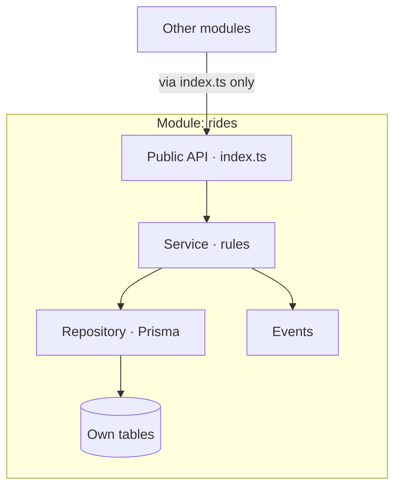
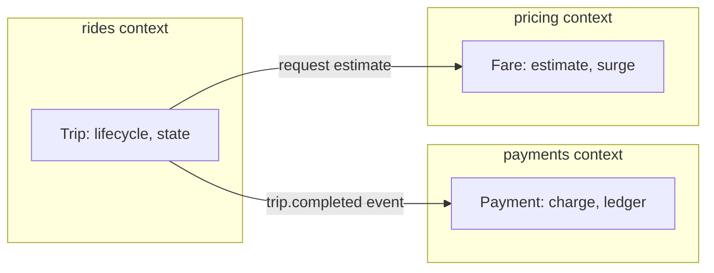
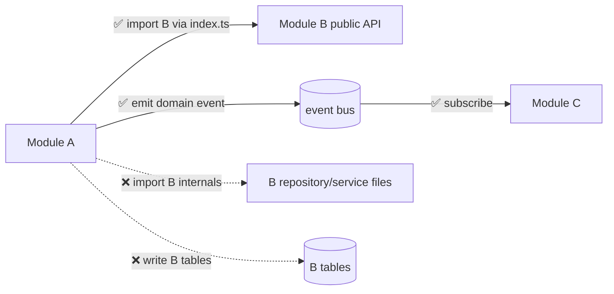
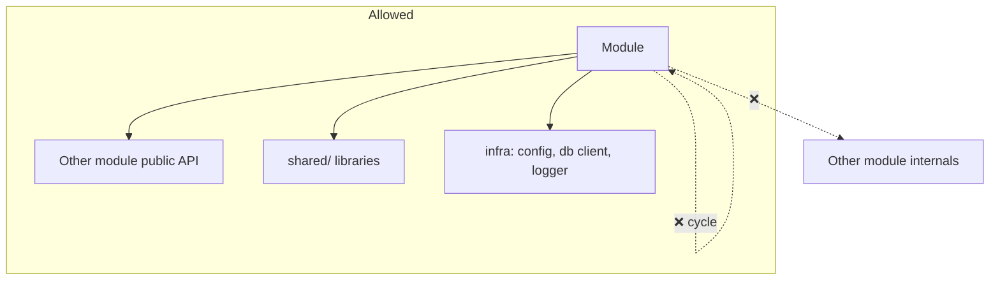

# Zaroorat Engineering Handbook
## Volume 06 — Modules Engineering Handbook

| | |
|---|---|
| **Status** | In progress — delivered in parts |
| **Delivered so far** | Part 1 — Module Philosophy (Ch. 1–10), Part 2 — Standard Module Structure (Ch. 11–18), Part 3 — Layer Responsibilities (Ch. 19–31) |
| **Pending** | Part 4 — Module Communication (Ch. 32–39), Part 5 — CRUD Standards (Ch. 40–48), Part 6 — Module Documentation (Ch. 49–57), Part 7 — Events (Ch. 58–64), Part 8 — Queues (Ch. 65–70), Part 9 — WebSockets (Ch. 71–78), Part 10 — Testing (Ch. 79–88), Part 11 — Module Lifecycle (Ch. 89–96), Part 12 — Code Review (Ch. 97–104), Part 13 — Standard Specifications, Part 14 — Official Modules (23 module guides), Part 15 — AI Development Rules |
| **Audience** | Software architects, senior & junior backend engineers, tech leads, QA, DevOps, AI coding agents (Claude Code) |
| **Relationship to other documents** | The enforceable canonical recipe is [`MODULE_DEVELOPMENT_GUIDE.md`](../../01_ARCHITECTURE/MODULE_DEVELOPMENT_GUIDE.md) (the 12-step recipe + layering contract). This volume is the deep, long-form expansion of it. The layering contract, boundary rules, and DTO/error conventions here **restate and never contradict** `MODULE_DEVELOPMENT_GUIDE.md`, [`CODING_STANDARDS.md`](../../02_ENGINEERING/CODING_STANDARDS.md), and handbook Volumes 01–03. Where a physical layout detail differs (subfolders vs flat files), this volume marks it explicitly (§11). |

**How to use this volume:** every module in `src/modules/*` — all 23 of them — is built from the same recipe so that `users`, `rides`, and `payments` read like one author wrote them. Read Part 1 for *why* the boundaries exist, Parts 2–3 for *what* a module contains, and treat each chapter's **Module Checklist** and **Production Checklist** as the gate for shipping.

---

## Table of Contents

**Part 1 — Module Philosophy**
1. What is a Module? · 2. Why Modular Architecture? · 3. Domain-Driven Design Overview · 4. Bounded Contexts · 5. Module Ownership · 6. Single Responsibility Principle · 7. Module Independence · 8. Module Communication Rules · 9. Public vs Internal APIs · 10. Module Evolution Strategy

**Part 2 — Standard Module Structure**
11. Standard Folder Structure · 12. Required Files · 13. Optional Files · 14. Barrel Files · 15. README Standards · 16. Naming Conventions · 17. Export Rules · 18. Dependency Rules

**Part 3 — Layer Responsibilities**
19. Controllers · 20. Services · 21. Repositories · 22. Routes · 23. DTOs · 24. Schemas · 25. Validators · 26. Entities · 27. Mappers · 28. Utilities · 29. Constants · 30. Errors · 31. Types

**Part 4 — Module Communication**
32. Direct Calls · 33. Events · 34. Shared Services · 35. Shared Libraries · 36. Repository Access Rules · 37. Cross-Module Dependencies · 38. Circular Dependency Prevention · 39. Dependency Graph

**Part 5 — CRUD Standards**
40. Create Flow · 41. Read Flow · 42. Update Flow · 43. Delete Flow · 44. Soft Delete · 45. Bulk Operations · 46. Transactions · 47. Validation Pipeline · 48. Error Handling Pipeline

**Part 6 — Module Documentation**
49. README Template · 50. SPEC.md · 51. API.md · 52. DATABASE.md · 53. EVENTS.md · 54. SOCKETS.md · 55. QUEUES.md · 56. TESTING.md · 57. CHANGELOG.md

**Part 7 — Events**
58. Domain Events · 59. Integration Events · 60. Event Publishing · 61. Event Consumption · 62. Event Naming · 63. Event Versioning · 64. Event Payload Standards

**Part 8 — Queues**
65. BullMQ Integration · 66. Queue Design · 67. Retry Policy · 68. Dead Letter Queue · 69. Scheduling · 70. Monitoring

**Part 9 — WebSockets**
71. Socket Structure · 72. Namespace Rules · 73. Room Rules · 74. Event Naming · 75. Authentication · 76. Broadcasting · 77. Presence · 78. Real-Time Synchronization

**Part 10 — Testing**
79. Unit Tests · 80. Integration Tests · 81. Repository Tests · 82. Service Tests · 83. Controller Tests · 84. Route Tests · 85. Contract Tests · 86. Test Data Strategy · 87. Mocking Strategy · 88. Coverage Requirements

**Part 11 — Module Lifecycle**
89. Creating a Module · 90. Adding Features · 91. Refactoring · 92. Deprecating · 93. Splitting Modules · 94. Merging Modules · 95. Versioning · 96. Migration Strategy

**Part 12 — Code Review**
97. Module Review Checklist · 98. Security Review · 99. Performance Review · 100. Architecture Review · 101. API Review · 102. Database Review · 103. Testing Review · 104. Documentation Review

**Part 13 — Standard Specifications** · **Part 14 — Official Modules (23 guides)** · **Part 15 — AI Development Rules** — *pending (see header).*

---

# Part 1 — Module Philosophy

## 1. What is a Module?

**What.** A module is one **bounded context** — a self-contained slice of the domain that owns a concern end-to-end: its tables, its business rules, its API, its events. Zaroorat's backend is a **modular monolith** decomposed into 23 modules under `src/modules/*` (ADR-0001, SYSTEM_ARCHITECTURE). A module is the unit of ownership, reasoning, and (potentially, later) extraction.

**Responsibilities.** A module owns: the data it's authoritative for, the rules that govern that data, the public API other code uses to reach it, and the events it emits. It does **not** own another module's tables, rules, or internals.



| A module IS | A module IS NOT |
|---|---|
| A bounded context with one clear concern | A grab-bag of loosely-related code |
| The owner of its tables and rules | A shared utility dump |
| Reachable only through its public API | Reachable by reaching into its internals |
| Independently testable | Tangled with other modules' internals |

#### Summary
A module is one bounded context that owns a domain concern end-to-end — its data, rules, API, and events — and is reachable only through its public surface.

#### Best Practices
- Before creating a module, name its single concern in one sentence; if you need "and", it may be two modules.

#### Common Mistakes
- Creating a module that owns no data and only orchestrates others — usually a sign the logic belongs in an existing module or a shared service.

#### Module Checklist
- [ ] The module has one clearly-stated bounded concern and owns its own tables.

#### Production Checklist
- [ ] The module is reachable only through its `index.ts` public surface.

---

## 2. Why Modular Architecture?

**What & Why.** A modular monolith gives the boundary discipline of microservices without the network/ops cost (ADR-0001, VOLUME_02). Modules keep the tightly-coupled ride-hailing core loop (match ↔ dispatch ↔ ride ↔ pricing ↔ geo) fast and transactional, while enforcing boundaries in code so any module can be extracted into a service later *if it earns it*.

| Benefit | Detail |
|---|---|
| Independent reasoning | An engineer/agent can understand one module without the whole system |
| Enforced boundaries | Coupling is visible and controlled (§8, §18) |
| Transactional core | Single DB = one transaction across the core loop (no distributed-txn pain) |
| Extractability | A module can become a service later without a domain rewrite |
| Consistency | One recipe → every module looks the same (MODULE_DEVELOPMENT_GUIDE) |

| Trade-off | Mitigation |
|---|---|
| Boundaries can be bypassed (shared process) | Lint/review enforce import + table rules (§18, §36) |
| One deploy for all modules | Acceptable at Zaroorat's stage; workers scale independently (ADR-0005) |
| Shared DB tempts cross-table reads | Hard rule: write only your own tables (§36, VOLUME_03) |

**Alternatives considered.** Microservices (rejected day-one: latency, distributed transactions, ops cost for no benefit at this scale); a big-ball-of-mud single module (rejected: no boundaries, unmaintainable).

#### Summary
Modular architecture buys boundary discipline and future extractability while keeping the core loop fast and transactional — the right trade-off for a ride-hailing platform at Zaroorat's scale.

#### Best Practices
- Treat module boundaries as real even though they're in-process; they're what makes later extraction possible.

#### Common Mistakes
- Using the shared process/database as an excuse to bypass boundaries "just this once," eroding the whole benefit.

#### Module Checklist
- [ ] The module could, in principle, be extracted into a service without rewriting its domain rules.

#### Production Checklist
- [ ] No cross-module coupling exists that a service extraction couldn't sever cleanly.

---

## 3. Domain-Driven Design Overview

**What.** DDD is the discipline of modeling software around the business domain and its language. Zaroorat applies DDD **pragmatically** — the parts that pay for themselves (bounded contexts, ubiquitous language, aggregates, domain events) — not the full ceremony.

| DDD concept | Zaroorat application |
|---|---|
| Bounded context | = a module (§4) |
| Ubiquitous language | Domain terms are consistent across code, docs, API (`Trip`, `Driver`, `operable`) |
| Aggregate | A consistency boundary with one root (e.g. `Trip` — §26) |
| Entity vs value object | Identity-bearing (`Ride`) vs interchangeable (`Money`) — VOLUME_03 |
| Domain event | A past-tense fact emitted after commit (§58, EVENT_CATALOG) |
| Repository | Intention-revealing data access per aggregate (§21) |

**Pragmatic stance (VOLUME_00 philosophy).** We use DDD's strategic patterns (contexts, language, events) heavily and its tactical patterns (aggregates, value objects) where they clarify — but we don't add layers of abstraction that don't earn their keep for a small team.

#### Summary
Zaroorat applies DDD pragmatically — bounded contexts, ubiquitous language, aggregates, and domain events — using strategic patterns fully and tactical ones where they clarify.

#### Best Practices
- Keep the domain language identical across schema, code, API, and docs; drift in terminology is drift in understanding.

#### Common Mistakes
- Cargo-culting full DDD tactical ceremony (every concept as a class/layer) where a simple model would do.

#### Module Checklist
- [ ] The module uses the domain's ubiquitous language consistently in code and docs.

#### Production Checklist
- [ ] Domain terms in the API match those in the schema and the Feature Catalog.

---

## 4. Bounded Contexts

**What.** A bounded context is the boundary within which a domain model and its language are consistent. Each Zaroorat module **is** exactly one bounded context (SYSTEM_ARCHITECTURE). The same word can mean different things in different contexts, and the boundary is where the translation happens.



| Rule | Detail |
|---|---|
| One context per module | No module spans two domains |
| Explicit translation | Cross-context data crosses via public API/events, mapped to local types (§27) |
| No shared mutable model | `rides` and `payments` don't share a `Trip` object internally |
| Context map | The dependency graph (§39) is the map of how contexts relate |

#### Summary
Each module is exactly one bounded context with an internally-consistent model and language; data crosses contexts only through explicit, mapped public interfaces and events.

#### Best Practices
- When the same term means different things to two modules, that's the boundary — translate at it, don't share one model across it.

#### Common Mistakes
- Sharing a single mutable domain object across two contexts, coupling their models so neither can evolve independently.

#### Module Checklist
- [ ] The module's model is internally consistent and doesn't leak into other contexts.

#### Production Checklist
- [ ] Cross-context data is mapped to local types at the boundary (§27).

---

## 5. Module Ownership

**What.** Every module has a clear owner (a person/team accountable) and owns a defined set of tables, rules, and contracts. Ownership is what makes "who changes this?" and "who's paged for this?" unambiguous.

| Ownership dimension | Rule |
|---|---|
| Data | The module is the **sole writer** of its tables (§36, VOLUME_03) |
| Rules | Business invariants for its domain live only in its service (§20) |
| Contracts | Its public API and events are its contract; changing them is a reviewed, versioned act (§9, §63) |
| Docs | The module owns its `SPEC.md`/`README.md`/etc. (Part 6, Part 13) |
| Accountability | A named owner reviews changes and is the escalation point |

**Why.** Shared ownership is no ownership. A table written by three modules has no single place where its invariants are guaranteed — exactly the failure mode boundaries prevent.

#### Summary
Each module has a named owner and is the sole writer of its tables and the sole home of its domain rules and contracts — making change and accountability unambiguous.

#### Best Practices
- Make the module's sole-writer status real: other modules read through its service, never its tables (§36).

#### Common Mistakes
- Two modules both writing the same table, so its invariants live in no single enforceable place.

#### Module Checklist
- [ ] The module is the only writer of its tables and the only home of its domain rules.

#### Production Checklist
- [ ] The module has a named owner recorded in its README/SPEC.

---

## 6. Single Responsibility Principle

**What.** A module (and each layer within it) has one reason to change. The module has one bounded concern (§1); the service owns rules; the repository owns data access; the controller owns HTTP adaptation (Part 3).

| Level | Single responsibility |
|---|---|
| Module | One bounded context (§4) |
| Route | Declare schema/auth/wiring (§22) |
| Controller | Adapt HTTP ↔ service (§19) |
| Service | Own business rules (§20) |
| Repository | Own data access (§21) |
| Mapper | Translate shapes (§27) |

**Why.** When responsibilities blur (a service that also builds HTTP responses, a controller with business logic), every change risks unrelated breakage and the code becomes untestable in isolation.

#### Summary
Each module and each layer has exactly one reason to change; responsibilities are never blurred across layers.

#### Best Practices
- If a file needs "and" to describe what it does, split it along the layer boundary.

#### Common Mistakes
- A service that returns HTTP responses or a controller with business rules — the two most common SRP violations (§19, §20).

#### Module Checklist
- [ ] Each layer in the module does exactly its one job (Part 3 contract).

#### Production Checklist
- [ ] No layer holds another layer's responsibility (verified in review).

---

## 7. Module Independence

**What.** A module depends on as little as possible and can be understood, tested, and changed on its own. Dependencies are explicit, directional, and minimal (§18, §37).

| Independence property | How it's achieved |
|---|---|
| Compile-time | Imports only other modules' `index.ts`, never internals (§17) |
| Data | Writes only own tables; reads others via their service (§36) |
| Test | Service unit-tests mock collaborators; no whole-system needed (§82) |
| Runtime | Emits events for side effects rather than hard-calling everywhere (§33) |
| Change | Its public contract shields internal refactors (§9) |

**Why.** Independence is what lets 23 modules be maintained by a small team — you reason about one at a time — and is the precondition for extracting a module into a service later (§2).

#### Summary
Modules are independent: minimal explicit dependencies, own-table-only writes, event-driven side effects, and public contracts that shield internal change — so each can be understood and evolved alone.

#### Best Practices
- Prefer emitting an event over directly calling three other modules; loose coupling keeps the module independent (§33).

#### Common Mistakes
- Deep import chains into other modules' internals, so a change anywhere ripples everywhere.

#### Module Checklist
- [ ] The module can be unit-tested without standing up unrelated modules.

#### Production Checklist
- [ ] The module imports only public surfaces of others (§17, §18).

---

## 8. Module Communication Rules

**What.** The hard rules for how modules talk to each other — the enforcement of independence (§7).



| Rule | Detail | Ref |
|---|---|---|
| Public API only | Import another module solely through its `index.ts` | §9, §17 |
| Own tables only | Write only your tables; read others via their service | §36 |
| Events for side effects | Emit past-tense events; don't hard-wire every reaction | §33, §58 |
| No circular deps | Communication is directional; cycles are forbidden | §38 |
| Durable async via queue | Must-survive work goes through BullMQ, not in-line calls | §65, QUEUE_GUIDE |
| Money never via fire-and-forget event | Money side effects go through a durable queue | EVENT_CATALOG |

#### Summary
Modules communicate only through public APIs (`index.ts`), domain events, and durable queues — never by importing internals, writing others' tables, or creating cycles.

#### Best Practices
- Default to events for cross-module side effects and direct calls only for synchronous reads you truly need now (§32, §33).

#### Common Mistakes
- Reaching into another module's service/repository files directly instead of its public API.

#### Module Checklist
- [ ] All cross-module interaction is via public API, events, or queues.

#### Production Checklist
- [ ] No import crosses into another module's internal files (lint-enforced where feasible).

---

## 9. Public vs Internal APIs

**What.** Each module exposes a small **public surface** (its `index.ts`) and hides everything else. The public API is a deliberate, stable contract; internals are free to change.

```ts
// index.ts — public surface only (MODULE_DEVELOPMENT_GUIDE)
export { ridesRoutes } from './rides.routes';
export { ridesService } from './rides.service';           // if other modules need it
export type { Trip, TripStatus } from './rides.types';    // only types others legitimately need
// Do NOT export the repository or internal service helpers.
```

| Public (exported) | Internal (never exported) |
|---|---|
| Routes (for app wiring) | Repository |
| A curated service interface others need | Internal service helpers |
| Domain types others legitimately use | DTO-internal shapes, validators |
| Events (names/payloads) | Prisma models, raw entities |

**Why.** A small public surface is what makes internal refactoring safe (§7) and boundaries enforceable (§8). If everything is public, nothing can change safely.

#### Summary
A module exposes a minimal, stable public surface via `index.ts` (routes, curated service, domain types, events) and hides all internals so they can change freely.

#### Best Practices
- Export the narrowest interface that satisfies real consumers; you can always widen it, but narrowing is a breaking change.

#### Common Mistakes
- Exporting the repository or barrel-exporting everything, making internals part of the contract by accident.

#### Module Checklist
- [ ] `index.ts` exports only the intended public surface; no repository/internals leak.

#### Production Checklist
- [ ] Consumers depend only on exported types/services, not internal files.

---

## 10. Module Evolution Strategy

**What.** How a module changes over time without breaking consumers — the versioning and compatibility discipline for its contracts (expanded in Part 11).

| Change type | Strategy |
|---|---|
| Internal refactor | Free — public surface unchanged (§9) |
| Additive API change | Backward-compatible; add, don't mutate (VOLUME_04) |
| Breaking API change | Versioned; deprecate then remove (§92, §95) |
| Event payload change | Version the event (`trip.completed.v2`), don't mutate (§63) |
| Schema change | Reviewed migration; expand-then-contract for zero downtime (§96) |
| Splitting/merging | Deliberate lifecycle events (§93, §94) |

**Why.** Modules are long-lived; their contracts are depended on by other modules and clients. Evolving via additive + versioned changes keeps the system stable while it grows.

#### Summary
Modules evolve by keeping internal change free, making API/event changes additive-or-versioned, and using expand-then-contract migrations — never silently breaking a contract.

#### Best Practices
- Prefer additive changes; when a break is unavoidable, version and deprecate rather than mutate in place.

#### Common Mistakes
- Mutating an existing API/event shape in place, silently breaking every consumer.

#### Module Checklist
- [ ] Contract changes are additive or versioned, never in-place breaking.

#### Production Checklist
- [ ] Breaking changes follow deprecate-then-remove with consumer notice (§92).

---

# Part 2 — Standard Module Structure

## 11. Standard Folder Structure

**What.** Every module follows the same internal layout so any engineer can navigate any module. This volume defines the **expanded** per-layer structure; simpler modules may use the **flat colocated** form from `MODULE_DEVELOPMENT_GUIDE.md` — the two are equivalent and map 1:1.

```
modules/
└── auth/
    ├── controllers/    # HTTP adapters (§19)
    ├── services/       # business rules (§20)
    ├── repositories/   # Prisma-only data access (§21)
    ├── routes/         # endpoint + schema + auth wiring (§22)
    ├── schemas/        # Zod/JSON request+response schemas (§24)
    ├── dto/            # request/response DTOs (§23)
    ├── entities/       # domain entities/aggregates (§26)
    ├── events/         # domain event definitions + handlers (§58)
    ├── queues/         # BullMQ job definitions (§65)
    ├── sockets/        # realtime handlers (§71)
    ├── mappers/        # domain ↔ DTO translation (§27)
    ├── validators/     # cross-field/business validators (§25)
    ├── policies/       # authorization policies (V05 §65)
    ├── permissions/    # capability/permission definitions (V05 §62)
    ├── constants/      # module constants (§29)
    ├── errors/         # typed domain errors (§30)
    ├── types/          # module types (§31)
    ├── utils/          # module-local helpers (§28)
    ├── tests/          # module tests (Part 10)
    ├── README.md       # module doc (§15, Part 6)
    └── index.ts        # public surface only (§9, §14)
```

> **Reconciliation note.** `MODULE_DEVELOPMENT_GUIDE.md` shows flat files (`auth.service.ts`, `auth.repository.ts`). Both are valid: use **flat colocated files for small modules** (e.g. `settings`, `files`) and the **expanded subfolders for large modules** (e.g. `rides`, `payments`, `auth`). The layering *contract* (§Part 3) is identical either way — this is a physical-layout choice, not a rule change.

| Rule | Detail |
|---|---|
| Same shape everywhere | Predictability across all 23 modules |
| Layer = folder (or suffix) | `services/` or `*.service.ts` |
| One public entry | `index.ts` only (§9) |
| Tests colocated | `tests/` per module (or `tests/modules/<name>/`) |

#### Summary
Every module shares one internal layout (expanded subfolders for large modules, flat colocated files for small ones), so any module is navigable at a glance and the layering contract holds either way.

#### Best Practices
- Match the surrounding modules' layout choice; don't introduce a third structure.

#### Common Mistakes
- Inventing a bespoke folder structure per module, defeating the navigability the standard exists to provide.

#### Module Checklist
- [ ] The module uses the standard layout (expanded or flat) consistently.

#### Production Checklist
- [ ] The layout choice matches the module's complexity and neighboring modules.

---

## 12. Required Files

**What.** The minimum set every module must contain to be complete and consistent.

| Required | Purpose | Ref |
|---|---|---|
| `index.ts` | Public surface | §9, §14 |
| Routes | Endpoints + schemas + auth | §22 |
| Controller(s) | HTTP adapter | §19 |
| Service(s) | Business rules | §20 |
| Repository(ies) | Data access (if it owns tables) | §21 |
| Schemas | Request/response validation | §24 |
| Types/DTOs | Contracts and domain types | §23, §31 |
| Errors | Typed domain errors | §30 |
| `README.md` | Module documentation | §15 |
| `tests/` | Unit + integration tests | Part 10 |

**Note.** A module that owns no tables (rare — e.g. a pure orchestrator) omits the repository but still has service, routes, and docs. Everything else is mandatory.

#### Summary
Every module must contain a public `index.ts`, routes, controller, service, repository (if it owns tables), schemas, types/DTOs, errors, a README, and tests.

#### Best Practices
- Scaffold all required files when creating a module, even if some start minimal (§89).

#### Common Mistakes
- Shipping a module with no README or no tests, breaking the consistency and quality baseline.

#### Module Checklist
- [ ] All required files are present and non-empty.

#### Production Checklist
- [ ] README and tests exist before the module is considered done (§89 DoD).

---

## 13. Optional Files

**What.** Files present only when the module's concern needs them.

| Optional | Present when |
|---|---|
| `events/` | The module emits or consumes domain events (§58) |
| `queues/` | The module has async/background work (§65) |
| `sockets/` | The module has realtime events (§71) |
| `policies/` `permissions/` | The module has non-trivial authorization (V05 Part 6) |
| `mappers/` | Domain↔DTO translation is non-trivial (§27) |
| `validators/` | Cross-field/business validation beyond schemas (§25) |
| `entities/` | The module has rich aggregates (§26) |
| `utils/` | Genuinely module-local helpers (§28) |

**Rule.** Optional means *omit when unused* — don't create empty `queues/` or `sockets/` folders "just in case." Absence communicates "this module has no async work."

#### Summary
Optional files (events, queues, sockets, policies, mappers, validators, entities, utils) appear only when the module's concern needs them; empty placeholders are avoided.

#### Best Practices
- Add an optional layer when the need is real, so a module's presence of `queues/` genuinely means "has background work."

#### Common Mistakes
- Creating empty optional folders speculatively, making the structure lie about the module's behavior.

#### Module Checklist
- [ ] Optional folders exist only where the module actually uses them.

#### Production Checklist
- [ ] No empty placeholder layer folders are committed.

---

## 14. Barrel Files

**What.** A barrel file (`index.ts`) re-exports a module's public surface from one place. Zaroorat uses **exactly one barrel per module** — the module root `index.ts` — as its public API (§9).

| Rule | Detail |
|---|---|
| One public barrel | The module `index.ts` is the sole public entry (§9) |
| Curated, not blanket | Export the intended surface, not `export * from` everything |
| No internal barrels leaking out | Internal `index.ts` files (if any) are not re-exported publicly |
| Avoid cycles | Blanket barrels are a common circular-dependency source (§38) |

**Why curated, not `export *`.** A blanket `export *` makes every internal symbol public by accident (§9) and is a frequent cause of circular imports. Explicit named exports keep the contract intentional.

#### Summary
Each module has one curated public barrel (`index.ts`) exporting only its intended surface; blanket `export *` is avoided to keep the contract intentional and prevent cycles.

#### Best Practices
- Write explicit named exports in the barrel so the public contract is visible in one file.

#### Common Mistakes
- `export *` from the barrel, silently publishing internals and inviting circular dependencies.

#### Module Checklist
- [ ] The module has exactly one curated public barrel with explicit exports.

#### Production Checklist
- [ ] No blanket `export *` exposes internal files.

---

## 15. README Standards

**What.** Every module has a `README.md` — the entry point for anyone (human or AI) working on it. It summarizes the module and links to the deeper specs (Part 6, Part 13).

| README section | Content |
|---|---|
| Purpose | The one-sentence bounded concern (§1) |
| Owner | Accountable person/team (§5) |
| Responsibilities | What it owns / doesn't (§1) |
| Public API | Key endpoints + exported services (§9) |
| Data | Tables it owns (link to DATABASE.md) |
| Events | Emitted/consumed (link to EVENTS.md) |
| Dependencies | Modules it depends on (§37) |
| Docs links | SPEC/API/DATABASE/EVENTS/etc. (Part 13) |

**Why.** The README is the map. An AI agent or new engineer reads it first to know the module's boundaries before touching code — which is exactly what keeps changes inside the lines.

#### Summary
Every module's README states its purpose, owner, responsibilities, public API, data, events, and dependencies, and links to the deeper specs — the first thing anyone reads before changing the module.

#### Best Practices
- Keep the README current in the same PR as behavior changes; a stale map misleads the next contributor.

#### Common Mistakes
- A missing or stale README, forcing readers to reverse-engineer boundaries from code.

#### Module Checklist
- [ ] README states purpose, owner, responsibilities, and links the specs.

#### Production Checklist
- [ ] README is updated in the same PR when the module's contract changes.

---

## 16. Naming Conventions

**What.** Consistent names so files, symbols, and endpoints are predictable across all modules (extends CODING_STANDARDS, VOLUME_01 §naming).

| Thing | Convention | Example |
|---|---|---|
| Module folder | lowercase, singular concern (plural domain ok) | `rides`, `payments` |
| File (flat) | `<name>.<layer>.ts` | `rides.service.ts` |
| Class | `PascalCase` + role suffix | `RidesService`, `RidesRepository` |
| DTO | `PascalCase` + `Dto` / direction | `CreateRideDto`, `RideResponse` |
| Domain type | `PascalCase`, unsuffixed | `Trip`, `Driver` |
| Event | `domain.past_tense` | `trip.completed` |
| Constant | `SCREAMING_SNAKE_CASE` | `MAX_MATCH_RADIUS_KM` |
| DB table | `snake_case`, plural (`@@map`) | `rides` |
| Prisma model | `PascalCase`, singular | `Ride` |
| Endpoint | resource noun, kebab/plural | `/rides/:id` |
| Boolean field | `is_`/`has_`/`can_` prefix | `is_online` |

#### Summary
Naming is standardized across files, classes, DTOs, events, constants, tables, and endpoints so every module reads predictably (aligned with Volumes 01/03).

#### Best Practices
- Copy the naming of three existing modules before naming anything new; consistency beats personal preference.

#### Common Mistakes
- Verb-named endpoints (`/getRides`) or unsuffixed DTOs that collide with domain types.

#### Module Checklist
- [ ] All names follow the conventions table and match existing modules.

#### Production Checklist
- [ ] Endpoints are resource-noun-based; DTOs vs domain types are unambiguous.

---

## 17. Export Rules

**What.** What a module may export and how — the mechanics behind the public/internal split (§9).

| Rule | Detail |
|---|---|
| Public via barrel only | Only `index.ts` exports for external consumption (§14) |
| Never export the repository | Data access is always internal (§21) |
| Never export raw Prisma/entities | Consumers get domain types/DTOs, not DB models (§27, §31) |
| Curated service surface | Export only the service methods other modules need |
| Types over implementations | Prefer exporting interfaces/types; hide concrete internals |
| No deep imports allowed | Consumers import `modules/x`, never `modules/x/services/...` |

#### Summary
A module exports only through its barrel — a curated service surface plus domain types — never the repository, raw Prisma models, or deep internal paths.

#### Best Practices
- Export types and a minimal service interface; keep concrete implementations internal so they can change.

#### Common Mistakes
- Exporting the repository or a raw Prisma model, coupling consumers to internal data access.

#### Module Checklist
- [ ] Only the barrel exports; no repository/raw-model export exists.

#### Production Checklist
- [ ] No consumer deep-imports internal files.

---

## 18. Dependency Rules

**What.** The directional dependency constraints that keep the module graph acyclic and boundaries intact (expanded in Part 4).



| Rule | Detail | Ref |
|---|---|---|
| Depend on public APIs | Other modules via `index.ts` only | §9, §17 |
| Shared code in `shared/` | Cross-cutting helpers live in `shared/`, not copied | §35 |
| No circular deps | The graph is a DAG (§38) |
| Infra is a leaf dependency | Config/DB client/logger are depended on, not domain modules |
| Direction follows the domain | Core loop dependencies flow deliberately (§39) |

**Why.** Uncontrolled dependencies produce a big ball of mud where nothing can be changed or extracted. Directional, public-only dependencies keep every module independently reasonable (§7).

#### Summary
Modules depend only on other modules' public APIs, `shared/` libraries, and infrastructure — directionally, with no cycles — keeping the dependency graph a clean DAG.

#### Best Practices
- When two modules seem to need each other, introduce an event or a shared abstraction to break the cycle (§38).

#### Common Mistakes
- Circular dependencies from two modules directly calling each other synchronously (§38).

#### Module Checklist
- [ ] The module's dependencies are public-API-only and acyclic.

#### Production Checklist
- [ ] No circular dependency exists in the module graph (§39).

---

# Part 3 — Layer Responsibilities

> **The layering contract (hard rule, from `MODULE_DEVELOPMENT_GUIDE.md`):** `routes → controller → service → repository → Postgres`. A layer calls **only** the layer directly below it. The chapters below expand each layer's Purpose, Responsibilities, Allowed/Forbidden dependencies, Lifecycle, Best Practices, and Common Mistakes.

## 19. Controllers

**Purpose.** A thin HTTP adapter: take validated input, call exactly one service method, shape the response envelope (API_STANDARDS). Nothing more.

| | |
|---|---|
| **Responsibilities** | Read validated request → call one service method → build the response envelope via `ok()`/error mapper |
| **Allowed dependencies** | The module's service; the envelope helper; types |
| **Forbidden dependencies** | Prisma/repository; business rules; other modules' internals |
| **Lifecycle** | Invoked per request by the route; stateless |

```ts
export const ridesController = {
  async create(req, reply) {
    const trip = await ridesService.create(req.validatedBody);  // one call
    return reply.send(ok(trip));                                 // envelope
  },
};
```

#### Summary
Controllers are thin HTTP adapters — validated input in, one service call, response envelope out — with no business logic and no data access.

#### Best Practices
- Keep every handler a few lines; if it grows logic, that logic belongs in the service.

#### Common Mistakes
- Business rules or Prisma calls creeping into the controller (violates the layering contract).

#### Module Checklist
- [ ] Each controller handler calls exactly one service method and builds the envelope.

#### Production Checklist
- [ ] No controller touches Prisma or holds business rules.

---

## 20. Services

**Purpose.** The heart of the module — where business rules, invariants, transactions, and idempotency live (MODULE_DEVELOPMENT_GUIDE step 6).

| | |
|---|---|
| **Responsibilities** | Enforce domain rules & state-machine transitions; run money/state changes in a transaction; be idempotent for money/critical ops; return domain objects; throw typed errors; emit events after commit |
| **Allowed dependencies** | Own repository; other modules' public services; shared libs; event/queue interfaces |
| **Forbidden dependencies** | Prisma directly; HTTP/reply objects; other modules' repositories |
| **Lifecycle** | Called by the controller (or a worker/event handler); orchestrates one use case |

```ts
async complete(input: CompleteTripInput): Promise<Trip> {
  return this.prisma.$transaction(async (tx) => {
    const trip = await this.repo.findById(input.tripId, tx);
    if (!trip) throw new NotFoundError('Trip', input.tripId);
    trip.assertCanComplete();                 // invariant / state machine
    const updated = await this.repo.setStatus(trip.id, 'COMPLETED', tx);
    return updated;                            // domain object, not HTTP
  });
  // emit trip.completed AFTER commit (§58)
}
```

#### Summary
Services own business rules, transactions, and idempotency; they return domain objects and throw typed errors — never touching Prisma directly or returning HTTP responses.

#### Best Practices
- Wrap money/state mutations in a transaction and emit domain events only after it commits.

#### Common Mistakes
- Returning HTTP responses or calling Prisma directly from the service (both break the layering contract).

#### Module Checklist
- [ ] Business rules, transactions, and idempotency live in the service; it returns domain objects.

#### Production Checklist
- [ ] Money/state operations are transactional and idempotent (ADR-0008).

---

## 21. Repositories

**Purpose.** The **only** place Prisma is touched for the module's domain — pure data access, no business rules (MODULE_DEVELOPMENT_GUIDE step 5).

| | |
|---|---|
| **Responsibilities** | Intention-revealing queries (`findActiveByDriverId`); apply `deletedAt: null` on reads; accept an optional transaction client; map to domain shapes |
| **Allowed dependencies** | Prisma client; the module's own tables |
| **Forbidden dependencies** | Business rules; other modules' tables; HTTP; other repositories |
| **Lifecycle** | Called by the service; stateless data access |

```ts
findActiveByDriverId(driverId: string, tx: Prisma.TransactionClient = prisma) {
  return tx.trip.findFirst({ where: { driverId, status: { in: ACTIVE_STATES }, deletedAt: null } });
}
```

| Rule | Detail |
|---|---|
| Sole Prisma caller | No Prisma outside repositories (V05, VOLUME_01) |
| Own tables only | Never query another module's tables (§36) |
| Named intent | `findActiveByDriverId`, not a generic `find(where)` that leaks query shape |
| Soft-delete default | Reads filter `deletedAt: null` (§44) |

#### Summary
Repositories are the sole Prisma callers — intention-revealing, own-table-only, soft-delete-filtering data access that accepts a transaction client and holds no business rules.

#### Best Practices
- Expose named-intent methods, not a generic passthrough that leaks Prisma's `where` shape to callers.

#### Common Mistakes
- Business logic in the repository, or accepting a raw Prisma `where`/`include` from the caller.

#### Module Checklist
- [ ] The repository is the only Prisma caller and filters `deletedAt: null` on reads.

#### Production Checklist
- [ ] No repository queries another module's tables.

---

## 22. Routes

**Purpose.** Declare endpoints with their schema, auth, role, and idempotency requirements, and wire them to controllers — validation and wiring only, no logic (MODULE_DEVELOPMENT_GUIDE step 8).

| | |
|---|---|
| **Responsibilities** | Register endpoints; attach request/response schema; declare auth + role (deny by default); require `Idempotency-Key` on money/critical; wire to controller |
| **Allowed dependencies** | Controller; schemas; auth/role middleware |
| **Forbidden dependencies** | Business rules; services directly (go via controller); Prisma |
| **Lifecycle** | Registered at boot in `src/routes/index.ts` |

```ts
app.post('/rides', {
  schema: createRideSchema,
  preHandler: [auth(), role('RIDER')],     // deny by default (V05 §67)
  config: { idempotency: true },           // money/critical
}, ridesController.create);
```

#### Summary
Routes declare each endpoint's schema, auth, role, and idempotency and wire it to a controller — carrying validation and wiring only, never business logic.

#### Best Practices
- Co-locate the schema and the auth/role declaration on the route so contract and security are reviewed together.

#### Common Mistakes
- An endpoint with no role declaration (violates deny-by-default) or business logic in the route.

#### Module Checklist
- [ ] Every route declares schema + auth + role; money routes require `Idempotency-Key`.

#### Production Checklist
- [ ] Routes are registered in `src/routes/index.ts` and hold no logic.

---

## 23. DTOs

**Purpose.** Data Transfer Objects define the request/response shapes at the module boundary, decoupled from internal domain/Prisma models (MODULE_DEVELOPMENT_GUIDE step 3, VOLUME_01 §DTOs).

| | |
|---|---|
| **Responsibilities** | Define input DTOs (inferred from schemas) and output DTOs (explicit mapping targets); shield internal models from the wire |
| **Allowed dependencies** | Types; schemas (for input inference) |
| **Forbidden dependencies** | Prisma models as DTOs; business logic |
| **Lifecycle** | Input DTOs at the boundary in; output DTOs built by mappers (§27) out |

| Rule | Detail |
|---|---|
| Input inferred from schema | One source of truth (Zod → type) |
| Output explicitly mapped | Never return a raw Prisma model (§27, §84 V05) |
| Suffix `Dto` / direction | `CreateRideDto`, `RideResponse` (§16) |
| No internal fields | Output DTOs omit internal-only fields |

#### Summary
DTOs define boundary request/response shapes — inputs inferred from schemas, outputs explicitly mapped — keeping internal domain/Prisma models off the wire.

#### Best Practices
- Always map to an explicit output DTO so a later-added internal field never auto-leaks to clients.

#### Common Mistakes
- Reusing a Prisma-generated type directly as a response DTO (VOLUME_01 anti-pattern).

#### Module Checklist
- [ ] Input DTOs are schema-inferred; output DTOs are explicit and omit internal fields.

#### Production Checklist
- [ ] No raw Prisma model is returned as a DTO.

---

## 24. Schemas

**Purpose.** Zod (and generated JSON) schemas validate every request and constrain every response at the route boundary (MODULE_DEVELOPMENT_GUIDE step 4, V05 §83).

| | |
|---|---|
| **Responsibilities** | Validate body/params/query/headers; constrain responses; drive Swagger; infer input DTO types |
| **Allowed dependencies** | Zod; shared schema primitives |
| **Forbidden dependencies** | Business rules; DB access |
| **Lifecycle** | Attached to routes; runs before the controller |

| Rule | Detail |
|---|---|
| Validate everything | Body, params, query, relevant headers (V05 §83) |
| Strict | Reject unknown keys; exact types |
| Fail closed | Invalid → 400 typed error before any service runs |
| One source | Input types inferred from the schema (§23) |

#### Summary
Schemas validate all request inputs (strictly, failing closed) and constrain responses at the boundary, doubling as the source of input types and Swagger.

#### Best Practices
- Use strict schemas that reject unknown keys, closing type-confusion/injection vectors at the door (V05 §80, §83).

#### Common Mistakes
- Validating only the body and trusting params/query/headers, or loose schemas that pass unknown fields.

#### Module Checklist
- [ ] Every route input is validated by a strict schema; responses are constrained.

#### Production Checklist
- [ ] Invalid input returns a typed 400 and never reaches the service.

---

## 25. Validators

**Purpose.** Business/cross-field validation that goes beyond schema type-checking — rules that need domain context (e.g. "pickup ≠ dropoff", "promo still valid").

| | |
|---|---|
| **Responsibilities** | Cross-field checks; domain-contextual validation invoked by the service |
| **Allowed dependencies** | Types; the module's read methods (via service/repository as appropriate) |
| **Forbidden dependencies** | HTTP; writing data; other modules' internals |
| **Lifecycle** | Called by the service before applying a rule |

**Schema vs validator.** Schemas check **shape/type** at the boundary (§24); validators check **domain rules** that require context a schema can't express. Keep them separate — schema failures are 400s at the edge; validator failures are typed domain errors from the service (§30).

#### Summary
Validators enforce cross-field and domain-contextual rules the schema can't express, invoked by the service and raising typed domain errors — distinct from boundary schema validation.

#### Best Practices
- Put shape checks in schemas and context-dependent rules in validators; don't blur the two.

#### Common Mistakes
- Trying to encode domain rules in schemas (impossible/brittle) or scattering validation inline in controllers.

#### Module Checklist
- [ ] Domain-contextual validation lives in validators invoked by the service.

#### Production Checklist
- [ ] Validator failures surface as typed domain errors (§30), not raw 400s.

---

## 26. Entities

**Purpose.** The domain entities/aggregates the module owns — identity-bearing objects with invariants (DDD §3, VOLUME_03). The aggregate root is the consistency boundary.

| | |
|---|---|
| **Responsibilities** | Model domain identity + invariants; enforce valid state transitions; be the unit the repository loads/saves |
| **Allowed dependencies** | Value objects; types; the domain's own rules |
| **Forbidden dependencies** | Prisma directly; HTTP; other modules' entities |
| **Lifecycle** | Loaded by the repository, operated on by the service, persisted back |

| Concept | Detail |
|---|---|
| Aggregate root | One entry point to a cluster (e.g. `Trip`); external refs point to the root |
| Invariants | The entity guards its own valid states (e.g. `Trip.assertCanComplete()`) |
| Entity vs value object | Identity (`Ride`) vs interchangeable (`Money`) — VOLUME_03 |
| One active constraint | e.g. a driver has at most one active trip (ER_DIAGRAM) |

#### Summary
Entities model the module's identity-bearing domain objects and guard their own invariants; the aggregate root is the consistency boundary the repository loads and saves.

#### Best Practices
- Let the entity/aggregate enforce its own state-transition invariants rather than scattering those checks across services.

#### Common Mistakes
- Anemic entities with all logic in the service *and* invariant checks duplicated in multiple places.

#### Module Checklist
- [ ] Aggregates guard their invariants; external references point to the root.

#### Production Checklist
- [ ] State-machine transitions are validated on the entity/service, never trusted from input.

---

## 27. Mappers

**Purpose.** Translate between shapes — domain entity ↔ DTO, and cross-context types — so no layer leaks another's model (MODULE_DEVELOPMENT_GUIDE, V05 §84).

| | |
|---|---|
| **Responsibilities** | Map domain/Prisma models → response DTOs (explicitly); map inbound DTOs → domain inputs; translate cross-context data (§4) |
| **Allowed dependencies** | Types/DTOs |
| **Forbidden dependencies** | Business rules; data access; HTTP |
| **Lifecycle** | Used at the service/controller boundary when crossing shapes |

**Why explicit mapping.** Direct passthrough of a Prisma model as a response is the top data-leak anti-pattern (V05 §84). A mapper is the single place where "what leaves the module" is decided, so new internal fields never auto-leak.

#### Summary
Mappers are the single explicit place shapes are translated (domain↔DTO, cross-context), preventing internal models from leaking across layers or module boundaries.

#### Best Practices
- Route every response through a mapper so field exposure is a deliberate, reviewable decision.

#### Common Mistakes
- Passing a raw Prisma model straight to the response, leaking internal fields added later.

#### Module Checklist
- [ ] All responses are built via explicit mappers, not raw model passthrough.

#### Production Checklist
- [ ] Cross-context data is mapped to local types at the boundary.

---

## 28. Utilities

**Purpose.** Genuinely module-local helper functions with no domain rules and no cross-module reach.

| | |
|---|---|
| **Responsibilities** | Small, pure, module-specific helpers (formatting, local calculations) |
| **Allowed dependencies** | Types; standard libs |
| **Forbidden dependencies** | Business rules; data access; other modules |
| **Lifecycle** | Imported where needed within the module |

**Rule (shared vs local).** If a helper is used by 2+ modules, it belongs in `shared/`, not duplicated (§35, VOLUME_01). `utils/` is for truly local helpers only — and never a catch-all `utils.ts` dumping ground.

#### Summary
Utilities are small, pure, module-local helpers; anything used by two or more modules moves to `shared/`, and catch-all `utils.ts` dumps are avoided.

#### Best Practices
- Keep utilities pure and single-purpose; promote to `shared/` the moment a second module needs them.

#### Common Mistakes
- A catch-all `utils.ts` accumulating unrelated helpers, or duplicating a helper across modules instead of sharing it.

#### Module Checklist
- [ ] Utilities are pure, local, and single-purpose; shared logic is in `shared/`.

#### Production Checklist
- [ ] No helper is duplicated across modules (§35).

---

## 29. Constants

**Purpose.** Named domain constants for the module, avoiding magic numbers/strings (VOLUME_01 §constants).

| | |
|---|---|
| **Responsibilities** | Define `SCREAMING_SNAKE_CASE` domain constants (limits, thresholds, enums-as-const) owned by the module |
| **Allowed dependencies** | Types |
| **Forbidden dependencies** | Runtime config (that's env, V05 §86); business logic |
| **Lifecycle** | Imported where the value is used |

| Rule | Detail |
|---|---|
| Owned by domain | `shared/constants/rides.ts` → `MAX_MATCH_RADIUS_KM` (VOLUME_01) |
| No duplication | Imported from the owning domain, never copied |
| Constant vs config | Fixed domain values are constants; environment-varying values are validated config (§86 V05) |

#### Summary
Constants are named, `SCREAMING_SNAKE_CASE`, domain-owned values imported from one place — distinct from environment-varying runtime config.

#### Best Practices
- Define each domain constant once in its owning domain's constants file and import it everywhere else.

#### Common Mistakes
- Magic numbers inline, or duplicating the same constant across modules.

#### Module Checklist
- [ ] Domain constants are named, single-sourced, and correctly separated from config.

#### Production Checklist
- [ ] No magic numbers/strings for domain thresholds in the module.

---

## 30. Errors

**Purpose.** Typed domain errors the module throws, mapped centrally to the response envelope (MODULE_DEVELOPMENT_GUIDE, ERROR_HANDLING, V05 §85).

| | |
|---|---|
| **Responsibilities** | Define typed `AppError` subclasses carrying an HTTP status + machine-readable code; thrown by the service/validators |
| **Allowed dependencies** | The shared `AppError` base; codes |
| **Forbidden dependencies** | HTTP response building (that's the central mapper); leaking internals |
| **Lifecycle** | Thrown in the service → bubble to `middleware/error.ts` → envelope |

| Rule | Detail |
|---|---|
| Typed, not strings | `NotFoundError('Trip', id)`, not `throw new Error('...')` |
| Carry a stable code | `UPPER_SNAKE` `error.code` clients switch on (§85 V05) |
| Central mapping only | The service throws; one mapper formats — no per-handler shapes |
| No leakage | Never expose stack/SQL/PII in the error (V05 §85) |

#### Summary
Modules throw typed `AppError` subclasses with stable codes; a single central mapper turns them into the response envelope, and the service never builds HTTP responses itself.

#### Best Practices
- Throw specific typed errors from the service and let the central mapper format them — don't build status codes in the module.

#### Common Mistakes
- Throwing bare `Error` or building HTTP responses in the service, bypassing the typed-error/central-mapper contract.

#### Module Checklist
- [ ] The module throws typed domain errors with stable codes; no bare errors.

#### Production Checklist
- [ ] Errors carry no stack/SQL/PII and flow through the central mapper.

---

## 31. Types

**Purpose.** The module's TypeScript types — domain types, DTO types, and the narrow set exported as the public contract (§9, §31 vs §23).

| | |
|---|---|
| **Responsibilities** | Define domain types (`Trip`, `TripStatus`), internal types, and the exported public types |
| **Allowed dependencies** | Other modules' *exported* types; shared types |
| **Forbidden dependencies** | Prisma-generated types as public contract; other modules' internal types |
| **Lifecycle** | Compile-time only; the exported subset is the type contract |

| Rule | Detail |
|---|---|
| Domain types unsuffixed | `Trip`, `Driver` (§16) |
| Public subset curated | Export only types others legitimately need (§9) |
| Never leak Prisma types | Map to domain types; don't export `Prisma.Trip` (§27) |
| Strict mode | TypeScript strict; no `any` escapes at boundaries |

#### Summary
Types define the module's domain and DTO shapes; only a curated subset is exported as the public type contract, and Prisma-generated types are never the public contract.

#### Best Practices
- Export the narrowest set of domain types consumers need and keep Prisma types internal.

#### Common Mistakes
- Exporting Prisma-generated types as the module's public contract, coupling consumers to the DB schema.

#### Module Checklist
- [ ] Public types are a curated domain subset; no Prisma type is exported as contract.

#### Production Checklist
- [ ] TypeScript strict mode holds; no `any` leaks across the module boundary.

---

## Parts 4–15 — pending

The following parts are planned and will be delivered in subsequent installments, in the same format (per-chapter Summary, Best Practices, Common Mistakes, Module Checklist, Production Checklist):

- **Part 4 — Module Communication** (Ch. 32–39): direct calls, events, shared services/libraries, repository access rules, cross-module deps, circular-dependency prevention, dependency graph.
- **Part 5 — CRUD Standards** (Ch. 40–48): create/read/update/delete/soft-delete/bulk flows, transactions, validation & error pipelines (with sequence diagrams).
- **Part 6 — Module Documentation** (Ch. 49–57): README/SPEC/API/DATABASE/EVENTS/SOCKETS/QUEUES/TESTING/CHANGELOG templates.
- **Part 7 — Events** (Ch. 58–64): domain/integration events, publishing/consumption, naming, versioning, payload standards.
- **Part 8 — Queues** (Ch. 65–70): BullMQ integration, queue design, retry policy, DLQ, scheduling, monitoring.
- **Part 9 — WebSockets** (Ch. 71–78): socket structure, namespaces, rooms, event naming, auth, broadcasting, presence, real-time sync.
- **Part 10 — Testing** (Ch. 79–88): unit/integration/repository/service/controller/route/contract tests, test data, mocking, coverage.
- **Part 11 — Module Lifecycle** (Ch. 89–96): creating, extending, refactoring, deprecating, splitting, merging, versioning, migration.
- **Part 12 — Code Review** (Ch. 97–104): module/security/performance/architecture/API/database/testing/documentation review.
- **Part 13 — Standard Specifications**: required structure/content of SPEC.md, README.md, API.md, DATABASE.md, EVENTS.md, SOCKETS.md, QUEUES.md, TESTING.md.
- **Part 14 — Official Modules**: per-module architecture guides for all 23 modules (purpose, tables, APIs, services, events, queues, sockets, permissions, dependencies, scalability).
- **Part 15 — AI Development Rules**: the mandatory AI coding rules and complete AI coding checklist.

---

*End of delivered installment (Parts 1–3, Chapters 1–31). Continue with Part 4 in the next installment.*
