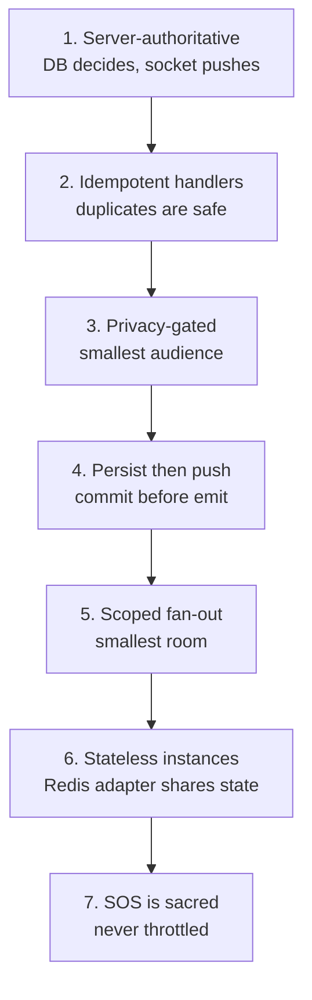
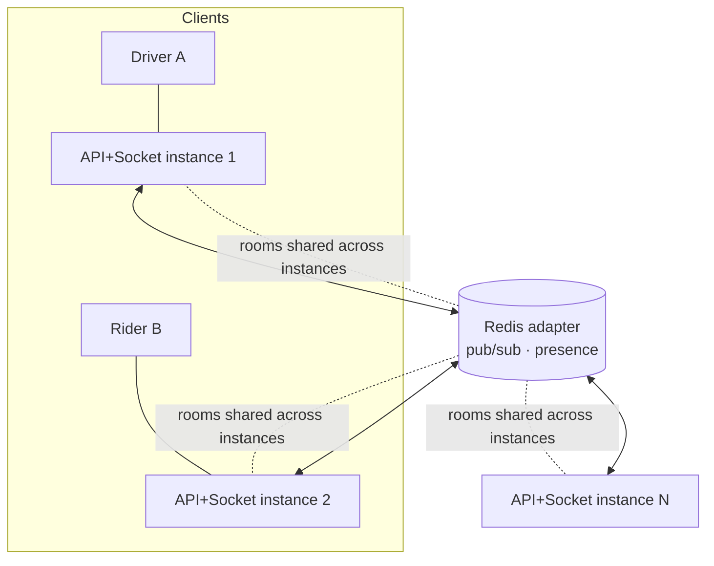
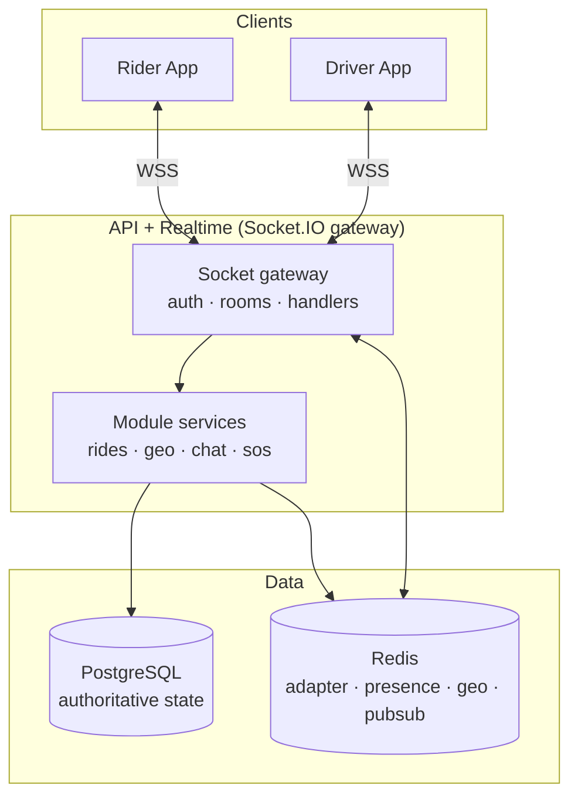
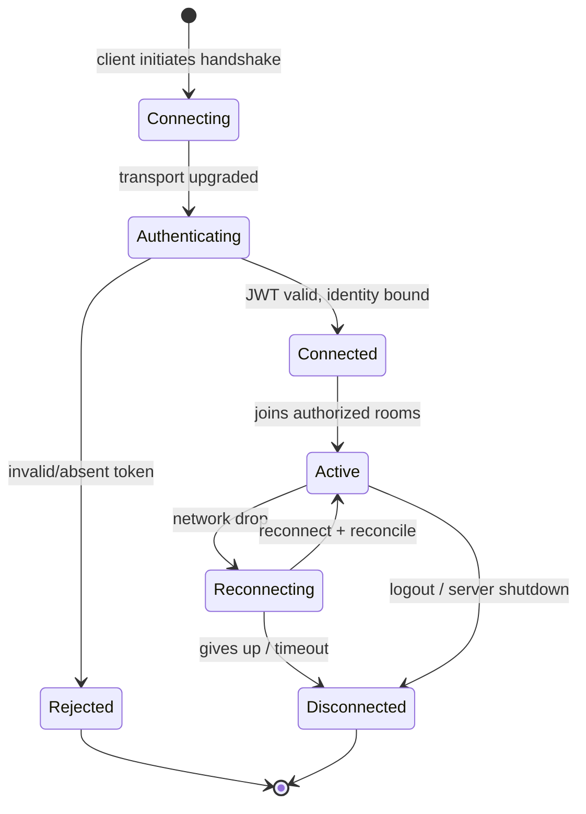
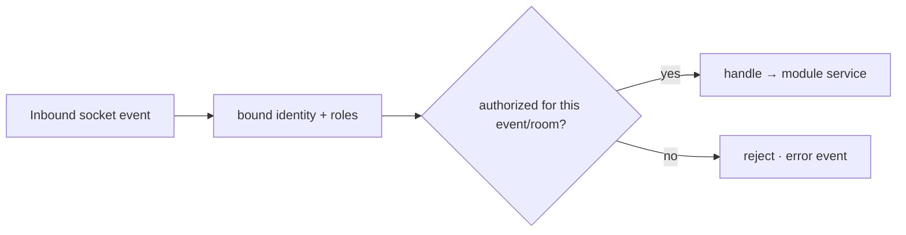
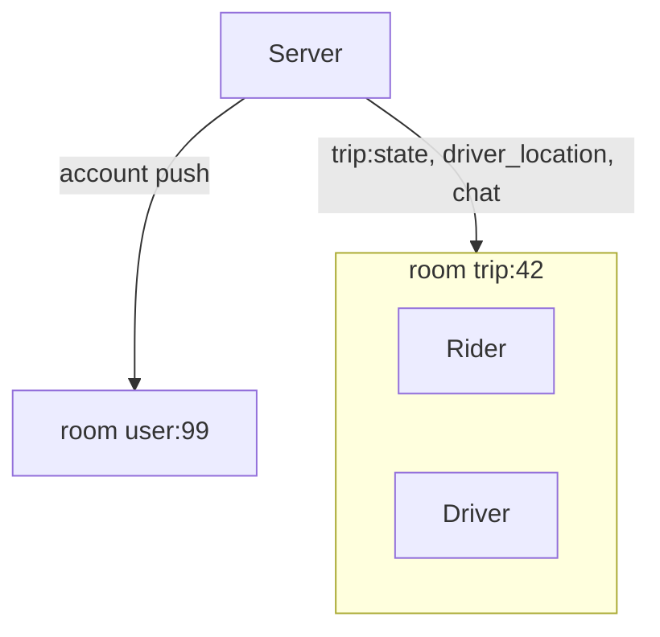
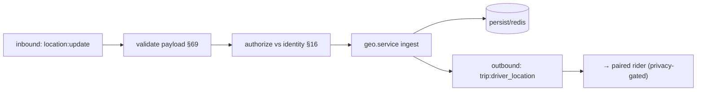
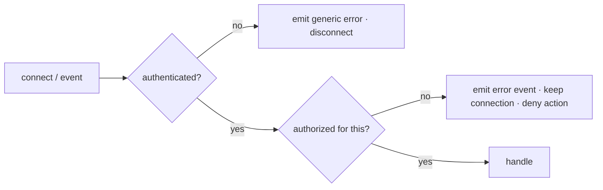

# Zaroorat Engineering Handbook
## Volume 07 — Real-Time Engineering Handbook

| | |
|---|---|
| **Status** | In progress — delivered in parts |
| **Delivered so far** | Part 1 — Real-Time Fundamentals (Ch. 1–10), Part 2 — Real-Time System Architecture (Ch. 11–20), Part 3 — Authentication & Authorization (Ch. 21–27) |
| **Pending** | Part 4 — Connection Management (Ch. 28–36), Part 5 — Driver Tracking (Ch. 37–46), Part 6 — Passenger Tracking (Ch. 47–54), Part 7 — Ride Synchronization (Ch. 55–65), Part 8 — Event Design (Ch. 66–75), Part 9 — Rooms & Namespaces (Ch. 76–84), Part 10 — Presence (Ch. 85–92), Part 11 — Redis Integration (Ch. 93–100), Part 12 — Reliability (Ch. 101–108), Part 13 — Security (Ch. 109–116), Part 14 — Performance (Ch. 117–124), Part 15 — Monitoring (Ch. 125–132), Part 16 — Testing (Ch. 133–140), Part 17 — Production Readiness (Ch. 141–148) + Appendix |
| **Audience** | Backend & platform engineers, DevOps, mobile developers, QA, architects, AI coding agents (Claude Code) |
| **Relationship to other documents** | The enforceable quick-reference is [`SOCKET_GUIDE.md`](../../01_ARCHITECTURE/SOCKET_GUIDE.md); realtime event names/payloads are canonical in [`EVENT_CATALOG.md`](../../01_ARCHITECTURE/EVENT_CATALOG.md); the decision is [ADR-0006](../../01_ARCHITECTURE/ADR/0006-socketio-redis-adapter-realtime.md). This volume is the deep expansion and **never contradicts** those — where they define an event, room, or rule, this volume restates and explains it. The trip state machine is canonical in [`ER_DIAGRAM.md`](../../01_ARCHITECTURE/ER_DIAGRAM.md); socket auth aligns with handbook [Volume 05](../05_AUTH_SECURITY/VOLUME_05_AUTH_SECURITY_ENGINEERING.md). |

**How to use this volume:** the realtime layer carries live driver locations, trip-state pushes, in-trip chat, and SOS. Its first principle governs everything else: **the server is authoritative — sockets *push* state, the database *decides* it.** Read Part 1 for the fundamentals, Part 2 for the architecture, and treat each chapter's **Production Checklist** as the ship gate.

---

## Table of Contents

**Part 1 — Real-Time Fundamentals**
1. What is Real-Time Communication? · 2. Why Ride-Hailing Requires Real-Time · 3. WebSocket vs HTTP · 4. WebSocket vs SSE · 5. Polling vs Long Polling vs WebSockets · 6. Socket.IO Overview · 7. Real-Time Architecture Principles · 8. Latency Targets · 9. Throughput Goals · 10. Scalability Goals

**Part 2 — Real-Time System Architecture**
11. Overall Real-Time Architecture · 12. Gateway Design · 13. Connection Lifecycle · 14. Client Registration · 15. Authentication Flow · 16. Authorization Flow · 17. Namespace Strategy · 18. Room Strategy · 19. Event Routing · 20. Connection State Management

**Part 3 — Authentication & Authorization**
21. Socket Authentication · 22. JWT Verification · 23. Token Refresh · 24. Device Validation · 25. Permission Checks · 26. Session Synchronization · 27. Unauthorized Connection Handling

**Part 4 — Connection Management**
28. Establishing Connections · 29. Reconnection Strategy · 30. Heartbeat/Ping-Pong · 31. Timeouts · 32. Disconnect Handling · 33. Duplicate Connections · 34. Multi-Device Sessions · 35. Connection Cleanup · 36. Graceful Shutdown

**Part 5 — Driver Tracking**
37. Driver Online Workflow · 38. Driver Offline Workflow · 39. Driver Availability · 40. Driver Location Updates · 41. GPS Accuracy · 42. Frequency of Updates · 43. Location Validation · 44. Geofencing · 45. Route Synchronization · 46. Driver State Machine

**Part 6 — Passenger Tracking**
47. Passenger Location Updates · 48. Ride Tracking · 49. ETA Updates · 50. Route Updates · 51. Driver Arrival Notifications · 52. Trip Progress Updates · 53. Live Ride Status · 54. Passenger State Machine

**Part 7 — Ride Synchronization**
55. Ride Lifecycle Events · 56. Ride Request Broadcast · 57. Driver Acceptance · 58. Driver Rejection · 59. Ride Cancellation · 60. Ride Start · 61. Ride Pause · 62. Ride Resume · 63. Ride Completion · 64. Payment Completion · 65. Rating Flow

**Part 8 — Event Design**
66. Event Naming Standards · 67. Event Versioning · 68. Event Payload Structure · 69. Event Validation · 70. Acknowledgements · 71. Event Ordering · 72. Idempotency · 73. Duplicate Event Handling · 74. Retry Strategy · 75. Event Timeouts

**Part 9 — Rooms & Namespaces**
76. Namespace Design · 77. Room Design · 78. Driver Rooms · 79. Passenger Rooms · 80. Ride Rooms · 81. City/Region Rooms · 82. Admin Rooms · 83. Notification Rooms · 84. Presence Rooms

**Part 10 — Presence**
85. Online Presence · 86. Offline Presence · 87. Last Seen · 88. Device Presence · 89. Driver Availability · 90. Passenger Availability · 91. Admin Presence · 92. Presence Synchronization

**Part 11 — Redis Integration**
93. Redis Adapter · 94. Horizontal Scaling · 95. Multi-Instance Synchronization · 96. Pub/Sub · 97. Shared Presence · 98. Distributed Rooms · 99. Event Broadcasting · 100. Failover Strategy

**Part 12 — Reliability**
101. Network Failures · 102. Offline Mode · 103. Reconnection Logic · 104. Event Recovery · 105. Message Replay · 106. Backpressure · 107. Flow Control · 108. Circuit Breaker Strategy

**Part 13 — Security**
109. Socket Security · 110. Event Authorization · 111. Rate Limiting · 112. Abuse Prevention · 113. Replay Attack Prevention · 114. Event Validation · 115. Sensitive Data Protection · 116. Audit Logging

**Part 14 — Performance**
117. Connection Limits · 118. Event Compression · 119. Batching · 120. Payload Optimization · 121. Memory Management · 122. Garbage Collection Considerations · 123. Benchmarking · 124. Capacity Planning

**Part 15 — Monitoring**
125. Connection Metrics · 126. Event Metrics · 127. Latency Metrics · 128. Error Metrics · 129. Health Checks · 130. Alerting · 131. Dashboards · 132. Incident Investigation

**Part 16 — Testing**
133. Unit Testing · 134. Integration Testing · 135. Load Testing · 136. Soak Testing · 137. Chaos Testing · 138. Failure Injection · 139. Performance Testing · 140. Security Testing

**Part 17 — Production Readiness**
141. Deployment Checklist · 142. Scaling Checklist · 143. Monitoring Checklist · 144. Security Checklist · 145. Performance Checklist · 146. Disaster Recovery · 147. Common Mistakes · 148. Future Real-Time Roadmap

**Appendix** — Socket.IO cheat sheet, event naming guide, namespace reference, room design guide, driver/passenger/ride state machines, event catalog, monitoring dashboard guide, glossary.

*Parts 4–17 + Appendix — pending (see header).*

---

# Part 1 — Real-Time Fundamentals

## 1. What is Real-Time Communication?

**What.** Real-time communication is a bidirectional, low-latency channel where the server can **push** data to a client the instant it changes, rather than waiting to be asked. For Zaroorat this is **Socket.IO** over WebSocket transport (ADR-0006, SOCKET_GUIDE).

**Why.** Request/response HTTP is pull-based: the client must ask. But a rider watching their driver approach, or a driver receiving a ride offer, needs the server to *push* the moment something happens — a poll would be either too slow or too wasteful.

| Property | Real-time (Socket.IO) |
|---|---|
| Direction | Bidirectional (client↔server) |
| Initiation | Server can push unprompted |
| Latency | Sub-second for live tracking/state |
| Connection | Long-lived, stateful per socket |
| Transport | WebSocket (with fallbacks) |

**First principle (non-negotiable, SOCKET_GUIDE §1).** Sockets are a fast **delivery** channel, never the source of truth. The database decides state; sockets push it. On reconnect the client reconciles via REST (`GET /rides/:id`).

#### Summary
Real-time communication is a low-latency, bidirectional push channel (Socket.IO/WebSocket) for delivering state changes instantly — but it delivers state, it never owns it; the database remains authoritative.

#### Best Practices
- Treat every socket message as a fast notification of a fact the database already committed, not as the fact itself.

#### Common Mistakes
- Treating a socket message as authoritative state, so a lost/duplicated message corrupts the client's view.

#### Production Checklist
- [ ] Clients reconcile authoritative state via REST on connect/reconnect, never trusting the last socket message.

---

## 2. Why Ride-Hailing Requires Real-Time

**What.** Ride-hailing is a physical-world, two-sided, time-critical system. Several core experiences are impossible without real-time push.

| Experience | Real-time need |
|---|---|
| Live driver location on the map | Continuous position push to the paired rider |
| Ride offer to a driver | Instant push + countdown (dispatch) |
| Trip-state changes (arriving, started) | Immediate both-sides update |
| ETA updates | Recompute + push as the driver moves |
| In-trip chat | Low-latency messaging |
| SOS | Instant, unthrottleable safety signal |

**Why it's core, not cosmetic.** The two-sided marketplace's trust depends on *timeliness* — a rider who can't see their driver approaching, or a driver who gets an offer 30 seconds late, is a broken experience. Real-time is a functional requirement, not a nicety (VOLUME_00, FEATURE_CATALOG).

#### Summary
Live tracking, ride offers, trip-state sync, ETAs, chat, and SOS are all impossible without real-time push — making it a functional requirement of the ride-hailing core loop, not an enhancement.

#### Best Practices
- Design each realtime feature around the specific push it enables and the freshness the experience demands.

#### Common Mistakes
- Treating real-time as optional polish and under-investing in its reliability, when the core experience depends on it.

#### Production Checklist
- [ ] Every core-loop realtime feature has a defined freshness/latency target (§8).

---

## 3. WebSocket vs HTTP

**What.** WebSocket is a persistent, full-duplex connection upgraded from HTTP; plain HTTP is stateless request/response. Zaroorat uses **both, for different jobs** (SYSTEM_ARCHITECTURE): HTTP for commands/queries, WebSocket for live push.

| Dimension | HTTP (REST) | WebSocket (Socket.IO) |
|---|---|---|
| Model | Request/response (pull) | Persistent, bidirectional (push) |
| State | Stateless | Long-lived connection state |
| Server push | No (client must poll) | Yes |
| Overhead per message | Full headers each request | Minimal after handshake |
| Best for | Commands, queries, auth, money | Live location, state pushes, chat |
| Authoritative writes | **Yes** (all mutations) | **No** (push only; commands go via REST) |

**Division of labor (SOCKET_GUIDE).** Mutations and money flow over HTTP (validated, idempotent, transactional). Sockets carry live *notifications* of the resulting state. A driver "accepts" via a REST call; the resulting `trip:state` is *pushed* over the socket.

#### Summary
HTTP handles authoritative commands/queries; WebSocket handles live push. Zaroorat uses both — mutations always go over REST, sockets deliver the resulting state.

#### Best Practices
- Route all state-changing actions through REST (validated, idempotent) and use sockets only to broadcast the outcome.

#### Common Mistakes
- Performing mutations directly over socket events, bypassing the validation, auth, and idempotency the REST pipeline enforces.

#### Production Checklist
- [ ] No authoritative mutation happens over a socket event; commands use REST.

---

## 4. WebSocket vs SSE

**What.** Server-Sent Events (SSE) is a one-way server→client stream over HTTP; WebSocket is bidirectional. Zaroorat needs **bidirectional** (drivers push locations up; server pushes state down), so WebSocket/Socket.IO is the choice.

| Dimension | SSE | WebSocket (chosen) |
|---|---|---|
| Direction | Server→client only | Bidirectional |
| Client→server | Needs a separate HTTP call | Native |
| Reconnection | Built-in (browser) | Socket.IO handles it |
| Binary | No (text/event-stream) | Yes |
| Fit for Zaroorat | Partial (downstream only) | **Full** (driver location ingress + downstream) |

**Why not SSE.** Driver `location:update` flows *up* the socket (SOCKET_GUIDE); SSE can't carry that without a parallel channel. One bidirectional channel is simpler and lower-latency than SSE + separate POSTs.

#### Summary
SSE is one-way; Zaroorat needs bidirectional (driver location up, state down), so WebSocket/Socket.IO is chosen over SSE.

#### Best Practices
- Choose bidirectional transport because ingress (driver locations) and egress (state pushes) share one low-latency channel.

#### Common Mistakes
- Picking a one-way transport and then bolting on a second channel for the upstream direction, adding latency and complexity.

#### Production Checklist
- [ ] The transport supports the upstream `location:update` ingress natively (§40).

---

## 5. Polling vs Long Polling vs WebSockets

**What.** Three ways a client stays current. Socket.IO uses WebSocket as the primary transport with **long-polling as a fallback** when WebSocket is unavailable.

| Approach | How | Latency | Cost | Zaroorat role |
|---|---|---|---|---|
| Short polling | Repeated `GET` on a timer | High (poll interval) | Wasteful (empty responses) | Avoid for live data |
| Long polling | Hold request until data or timeout | Medium | Better, still per-message HTTP | Socket.IO **fallback** transport |
| WebSocket | Persistent full-duplex | Low | Efficient after handshake | **Primary** transport |

**Why not polling for live data.** Polling for driver location every second wastes requests and still lags; WebSocket pushes the instant it changes. Long polling remains as a graceful fallback for constrained networks (Socket.IO handles the upgrade/downgrade transparently).

#### Summary
WebSocket is the primary low-latency transport; long-polling is Socket.IO's transparent fallback for constrained networks; short polling is avoided for live data.

#### Best Practices
- Rely on Socket.IO's transport upgrade so constrained clients degrade to long-polling without app-level changes.

#### Common Mistakes
- Building short-polling loops for live location/state, wasting requests and still lagging behind reality.

#### Production Checklist
- [ ] Live data uses WebSocket with long-polling fallback, not app-level short polling.

---

## 6. Socket.IO Overview

**What.** Socket.IO is the realtime library Zaroorat standardizes on (ADR-0006). It provides connection management, automatic reconnection, rooms/namespaces, acknowledgements, transport fallback, and — critically for scale — a **Redis adapter** so multiple API instances share rooms and broadcasts.

| Feature | Zaroorat use |
|---|---|
| Rooms | `trip:{id}`, `zone:{id}`, `user:{id}` (SOCKET_GUIDE §3) |
| Namespaces | Logical separation of concerns (§17) |
| Acknowledgements | Confirm delivery of critical events (§70) |
| Auto-reconnect | Client resilience on flaky mobile networks (§29) |
| Redis adapter | Horizontal scale across instances (§93, ADR-0006) |
| Transport fallback | WebSocket → long-polling (§5) |

**Why Socket.IO over raw ws.** Raw WebSocket gives a socket and nothing else — no rooms, reconnection, fallback, or multi-instance fan-out. Socket.IO provides exactly the primitives a ride-hailing realtime layer needs, and the Redis adapter is the scale story (ADR-0006).

#### Summary
Socket.IO is the standard realtime layer, chosen for rooms, reconnection, acknowledgements, transport fallback, and the Redis adapter that enables horizontal scale across API instances.

#### Best Practices
- Use Socket.IO's built-in primitives (rooms, acks, reconnection) rather than reimplementing them on raw WebSocket.

#### Common Mistakes
- Reaching for raw `ws` and hand-rolling rooms/reconnection/fan-out, reinventing what Socket.IO + Redis adapter already solve.

#### Production Checklist
- [ ] The Redis adapter is configured so rooms/broadcasts work across all instances (§93).

---

## 7. Real-Time Architecture Principles

**What.** The governing principles for every realtime feature — the socket-layer expression of the platform's rules (SOCKET_GUIDE §5).



| Principle | Rule | Ref |
|---|---|---|
| Server-authoritative | DB decides state; sockets push (§1) | SOCKET_GUIDE §1 |
| Idempotent handlers | Reconnects/retries redeliver; processing twice is safe | §72 |
| Privacy-gated | Location only to the paired rider during an active trip | §115, V05 §101 |
| Persist then push | Emit `trip:state` only after the DB transition commits | §55 |
| Scoped fan-out | Emit to the smallest room that needs it; never broadcast globally | §77 |
| Stateless instances | No sticky in-memory state; Redis adapter shares rooms | §93 |
| SOS exempt | Never rate-limited or feature-flagged | §111, SOCKET_GUIDE |

#### Summary
Seven principles govern the realtime layer: server-authoritative, idempotent handlers, privacy-gated, persist-then-push, scoped fan-out, stateless instances, and SOS-always-exempt.

#### Best Practices
- Check every realtime feature against all seven principles before shipping; violations of any one cause data, privacy, or scale bugs.

#### Common Mistakes
- Emitting a state push before the DB transaction commits, so clients briefly see a state that then rolls back.

#### Production Checklist
- [ ] Every realtime handler is idempotent, scoped, privacy-gated, and emits only after commit.

---

## 8. Latency Targets

**What.** The freshness budgets each realtime interaction must meet. These are **targets to validate under load** (§135), tuned per feature, not arbitrary constants.

| Interaction | Target (p95, guidance) | Notes |
|---|---|---|
| Trip-state push (`trip:state`) | < ~1s from commit to client | User-perceptible correctness |
| Driver location → paired rider | < ~2s end-to-end | Balanced against update frequency (§42) |
| Ride offer to driver (dispatch) | < ~1s | Directly affects acceptance rate |
| Chat message delivery | < ~1s | Conversational feel |
| SOS trigger acknowledged | As fast as possible; never throttled | Safety-critical (§111) |
| Reconnect + reconcile | Seconds; bounded | REST reconcile on reconnect (§29) |

**Why targets, not guarantees.** Mobile networks are variable; the server controls its portion (processing + fan-out) and must keep *that* tight, while the client handles network variance via reconnection and reconciliation.

#### Summary
Each realtime interaction has a p95 latency target (sub-second to a couple of seconds) to validate under load; SOS is always fastest and never throttled.

#### Best Practices
- Measure server-side push latency (commit→emit→ack) separately from network variance so you optimize what you control.

#### Common Mistakes
- Setting no latency targets, so regressions in fan-out or processing go unnoticed until users complain.

#### Production Checklist
- [ ] Latency targets are defined per interaction and validated under load (§135).

---

## 9. Throughput Goals

**What.** The event volume the realtime layer must sustain — dominated by high-frequency driver `location:update` ingress and location fan-out.

| Load driver | Scale factor |
|---|---|
| Concurrent driver connections | Grows with active drivers per city |
| Location updates | frequency (§42) × online drivers — the dominant volume |
| Location fan-out | active trips × update frequency (to paired riders) |
| Trip-state events | Bursty, low-volume vs location |
| Chat | Low volume |

| Control | Effect |
|---|---|
| Rate-bound ingress (§42, §111) | Cap/merge `location:update` server-side; drop excess, don't queue |
| Scoped fan-out (§77) | Push location only to the one paired rider, not a broadcast |
| Presence in Redis with TTL | Hot geo/presence off the DB (SOCKET_GUIDE §6) |
| Horizontal scale (§93) | Add instances behind the Redis adapter |

**Why location dominates.** With N online drivers each sending updates every few seconds, location ingress is orders of magnitude larger than all other events combined — so throughput design centers on bounding and efficiently fanning out location.

#### Summary
Throughput is dominated by driver location ingress and fan-out; the design bounds ingress, scopes fan-out to the paired rider, keeps presence in Redis, and scales horizontally.

#### Best Practices
- Design capacity around location update volume (frequency × drivers); it dwarfs every other event type.

#### Common Mistakes
- Broadcasting location widely or queueing every raw update, amplifying the dominant load instead of bounding it.

#### Production Checklist
- [ ] Location ingress is rate-bounded/merged and fanned out only to the paired rider.

---

## 10. Scalability Goals

**What.** The realtime layer scales **horizontally** — stateless API+socket instances behind the Redis adapter, so capacity grows by adding pods (ADR-0006, VOLUME_00).



| Goal | Mechanism |
|---|---|
| Add capacity by adding pods | Stateless instances (§20) |
| Cross-instance rooms/broadcasts | Redis adapter (§93) |
| No single bottleneck | Redis-backed presence/geo; DB for authoritative state (NFR-4) |
| Survive instance loss | Clients reconnect + reconcile via REST (§29) |
| Independent worker scaling | Async work in BullMQ, off the socket path (QUEUE_GUIDE) |

**Why stateless matters.** If a socket instance held authoritative in-memory state, you couldn't add/remove pods freely. Keeping instances stateless (state in Postgres/Redis) is what makes horizontal scale and rolling deploys safe.

#### Summary
The realtime layer scales horizontally via stateless instances behind the Redis adapter, with authoritative state in Postgres and presence/geo in Redis — no single bottleneck, instance loss survived by reconnect+reconcile.

#### Best Practices
- Keep socket instances stateless so pods can be added, removed, and rolled without losing authoritative state.

#### Common Mistakes
- Storing authoritative or unshared session state in a single instance's memory, breaking horizontal scale and rolling deploys.

#### Production Checklist
- [ ] Instances are stateless; rooms/presence are shared via Redis; instance loss is survived by client reconcile.

---

# Part 2 — Real-Time System Architecture

## 11. Overall Real-Time Architecture

**What.** The realtime layer is the Socket.IO gateway inside the API process, sharing the codebase and datastores, scaled by the Redis adapter, with authoritative state in Postgres (SYSTEM_ARCHITECTURE, SOCKET_GUIDE).



| Component | Role |
|---|---|
| Socket gateway | Auth handshake, room membership, event handlers (no business logic — §12) |
| Module services | Own the rules (rides/geo/chat/sos) — handlers call them like controllers do (SOCKET_GUIDE §6) |
| Postgres | Authoritative trip/money state |
| Redis | Adapter (cross-instance), presence, hot geo, pub/sub |

#### Summary
The realtime architecture is a Socket.IO gateway in the API process that authenticates, manages rooms, and delegates to module services — with Postgres authoritative and Redis providing the adapter, presence, and geo.

#### Best Practices
- Keep the gateway thin: it authenticates, routes to rooms, and calls module services — exactly as an HTTP controller does.

#### Common Mistakes
- Putting business logic in socket handlers instead of delegating to the owning module's service (SOCKET_GUIDE §6).

#### Production Checklist
- [ ] Socket handlers carry no business logic; they validate, authorize, and call a module service.

---

## 12. Gateway Design

**What.** The socket gateway is the realtime entry point — the equivalent of the HTTP route+controller layer. It authenticates connections, enforces room membership, validates and authorizes each event, then delegates to module services.

| Gateway responsibility | Detail |
|---|---|
| Handshake auth | Verify JWT on connect; bind `userId`+roles (§21) |
| Room management | Join authorized rooms; enforce membership (§18) |
| Event validation | Validate payloads (schema) before handling (§69) |
| Authorization | Per-event authorization against the bound identity (§16, §110) |
| Delegation | Call the owning module's service — no logic here (§11) |
| Error emission | Emit `error` event; keep the connection alive (SOCKET_GUIDE §5) |

**Design rule.** The gateway is to sockets what a controller is to HTTP: a thin, secure adapter. All rules live in module services — the gateway never owns domain logic.

#### Summary
The gateway is a thin, secure realtime adapter — authenticate, manage rooms, validate/authorize events, delegate to services, emit errors without killing the connection — holding no business logic itself.

#### Best Practices
- Mirror the HTTP controller discipline in the gateway: validate, authorize, one service call, shaped result.

#### Common Mistakes
- Letting the gateway grow domain logic, duplicating (and drifting from) the module services' rules.

#### Production Checklist
- [ ] The gateway validates and authorizes every event and delegates to a service.

---

## 13. Connection Lifecycle

**What.** The stages a socket connection moves through, from handshake to cleanup — each with defined behavior.



| Stage | Behavior |
|---|---|
| Connecting | Transport handshake (WS, or long-poll fallback) |
| Authenticating | JWT verified; unauthenticated → rejected (§21, §27) |
| Connected | Identity bound (`userId`, roles) |
| Active | Joined authorized rooms; sending/receiving events |
| Reconnecting | Auto-reconnect; on success, reconcile via REST (§29) |
| Disconnected | Presence updated; cleanup (§35) |

#### Summary
A connection flows connecting → authenticating → connected → active → (reconnecting) → disconnected, with authentication gating entry and reconciliation on reconnect.

#### Best Practices
- Define explicit behavior at each lifecycle stage, especially reconnect (reconcile) and disconnect (cleanup + presence).

#### Common Mistakes
- No defined reconnect behavior, so clients resume with stale state instead of reconciling.

#### Production Checklist
- [ ] Every lifecycle transition has defined handling, including auth rejection and reconnect reconcile.

---

## 14. Client Registration

**What.** After authentication, the client is *registered* into the realtime topology — bound to its identity, device/session, and the rooms it's authorized to join (§18).

| Registration step | Detail |
|---|---|
| Bind identity | Socket ↔ `userId` + roles (from the verified JWT, §21) |
| Bind device/session | Associate the socket with the device session (V05 §31) |
| Join rooms | `user:{id}` always; `trip:{id}` if a party to an active trip; `zone:{id}` for drivers (§18) |
| Register presence | Mark online in Redis with TTL (§85) |
| Reconcile | Client fetches current authoritative state via REST (§29) |

**Why register explicitly.** Registration is where authorization becomes concrete — a client joins only the rooms it's entitled to, so it can only receive events meant for it (privacy-gating, §115).

#### Summary
Client registration binds the authenticated socket to its identity, device/session, and authorized rooms, marks presence, and triggers a REST reconcile — making authorization concrete at join time.

#### Best Practices
- Authorize room joins at registration so a client can only ever receive events it's entitled to.

#### Common Mistakes
- Letting a client join arbitrary rooms (e.g. any `trip:{id}`), leaking other users' events.

#### Production Checklist
- [ ] A client joins only rooms it's authorized for; presence is registered with a TTL.

---

## 15. Authentication Flow

**What.** How a connection proves identity at handshake — a JWT access token verified before the socket becomes usable (SOCKET_GUIDE §2, V05 Part 3).

```mermaid
sequenceDiagram
    participant App
    participant GW as Socket Gateway
    participant Auth
    App->>GW: connect (handshake w/ access token)
    GW->>Auth: verify JWT (signature, alg, exp, revocation)
    alt valid
        Auth-->>GW: identity { userId, roles }
        GW->>GW: bind identity; join authorized rooms
        GW-->>App: connected
    else invalid/absent
        GW-->>App: error + disconnect (§27)
    end
```

| Rule | Detail |
|---|---|
| Token on handshake | Access token supplied at connect (SOCKET_GUIDE §2) |
| Full verification | Signature, pinned alg, expiry, revocation (V05 §25, §29) |
| Bind on success | `userId` + roles bound to the socket |
| Reject on failure | Unauthenticated sockets are dropped (§27) |
| Same source of truth | Uses the same token verification as HTTP (V05 §71) |

#### Summary
Authentication happens at handshake: the access token is fully verified (signature, alg, expiry, revocation) and, on success, identity is bound and authorized rooms joined — unauthenticated sockets are dropped.

#### Best Practices
- Reuse the exact HTTP token-verification logic at the handshake so socket and REST auth can never diverge.

#### Common Mistakes
- Accepting a socket connection first and verifying lazily, exposing a window where an unauthenticated socket is active.

#### Production Checklist
- [ ] The handshake verifies the token before the socket is usable; failures disconnect.

---

## 16. Authorization Flow

**What.** Beyond authentication (who), authorization decides what a connection may do — which rooms it joins and which events it may send/receive, checked against the bound identity (SOCKET_GUIDE §2, V05 Part 6).

| Authorization point | Rule |
|---|---|
| Room join | Only if a party to that resource (e.g. `trip:{id}` requires being the trip's rider/driver) (§18) |
| Inbound event | Authorized against the socket's identity+roles (e.g. only the driver sends `location:update`) |
| Outbound (privacy) | Location only to the paired rider during an active trip (§115) |
| Deny by default | No explicit allow → the event/join is denied (V05 §2) |



#### Summary
Authorization gates room joins and every inbound/outbound event against the socket's bound identity and roles, deny-by-default — the same authorization model as HTTP, applied to realtime.

#### Best Practices
- Authorize each event against the bound identity, exactly as an HTTP endpoint authorizes each request — never trust the client's claimed role.

#### Common Mistakes
- Authorizing at connect but not per-event, letting a connected client send events it shouldn't (e.g. spoofing another's location).

#### Production Checklist
- [ ] Every room join and inbound event is authorized against the bound identity, deny-by-default.

---

## 17. Namespace Strategy

**What.** Socket.IO namespaces logically separate concerns over one connection. Zaroorat keeps namespaces **minimal and purpose-driven**, using rooms (§18) for the fine-grained routing rather than proliferating namespaces.

| Option | When |
|---|---|
| Default namespace + rooms | The primary approach — one app namespace, routing via rooms (§18) |
| Dedicated namespace | Only for a clearly separate concern with distinct auth/lifecycle (e.g. an admin/ops console vs the rider/driver apps) |

**Design stance.** Rooms, not namespaces, do the heavy lifting of routing (trip/user/zone). Reserve namespaces for genuinely distinct surfaces (e.g. ops) so the model stays simple — over-namespacing adds connection complexity for little gain.

#### Summary
Zaroorat uses minimal, purpose-driven namespaces (rooms do the fine-grained routing), reserving a dedicated namespace only for a genuinely separate surface like an ops console.

#### Best Practices
- Route with rooms and keep namespaces few; add a namespace only for a truly distinct auth/lifecycle surface.

#### Common Mistakes
- Proliferating namespaces for routing that rooms should handle, complicating connection management.

#### Production Checklist
- [ ] Namespaces are minimal and justified; routing is primarily room-based (§18).

---

## 18. Room Strategy

**What.** Rooms are the routing primitive — a socket joins the rooms whose events it should receive. Zaroorat's canonical rooms (SOCKET_GUIDE §3):

| Room | Members | Purpose |
|---|---|---|
| `trip:{id}` | the trip's rider + driver | Trip state, driver location, chat, SOS for that trip |
| `zone:{id}` | drivers in a zone | Supply/geo distribution (presence) |
| `user:{id}` | one user's sockets | Account-level pushes across their devices |



| Rule | Detail |
|---|---|
| Authorized join only | A user joins `trip:{id}` only if a party to that trip (§14, §16) |
| Smallest scope | Emit to the smallest room that needs the event (§77 scoped fan-out) |
| Cross-instance | Rooms are shared via the Redis adapter (§93) |

#### Summary
Rooms are the routing primitive — `trip:{id}`, `zone:{id}`, `user:{id}` — joined only when authorized and shared across instances via the Redis adapter, enabling smallest-scope fan-out.

#### Best Practices
- Emit to the most specific room (`trip:{id}`) rather than broadcasting, so events reach exactly their intended audience.

#### Common Mistakes
- Broadcasting globally or to a broad room instead of the specific `trip:{id}`, leaking data and wasting bandwidth.

#### Production Checklist
- [ ] Events target the smallest authorized room; joins are authorization-gated.

---

## 19. Event Routing

**What.** How an inbound event reaches the right handler and an outbound event reaches the right room — the realtime equivalent of HTTP routing.



| Direction | Routing |
|---|---|
| Inbound | Event name → validated → authorized → owning module service (SOCKET_GUIDE §6) |
| Outbound | Module service emits → smallest room (§18) → clients |
| Ownership | Location→`geo`, trip pushes→`rides`, chat→`chat`, SOS→`sos` (SOCKET_GUIDE §6) |

#### Summary
Inbound events are validated, authorized, and routed to the owning module service; outbound events are emitted by services to the smallest scoped room — mirroring HTTP routing discipline.

#### Best Practices
- Route each inbound event to exactly one owning module service, and each outbound event to the narrowest room.

#### Common Mistakes
- Handling an event in the wrong module (e.g. trip logic in the geo handler), blurring ownership boundaries.

#### Production Checklist
- [ ] Each event routes to its owning module (location→geo, trip→rides, chat→chat, sos→sos).

---

## 20. Connection State Management

**What.** What state a connection carries and where it lives. The rule: **instances are stateless for authoritative data** — connection-local binding is fine, but authoritative and shared state live in Postgres/Redis (§10, ADR-0006).

| State | Where it lives |
|---|---|
| Socket↔identity binding | Connection-local (per instance) — rebuilt on reconnect from the token |
| Room membership | Socket.IO + Redis adapter (shared across instances) (§93) |
| Presence (online/last-seen) | Redis with TTL (§85) |
| Authoritative trip/money state | Postgres (never the socket) (§1) |
| Hot geo/driver position | Redis (§40, SOCKET_GUIDE §6) |

**Why stateless instances.** Authoritative state in a single instance's memory would break horizontal scale, rolling deploys, and failover. Connection binding is ephemeral and re-established on reconnect; everything durable is in Postgres/Redis.

#### Summary
Connection binding is ephemeral and instance-local; room membership, presence, and geo live in Redis, and authoritative state lives in Postgres — keeping instances stateless and horizontally scalable.

#### Best Practices
- Keep only ephemeral binding in instance memory; put anything that must survive reconnect or instance loss in Redis/Postgres.

#### Common Mistakes
- Holding authoritative or must-survive state in a socket instance's memory, breaking scale and failover.

#### Production Checklist
- [ ] No authoritative or must-survive state lives only in an instance's memory.

---

# Part 3 — Authentication & Authorization

## 21. Socket Authentication

**What.** The realtime application of Volume 05's auth model: a socket authenticates with the **JWT access token on the handshake**; unauthenticated sockets are rejected (SOCKET_GUIDE §2, V05 §71).

| Rule | Detail |
|---|---|
| Access token at handshake | Supplied in the connection auth payload |
| Verified before use | Signature, pinned alg, expiry, revocation (§22) |
| Identity bound | `userId` + roles attached to the socket for the connection's life |
| Rejected on failure | No token / invalid → disconnect with `error` (§27) |
| Same model as HTTP | Bearer-token identity, one verification path (V05 §71) |

**Why handshake-time.** Authenticating at the handshake means an unauthenticated socket never becomes usable — there's no window where an anonymous connection can send or receive events.

#### Summary
Sockets authenticate with the JWT access token at handshake, verified before the socket is usable and bound to identity for the connection — mirroring the HTTP bearer-token model.

#### Best Practices
- Authenticate at the handshake so no socket is ever usable before identity is established.

#### Common Mistakes
- Allowing the connection and deferring auth to the first event, creating an anonymous-but-connected window.

#### Production Checklist
- [ ] Unauthenticated handshakes are rejected before the socket can send/receive.

---

## 22. JWT Verification

**What.** The verification performed on the handshake token — identical to the HTTP path (V05 §25, §71), because divergent verification is a security hole.

| Check | Rule |
|---|---|
| Signature | Verified with the pinned algorithm; `alg:none`/header-chosen rejected (V05 §25) |
| Expiry | Expired tokens rejected (client refreshes, §23) |
| Revocation | `jti` blocklist checked (V05 §29) |
| Claims | `sub` + roles extracted; no PII expected in token |
| Shared logic | The same verification module as HTTP middleware (no copy) |

#### Summary
Handshake JWT verification checks signature (pinned algorithm), expiry, and revocation using the same logic as HTTP — never a divergent socket-only implementation.

#### Best Practices
- Call the shared token-verification module at the handshake so socket and HTTP verification are provably identical.

#### Common Mistakes
- A socket-specific token check that skips revocation or algorithm pinning, diverging from the HTTP guarantees.

#### Production Checklist
- [ ] Handshake verification rejects `alg:none`, expired, and revoked tokens via shared logic.

---

## 23. Token Refresh

**What.** How a long-lived socket handles an access token expiring mid-connection: the client refreshes (over REST) and **re-authenticates** the socket; the server drops sockets that become unauthenticated (SOCKET_GUIDE §2).

```mermaid
sequenceDiagram
    participant App
    participant GW as Gateway
    Note over App: access token nearing expiry
    App->>App: refresh via REST (rotating refresh token, V05 §27)
    App->>GW: re-authenticate socket (new access token)
    GW->>GW: verify; rebind identity
    alt still valid
        GW-->>App: continue
    else cannot re-auth
        GW-->>App: disconnect (§27)
    end
```

| Rule | Detail |
|---|---|
| Refresh over REST | Access tokens refresh via the REST refresh flow (V05 §27), not over the socket |
| Re-authenticate | Client presents the new token to the socket; identity rebinds |
| Drop if unauthenticated | A socket that can't re-auth is dropped (SOCKET_GUIDE §2) |
| No privilege drift | Rebinding picks up current roles (revocation takes effect) |

#### Summary
On mid-connection token expiry, the client refreshes over REST and re-authenticates the socket; sockets that can't re-authenticate are dropped, and rebinding picks up current privileges.

#### Best Practices
- Refresh the access token over REST and re-authenticate the socket before expiry, so the connection never runs on an expired token.

#### Common Mistakes
- Letting a socket keep operating on an expired token, or refreshing tokens over the socket instead of the REST flow.

#### Production Checklist
- [ ] Mid-connection expiry triggers re-authentication; unauthenticated sockets are dropped.

---

## 24. Device Validation

**What.** Binding the socket to the authenticated device/session (V05 §19, §31) so realtime activity participates in device-level security and revocation.

| Rule | Detail |
|---|---|
| Bind to session | Socket associated with the device session established at login (V05 §31) |
| Revocation-aware | Revoking the device session (V05 §111) drops its sockets |
| Anomaly signals | Socket context contributes to risk signals (V05 §115) |
| Multi-device | Each device's socket is independent (§34) |

**Why.** Device binding means "log out this device" or a theft-triggered revocation also terminates that device's live socket — realtime isn't a backdoor around session revocation.

#### Summary
Sockets are bound to the device session so realtime respects device-level revocation and contributes to risk signals — realtime is never a bypass around session control.

#### Best Practices
- Tie each socket to its device session so revoking the session also terminates its live connection.

#### Common Mistakes
- Leaving a socket alive after its device session is revoked, creating a realtime bypass of logout/theft response.

#### Production Checklist
- [ ] Revoking a device session terminates its sockets.

---

## 25. Permission Checks

**What.** Per-event authorization against the socket's roles/capabilities — the realtime application of RBAC + ownership (V05 Part 6).

| Event | Permission rule |
|---|---|
| `location:update` (driver→server) | Only a `driver` may send; only for their own position |
| `trip:*` room events | Only parties to the trip receive (§18) |
| `chat:message` | Only trip participants, active trip only (SOCKET_GUIDE) |
| `sos:trigger` | Any party to an active trip; never blocked (§111) |
| admin/ops events | Role-gated + audited (V05 §70) |

**Rule.** A socket's role claim is *carried* by the verified token but the server remains the source of truth (V05 §60) — permission checks never trust a client-asserted role.

#### Summary
Every event is permission-checked against the socket's server-verified roles and resource ownership — drivers send their own location, only trip parties get trip events, SOS is never blocked.

#### Best Practices
- Check ownership on realtime events too (a driver can only update *their* location), not just role.

#### Common Mistakes
- Allowing any connected socket to emit `location:update` for any driver id, enabling location spoofing (V05 §121).

#### Production Checklist
- [ ] Each event enforces role + ownership; client-asserted roles are never trusted.

---

## 26. Session Synchronization

**What.** Keeping the socket's authorization state consistent with the account's session state across the fleet — so a change (logout, suspension, role change) propagates to live sockets.

| Change | Propagation to sockets |
|---|---|
| Logout (this device) | That device's socket dropped (§24) |
| Log out everywhere / suspend | All the user's sockets dropped (V05 §29, §32) |
| Role change | Re-auth rebinds current roles (§23) |
| Token revocation | Blocklist check fails re-auth; socket dropped |
| Cross-instance | Propagated via Redis (adapter/pub-sub) so it reaches whichever instance holds the socket (§93) |

**Why cross-instance.** A user's socket may be on any instance; session changes must reach it wherever it is — Redis pub/sub carries the "drop these sockets" signal fleet-wide.

#### Summary
Session changes (logout, suspension, revocation, role change) propagate to live sockets fleet-wide via Redis, so realtime authorization stays consistent with account state across all instances.

#### Best Practices
- Propagate revocation/suspension to sockets over Redis so it reaches the connection on whatever instance holds it.

#### Common Mistakes
- Revoking a session in the DB but leaving the live socket connected on another instance, which keeps receiving events.

#### Production Checklist
- [ ] Suspension/logout/revocation drop the affected sockets fleet-wide.

---

## 27. Unauthorized Connection Handling

**What.** How the gateway treats connections/events that fail authentication or authorization — fail closed, cleanly, without leaking why (V05 §2, §85).



| Case | Handling |
|---|---|
| Unauthenticated handshake | Reject + disconnect (§21) |
| Expired/revoked mid-connection | Drop after failed re-auth (§23) |
| Unauthorized event | Emit `error`, deny the action, **keep the connection** (SOCKET_GUIDE §5) |
| Unauthorized room join | Deny the join; no membership granted (§18) |
| Error content | Generic; no stack/internal detail (V05 §85) |

**Nuance.** Authentication failure disconnects; a single *authorization* failure on one event does **not** kill the whole connection (errors don't kill the socket, SOCKET_GUIDE §5) — it denies that action and emits an `error`.

#### Summary
Unauthenticated connections are disconnected; unauthorized single events are denied with a generic `error` while keeping the connection alive — failing closed without leaking internals.

#### Best Practices
- Disconnect on authentication failure but keep the socket alive on a single authorization denial, emitting a generic error.

#### Common Mistakes
- Killing the whole connection on every authorization error (harming legitimate reconnect/UX) or leaking why auth failed.

#### Production Checklist
- [ ] Auth failures disconnect; per-event authorization failures deny + error without dropping the connection; errors are generic.

---

## Parts 4–17 + Appendix — pending

The following parts are planned and will be delivered in subsequent installments, in the same format (per-chapter Summary, Best Practices, Common Mistakes, Production Checklist):

- **Part 4 — Connection Management** (Ch. 28–36): establishing, reconnection, heartbeat, timeouts, disconnect, duplicates, multi-device, cleanup, graceful shutdown.
- **Part 5 — Driver Tracking** (Ch. 37–46): online/offline workflows, availability, location updates, GPS accuracy, frequency, validation, geofencing, route sync, driver state machine.
- **Part 6 — Passenger Tracking** (Ch. 47–54): location updates, ride tracking, ETA, route updates, arrival notifications, progress, live status, passenger state machine.
- **Part 7 — Ride Synchronization** (Ch. 55–65): full lifecycle events with sequence diagrams — request broadcast, accept/reject, cancellation, start, pause/resume, completion, payment, rating. *(Pause/Resume will be reconciled against the canonical trip state machine in `ER_DIAGRAM.md`, which does not currently include them.)*
- **Part 8 — Event Design** (Ch. 66–75): naming, versioning, payloads, validation, acks, ordering, idempotency, duplicate handling, retry, timeouts.
- **Part 9 — Rooms & Namespaces** (Ch. 76–84): namespace/room design, driver/passenger/ride/city/admin/notification/presence rooms.
- **Part 10 — Presence** (Ch. 85–92): online/offline/last-seen, device presence, availability, admin presence, synchronization.
- **Part 11 — Redis Integration** (Ch. 93–100): adapter, horizontal scaling, multi-instance sync, pub/sub, shared presence, distributed rooms, broadcasting, failover.
- **Part 12 — Reliability** (Ch. 101–108): network failures, offline mode, reconnection, event recovery, message replay, backpressure, flow control, circuit breakers.
- **Part 13 — Security** (Ch. 109–116): socket security, event authorization, rate limiting, abuse prevention, replay prevention, event validation, sensitive-data protection, audit logging.
- **Part 14 — Performance** (Ch. 117–124): connection limits, compression, batching, payload optimization, memory/GC, benchmarking, capacity planning.
- **Part 15 — Monitoring** (Ch. 125–132): connection/event/latency/error metrics, health checks, alerting, dashboards, incident investigation.
- **Part 16 — Testing** (Ch. 133–140): unit, integration, load, soak, chaos, failure injection, performance, security testing.
- **Part 17 — Production Readiness** (Ch. 141–148): deployment/scaling/monitoring/security/performance checklists, disaster recovery, common mistakes, roadmap.
- **Appendix**: Socket.IO cheat sheet, event naming guide, namespace reference, room design guide, driver/passenger/ride state machines, event catalog, monitoring dashboard guide, glossary.

---

*End of delivered installment (Parts 1–3, Chapters 1–27). Continue with Part 4 in the next installment.*
