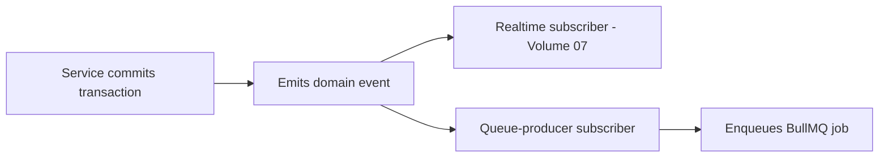
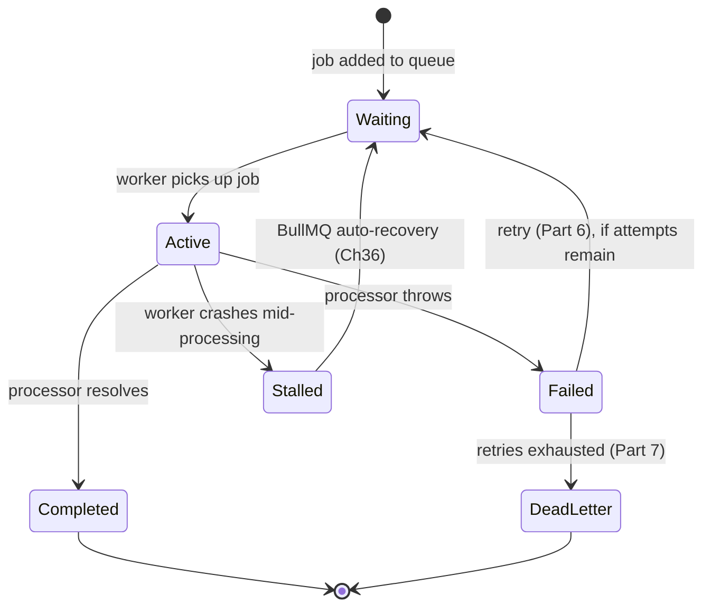
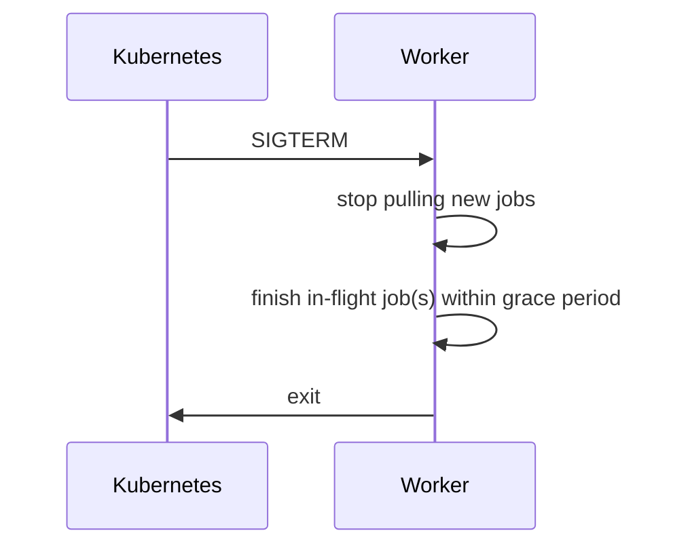

# Zaroorat Engineering Handbook

## Volume 08 — Background Jobs Engineering Handbook

|                                     |                                                                                                                                                                                                                                                                                         |
| ----------------------------------- | --------------------------------------------------------------------------------------------------------------------------------------------------------------------------------------------------------------------------------------------------------------------------------------- |
| **Status**                          | In progress — delivered in parts                                                                                                                                                                                                                                                        |
| **Delivered so far**                | Part 1 — Background Processing Fundamentals (Ch. 1–10), Part 2 — BullMQ Architecture (Ch. 11–20), Part 3 — Queue Design (Ch. 21–30), Part 4 — Worker Design (Ch. 31–39)                                                                                                                 |
| **Pending**                         | Parts 5–17 + Appendix (Ch. 40–~150)                                                                                                                                                                                                                                                     |
| **Relationship to other documents** | `VOLUME_02 §4` placed queues architecturally ("if it can happen after the response, it's a queue job"); this volume is the deep BullMQ-specific engineering reference. Domain queue chapters (Part 9, pending) will cross-reference module `SPEC.md §14 Queue Jobs` once modules exist. |

---

# Part 1 — Background Processing Fundamentals

## 1. What Are Background Jobs?

Work executed outside the HTTP request/response cycle — the client doesn't wait for it, and it may run seconds, minutes, or (for scheduled jobs) hours after the triggering event. In Zaroorat: sending a push notification, generating a payout batch, expiring a stale ride request, aggregating daily analytics.

#### Summary

A background job is any unit of work whose completion the client is never blocked waiting on — restates Volume 02 §4's placement rule from the job's own point of view.

#### Best Practices

- Before adding new logic to a request handler, ask whether the client actually needs to wait for it to finish — if not, it belongs in a queue.

#### Common Mistakes

- Doing genuinely deferrable work (e.g. sending a notification) synchronously inside a request handler, adding latency the client doesn't need to experience.

#### Production Checklist

- [ ] Every request handler's synchronous work is limited to what the client's response actually depends on

---

## 2. Why Use Background Processing?

Three reasons, all present in Zaroorat: (1) **latency isolation** — a slow downstream call (SMS provider, push notification service) shouldn't slow down the API response; (2) **reliability** — a job can be retried (Part 6) independent of the original request's lifecycle, which has already returned; (3) **load smoothing** — a burst of ride completions doesn't need to synchronously trigger a burst of payout calculations at the exact same moment.

#### Summary

Background processing exists to isolate the request path from work that's slow, unreliable, or bursty — restates Volume 00 §6's latency NFR from the queue's perspective.

#### Best Practices

- Route any call to a third-party service that isn't strictly required for the response (SMS, push, email) through a queue rather than calling it inline.

#### Common Mistakes

- An inline, synchronous call to a third-party notification provider inside a request handler, meaning that provider's latency or downtime directly degrades Zaroorat's own API latency/availability.

#### Production Checklist

- [ ] No request handler makes a synchronous call to a non-essential third-party service

---

## 3. Synchronous vs Asynchronous Processing

|                             | Synchronous (in request path)                                                                          | Asynchronous (queued)                                                                                                                 |
| --------------------------- | ------------------------------------------------------------------------------------------------------ | ------------------------------------------------------------------------------------------------------------------------------------- |
| **What**                    | Work completes before the response is sent                                                             | Work is enqueued; response returns immediately                                                                                        |
| **Benefits**                | Simpler; client gets an immediate, definitive result                                                   | Client isn't blocked by slow/unreliable work; retryable independently                                                                 |
| **Trade-offs**              | Client latency includes every synchronous step's latency; a failure anywhere blocks the whole response | Client doesn't get immediate confirmation of the deferred work's outcome (must poll or receive a separate realtime update, Volume 07) |
| **Alternatives considered** | Asynchronous                                                                                           | Synchronous                                                                                                                           |
| **When to use**             | Work the client's response _depends on_ (e.g. creating the ride record itself)                         | Work the client doesn't need confirmed before moving on (sending a notification, generating a receipt PDF)                            |
| **When not to use**         | Slow/unreliable third-party calls, notifications, analytics, batch work                                | The actual core business operation the request is about                                                                               |

#### Summary

The dividing line is simple: if the response would be meaningfully wrong or incomplete without this step's result, it's synchronous; otherwise, it's a queue job.

#### Best Practices

- When in doubt, ask "if this step failed silently right now, would the client's response still be correct?" If yes, it's a queue candidate.

#### Common Mistakes

- Making an operation synchronous "just to be safe" when its failure genuinely wouldn't invalidate the response, adding unnecessary latency and failure coupling.

#### Production Checklist

- [ ] Every synchronous step in a request handler is justified by "the response depends on this"

---

## 4. Event-Driven Processing

Restates `VOLUME_02 §4` and `VOLUME_07 §19`: a service emits a domain event after its triggering transaction commits; both the realtime layer (Volume 07) and the queue-producing layer subscribe to relevant domain events. A queue job is very often _triggered by_ a domain event, not called directly from the service method — keeping the service layer decoupled from knowing which specific background work exists downstream of its actions.

#### Summary

Queue jobs are, in the common case, a subscriber reaction to a domain event — not a direct service-to-queue call — mirroring exactly how the realtime layer subscribes rather than being called directly (Volume 07 §7 principle 2).

#### Best Practices

- Keep a service method's job-enqueuing logic in a subscriber layer where practical, so the service method itself doesn't need to know "and also enqueue a payout-eligibility-check job" as an explicit line of its own logic.

#### Common Mistakes

- A service method calling `queue.add(...)` directly for every downstream side effect, accumulating knowledge of every consumer's needs inside the module that shouldn't need to know they exist.

#### Production Checklist

- [ ] Queue-producing subscribers are organized by domain event, mirroring the realtime subscriber pattern (Volume 07 §19)

---

## 5. Queue-Based Architecture

A queue (BullMQ, backed by Redis) sits between "something that should happen" and "a worker process that makes it happen," providing durability (the job survives even if no worker is available right this instant), ordering (within a single queue, FIFO by default), and retry semantics (Part 6) — none of which a simple in-process `setTimeout` or fire-and-forget async call could provide.

#### Summary

The queue is the durability and retry guarantee itself — the reason background work in Zaroorat is trustworthy rather than "probably happened."

#### Best Practices

- Never substitute a queue with an in-process, non-durable mechanism (a `setTimeout`, an un-awaited promise) for anything that matters if the process restarts before it completes.

#### Common Mistakes

- A "quick" fire-and-forget async call (no queue) for something that actually matters (e.g. triggering a payout calculation), which silently disappears if the process crashes or redeploys before it finishes.

#### Production Checklist

- [ ] No business-meaningful deferred work relies on an in-process, non-durable mechanism

---

## 6. Distributed Workers

Restates `VOLUME_02 §6`: worker processes are separate deployables from the Fastify API pods — their own Kubernetes deployment, scaled independently (§34) based on queue depth rather than HTTP request volume, since the two workloads have entirely different scaling signals.

#### Summary

Workers scale on a different axis (queue backlog) than the API (request rate) — keeping them as separate deployments is what makes that independent scaling possible.

#### Best Practices

- Never run queue processing inside the same process as the Fastify API server — even for early, low-volume convenience — since it couples two workloads with different scaling and failure characteristics.

#### Common Mistakes

- Running BullMQ workers in-process with the API "to keep things simple" early on, then facing a harder migration later once the two workloads' scaling needs genuinely diverge.

#### Production Checklist

- [ ] Worker processes are a distinct Kubernetes deployment from the API from the very first deployment, not merged for convenience

---

## 7. Background Processing Principles

1. **At-least-once delivery is the default assumption** (Part 11) — a job may run more than once; handlers must be idempotent (§45).
2. **Workers are stateless** (Volume 02 §5) — any worker replica can process any job in its queue; no worker-local state persists meaning across jobs.
3. **Failure is expected, not exceptional** — every job has a retry policy (Part 6) and a dead-letter path (Part 7) by design, not as an afterthought.
4. **A job calls into the service layer, never bypasses it** (Volume 01 §5) — a queue job processor is just another entry point to the same business logic HTTP controllers use (Volume 02 §15's "same use case, same service method" principle).

#### Summary

These four principles govern every subsequent chapter — idempotency-by-default, statelessness, expected-failure design, and layering discipline shared with the rest of the codebase.

#### Best Practices

- Treat a queue job processor exactly like a controller (Volume 02 §15) — thin, delegating immediately to a service method, with the queue-specific concerns (retry, ack) as its only unique responsibility.

#### Common Mistakes

- A job processor containing inline business logic instead of delegating to the same service method an HTTP endpoint would use for equivalent action, duplicating logic across two entry points (Volume 02 §15's warning).

#### Production Checklist

- [ ] Every job processor's business logic is a call to an existing service method, not reimplemented inline

---

## 8. Reliability Goals

Restates `VOLUME_00 §6`: no job is silently lost. Every job that fails all retries lands in a dead-letter queue (Part 7) for investigation — it never simply vanishes. This matters acutely for money-adjacent jobs (payout calculation, refund processing) where a silently dropped job is a real financial discrepancy, not just a missed notification.

#### Summary

"No job is silently lost" is the one non-negotiable reliability guarantee this entire volume is designed around.

#### Best Practices

- Treat DLQ depth as a first-class monitored metric (Part 13) from day one, especially for money-adjacent queues.

#### Common Mistakes

- Configuring a queue with retries but no DLQ (or an unmonitored one), meaning a permanently-failing job's data effectively disappears with no one noticing.

#### Production Checklist

- [ ] Every queue has a configured DLQ, and DLQ depth is monitored and alertable before launch

---

## 9. Scalability Goals

Worker scaling is independent of API scaling (§6) and driven by queue depth/processing lag rather than raw request volume — restates Volume 02 §18's headroom principle applied to background processing specifically: design for 10x the realistic launch-volume job rate, scaled via Kubernetes HPA on a custom queue-depth metric (§34, Part 12).

#### Summary

Worker scalability is measured and triggered by backlog size, a fundamentally different signal than the request-rate metric that scales the API layer.

#### Best Practices

- Expose queue depth as a custom metric (via BullMQ's built-in job counts, Part 13) specifically so Kubernetes HPA can scale workers on the metric that actually reflects their load.

#### Common Mistakes

- Scaling worker pod count based on CPU/memory utilization alone, missing that a growing backlog with low per-job CPU cost (e.g. many small notification jobs) wouldn't trigger a CPU-based scale-up despite genuinely needing more worker capacity.

#### Production Checklist

- [ ] Worker HPA is configured against a queue-depth-based custom metric, not CPU/memory alone

---

## 10. Performance Goals

Different queues have different acceptable processing latency budgets — a payout-calculation job might tolerate minutes of queue wait time; an SOS-adjacent notification job should be processed in a small number of seconds (Volume 00 §4 rule 6, Volume 05 §1 priority ordering). This directly informs queue priority design (Part 3) — not every job type shares the same performance goal.

#### Summary

"Fast enough" is queue-specific, not a single system-wide number — restated explicitly here because it directly shapes the priority-queue design in Part 3.

#### Best Practices

- Assign each queue a stated maximum acceptable processing latency in its `SPEC.md`-equivalent documentation (Part 9), driving its priority tier and worker concurrency allocation.

#### Common Mistakes

- Treating all queues as equally latency-sensitive (or equally insensitive), leading to either over-provisioned workers for low-stakes queues or under-provisioned workers for genuinely urgent ones like SOS-adjacent notifications.

#### Production Checklist

- [ ] Every queue has a stated maximum acceptable processing latency, informing its priority tier (§24-25)

---

# Part 2 — BullMQ Architecture

## 11. BullMQ Overview

Restates `VOLUME_00 §14`: chosen for reliable retry/backoff/DLQ support, Redis-backed (no new infrastructure dependency beyond what Zaroorat already runs), and a mature Node.js/TypeScript-native API that fits the existing stack without a language or infra mismatch.

#### Summary

BullMQ's core value for Zaroorat is "production-grade queue semantics without adding a new piece of infrastructure" — Redis is already a dependency for caching and Socket.IO's adapter (Volume 07 Part 11).

#### Best Practices

- Reuse the existing Redis infrastructure for BullMQ rather than provisioning a separate Redis instance, unless load testing (Part 15) later shows a genuine need to isolate them.

#### Common Mistakes

- Assuming BullMQ requires (or benefits from) a dedicated Redis instance from day one, adding operational overhead before any measured need.

#### Production Checklist

- [ ] BullMQ's Redis connection is documented alongside cache/Socket.IO Redis usage (§19) with a clear picture of shared vs. isolated resource usage

---

## 12. Queue Lifecycle

A BullMQ queue is created (declared) once, typically at application/worker startup — it's a logical construct backed by Redis keys, not something with its own separate deployment. Jobs are added to it (by producers, potentially from API pods or other workers) and consumed by workers (§13) that have registered a processor function for that queue name.

#### Summary

A "queue" is a lightweight, Redis-backed logical namespace — the actual compute happens in the workers that process it, not in the queue construct itself.

#### Best Practices

- Declare queue names as shared constants (Volume 01 §20) importable by both producer code (API/services) and consumer code (workers), preventing typo-based mismatches between the two.

#### Common Mistakes

- Hardcoding a queue name as a string literal in both the producer and consumer code independently, risking a silent mismatch (a typo means jobs are added to a queue nothing consumes).

#### Production Checklist

- [ ] Queue names are shared constants, imported by both producer and consumer code, never duplicated string literals

---

## 13. Worker Lifecycle

A worker process starts up, connects to Redis, registers its processor function(s) for one or more queues, and enters a processing loop pulling jobs as they become available (respecting configured concurrency, §17). On shutdown (§35, §38), it stops pulling new jobs and attempts to finish in-flight ones before exiting.

#### Summary

The worker lifecycle mirrors the connection lifecycle patterns established for Socket.IO (Volume 07 §13) — startup, active processing, graceful shutdown — applied to queue consumption instead of realtime connections.

#### Best Practices

- Log worker startup (which queues, what concurrency) and shutdown explicitly, so a worker's operational state is visible in logs without needing to inspect Kubernetes directly.

#### Common Mistakes

- A worker that exits (crashes or is killed) without any log trace, making it hard to distinguish "worker never started" from "worker started and then died" during an incident.

#### Production Checklist

- [ ] Worker startup and shutdown are logged with enough detail to diagnose an incident without needing cluster-level access first

---

## 14. Job Lifecycle

#### Summary

This is the reference diagram for every later chapter discussing retries, failure, or recovery — a job moves through exactly these states, never silently disappearing from the model.

#### Best Practices

- Log a job's state transitions (added, started, completed/failed, retried) with its job ID and correlation ID (§49) for full traceability.

#### Common Mistakes

- Only logging job completion, with no visibility into `Failed`/`Stalled`/`DeadLetter` transitions, making failure investigation much harder than it needs to be.

#### Production Checklist

- [ ] Every state transition in this diagram is logged with the job's ID and correlation ID

---

## 15. Queue Topology

Zaroorat uses **one queue per distinct business concern with distinct retry/priority/monitoring needs** (§21's design principle), organized by module ownership (§22) — not one giant shared queue for everything, and not one queue per individual job type where that granularity wouldn't add real value.

#### Summary

Queue count is driven by genuinely distinct operational needs (different retry policy, different priority, different monitoring story), not by an arbitrary 1:1 mapping to either "one queue total" or "one queue per job type."

#### Best Practices

- Before adding a new queue, check whether an existing queue already has matching retry/priority/monitoring characteristics — if so, add the new job type to it rather than creating a new queue.

#### Common Mistakes

- Creating a new queue for every new job type reflexively, resulting in dozens of near-identical queues that add monitoring/operational overhead without a real distinguishing need.

#### Production Checklist

- [ ] Every queue's existence is justified by a distinct retry/priority/monitoring characteristic, documented in Part 9

---

## 16. Queue Naming Standards

`kebab-case`, domain-prefixed: `notifications-sms`, `payments-payout`, `rides-expiry`. Mirrors Volume 01 §2's naming conventions and Volume 03 §22's data-ownership-by-module principle, applied to queue names.

#### Summary

Queue names are predictable and domain-scoped, the same discipline applied to table names (Volume 03 §23) and API resource names (Volume 04 §9).

#### Best Practices

- Prefix every queue name with its owning module, so `grep`-ing for a module's queues is trivial.

#### Common Mistakes

- A generically-named queue (`jobs`, `tasks`) that accumulates unrelated job types from multiple modules over time, losing the ability to reason about ownership or apply module-specific retry/monitoring policy.

#### Production Checklist

- [ ] Every queue name is domain-prefixed and traceable to exactly one owning module

---

## 17. Worker Registration

A worker process registers a processor function per queue, with an explicit concurrency setting (how many jobs that worker instance processes in parallel) — tuned per queue based on the job's resource profile (CPU-bound image processing needs lower concurrency per pod than I/O-bound notification sending, which can run many concurrent jobs cheaply while waiting on network calls).

#### Summary

Concurrency is a per-queue tuning knob reflecting each job type's actual resource profile, not a single global default applied uniformly.

#### Best Practices

- Set concurrency based on whether the job is CPU-bound (lower concurrency, more replicas) or I/O-bound (higher concurrency per replica is often fine).

#### Common Mistakes

- Using the same default concurrency setting for a CPU-heavy image-processing queue and a lightweight I/O-bound notification queue, either starving the CPU-heavy one or under-utilizing the I/O-bound one.

#### Production Checklist

- [ ] Each queue's worker concurrency setting is justified by its job's CPU/IO profile, not left at a copy-pasted default

---

## 18. Queue Configuration

Default job options set per queue: `attempts` (retry count, Part 6), `backoff` strategy (§52-54), `removeOnComplete`/`removeOnFail` (retention — restates Volume 03's data-retention thinking applied to job records, keeping Redis memory bounded rather than accumulating every historical job forever).

#### Summary

Queue-level defaults encode that queue's retry and retention policy in one place, rather than being repeated at every individual `queue.add()` call site.

#### Best Practices

- Set `removeOnComplete`/`removeOnFail` with a bounded count or age, not `false` (keep forever), to prevent unbounded Redis memory growth from job history.

#### Common Mistakes

- Leaving default job retention unbounded, causing Redis memory to grow indefinitely with historical job records that provide diminishing operational value past a certain age.

#### Production Checklist

- [ ] Every queue has bounded `removeOnComplete`/`removeOnFail` settings

---

## 19. Redis Integration

BullMQ shares Zaroorat's existing Redis infrastructure (§11) but uses its own key namespace (BullMQ's default key-prefixing) — logically separated from cache keys and Socket.IO's adapter keys (Volume 07 Part 11) even when physically running on the same Redis instance initially. Revisit instance separation only if load testing (Part 15) shows queue traffic and cache/realtime traffic contending for resources.

#### Summary

Logical separation (key namespacing) is free and done immediately; physical separation (a dedicated Redis instance for BullMQ) is deferred until measured contention justifies the added operational surface (Volume 01 §6 YAGNI).

#### Best Practices

- Monitor Redis memory and command latency broken down by use case (cache vs. queue vs. Socket.IO adapter) so a future decision to split instances is backed by real data.

#### Common Mistakes

- Assuming shared Redis infrastructure is "obviously fine forever" without any per-use-case monitoring, missing the actual point at which contention becomes a real problem.

#### Production Checklist

- [ ] Redis metrics are broken down by logical use case (cache, queue, realtime adapter), not just aggregate instance-level metrics

---

## 20. Multi-Queue Architecture

A single worker _process_ (deployment) can register processors for more than one related queue (e.g. a "notifications" worker deployment handling both `notifications-sms` and `notifications-push`), while operationally distinct concerns (e.g. `payments-payout` vs. `notifications-sms`) run as separate worker deployments — so a spike or issue in one doesn't affect the other's scaling or availability (worker isolation, §33).

#### Summary

Grouping queues into worker deployments is a deliberate choice balancing operational simplicity (fewer deployments to manage) against isolation (a problem in one queue's processing shouldn't affect an unrelated queue's).

#### Best Practices

- Group queues into the same worker deployment only when they share a similar resource profile and operational criticality — never group a money-adjacent queue with a low-stakes one purely for deployment convenience.

#### Common Mistakes

- Bundling `payments-payout` processing into the same worker deployment as low-priority `analytics` jobs, so a resource-hungry analytics job spike degrades payout processing capacity.

#### Production Checklist

- [ ] Money-adjacent and safety-adjacent queues (payments, SOS-related) run in worker deployments isolated from low-priority/high-volume queues

---

# Part 3 — Queue Design

## 21. Queue Design Principles

A new queue is justified when it has a genuinely distinct retry policy, priority tier, or monitoring/alerting need from existing queues (§15). Otherwise, a new job _type_ is added to an existing, appropriately-scoped queue rather than spawning a new one.

#### Summary

This is the concrete rule §15 references — the test for "does this job need its own queue" is a difference in one of three specific dimensions, not just conceptual distinctness.

#### Best Practices

- Document, per queue, which of the three dimensions (retry, priority, monitoring) justifies its separate existence.

#### Common Mistakes

- Creating a new queue for organizational/readability reasons alone, without a genuine operational difference, adding management overhead without benefit.

#### Production Checklist

- [ ] Every queue's `SPEC.md`-equivalent entry (Part 9) states which dimension(s) justify its separate existence

---

## 22. Domain Queues

Queues are owned by the module whose business logic they serve (`payments-payout` owned by `payments`, `rides-expiry` owned by `rides`) — restates Volume 01 §9's module ownership principle applied to queues. A queue's processor calls into its owning module's service methods, never reaching into another module's internals directly (same cross-module rule as everywhere else in the codebase).

#### Summary

Queue ownership follows the same module-boundary discipline as every other part of the codebase — no special exception for background processing.

#### Best Practices

- Locate a queue's producer and processor code within its owning module's folder structure (e.g. `modules/payments/queues/payout.queue.ts`), not in a generic top-level `queues/` folder disconnected from module ownership.

#### Common Mistakes

- A shared, ownerless `queues/` folder containing processors that reach into multiple modules' repositories directly, violating module boundaries (Volume 01 §9-11) in a part of the codebase that's easy to overlook in review.

#### Production Checklist

- [ ] Every queue's processor code lives within its owning module's folder and only calls that module's (or other modules' public services') methods

---

## 23. Shared Queues

Acceptable specifically for genuinely generic, low-stakes, high-volume concerns with no meaningful per-module distinction — e.g. a shared `low-priority-notifications` queue used by several modules for non-urgent notification sends, where splitting further wouldn't add real operational value (§21's test applied in the "no" direction).

#### Summary

Sharing is the exception, justified the same way separation is — by an explicit check against §21's three dimensions, this time concluding they don't differ enough to warrant separate queues.

#### Best Practices

- Even in a shared queue, tag jobs with their originating module (in job metadata, §43) so monitoring/debugging can still attribute volume and failures per module.

#### Common Mistakes

- Sharing a queue across modules with genuinely different priority needs (e.g. mixing SOS-adjacent notifications into the same shared low-priority queue as promotional notifications), silently degrading the urgent one's effective priority.

#### Production Checklist

- [ ] Shared queues only combine job types with genuinely matching priority/retry/monitoring needs, verified against §21

---

## 24. High Priority Queues

Reserved for genuinely time-sensitive, safety- or money-adjacent work: SOS-related notification dispatch, payment capture confirmation. Configured with higher worker concurrency allocation and, where BullMQ's priority feature is used within a queue, higher priority values — but the primary mechanism is a dedicated queue with dedicated worker capacity (§20), not just an in-queue priority number competing with lower-priority jobs for the same workers.

#### Summary

True priority isolation comes from dedicated queues and worker capacity, not from BullMQ's in-queue priority numbers alone — the latter still shares worker capacity with everything else in that queue.

#### Best Practices

- Give SOS-adjacent and payment-capture-adjacent job types their own dedicated queue and worker deployment, not just a high priority number within a shared queue.

#### Common Mistakes

- Relying solely on BullMQ's in-queue job priority field to protect an urgent job type, when a burst of same-queue lower-priority jobs can still meaningfully delay it under real load.

#### Production Checklist

- [ ] SOS-adjacent and payment-capture-adjacent jobs run in their own dedicated queue and worker deployment

---

## 25. Low Priority Queues

Analytics aggregation, non-urgent report generation, and similar work that can tolerate meaningful delay (minutes to hours) without any real business impact. These queues intentionally receive lower worker resource allocation, so they never compete for capacity with high-priority queues (§24) under load.

#### Summary

Low-priority queues are a deliberate resource sink — designed to absorb delay gracefully rather than being provisioned for the tightest possible latency.

#### Best Practices

- Explicitly document each low-priority queue's acceptable delay tolerance so a future engineer doesn't over-provision it "just in case," wasting resources better spent on high-priority queues.

#### Common Mistakes

- Provisioning equal worker resources across all queues regardless of priority tier, diluting the resource-allocation benefit the priority-tier distinction was meant to provide.

#### Production Checklist

- [ ] Low-priority queues have explicitly lower resource allocation than high-priority ones, verified in deployment configuration

---

## 26. Delayed Jobs

BullMQ's native delay feature (`delay: ms`) schedules a job to become eligible for processing after a specified time — used for cases like auto-cancelling a ride request that no driver has accepted within a grace period (Volume 00 §4-adjacent business rule), enqueued at ride-request time with a delay matching the grace period, and checking current state (not blindly cancelling) when it fires, since the ride may have already been matched by then.

#### Summary

Delayed jobs implement "check back later" logic natively — but the job handler must always re-verify current state before acting, since the world may have changed by the time the delay elapses.

#### Best Practices

- Always re-check the entity's current state inside a delayed job's handler before acting — never assume the state is still what it was when the job was enqueued.

#### Common Mistakes

- A delayed "auto-cancel if not matched" job that cancels a ride unconditionally when it fires, without checking whether the ride was actually matched in the meantime — a classic race condition in delayed-job design.

#### Production Checklist

- [ ] Every delayed job's handler re-verifies current entity state before taking action

---

## 27. Scheduled Jobs

For work tied to a specific future wall-clock time (e.g. a reminder notification before a pre-booked scheduled ride, if that feature exists), rather than a relative delay from "now" (§26). Implemented the same way as delayed jobs technically (computing the delay as `scheduledTime - now` at enqueue time), but conceptually distinct enough to name separately since the triggering logic (what determines the target time) differs.

#### Summary

Scheduled jobs and delayed jobs share a mechanism but differ in intent — a scheduled job's target time is a business fact (a booking time), not a relative buffer.

#### Best Practices

- Recompute a scheduled job's target delay carefully around timezone handling, given India-market operation (Volume 00) — store and compute in UTC, convert only for display.

#### Common Mistakes

- Computing a scheduled job's delay using a naive local-timezone assumption that breaks across daylight-saving-adjacent regions or server/client timezone mismatches.

#### Production Checklist

- [ ] All scheduled-job time computation happens in UTC internally

---

## 28. Cron Jobs

BullMQ's repeatable job feature (cron pattern) for genuinely recurring, schedule-driven work with no specific business-event trigger — e.g. nightly analytics aggregation, periodic OTP/token cleanup (Part 8). Distinct from delayed/scheduled jobs (§26-27), which are triggered by a specific business event with a computed target time.

#### Summary

Cron jobs are for calendar-driven recurring work; delayed/scheduled jobs are for event-driven future work — different triggering models, both handled by BullMQ but conceptually distinct.

#### Best Practices

- Register repeatable/cron jobs at application startup in one clearly identifiable place (a scheduler bootstrap module), not scattered across the codebase.

#### Common Mistakes

- Registering the same repeatable job multiple times (e.g. on every worker replica startup without BullMQ's deduplication awareness), potentially creating duplicate recurring schedules.

#### Production Checklist

- [ ] Repeatable/cron job registration is idempotent across multiple worker replica startups (verified against BullMQ's repeatable-job deduplication behavior)

---

## 29. Recurring Jobs

Decision: use BullMQ's built-in repeatable jobs (§28) rather than an external cron daemon that calls an API endpoint to trigger enqueueing.

|                     | BullMQ repeatable jobs                                                                     | External cron + trigger endpoint                                                                                                  |
| ------------------- | ------------------------------------------------------------------------------------------ | --------------------------------------------------------------------------------------------------------------------------------- |
| **Benefits**        | One system to operate, no extra infra, naturally integrated with existing retry/monitoring | Familiar `crontab` semantics, decoupled from application code                                                                     |
| **Trade-offs**      | Slightly less familiar than plain crontab for ops-background engineers                     | Requires an additional trigger endpoint (extra attack surface, Volume 05) and a separate cron infrastructure component to operate |
| **When to use**     | A Node.js/BullMQ-native stack — **Zaroorat's choice**                                      | A polyglot environment where a centralized external scheduler already exists and is the standard                                  |
| **When not to use** | N/A — chosen                                                                               | Zaroorat, given the added infra and attack surface for no real benefit here                                                       |

#### Summary

BullMQ's native repeatable jobs avoid an unnecessary additional infrastructure component and its associated attack surface, for no loss of capability at Zaroorat's scale.

#### Best Practices

- Keep repeatable job schedules (cron expressions) as named constants (Volume 01 §20), documented alongside the job's purpose.

#### Common Mistakes

- Building a separate HTTP endpoint solely to be triggered by an external cron system, introducing an unauthenticated or weakly-authenticated internal-only endpoint that becomes an unnecessary security liability (Volume 05 §39).

#### Production Checklist

- [ ] No external-cron-triggered HTTP endpoint exists where a BullMQ repeatable job would serve the same purpose

---

## 30. Job Dependencies

BullMQ's Flow Producer (parent-child job relationships, where a parent job only completes once its children do) is used only for genuine multi-step workflows with real dependency ordering (e.g. "generate a payout batch" parent job that depends on several "calculate individual driver payout" child jobs completing first) — not for simple sequential chaining, which is more simply expressed as one job that, on completion, enqueues the next.

#### Summary

Flow Producer is reserved for genuine fan-out/fan-in dependency graphs; simple A-then-B sequencing doesn't need it and is more simply modeled as direct chaining.

#### Best Practices

- Reach for simple direct chaining (job A's handler enqueues job B on success) before reaching for Flow Producer's parent-child structure, unless there's a genuine multi-child aggregation need.

#### Common Mistakes

- Using Flow Producer's parent-child complexity for a simple two-step sequential process that direct chaining would express more simply and debug more easily.

#### Production Checklist

- [ ] Flow Producer is used only where genuine multi-child fan-in exists; simple sequential work uses direct chaining

---

# Part 4 — Worker Design

## 31. Worker Architecture

Restates §6: workers are their own Kubernetes deployment(s), grouped by operational similarity (§20), running the same Node.js/TypeScript codebase as the API (shared module code, service layer) but as a distinct entry point/process that registers BullMQ processors instead of Fastify routes.

#### Summary

Workers and the API share the same underlying application code (services, repositories) but differ entirely in their entry point and deployment characteristics.

#### Best Practices

- Structure the codebase so the worker entry point (`worker.ts` or similar) imports and wires the same service instances the API's composition root (Volume 02 §18) does, rather than duplicating service instantiation logic.

#### Common Mistakes

- Duplicating service instantiation/wiring logic between the API's composition root and the worker's entry point, risking the two drifting out of sync (e.g. a config change applied to one but not the other).

#### Production Checklist

- [ ] API and worker entry points share the same composition-root wiring logic, not duplicated instantiation code

---

## 32. Worker Responsibilities

Restates §7 principle 4: a worker's processor function is a thin adapter (parse job payload, call the appropriate service method, handle the result/error for BullMQ's retry mechanism) — mirroring a controller's role (Volume 02 §15) but for queue jobs instead of HTTP requests.

#### Summary

A job processor is architecturally equivalent to a controller — thin, delegating, translating between its specific entry-point mechanics (BullMQ) and the shared service layer.

#### Best Practices

- Keep a job processor function short enough to read in one screen (Volume 01 §7's clean-code guidance), with all substantive logic living in the called service method.

#### Common Mistakes

- A job processor accumulating business logic over time because it's convenient to add "just one more check" inline, gradually becoming a second, undocumented implementation of logic that should live in the service layer.

#### Production Checklist

- [ ] No job processor function exceeds a small number of lines beyond payload validation and a single service method call

---

## 33. Worker Isolation

Restates §20: operationally distinct queues (different resource profile, different criticality) run in separate worker deployments, so a resource spike or crash loop in one doesn't degrade or take down processing for an unrelated queue.

#### Summary

Isolation at the deployment level is the actual mechanism protecting high-priority queues from being starved by unrelated queue activity — restated here as a Part 4 (worker-specific) concern distinct from §20's queue-topology framing.

#### Best Practices

- When in doubt about whether two queues should share a worker deployment, default to separating them — the cost of an extra deployment is low; the cost of unexpected cross-queue contention during an incident is high.

#### Common Mistakes

- Consolidating worker deployments aggressively "to save resources" without considering the isolation cost, discovered only when one queue's problem unexpectedly degrades another's processing during an incident.

#### Production Checklist

- [ ] Worker deployment grouping decisions are documented with the isolation trade-off explicitly considered, not just resource efficiency

---

## 34. Worker Scaling

Kubernetes HPA scales worker deployments based on a custom queue-depth metric (§9) exposed via BullMQ's job-count APIs (Part 13's monitoring integration) — e.g. scale up when waiting-job count per replica exceeds a threshold, scale down as the backlog clears. This is distinct from and complementary to the priority-tier-based static resource allocation (§24-25).

#### Summary

Dynamic scaling (HPA on queue depth) handles variable load within a priority tier; static allocation (§24-25) handles the baseline difference between tiers — both mechanisms work together.

#### Best Practices

- Set HPA scale-up thresholds conservatively enough to react before a backlog meaningfully impacts the queue's stated latency budget (§10), not only after it's already breached.

#### Common Mistakes

- HPA configured to scale only on CPU/memory (as in §9's common mistake), missing the actual queue-depth-driven need for more worker capacity during a request burst with low per-job CPU cost.

#### Production Checklist

- [ ] HPA scale-up threshold is set relative to each queue's stated latency budget (§10), not a generic default

---

## 35. Worker Shutdown

On receiving a shutdown signal (Kubernetes SIGTERM during a rollout or scale-down), a worker stops pulling new jobs but allows in-flight jobs to finish within a bounded grace period before exiting — mirrors Volume 07 §36's graceful-shutdown pattern for Socket.IO pods, applied to job processing instead of realtime connections.

#### Summary

Graceful worker shutdown prevents a routine deployment from turning in-flight jobs into failed/stalled jobs that then need retry/recovery unnecessarily.

#### Best Practices

- Set the shutdown grace period based on the longest-running job type that worker deployment processes, so legitimate in-flight work isn't cut off mid-way during a routine rollout.

#### Common Mistakes

- A shutdown grace period shorter than the worker's longest job's typical processing time, causing every rollout to generate a predictable batch of stalled jobs that then need BullMQ's recovery mechanism (§36) to resolve.

#### Production Checklist

- [ ] Shutdown grace period (`terminationGracePeriodSeconds`) is set relative to the worker deployment's longest job type's typical duration

---

## 36. Worker Recovery

BullMQ automatically detects "stalled" jobs (a job whose worker crashed or lost its lock without properly completing/failing it) and returns them to the waiting state for reprocessing (Ch14's diagram) — this is a built-in reliability mechanism, not something Zaroorat needs to build itself, but its detection interval must be tuned relative to expected job duration to avoid false-positive stall detection on legitimately long-running jobs.

#### Summary

Stalled-job recovery is a BullMQ built-in; the main engineering task is tuning its detection window correctly relative to real job durations, not reimplementing the mechanism.

#### Best Practices

- Set BullMQ's stall-detection interval comfortably longer than the 95th-percentile processing time for that queue's job type, to avoid false-positive stall detection and unnecessary duplicate processing.

#### Common Mistakes

- Leaving stall-detection settings at a default that's shorter than a genuinely long-running job type's normal duration, causing BullMQ to falsely mark healthy, still-processing jobs as stalled and requeue them — leading to actual duplicate processing that idempotency (§45, pending) must then absorb.

#### Production Checklist

- [ ] Stall-detection interval is tuned per queue based on measured job duration distribution, not left at a global default

---

## 37. Worker Health Checks

Restates `VOLUME_02 Part 12` concepts (health/readiness/liveness, not yet written) for the worker context: a liveness probe confirms the worker process is alive and responsive (not deadlocked); a readiness probe confirms it has a healthy Redis connection and is actively able to pull jobs — a worker that's alive but can't reach Redis should be marked not-ready so Kubernetes doesn't count it as available capacity.

#### Summary

Worker health checks distinguish "the process is running" from "the process can actually do its job," the same distinction Volume 02's health-check chapters will establish for the API layer.

#### Best Practices

- Implement the readiness probe as an actual lightweight Redis connectivity check, not just "the process is running," so Kubernetes routing/scaling decisions reflect real capacity.

#### Common Mistakes

- A worker health check that only confirms the process hasn't crashed, missing the case where the process is alive but has lost its Redis connection and is silently unable to process anything.

#### Production Checklist

- [ ] Worker readiness probe actively verifies Redis connectivity, not just process liveness

---

## 38. Graceful Shutdown

Consolidates §35's mechanism with the broader Kubernetes deployment lifecycle: `terminationGracePeriodSeconds` is set to accommodate the shutdown grace period, and worker deployments' `maxUnavailable`/rolling-update strategy ensures enough capacity remains available during a rollout that queue processing doesn't meaningfully stall system-wide even as individual worker pods cycle through graceful shutdown.

#### Summary

Graceful shutdown is a property of both the individual worker process (§35) and the deployment-level rollout strategy together — one without the other is incomplete.

#### Best Practices

- Test a full rolling deployment of the worker fleet under real queue load (Part 15) to confirm backlog doesn't meaningfully spike during the rollout window.

#### Common Mistakes

- Tuning individual worker graceful shutdown carefully (§35) but leaving the deployment's rolling-update strategy at an aggressive default that cycles too many pods simultaneously, still causing a processing capacity dip during rollout.

#### Production Checklist

- [ ] A full worker fleet rolling deployment is tested under load, confirming no meaningful backlog spike during rollout

---

## 39. Worker Restart Strategy

Distinct from graceful shutdown (planned) — this covers unplanned worker crashes. Kubernetes' default restart policy applies (`Always`), with backoff between rapid repeated restarts (Kubernetes' built-in crash-loop backoff) preventing a persistently-crashing worker from hammering Redis/the database with connection attempts. A worker crash-looping is itself an alertable condition (Part 13), not something to let self-heal silently.

#### Summary

Unplanned crash recovery relies on Kubernetes defaults, with the important addition that a crash loop itself must be visible to monitoring, not silently absorbed by automatic restarts.

#### Best Practices

- Alert on a worker deployment's restart count exceeding a small threshold within a short window, treating crash-looping as an incident, not just letting Kubernetes' auto-restart mask the underlying problem indefinitely.

#### Common Mistakes

- No alerting on worker restart frequency, allowing a crash-looping worker to persist for a long time — technically "recovering" each time via restart, while never actually processing its queue's backlog, which grows silently.

#### Production Checklist

- [ ] Worker restart count/frequency is a monitored, alertable metric, not left to Kubernetes' silent auto-recovery alone

---

## Change Log

| Date    | Change                                                                       |
| ------- | ---------------------------------------------------------------------------- |
| (start) | Parts 1–4 (Ch. 1–39) delivered. Parts 5–17 + Appendix (Ch. 40–~150) pending. |
