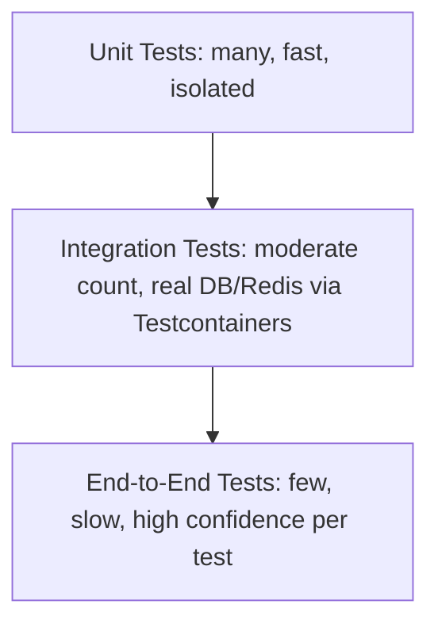

# Zaroorat Engineering Handbook
## Volume 09 — Testing Engineering Handbook

| | |
|---|---|
| **Status** | In progress — delivered in parts |
| **Delivered so far** | Part 1 — Testing Philosophy (Ch. 1–10), Part 2 — Testing Standards (Ch. 11–20), Part 3 — Unit Testing (Ch. 21–30), Part 4 — Integration Testing (Ch. 31–40) |
| **Pending** | Parts 5–16 + Appendix (Ch. 41–~144) |
| **Relationship to other documents** | `VOLUME_01 §47` (Definition of Done) and `§18 Test Cases` in the Module Spec Template already establish that every business rule needs a test. This volume is the deep how-to-test-it reference — the mechanics, tooling, and standards behind that requirement. |

---

# Part 1 — Testing Philosophy

## 1. Testing Philosophy

Tests exist to make change safe (Volume 01 §15), not to satisfy a coverage number. A test suite's real job is: when a future change (by a human or Claude) breaks a business rule, a test fails immediately and specifically — before it reaches a rider, a driver, or a production incident.

#### Summary
The measure of a good test isn't whether it passes today — it's whether it would fail correctly when someone breaks the thing it's protecting.

#### Best Practices
- Before writing a test, ask "what specific way could this be wrong, and would this test catch it?" — a test that would pass regardless of a real bug isn't earning its keep.

#### Common Mistakes
- Writing tests that mirror the implementation so closely they'd pass even if the underlying business logic were subtly wrong (testing that a function was called, not that the right outcome occurred).

#### Testing Checklist
- [ ] Every new test is checked by briefly breaking the code it protects and confirming the test fails

#### Production Checklist
- [ ] Test suite is evaluated periodically for "would this actually catch a real regression," not just for pass/fail status

---

## 2. Why Testing Matters

Restates `VOLUME_05 §1` priority ordering for testing effort specifically: a bug in `payments` or `sos` is categorically more costly than a bug in a cosmetic profile field — testing rigor should scale with that same ordering, not be applied uniformly across the codebase.

#### Summary
Testing effort isn't spread evenly — it's weighted by the same safety/money/data priority that governs every other engineering decision in this handbook.

#### Best Practices
- Allocate proportionally more test-writing time to `rides` state transitions, `payments`, and `sos` than to lower-stakes modules.

#### Common Mistakes
- Treating test coverage percentage as a flat, module-agnostic target, causing a low-stakes module to be over-tested while a high-stakes one is under-tested relative to its actual risk.

#### Testing Checklist
- [ ] `payments`, `rides` state machine, and `sos` have the highest test density in the codebase, verified periodically

#### Production Checklist
- [ ] Test effort allocation is reviewed against Volume 05 §1's priority ordering at each roadmap phase gate

---

## 3. Quality Engineering Principles

1. **Test behavior, not implementation** — a test should survive a refactor that doesn't change observable behavior (Volume 01 §37).
2. **Fast feedback** — the majority of the suite (unit tests, §21) runs in seconds, not minutes, so it's actually run constantly during development.
3. **Deterministic** — the same test, run a thousand times, gives the same result every time (§16); a flaky test is a bug in the test, not an acceptable cost of doing business.
4. **Independent** — a test's outcome never depends on another test having run first, or in a specific order (§15).

#### Summary
These four principles are the lens every subsequent chapter is filtered through — the same "principles first" pattern established in Volumes 01, 02, and 05.

#### Best Practices
- Treat a flaky test as a priority bug, not background noise to be re-run until green.

#### Common Mistakes
- Accumulating a set of "known flaky, just re-run it" tests that erode trust in the whole suite over time (Part 14, once written).

#### Testing Checklist
- [ ] No test in the suite is documented as "known flaky, ignore" — flaky tests are fixed or removed

#### Production Checklist
- [ ] CI fails on any flaky test detection rather than silently retrying past it

---

## 4. Shift Left Testing

Restates `VOLUME_00 §15` (spec-first development): a module's business rules (Volume 00 §4 pattern, Module Spec Template §3) become named test cases (Module Spec Template §18) *before* implementation, not retrofitted afterward. Testing starts at the spec, not at the code review.

#### Summary
"Shift left" here means literally: the test case list is written as part of the spec, before a single line of implementation exists.

#### Best Practices
- Fill in a module's `SPEC.md §18 Test Cases` as a direct enumeration of `§3 Business Rules` and `§6 State Machine` transitions, before writing the corresponding service code.

#### Common Mistakes
- Treating `§18 Test Cases` as a checkbox filled in after the module is already built, missing the actual value of using the test list to clarify ambiguous business rules before they're coded incorrectly.

#### Testing Checklist
- [ ] Every module's `SPEC.md §18` is populated before that module leaves `Draft` status

#### Production Checklist
- [ ] No module reaches `Building` status without a drafted test case list

---

## 5. Testing Pyramid



The classic shape: many fast unit tests, fewer integration tests, very few end-to-end tests. Zaroorat's actual balance is discussed in §6-7 — a modified shape given the layered architecture (Volume 02 Part 2) and the value Testcontainers-backed integration tests provide.

#### Summary
The pyramid establishes the baseline intuition — more tests at the fast, isolated end, fewer at the slow, broad end — which §6-7 then adapt to Zaroorat's specific architecture.

#### Best Practices
- Use the pyramid as a sanity check on the test suite's overall shape periodically — a suite with more E2E tests than unit tests is a red flag worth investigating.

#### Common Mistakes
- An inverted pyramid (many slow E2E tests, few fast unit tests) that makes the suite slow to run and painful to maintain, discouraging engineers from running it frequently.

#### Testing Checklist
- [ ] Test suite composition is periodically reviewed against the intended pyramid/trophy shape (§7)

#### Production Checklist
- [ ] CI run time for the full suite stays within a bounded, fast-feedback-friendly duration as the suite grows

---

## 6. Testing Trophy

An alternative shape (Kent C. Dodds' "testing trophy"): fewer pure unit tests, a larger integration-test middle layer, still a thin E2E layer, plus a small "static" base (TypeScript/Zod's compile-time and validation-time guarantees, Volume 01 §3, §24). Rationale: for a layered, database-backed system like Zaroorat, an integration test (real Postgres via Testcontainers) often gives more confidence per test written than a heavily-mocked unit test of the same code path.

#### Summary
The trophy shape values integration tests more heavily than the classic pyramid, on the reasoning that layered CRUD-adjacent systems get more real confidence per test from integration coverage than from extensively mocked unit tests.

#### Best Practices
- Lean toward integration tests (§31-40) for anything touching the repository/database layer, reserving heavy unit testing specifically for the domain/business-logic layer (Volume 02 §12) where isolated, fast tests genuinely add the most value.

#### Common Mistakes
- Writing a unit test for a repository method that mocks Prisma so extensively the test only proves the mock was called correctly, not that the real query behaves correctly — an integration test would catch far more here.

#### Testing Checklist
- [ ] Repository-layer correctness is validated primarily through integration tests (§32), not extensive Prisma mocking

#### Production Checklist
- [ ] Test suite shape is reviewed against the trophy model, not the pure pyramid, given Zaroorat's layered architecture

---

## 7. Testing Strategy

Mapping Zaroorat's Clean Architecture layers (Volume 02 Part 2) to test types:

| Layer | Primary test type |
|---|---|
| Domain (value objects, state machine logic, Volume 02 §12) | Unit — fast, pure, no I/O |
| Application (services, Volume 02 §13) | Unit, with repository/provider dependencies mocked at their interface boundary (§29-30) |
| Infrastructure (repositories, Volume 02 §14) | Integration — real Postgres/Redis via Testcontainers (§32-35), not mocked |
| Presentation (controllers, routes, Volume 02 §15) | Integration — Supertest against a running Fastify instance (§31), exercising the full stack including real middleware |
| Cross-module flows (a full ride lifecycle) | End-to-end — few, high-value, covering the sequence diagrams established in Volumes 02, 05, 07 |

#### Summary
This table is the master reference for "what kind of test should I write for this code" — every subsequent Part in this volume elaborates on one row.

#### Best Practices
- When unsure what test type a piece of code needs, locate its Clean Architecture layer first (Volume 02 §11), then consult this table.

#### Common Mistakes
- Unit-testing a repository method with heavy mocking instead of integration-testing it against real Postgres, missing real constraint/query-behavior bugs a mock would never surface.

#### Testing Checklist
- [ ] Every module's test suite includes both the unit tests (domain/application layer) and integration tests (infrastructure/presentation layer) this table implies

#### Production Checklist
- [ ] Test-type mapping is referenced explicitly during test-plan review for each module, not assumed implicitly

---

## 8. Test Lifecycle

A test is written from the spec (§4) alongside or slightly before its implementation, run continuously during development (fast unit tests) and in CI (full suite, Volume 01 §46) on every PR, and maintained — updated when the business rule it protects legitimately changes, never just deleted to make a failing suite pass.

#### Summary
A test's life doesn't end at "written once" — it's a living artifact updated in lockstep with the business rule it encodes, the same living-documentation philosophy as the spec itself (Volume 00 §15).

#### Best Practices
- When a business rule changes, update its corresponding test in the same PR — never leave a test asserting the old, now-incorrect behavior "temporarily."

#### Common Mistakes
- Deleting or skipping a failing test to unblock a PR merge, without addressing whether the failure reflects a genuine regression or an intentionally changed business rule.

#### Testing Checklist
- [ ] No test is skipped/deleted in a PR without an explicit explanation of why in the PR description (Volume 01 §35)

#### Production Checklist
- [ ] Test suite changes are reviewed with the same rigor as production code changes (Volume 01 §36)

---

## 9. Definition of Quality

Restates `VOLUME_01 §47`: quality means matching the spec, with every business rule tested, not an abstract coverage percentage. A module with 100% line coverage but no test for its actual `[HARD]` business rules (Volume 00 §4) is lower quality than one with 70% coverage that tests every rule explicitly.

#### Summary
Quality is measured by "does every business rule have a test," not by a raw coverage metric that can be satisfied without testing anything that actually matters.

#### Best Practices
- Review test coverage reports (Part 14, once written) alongside the module's `SPEC.md §3` business rules list, checking rule-by-rule rather than trusting the percentage alone.

#### Common Mistakes
- Chasing a coverage percentage target by testing easy, low-value code paths while leaving a genuinely important business rule branch untested.

#### Testing Checklist
- [ ] Coverage is reviewed rule-by-rule against `SPEC.md §3`, not just as an aggregate percentage

#### Production Checklist
- [ ] No module reaches `Complete` status with an untested `[HARD]` business rule, regardless of its aggregate coverage number

---

## 10. Release Confidence

"Ready to ship" (Volume 01 §46-47's quality gates) means: all tests pass, every business rule for the changed module has a corresponding passing test, and — for `payments`/`rides`/`sos` specifically — an additional manual sanity pass against the relevant sequence diagrams (Volumes 02, 05, 07) before merge, given their priority tier (§2).

#### Summary
Release confidence scales with stakes — the same automated bar applies everywhere, with additional manual scrutiny reserved for the highest-priority modules.

#### Best Practices
- Treat a green CI run as necessary but not sufficient for `payments`/`rides`/`sos` changes — pair it with a deliberate manual review pass against the relevant flow diagrams.

#### Common Mistakes
- Treating "CI is green" as fully sufficient confidence for a change to a safety- or money-adjacent path, skipping the additional manual scrutiny those paths warrant.

#### Testing Checklist
- [ ] `payments`/`rides`/`sos` changes include a documented manual review pass against relevant flow diagrams, beyond automated test results

#### Production Checklist
- [ ] Release confidence criteria are explicit and tiered by module priority, not a single uniform bar

---

# Part 2 — Testing Standards

## 11. Test Naming Conventions

BDD-style, describing behavior: `describe('RideService.cancelRide')` → `it('cancels the ride when within the grace period')` / `it('throws GRACE_PERIOD_EXPIRED when called after the window')`. A test's name alone should describe the business scenario it verifies, readable by someone who's never seen the implementation (Volume 01 §15's clean-code-naming philosophy applied to tests).

#### Summary
A test name is documentation — someone should understand what's being verified from the name alone, without reading the test body.

#### Best Practices
- Name tests after the business scenario ("cancels within grace period"), not the mechanical action ("returns true").

#### Common Mistakes
- Vague test names (`it('works')`, `it('test 1')`) that give no information about what specifically is being verified when the test fails in CI.

#### Testing Checklist
- [ ] Every test name describes a specific business scenario, readable without opening the test body

#### Production Checklist
- [ ] Test naming is checked in code review with the same rigor as production code naming (Volume 01 §14-19)

---

## 12. Folder Structure

Tests live in a `__tests__/` folder colocated within each module (Volume 01 §12's structure), mirroring the module's own file layout: `modules/rides/__tests__/ride.service.test.ts`, `modules/rides/__tests__/ride.controller.test.ts`. No separate top-level `tests/` folder disconnected from the modules it tests.

#### Summary
Test location mirrors module ownership — the same domain-first, not technical-layer-first, organization principle as the rest of the codebase (Volume 01 §12).

#### Best Practices
- Keep a 1:1 naming correspondence between a source file and its test file (`ride.service.ts` ↔ `ride.service.test.ts`) so either can be located from the other instantly.

#### Common Mistakes
- A centralized top-level `tests/` folder disconnected from module structure, making it harder to find a module's tests and encouraging tests to drift out of sync with the code they cover.

#### Testing Checklist
- [ ] Every source file's tests are colocated in that module's `__tests__/` folder with matching filename

#### Production Checklist
- [ ] No orphaned top-level test folder exists disconnected from module structure

---

## 13. Test Organization

Within a test file, `describe` blocks are organized per method/scenario, matching the source file's public methods (Volume 01 §11 service methods) — one top-level `describe` per class/module, nested `describe` per method, `it` blocks per scenario/business rule under that method.

#### Summary
Test file structure mirrors the source file's public API shape — a reviewer can map test organization directly onto the service's method list.

#### Best Practices
- Order `describe`/`it` blocks in the same order as the corresponding service's public methods appear (Volume 01 §11), so the test file reads like a companion document to the source file.

#### Common Mistakes
- Tests added in whatever order they were written, with no structural correspondence to the source file's method organization, making it hard to spot untested methods at a glance.

#### Testing Checklist
- [ ] Test file structure visually corresponds to the source file's public method list

#### Production Checklist
- [ ] A missing `describe` block for a public method is a flag during test review

---

## 14. Test Categories

Tests are tagged/organized by type (unit, integration, e2e) via file naming or a test-runner tag mechanism (Vitest project/tag configuration), so CI can run fast unit tests on every commit and reserve slower integration/e2e runs for PR merge or a scheduled cadence (Volume 01 §46 quality gates, tuned for speed vs. thoroughness trade-off).

#### Summary
Categorization exists specifically to let CI run the right subset at the right time — fast feedback locally and on every push, full rigor before merge.

#### Best Practices
- Configure the fastest test subset (pure unit tests) to run on every local save/commit hook, reserving Testcontainers-backed integration tests for CI or an explicit local command.

#### Common Mistakes
- No test categorization at all, forcing every CI run (including quick iteration commits) to pay the cost of the slowest integration/e2e tests, discouraging frequent runs.

#### Testing Checklist
- [ ] Test suite is categorized such that a fast unit-only subset can run independently of slower integration/e2e tests

#### Production Checklist
- [ ] CI pipeline stages tests by category, with unit tests gating fast and integration/e2e gating the merge itself

---

## 15. Test Isolation

Restates §3 principle 4: no test depends on another test's side effects or execution order. Each integration test creates its own test data (via factories, Part 12 once written) and, where using a shared Testcontainers database, either runs in its own transaction that's rolled back after the test or uses uniquely-generated data (Volume 03 §26's cuid2 IDs make collision-free parallel test data trivial).

#### Summary
Isolation means a test suite can be run in any order, or in parallel, with identical results every time — a structural property, not a hope.

#### Best Practices
- Wrap each integration test in a database transaction that's rolled back at the end (where the test framework/ORM setup supports it), giving isolation without needing a full database reset between every test.

#### Common Mistakes
- Tests that assume a specific pre-existing row or a specific execution order relative to other tests, breaking unpredictably when tests are parallelized or reordered.

#### Testing Checklist
- [ ] Test suite passes identically when run in random order and in parallel

#### Production Checklist
- [ ] CI is configured to run tests in parallel/randomized order specifically to surface isolation violations early

---

## 16. Deterministic Tests

Restates §3 principle 3: no test depends on real wall-clock time (use fake timers for delayed-job tests, Volume 08 §26), unseeded randomness (Faker is always seeded in tests for reproducibility), or external network calls (§40 — external services are always stubbed in tests, never called for real).

#### Summary
A deterministic test gives the same result every single run, on any machine, at any time of day — anything that could introduce variance (time, randomness, network) is controlled.

#### Best Practices
- Seed Faker's random generator with a fixed value in test setup, so a "random" test failure can always be reproduced exactly.

#### Common Mistakes
- A test using real `Date.now()` for time-dependent logic (e.g. testing a grace-period expiry) instead of a fake/mocked clock, causing intermittent failures near time boundaries or when CI runs slower than expected.

#### Testing Checklist
- [ ] No test relies on real system time, unseeded randomness, or a real network call

#### Production Checklist
- [ ] CI flags/investigates any test whose outcome differs across repeated runs with identical inputs

---

## 17. Test Readability

Arrange-Act-Assert structure within every test: set up preconditions (Arrange), perform the action under test (Act), verify the outcome (Assert) — visually separated (blank lines or comments), so a reader can immediately locate each part.

#### Summary
AAA structure is a small, consistent convention that makes every test in the codebase equally easy to scan, regardless of who wrote it.

#### Best Practices
- Keep the Arrange section minimal — use test factories (Part 12, once written) to build preconditions tersely rather than verbose inline object construction repeated across many tests.

#### Common Mistakes
- Tests with Arrange, Act, and Assert logic tangled together with no visual separation, making it harder to quickly understand what's actually being verified.

#### Testing Checklist
- [ ] Every test visibly follows Arrange-Act-Assert structure

#### Production Checklist
- [ ] Test readability is a specific, named review criterion, not left to reviewer discretion alone

---

## 18. Maintainability

A maintainable test survives refactors that don't change behavior (§3 principle 1) — achieved by testing through the service's public interface (Volume 01 §11) rather than reaching into private implementation details, and by mocking only at true architectural boundaries (§29) rather than mocking every internal collaborator.

#### Summary
Maintainability and "testing behavior not implementation" (§3) are the same property, viewed from the angle of "how much does this test break when I refactor without changing behavior."

#### Best Practices
- Write tests against a service's public methods, never against its private helper functions directly.

#### Common Mistakes
- A test that reaches into a service's private internal state or calls a non-exported helper function directly, breaking on every internal refactor even when the service's actual external behavior hasn't changed.

#### Testing Checklist
- [ ] No test imports or calls a non-exported/private implementation detail

#### Production Checklist
- [ ] Test suite survives a deliberate internal-only refactor (no behavior change) without modification, verified periodically

---

## 19. Reusability

Common test setup (creating a test rider, a test ride in a specific state, a valid JWT for a test user) is extracted into shared factories/fixtures (Part 12, once written), reused across unit, integration, and e2e tests rather than duplicated inline in every test file.

#### Summary
Test setup logic is written once per concept (a "test ride factory") and reused everywhere that concept is needed, mirroring the DRY principle (Volume 01 §5) applied to test code.

#### Best Practices
- Build factories that produce valid, realistic default data with overridable fields (`createTestRide({ status: 'cancelled' })`), so most call sites stay terse while still supporting scenario-specific overrides.

#### Common Mistakes
- Copy-pasted, slightly-inconsistent inline object construction repeated across dozens of test files, which drifts out of sync with schema changes and requires updating in many places at once.

#### Testing Checklist
- [ ] Common test data setup uses shared factories, not repeated inline construction

#### Production Checklist
- [ ] A schema change requires updating factories in one place, not every individual test file

---

## 20. Test Review Standards

Restates `VOLUME_01 §36` specifically for test code: a reviewer checks that a new/changed test actually verifies the business rule it claims to (not just that code executes without throwing), that it follows naming/structure conventions (§11-17), and that it would genuinely fail if the protected behavior were broken (§1).

#### Summary
Tests get the same review rigor as production code — arguably more, since a bad test provides false confidence that's worse than no test at all.

#### Best Practices
- As a reviewer, briefly imagine (or actually try) breaking the code under test and confirm the test would catch it, rather than just confirming the test currently passes.

#### Common Mistakes
- Reviewing a test only for style/naming compliance while not verifying it actually exercises the claimed business rule meaningfully.

#### Testing Checklist
- [ ] Test review explicitly checks "would this fail if the behavior were broken," not just "does this pass"

#### Production Checklist
- [ ] Test review is a required, named part of the PR review process (Volume 01 §35-36), not implicit

---

# Part 3 — Unit Testing

## 21. Unit Testing Philosophy

A unit test exercises one function/class in isolation — no real database, no real network call, no real filesystem — fast (milliseconds) and focused on a single unit's logic. Per the testing trophy (§6), unit tests are concentrated most heavily on the Domain and Application layers (Volume 02 §12-13), where pure business logic lives and isolation genuinely adds value.

#### Summary
Unit tests are fast and isolated by definition — any test requiring real I/O is, by this handbook's terminology, an integration test (Part 4), not a unit test.

#### Best Practices
- Keep the full unit test suite fast enough to run on every file save during development — this is what makes "shift left" (§4) actually practical day to day.

#### Common Mistakes
- Labeling a test "unit" while it actually spins up a real database connection, misclassifying it and slowing down what should be the fastest tier of the suite.

#### Testing Checklist
- [ ] No test labeled "unit" makes a real database, Redis, or network call

#### Production Checklist
- [ ] Full unit test suite run time is monitored and kept within a fast-feedback-friendly threshold as the suite grows

---

## 22. Controllers

Restates §7: controllers are thin (Volume 02 §15, §26), so their unit tests are correspondingly light — verifying request-to-service-call translation and response-shaping (Volume 01 §30 envelope), with the service itself mocked at its interface. Deeper controller behavior (real middleware, real routing) is covered by integration tests (§31), not unit tests.

#### Summary
Controller unit tests verify translation logic only — the thinness Volume 02 §15 demands makes this a small, fast, low-maintenance test surface.

#### Best Practices
- Mock the service dependency with a simple stub returning a known value, asserting the controller calls it correctly and shapes the response envelope correctly — nothing more.

#### Common Mistakes
- A bloated controller unit test suite trying to verify business logic that actually belongs to (and is already tested in) the service layer, duplicating test coverage across layers unnecessarily.

#### Testing Checklist
- [ ] Controller unit tests verify only request/response translation, not business logic already covered by service tests

#### Production Checklist
- [ ] Controller test file size/complexity is a signal — an unusually large controller test file may indicate business logic has leaked into the controller (Volume 02 §26)

---

## 23. Services

The heaviest unit-tested layer, since business rules live here (Volume 02 §13, §27) — one test per business rule (Volume 00 §4, Module Spec Template §3) and one test per state machine transition, valid and invalid (Module Spec Template §6), with the repository and any external provider mocked at their interface boundary (§29-30).

#### Summary
Service-layer unit tests are where the bulk of Zaroorat's actual business-rule verification lives — this is the test suite's center of gravity.

#### Best Practices
- Structure service test files with one `describe` block per public method, one `it` per business rule/transition that method enforces, directly traceable to `SPEC.md §3` and `§6`.

#### Common Mistakes
- A service method with five business rules but only one happy-path test, leaving four rules effectively unverified despite the method technically having "a test."

#### Testing Checklist
- [ ] Every service method's tests map 1:1 to its module's `SPEC.md §3` business rules and `§6` state transitions

#### Production Checklist
- [ ] A service method cannot reach `Complete` status (Volume 01 §47) with fewer tests than business rules it's supposed to enforce

---

## 24. Repositories

Per the testing trophy (§6), repositories are primarily verified via integration tests (§32) against real Postgres, not extensive unit-test mocking of Prisma — mocking Prisma's query builder in a unit test mostly proves the mock was called, not that the real query behaves correctly. Unit tests here are reserved narrowly for any non-trivial query-construction *logic* that doesn't itself require hitting a real database (e.g. building a dynamic filter object from input parameters).

#### Summary
Repositories are the clearest case where the trophy shape (favoring integration over unit) beats the classic pyramid — real database behavior is what actually needs verifying here.

#### Best Practices
- Reserve repository "unit" tests for pure logic (query-parameter-object construction), and rely on integration tests (§32) for anything that touches actual data or constraints.

#### Common Mistakes
- Extensively mocking Prisma Client in a "unit test" of a repository method, producing a test that would still pass even if the real query were subtly wrong (e.g. missing the `deletedAt: null` filter, Volume 03 §34).

#### Testing Checklist
- [ ] Repository correctness (including soft-delete filtering, Volume 03 §34) is verified by integration tests, not solely by mocked unit tests

#### Production Checklist
- [ ] No repository method's only test coverage is a heavily-mocked unit test

---

## 25. Validators

Zod schemas (Volume 01 §24, Volume 04 Part 5) are unit tested directly — valid input parses correctly, each invalid case (wrong type, out-of-range value, missing required field) is rejected with the expected error, edge cases (boundary values, empty strings, unexpected extra fields) are explicitly covered.

#### Summary
Validator tests are pure, fast, and high-value — a schema bug caught here prevents an entire category of bad-input bugs from ever reaching the service layer.

#### Best Practices
- Test both the acceptance boundary (e.g. a rating of exactly 1 or exactly 5 passing) and the rejection boundary (0 or 6 failing) explicitly, not just an arbitrary valid/invalid pair.

#### Common Mistakes
- Testing only the clearly-valid and clearly-invalid cases while skipping boundary values, missing off-by-one errors in range validation (Volume 03 §31 check constraints' application-layer counterpart).

#### Testing Checklist
- [ ] Every Zod schema's boundary values (min/max, required/optional) are explicitly tested

#### Production Checklist
- [ ] New validation rules are not merged without a corresponding boundary-value test

---

## 26. Utility Functions

Pure functions (Volume 02 §12 value objects like `Money`, date/formatting helpers) are the cheapest, highest-value unit tests in the codebase — no mocking needed at all, purely input/output verification, including edge cases (`Money` arithmetic precision, timezone-sensitive date calculations per Volume 08 §27).

#### Summary
Pure-function tests are the "free lunch" of the test suite — maximal confidence per line of test code, since there's no I/O or mocking to get wrong.

#### Best Practices
- Test `Money` arithmetic specifically for precision edge cases (rounding behavior at the paisa level, Volume 03 §18) since this is exactly the class of bug value objects exist to prevent.

#### Common Mistakes
- Under-testing a seemingly "simple" utility function (a date calculation, a currency formatter) that turns out to have a subtle edge-case bug precisely because it seemed too trivial to warrant careful testing.

#### Testing Checklist
- [ ] Every value object (`Money`, `Coordinates`) has explicit precision/boundary tests

#### Production Checklist
- [ ] No utility function is exempted from testing on the assumption that it's "too simple to break"

---

## 27. Middleware

Auth (Volume 02 §23), RBAC (Volume 02 §24), and rate-limiting (Volume 04 Part 9) middleware are unit tested in isolation with a mocked Fastify request/reply object — verifying each middleware's specific decision logic (does it correctly reject an invalid token, does it correctly block an unauthorized role) without needing a full running server.

#### Summary
Middleware unit tests verify one decision function in isolation — full end-to-end enforcement (does the whole request pipeline actually block correctly) is separately covered by integration tests (§37-38).

#### Best Practices
- Test each middleware's failure modes exhaustively (missing token, expired token, revoked token, Volume 05 §29) as distinct, named test cases.

#### Common Mistakes
- Testing only the happy path (valid token, authorized role) for security-critical middleware, leaving its actual protective failure modes unverified.

#### Testing Checklist
- [ ] Every auth/RBAC/rate-limit middleware has an explicit test for each of its documented failure modes

#### Production Checklist
- [ ] Middleware unit tests are paired with integration tests (§37-38) confirming end-to-end enforcement, not unit tests alone

---

## 28. Error Handling

Every `AppError` subclass thrown by a service method (Volume 01 §4, §22) has a corresponding test confirming it's thrown under the exact documented condition (Module Spec Template §17 error catalog) — not just that *an* error is thrown, but that it's the *specific, correct* error code and HTTP status.

#### Summary
Error-path tests verify the specific error contract (Volume 04 §29), not just "something failed" — since `error.code` is the stable, client-relied-upon contract.

#### Best Practices
- Assert on the specific `AppError` subclass/code thrown, never just that "an error was thrown" generically.

#### Common Mistakes
- A test asserting only `expect(() => fn()).toThrow()` without checking which specific error was thrown, which would pass even if the wrong error type were returned for a given failure condition.

#### Testing Checklist
- [ ] Every error-path test asserts the specific `AppError` subclass/code, not just "throws"

#### Production Checklist
- [ ] Every entry in a module's `SPEC.md §17 Error Catalog` has a corresponding, specifically-asserting test

---

## 29. Mocking Strategy

Mock only at genuine architectural boundaries — a service's repository dependency, a service's external provider dependency (`PaymentProvider`, `NotificationSender`, Volume 02 §3) — never mock another method on the same class, or a collaborator within the same layer that isn't a true external boundary. This follows directly from Volume 02 §18's manual dependency injection, which makes boundary mocking straightforward by construction.

#### Summary
Mocking boundaries align exactly with the interfaces Volume 02 §18-19 already established for dependency inversion — nothing new to invent, just test against the same seams the architecture provides.

#### Best Practices
- Mock the interface (`PaymentProvider`), never the concrete implementation class, keeping tests decoupled from a specific provider's internal details.

#### Common Mistakes
- Over-mocking — replacing so much of a unit's real collaborators with mocks that the test verifies almost nothing about actual behavior, just that mocked calls happened in a certain order.

#### Testing Checklist
- [ ] Mocks are used only at genuine architectural boundaries (repository, external provider interfaces), not between collaborators in the same layer

#### Production Checklist
- [ ] Test review flags excessive mocking as a maintainability/value concern

---

## 30. Dependency Injection

Restates `VOLUME_02 §18`: because dependencies are passed explicitly via constructor, injecting a mock/fake repository or provider into a service under test is trivial — no DI-container magic or module-mocking tricks needed, just constructing the service with test doubles directly.

```ts
// Illustrative only, per documentation rules
const fakeRepo = { findById: vi.fn().mockResolvedValue(testRide) };
const service = new RideService(fakeRepo, fakePricingService, fakeEventEmitter);
```

#### Summary
Manual constructor injection (Volume 02 §18) isn't just an architectural preference — it's specifically what makes unit testing straightforward without any framework-specific mocking trickery.

#### Best Practices
- Construct the unit under test directly with test doubles in every test's Arrange step, rather than relying on any global mock-replacement mechanism.

#### Common Mistakes
- Reaching for module-level mocking/monkey-patching (replacing an imported singleton) instead of simply constructing the class with injected test doubles — needlessly complex given the DI pattern already in place.

#### Testing Checklist
- [ ] Unit tests construct the class under test with explicit test-double dependencies, not module-level mock replacement

#### Production Checklist
- [ ] No test suite relies on global module mocking where constructor injection would work directly

---

# Part 4 — Integration Testing

## 31. API Integration

Supertest drives real HTTP requests against a running Fastify instance (in-process, not over a real network socket), exercising the full route → middleware → controller → service → repository → real test database path (§32) — verifying the actual wiring, not just each layer in isolation.

#### Summary
API integration tests are the check that all the individually-unit-tested layers actually fit together correctly when wired for real.

#### Best Practices
- Cover at least one full happy-path integration test per endpoint, plus its primary documented error cases (Volume 04 §29, Module Spec Template §17), even though the detailed business-rule branching is already unit-tested at the service layer.

#### Common Mistakes
- Duplicating exhaustive business-rule-branch testing at the integration level that's already thoroughly covered by service unit tests (§23), bloating the slower integration suite unnecessarily — integration tests verify wiring, not re-verify every business rule branch.

#### Testing Checklist
- [ ] Every endpoint has at least one integration test covering its happy path and documented primary error cases

#### Production Checklist
- [ ] Integration test suite run time stays reasonable by not duplicating exhaustive unit-level business-rule coverage

---

## 32. Database Integration

Testcontainers spins up a real, ephemeral PostgreSQL instance per test run (not a mock, not SQLite, not an in-memory substitute) — because Zaroorat relies on Postgres-specific features (native enums, Volume 03 §25; check constraints, Volume 03 §31; foreign key behavior, Volume 03 §28) that a substitute database wouldn't faithfully verify.

| | Testcontainers (real PostgreSQL) | Mocked/in-memory substitute (e.g. SQLite) |
|---|---|---|
| **Benefits** | Tests actual Postgres behavior — constraints, enums, real query semantics | Faster startup, no Docker dependency |
| **Trade-offs** | Slightly slower test startup (container spin-up), requires Docker in CI | Doesn't faithfully verify Postgres-specific features; can pass while the real database would reject the same operation |
| **When to use** | Any test verifying real data persistence/constraint behavior — **Zaroorat's integration tests** | Never for Zaroorat, given reliance on Postgres-specific features |

#### Summary
A substitute database would systematically miss the exact class of bugs (constraint violations, enum handling) that matter most for data integrity (Volume 03 §10) — real Postgres via Testcontainers is worth its modest speed cost.

#### Best Practices
- Run migrations (Volume 03 Part 5, once written) against the Testcontainers instance as part of test setup, so schema drift between test and production is caught immediately.

#### Common Mistakes
- Using an in-memory or alternate database engine for "faster" integration tests, only to discover a Postgres-specific constraint or enum behavior difference in production that tests never had the chance to catch.

#### Testing Checklist
- [ ] All database integration tests run against real PostgreSQL via Testcontainers, never a substitute engine

#### Production Checklist
- [ ] CI environment has Docker available and Testcontainers startup time is monitored as part of overall CI duration

---

## 33. Prisma Testing

The real, generated Prisma Client is used against the Testcontainers PostgreSQL instance (§32) — migrations are applied as part of test setup so the schema under test always matches the actual `schema.prisma`, never a hand-maintained separate test schema that could drift.

#### Summary
Testing with the real Prisma Client against a freshly-migrated real database is what guarantees the test suite reflects the actual production schema at all times.

#### Best Practices
- Run `prisma migrate deploy` (or equivalent) as an automated setup step before the integration test suite runs, never maintaining a manually-written separate test schema.

#### Common Mistakes
- A hand-maintained test database schema that's separate from and drifts out of sync with the real `schema.prisma` over time, causing tests to pass against a schema that no longer matches production.

#### Testing Checklist
- [ ] Integration test database schema is created by running real migrations, never hand-maintained separately

#### Production Checklist
- [ ] A schema migration is verified against the integration test suite before merge, catching drift immediately

---

## 34. Redis Testing

Testcontainers spins up real Redis for integration tests touching caching, idempotency keys (Volume 04 §21), rate limiting (Volume 04 Part 9), or the revocation list (Volume 02 §23) — verifying actual Redis command behavior (TTL expiry, atomic operations) rather than a mocked stand-in that might not faithfully replicate Redis semantics.

#### Summary
Real Redis via Testcontainers is used for the same reason as real Postgres (§32) — Redis-specific behaviors (TTL, atomicity) are exactly what these tests need to verify.

#### Best Practices
- Test TTL-based behavior (idempotency key expiry, revocation list expiry) with a short, test-specific TTL value and a controlled wait/fake-timer approach, rather than a real multi-hour TTL that would make the test impractically slow.

#### Common Mistakes
- Mocking Redis entirely for a test that's specifically meant to verify TTL/expiry behavior, which a mock is unlikely to replicate faithfully without essentially reimplementing Redis's own expiry logic.

#### Testing Checklist
- [ ] TTL-dependent behavior (idempotency, rate limits, revocation) is tested against real Redis with short, test-appropriate TTL values

#### Production Checklist
- [ ] Redis integration tests run in CI against a real Testcontainers Redis instance, not a mock

---

## 35. BullMQ Testing

Integration tests run real BullMQ against the Testcontainers Redis instance (§34) — enqueuing a real job and verifying the real worker processor handles it correctly end-to-end (Volume 08 §14's job lifecycle), including retry behavior (Volume 08 Part 6, once written) with a short, test-tuned backoff rather than mocking the queue mechanism away entirely.

#### Summary
Testing the real BullMQ + Redis integration (rather than mocking the queue) is what actually verifies a job's full lifecycle behaves as Volume 08 specifies.

#### Best Practices
- Use a short test timeout and poll for job completion state, rather than mocking BullMQ's internals, to keep the test both realistic and reasonably fast.

#### Common Mistakes
- Mocking `queue.add()` and directly calling the processor function in the test, which verifies the processor's logic but not the actual queue/retry/DLQ mechanics (Volume 08 Parts 6-7) that are often where real bugs hide.

#### Testing Checklist
- [ ] At least one integration test per queue verifies the full enqueue → process → complete (and enqueue → process → fail → retry) cycle against real BullMQ/Redis

#### Production Checklist
- [ ] Retry and DLQ behavior (Volume 08 Parts 6-7, once written) has dedicated integration test coverage, not just happy-path job processing

---

## 36. Socket.IO Testing

A real Socket.IO client connects to a real (test-instance) Socket.IO server in integration tests, verifying the actual handshake/authentication (Volume 07 §21-22), room-join authorization (Volume 07 §16), and event routing (Volume 07 §19) — not a mocked socket object that wouldn't exercise real connection lifecycle behavior.

#### Summary
Realtime integration tests use real Socket.IO client-server connections specifically because connection lifecycle, auth, and room behavior (Volume 07 Parts 2-4) are exactly what would be missed by mocking the socket layer away.

#### Best Practices
- Test the full authenticate → join room → receive event flow as one integration test per major realtime feature (driver location, ride status, chat), mirroring Volume 07's sequence diagrams.

#### Common Mistakes
- Unit-testing only the event-routing logic (Volume 07 §19) in isolation while never verifying it against a real Socket.IO connection, missing bugs in the actual handshake/room-join wiring.

#### Testing Checklist
- [ ] Each realtime feature has at least one integration test using a real Socket.IO client-server connection, covering auth and room-join

#### Production Checklist
- [ ] Realtime integration tests run against 2+ Socket.IO server instances with the Redis adapter (Volume 07 §10) before first production deployment, not just a single instance

---

## 37. Authentication Testing

A full integration test exercises the actual login sequence (Volume 05 §39's consolidated diagram) end-to-end: OTP request → OTP verify → JWT issuance → using the access token → refresh flow → logout — against real Redis (OTP storage, revocation) and real database (session/refresh token storage), not mocked pieces stitched together.

#### Summary
Authentication's correctness is verified holistically, following Volume 05 §39's diagram exactly, rather than only unit-testing individual pieces (token generation, OTP verification) in isolation.

#### Best Practices
- Build the authentication integration test suite directly from Volume 05 §39's sequence diagram — each arrow becomes a verified step (restates Volume 05 §39's own stated best practice).

#### Common Mistakes
- Only unit-testing JWT signing/verification in isolation, without an integration test confirming the full login-to-authenticated-request flow actually works end-to-end against real infrastructure.

#### Testing Checklist
- [ ] A full login → authenticated request → refresh → logout integration test exists and passes against real Redis/database

#### Production Checklist
- [ ] Token theft/reuse detection (Volume 05 §28) has a dedicated integration test simulating a replayed refresh token

---

## 38. Authorization Testing

Integration tests specifically verify that RBAC and resource-ownership checks (Volume 02 §24, Volume 05 Part 6 once written) actually block unauthorized requests at the HTTP level — a rider attempting to cancel another rider's ride should receive a real 403 from a real running instance, not just have that logic unit-tested in isolation.

#### Summary
Authorization tests confirm the protection actually holds end-to-end, since a unit-tested permission-check function that's accidentally never called in the real request path would otherwise go undetected.

#### Best Practices
- Write a negative-case integration test ("user without permission gets blocked") for every permission rule stated in a module's `SPEC.md §16`, not just positive-case tests confirming authorized access works.

#### Common Mistakes
- Testing only that an authorized user *can* perform an action, without a corresponding test confirming an unauthorized user genuinely *cannot* — the negative case is the one that actually catches a missing permission check.

#### Testing Checklist
- [ ] Every permission rule in `SPEC.md §16` has both a positive (authorized succeeds) and negative (unauthorized blocked) integration test

#### Production Checklist
- [ ] Negative-case authorization tests are treated as equally mandatory as positive-case tests, not optional

---

## 39. File Storage Testing

MinIO runs via Testcontainers for integration tests covering the presigned-URL upload flow (Volume 04 §26) — generating a real presigned URL, uploading a test file directly to it, and confirming the API's "confirm" step correctly detects and records the uploaded file's metadata.

#### Summary
The presigned-URL flow's correctness (a multi-step, client-involved process) is verified end-to-end against a real MinIO instance, not assumed from unit-testing URL-generation logic alone.

#### Best Practices
- Test the failure case too — a "confirm" call for a file that was never actually uploaded should be correctly rejected, not silently accepted.

#### Common Mistakes
- Only testing presigned URL *generation* in isolation, never verifying the full generate → upload → confirm cycle actually works against a real object store.

#### Testing Checklist
- [ ] The full presigned URL generate → upload → confirm cycle has an integration test against real Testcontainers MinIO

#### Production Checklist
- [ ] The "confirm without real upload" failure case has explicit test coverage

---

## 40. External Services

Third-party services (payment gateway, SMS provider, maps provider) are **never called for real in tests** — stubbed/mocked at the integration boundary (via Mock Service Worker or an equivalent HTTP-level stub) so tests are deterministic (§16), fast, free, and don't depend on a third party's uptime or sandbox environment availability.

#### Summary
External-service calls are the one place mocking is not just acceptable but required in integration tests — real third-party calls would violate determinism, speed, and cost principles all at once.

#### Best Practices
- Stub external services at the HTTP boundary (the actual network call), not by mocking Zaroorat's own `PaymentProvider`/`NotificationSender` interface implementation, so the test still exercises real request-building/response-parsing logic on Zaroorat's side.

#### Common Mistakes
- Occasionally calling a real third-party sandbox/test environment from CI "since it's just a test account," introducing flakiness (§16) and a dependency on that third party's own uptime for Zaroorat's CI to pass.

#### Testing Checklist
- [ ] No test suite makes a real network call to any third-party service, including sandbox/test accounts

#### Production Checklist
- [ ] External service stubs are maintained to reflect the real provider's actual response shapes, reviewed whenever the provider's API changes

---

## Change Log

| Date | Change |
|---|---|
| (start) | Parts 1–4 (Ch. 1–40) delivered. Parts 5–16 + Appendix (Ch. 41–~144) pending. |
