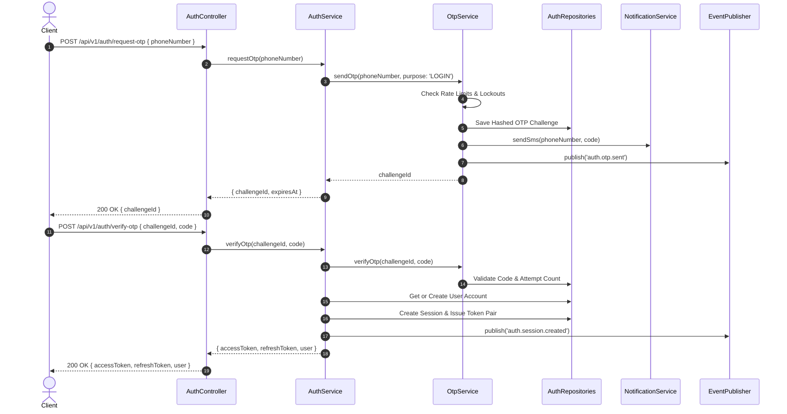

# AUTH Module

The **AUTH Module** (`src/modules/auth/`) provides authentication, OTP challenge management, JWT token issuance & rotation, multi-device session tracking, and role-based access control (RBAC).

---

## 1. Responsibilities

- **OTP Lifecycle Management**: Phone number challenge generation (6-digit HMAC-hashed OTPs), 5-minute TTL, attempt lockout thresholds, resend interval limits, and SMS provider dispatching via `NotificationService`.
- **Identity & Registration**: Self-service user creation, phone uniqueness checks, and role mapping (`RIDER`, `DRIVER`, `OPERATOR`, `ADMIN`).
- **Session & Device Binding**: Concurrent session caps per user account, device context tracking (`REGISTERED`, `TRUSTED`, `SUSPICIOUS`, `REVOKED`), and single-session / global logout.
- **JWT & Refresh Tokens**: Dual-token issuance (short-lived access tokens, long-lived refresh tokens), cryptographically enforced epoch revocation (`authEpoch`), token family reuse detection, and automatic key rotation.
- **HTTP Transport Adapter (`http/`)**: Exposes Fastify controllers, route definitions (`/api/v1/auth`), Zod input schemas, and standardized error response envelopes.

---

## 2. Directory Structure

```
src/modules/auth/
│
├── controllers/          # Fastify HTTP controllers (auth.controller.ts)
├── routes/               # Fastify route registrations (auth.routes.ts)
├── schemas/              # Zod schemas (auth.schemas.ts), Response DTOs & error envelopes
├── services/             # Domain business services
│   ├── auth.service.ts   # Core orchestrator service (login, verify, refresh, logout)
│   ├── otp/              # OTP generator, hasher, validator, rate limiter & service
│   ├── session/          # Session management, device context tracking & metrics
│   ├── token/            # JWT signing, refresh token rotation & epoch management
│   └── index.ts
│
├── repositories/         # Database access repositories
│   ├── user.repository.ts
│   ├── otp.repository.ts
│   ├── session.repository.ts
│   ├── refresh-token.repository.ts
│   ├── role.repository.ts
│   ├── permission.repository.ts
│   ├── device.repository.ts
│   ├── driver-access.repository.ts
│   └── index.ts
│
├── http/                 # Transport adapter layer re-exporting controllers/routes/schemas
│   └── index.ts
│
├── metrics/              # Observability & Prometheus metrics emitters
│   ├── otp.metrics.ts
│   ├── session.metrics.ts
│   └── index.ts
│
├── plugins/              # Fastify auth plugin wrappers (auth.plugin.ts)
├── events/               # Event catalog definitions (auth.otp.sent, auth.session.created, etc.)
├── errors/               # Domain errors (AuthError, InvalidCredentialsError, etc.)
├── constants/            # Compile-time constants (auth.constants.ts)
├── types/                # TypeScript domain models (auth.types.ts)
├── utils/                # (empty) — phone validation lives in @shared/validation, shared with USER
├── index.ts              # Entry point & DI container registration
└── README.md             # Module production documentation
```

---

## 3. Public APIs

### HTTP API Endpoints (`/api/v1/auth`)

| Method | Endpoint       | Description                                   | Security / Headers   |
| ------ | -------------- | --------------------------------------------- | -------------------- |
| `POST` | `/request-otp` | Initiate OTP login challenge                  | Rate-Limited         |
| `POST` | `/verify-otp`  | Verify OTP code & issue token pair            | Rate-Limited         |
| `POST` | `/refresh`     | Rotate refresh token & issue new pair         | Refresh Token Header |
| `POST` | `/logout`      | Revoke current session & refresh tokens       | Bearer Auth          |
| `POST` | `/logout-all`  | Revoke all active sessions (bump `authEpoch`) | Bearer Auth          |

---

## 4. Dependencies & Policies

- **Centralized Configuration** (`src/config/`):
  - [`jwtConfig`](file:///c:/Users/Zaroorat/OneDrive/Desktop/backend_zaroorat/src/config/jwt/jwt.config.ts): JWT secrets, access token TTL (15m), refresh token TTL (7d).
  - [`otpConfig`](file:///c:/Users/Zaroorat/OneDrive/Desktop/backend_zaroorat/src/config/otp/otp.config.ts): 6-digit code length, 300s TTL, max 3 attempts per challenge, rate limit axes.
  - [`sessionConfig`](file:///c:/Users/Zaroorat/OneDrive/Desktop/backend_zaroorat/src/config/session/session.config.ts): Concurrency cap per account (5 active sessions), device trust policies.
- **REDIS Service**: Session revocation lists, rate limiting buckets, and challenge caching.
- **NOTIFICATION Service**: SMS transport delivery for OTP challenges.

### 4.1 Account state on login

`POST /otp/verify` refuses any account that is not `ACTIVE`, **after** first-login
promotion (`UNVERIFIED` + a verified number becomes `ACTIVE`; that is what proving
control of the number means). A closed account gets no session and no token pair:

| State                 | Result                              |
| --------------------- | ----------------------------------- |
| `ACTIVE`              | Tokens issued                       |
| `UNVERIFIED`          | Promoted to `ACTIVE`, tokens issued |
| unknown number        | Registered, tokens issued           |
| `DEACTIVATED`         | `403 ACCOUNT_DEACTIVATED`           |
| `SUSPENDED`           | `403 ACCOUNT_SUSPENDED`             |
| soft-deleted / erased | `403 ACCOUNT_SUSPENDED`             |

A refused login **never reactivates the account**. Returning a closed account to
service is `AccountService.restore`, because only that path also cancels the
pending deletion request — a login that silently flipped the status back would
leave the erasure scheduled against an account in daily use.

`/otp/send` is deliberately uniform across all of these: the state is only
revealed once the caller has proved control of the number.

### 4.2 Device lifecycle

`REVOKED` means _this device's current trust and sessions are revoked_ — not that
the handset is permanently blocked. Revoking ends every session bound to it, and
the device returns to `REGISTERED` only by completing a **fresh OTP verification**
(R-DEVICE-3 / AUTH-INV-6; `DeviceService.register`). It cannot restore itself
with a token it already holds. Tested in
`tests/integration/auth-devices.test.ts`.

Device integrity (`is_rooted` / `is_jailbroken`) is captured at every login and
enforced per action by `authorize({ requireUntamperedDevice: true })`, never in
the token. The v1 policy (auth doc 02 §5.2) is _capture, allow ordinary use, deny
the sensitive subset_, and **each module names its own sensitive actions**. The
phone-number change is the entire list today.

### 4.3 Guards reserved for modules that do not exist yet

`authorize({ roles })` and `requireOperableDriver` currently have no callers.
They are the seams the `admin` and `driver` modules will use (auth doc 04 §3) and
are covered by `tests/integration/auth-driver-gate.test.ts` and
`auth-roles.test.ts`. Do not delete them as dead code.

---

## 5. Domain & Audit Events

Published via `EventPublisher` under producer `auth`:

| Event Name             | Classification  | Description                                           |
| ---------------------- | --------------- | ----------------------------------------------------- |
| `auth.otp.requested`   | `observability` | OTP challenge requested for phone number              |
| `auth.otp.sent`        | `domain`        | OTP challenge dispatched via notification provider    |
| `auth.otp.verified`    | `audit`         | OTP verified successfully                             |
| `auth.session.created` | `audit`         | New session opened and token pair issued              |
| `auth.session.revoked` | `audit`         | Single session explicitly terminated                  |
| `auth.session.evicted` | `audit`         | Oldest session evicted due to concurrency cap         |
| `auth.logout.all`      | `audit`         | All sessions invalidated via `authEpoch` bump         |
| `auth.token.reused`    | `security`      | Refresh token family reuse attempt detected & blocked |

---

## 6. Sequence Diagrams

### 6.1 OTP Authentication Flow


