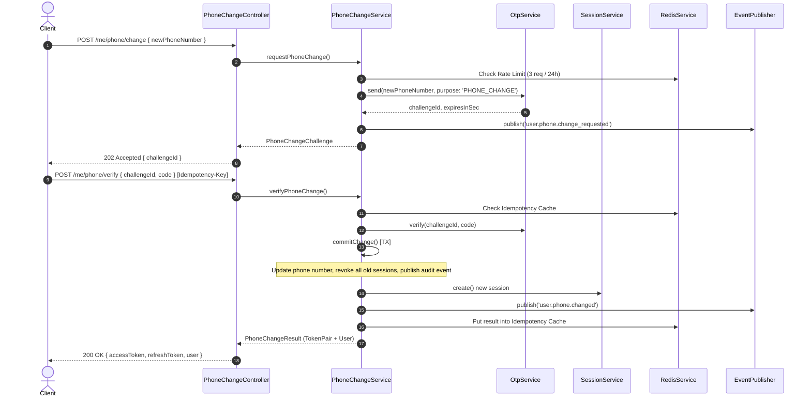

# USER Module

The **USER Module** (`src/modules/users/`) provides self-service user profile, emergency contact, saved place, phone number change, and compliance-driven account lifecycle (deactivation & DPDP/GDPR account erasure) management.

---

## 1. Responsibilities

- **User Identity & Profile Projection**: Self-service user account view (`GET /me`) and profile partial updates (`PATCH /me/profile`), including profile image attachment via `FileService`.
- **Phone Re-Binding**: 2-step OTP phone number updates (`POST /me/phone/change`, `POST /me/phone/verify`), session revocation, token re-issuance, per-account rate limiting, and idempotency protection.
- **Emergency Contacts**: Trusted contact management for safety and SOS flows with hard limit caps.
- **Saved Places**: Frequently visited locations (Home, Work, Favorites) with paired coordinate validation and hard limit caps.
- **Account Lifecycle & Departure**: Account deactivation, obligations check (active rides, wallet balances, open disputes), 30-day retention deletion requests, and admin restores.
- **Data Erasure (DPDP/GDPR)**: Single-runner background job discharging due deletion requests, scrubbing third-party personal data, releasing avatars, and anonymizing core identity records to preserve append-only financial/safety history.

---

## 2. Directory Structure

```
src/modules/users/
│
├── controllers/                  # Fastify HTTP controllers
│   ├── account.controller.ts     # Deactivation & deletion endpoints
│   ├── emergency-contact.controller.ts # Emergency contacts CRUD
│   ├── phone-change.controller.ts# 2-step phone change endpoints
│   ├── profile.controller.ts     # getMe and updateProfile
│   ├── saved-place.controller.ts # Saved places CRUD
│   ├── user.controller.ts        # Aggregator controller
│   └── index.ts
│
├── routes/                       # Fastify route registration
│   ├── user.routes.ts            # Base path /api/v1/users
│   └── index.ts
│
├── schemas/                      # Zod validation, response DTOs & error envelopes
│   ├── error-response.ts         # User error envelope and HTTP status mappers
│   ├── user.responses.ts         # View interfaces (UserAccountView, UserProfileView, etc.)
│   ├── user.schemas.ts           # Zod body and path validation schemas
│   └── index.ts
│
├── services/                     # Domain services grouped by business concern
│   ├── account/                  # AccountService, deactivation & erasure logic
│   ├── emergency-contact/        # EmergencyContactService & limit checks
│   ├── phone/                    # PhoneChangeService, E.164 validator & rate limiters
│   ├── profile/                  # UserService profile projection & avatar attachment
│   ├── saved-place/              # SavedPlaceService & coordinate validators
│   ├── user.service.ts           # Core aggregated User service
│   └── index.ts
│
├── repositories/                 # Database access repositories
│   ├── deletion-request.repository.ts
│   ├── emergency-contact.repository.ts
│   ├── obligation.repository.ts # Open obligations check (rides, wallet, support)
│   ├── saved-place.repository.ts
│   ├── user-profile.repository.ts
│   ├── user.repository.ts        # Re-export from auth repositories
│   └── index.ts
│
├── jobs/                         # Background workers
│   ├── account-erasure.job.ts   # AccountErasureJob for due deletion requests
│   └── index.ts
│
├── metrics/                      # Prometheus / Observability metrics
│   ├── user.metrics.ts           # UserMetrics counter & histogram emitters
│   └── index.ts
│
├── plugins/                      # Fastify plugin definitions
│   ├── user.plugin.ts            # Fastify plugin for user route registration
│   └── index.ts
│
├── events/                       # Event catalogue & publisher helpers
│   ├── catalog.ts                # USER_EVENT_CATALOG definitions
│   └── index.ts
│
├── errors/                       # Custom domain error classes
│   ├── user.errors.ts            # UserError, ImmutableFieldError, UserNotFoundError, etc.
│   └── index.ts
│
├── constants/                    # Module constants
│   ├── user.constants.ts         # Immutable profile fields, purpose strings, limits
│   └── index.ts
│
├── config/                       # Policy and environment configuration
│   ├── user.config.ts            # userConfig settings (caps, retention days, cron)
│   └── index.ts
│
├── types/                        # Prisma entity re-exports
│   ├── user.types.ts             # UserProfile, EmergencyContact, SavedPlace
│   └── index.ts
│
├── utils/                        # Pure utility functions
│   ├── phone.util.ts             # maskPhone utility
│   ├── profile.util.ts           # ageInYears, parseDateOnly, toDateOnly
│   └── index.ts
│
├── index.ts                      # Module entry point & DI container registration
└── README.md                     # Production module documentation
```

---

## 3. Public APIs

### HTTP API Endpoints (`/api/v1/users`)

| Method   | Endpoint                     | Description                                       | Security / Headers                                |
| -------- | ---------------------------- | ------------------------------------------------- | ------------------------------------------------- |
| `GET`    | `/me`                        | Get current user profile, account state & roles   | Bearer Auth                                       |
| `PATCH`  | `/me/profile`                | Update partial profile details                    | Bearer Auth                                       |
| `POST`   | `/me/phone/change`           | Request OTP challenge to change phone number      | Bearer Auth, Untampered Device                    |
| `POST`   | `/me/phone/verify`           | Verify OTP challenge & issue new tokens           | Bearer Auth, Untampered Device, `Idempotency-Key` |
| `GET`    | `/me/emergency-contacts`     | List user emergency contacts                      | Bearer Auth                                       |
| `POST`   | `/me/emergency-contacts`     | Add emergency contact (max 5)                     | Bearer Auth                                       |
| `PATCH`  | `/me/emergency-contacts/:id` | Update emergency contact by ID                    | Bearer Auth                                       |
| `DELETE` | `/me/emergency-contacts/:id` | Delete emergency contact by ID                    | Bearer Auth                                       |
| `GET`    | `/me/saved-places`           | List user saved locations                         | Bearer Auth                                       |
| `POST`   | `/me/saved-places`           | Add saved place (max 20)                          | Bearer Auth                                       |
| `PATCH`  | `/me/saved-places/:id`       | Update saved place by ID                          | Bearer Auth                                       |
| `DELETE` | `/me/saved-places/:id`       | Delete saved place by ID                          | Bearer Auth                                       |
| `POST`   | `/me/deactivate`             | Self-deactivate account                           | Bearer Auth                                       |
| `POST`   | `/me/delete-request`         | Request permanent account deletion (30-day grace) | Bearer Auth                                       |

---

## 4. Dependencies & Policies

- **AUTH Module**: Authenticates bearer tokens, manages identity records (`users` table), and issues session token pairs.
- **FILES Module**: Owns profile image file reference assertions and object retention (`PROFILE_IMAGE` category).
- **REDIS Service**: Handles rate limiting (`user:phone_change`), idempotency caching, and distributed locking (`user:erasure`).
- **Configuration Policies** (`userConfig`):
  - `minimumAgeYears`: 16 years.
  - `supportedLanguageCodes`: `en`, `hi`.
  - `maxEmergencyContacts`: 5.
  - `maxSavedPlaces`: 20.
  - `phoneChangeRequestLimit`: 3 requests per 24 hours per user.
  - `deletionRetentionDays`: 30 days.

### 4.1 Departure is operator-reversible, not self-service

`AccountService.restore` cancels a pending deletion request and returns the
account to `ACTIVE`. **It has no HTTP route, and that is the policy, not an
omission.** A deactivated account cannot authenticate (see AUTH README §4.1), so
no authenticated call by its owner could ever reach such an endpoint — the
`users:suspend` scope that guards it, and the `admin_activity_logs` row it must
write, belong to the `admin` module (R-USER-17). Until that module exists the
seam is exercised through the container in `tests/integration/user-departure.test.ts`.

The practical consequence, which support needs to know: the 30-day window before
erasure is **real but operator-actioned**. A user who changes their mind must ask
support; they cannot undo it themselves.

### 4.2 Lifecycle transitions are serialized on the user row

`deactivate`, `requestDeletion`, and `restore` all run as:

```
BEGIN → SELECT … FOR UPDATE (user row) → read state → check obligations → transition → audit → COMMIT → bump epoch
```

The lock comes first, and every read that decides the outcome uses the same
transaction. `/me/deactivate` and `/me/delete-request` are separate endpoints
driving one state machine; reading status or obligations on the pooled client
first let two concurrent calls both see `ACTIVE` and both proceed, auditing one
departure twice.

The obligation read is _not_ a full guarantee against a concurrent cross-module
write (rides/wallet/support committing an obligation mid-transaction would need
`SERIALIZABLE` isolation to catch). That is why `AccountErasureJob` re-runs the
identical check 30 days later, before it destroys anything.

### 4.3 Device integrity on departure

`/me/phone/change` and `/me/phone/verify` require an untampered device;
`/me/deactivate` and `/me/delete-request` do not. This follows auth doc 04 §3:
each module names its own sensitive actions, and the phone change is the only one
in v1. Extending the list to departure is a security-policy decision, not a code
cleanup — the argument for it is that erasure is irreversible; the argument
against is that a user on a rooted handset still has the right to leave.

---

## 5. Domain & Audit Event Catalogue

Published via `EventPublisher` using producer `users`:

| Event Name                        | Classification  | Description                                       |
| --------------------------------- | --------------- | ------------------------------------------------- |
| `user.profile.created`            | `domain`        | User profile row initialized                      |
| `user.profile.updated`            | `domain`        | User profile fields modified (field names only)   |
| `user.phone.change_requested`     | `observability` | OTP challenge requested for new phone number      |
| `user.phone.changed`              | `audit`         | Phone number updated, old sessions revoked        |
| `user.account.deactivated`        | `audit`         | Account status set to DEACTIVATED                 |
| `user.account.deletion_requested` | `audit`         | Deletion request opened (scheduled date recorded) |
| `user.account.restored`           | `audit`         | Self-deactivated account restored by admin        |
| `user.account.erased`             | `audit`         | Account PII scrubbed & identity anonymized        |
| `user.emergency_contact.added`    | `domain`        | Emergency contact added                           |
| `user.emergency_contact.updated`  | `domain`        | Emergency contact updated                         |
| `user.emergency_contact.removed`  | `domain`        | Emergency contact removed                         |
| `user.saved_place.added`          | `domain`        | Saved place added                                 |
| `user.saved_place.updated`        | `domain`        | Saved place updated                               |
| `user.saved_place.removed`        | `domain`        | Saved place removed                               |

---

## 6. Sequence Diagrams

### 6.1 Two-Step Phone Number Change Workflow



### 6.2 Account Erasure Job Workflow (DPDP Compliance)

```mermaid
sequenceDiagram
    autonumber
    participant Cron as AccountErasureJob
    participant Redis as Redis Lock
    participant Obligation as ObligationRepository
    participant Repos as User & Profile Repos
    participant File as FileService
    participant Event as EventPublisher

    Cron->>Redis: Acquire Lock ('user:erasure')
    Cron->>Repos: findDue(now, batchSize: 100)
    loop For each due request
        Cron->>Obligation: findOpenObligations(userId)
        alt Open obligations exist
            Cron->>Cron: Mark BLOCKED (retry next run)
        else No obligations
            Cron->>Repos: scrub(userId) [TX]
            Note over Repos: Delete emergency contacts, saved places, profile row; Anonymize user row
            Cron->>File: remove(avatarFileId)
            Cron->>Repos: markErased(requestId) [TX]
            Cron->>Event: publish('user.account.erased')
        end
    end
    Cron->>Redis: Release Lock
```
